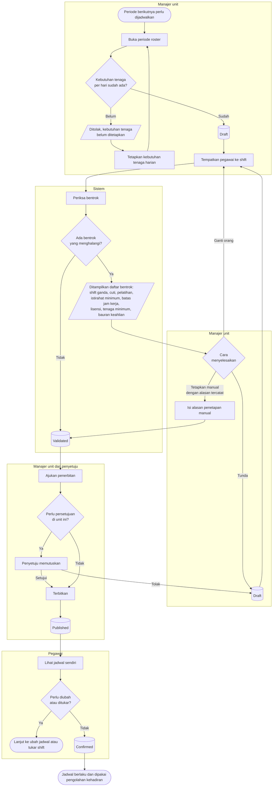

# Penjadwalan Kerja

| Field | Value |
| --- | --- |
| Blueprint ID | `HRD-BP-001` |
| Jenis | Flowchart proses |
| Slice | `S-B4` penjadwalan kerja |
| Status | `draft` |
| Kesiapan | `READY FOR DESIGN` |

---

## 1. Apa yang dijawab berkas ini

Bagaimana jadwal kerja satu unit disusun untuk satu periode, diperiksa terhadap bentrok, lalu
diterbitkan sehingga pegawai dapat melihatnya.

**Kenyataan yang harus dibaca lebih dulu.** Tabel untuk roster, shift harian, penggantian, tenaga
darurat, dan siaga **sudah ada lengkap** di basis data. Yang belum ada adalah **perilakunya** —
tidak ada satu pun jalur yang menjalankan penjadwalan operasional hari ini. Untuk rumah sakit
yang berjalan 24 jam, ini adalah celah terbesar di seluruh modul HR.

Karena itu diagram di bawah adalah **rancangan target**, bukan gambaran keadaan sekarang.

## 2. Diagram

## 3. Tabel langkah

| Langkah | Pelaku | Masukan yang dibutuhkan | Keluaran | Bila gagal |
| --- | --- | --- | --- | --- |
| Buka periode roster | Manajer unit | Rentang tanggal; unit; kebijakan roster dan istirahat minimum | Periode roster berstatus `Draft` | Ditolak bila kebutuhan tenaga harian belum ditetapkan. Manajer menetapkannya lebih dulu |
| Tetapkan kebutuhan tenaga harian | Manajer unit | Jumlah dan bauran keahlian yang dibutuhkan per shift | Kebutuhan tenaga tersimpan | Tidak terbentuk bila master shift dan keahlian belum terisi. HR melengkapi master lebih dulu |
| Tempatkan pegawai ke shift | Manajer unit | Daftar pegawai unit; shift yang tersedia | Penempatan shift berstatus `Draft` | Penempatan tidak tersimpan. Manajer memilih pegawai atau shift lain |
| Periksa bentrok | Sistem | Seluruh penempatan pada periode itu | Penempatan berstatus `Validated`, atau daftar bentrok | Bentrok yang menghalangi ditampilkan. Manajer menyelesaikannya atau menetapkan manual dengan alasan |
| Tetapkan manual dengan alasan | Manajer unit | Alasan yang wajib diisi | Penempatan `Validated` meski ada bentrok yang tercatat | Ditolak bila alasan kosong. Manajer mengisinya |
| Ajukan penerbitan | Manajer unit | Seluruh penempatan sudah `Validated` | Pengajuan penerbitan | Ditolak bila masih ada penempatan yang belum lolos pemeriksaan |
| Putuskan penerbitan | Penyetuju | Roster yang diajukan | Roster disetujui atau dikembalikan | Bila dikembalikan, roster kembali `Draft`. Manajer memperbaikinya |
| Terbitkan | Manajer unit | Roster yang sudah disetujui | Penempatan berstatus `Published` | Penerbitan gagal. Manajer mengulang setelah penyebabnya diperbaiki |
| Lihat jadwal sendiri | Pegawai | Jadwal yang sudah `Published` | Pegawai mengetahui jadwalnya | Jadwal belum terbit. Pegawai menghubungi manajernya |

## 4. Jalur pengecualian yang paling sering ditemui

| Keadaan | Apa yang petugas lakukan |
| --- | --- |
| Pegawai dijadwalkan pada hari ia sedang cuti | Bentrok cuti ditampilkan. Manajer mengganti orangnya |
| Jarak antar shift kurang dari istirahat minimum | Bentrok istirahat minimum ditampilkan. Manajer menggeser shift atau mengganti orang |
| Tenaga di bawah jumlah minimum unit | Bentrok tenaga minimum ditampilkan. Manajer menambah orang, atau mengajukan tenaga darurat |
| Lisensi profesi pegawai tidak memenuhi syarat shift | Bentrok lisensi ditampilkan. **Manajer MUST NOT menetapkan manual untuk melewatinya** — lihat batas di bawah |
| Jadwal harus diubah setelah terbit | Lewat permohonan ubah jadwal, bukan dengan menyunting jadwal terbit; lihat [`ubah-jadwal-dan-tukar-shift.md`](./ubah-jadwal-dan-tukar-shift.md) |

## 5. Batas yang tidak boleh dilanggar

| Larangan | Sebabnya |
| --- | --- |
| Jadwal kerja yang sudah berlaku surut **MUST NOT** disunting langsung | Kehadiran pada periode yang sudah diproses akan dihitung ulang dengan jadwal yang berbeda — `HRD-DEC-027` |
| Bentrok lisensi dan kewenangan klinis **MUST NOT** dilewati dengan penetapan manual | Batas kewenangan klinis milik Komite Medik, bukan manajer unit. `S-C1` `BLOCKED` — `HRD-Q-08` |
| Jadwal kerja **MUST NOT** dijadikan sumber kebenaran jadwal praktik dokter untuk pendaftaran pasien | `HRD-DEC-006` memisahkan keduanya. Jadwal praktik milik Health Services |
| Skema baru **MUST NOT** dibuat sebelum tabel roster yang sudah ada diaudit satu per satu | `HRD-DEC-026`. `HRD-Q-05` wajib terjawab lebih dulu bila perubahan yang merusak data diperlukan |

## 6. Traceability

| Aturan | Decision | Kontrak | Acceptance test |
| --- | --- | --- | --- |
| Arah `EXTEND` untuk roster dan shift harian | `HRD-DEC-026` | `../contracts/state-transition-matrix.md` §4.4 | `AT-HRD-B4-01` |
| Larangan menyunting jadwal berlaku surut | `HRD-DEC-027` | `../contracts/validation-matrix.md` | `AT-HRD-B4-02` |
| Pemisahan jadwal kerja dan jadwal praktik | `HRD-DEC-006` | `../contracts/integration-contract.md` | `AT-HRD-B4-03` |
| Bentrok lisensi tidak boleh dilewati | `S-C1` `BLOCKED`, `HRD-Q-08` | `../data/data-dictionary.md` §2.6 | **Belum dapat diuji.** `BLOCKED` |
