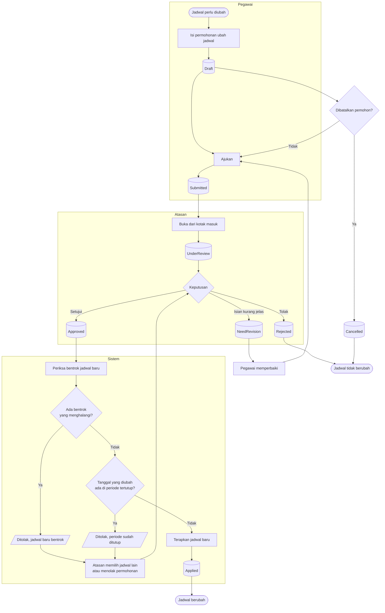
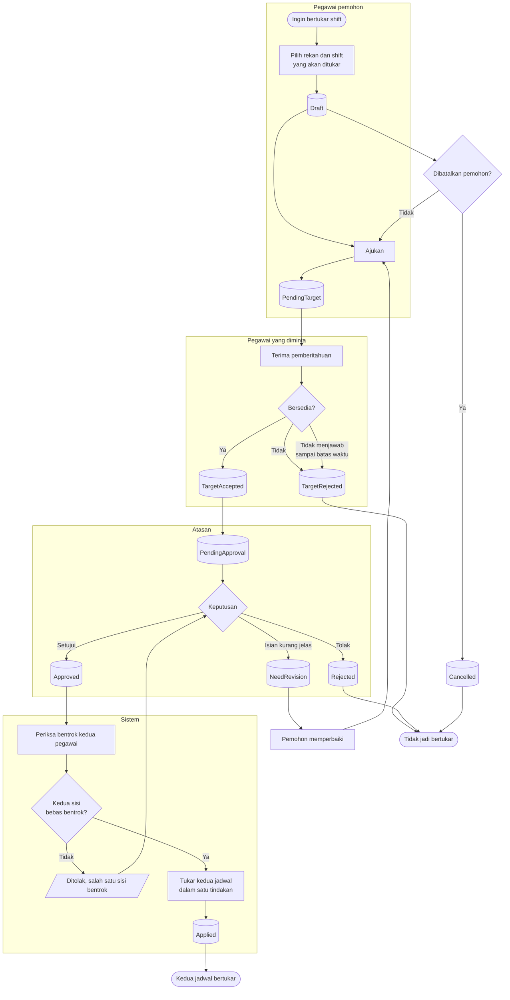

# Ubah Jadwal dan Tukar Shift

| Field | Value |
| --- | --- |
| Blueprint ID | `HRD-BP-001` |
| Jenis | Flowchart proses |
| Slice | `S-A4` layanan mandiri jadwal, `S-B4` penjadwalan kerja |
| Status | `draft` |
| Kesiapan | `READY FOR DESIGN` |

---

## 1. Apa yang dijawab berkas ini

Dua proses yang tampak mirip tetapi berbeda pada satu hal yang menentukan:

| Proses | Yang membedakan |
| --- | --- |
| **Ubah jadwal** | Hanya melibatkan **satu** pegawai. Ia meminta jadwalnya sendiri diubah |
| **Tukar shift** | Melibatkan **dua** pegawai. Yang diminta harus setuju lebih dulu, sebelum atasan memutuskan |

Perbedaan itulah sebabnya keduanya digambar dalam satu berkas: agar tidak ada yang merancang
tukar shift sebagai ubah jadwal dengan dua baris.

## 2. Diagram — Ubah jadwal

## 3. Diagram — Tukar shift

## 4. Tabel langkah — Ubah jadwal

| Langkah | Pelaku | Masukan yang dibutuhkan | Keluaran | Bila gagal |
| --- | --- | --- | --- | --- |
| Isi permohonan ubah jadwal | Pegawai | Tanggal; jadwal sekarang; jadwal yang diinginkan; alasan | Permohonan berstatus `Draft` | Permohonan tidak terbentuk. Pegawai melengkapi isian |
| Ajukan | Pegawai | Permohonan `Draft` yang lengkap | Permohonan berstatus `Submitted` | Ditolak bila tanggalnya sudah lewat atau periodenya tertutup |
| Putuskan permohonan | Atasan | Kotak masuk berisi permohonan yang ditugaskan kepadanya | `Approved`, `Rejected`, atau `NeedRevision` | Ditolak bila alasan wajib tidak diisi |
| Terapkan jadwal baru | Sistem | Permohonan `Approved`; jadwal baru bebas bentrok | Permohonan `Applied`; jadwal berubah | Ditolak karena bentrok atau periode tertutup. Atasan memilih jadwal lain atau menolak permohonan |

## 5. Tabel langkah — Tukar shift

| Langkah | Pelaku | Masukan yang dibutuhkan | Keluaran | Bila gagal |
| --- | --- | --- | --- | --- |
| Pilih rekan dan shift | Pegawai pemohon | Jadwal sendiri; jadwal rekan; alasan | Permohonan berstatus `Draft` | Permohonan tidak terbentuk. Pemohon memilih shift lain |
| Ajukan | Pegawai pemohon | Permohonan `Draft` yang lengkap | Permohonan berstatus `PendingTarget` | Ditolak bila rekan yang dipilih tidak berada di unit yang sah untuk bertukar |
| Jawab permintaan | Pegawai yang diminta | Pemberitahuan permintaan tukar | `TargetAccepted` atau `TargetRejected` | Bila tidak dijawab sampai batas waktu, permohonan dianggap ditolak. Pemohon mengajukan ke rekan lain |
| Putuskan permohonan | Atasan | Permohonan `PendingApproval` | `Approved`, `Rejected`, atau `NeedRevision` | Ditolak bila alasan wajib tidak diisi |
| Tukar kedua jadwal | Sistem | Permohonan `Approved`; kedua sisi bebas bentrok | Permohonan `Applied`; kedua jadwal bertukar | Ditolak bila salah satu sisi bentrok. **Tidak ada pertukaran sebagian** — atasan menolak atau pemohon memilih shift lain |

## 6. Batas yang tidak boleh dilanggar

| Larangan | Sebabnya |
| --- | --- |
| Tukar shift **MUST NOT** berjalan tanpa persetujuan pegawai yang diminta | Menukar jadwal seseorang tanpa ia setujui adalah memindahkan hari kerjanya tanpa izin |
| Pertukaran **MUST NOT** diterapkan sebagian | Bila hanya satu sisi berubah, satu shift kosong dan satu shift terisi ganda. Keduanya berubah bersama, atau tidak sama sekali |
| Perubahan **MUST NOT** menyentuh tanggal pada periode kehadiran yang sudah ditutup | Kehadiran yang sudah diproses akan dihitung ulang dengan jadwal berbeda — `HRD-DEC-027` |
| Bentrok yang menghalangi **MUST NOT** dilewati pada jalur ini | Penetapan manual dengan alasan hanya tersedia bagi manajer saat menyusun roster, bukan pada permohonan pegawai |

## 7. Traceability

| Aturan | Decision | Kontrak | Acceptance test |
| --- | --- | --- | --- |
| Alur permohonan ubah jadwal | — (terbukti dari source) | `../contracts/state-transition-matrix.md` §4.2 | `AT-HRD-B4-04` |
| Alur permohonan tukar shift | — (terbukti dari source) | `../contracts/state-transition-matrix.md` §4.3 | `AT-HRD-B4-05` |
| Persetujuan pegawai yang diminta | — (terbukti dari source) | `../contracts/state-transition-matrix.md` §4.3 | `AT-HRD-B4-06` |
| Larangan menyunting jadwal berlaku surut | `HRD-DEC-027` | `../contracts/validation-matrix.md` | `AT-HRD-B4-02` |
