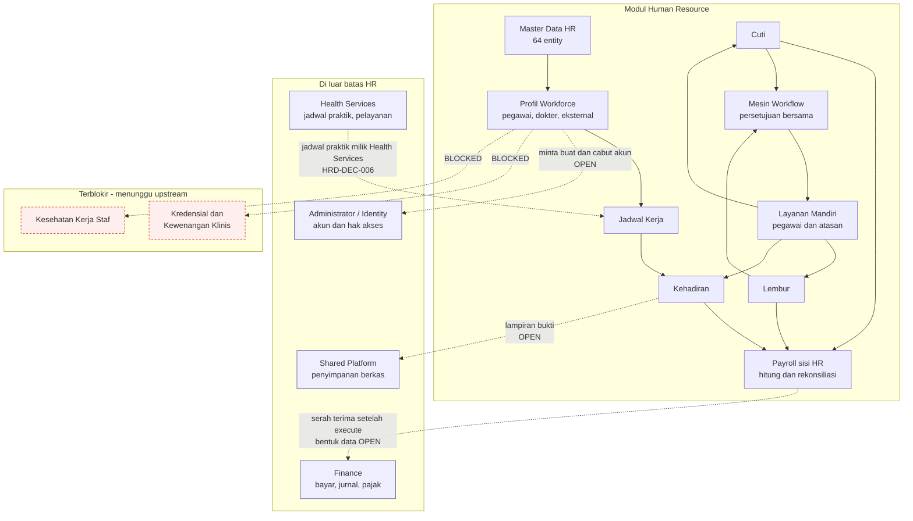

# Flow 00 — Module Context

| Field | Value |
| --- | --- |
| Blueprint ID | `HRD-BP-001` |
| Jenis | Module context flow |
| Status | `DRAFT` |
| Backend baseline | `origin/QuilvianIntegrationBackend`, diverifikasi `16b8b71` |
| Frontend baseline | `AgentCodexFrontend`, `2a1cea784` |

---

## 1. Purpose

Menunjukkan **di mana modul HR berhenti dan modul lain mulai**. Berkas ini tidak menggambarkan
satu proses bisnis pun; ia menggambarkan batas kepemilikan dan titik sentuh.

Gunanya satu: mencegah modul HR diam-diam mengambil alih pekerjaan modul lain, dan sebaliknya.
Setiap kali sebuah flow menyentuh kotak di luar HR, batasnya harus sudah tercatat di sini.

## 2. Actors

| Aktor | Perannya terhadap batas modul |
| --- | --- |
| Pegawai | Mengajukan transaksi HR dari akunnya sendiri `[EXISTING]` |
| Atasan atau kepala unit | Menyetujui pengajuan anak buah `[EXISTING]` |
| HR Admin dan HR Manager | Mengelola master data dan administrasi kepegawaian `[EXISTING]` |
| Petugas payroll | Menutup periode dan menyerahkan hasil ke Finance `[EXISTING]` |
| Finance | Menerima serah terima payroll `[OPEN]` — bentuknya belum disepakati |
| Health Services | Memakai jadwal praktik dokter, terpisah dari jadwal kerja `[DECISION]` `HRD-DEC-006` |
| Administrator / Identity | Membuat dan mencabut akun aplikasi `[OPEN]` |
| K3RS dan Komite Medik | `[BLOCKED]` — di luar fase yang boleh dirancang |

## 3. Trigger

Tidak ada. Berkas ini bersifat struktural.

## 4. Preconditions

Tidak ada.

## 5. Happy Path

Rantai nilai HR yang boleh dirancang sekarang, dari sisi pegawai:

1. Pegawai memiliki profil workforce dan penempatan yang berlaku. `[EXISTING]`
2. Jadwal kerja tersedia untuk periode berjalan. `[EXISTING]`
3. Pegawai mencatat kehadiran. `[EXISTING]`
4. Pegawai mengajukan cuti atau lembur bila perlu. `[EXISTING]`
5. Atasan menyetujui lewat mesin workflow bersama. `[EXISTING]`
6. Kehadiran, cuti, dan lembur direkonsiliasi dalam satu periode. `[EXISTING]`
7. Periode ditutup dan hasilnya diserahkan ke payroll. `[EXISTING]`
8. HR menyerahkan hasil payroll ke Finance. `[OPEN]` — bentuk serah terima belum disepakati

## 6. Alternative Flow

| Keadaan | Yang terjadi | Provenance |
| --- | --- | --- |
| Pegawai adalah dokter yang juga punya jadwal praktik | Jadwal praktik dimiliki Health Services dan **tidak** menjadi jadwal kerja HR | `[DECISION]` `HRD-DEC-006` |
| Dokter melayani pasien di luar jadwal kerjanya | Dicatat sebagai pengecualian kehadiran yang menunggu keputusan atasan | `[DECISION]` `HRD-DEC-013` |
| Pegawai bukan karyawan tetap, misalnya dokter tamu atau mahasiswa praktik | Dikelola sebagai `MstExternalUser` dalam keluarga workforce yang sama | `[EXISTING]` |

## 7. Exception Flow

| Keadaan | Yang terjadi | Provenance |
| --- | --- | --- |
| Seluruh endpoint HR tidak dapat dihubungi | Pendaftaran pasien **tetap berjalan normal**. HR bukan jalur kritis pelayanan | `[DECISION]` `HRD-DEC-006`, kriteria `HRD-AC-04` |
| Finance menolak batch payroll yang sudah diserahkan | Perilakunya belum ditetapkan | `[OPEN]` `HRD-Q-11` |
| Akun aplikasi pegawai belum ada saat onboarding | Perilakunya belum ditetapkan | `[OPEN]` — lihat `HRD-DEP-003` |

## 8. Approval

Seluruh persetujuan HR memakai mesin bersama `WorkflowManagement`. `[EXISTING]`

Satu kotak masuk menyatukan tampilannya, tetapi **workflow, policy, permission, validasi, SLA,
dan eskalasi tetap milik masing-masing jenis transaksi**. `[DECISION]` `HRD-DEC-011`,
`HRD-DEC-018`

## 9. State Transition

Tidak ada. Berkas ini tidak memiliki entity berstatus.

## 10. Data Created/Updated

Tidak ada.

## 11. Backend Capability

| Kemampuan | Bukti | Provenance |
| --- | --- | --- |
| Konteks pengguna HR | `GET api/v1/self-services/human-resource/context`, memakai `Shared/HumanResource/Services/HumanResourceContextService.cs` | `[EXISTING]` |
| Mesin workflow bersama | `api/v1/corporate/human-resource/workflow/**`, 6 controller, 48 endpoint | `[EXISTING]` |
| Hak akses | `[Authorize]` dan `[AccessController]` pada 150 dari 150 controller HR | `[EXISTING]` |

## 12. Frontend Capability

| Kemampuan | Bukti | Provenance |
| --- | --- | --- |
| Konteks pengguna | `src/lib/hooks/hr/self-service/use-human-resource-context.jsx` | `[EXISTING]` |
| Master data HR | 64 kelompok halaman di `src/app/hr/master-data/**` | `[EXISTING]` |
| Layanan mandiri | Baru dua halaman: dashboard dan absensi | `[EXISTING]` |
| Antarmuka atasan | **Tidak ada sama sekali** | `[EXISTING]` — gap |

## 13. Integration Boundary

Ini bagian terpenting berkas ini.

| Batas | Milik HR | Milik modul lain | Provenance |
| --- | --- | --- | --- |
| Payroll | Perhitungan, rekonsiliasi, dan penyerahan sampai `execute` | Pembayaran, posting akuntansi, pajak, pelaporan — milik Finance | `[DECISION]` `HRD-DEC-009` |
| Bentuk data serah terima payroll | — | — | `[OPEN]` `HRD-Q-10` |
| Jadwal | Jadwal kerja untuk kehadiran, lembur, tunjangan shift | Jadwal praktik dokter untuk pendaftaran pasien — milik Health Services | `[DECISION]` `HRD-DEC-006` |
| Akun aplikasi | Permintaan buat dan cabut akses | Pembuatan, role, permission, pencabutan — milik Administrator/Identity | `[OPEN]` |
| Berkas dan dokumen | Metadata dan rujukan | Penyimpanan berkas — milik shared platform | `[OPEN]` |
| Kewenangan klinis | — | — | `[BLOCKED]` — `HRD-DEP-005`, `HRD-DEP-007` |
| Kesehatan kerja | — | — | `[BLOCKED]` — `HRD-DEP-007` |

**Aturan yang mengikat:** tidak boleh ada dua modul yang menjadi sumber kebenaran untuk fakta
yang sama. Setiap kali sebuah flow HR membaca atau menulis data di seberang batas, titik
sentuhnya wajib tercatat di tabel ini lebih dulu.

## 14. Audit Requirement

| Kebutuhan | Provenance |
| --- | --- |
| Setiap transaksi menyimpan pelaku, waktu, dan status | `[EXISTING]` — pola `IdentityModel` dipakai seluruh model HR |
| Setiap perpindahan lintas batas modul dapat ditelusuri | `[OPEN]` — belum ada bukti jejak lintas modul dari sisi HR |

## 15. Blocking Decision

| ID | Isi | Dampak pada flow ini |
| --- | --- | --- |
| `HRD-Q-10`, `HRD-Q-11` | Bentuk serah terima payroll dan perilaku saat ditolak | Kotak Finance digambar sebagai batas, isinya tidak dirancang |
| `HRD-DEP-007` | Arsitektur domain klinis belum ada | Kotak kredensial dan kesehatan kerja tidak digambar sebagai alur |
| `HRD-DEP-003` | Kontrak HR ke Identity belum diketahui | Panah buat dan cabut akun digambar putus-putus |

## 16. Acceptance Criteria

| ID | Kriteria | Cara menguji |
| --- | --- | --- |
| `AC-F00-01` | HR bukan jalur kritis pelayanan pasien | Matikan seluruh endpoint HR; pendaftaran pasien tetap berjalan |
| `AC-F00-02` | Tidak ada endpoint HR yang mengubah status pembayaran | Telusuri seluruh 1.343 endpoint HR; tidak ada yang menyentuh pembayaran |
| `AC-F00-03` | Jadwal kerja dan jadwal praktik adalah dua data berbeda | Ubah jadwal praktik dokter; jadwal kerja HR tidak ikut berubah |
| `AC-F00-04` | Setiap titik sentuh lintas modul tercatat | Setiap panah keluar pada diagram punya baris di tabel bagian 13 |

## 17. Diagram

Garis penuh berarti alur di dalam HR yang sudah terbukti ada. Garis putus-putus berarti titik
sentuh lintas modul; sebagian besar masih `[OPEN]`. Kotak merah berarti `[BLOCKED]`.
