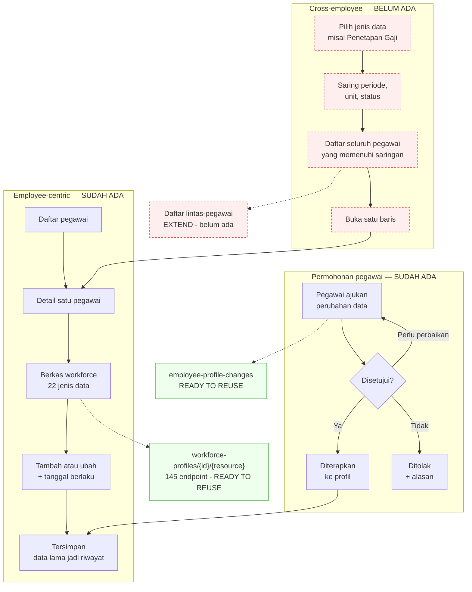

# Flow 01 — Administrasi Kepegawaian

| Field | Value |
| --- | --- |
| Blueprint ID | `HRD-BP-001` |
| Jenis | Business process flow |
| Slice terkait | `S-A1` |
| Status | `DRAFT` |
| Backend baseline | `origin/QuilvianIntegrationBackend`, diverifikasi `16b8b71` |

---

## 1. Purpose

Mengelola data kepegawaian seorang pegawai sepanjang masa kerjanya: penempatan organisasi,
penempatan jabatan, relasi atasan, riwayat kepegawaian, penetapan gaji, dan permohonan perubahan
data.

Flow ini punya satu ciri yang membedakannya dari flow lain: **ada dua cara memandang data yang
sama**, dan keduanya sah.

| Cara pandang | Pertanyaan yang dijawab | Keadaan hari ini |
| --- | --- | --- |
| **Employee-centric** | "Apa saja data si Budi?" | **Sudah ada dan sudah dipakai** `[EXISTING]` |
| **Cross-employee HR administration** | "Siapa saja yang gajinya berubah bulan ini?" | Target behavior: `[DECISION]` `HRD-DEC-012`. Current implementation: `[EXISTING]` `MISSING` — halaman belum ada |

Perbedaan ini bukan soal tampilan. Keduanya menjawab pertanyaan kerja yang berbeda, dipakai
orang yang berbeda, dan memerlukan bentuk data yang berbeda dari backend.

### 1.1 Employee-centric — yang sudah ada

Pengguna membuka satu pegawai, lalu melihat seluruh berkasnya. Jalurnya:

`/hr/master-data/employee/{employeeSlug}/workforce/{resourceKey}` `[EXISTING]`

memanggil `api/v1/corporate/human-resource/workforce-profiles/{workforceProfileId}/<sumber-daya>`

Ada 22 `WFP_RESOURCE_KEYS` di
`src/lib/state/slice/hr/workforce-profile/workforce-profile-all.jsx` baris 13–36, termasuk
`organizationAssignments`, `positionAssignments`, `managerAssignments`, `salaryAssignments`,
`employmentHistories`, dan `profileChangeRequests`. `[EXISTING]`

Pola yang sama tersedia untuk dokter dan pengguna eksternal. `[EXISTING]`

### 1.2 Cross-employee — yang belum ada

Pengguna membuka satu jenis data, lalu melihat seluruh pegawai sekaligus. Contoh kerja nyata:

> Petugas payroll perlu memeriksa **semua penetapan gaji yang mulai berlaku 1 September**
> sebelum periode ditutup. Hari ini ia harus membuka pegawai satu per satu.

> Kepala unit baru perlu tahu **siapa saja yang penempatan organisasinya berada di unitnya**.
> Hari ini tidak ada halaman yang menjawabnya.

Enam menu di `src/utils/menu-sidebar/menu-items.jsx` baris 517–557 sudah menjanjikan pandangan
ini, tetapi keenamnya menunjuk halaman yang tidak ada. `[EXISTING]` — cacat produksi

## 2. Actors

| Aktor | Yang dikerjakan | Provenance |
| --- | --- | --- |
| HR Admin | Membuat dan mengubah penempatan, riwayat, dan penetapan gaji | `[EXISTING]` |
| HR Manager | Menyetujui perubahan yang melampaui kewenangan HR Admin | `[OPEN]` — batas kewenangannya belum ditetapkan |
| Pegawai | Mengajukan permohonan perubahan data pribadinya | `[EXISTING]` |
| Atasan | Melihat data anak buahnya | `[OPEN]` — cakupan yang boleh dilihat belum ditetapkan |
| Petugas payroll | Membaca penetapan gaji yang berlaku pada satu periode | Data: `[EXISTING]`. Halaman lintas-pegawai — target: `[DECISION]` `HRD-DEC-012`, saat ini: `[EXISTING]` `MISSING` |
| Auditor | Membaca berkas pegawai tanpa mengubah | `[OPEN]` — peran read-only belum terbukti ada |

## 3. Trigger

| Pemicu | Cara pandang | Provenance |
| --- | --- | --- |
| Pegawai baru bergabung | Employee-centric | `[EXISTING]` |
| Pegawai dipindahkan unit atau jabatan | Employee-centric | `[EXISTING]` |
| Gaji ditetapkan atau diubah | Keduanya | `[EXISTING]` |
| Pegawai mengajukan perubahan data pribadi | Employee-centric | `[EXISTING]` |
| Periode payroll akan ditutup | Cross-employee | Target: `[DECISION]` `HRD-DEC-012`. Current: `[EXISTING]` `MISSING` |
| Audit atau akreditasi meminta bukti | Keduanya | `[OPEN]` |

## 4. Preconditions

1. Profil workforce sudah ada. `[EXISTING]`
2. Master data yang dirujuk sudah terisi — unit organisasi, jabatan, grade, pusat biaya, struktur
   gaji. `[EXISTING]`
3. Pengguna punya hak akses yang sesuai lewat `[AccessPermission]`. `[EXISTING]`

## 5. Happy Path

### 5.1 Employee-centric

1. HR Admin membuka daftar pegawai. `[EXISTING]`
2. Memilih satu pegawai, lalu membuka berkas workforce-nya. `[EXISTING]`
3. Memilih jenis data, misalnya penempatan organisasi. `[EXISTING]`
4. Menambah data baru beserta **tanggal mulai berlaku**. `[EXISTING]`
5. Sistem menyimpan, dan data lama tetap tersimpan sebagai riwayat. `[EXISTING]`

### 5.2 Cross-employee

1. HR Admin membuka halaman jenis data, misalnya Penetapan Gaji. Target: `[DECISION]` `HRD-DEC-012`. Current: `[EXISTING]` `MISSING` — halaman belum ada
2. Menyaring berdasarkan periode, unit, atau status. Target: `[DECISION]` `HRD-DEC-012`. Current: `[EXISTING]` `MISSING`
3. Melihat seluruh pegawai yang memenuhi saringan itu. Target: `[DECISION]` `HRD-DEC-012`. Current: `[EXISTING]` `MISSING`
4. Membuka satu baris untuk masuk ke pandangan employee-centric. `[EXISTING]`

### 5.3 Permohonan perubahan data oleh pegawai

1. Pegawai mengajukan perubahan lewat layanan mandiri. `[EXISTING]`
2. Permohonan masuk jalur persetujuan. `[EXISTING]`
3. Setelah disetujui, perubahan diterapkan pada profil. `[EXISTING]`
4. Selama belum disetujui, data lama yang berlaku. `[EXISTING]`

## 6. Alternative Flow

| Keadaan | Yang terjadi | Provenance |
| --- | --- | --- |
| Perubahan berlaku surut | Tanggal mulai berlaku dibuat lebih awal dari tanggal pencatatan | `[EXISTING]` — pola effective date sudah ada |
| Perubahan dijadwalkan ke depan | Tanggal mulai berlaku di masa depan; data lama tetap berlaku sampai tanggal itu | `[EXISTING]` |
| Pegawai adalah dokter atau pengguna eksternal | Memakai jalur `doctor` atau `external-user` dengan pola yang sama | `[EXISTING]` |
| Dua penempatan tumpang tindih | Apakah diizinkan, dan pada kondisi apa | `[OPEN]` |

## 7. Exception Flow

| Keadaan | Yang terjadi | Provenance |
| --- | --- | --- |
| Master data yang dirujuk sudah dinonaktifkan | Perilakunya belum ditetapkan | `[OPEN]` |
| Perubahan gaji berlaku surut ke periode payroll yang sudah tertutup | Perilakunya belum ditetapkan. Ini berpotensi mengubah gaji yang sudah dibayarkan | `[OPEN]` — pertanyaan baru, lihat bagian 15 |
| Permohonan perubahan data ditolak | Data lama tetap berlaku; permohonan menyimpan alasan penolakan | `[EXISTING]` |
| Dua orang mengubah data yang sama bersamaan | Perilakunya belum ditetapkan | `[OPEN]` |

## 8. Approval

| Transaksi | Perlu persetujuan? | Provenance |
| --- | --- | --- |
| Permohonan perubahan data oleh pegawai | **Ya** — `EmployeeProfileChangeController` dan `EmployeeProfileChangeSelfServiceController` tersedia | `[EXISTING]` |
| Penempatan organisasi, jabatan, atasan oleh HR Admin | Belum terbukti ada jalur persetujuan | `[OPEN]` |
| Penetapan gaji | Belum terbukti ada jalur persetujuan | `[OPEN]` — ini transaksi sensitif, ketiadaan persetujuan perlu dikonfirmasi |

**Larangan:** jangan menambahkan tahap persetujuan yang tidak dibuktikan source maupun keputusan
yang sudah disetujui. Ketiadaan persetujuan pada penetapan gaji dicatat sebagai pertanyaan,
bukan diisi sendiri.

## 9. State Transition

**`HRD-Q-21` tertutup lewat audit source.** `EmployeeProfileChange` **tidak** memakai
`LeaveRequestValueConstants.Status`. Statusnya adalah field `string` polos pada
`TrxEmployeeProfileChangeRequest.RequestStatus` (`Areas/Corporate/HumanResource/WorkforceCore/**`),
divalidasi oleh array privat pada `EmployeeProfileChangeService`
(`RequestStatuses = { Draft, Submitted, UnderVerification, NeedRevision, Approved, Rejected,
Cancelled, Applied }`), bukan oleh tipe atau namespace yang sama dengan `LeaveManagement`. Kedua
kosakata **kebetulan** berbagi sebagian nama nilai (`Draft`, `Submitted`, `NeedRevision`,
`Approved`, `Rejected`, `Cancelled`); `EmployeeProfileChange` menambah `UnderVerification` dan
`Applied`, dan tidak memiliki `WaitingApproval`, `Taken`, `Recalled`, maupun `Expired`. Kedua
kosakata adalah tipe yang **berbeda**, bukan yang sama. `[EXISTING]` — state vocabulary saja.

Tabel di bawah memakai kosakata `EmployeeProfileChangeService` yang benar. **Transition edge**
tetap `[OPEN]` / UNVERIFIED kecuali baris terakhir: audit hanya membuktikan keberadaan kosakata
dan menemukan logika transisi di layanan (mis. rujukan `NeedRevision` pada beberapa titik
layanan), tetapi belum membuktikan guard per-edge (state asal yang sah untuk setiap aksi) maupun
siapa yang berwenang menjalankannya.

| Dari | Tindakan | Ke | Siapa | Provenance |
| --- | --- | --- | --- | --- |
| `Draft` | Ajukan | `Submitted` | Pegawai | State vocabulary: `[EXISTING]`. Transition edge: `[OPEN]` — guard belum diverifikasi |
| `Submitted` | Tinjau | `UnderVerification` | Atasan atau HR | State vocabulary: `[EXISTING]`. Transition edge: `[OPEN]` |
| `UnderVerification` | Terima | `Approved` | Atasan atau HR | State vocabulary: `[EXISTING]`. Transition edge: `[OPEN]` |
| `UnderVerification` | Minta perbaikan | `NeedRevision` | Atasan atau HR | State vocabulary: `[EXISTING]`. Transition edge: `[OPEN]` — ada rujukan logika di layanan, guard spesifik belum dikutip |
| `UnderVerification` | Tolak | `Rejected` | Atasan atau HR | State vocabulary: `[EXISTING]`. Transition edge: `[OPEN]` |
| `Approved` | Terapkan | `Applied` — data profil berubah | Sistem | `[EXISTING]` — nilai `Applied` terbukti ada dan terpisah dari `Approved`, menunjukkan penerapan adalah langkah tersendiri |

Kewenangan "Atasan atau HR" pada tabel di atas **belum diverifikasi** — bagian ini tidak termasuk
dalam empat transaksi yang diaudit otoritasnya pada bagian 5 dokumen interview decisions
(Leave, Overtime, Attendance correction, Salary assignment). Jangan menyimpulkan kewenangannya
dari pola flow lain.

Penempatan dan penetapan gaji **tidak berstatus**. Yang berlaku adalah tanggal mulai berlaku,
bukan status. `[EXISTING]`

## 10. Data Created/Updated

| Data | Entity | Prefix | Perlakuan penamaan |
| --- | --- | --- | --- |
| Penempatan organisasi | `WfpOrganizationAssignment` | `Wfp` | **Tetap `Wfp`** `[DECISION]` `HRD-DEC-019` |
| Penempatan jabatan | `WfpPositionAssignment` | `Wfp` | Tetap `Wfp` |
| Relasi atasan | `WfpManagerAssignment` | `Wfp` | Tetap `Wfp` |
| Riwayat kepegawaian | `WfpEmploymentHistory` | `Wfp` | Tetap `Wfp` |
| Penetapan gaji | `WfpSalaryAssignment` | `Wfp` | Tetap `Wfp` |
| Riwayat kontrak | `WfpContractHistory` | `Wfp` | Tetap `Wfp` |
| Alamat, rekening, pendidikan, dokumen, keluarga, kontak darurat, tanggungan | `WfpAddress`, `WfpBankAccount`, `WfpEducation`, `WfpDocument`, `WfpFamilyMember`, `WfpEmergencyContact`, `WfpDependent` | `Wfp` | Tetap `Wfp` |
| Profil workforce | `MstWorkforceProfile`, `MstEmployee`, `MstDoctor`, `MstExternalUser` | `Mst` | **Tetap `Mst`** `[DECISION]` `HRD-DEC-019` |

Tidak ada entity pada flow ini yang perlu di-ratchet. Seluruhnya `Wfp` atau `Mst`, dan keduanya
sah menurut `HRD-DEC-019`.

## 11. Backend Capability

| Kemampuan | Endpoint | Status |
| --- | --- | --- |
| Sumber daya profil per pegawai | `api/v1/corporate/human-resource/workforce-profiles/{workforceProfileId}/{addresses\|bank-accounts\|contract-histories\|dependents\|documents\|educations\|emergency-contacts\|employment-histories\|family-members\|manager-assignments\|organization-assignments\|position-assignments\|salary-assignments}` | `READY TO REUSE` `[EXISTING]` |
| Ringkasan profil | `GET api/v1/corporate/human-resource/workforce-profiles/{workforceProfileId}/overview` | `READY TO REUSE` `[EXISTING]` |
| Permohonan perubahan data | `api/v1/corporate/human-resource/employee-profile-changes` | `READY TO REUSE` `[EXISTING]` |
| Layanan mandiri perubahan data | `api/v1/self-services/human-resource/profile-changes` | `READY TO REUSE` `[EXISTING]` |
| **Daftar lintas-pegawai per jenis data** | Tidak ada | Target: `[DECISION]` `HRD-DEC-012`. Current: **`EXTEND`** `[EXISTING]` `MISSING` |

`WorkforceCore` menyediakan 145 endpoint pada 14 controller, seluruhnya berpola per profil.
`EmployeeProfileChangeController` adalah satu-satunya yang sudah berbentuk lintas-pegawai, dan
itu menjadi contoh bentuk untuk `EXTEND`. `[EXISTING]`

## 12. Frontend Capability

| Kemampuan | Lokasi | Status |
| --- | --- | --- |
| Editor profil employee-centric | `src/lib/state/slice/hr/workforce-profile/workforce-profile-all.jsx` beserta 22 resource key | `READY TO REUSE` `[EXISTING]` |
| Halaman detail pegawai | `src/app/hr/master-data/employee/[employeeSlug]/workforce/**` | `READY TO REUSE` `[EXISTING]` |
| Halaman detail dokter dan pengguna eksternal | Pola yang sama | `READY TO REUSE` `[EXISTING]` |
| **Enam halaman daftar lintas-pegawai** | Tidak ada | Target: `[DECISION]` `HRD-DEC-012`. Current: **`MISSING`** `[EXISTING]` |
| Menu yang menjanjikan halaman itu | `menu-items.jsx:517-557` | Target: `[DECISION]` `HRD-DEC-012`. Current: **`REPAIR`** `[EXISTING]` |

Yang perlu ditegaskan: pekerjaan ini **memakai ulang**, bukan membangun dari nol. Redux, komponen
editor, dan kontrak backend per-profil semuanya sudah ada. `[DECISION]` `HRD-DEC-012`

## 13. Integration Boundary

| Batas | Keterangan | Provenance |
| --- | --- | --- |
| Penetapan gaji ke payroll | Payroll membaca penetapan gaji yang berlaku pada periode | `[EXISTING]` |
| Penempatan ke jadwal dan kehadiran | Unit dan atasan menentukan jalur persetujuan | `[EXISTING]` |
| Profil ke akun aplikasi | Belum ada bukti integrasi | `[OPEN]` `HRD-DEP-003` |
| Dokumen pegawai ke penyimpanan berkas | Belum diketahui polanya | `[OPEN]` `HRD-DEP-006` |
| Kredensial tenaga klinis | Tidak dirancang | `[BLOCKED]` `HRD-DEP-007` |

## 14. Audit Requirement

| Kebutuhan | Provenance |
| --- | --- |
| Setiap perubahan menyimpan pelaku, waktu, dan nilai sebelumnya | `[EXISTING]` — pola `IdentityModel` |
| Riwayat tidak hilang saat data diperbarui | `[EXISTING]` — `WfpEmploymentHistory` |
| Perubahan gaji dapat ditelusuri sampai siapa yang menetapkannya | `[EXISTING]` |
| Permohonan perubahan data menyimpan alasan penolakan | `[EXISTING]` |
| Siapa saja yang boleh membaca data gaji orang lain | `[OPEN]` — ini data sensitif |

## 15. Blocking Decision

| ID | Isi | Dampak |
| --- | --- | --- |
| `HRD-Q-06` | Nilai kebijakan pada PRD pasal 28 | Tidak memblokir alurnya |
| `HRD-Q-18` | **Baru.** Apa yang terjadi bila penetapan gaji berlaku surut ke periode payroll yang sudah tertutup? Ini berpotensi mengubah gaji yang sudah dibayarkan | Memblokir desain final penetapan gaji berlaku surut |
| `HRD-Q-19` | **Baru.** Apakah penetapan gaji dan penempatan memerlukan persetujuan? Source tidak menunjukkan jalur persetujuan untuk keduanya, padahal keduanya sensitif | Memblokir desain final jalur persetujuan administrasi |
| `HRD-Q-20` | **Baru.** Siapa yang boleh membaca penetapan gaji pegawai lain, dan sampai tingkat apa? | Memblokir desain final hak akses halaman lintas-pegawai |
| `HRD-Q-21` | ~~Apakah `EmployeeProfileChange` memakai kosakata status yang sama dengan pengajuan HR lain?~~ | **Tertutup lewat audit source, 27 Agustus 2026.** Tidak — kosakatanya berbeda (`EmployeeProfileChangeService.RequestStatuses`, bukan `LeaveRequestValueConstants.Status`). Lihat bagian 9. Transition edge dan kewenangan aktor tetap `[OPEN]` |

## 16. Acceptance Criteria

| ID | Kriteria | Cara menguji |
| --- | --- | --- |
| `AC-F01-01` | Setiap menu HR membawa ke halaman yang bekerja | Untuk setiap `pathname` di bawah `corporateHumanResource`, ada `page.jsx` yang cocok |
| `AC-F01-02` | Pandangan lintas-pegawai menjawab pertanyaan per periode | Buka Penetapan Gaji, saring periode September; muncul seluruh pegawai yang penetapannya berlaku pada periode itu |
| `AC-F01-03` | Pandangan employee-centric tidak rusak | Halaman detail pegawai tetap bekerja persis seperti sebelumnya |
| `AC-F01-04` | Tidak ada komponen editor baru yang menduplikasi yang sudah ada | Halaman lintas-pegawai memakai ulang komponen dan Redux yang sama |
| `AC-F01-05` | Riwayat tidak hilang | Ubah penempatan; penempatan lama tetap terbaca beserta tanggal berlakunya |
| `AC-F01-06` | Permohonan yang belum disetujui tidak mengubah data | Ajukan perubahan alamat; profil tetap menampilkan alamat lama sampai disetujui |

## 17. Diagram

Kotak merah putus-putus berarti belum ada. Perhatikan bahwa yang hilang **hanya jalur
cross-employee**; jalur employee-centric dan permohonan pegawai sudah lengkap.
