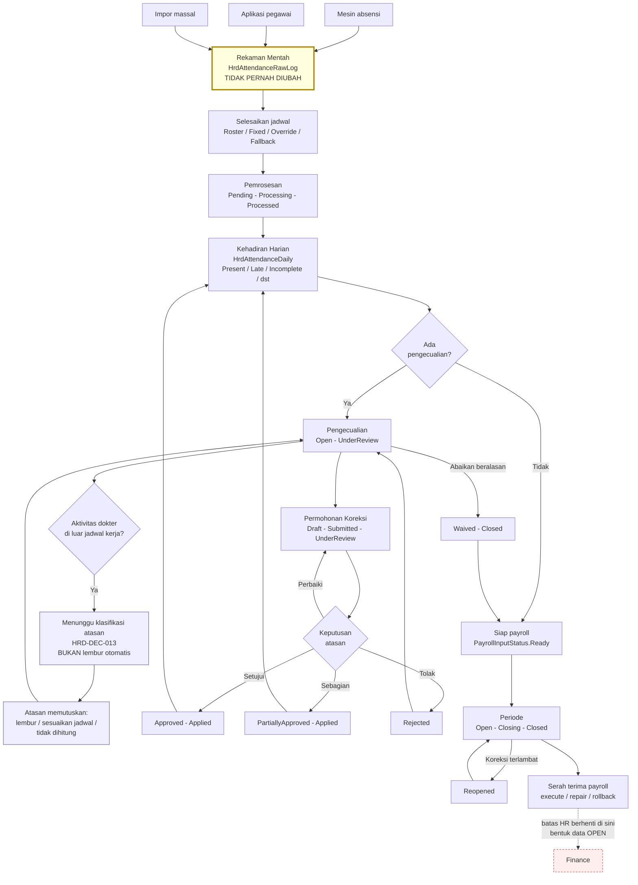

# Flow 02 — Kehadiran

| Field | Value |
| --- | --- |
| Blueprint ID | `HRD-BP-001` |
| Jenis | Business process flow |
| Slice terkait | `S-A5`, `S-A6`, `S-B1` |
| Status | `DRAFT` |
| Backend baseline | `origin/QuilvianIntegrationBackend`, diverifikasi `16b8b71` |

---

## 1. Purpose

Mengubah rekaman mentah kehadiran menjadi kehadiran harian yang siap dipakai payroll, lewat
rantai: rekaman mentah → penyelesaian jadwal → pemrosesan harian → pengecualian → koreksi →
penutupan periode → serah terima payroll.

**Aturan yang paling penting pada flow ini:** rekaman mentah adalah **fakta yang tidak pernah
diubah**. Koreksi apa pun mengubah hasil olahannya, bukan rekamannya. `[EXISTING]`

Alasannya sederhana. Rekaman mentah adalah bukti bahwa seseorang benar-benar menempelkan sidik
jari pada jam tertentu. Kalau bukti itu boleh diedit, tidak ada lagi yang bisa dipercaya saat
terjadi sengketa jam kerja atau pemeriksaan.

## 2. Actors

| Aktor | Yang dikerjakan | Provenance |
| --- | --- | --- |
| Pegawai | Mencatat kehadiran masuk dan pulang; mengajukan koreksi | `[EXISTING]` |
| Atasan | Menyetujui koreksi kehadiran anak buahnya | `[EXISTING]` |
| HR Admin | Memantau pengecualian, memproses ulang, menangani rekaman bermasalah | `[EXISTING]` |
| Petugas payroll | Menutup periode, memeriksa kesiapan payroll, menyerahkan hasil | `[EXISTING]` |
| Sistem penjadwal | Memproses kehadiran harian secara terjadwal | `[EXISTING]` — `HrdAttendanceSchedulerJob` |
| Mesin absensi atau aplikasi | Mengirim rekaman mentah | `[EXISTING]` |

## 3. Trigger

| Pemicu | Provenance |
| --- | --- |
| Pegawai menempelkan sidik jari, atau mencatat kehadiran dari aplikasi | `[EXISTING]` — `RawLogSourceType`: `Device`, `Mobile`, `WebLogin`, `Api`, `Import`, `Manual` |
| Penjadwal menjalankan pemrosesan harian | `[EXISTING]` |
| HR meminta pemrosesan satu tanggal atau satu rentang | `[EXISTING]` — `ProcessingRunMode`: `SingleDate`, `SingleWorkforce`, `ProcessRange`, `Reprocess`, `ReprocessRange` |
| Pegawai mengajukan koreksi | `[EXISTING]` |
| Periode akan ditutup | `[EXISTING]` |

## 4. Preconditions

1. Pegawai punya profil workforce yang aktif. `[EXISTING]`
2. Jadwal kerja yang berlaku dapat diselesaikan untuk tanggal itu. `[EXISTING]` — `ScheduleSource`:
   `Roster`, `FixedWorkSchedule`, `ManualOverride`, `Fallback`
3. Periode kehadiran berstatus `Open`. `[EXISTING]`
4. Untuk pencatatan dari aplikasi, syarat lokasi terpenuhi bila diwajibkan. `[EXISTING]` —
   `gpsRequired` dan `allowedLocations` dikembalikan backend

## 5. Happy Path

1. Pegawai mencatat kehadiran masuk. Sistem membuat **rekaman mentah**. `[EXISTING]`
2. Backend menentukan apakah pegawai boleh mencatat masuk, dan mengembalikan jawabannya.
   `[EXISTING]` — `canCheckIn`
3. Pegawai mencatat kehadiran pulang setelah ambang waktu yang ditetapkan backend. `[EXISTING]` —
   `checkOutAvailableAt` bersifat otoritatif dari backend
4. Pemrosesan berjalan. Rekaman mentah dibaca, jadwal diselesaikan, dan **kehadiran harian**
   dibentuk. `[EXISTING]`
5. Kehadiran harian mendapat status, misalnya `Present`, `Late`, atau `Incomplete`. `[EXISTING]`
6. Bila tidak ada pengecualian, kehadiran harian menjadi `Ready` untuk payroll. `[EXISTING]` —
   `PayrollInputStatus.Ready`
7. Periode ditutup. `[EXISTING]`
8. Hasilnya diserahkan ke payroll. `[EXISTING]`

**Frontend tidak menghitung apa pun.** Kelayakan mencatat, ambang waktu pulang, dan status
kehadiran seluruhnya berasal dari backend. `[EXISTING]` — terbukti dari
`attendance-capture-slice.jsx` yang hanya menormalkan bentuk field, bukan menghitung aturan

## 6. Alternative Flow

| Keadaan | Yang terjadi | Provenance |
| --- | --- | --- |
| Hari itu hari libur atau hari istirahat | Status menjadi `Holiday` atau `RestDay` | `[EXISTING]` |
| Pegawai sedang cuti | Status menjadi `Leave` | `[EXISTING]` |
| Pegawai sedang perjalanan dinas | Status menjadi `BusinessTrip`; ada entity `HrdBusinessTripAttendance` | `[EXISTING]` |
| Pegawai bekerja jarak jauh | Status menjadi `Remote`; ada entity `HrdRemoteAttendance` | `[EXISTING]` |
| Pegawai sedang siaga | `AttendanceSegmentType` mengenal `OnCall` | `[EXISTING]` |
| Rekaman masuk lewat impor massal | `POST .../attendance/raw-logs/batch` | `[EXISTING]` |

### 6.1 Dokter yang melayani pasien di luar jadwal kerjanya

Ini perlakuan khusus yang sudah diputuskan.

1. Jadwal praktik dokter **bukan** jadwal kerja HR. `[DECISION]` `HRD-DEC-006`
2. Bila seorang dokter melayani pasien pada jam yang tidak ada dalam jadwal kerjanya, jam itu
   **dicatat sebagai pengecualian kehadiran yang menunggu klasifikasi**. `[DECISION]` `HRD-DEC-013`
3. Atasan menentukan apakah jam itu menjadi lembur, penyesuaian jadwal, atau tidak dihitung.
   `[DECISION]` `HRD-DEC-013`
4. **Tidak ada perhitungan lembur otomatis.** `[DECISION]` `HRD-DEC-013`

**`HRD-Q-22` bagian source-resolvable tertutup lewat audit, 27 Agustus 2026.** `ScheduleMismatch`
**bukan** kosakata yang tepat untuk kasus ini. Audit menemukan satu-satunya titik pemakaiannya di
seluruh source: `AttendanceProcessingService.BuildExceptions`, dijaga `if (!schedule.IsResolved)`,
dengan `ExceptionCode = "SCHEDULE_UNRESOLVED"` dan pesan "Jadwal attendance tidak dapat
diselesaikan". Artinya nilai ini dipakai untuk kasus **jadwal tidak dapat ditentukan sama
sekali** — celah data/konfigurasi — bukan untuk "pegawai mencatat kehadiran di luar jendela
jadwalnya yang sudah ada". `[EXISTING]` — dibuktikan dari kode, bukan disimpulkan dari nama.

Konsekuensinya: **tidak ada jenis pengecualian yang sudah ada yang cocok** untuk aktivitas dokter
di luar jadwal kerja.

**`HRD-DEC-025`, 27 Agustus 2026 — sisa `HRD-Q-22` ditutup.** Target behavior: `[DECISION]`
`HRD-DEC-025` — `ScheduleMismatch` **tidak** diperluas maknanya; dibuat exception type baru dan
terpisah, contoh `OutOfScheduleWork`, mengikuti alur `pending classification` → atasan/reviewer
terotorisasi menentukan lembur / koreksi jadwal / tercatat non-compensable / klasifikasi resmi
lain, tidak pernah otomatis menjadi lembur. Current implementation: `[EXISTING]` `MISSING` —
belum ada nilai `OutOfScheduleWork` (atau setara) pada `AttendanceExceptionType`, dan belum ada
kode yang mendeteksi skenario ini.

## 7. Exception Flow

Kosakata pengecualian sudah lengkap di source. `[EXISTING]`

| Jenis pengecualian | Arti | Provenance |
| --- | --- | --- |
| `Late` | Terlambat masuk | `[EXISTING]` |
| `EarlyLeave` | Pulang lebih awal | `[EXISTING]` |
| `MissingCheckIn` | Tidak ada rekaman masuk | `[EXISTING]` |
| `MissingCheckOut` | Tidak ada rekaman pulang | `[EXISTING]` |
| `Absent` | Tidak hadir | `[EXISTING]` |
| `OutsideGeofence` | Mencatat dari luar lokasi yang diizinkan | `[EXISTING]` |
| `DuplicatePunch` | Rekaman ganda | `[EXISTING]` |
| `ScheduleMismatch` | Jadwal tidak dapat diselesaikan (`SCHEDULE_UNRESOLVED`) — **bukan** "kehadiran di luar jadwal yang sudah ada", lihat bagian 6.1 | `[EXISTING]` — `AttendanceProcessingService.BuildExceptions`, guard `!schedule.IsResolved` |
| `ScheduleConflict` | Jadwal bertabrakan | `[EXISTING]` |
| `ExcessiveWorkHours` | Jam kerja melampaui batas | `[EXISTING]` |
| `Unknown` | Belum terklasifikasi | `[EXISTING]` |

Tingkat kegawatan: `Info`, `Warning`, `High`, `Critical`. `[EXISTING]`

Penanganan lain:

| Keadaan | Yang terjadi | Provenance |
| --- | --- | --- |
| Pemrosesan gagal | Status `Error`, lalu `ReprocessRequired` | `[EXISTING]` |
| Rekaman mentah tidak dapat dipakai | `RawLogProcessingStatus`: `Invalid`, `Duplicate`, `Unresolved` | `[EXISTING]` |
| Ambang waktu pulang tidak dapat diselesaikan | `checkOutAvailableAt` bernilai kosong, `canCheckOut` bernilai salah, alasannya ada di `warnings` | `[EXISTING]` |
| Periode sudah ditutup tetapi ada koreksi terlambat | Periode dapat dibuka kembali menjadi `Reopened` | `[EXISTING]` |
| Siapa yang boleh membuka kembali periode | Belum ditetapkan | `[OPEN]` |
| Ambang keterlambatan dan toleransinya | Belum ditetapkan | `[OPEN]` `HRD-Q-06` |

## 8. Approval

| Transaksi | Persetujuan | Provenance |
| --- | --- | --- |
| Pencatatan kehadiran biasa | Tidak perlu | `[EXISTING]` |
| Koreksi kehadiran | **Perlu.** Status koreksi mengenal `UnderReview`, `Approved`, `PartiallyApproved`, `Rejected`. Otoritas: mesin workflow generik (`ApprovalInboxController.Approve` → `WorkflowService.ApproveAsync`), gate `assignment.AssignedApproverUserId == actorContext.UserId` — approver ditentukan penugasan workflow (`TrxWorkflowApproverAssignment`), bukan role hardcode | `[EXISTING]` |
| Penutupan periode | Ada pratinjau sebelum tutup lewat `close-preview`, dan `CloseAsync` benar-benar memblokir bila `preview.CanClose == false` (pengecualian `Open`/`UnderReview` yang `IsPayrollBlocking`, atau koreksi aktif) | `[EXISTING]` |
| Pembukaan kembali periode | Endpoint `reopen` dijaga `[AccessPermission("AttendancePeriod","Reopen")]` generik, dan guard status eksplisit mensyaratkan `Closed`. Siapa yang seharusnya diberi permission itu belum ditetapkan | Mekanisme: `[EXISTING]`. Kewenangan pemegang permission: `[OPEN]` — `PERMISSION_MAPPING` |

Nilai `PartiallyApproved` menunjukkan satu permohonan koreksi dapat memuat beberapa baris, dan
sebagiannya boleh disetujui. `[EXISTING]`

## 9. State Transition

### 9.1 Kehadiran harian — `AttendanceStatus`

Nilai: `Unprocessed`, `Present`, `Absent`, `Late`, `EarlyLeave`, `Incomplete`, `Holiday`,
`RestDay`, `Leave`, `BusinessTrip`, `Remote`. `[EXISTING]`

### 9.2 Pemrosesan — `AttendanceProcessingStatus`

| Dari | Tindakan | Ke | Provenance |
| --- | --- | --- | --- |
| `Pending` | Mulai proses | `Processing` | `[EXISTING]` |
| `Processing` | Selesai | `Processed` | `[EXISTING]` |
| `Processing` | Gagal | `Error` | `[EXISTING]` |
| `Error` | Tandai perlu ulang | `ReprocessRequired` | `[EXISTING]` |
| `ReprocessRequired` | Proses ulang | `Processing` | `[EXISTING]` |
| mana pun | Lewati | `Skipped` | `[EXISTING]` |

### 9.3 Periode — `AttendancePeriodStatus`

Audit source, 27 Agustus 2026: setiap edge di bawah punya guard eksplisit yang membandingkan
status **sekarang**, bukan sekadar nilai enum yang ditulis berurutan.

| Dari | Tindakan | Ke | Transition edge — evidence |
| --- | --- | --- | --- |
| `Open` atau `Reopened` | Mulai tutup | `Closing` | `[EXISTING]` — `AttendancePeriodService.IsEditableStatus` (baris 852–854) mensyaratkan status `Open`/`Reopened`; ditolak selainnya (baris 334–337). `CloseAsync` juga memblokir bila masih ada `HrdAttendanceException` dengan `IsPayrollBlocking` dan status `Open`/`UnderReview` (baris 601–609, 340), atau bila ada permohonan koreksi aktif (`ACTIVE_CORRECTION_REQUEST`, baris 611–618) |
| `Closing` | Selesai tutup | `Closed` | `[EXISTING]` — bagian dari alur `CloseAsync` yang sama |
| `Closed` | Buka kembali | `Reopened` | `[EXISTING]` — baris 422–425 mensyaratkan **hanya** `Closed`; selainnya ditolak 409 "Hanya attendance period Closed yang dapat dibuka kembali." Juga diblokir bila ada kehadiran harian yang sudah tertaut payroll (baris 431–439) atau scheduler job masih aktif (baris 441–447) |
| `Reopened` | Tutup lagi | `Closing` lalu `Closed` | `[EXISTING]` — melalui guard `IsEditableStatus` yang sama pada baris pertama tabel ini |
| `Open` atau `Closing` | Batalkan | `Cancelled` | `[EXISTING]` — memakai ulang `IsEditableStatus` (baris 507–510); periode `Closed` tidak dapat dibatalkan |

**Kewenangan reopen — terbukti sebagian.** `AttendancePeriodController.Reopen` mensyaratkan
`[AccessPermission("AttendancePeriod","Reopen")]`, bukan pemeriksaan peran tambahan apa pun.
Mekanismenya `[EXISTING]` — siapa pun pemegang permission itu dapat memanggilnya. **Siapa yang
seharusnya diberi permission itu** tetap `[OPEN]` — ini `PERMISSION_MAPPING`, bukan lagi
`SOURCE_RESOLVABLE`, lihat `HRD-Q-23` pada bagian 15.

### 9.4 Permohonan koreksi — `CorrectionRequestStatus`

| Dari | Tindakan | Ke | Siapa | Provenance |
| --- | --- | --- | --- | --- |
| `Draft` | Ajukan | `Submitted` | Pegawai | `[EXISTING]` |
| `Submitted` | Mulai tinjau | `UnderReview` | Atasan atau HR | `[EXISTING]` |
| `UnderReview` | Minta perbaikan | `NeedRevision` | Atasan atau HR | `[EXISTING]` |
| `UnderReview` | Setujui seluruhnya | `Approved` | Atasan atau HR | `[EXISTING]` |
| `UnderReview` | Setujui sebagian | `PartiallyApproved` | Atasan atau HR | `[EXISTING]` |
| `UnderReview` | Tolak | `Rejected` | Atasan atau HR | `[EXISTING]` |
| `Approved` atau `PartiallyApproved` | Terapkan | `Applied` | Sistem | `[EXISTING]` |
| `Draft` atau `Submitted` | Batalkan | `Cancelled` | Pegawai | `[EXISTING]` |

**Koreksi audit source, 27 Agustus 2026 — klaim "`Applied` tidak dapat kembali" DISPROVEN, celah
nyata ditemukan.** `AttendanceCorrectionWorkflowLifecycleService` mendeklarasikan
`TerminalRequestStatuses` yang memuat `Applied` — tapi array ini **tidak pernah dirujuk di tempat
lain mana pun** di seluruh source (pencarian repo-wide hanya menemukan deklarasinya sendiri).
`SynchronizeAsync` menulis `request.RequestStatus = MapRequestStatus(workflow.WorkflowStatus)`
**tanpa memeriksa status saat ini** — dan `MapRequestStatus` tidak pernah mengembalikan
`"Applied"`. Endpoint `POST /correction-requests/{id}/workflow/synchronize`
(`[AccessPermission("AttendanceCorrection","Synchronize")]`) dapat dipanggil siapa pun pemegang
permission itu pada request mana pun. Bila dipanggil ulang pada request yang sudah `Applied`
sementara workflow terkait masih melaporkan status `Completed`, ini **menurunkan status kembali
ke `Approved`**, dan pemeriksaan idempoten pada `ApplyApprovedRequestAsync` (yang membaca ulang
DB) tidak lagi melihat status `Applied`, sehingga **logika apply dijalankan ulang** — memutasi
ulang `HrdAttendanceDaily`, menutup ulang pengecualian, dan menaikkan `ProcessingVersion`.

**Kesimpulan:** `Applied` **bukan** status akhir yang benar-benar dijaga sistem hari ini — ini
niat desain (`TerminalRequestStatuses` menunjukkan itu dimaksudkan terminal) yang **tidak
diimplementasikan sebagai guard**. Permohonan koreksi baru terhadap `AttendanceDailyId` yang sama
tetap terbukti tidak dibatasi setelah `Applied` — `CreateAsync` hanya memblokir status pada
`ActiveRequestStatuses` (`Draft`/`Submitted`/`UnderReview`/`NeedRevision`/`Approved`/
`PartiallyApproved`), yang **mengecualikan** `Applied`. `[EXISTING]` — dibuktikan dari kode.
`HRD-Q-24` tertutup dengan jawaban: tidak sepenuhnya benar; ini celah implementasi, bukan
pertanyaan kebijakan yang menunggu keputusan manusia.

**`HRD-DEC-022`, 27 Agustus 2026 — `HRD-Q-34` ditutup.** Target behavior: `[DECISION]`
`HRD-DEC-022` — `Applied` **wajib** terminal terhadap normal workflow synchronization;
`synchronize` **tidak boleh** menurunkannya. Setelah `Applied`, jalur sah hanya (a) permohonan
koreksi baru, atau (b) aksi repair/koreksi eksplisit yang terotorisasi dan diaudit tersendiri.
Dilarang menghidupkan kembali status permohonan lama.

**Current implementation vs target — celah eksplisit:**

| Current behavior | Status terhadap `HRD-DEC-022` |
| --- | --- |
| `synchronize` dapat menurunkan `Applied` → `Approved` lalu memicu apply ulang | `[EXISTING]` (perilaku hari ini) — **`IMPLEMENTATION DEFECT`**, bertentangan langsung dengan target, perlu `REPAIR` |
| Aksi repair/koreksi eksplisit khusus `AttendanceCorrection` (bukan `payroll-handoff`) untuk memperbaiki koreksi yang sudah `Applied` | Tidak ditemukan pada audit — **`MISSING`** terhadap target |
| Permohonan koreksi baru setelah `Applied` | `[EXISTING]` — sudah sesuai target, tidak perlu `REPAIR` |

Tidak ada perubahan source pada pass ini; tabel di atas adalah pencatatan celah, bukan
perbaikannya.

### 9.5 Pengecualian — `AttendanceExceptionStatus`

| Dari | Tindakan | Ke | Provenance |
| --- | --- | --- | --- |
| `Open` | Mulai tinjau | `UnderReview` | `[EXISTING]` |
| `UnderReview` | Perbaiki lewat koreksi | `Corrected` | `[EXISTING]` |
| `UnderReview` | Abaikan dengan alasan | `Waived` | `[EXISTING]` |
| `UnderReview` | Tolak | `Rejected` | `[EXISTING]` |
| `Corrected`, `Waived`, `Rejected` | Tutup | `Closed` | `[EXISTING]` |

### 9.6 Kesiapan payroll — `PayrollInputStatus`

`Pending` → `Ready` → `Processed`. Dapat menjadi `Blocked` atau `Excluded`. `[EXISTING]`

## 10. Data Created/Updated

| Data | Entity | Prefix | Perlakuan |
| --- | --- | --- | --- |
| Rekaman mentah | `HrdAttendanceRawLog` | `Hrd` | Sudah canonical `[EXISTING]` |
| Kehadiran | `HrdAttendance` | `Hrd` | Sudah canonical |
| Kehadiran harian | `HrdAttendanceDaily` | `Hrd` | Sudah canonical |
| Segmen harian | `HrdAttendanceDailySegment` | `Hrd` | Sudah canonical |
| Pengecualian | `HrdAttendanceException` | `Hrd` | Sudah canonical |
| Periode | `HrdAttendancePeriod` | `Hrd` | Sudah canonical |
| Jalannya pemrosesan | `HrdAttendanceProcessingRun` | `Hrd` | Sudah canonical |
| Permohonan koreksi | `HrdAttendanceCorrectionRequest` | `Hrd` | Sudah canonical |
| Rincian koreksi | `HrdAttendanceCorrectionDetail` | `Hrd` | Sudah canonical |
| Persetujuan koreksi | `HrdAttendanceCorrectionApproval` | `Hrd` | Sudah canonical |
| Kehadiran perjalanan dinas | `HrdBusinessTripAttendance` | `Hrd` | Sudah canonical |
| Kehadiran jarak jauh | `HrdRemoteAttendance` | `Hrd` | Sudah canonical |
| Kehadiran hilang | `HrdMissingAttendance` | `Hrd` | Sudah canonical |
| Pekerjaan terjadwal | `HrdAttendanceSchedulerJob` | `Hrd` | Sudah canonical |

Seluruh 14 entity domain ini **sudah memakai prefix `Hrd`**, hasil tiga migration pada 19, 21,
dan 22 Agustus 2026. Tidak ada ratchet yang perlu dijalankan di sini. `[EXISTING]`

**Rekaman mentah tidak pernah diperbarui oleh koreksi.** Yang berubah adalah `HrdAttendanceDaily`
beserta segmennya. `[EXISTING]`

## 11. Backend Capability

| Kemampuan | Endpoint | Status |
| --- | --- | --- |
| Rekaman mentah | `api/v1/corporate/human-resource/attendance/raw-logs`, termasuk `POST /batch` | `READY TO REUSE` |
| Pemrosesan | `.../attendance/processing`, `POST /process`, `POST /process-range`, `POST /attendance-dailies/{id}/reprocess` | `READY TO REUSE` |
| Kehadiran harian | `.../attendance/dailies`, `GET /{id}/segments`, `/exceptions`, `/raw-logs`, `/payroll-readiness` | `READY TO REUSE` |
| Periode | `.../attendance/periods`, `GET /{id}/close-preview`, `POST /{id}/enqueue-processing`, `/close`, `/reopen`, `/cancel` | `READY TO REUSE` |
| Permohonan koreksi | `.../attendance/correction-requests`, `POST /{id}/apply`, `GET /{id}/evidence/download` | `READY TO REUSE` |
| Pemantauan koreksi | `.../attendance/correction-monitoring`, termasuk `POST /bulk/synchronize` dan `/bulk/retry-apply` | `READY TO REUSE` |
| Serah terima payroll | `.../attendance/payroll-handoff/payroll-runs/{id}/{summary\|preview\|reconciliation\|execute\|repair\|rollback}` | `READY TO REUSE` sampai `execute`; sesudahnya `[BLOCKED]` |
| Layanan mandiri kehadiran | `api/v1/self-services/human-resource/attendance` | `READY TO REUSE` |
| Layanan mandiri koreksi | `api/v1/self-services/human-resource/attendance-corrections` | `READY TO REUSE` |

Total 71 endpoint pada 9 controller korporat, ditambah 2 controller layanan mandiri.
`[EXISTING]`

## 12. Frontend Capability

| Kemampuan | Lokasi | Status |
| --- | --- | --- |
| Pencatatan kehadiran pegawai | `src/components/view/self-services/human-resource/attendance/attendance-employee-view.jsx` | `READY TO REUSE` |
| State pencatatan | `src/lib/state/slice/hr/self-service/attendance-capture-slice.jsx` | `READY TO REUSE` |
| Hook pencatatan | `src/lib/hooks/hr/self-service/use-attendance-capture.jsx` | `READY TO REUSE` |
| Route halaman absensi | `src/app/karyawan/Absensi-Karyawan/FormAbsensi/page.jsx` | **`REPAIR`** — melanggar konvensi `HRD-DEC-007` |
| Layanan mandiri koreksi | Tidak ada | **`MISSING`** |
| Seluruh administrasi kehadiran | Tidak ada | **`MISSING`** — 71 endpoint tanpa pemakai |

## 13. Integration Boundary

| Batas | Keterangan | Provenance |
| --- | --- | --- |
| Jadwal kerja → kehadiran | Jadwal menentukan ambang masuk, pulang, dan pengecualian | `[EXISTING]` |
| Cuti → kehadiran | Hari cuti membentuk status `Leave` | `[EXISTING]` |
| Lembur → kehadiran | Lembur dicocokkan dengan kehadiran lewat `AttendanceMatchStatus` | `[EXISTING]` |
| Kehadiran → payroll | Lewat `payroll-handoff`, berhenti pada `execute` | `[DECISION]` `HRD-DEC-009` |
| Jadwal praktik dokter | **Bukan** sumber jadwal kerja | `[DECISION]` `HRD-DEC-006` |
| Lampiran bukti koreksi | Ada jalur unduh; pola penyimpanannya belum diketahui | `[OPEN]` `HRD-DEP-006` |
| Mesin absensi | Rekaman masuk lewat `RawLogSourceType.Device`; firmware di luar scope | `[EXISTING]` |

## 14. Audit Requirement

| Kebutuhan | Provenance |
| --- | --- |
| Rekaman mentah tidak pernah berubah | `[EXISTING]` — ini invariant utama flow ini |
| Setiap koreksi menyimpan alasan, bukti, pelaku, dan waktu | `[EXISTING]` |
| Setiap persetujuan koreksi tercatat terpisah pada `HrdAttendanceCorrectionApproval` | `[EXISTING]` |
| Pembukaan kembali periode tercatat | `[EXISTING]` untuk statusnya; siapa yang **seharusnya** berwenang tetap `[OPEN]` — `PERMISSION_MAPPING`, mekanisme permission-nya sendiri sudah terbukti `[EXISTING]` |
| Koreksi `Applied` benar-benar final, tidak dapat diturunkan diam-diam | **DISPROVEN** — lihat bagian 9.4. `synchronize` dapat menurunkan `Applied` ke `Approved` tanpa guard |
| Serah terima payroll dapat diperbaiki dan dibatalkan dengan jejak | `[EXISTING]` — `repair` dan `rollback` |

## 15. Blocking Decision

| ID | Isi | Dampak |
| --- | --- | --- |
| `HRD-Q-06` | Ambang keterlambatan, toleransi, aturan hari libur | Tidak memblokir alurnya; memblokir nilai master data |
| `HRD-Q-10`, `HRD-Q-11` | Bentuk serah terima payroll | Rantai berhenti pada `execute`; sesudahnya tidak dirancang |
| `HRD-Q-22` | **Tertutup sepenuhnya.** Bagian source-resolvable tertutup `PHASE 2A.1`; sisanya tertutup `HRD-DEC-025` — exception type baru (`OutOfScheduleWork` atau setara), `ScheduleMismatch` tidak diperluas | Implementasi exception type baru — `MISSING`, di luar cakupan blueprint |
| `HRD-Q-23` | Mekanisme reopen terbukti `PERMISSION_MAPPING`: guard status eksplisit (`Closed` saja) dan endpoint dijaga `[AccessPermission("AttendancePeriod","Reopen")]` generik. **Siapa yang seharusnya diberi permission itu** tetap `[OPEN]` | Semula memblokir desain final penutupan periode; kini hanya memblokir keputusan pemegang permission |
| `HRD-Q-24` | **Tertutup lewat audit source, 27 Agustus 2026 — SOURCE_RESOLVABLE.** Jawabannya **tidak** sepenuhnya benar: `TerminalRequestStatuses` menyatakan niat `Applied` final, tetapi tidak pernah dirujuk sebagai guard; endpoint `synchronize` dapat menurunkannya kembali ke `Approved` dan memicu ulang apply. Permohonan baru tetap terbukti sebagai jalur yang tidak dibatasi setelah `Applied` | Terjawab — keputusan susulan ditutup `HRD-DEC-022` |
| `HRD-Q-34` | **Tertutup `HRD-DEC-022`, 27 Agustus 2026.** `Applied` wajib terminal terhadap normal workflow synchronization; celah `synchronize` ditandai `IMPLEMENTATION DEFECT`, perlu `REPAIR` di luar cakupan blueprint | Memblokir perbaikan implementasi, bukan desain flow — desainnya sudah final |
| `HRD-Q-25` | **Baru.** Berapa lama rekaman mentah kehadiran disimpan? PRD pasal 28 menyebut retensi tetapi tanpa nilai | Memblokir kebijakan retensi |

## 16. Acceptance Criteria

| ID | Kriteria | Cara menguji |
| --- | --- | --- |
| `AC-F02-01` | Rekaman mentah tidak berubah oleh koreksi | Ajukan dan terapkan koreksi; bandingkan `HrdAttendanceRawLog` sebelum dan sesudah — harus identik |
| `AC-F02-02` | Yang berubah hanya hasil olahan | Setelah koreksi diterapkan, `HrdAttendanceDaily` berubah dan menyimpan rujukan ke permohonan koreksinya |
| `AC-F02-03` | Frontend tidak menghitung aturan kehadiran | Ubah jawaban `canCheckOut` dari backend; tampilan mengikuti tanpa perhitungan sendiri |
| `AC-F02-04` | Aktivitas dokter di luar jadwal tidak menjadi lembur otomatis | Catat kehadiran dokter di luar jadwal kerjanya; hasilnya pengecualian berstatus menunggu, bukan lembur terhitung |
| `AC-F02-05` | Periode tidak dapat ditutup bila masih ada pengecualian yang belum selesai — **terbukti**, `[EXISTING]` `AttendancePeriodService.CloseAsync`/`BuildClosePreviewAsync` | Tutup periode yang masih punya pengecualian `Open`/`UnderReview` yang `IsPayrollBlocking`; ditolak 409 |
| `AC-F02-06` | Pembukaan kembali periode tercatat; kewenangannya permission generik, bukan matriks khusus | Buka kembali periode dengan akun yang punya permission `AttendancePeriod.Reopen`; status menjadi `Reopened` dan pelakunya tersimpan |
| `AC-F02-07` | Pemrosesan ulang satu hari tidak mengubah hari lain | Proses ulang satu tanggal; kehadiran harian tanggal lain tidak berubah |
| `AC-F02-08` | Serah terima payroll idempoten | Jalankan `execute` dua kali untuk `payrollRunId` yang sama; tidak menghasilkan dua penyerahan |
| `AC-F02-09` | Koreksi `Applied` tidak boleh diam-diam turun status lewat `synchronize`, sesuai target `HRD-DEC-022` | Panggil `POST /correction-requests/{id}/workflow/synchronize` pada request yang sudah `Applied` sementara workflow masih `Completed`; **hari ini status turun ke `Approved`** dan apply berjalan ulang — kriteria ini saat ini **gagal** (`IMPLEMENTATION DEFECT`), perlu `REPAIR` sebelum rilis |

## 17. Diagram

Kotak kuning bergaris tebal adalah rekaman mentah — satu-satunya data pada flow ini yang tidak
pernah berubah. Panah koreksi selalu kembali ke kehadiran harian, **tidak pernah** ke rekaman
mentah.
