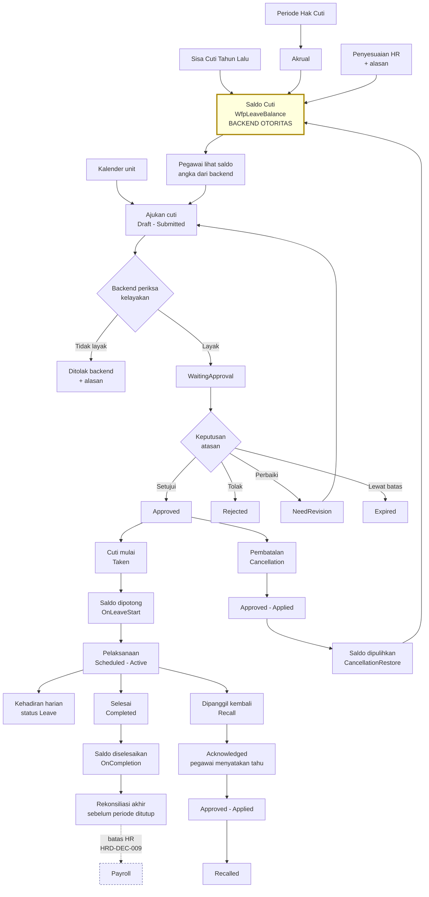

# Flow 03 — Cuti dan Izin

| Field | Value |
| --- | --- |
| Blueprint ID | `HRD-BP-001` |
| Jenis | Business process flow |
| Slice terkait | `S-A2`, `S-B2` |
| Status | `DRAFT` |
| Backend baseline | `origin/QuilvianIntegrationBackend`, diverifikasi `16b8b71` |

---

## 1. Purpose

Mengelola hak cuti, saldo, pengajuan, persetujuan, pelaksanaan, pembatalan, pemanggilan kembali,
dan rekonsiliasi cuti sampai siap diserahkan ke payroll.

**Aturan yang mengikat seluruh flow ini: backend adalah otoritas.** Saldo, hak cuti, kelayakan,
pembatalan, dan pencatatan kembali kerja seluruhnya dihitung backend. **Frontend tidak boleh
menghitung ulang satu pun aturan itu.**

Alasannya praktis. Aturan cuti punya banyak lapisan — hak dasar, akrual berjalan, sisa tahun
lalu yang dibawa, penyesuaian manual, cuti yang sedang berjalan, dan cuti yang sudah disetujui
tapi belum diambil. Bila frontend ikut menghitung, dua tempat akan memberi jawaban berbeda, dan
pegawai akan melihat saldo yang tidak sama dengan yang dipakai saat pengajuannya diperiksa.

## 2. Actors

| Aktor | Yang dikerjakan | Provenance |
| --- | --- | --- |
| Pegawai | Melihat saldo, mengajukan cuti, membatalkan, mencatat kembali kerja | `[EXISTING]` |
| Atasan | Menyetujui, menolak, atau meminta perbaikan | `[EXISTING]` |
| HR Admin | Mengelola hak cuti, penyesuaian saldo, akrual, sisa tahun lalu | `[EXISTING]` |
| HR Manager | Memanggil kembali pegawai yang sedang cuti | `[EXISTING]` — `LeaveRecallController` |
| Petugas payroll | Memeriksa kesiapan cuti sebelum periode ditutup | `[EXISTING]` |
| Sistem | Menjalankan akrual dan pembawaan sisa cuti | `[EXISTING]` |

## 3. Trigger

| Pemicu | Provenance |
| --- | --- |
| Pegawai mengajukan cuti | `[EXISTING]` |
| Periode hak cuti baru dimulai | `[EXISTING]` — `LeaveEntitlementPeriodController` |
| Akrual dijalankan | `[EXISTING]` — `LeaveAccrualController` |
| Sisa cuti tahun lalu dibawa | `[EXISTING]` — `LeaveCarryForwardController` |
| HR menyesuaikan saldo | `[EXISTING]` — `LeaveAdjustmentController` |
| Cuti mulai berjalan atau selesai | `[EXISTING]` — `LeaveExecutionController` |
| Pegawai dipanggil kembali dari cuti | `[EXISTING]` — `LeaveRecallController` |
| Periode payroll akan ditutup | `[EXISTING]` — `LeaveFinalReconciliationController` |

## 4. Preconditions

1. Pegawai punya profil workforce aktif. `[EXISTING]`
2. Periode hak cuti yang berlaku sudah ada. `[EXISTING]`
3. Jenis cuti yang diajukan terdaftar di master data. `[EXISTING]`
4. Kebijakan cuti, hak cuti, dan aturan sisa cuti sudah terisi. `[EXISTING]` untuk tempatnya,
   `[OPEN]` untuk nilainya — `HRD-Q-06`

## 5. Happy Path

1. Pegawai membuka saldo cutinya. **Backend yang menghitung.** `[EXISTING]` —
   `GET api/v1/self-services/human-resource/leave/balances`
2. Pegawai melihat kalender cuti unitnya untuk memilih tanggal. `[EXISTING]` —
   `.../leave/calendar`
3. Pegawai mengajukan cuti. Status `Draft` lalu `Submitted`. `[EXISTING]`
4. **Backend memeriksa kelayakan** terhadap saldo, jenis cuti, dan kebijakan yang berlaku.
   `[EXISTING]`
5. Pengajuan menunggu keputusan. Status `WaitingApproval`. `[EXISTING]`
6. Atasan menyetujui. Status `Approved`. `[EXISTING]`
7. Saat cuti mulai berjalan, saldo dipotong pada tahap `OnLeaveStart`. `[EXISTING]` —
   `BalanceStage`
8. Pelaksanaan cuti berjalan. Status pelaksanaan `Active`. `[EXISTING]`
9. Kehadiran pada hari cuti mendapat status `Leave`. `[EXISTING]` —
   `AttendanceIntegrationStatus.Applied`
10. Cuti selesai. Status `Taken` lalu `Completed`; saldo diselesaikan pada tahap `OnCompletion`.
    `[EXISTING]`
11. Cuti masuk rekonsiliasi akhir sebelum periode payroll ditutup. `[EXISTING]`

## 6. Alternative Flow

| Keadaan | Yang terjadi | Provenance |
| --- | --- | --- |
| Cuti setengah hari | `HalfDayPeriod`: `FirstHalf` atau `SecondHalf` | `[EXISTING]` |
| Cuti memerlukan lampiran | `AttachmentType`: `MedicalCertificate`, `SupportingDocument`, `HandoverDocument` | `[EXISTING]` |
| Lampiran perlu diverifikasi | `AttachmentVerificationStatus`: `Pending`, `Verified`, `ReuploadRequired`, `Rejected` | `[EXISTING]` |
| Pengajuan lewat aplikasi atau web | `SourceChannel`: `Web`, `Mobile`, `Api`, `Other` | `[EXISTING]` |
| Pegawai dipanggil kembali saat cuti | Alur `LeaveRecall` tersendiri dengan statusnya sendiri | `[EXISTING]` |
| Pegawai membatalkan cuti yang sudah disetujui | Alur `LeaveCancellation` tersendiri; saldo dikembalikan pada tahap `CancellationRestore` | `[EXISTING]` |
| Jenis cuti apa saja yang perlu lampiran | Belum ditetapkan | `[OPEN]` `HRD-Q-06` |
| Berapa hari hak cuti per jenis pegawai | Belum ditetapkan | `[OPEN]` `HRD-Q-06` |

## 7. Exception Flow

| Keadaan | Yang terjadi | Provenance |
| --- | --- | --- |
| Saldo tidak cukup | Backend menolak. Frontend menampilkan alasan dari backend, tidak menghitung sendiri | `[EXISTING]` |
| Pengajuan perlu diperbaiki | Status `NeedRevision`; pegawai memperbaiki lalu mengajukan lagi | `[EXISTING]` |
| Pengajuan ditolak | Status `Rejected` beserta alasannya | `[EXISTING]` |
| Pengajuan kedaluwarsa tanpa keputusan | Status `Expired` | `[EXISTING]` — berapa lama sampai kedaluwarsa `[OPEN]` |
| Penerapan ke kehadiran gagal | `AttendanceIntegrationStatus`: `Conflict`, `Failed`, `Skipped` | `[EXISTING]` |
| Pelaksanaan cuti dibatalkan atau dibalik | `ExecutionStatus`: `Cancelled`, `Reversed` | `[EXISTING]` |
| Pembatalan gagal diterapkan | `CancellationStatus.Failed` | `[EXISTING]` |
| Pemanggilan kembali gagal diterapkan | `RecallStatus.Failed` | `[EXISTING]` |
| Cuti melewati batas periode payroll | Ditangani `LeaveFinalReconciliation` | `[EXISTING]` |
| Rekonsiliasi menemukan selisih | `ReconciliationSeverity`: `Info`, `Warning`, `Critical` | `[EXISTING]` |

## 8. Approval

| Transaksi | Persetujuan | Provenance |
| --- | --- | --- |
| Pengajuan cuti | **Perlu.** `Submitted` → `WaitingApproval` → `Approved` atau `Rejected` | `[EXISTING]` |
| Pembatalan cuti | **Perlu.** Punya rantai status sendiri sampai `Approved` lalu `Applied` | `[EXISTING]` |
| Pemanggilan kembali | **Perlu.** Punya status tambahan `Acknowledged`, yang tidak ada pada alur lain | `[EXISTING]` |
| Penyesuaian saldo oleh HR | Belum terbukti ada jalur persetujuan | `[OPEN]` |
| Berapa tingkat persetujuan, dan siapa saja | Belum ditetapkan | `[OPEN]` `HRD-Q-06` |

Status `Acknowledged` pada pemanggilan kembali menunjukkan pegawai perlu **menyatakan tahu**
sebelum pemanggilan berlaku. Itu tahap yang tidak ada pada pengajuan biasa. `[EXISTING]`

**Larangan:** jangan menambahkan tingkat persetujuan yang tidak dibuktikan source. Jumlah dan
urutan penyetuju berasal dari matriks persetujuan di master data, bukan dari flow ini.
`[EXISTING]`

## 9. State Transition

### 9.1 Pengajuan cuti — `Status`

Nilai: `Draft`, `Submitted`, `WaitingApproval`, `NeedRevision`, `Approved`, `Rejected`,
`Cancelled`, `Taken`, `Completed`, `Recalled`, `Expired`. `[EXISTING]`

| Dari | Tindakan | Ke | Siapa | Provenance |
| --- | --- | --- | --- | --- |
| `Draft` | Ajukan | `Submitted` | Pegawai | `[EXISTING]` |
| `Submitted` | Masuk antrean persetujuan | `WaitingApproval` | Sistem | `[EXISTING]` |
| `WaitingApproval` | Setujui | `Approved` | Atasan | `[EXISTING]` |
| `WaitingApproval` | Tolak | `Rejected` | Atasan | `[EXISTING]` |
| `WaitingApproval` | Minta perbaikan | `NeedRevision` | Atasan | `[EXISTING]` |
| `NeedRevision` | Ajukan lagi | `Submitted` | Pegawai | `[EXISTING]` |
| `WaitingApproval` | Lewat batas waktu | `Expired` | Sistem | `[EXISTING]` |
| `Approved` | Cuti mulai berjalan | `Taken` | Sistem | `[EXISTING]` |
| `Taken` | Cuti selesai | `Completed` | Sistem | `[EXISTING]` |
| `Taken` | Dipanggil kembali | `Recalled` | HR Manager | `[EXISTING]` |
| `Draft`, `Submitted`, `WaitingApproval`, `Approved` | Batalkan | `Cancelled` | Pegawai lewat alur pembatalan | `[EXISTING]` |

**Transisi yang tidak sah:** `Completed` tidak dapat kembali ke status mana pun. Cuti yang sudah
selesai hanya dapat diperbaiki lewat penyesuaian saldo. `[EXISTING]` — disimpulkan dari
ketiadaan endpoint; perlu konfirmasi `[OPEN]`

### 9.2 Pembatalan — `CancellationStatus`

`Draft` → `Submitted` → `WaitingApproval` → `Approved` → `Applied`. Dapat menjadi
`NeedRevision`, `Rejected`, `Cancelled`, atau `Failed`. `[EXISTING]`

### 9.3 Pemanggilan kembali — `RecallStatus`

`Draft` → `Submitted` → `WaitingApproval` → **`Acknowledged`** → `Approved` → `Applied`. Dapat
menjadi `NeedRevision`, `Rejected`, `Cancelled`, atau `Failed`. `[EXISTING]`

### 9.4 Pelaksanaan — `ExecutionStatus`

`Scheduled` → `Active` → `Completed`. Dapat menjadi `Failed`, `Cancelled`, atau `Reversed`.
`[EXISTING]`

### 9.5 Penerapan ke kehadiran — `AttendanceIntegrationStatus`

`Pending` → `Applied`. Dapat menjadi `Conflict`, `Failed`, `Reversed`, atau `Skipped`.
`[EXISTING]`

### 9.6 Tahap saldo — `BalanceStage`

| Tahap | Kapan | Provenance |
| --- | --- | --- |
| `OnLeaveStart` | Saat cuti mulai berjalan | `[EXISTING]` |
| `OnCompletion` | Saat cuti selesai | `[EXISTING]` |
| `CancellationRestore` | Saat pembatalan diterapkan | `[EXISTING]` |

Tiga tahap ini penting dipahami: **saldo tidak dipotong saat pengajuan disetujui**, melainkan
saat cuti benar-benar mulai berjalan. `[EXISTING]`

## 10. Data Created/Updated

| Data | Entity | Prefix | Perlakuan |
| --- | --- | --- | --- |
| Pengajuan cuti | `WfpLeaveRequest` | `Wfp` | **Tetap `Wfp`** `[DECISION]` `HRD-DEC-019` |
| Saldo cuti | `WfpLeaveBalance` | `Wfp` | Tetap `Wfp` |
| Jenis cuti, kebijakan, hak cuti, sisa cuti, alasan penyesuaian | `MstLeaveType`, `MstLeavePolicy`, `MstLeaveEntitlementPolicy`, `MstLeaveCarryForwardPolicy`, `MstLeaveAdjustmentReason` | `Mst` | **Tetap `Mst`** `[DECISION]` `HRD-DEC-019` |
| Entity cuti lainnya | 17 model pada `LeaveManagement` | campuran | Ditentukan **per entity**; hanya `Trx*` milik HR yang di-ratchet saat materially touched |

## 11. Backend Capability

| Kemampuan | Endpoint | Status |
| --- | --- | --- |
| Alur pengajuan | `api/v1/corporate/human-resource/leave/request-workflow` | `READY TO REUSE` |
| Saldo | `.../leave/balances` | `READY TO REUSE` |
| Kalender | `.../leave/calendar` | `READY TO REUSE` |
| Periode hak cuti | `.../leave/entitlement-periods` | `READY TO REUSE` |
| Akrual | `.../leave/accrual-runs` | `READY TO REUSE` |
| Sisa cuti tahun lalu | `.../leave/carry-forward-runs` | `READY TO REUSE` |
| Penyesuaian saldo | `.../leave/adjustments` | `READY TO REUSE` |
| Pelaksanaan | `.../leave/executions` | `READY TO REUSE` |
| Pembatalan | `.../leave/cancellations` | `READY TO REUSE` |
| Pemanggilan kembali | `.../leave/recalls` | `READY TO REUSE` |
| Rekonsiliasi akhir | `.../leave/final-reconciliation` | `READY TO REUSE` |
| Integrasi payroll | `.../leave/payroll-integration` | `READY TO REUSE` sampai batas `HRD-DEC-009` |
| Layanan mandiri | `api/v1/self-services/human-resource/leave/{requests\|balances\|calendar\|cancellations\|return-to-work}` | `READY TO REUSE` |

Total 93 endpoint pada 12 controller korporat, ditambah 5 controller layanan mandiri.
`[EXISTING]`

## 12. Frontend Capability

| Kemampuan | Lokasi | Status |
| --- | --- | --- |
| Master data cuti | 5 kelompok halaman di `src/app/hr/master-data/**` | `READY TO REUSE` |
| Layanan mandiri cuti | Tidak ada | **`MISSING`** |
| Administrasi cuti | Tidak ada | **`MISSING`** |

Pencarian kata kunci `leave/` pada `src/` menghasilkan **nol** berkas yang memanggil endpoint
transaksi cuti. Seluruh 93 endpoint tidak punya pemakai. `[EXISTING]`

**Aturan yang mengikat frontend nanti:** frontend menampilkan angka saldo yang dikembalikan
backend apa adanya. Tidak boleh ada perhitungan sisa, proyeksi, maupun pemeriksaan kelayakan di
sisi frontend.

## 13. Integration Boundary

| Batas | Keterangan | Provenance |
| --- | --- | --- |
| Cuti → kehadiran | Hari cuti membentuk status `Leave` pada kehadiran harian | `[EXISTING]` |
| Cuti → payroll | Lewat `leave/payroll-integration`; berhenti pada batas `HRD-DEC-009` | `[DECISION]` |
| Cuti → jadwal | Cuti memengaruhi jadwal yang berlaku | `[EXISTING]` |
| Lampiran cuti | Pola penyimpanan belum diketahui | `[OPEN]` `HRD-DEP-006` |
| Cuti sakit dan surat keterangan dokter | Apakah ada pemeriksaan silang ke data klinis | `[BLOCKED]` — menyentuh data klinis, `HRD-DEP-007` |

## 14. Audit Requirement

| Kebutuhan | Provenance |
| --- | --- |
| Setiap perubahan saldo menyimpan tahap, alasan, dan pelaku | `[EXISTING]` — `BalanceStage` dan `MstLeaveAdjustmentReason` |
| Penyesuaian saldo manual selalu punya alasan dari master data | `[EXISTING]` |
| Penolakan menyimpan alasannya | `[EXISTING]` |
| Pemanggilan kembali menyimpan pernyataan tahu dari pegawai | `[EXISTING]` — status `Acknowledged` |
| Kegagalan penerapan tercatat, tidak hilang diam-diam | `[EXISTING]` — `Failed` pada beberapa rantai status |
| Berapa lama riwayat cuti disimpan | `[OPEN]` `HRD-Q-06` |

## 15. Blocking Decision

| ID | Isi | Dampak |
| --- | --- | --- |
| `HRD-Q-06` | Hak cuti per jenis pegawai, aturan sisa cuti, jenis cuti yang perlu lampiran, batas waktu persetujuan | Tidak memblokir alurnya; memblokir nilai master data dan rilis produksi |
| `HRD-Q-26` | **Baru.** Berapa lama pengajuan menunggu sebelum menjadi `Expired`, dan apa akibatnya bagi pegawai? | Memblokir desain final batas waktu persetujuan |
| `HRD-Q-27` | **Baru.** Apakah penyesuaian saldo oleh HR memerlukan persetujuan? Source tidak menunjukkan jalur persetujuan, padahal ini mengubah hak pegawai | Memblokir desain final penyesuaian saldo |
| `HRD-Q-28` | **Baru.** Apakah cuti berstatus `Completed` benar-benar tidak dapat dibatalkan, dan koreksinya hanya lewat penyesuaian saldo? | Memblokir tabel transisi final |
| `HRD-Q-29` | **Baru.** Saat pemanggilan kembali, apakah sisa hari cuti dikembalikan penuh ke saldo? | Memblokir desain final pemanggilan kembali |

## 16. Acceptance Criteria

| ID | Kriteria | Cara menguji |
| --- | --- | --- |
| `AC-F03-01` | Backend adalah otoritas saldo | Ubah saldo lewat penyesuaian; angka di layar pegawai ikut berubah tanpa perhitungan frontend |
| `AC-F03-02` | Frontend tidak menghitung kelayakan | Ajukan cuti melebihi saldo; penolakan datang dari backend beserta alasannya |
| `AC-F03-03` | Saldo dipotong saat cuti mulai, bukan saat disetujui | Setujui cuti untuk bulan depan; saldo belum berubah sampai tanggal mulainya tiba |
| `AC-F03-04` | Pembatalan mengembalikan saldo | Batalkan cuti yang sudah disetujui; saldo pulih lewat tahap `CancellationRestore` |
| `AC-F03-05` | Hari cuti terlihat pada kehadiran | Setelah cuti berjalan, kehadiran harian pada tanggal itu berstatus `Leave` |
| `AC-F03-06` | Pemanggilan kembali menunggu pernyataan pegawai | Pemanggilan tidak berlaku sebelum status `Acknowledged` tercapai |
| `AC-F03-07` | Kegagalan penerapan tidak hilang | Buat penerapan gagal; statusnya menjadi `Failed` dan muncul di daftar pantau |

## 17. Diagram

Kotak kuning bergaris tebal adalah saldo — satu-satunya sumber kebenaran. Setiap panah yang
mengubahnya melewati tahap saldo yang bernama, sehingga selalu dapat ditelusuri kapan dan kenapa
saldo berubah.
