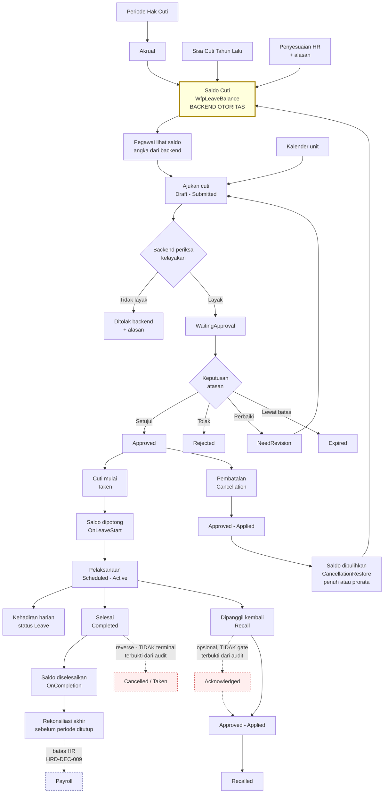

# Flow 03 — Cuti dan Izin

| Field | Value |
| --- | --- |
| Blueprint ID | `HRD-BP-001` |
| Jenis | Business process flow |
| Slice terkait | `S-A2`, `S-B2` |
| Status | `DRAFT` |
| Backend baseline | `origin/QuilvianIntegrationBackend`, diverifikasi `16b8b71` |

---

## 1. Purpose

Mengelola hak cuti, saldo, pengajuan, persetujuan, pelaksanaan, pembatalan, pemanggilan kembali,
dan rekonsiliasi cuti sampai siap diserahkan ke payroll.

**Aturan yang mengikat seluruh flow ini: backend adalah otoritas.** Saldo, hak cuti, kelayakan,
pembatalan, dan pencatatan kembali kerja seluruhnya dihitung backend. **Frontend tidak boleh
menghitung ulang satu pun aturan itu.**

Alasannya praktis. Aturan cuti punya banyak lapisan — hak dasar, akrual berjalan, sisa tahun
lalu yang dibawa, penyesuaian manual, cuti yang sedang berjalan, dan cuti yang sudah disetujui
tapi belum diambil. Bila frontend ikut menghitung, dua tempat akan memberi jawaban berbeda, dan
pegawai akan melihat saldo yang tidak sama dengan yang dipakai saat pengajuannya diperiksa.

## 2. Actors

| Aktor | Yang dikerjakan | Provenance |
| --- | --- | --- |
| Pegawai | Melihat saldo, mengajukan cuti, membatalkan, mencatat kembali kerja | `[EXISTING]` |
| Atasan | Menyetujui, menolak, atau meminta perbaikan | `[EXISTING]` |
| HR Admin | Mengelola hak cuti, penyesuaian saldo, akrual, sisa tahun lalu | `[EXISTING]` |
| HR Manager | Memanggil kembali pegawai yang sedang cuti | `[EXISTING]` — `LeaveRecallController` |
| Petugas payroll | Memeriksa kesiapan cuti sebelum periode ditutup | `[EXISTING]` |
| Sistem | Menjalankan akrual dan pembawaan sisa cuti | `[EXISTING]` |

## 3. Trigger

| Pemicu | Provenance |
| --- | --- |
| Pegawai mengajukan cuti | `[EXISTING]` |
| Periode hak cuti baru dimulai | `[EXISTING]` — `LeaveEntitlementPeriodController` |
| Akrual dijalankan | `[EXISTING]` — `LeaveAccrualController` |
| Sisa cuti tahun lalu dibawa | `[EXISTING]` — `LeaveCarryForwardController` |
| HR menyesuaikan saldo | `[EXISTING]` — `LeaveAdjustmentController` |
| Cuti mulai berjalan atau selesai | `[EXISTING]` — `LeaveExecutionController` |
| Pegawai dipanggil kembali dari cuti | `[EXISTING]` — `LeaveRecallController` |
| Periode payroll akan ditutup | `[EXISTING]` — `LeaveFinalReconciliationController` |

## 4. Preconditions

1. Pegawai punya profil workforce aktif. `[EXISTING]`
2. Periode hak cuti yang berlaku sudah ada. `[EXISTING]`
3. Jenis cuti yang diajukan terdaftar di master data. `[EXISTING]`
4. Kebijakan cuti, hak cuti, dan aturan sisa cuti sudah terisi. `[EXISTING]` untuk tempatnya,
   `[OPEN]` untuk nilainya — `HRD-Q-06`

## 5. Happy Path

1. Pegawai membuka saldo cutinya. **Backend yang menghitung.** `[EXISTING]` —
   `GET api/v1/self-services/human-resource/leave/balances`
2. Pegawai melihat kalender cuti unitnya untuk memilih tanggal. `[EXISTING]` —
   `.../leave/calendar`
3. Pegawai mengajukan cuti. Status `Draft` lalu `Submitted`. `[EXISTING]`
4. **Backend memeriksa kelayakan** terhadap saldo, jenis cuti, dan kebijakan yang berlaku.
   `[EXISTING]`
5. Pengajuan menunggu keputusan. Status `WaitingApproval`. `[EXISTING]`
6. Atasan menyetujui. Status `Approved`. `[EXISTING]`
7. Saat cuti mulai berjalan, saldo dipotong pada tahap `OnLeaveStart`. `[EXISTING]` —
   `BalanceStage`
8. Pelaksanaan cuti berjalan. Status pelaksanaan `Active`. `[EXISTING]`
9. Kehadiran pada hari cuti mendapat status `Leave`. `[EXISTING]` —
   `AttendanceIntegrationStatus.Applied`
10. Cuti selesai. Status `Taken` lalu `Completed`; saldo diselesaikan pada tahap `OnCompletion`.
    `[EXISTING]`
11. Cuti masuk rekonsiliasi akhir sebelum periode payroll ditutup. `[EXISTING]`

## 6. Alternative Flow

| Keadaan | Yang terjadi | Provenance |
| --- | --- | --- |
| Cuti setengah hari | `HalfDayPeriod`: `FirstHalf` atau `SecondHalf` | `[EXISTING]` |
| Cuti memerlukan lampiran | `AttachmentType`: `MedicalCertificate`, `SupportingDocument`, `HandoverDocument` | `[EXISTING]` |
| Lampiran perlu diverifikasi | `AttachmentVerificationStatus`: `Pending`, `Verified`, `ReuploadRequired`, `Rejected` | `[EXISTING]` |
| Pengajuan lewat aplikasi atau web | `SourceChannel`: `Web`, `Mobile`, `Api`, `Other` | `[EXISTING]` |
| Pegawai dipanggil kembali saat cuti | Alur `LeaveRecall` tersendiri dengan statusnya sendiri | `[EXISTING]` |
| Pegawai membatalkan cuti yang sudah disetujui | Alur `LeaveCancellation` tersendiri; saldo dikembalikan pada tahap `CancellationRestore` | `[EXISTING]` |
| Jenis cuti apa saja yang perlu lampiran | Belum ditetapkan | `[OPEN]` `HRD-Q-06` |
| Berapa hari hak cuti per jenis pegawai | Belum ditetapkan | `[OPEN]` `HRD-Q-06` |

## 7. Exception Flow

| Keadaan | Yang terjadi | Provenance |
| --- | --- | --- |
| Saldo tidak cukup | Backend menolak. Frontend menampilkan alasan dari backend, tidak menghitung sendiri | `[EXISTING]` |
| Pengajuan perlu diperbaiki | Status `NeedRevision`; pegawai memperbaiki lalu mengajukan lagi | `[EXISTING]` |
| Pengajuan ditolak | Status `Rejected` beserta alasannya | `[EXISTING]` |
| Pengajuan kedaluwarsa tanpa keputusan | Status `Expired` | `[EXISTING]` — berapa lama sampai kedaluwarsa `[OPEN]` |
| Penerapan ke kehadiran gagal | `AttendanceIntegrationStatus`: `Conflict`, `Failed`, `Skipped` | `[EXISTING]` |
| Pelaksanaan cuti dibatalkan atau dibalik | `ExecutionStatus`: `Cancelled`, `Reversed` | `[EXISTING]` |
| Pembatalan gagal diterapkan | `CancellationStatus.Failed` | `[EXISTING]` |
| Pemanggilan kembali gagal diterapkan | `RecallStatus.Failed` | `[EXISTING]` |
| Cuti melewati batas periode payroll | Ditangani `LeaveFinalReconciliation` | `[EXISTING]` |
| Rekonsiliasi menemukan selisih | `ReconciliationSeverity`: `Info`, `Warning`, `Critical` | `[EXISTING]` |

## 8. Approval

| Transaksi | Persetujuan | Provenance |
| --- | --- | --- |
| Pengajuan cuti | **Perlu.** `Submitted` → `WaitingApproval` → `Approved` atau `Rejected` | `[EXISTING]` |
| Pembatalan cuti | **Perlu.** Punya rantai status sendiri sampai `Approved` lalu `Applied` | `[EXISTING]` |
| Pemanggilan kembali | **Perlu**, tapi lihat koreksi di bawah — `Acknowledged` **tidak terbukti** menjadi gate wajib | State vocabulary: `[EXISTING]`. Transition edge: **DISPROVEN**, lihat bagian 9.3 |
| Penyesuaian saldo oleh HR | Belum terbukti ada jalur persetujuan | `[OPEN]` |
| Berapa tingkat persetujuan, dan siapa saja | Belum ditetapkan | `[OPEN]` `HRD-Q-06` |

**Koreksi audit source, 27 Agustus 2026 — `Acknowledged` bukan gate yang terbukti.** Klaim
sebelumnya di sini keliru. `LeaveRecallWorkflowLifecycleService.MapStatus` memetakan status
mesin workflow generik langsung ke `Draft`/`WaitingApproval`/`NeedRevision`/`Rejected`/
`Cancelled`/**`Approved`** — tidak pernah mengembalikan atau memeriksa `Acknowledged`.
`SynchronizeAsync` menulis `entity.RecallStatus = targetStatus` tanpa memeriksa status
sebelumnya. `Acknowledged` hanya pernah diset oleh `LeaveRecallService.AcknowledgeReturnToWorkAsync`
yang terpisah dan **opsional** — pencarian `Acknowledged` di seluruh `WorkflowManagement`
menghasilkan nol rujukan lain. Artinya alur pemanggilan kembali **dapat** berpindah
`WaitingApproval` → `Approved` tanpa melewati `Acknowledged` sama sekali. `[EXISTING]` — dibuktikan
dari kode, bukan dianggap benar karena nilainya ada.

**Otoritas persetujuan — terbukti sebagai matriks yang dapat dikonfigurasi, bukan hardcode.**
Endpoint persetujuan (`WorkflowInstanceController`, `ApprovalInboxController`) memakai
`[AccessPermission(...,"Approve")]` generik. Siapa yang ditugaskan sebagai approver ditentukan
`WorkflowService.ResolveApproversAsync`, yang mendukung sumber `RequesterManager`, `ManagerLevel`,
`SpecificUser`, `Position`, `OrganizationUnit`, `Role*`, `ApprovalMatrix`, atau
`RequesterSelected` dari `MstWorkflowStep`/`MstApprovalMatrix`. Gate sebenarnya:
`assignment.AssignedApproverUserId == actorContext.UserId` — siapa pun yang ditunjuk sumber
konfigurasi itu, **bukan** selalu "atasan langsung". `[EXISTING]`

**Larangan:** jangan menambahkan tingkat persetujuan yang tidak dibuktikan source. Jumlah dan
urutan penyetuju berasal dari matriks persetujuan di master data, bukan dari flow ini.
`[EXISTING]`

## 9. State Transition

### 9.1 Pengajuan cuti — `Status`

Nilai: `Draft`, `Submitted`, `WaitingApproval`, `NeedRevision`, `Approved`, `Rejected`,
`Cancelled`, `Taken`, `Completed`, `Recalled`, `Expired`. `[EXISTING]` — dari
`LeaveRequestValueConstants.Status`.

**`HRD-Q-44` tertutup lewat audit source, `PHASE 2B.1`.** Klaim granular pada `WfpLeaveRequest.cs`
baris 89–92 (`WaitingSupervisorApproval → WaitingManagerApproval → WaitingHrVerification`) adalah
**komentar template yang disalin**, bukan implementasi — komentar identik ditemukan pula pada
`TrxExpenseClaim.cs` baris 95–96, entity yang tidak berhubungan sama sekali. Pencarian literal
ketiga nama status itu di seluruh source menghasilkan nol hasil eksekutabel. `WfpLeaveRequest.
LeaveRequestStatus` adalah `string` yang setiap jalur tulisnya memakai
`LeaveRequestValueConstants.Status.*`; `LeaveRequestWorkflowLifecycleService.MapStatus`
memetakan seluruh status workflow non-terminal ke **satu** nilai `WaitingApproval`. Tabel di
bawah **final** — tidak ada kontradiksi yang tersisa.

**Catatan lapisan terpisah, bukan pengganti tabel di bawah:** mesin workflow generik
(`MstWorkflowStep.StepOrder`, `WfpLeaveRequest.CurrentApprovalStep`) **memang mendukung** rantai
persetujuan bertingkat secara struktural — tetapi ini granularitas di lapisan *workflow step*,
bukan status domain `LeaveRequestStatus`. Status domain tetap `WaitingApproval` tunggal di
sepanjang tingkatan apa pun yang dikonfigurasi. Jangan mencampur kedua lapisan ini.

**Catatan tambahan — `TrxLeaveRequestApproval` (`HRD-Q-46`, `PHASE 2B.1`).** Entity ini hanya
berupa `DbSet`, konfigurasi EF, dan hasil `CreateTable` migration tanpa satu pun jalur baca/tulis
aktif. Alur persetujuan cuti yang benar-benar berjalan seluruhnya lewat
`TrxWorkflowInstance`/`TrxWorkflowApproverAssignment`. Jangan mendasarkan desain apa pun pada
`TrxLeaveRequestApproval`.

| Aspek | Nilai |
| --- | --- |
| `CURRENT` | `LEGACY_UNUSED` — terbukti source, tidak ada read/write aktif |
| `TARGET` | `retirement candidate` — kandidat dipensiunkan, bukan keputusan final |
| `DESTRUCTIVE ACTION` | **`[BLOCKED]`** oleh `HRD-Q-05` / bukti database. **Jangan menghapus, men-`DROP`, atau menganggap tabelnya kosong** — `LEGACY_UNUSED` di lapisan kode tidak membuktikan tidak ada data yang masuk lewat jalur lain (impor manual, migrasi V1), sama seperti enam domain tanpa API pada `S-D1`–`S-D5` |

| Dari | Tindakan | Ke | Siapa | Provenance |
| --- | --- | --- | --- | --- |
| `Draft` | Ajukan | `Submitted` | Pegawai | `[EXISTING]` |
| `Submitted` | Masuk antrean persetujuan | `WaitingApproval` | Sistem | `[EXISTING]` |
| `WaitingApproval` | Setujui | `Approved` | Atasan | `[EXISTING]` |
| `WaitingApproval` | Tolak | `Rejected` | Atasan | `[EXISTING]` |
| `WaitingApproval` | Minta perbaikan | `NeedRevision` | Atasan | `[EXISTING]` |
| `NeedRevision` | Ajukan lagi | `Submitted` | Pegawai | `[EXISTING]` |
| `WaitingApproval` | Lewat batas waktu | `Expired` | Sistem | `[EXISTING]` |
| `Approved` | Cuti mulai berjalan | `Taken` | Sistem | `[EXISTING]` |
| `Taken` | Cuti selesai | `Completed` | Sistem | `[EXISTING]` |
| `Taken` | Dipanggil kembali | `Recalled` | HR Manager | `[EXISTING]` |
| `Draft`, `Submitted`, `WaitingApproval`, `Approved` | Batalkan | `Cancelled` | Pegawai lewat alur pembatalan | `[EXISTING]` |

**Koreksi audit source, 27 Agustus 2026 — klaim "`Completed` tidak dapat kembali" DISPROVEN.**
`LeaveExecutionController` mengekspos `POST /{leaveRequestId}/reverse` **tanpa guard status apa
pun** di controller. Pada `LeaveExecutionProcessorService.ReverseAsync`, satu-satunya blokir
adalah `execution.ExecutionStatus == Reversed` — tidak ada yang mencegah eksekusi berstatus
`Completed` diproses. Pembalikan penuh menulis `LeaveRequestStatus = Cancelled`; pembalikan
sebagian dapat menulis kembali ke `Taken`. Method yang sama juga dipanggil dari jalur auto-apply
pemanggilan kembali. **`Completed` → `Cancelled`/`Taken` adalah jalur kode nyata yang dapat
dijangkau, bukan asumsi.** `[EXISTING]` — `HRD-Q-28` tertutup dengan jawaban: tidak, `Completed`
bukan status akhir yang benar-benar terjaga; koreksinya bukan hanya lewat penyesuaian saldo,
melainkan juga lewat `/reverse`.

**`HRD-DEC-023`, 27 Agustus 2026 — `HRD-Q-35` ditutup.** Target behavior: `[DECISION]`
`HRD-DEC-023` — `Completed` adalah **business-final untuk operasi normal**, tetapi *controlled
reversal* tetap kemampuan yang sah. `Reverse` wajib: permission khusus, `reason` wajib,
`actor`/`timestamp` wajib, rekonsiliasi kehadiran, pembalikan/perhitungan ulang saldo, dan guard
periode payroll locked/finalized. Bila payroll locked/finalized, histori `Completed` **tidak**
boleh dimutasi langsung — wajib pakai transaksi adjustment/revision terpisah.

**Current implementation vs target — celah eksplisit:**

| Current behavior | Status terhadap `HRD-DEC-023` |
| --- | --- |
| `POST /{leaveRequestId}/reverse` tanpa guard status, tanpa permission khusus yang terbukti, tanpa `reason` wajib | `[EXISTING]` (perilaku hari ini) — **`IMPLEMENTATION DEFECT`**, perlu `REPAIR` |
| Pembalikan/perhitungan ulang saldo saat reverse | `[EXISTING]` sebagian — `ReverseAsync`/`RestoreAsync` memang memutasi saldo; rekonsiliasi kehadiran otomatis belum diverifikasi |
| Guard "payroll locked/finalized mencegah mutasi langsung, wajib adjustment/revision" | **`MISSING`** terhadap target |

Tidak ada perubahan source pada pass ini; tabel di atas adalah pencatatan celah, bukan
perbaikannya.

### 9.2 Pembatalan — `CancellationStatus`

`Draft` → `Submitted` → `WaitingApproval` → `Approved` → `Applied`. Dapat menjadi
`NeedRevision`, `Rejected`, `Cancelled`, atau `Failed`. `[EXISTING]`

### 9.3 Pemanggilan kembali — `RecallStatus`

State vocabulary: `Draft`, `Submitted`, `WaitingApproval`, `Acknowledged`, `Approved`, `Applied`,
`NeedRevision`, `Rejected`, `Cancelled`, `Failed` — seluruhnya `[EXISTING]` sebagai nilai enum.

**Transition edge `WaitingApproval` → `Acknowledged` → `Approved` : DISPROVEN.**
`LeaveRecallWorkflowLifecycleService.MapStatus` memetakan mesin workflow generik langsung ke
`WaitingApproval` → `Approved`, **tidak pernah** melalui atau memeriksa `Acknowledged`.
`Acknowledged` hanya diset lewat `LeaveRecallService.AcknowledgeReturnToWorkAsync` yang berdiri
sendiri dan opsional. Urutan yang benar menurut source adalah:

`Draft` → `Submitted` → `WaitingApproval` → `Approved` → `Applied`, dengan `Acknowledged` sebagai
**status paralel opsional**, bukan gate wajib di antara `WaitingApproval` dan `Approved`.

**`HRD-DEC-024`, 27 Agustus 2026 — `HRD-Q-36` ditutup.** Target behavior: `[DECISION]`
`HRD-DEC-024` — `Acknowledged` **bukan** prerequisite untuk `Approved`; persetujuan adalah
keputusan organisasi. Target flow: `WaitingApproval` → `Approved` → notifikasi dikirim →
`Acknowledged` → `Applied`. `Acknowledged` adalah bukti pegawai menerima pemberitahuan, bukan
syarat sebelum organisasi memutuskan. HR Manager dapat melakukan **acknowledgement override**
sebelum `Applied` dengan `reason`/`actor`/`timestamp`/audit trail wajib. Pegawai **tidak boleh**
memblokir keputusan recall selamanya hanya dengan tidak melakukan acknowledge.

**Current implementation vs target:**

| Current behavior | Status terhadap `HRD-DEC-024` |
| --- | --- |
| `MapStatus` memetakan `WaitingApproval` → `Approved` langsung tanpa melalui `Acknowledged` | **Sudah sejalan dengan target** — `[EXISTING]`, tidak perlu `REPAIR` pada urutan ini |
| Notifikasi otomatis ke pegawai setelah `Approved`, sebelum `Applied` | `[OPEN]`/`UNVERIFIED` — belum diaudit apakah mekanisme ini ada |
| Mekanisme "HR Manager acknowledgement override" dengan `reason`/`actor`/`timestamp`/audit trail wajib | **`MISSING`** — `AcknowledgeReturnToWorkAsync` yang ada hari ini adalah aksi pegawai sendiri, bukan override HR Manager dengan syarat wajib tersebut |

Tidak ada perubahan source pada pass ini; tabel di atas adalah pencatatan celah, bukan
perbaikannya.

### 9.4 Pelaksanaan — `ExecutionStatus`

`Scheduled` → `Active` → `Completed`. Dapat menjadi `Failed`, `Cancelled`, atau `Reversed`.
`[EXISTING]`

### 9.5 Penerapan ke kehadiran — `AttendanceIntegrationStatus`

`Pending` → `Applied`. Dapat menjadi `Conflict`, `Failed`, `Reversed`, atau `Skipped`.
`[EXISTING]`

### 9.6 Tahap saldo — `BalanceStage`

Audit source, 27 Agustus 2026: ketiga tahap dibuktikan sebagai **transisi nyata**, bukan sekadar
nilai enum.

| Tahap | Kapan | Transition edge — evidence |
| --- | --- | --- |
| `OnLeaveStart` | Saat cuti mulai berjalan | `[EXISTING]` — `LeaveExecutionProcessorService.ExecuteAsync`: bila `asOfDate >= StartDate` dan `LeavePolicy.DeductionTiming == OnLeaveStart`, memanggil `LeaveExecutionBalanceService.ApplyDeductionStageAsync(..., BalanceStage.OnLeaveStart)`, yang mengubah `ReservedDays` menjadi `UsedDays` dan mencatat ledger `Deduction` (idempoten lewat key `LEAVE-REQUEST-DEDUCTION:{id}:ONLEAVESTART`) |
| `OnCompletion` | Saat cuti selesai | `[EXISTING]` — metode `ApplyDeductionStageAsync` **yang sama**, dipanggil ulang dengan `BalanceStage.OnCompletion` setelah seluruh hari integrasi kehadiran `Applied` tanpa konflik/kegagalan, lalu status diset `Completed` |
| `CancellationRestore` | Saat pembatalan diterapkan | `[EXISTING]` — `LeaveExecutionBalanceService.RestoreAsync`, dipanggil dari `ApplyApprovedCancellationAsync` → `ReverseAsync`, mencatat ledger `CancellationRestore`. **Bukan selalu pemulihan penuh** — lihat catatan proration di bawah |

Tiga tahap ini penting dipahami: **saldo tidak dipotong saat pengajuan disetujui**, melainkan
saat cuti benar-benar mulai berjalan. `[EXISTING]`

**Koreksi — `CancellationRestore` dapat prorata, tidak selalu penuh.** Jumlah yang dipulihkan
memakai parameter `cancellation.RestoredDays`, dihitung
`LeaveCancellationService.CalculateRestoredDaysAsync`: pemulihan **penuh** hanya bila
`effectiveDate <= leave.StartDate`; selain itu jumlahnya **diprorata harian kalender**
(`EstimatedBalanceDeduction * sisaHariKalender / totalHariKalender`). `AC-F03-04` di bagian 16
perlu direvisi karena mengasumsikan pemulihan selalu penuh. `[EXISTING]`

## 10. Data Created/Updated

| Data | Entity | Prefix | Perlakuan |
| --- | --- | --- | --- |
| Pengajuan cuti | `WfpLeaveRequest` | `Wfp` | **Tetap `Wfp`** `[DECISION]` `HRD-DEC-019` |
| Saldo cuti | `WfpLeaveBalance` | `Wfp` | Tetap `Wfp` |
| Jenis cuti, kebijakan, hak cuti, sisa cuti, alasan penyesuaian | `MstLeaveType`, `MstLeavePolicy`, `MstLeaveEntitlementPolicy`, `MstLeaveCarryForwardPolicy`, `MstLeaveAdjustmentReason` | `Mst` | **Tetap `Mst`** `[DECISION]` `HRD-DEC-019` |
| Entity cuti lainnya | 17 model pada `LeaveManagement` | campuran | Ditentukan **per entity**; hanya `Trx*` milik HR yang di-ratchet saat materially touched |

## 11. Backend Capability

| Kemampuan | Endpoint | Status |
| --- | --- | --- |
| Alur pengajuan | `api/v1/corporate/human-resource/leave/request-workflow` | `READY TO REUSE` |
| Saldo | `.../leave/balances` | `READY TO REUSE` |
| Kalender | `.../leave/calendar` | `READY TO REUSE` |
| Periode hak cuti | `.../leave/entitlement-periods` | `READY TO REUSE` |
| Akrual | `.../leave/accrual-runs` | `READY TO REUSE` |
| Sisa cuti tahun lalu | `.../leave/carry-forward-runs` | `READY TO REUSE` |
| Penyesuaian saldo | `.../leave/adjustments` | `READY TO REUSE` |
| Pelaksanaan | `.../leave/executions` | `READY TO REUSE` |
| Pembatalan | `.../leave/cancellations` | `READY TO REUSE` |
| Pemanggilan kembali | `.../leave/recalls` | `READY TO REUSE` |
| Rekonsiliasi akhir | `.../leave/final-reconciliation` | `READY TO REUSE` |
| Integrasi payroll | `.../leave/payroll-integration` | `READY TO REUSE` sampai batas `HRD-DEC-009` |
| Layanan mandiri | `api/v1/self-services/human-resource/leave/{requests\|balances\|calendar\|cancellations\|return-to-work}` | `READY TO REUSE` |

Total 93 endpoint pada 12 controller korporat, ditambah 5 controller layanan mandiri.
`[EXISTING]`

## 12. Frontend Capability

| Kemampuan | Lokasi | Status |
| --- | --- | --- |
| Master data cuti | 5 kelompok halaman di `src/app/hr/master-data/**` | `READY TO REUSE` |
| Layanan mandiri cuti | Tidak ada | **`MISSING`** |
| Administrasi cuti | Tidak ada | **`MISSING`** |

Pencarian kata kunci `leave/` pada `src/` menghasilkan **nol** berkas yang memanggil endpoint
transaksi cuti. Seluruh 93 endpoint tidak punya pemakai. `[EXISTING]`

**Aturan yang mengikat frontend nanti:** frontend menampilkan angka saldo yang dikembalikan
backend apa adanya. Tidak boleh ada perhitungan sisa, proyeksi, maupun pemeriksaan kelayakan di
sisi frontend.

## 13. Integration Boundary

| Batas | Keterangan | Provenance |
| --- | --- | --- |
| Cuti → kehadiran | Hari cuti membentuk status `Leave` pada kehadiran harian | `[EXISTING]` |
| Cuti → payroll | Lewat `leave/payroll-integration`; berhenti pada batas `HRD-DEC-009` | `[DECISION]` |
| Cuti → jadwal | Cuti memengaruhi jadwal yang berlaku | `[EXISTING]` |
| Lampiran cuti | Pola penyimpanan belum diketahui | `[OPEN]` `HRD-DEP-006` |
| Cuti sakit dan surat keterangan dokter | Apakah ada pemeriksaan silang ke data klinis | `[BLOCKED]` — menyentuh data klinis, `HRD-DEP-007` |

## 14. Audit Requirement

| Kebutuhan | Provenance |
| --- | --- |
| Setiap perubahan saldo menyimpan tahap, alasan, dan pelaku | `[EXISTING]` — `BalanceStage` dan `MstLeaveAdjustmentReason` |
| Penyesuaian saldo manual selalu punya alasan dari master data | `[EXISTING]` |
| Penolakan menyimpan alasannya | `[EXISTING]` |
| Pemanggilan kembali dapat menyimpan pernyataan tahu dari pegawai | `[EXISTING]` — `LeaveRecallService.AcknowledgeReturnToWorkAsync` tersedia, tetapi **opsional**, tidak wajib dilalui sebelum `Approved`. Lihat bagian 9.3 |
| Kegagalan penerapan tercatat, tidak hilang diam-diam | `[EXISTING]` — `Failed` pada beberapa rantai status |
| Berapa lama riwayat cuti disimpan | `[OPEN]` `HRD-Q-06` |

## 15. Blocking Decision

| ID | Isi | Dampak |
| --- | --- | --- |
| `HRD-Q-06` | Hak cuti per jenis pegawai, aturan sisa cuti, jenis cuti yang perlu lampiran, batas waktu persetujuan | Tidak memblokir alurnya; memblokir nilai master data dan rilis produksi |
| `HRD-Q-26` | **Baru.** Berapa lama pengajuan menunggu sebelum menjadi `Expired`, dan apa akibatnya bagi pegawai? | Memblokir desain final batas waktu persetujuan |
| `HRD-Q-27` | **Baru.** Apakah penyesuaian saldo oleh HR memerlukan persetujuan? Source tidak menunjukkan jalur persetujuan, padahal ini mengubah hak pegawai | Memblokir desain final penyesuaian saldo |
| `HRD-Q-28` | **Tertutup lewat audit source, 27 Agustus 2026.** Jawabannya **tidak** — `Completed` dapat kembali ke `Cancelled`/`Taken` lewat `POST /{leaveRequestId}/reverse` tanpa guard status. Keputusan susulan ditutup `HRD-DEC-023` | Terjawab; lihat `HRD-Q-35` untuk keputusan susulan |
| `HRD-Q-29` | Saat pemanggilan kembali, apakah sisa hari cuti dikembalikan penuh ke saldo? **Sebagian source-resolvable**: mekanisme pembalikan (`ReverseAsync`/`RestoreAsync`) terbukti dipakai ulang oleh jalur recall, dan untuk pembatalan biasa terbukti **prorata**, bukan selalu penuh (lihat bagian 9.6). Belum diverifikasi apakah jalur recall memakai proration yang sama atau perhitungan lain — audit lanjutan diperlukan sebelum menjawab tuntas | Memblokir desain final pemanggilan kembali |
| `HRD-Q-35` | **Tertutup `HRD-DEC-023`, 27 Agustus 2026.** `Completed` business-final untuk operasi normal, controlled reversal tetap sah dengan enam syarat wajib. Current `/reverse` ditandai `IMPLEMENTATION DEFECT`, perlu `REPAIR` di luar cakupan blueprint | Memblokir perbaikan implementasi, bukan desain flow — desainnya sudah final |
| `HRD-Q-36` | **Tertutup `HRD-DEC-024`, 27 Agustus 2026.** `Acknowledged` bukan gate; target flow notification-then-acknowledge dengan HR Manager override. Mekanisme override ditandai `MISSING`, di luar cakupan blueprint | Memblokir implementasi mekanisme override, bukan desain flow — desainnya sudah final |

## 16. Acceptance Criteria

| ID | Kriteria | Cara menguji |
| --- | --- | --- |
| `AC-F03-01` | Backend adalah otoritas saldo | Ubah saldo lewat penyesuaian; angka di layar pegawai ikut berubah tanpa perhitungan frontend |
| `AC-F03-02` | Frontend tidak menghitung kelayakan | Ajukan cuti melebihi saldo; penolakan datang dari backend beserta alasannya |
| `AC-F03-03` | Saldo dipotong saat cuti mulai, bukan saat disetujui | Setujui cuti untuk bulan depan; saldo belum berubah sampai tanggal mulainya tiba |
| `AC-F03-04` | Pembatalan mengembalikan saldo **sesuai formula proration**, bukan selalu penuh | Batalkan cuti yang sudah disetujui sebelum tanggal mulai; saldo pulih penuh lewat `CancellationRestore`. Batalkan **setelah** tanggal mulai; saldo pulih **prorata** sesuai sisa hari kalender, bukan penuh — direvisi dari klaim sebelumnya |
| `AC-F03-05` | Hari cuti terlihat pada kehadiran | Setelah cuti berjalan, kehadiran harian pada tanggal itu berstatus `Leave` |
| `AC-F03-06` | **Direvisi — tidak berlaku sebagai kriteria hari ini.** Klaim "pemanggilan menunggu `Acknowledged`" terbukti salah dari audit source. Kriteria yang valid: pemanggilan kembali **dapat** mencatat pernyataan tahu pegawai lewat `AcknowledgeReturnToWorkAsync`, tetapi status `Approved` **tidak** menunggunya | Panggil kembali pegawai tanpa memanggil endpoint acknowledge; alur tetap dapat mencapai `Approved` — ini perilaku sekarang, bukan cacat yang perlu "diperbaiki" tanpa keputusan produk |
| `AC-F03-07` | Kegagalan penerapan tidak hilang | Buat penerapan gagal; statusnya menjadi `Failed` dan muncul di daftar pantau |

## 17. Diagram

Kotak merah putus-putus (`Acknowledged`, `Cancelled / Taken` dari `Completed`) menandai dua klaim
lama yang **dibuktikan salah** oleh audit source 27 Agustus 2026: `Acknowledged` bukan gate wajib
sebelum `Approved`, dan `Completed` bukan status akhir yang benar-benar terjaga sistem.

Kotak kuning bergaris tebal adalah saldo — satu-satunya sumber kebenaran. Setiap panah yang
mengubahnya melewati tahap saldo yang bernama, sehingga selalu dapat ditelusuri kapan dan kenapa
saldo berubah.
