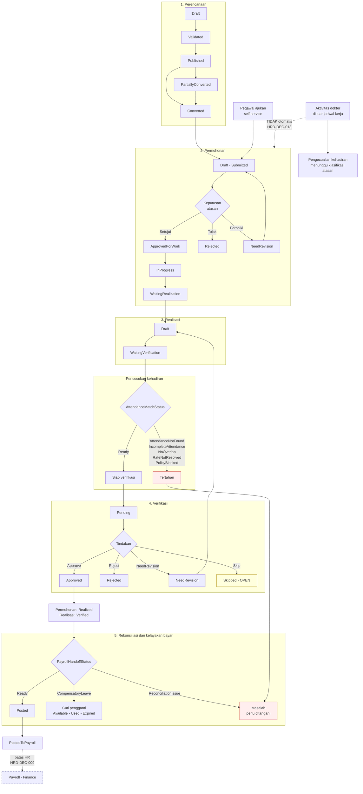

# Flow 04 — Lembur

| Field | Value |
| --- | --- |
| Blueprint ID | `HRD-BP-001` |
| Jenis | Business process flow |
| Slice terkait | `S-A3`, `S-B3` |
| Status | `DRAFT` |
| Backend baseline | `origin/QuilvianIntegrationBackend`, diverifikasi `16b8b71` |

---

## 1. Purpose

Mengelola lembur dari perencanaan sampai siap dibayar, melalui lima tahap yang **terpisah tegas
di source**, bukan digabung menjadi satu:

| Tahap | Pertanyaan yang dijawab | Bukti |
| --- | --- | --- |
| **Perencanaan** | Siapa yang direncanakan lembur, kapan? | `OvertimePlanController`, `PlanStatus` |
| **Permohonan** | Siapa yang mengajukan, dan disetujui atau tidak? | `OvertimeWorkflowController`, `RequestStatus` |
| **Realisasi** | Berapa jam yang benar-benar dikerjakan? | `OvertimeRealizationController`, `RealizationStatus` |
| **Verifikasi** | Apakah realisasinya benar? | `OvertimeVerificationController`, `VerificationStatus` |
| **Rekonsiliasi dan kelayakan bayar** | Apakah sudah cocok dengan kehadiran, dan layak masuk payroll? | `OvertimeReconciliationController`, `AttendanceMatchStatus`, `PayrollHandoffStatus` |

Pemisahan ini bukan usulan saya. Kelimanya sudah punya controller, status, dan endpoint sendiri
di backend. `[EXISTING]`

Yang membuat pemisahan ini penting: **jam yang direncanakan, jam yang diajukan, jam yang
dikerjakan, dan jam yang dibayar bisa berbeda.** Menggabungkannya akan menghilangkan
kemampuan menjelaskan selisih itu saat ditanya.

## 2. Actors

| Aktor | Yang dikerjakan | Provenance |
| --- | --- | --- |
| Pegawai | Mengajukan lembur, mencatat realisasi | `[EXISTING]` — `RequestSource.EmployeeSelfService` |
| Atasan atau supervisor | Menyetujui permohonan, memverifikasi realisasi | `[EXISTING]` — `Workflow` mengenal `Supervisor`, `Manager` |
| Manager | Membuat rencana lembur | `[EXISTING]` — `RequestSource.ManagerPlanning` |
| HR Admin | Menangani pengecualian, rekonsiliasi | `[EXISTING]` — `Workflow.HrAdmin` |
| Petugas payroll | Menutup periode lembur dan menyerahkan hasilnya | `[EXISTING]` |
| Sistem | Menjalankan penjadwal penutupan dan kedaluwarsa cuti pengganti | `[EXISTING]` — `SchedulerJobType` |

## 3. Trigger

| Pemicu | Provenance |
| --- | --- |
| Manager membuat rencana lembur | `[EXISTING]` |
| Pegawai mengajukan lembur | `[EXISTING]` |
| Sistem membuat permohonan dari rencana | `[EXISTING]` — `RequestSource.SystemGenerated`, `PlanStatus.Converted` |
| Realisasi dicatat setelah lembur dikerjakan | `[EXISTING]` |
| Penjadwal menjalankan penutupan periode | `[EXISTING]` — `SchedulerJobType.ClosePeriod` |
| Cuti pengganti mendekati kedaluwarsa | `[EXISTING]` — `SchedulerJobType.ExpireCompensatory` |

## 4. Preconditions

1. Pegawai punya profil workforce aktif. `[EXISTING]`
2. Jadwal kerja yang berlaku dapat diselesaikan, karena lembur dihitung relatif terhadap jadwal.
   `[EXISTING]` — `TimeBand`: `BeforeShift`, `AfterShift`, `AllDay`, `Custom`
3. Kebijakan lembur dan tarif sudah terisi. `[EXISTING]` untuk tempatnya, `[OPEN]` untuk nilainya
4. Periode lembur berstatus `Open`. `[EXISTING]`

## 5. Happy Path

### 5.1 Jalur perencanaan

1. Manager membuat rencana lembur. Status `Draft`. `[EXISTING]`
2. Rencana divalidasi. Status `Validated`. `[EXISTING]`
3. Rencana diterbitkan. Status `Published`. `[EXISTING]`
4. Rencana dikonversi menjadi permohonan. Status `Converted`, atau `PartiallyConverted` bila
   hanya sebagian. `[EXISTING]`

### 5.2 Jalur permohonan sampai bayar

1. Permohonan dibuat, dari pengajuan pegawai atau hasil konversi rencana. Status `Draft` lalu
   `Submitted`. `[EXISTING]`
2. Atasan menyetujui untuk dikerjakan. Status `ApprovedForWork`. `[EXISTING]`
3. Lembur dikerjakan. Status `InProgress`. `[EXISTING]`
4. Menunggu realisasi dicatat. Status `WaitingRealization`. `[EXISTING]`
5. Realisasi dicatat. Status permohonan `WaitingVerification`; status realisasi `Draft` lalu
   `WaitingVerification`. `[EXISTING]`
6. **Realisasi dicocokkan dengan kehadiran.** Bila cocok, `AttendanceMatchStatus.Ready`.
   `[EXISTING]`
7. Verifikasi dilakukan. Status verifikasi `Pending` lalu `Approved`; status realisasi `Verified`.
   `[EXISTING]`
8. Permohonan menjadi `Realized`. `[EXISTING]`
9. Rekonsiliasi memeriksa kesiapan. `PayrollHandoffStatus.Ready`. `[EXISTING]`
10. Periode ditutup dan hasilnya diserahkan. Status permohonan `PostedToPayroll`;
    `PayrollHandoffStatus.Posted`. `[EXISTING]`

## 6. Alternative Flow

| Keadaan | Yang terjadi | Provenance |
| --- | --- | --- |
| Lembur dibayar sebagai cuti pengganti, bukan uang | `PayrollHandoffStatus.CompensatoryLeave`; ada `OvertimeCompensatoryLeaveController` | `[EXISTING]` |
| Cuti pengganti dipakai sebagian | `CompensatoryStatus.PartiallyUsed` | `[EXISTING]` |
| Cuti pengganti kedaluwarsa | `CompensatoryStatus.Expired`, dijalankan penjadwal | `[EXISTING]` |
| Cuti pengganti dibalik | `CompensatoryLedger` mengenal `CompensatoryReversal` | `[EXISTING]` |
| Lembur pada hari libur atau hari istirahat | `DayType`: `Workday`, `RestDay`, `Holiday`, `SpecialHoliday` | `[EXISTING]` |
| Lembur malam atau siaga | `OvertimeCategory` mengenal `Night`, `OnCall`, `Emergency` | `[EXISTING]` |
| Perhitungan memakai tarif tetap atau pengali | `CalculationMethod`: `Multiplier`, `FixedAmount`, `HigherOfMultiplierOrFixed` | `[EXISTING]` |
| Pembulatan jam | `RoundingMethod`: `Nearest`, `Up`, `Down`, `NextHour`, `FirstHour`, `None` | `[EXISTING]` |
| Nilai pengali, tarif, dan pembulatan yang dipakai rumah sakit ini | Belum ditetapkan | `[OPEN]` `HRD-Q-06` |

## 7. Exception Flow

Kosakata masalah pencocokan kehadiran sudah lengkap. `[EXISTING]`

| `AttendanceMatchStatus` | Arti | Provenance |
| --- | --- | --- |
| `Ready` | Cocok, siap lanjut | `[EXISTING]` |
| `AttendancePending` | Kehadiran belum diproses | `[EXISTING]` |
| `AttendanceNotFound` | Tidak ada kehadiran pada tanggal itu | `[EXISTING]` |
| `IncompleteAttendance` | Kehadiran tidak lengkap | `[EXISTING]` |
| `NoOverlap` | Jam lembur tidak beririsan dengan kehadiran | `[EXISTING]` |
| `RateNotResolved` | Tarif tidak dapat ditentukan | `[EXISTING]` |
| `PolicyBlocked` | Ditahan kebijakan | `[EXISTING]` |

Penanganan lain:

| Keadaan | Yang terjadi | Provenance |
| --- | --- | --- |
| Realisasi perlu diperbaiki | `RealizationStatus.NeedRevision` | `[EXISTING]` |
| Verifikasi dilewati | `VerificationStatus.Skipped` | `[EXISTING]` |
| Rekonsiliasi menemukan masalah | `PayrollHandoffStatus.ReconciliationIssue` | `[EXISTING]` |
| Penjadwal gagal | `SchedulerJobStatus`: `Failed`, `RetryScheduled` | `[EXISTING]` |
| Periode ditutup dengan masalah tersisa | `CompletedWithIssues` | `[EXISTING]` |
| Periode perlu dibuka kembali | `PeriodStatus.Reopened` | `[EXISTING]` |
| Siapa yang berwenang membuka kembali periode lembur | Belum ditetapkan | `[OPEN]` |
| Kapan verifikasi boleh dilewati | Belum ditetapkan | `[OPEN]` |

## 8. Approval

Ada **dua titik keputusan yang terpisah**, dan ini sering dikira satu.

| Titik | Yang diputuskan | Status | Provenance |
| --- | --- | --- | --- |
| **Persetujuan permohonan** | Boleh atau tidak lembur dikerjakan | `Submitted` → `ApprovedForWork` atau `Rejected` | `[EXISTING]` |
| **Verifikasi realisasi** | Benar atau tidak jam yang dilaporkan | `Pending` → `Approved`, `Rejected`, `NeedRevision`, atau `Skipped` | `[EXISTING]` |

Tindakan verifikasi yang tersedia: `Approve`, `Reject`, `Recalculate`, `Reconcile`. `[EXISTING]`

Peran yang dikenal alur ini: `Supervisor`, `Manager`, `HrAdmin`, `Payroll`, `System`.
`[EXISTING]` sebagai **nilai data** — muncul sebagai default field (`ApprovalLevel` pada
`TrxOvertimeRequestApproval` berdefault `"Supervisor"`, `VerificationType` pada
`TrxOvertimeVerification`), bukan sebagai pemeriksaan identitas.

**Koreksi audit source, 27 Agustus 2026 — peran ini terbukti TIDAK dipetakan ke permission
nyata.** Pencarian di seluruh modul menunjukkan string `Supervisor`/`Manager`/`HrAdmin`/`Payroll`
tidak pernah dibandingkan dengan identitas atau peran pemanggil di
`OvertimeVerificationService.cs` maupun controller workflow. Penegakan yang sebenarnya pada aksi
persetujuan (`OvertimeWorkflowController`) dan verifikasi (`OvertimeVerificationController`)
hanyalah `[AccessPermission("OvertimeVerification"/"OvertimeWorkflow","<Aksi>")]` generik — satu
permission per aksi, tanpa jalur kode yang mengaitkannya ke kosakata peran workflow itu. **Daftar
peran pada dokumentasi ini saat ini terputus dari sistem permission yang sebenarnya.** `[EXISTING]`
— ini bukan lagi `SOURCE_RESOLVABLE`, melainkan `PERMISSION_MAPPING` murni: perlu keputusan
produk + keamanan untuk benar-benar mengikat kosakata peran ini ke permission, lihat `HRD-Q-33`.

**Larangan:** jangan menambahkan tahap persetujuan di luar dua titik ini. Source hanya
membuktikan dua.

## 9. State Transition

### 9.1 Rencana — `PlanStatus`

| Dari | Tindakan | Ke | Provenance |
| --- | --- | --- | --- |
| `Draft` | Validasi | `Validated` | `[EXISTING]` |
| `Validated` | Terbitkan | `Published` | `[EXISTING]` |
| `Published` | Konversi sebagian | `PartiallyConverted` | `[EXISTING]` |
| `Published` atau `PartiallyConverted` | Konversi seluruhnya | `Converted` | `[EXISTING]` |
| mana pun sebelum `Converted` | Batalkan | `Cancelled` | `[EXISTING]` |
| `Converted` | Tutup | `Closed` | `[EXISTING]` |

### 9.2 Permohonan — `RequestStatus`

| Dari | Tindakan | Ke | Siapa | Provenance |
| --- | --- | --- | --- | --- |
| `Draft` | Ajukan | `Submitted` | Pegawai atau sistem | `[EXISTING]` |
| `Submitted` | Setujui untuk dikerjakan | `ApprovedForWork` | Atasan | `[EXISTING]` |
| `Submitted` | Tolak | `Rejected` | Atasan | `[EXISTING]` |
| `Submitted` | Minta perbaikan | `NeedRevision` | Atasan | `[EXISTING]` |
| `NeedRevision` | Ajukan lagi | `Submitted` | Pegawai | `[EXISTING]` |
| `ApprovedForWork` | Lembur berjalan | `InProgress` | Sistem | `[EXISTING]` |
| `InProgress` | Selesai dikerjakan | `WaitingRealization` | Sistem | `[EXISTING]` |
| `WaitingRealization` | Realisasi dicatat | `WaitingVerification` | Pegawai | `[EXISTING]` |
| `WaitingVerification` | Verifikasi disetujui | `Realized` | Atasan | `[EXISTING]` |
| `Realized` | Diserahkan ke payroll | `PostedToPayroll` | Sistem | `[EXISTING]` |
| sebelum `Realized` | Batalkan | `Cancelled` | Pegawai atau atasan | `[EXISTING]` |

**Guard `PostedToPayroll` — terbukti, dengan catatan.** `OvertimePayrollHandoffService.
BuildContextAsync` memblokir posting (`PostAsync` menolak 409) kecuali
`Realization.RealizationStatus == Verified` **dan** `TrxOvertimeVerification` aktif terbaru
berstatus `Approved`. Guard memeriksa status **Realisasi**, bukan langsung status **Permohonan**
`Realized` — keduanya enum berbeda yang biasanya sejalan, tapi tidak dicek ulang secara langsung
pada field status permohonan itu sendiri. `[EXISTING]`

**Koreksi — klaim "koreksi hanya lewat pembukaan periode" DISPROVEN, kemampuannya lebih baik dari
dugaan.** `OvertimePayrollHandoffController` mengekspos `POST .../realizations/{id}/rollback`
(`[AccessPermission("OvertimePayrollHandoff","Rollback")]`) yang menghapus-lunak
`TrxPayrollOvertimeInput` dan mengembalikan `RealizationStatus` ke `Verified` serta
`OvertimeRequestStatus` ke `Realized` — setara dengan `repair`/`rollback` yang sudah ada di
kehadiran, dijaga pemeriksaan payroll-run-lock/finalized dan keterbukaan periode. Ada pula aksi
`Reconcile` dengan `AllowRepair`. **`PostedToPayroll` tidak selalu memerlukan pembukaan kembali
periode penuh untuk dikoreksi** — jalur rollback yang lebih sempit sudah tersedia. `[EXISTING]`

### 9.3 Realisasi — `RealizationStatus`

`Draft` → `WaitingVerification` → `Verified` → `PostedToPayroll`. Dapat menjadi `NeedRevision`,
`Rejected`, atau `Cancelled`. `[EXISTING]`

### 9.4 Verifikasi — `VerificationStatus`

`NotStarted` → `Pending` → `Approved`. Dapat menjadi `Rejected`, `NeedRevision`, atau `Skipped`.
`[EXISTING]`

### 9.5 Periode — `PeriodStatus`

`Open` → `Closing` → `Closed`. Dapat menjadi `Reopened` atau `Cancelled`. State vocabulary:
`[EXISTING]`.

**Transition edge `reopen` — PROVEN, guard eksplisit.** `OvertimePeriodService.ReopenAsync`
menolak (409) kecuali `entity.PeriodStatus` adalah `Closed` atau `Closing` — `Open`, `Reopened`,
`Cancelled` tidak dapat dibuka kembali. `[EXISTING]`

**Kewenangan reopen — terbukti sebagai permission generik, sama polanya dengan kehadiran.**
`OvertimePeriodController` mensyaratkan `[AccessPermission("OvertimePeriod","Reopen")]` pada aksi
`POST {id}/reopen`, tanpa pemeriksaan peran tambahan. Mekanismenya `[EXISTING]`; **siapa yang
seharusnya diberi permission itu** tetap `[OPEN]` — `PERMISSION_MAPPING`, lihat `HRD-Q-32`.

Struktur sama persis dengan periode kehadiran. `[EXISTING]`

### 9.6 Cuti pengganti — `CompensatoryStatus`

`Pending` → `Available` → `PartiallyUsed` → `Used`. Dapat menjadi `Expired` atau `Cancelled`.
`[EXISTING]`

Buku besarnya mengenal `Credit`, `Debit`, `CompensatoryCredit`, `CompensatoryReversal`,
`CompensatoryExpiry`. `[EXISTING]`

### 9.7 Serah terima payroll — `PayrollHandoffStatus`

`Ready` → `Posted`. Dapat menjadi `CompensatoryLeave` atau `ReconciliationIssue`. `[EXISTING]`

## 10. Data Created/Updated

| Data | Entity | Prefix | Perlakuan |
| --- | --- | --- | --- |
| Permohonan lembur | `WfpOvertimeRequest` | `Wfp` | **Tetap `Wfp`** `[DECISION]` `HRD-DEC-019` |
| Kebijakan dan tarif lembur | `MstOvertimePolicy`, `MstOvertimeRate` | `Mst` | **Tetap `Mst`** `[DECISION]` `HRD-DEC-019` |
| Entity lembur lainnya | 11 model pada `OvertimeManagement` | campuran | Ditentukan **per entity**; hanya `Trx*` milik HR yang di-ratchet saat materially touched |

## 11. Backend Capability

| Kemampuan | Endpoint | Status |
| --- | --- | --- |
| Rencana | `api/v1/corporate/human-resource/overtime-management/plans` | `READY TO REUSE` |
| Permohonan | `.../overtime-management/requests` | `READY TO REUSE` |
| Realisasi | `.../overtime-management/realizations` | `READY TO REUSE` |
| Verifikasi | `.../overtime-management/verifications` | `READY TO REUSE` |
| Rekonsiliasi | `.../overtime-management/reconciliation` | `READY TO REUSE` |
| Cuti pengganti | `.../overtime-management/compensatory-leaves` | `READY TO REUSE` |
| Periode | `.../overtime-management/periods` | `READY TO REUSE` |
| Penjadwal | `.../overtime-management/scheduler-jobs` | `READY TO REUSE` |
| Serah terima payroll | `.../overtime-management/payroll-handoffs`, termasuk `POST /realizations/{id}/rollback` dan `Reconcile` dengan `AllowRepair` | `READY TO REUSE` sampai batas `HRD-DEC-009`. Punya jalur koreksi setara `repair`/`rollback` kehadiran — lebih lengkap dari dugaan awal `[EXISTING]` |
| Layanan mandiri | `api/v1/self-services/human-resource/overtime` | `READY TO REUSE` |

Total 78 endpoint pada 9 controller korporat, ditambah 1 controller layanan mandiri.
`[EXISTING]`

## 12. Frontend Capability

| Kemampuan | Lokasi | Status |
| --- | --- | --- |
| Master data lembur | `overtime-policy` dan `overtime-rate` di `src/app/hr/master-data/**` | `READY TO REUSE` |
| Layanan mandiri lembur | Tidak ada | **`MISSING`** |
| Administrasi lembur | Tidak ada | **`MISSING`** |

Pencarian kata kunci `overtime` pada `src/` hanya menghasilkan dua berkas konstanta master data.
Seluruh 78 endpoint transaksi tidak punya pemakai. `[EXISTING]`

**Aturan yang mengikat frontend nanti:** nominal, pengali, pembulatan, dan kelayakan seluruhnya
berasal dari backend. Frontend tidak menghitung rupiah.

## 13. Integration Boundary

| Batas | Keterangan | Provenance |
| --- | --- | --- |
| Lembur → kehadiran | Realisasi dicocokkan dengan kehadiran lewat `AttendanceMatchStatus` | `[EXISTING]` |
| Lembur → jadwal | `TimeBand` dihitung relatif terhadap jadwal kerja | `[EXISTING]` |
| Lembur → cuti | Cuti pengganti menambah saldo cuti | `[EXISTING]` |
| Lembur → payroll | Lewat `payroll-handoffs`; berhenti pada batas `HRD-DEC-009` | `[DECISION]` |
| Aktivitas dokter di luar jadwal | **Tidak** langsung menjadi lembur. Menjadi pengecualian kehadiran yang menunggu klasifikasi | `[DECISION]` `HRD-DEC-013` |

Baris terakhir penting. Ada godaan menghubungkan aktivitas dokter di luar jadwal langsung ke
lembur, karena secara teknis mudah. `HRD-DEC-013` melarangnya: yang berhak memutuskan adalah
atasan, bukan sistem.

## 14. Audit Requirement

| Kebutuhan | Provenance |
| --- | --- |
| Selisih antara rencana, permohonan, realisasi, dan yang dibayar dapat dijelaskan | `[EXISTING]` — empat status terpisah |
| Setiap verifikasi menyimpan tindakan, pelaku, dan waktu | `[EXISTING]` — `VerificationAction` |
| Buku besar cuti pengganti mencatat setiap penambahan, pemakaian, pembalikan, dan kedaluwarsa | `[EXISTING]` — `CompensatoryLedger` |
| Masalah rekonsiliasi tercatat, tidak hilang | `[EXISTING]` — `ReconciliationIssue` |
| Kegagalan penjadwal tercatat beserta rencana ulangnya | `[EXISTING]` — `RetryScheduled` |
| Berapa lama riwayat lembur disimpan | `[OPEN]` `HRD-Q-06` |

## 15. Blocking Decision

| ID | Isi | Dampak |
| --- | --- | --- |
| `HRD-Q-06` | Tarif, pengali, pembulatan, kelayakan lembur, aturan cuti pengganti | Tidak memblokir alurnya; memblokir nilai master data dan rilis produksi |
| `HRD-Q-10`, `HRD-Q-11` | Bentuk serah terima payroll | Rantai berhenti pada penyerahan; sesudahnya tidak dirancang |
| `HRD-Q-30` | **Baru.** Dalam keadaan apa verifikasi realisasi boleh dilewati? Nilai `Skipped` ada, aturannya belum | Memblokir desain final verifikasi |
| `HRD-Q-31` | **Baru.** Berapa lama cuti pengganti berlaku sebelum kedaluwarsa, dan apakah dapat diperpanjang? | Memblokir desain final cuti pengganti |
| `HRD-Q-32` | Mekanisme reopen terbukti `PERMISSION_MAPPING`: guard status sudah ada (`Closed`/`Closing` → `Reopened`) dan endpointnya dijaga `[AccessPermission("OvertimePeriod","Reopen")]` generik. **Siapa yang seharusnya diberi permission itu** tetap `[OPEN]` | Semula memblokir desain final penutupan periode; kini hanya memblokir keputusan pemegang permission |
| `HRD-Q-33` | Audit source membuktikan peran `Supervisor`/`Manager`/`HrAdmin`/`Payroll` **tidak** dipetakan ke pemeriksaan identitas mana pun — hanya nilai default field, sementara penegakan nyata memakai `[AccessPermission]` generik per aksi yang terputus dari kosakata peran ini. Pertanyaannya bergeser dari "bagaimana pemetaannya" menjadi "peta ini perlu dibangun dari nol" | Memblokir matriks kewenangan — `PERMISSION_MAPPING`, bukan sekadar verifikasi source |

## 16. Acceptance Criteria

| ID | Kriteria | Cara menguji |
| --- | --- | --- |
| `AC-F04-01` | Lima tahap tetap terpisah | Satu permohonan dapat berstatus `Realized` sementara realisasinya `Verified` dan serah terimanya masih `Ready` — ketiganya tercatat terpisah |
| `AC-F04-02` | Lembur yang belum diverifikasi tidak ikut serah terima | Serahkan periode yang masih punya realisasi `WaitingVerification`; realisasi itu tidak ikut |
| `AC-F04-03` | Selisih rencana dan realisasi dapat dijelaskan | Rencanakan 4 jam, realisasikan 3 jam; rekonsiliasi menunjukkan selisih 1 jam beserta sebabnya |
| `AC-F04-04` | Nominal berasal dari backend | Ubah tarif di master data; nominal di layar ikut berubah tanpa perhitungan frontend |
| `AC-F04-05` | Aktivitas dokter di luar jadwal tidak menjadi lembur otomatis | Catat kehadiran dokter di luar jadwal; tidak ada permohonan lembur yang terbentuk sendiri |
| `AC-F04-06` | Cuti pengganti yang kedaluwarsa tidak dapat dipakai | Lewati masa berlakunya; status menjadi `Expired` dan penggunaannya ditolak |
| `AC-F04-07` | Realisasi tanpa kehadiran yang cocok tidak lolos | Catat realisasi pada tanggal tanpa kehadiran; status menjadi `AttendanceNotFound` dan tertahan |
| `AC-F04-08` | Pengajuan ganda untuk rentang waktu yang sama ditolak — **terbukti**, `[EXISTING]` `OvertimeSelfServiceService.HasRequestOverlapAsync` menandai `REQUEST_OVERLAP` sebagai isu pemblokir; `SubmitAsync` menolak 409 bila ada isu pemblokir | Ajukan dua lembur beririsan; yang kedua ditolak backend beserta alasannya |

## 17. Diagram

Lima kotak besar adalah lima tahap yang wajib tetap terpisah. Panah putus-putus dari kotak dokter
menunjukkan larangan `HRD-DEC-013`: aktivitas di luar jadwal **tidak** masuk langsung ke
perencanaan lembur, melainkan ke pengecualian kehadiran.
