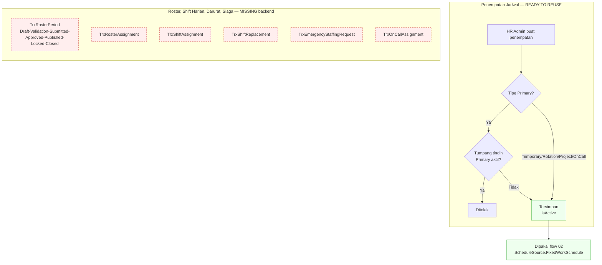

# Flow 05 — Penjadwalan Kerja

| Field | Value |
| --- | --- |
| Blueprint ID | `HRD-BP-001` |
| Jenis | Business process flow |
| Slice terkait | `S-B4` (penjadwalan), `S-A2` s.d. `S-A6` (layanan mandiri) |
| Status | `DRAFT` |
| Backend baseline | `origin/QuilvianIntegrationBackend`, diverifikasi `16b8b71` |

---

## 1. Purpose

Mengelola penempatan pegawai pada jadwal kerja — jadwal, pola shift, kelompok shift, kalender
kerja — sebagai dasar penghitungan kehadiran dan lembur. **Ini bukan jadwal praktik dokter.**
`[DECISION]` `HRD-DEC-006` sudah mengunci: jadwal kerja HR dipakai untuk kehadiran, lembur, dan
tunjangan shift; jadwal praktik dokter tetap milik Health Services dan dipakai untuk pendaftaran
pasien. HR **bukan** sumber kebenaran jadwal praktik.

**Temuan paling penting flow ini:** dari 11 entity pada domain `SchedulingManagement`, **hanya 3
yang punya controller** (`WfpWorkScheduleAssignment`, `WfpScheduleChangeRequest`,
`WfpShiftSwapRequest`). Delapan sisanya — termasuk **seluruh mesin roster** (`TrxRosterPeriod`,
`TrxRosterAssignment`, `TrxRosterPublication`, `TrxRosterApproval`), penjadwalan shift harian
(`TrxShiftAssignment`), penggantian shift oleh manajer (`TrxShiftReplacement`), permintaan tenaga
darurat (`TrxEmergencyStaffingRequest`), dan penugasan siaga (`TrxOnCallAssignment`) — **hanya
model dan konfigurasi EF, tanpa satu pun endpoint**. `[EXISTING]` — dibuktikan lewat pencarian
seluruh repo untuk kelas controller yang merujuk entity-entity itu; nihil.

Flow ini karena itu terbagi tegas: penempatan jadwal per pegawai (`WfpWorkScheduleAssignment`)
`READY TO REUSE`, sementara perencanaan roster, shift harian, penggantian, tenaga darurat, dan
siaga seluruhnya `MISSING` di lapisan backend — bukan cuma frontend seperti flow-flow lain.

## 2. Actors

| Aktor | Yang dikerjakan | Provenance |
| --- | --- | --- |
| HR Admin | Menempatkan pegawai pada jadwal kerja (`WfpWorkScheduleAssignmentController`) | `[EXISTING]` |
| Pegawai | Melihat jadwalnya sendiri saat mengajukan perubahan jadwal atau tukar shift | `[OPEN]` — belum terbukti ada endpoint "lihat jadwal saya" yang berdiri sendiri; yang terbukti hanya `schedule-options`/`shift-options` di dalam alur pengajuan (lihat flow 06) |
| Manager/Kepala unit | Menyusun roster, mengganti shift, mengajukan kebutuhan tenaga darurat | `[OPEN]` — kemampuannya ada di model (`TrxRosterPeriod`, `TrxShiftReplacement`, `TrxEmergencyStaffingRequest`), tidak ada endpoint yang membuktikan aktor ini benar-benar dapat menjalankannya hari ini |
| Sistem | Menentukan jadwal yang berlaku untuk perhitungan kehadiran (`ScheduleSource`: `Roster`, `FixedWorkSchedule`, `ManualOverride`, `Fallback` — sudah dibuktikan pada flow 02) | `[EXISTING]` |

## 3. Trigger

| Pemicu | Provenance |
| --- | --- |
| Pegawai baru perlu penempatan jadwal | `[EXISTING]` — `WfpWorkScheduleAssignmentController.Create` |
| Penempatan utama tumpang tindih dengan penempatan lain | `[EXISTING]` — guard overlap-primary (lihat bagian 7) |
| Periode roster baru perlu direncanakan | `[OPEN]`/`MISSING` — `TrxRosterPeriod` ada sebagai model, tidak ada trigger nyata karena tidak ada controller |
| Kebutuhan tenaga darurat muncul mendadak | `[OPEN]`/`MISSING` — `TrxEmergencyStaffingRequest` sama, model tanpa API |

## 4. Preconditions

1. Master data jadwal — `MstWorkSchedule`, `MstShiftPattern`, `MstShiftGroup`, `MstWorkCalendar`
   — sudah terisi. `[EXISTING]` — halaman master data-nya sudah ada dan dipakai
   (`src/app/hr/master-data/work-schedule/**` dan sejenisnya).

   **Koreksi provenance, `PHASE 2B.1`.** Klaim sebelumnya di sini keliru: "delapan route sudah
   diseragamkan kebab-case" adalah **target**, bukan bukti implementasi. Audit ulang
   `WorkCalendarController.cs:18`, `WorkScheduleController.cs:18`, `ShiftPatternController.cs:18`,
   `ShiftGroupController.cs:18` membuktikan keempatnya **masih** memakai `[Route]` lama —
   `workcalendars`, `workschedules`, `shiftpatterns`, `shiftgroups` — **tanpa** route template
   kedua untuk bentuk kebab-case. `HRD-DEC-016` adalah keputusan target (kebab-case canonical +
   compatibility alias), **belum** diimplementasikan pada baseline `16b8b71`. `[EXISTING]` untuk
   ketiadaan implementasinya. Jangan menulis ulang klaim lama tanpa kutipan baris seperti ini.
2. Profil workforce pegawai aktif. `[EXISTING]`
3. Pengguna punya `[AccessPermission]` yang sesuai. `[EXISTING]`

## 5. Happy Path

1. HR Admin membuka pegawai, menambah `WfpWorkScheduleAssignment` dengan `AssignmentType`
   (`Primary`, `Temporary`, `Rotation`, `Project`, `OnCall`) dan rentang tanggal berlaku.
   `[EXISTING]`
2. Sistem menolak penempatan `Primary` baru bila tumpang tindih tanggal dengan penempatan
   `Primary` aktif yang sudah ada. `[EXISTING]` — guard di `Create`, lihat bagian 7.
3. Penempatan tersimpan; satu-satunya status yang ada adalah flag `IsActive` lewat
   `PATCH {id}/status`, **bukan** state machine draft/published/superseded. `[EXISTING]`
4. Jadwal yang berlaku dipakai flow 02 (kehadiran) lewat `ScheduleSource.FixedWorkSchedule` untuk
   menyelesaikan ambang masuk/pulang dan pengecualian. `[EXISTING]` — integrasi sudah dibuktikan
   pada flow 02.

## 6. Alternative Flow

| Keadaan | Yang terjadi | Provenance |
| --- | --- | --- |
| Penempatan bertipe `Temporary`/`Rotation`/`Project` | Tidak melalui guard overlap-primary; hanya `Primary` yang dijaga | `[EXISTING]` |
| Penempatan siaga (`AssignmentType.OnCall`) dicatat lewat `WfpWorkScheduleAssignment` | `[EXISTING]` — nilai enum ada | Tetapi otorisasi penugasan siaga per shift (`TrxOnCallAssignment`) tetap `MISSING`, lihat bagian 11 |
| Roster disusun untuk banyak pegawai sekaligus dalam satu periode | `MstWorkSchedule` cukup untuk penempatan individual; **penyusunan roster massal tidak punya jalur API** | `[OPEN]`/`MISSING` — `HRD-Q-37` |

## 7. Exception Flow

| Keadaan | Yang terjadi | Provenance |
| --- | --- | --- |
| Penempatan `Primary` baru tumpang tindih tanggal dengan `Primary` aktif | Ditolak. `WfpWorkScheduleAssignmentController.Create` baris 178 memblokir bila ada penempatan `Primary` aktif yang rentangnya beririsan | `[EXISTING]` |
| Jadwal tidak dapat diselesaikan untuk satu tanggal | Ditangani flow 02 lewat `ScheduleMismatch` (`SCHEDULE_UNRESOLVED`) — bukan urusan flow ini | `[EXISTING]`, rujukan silang |
| Manajer perlu mengganti pegawai pada satu shift mendadak | Tidak ada jalur API — `TrxShiftReplacement` model tanpa controller | `MISSING` |
| Unit kekurangan tenaga mendadak | Tidak ada jalur API — `TrxEmergencyStaffingRequest` model tanpa controller | `MISSING` |

## 8. Approval

| Transaksi | Perlu persetujuan? | Provenance |
| --- | --- | --- |
| Penempatan jadwal kerja (`WfpWorkScheduleAssignment`) | **Tidak terbukti.** `Create`/`Update`/`PATCH status` adalah aksi langsung HR Admin, tidak ada rujukan ke mesin workflow | `[OPEN]` — `HRD-Q-38`, sensitif karena memengaruhi kehadiran dan lembur |
| Roster (`TrxRosterApproval` — entity approval untuk `TrxRosterPeriod`) | Entity-nya ada (`AssignedApproverUserId`, `ApprovalStatus`), menunjukkan **niat** ada jalur persetujuan roster | State vocabulary: `[EXISTING]`. Transition edge: **tidak dapat dibuktikan** — tidak ada controller yang menciptakan atau memproses baris `TrxRosterApproval` |

**Larangan:** jangan menyimpulkan penempatan jadwal individual memakai mesin persetujuan yang
sama dengan cuti/lembur/koreksi kehadiran hanya karena polanya mirip. Tidak ada bukti source.

## 9. State Transition

### 9.1 Penempatan jadwal — `WfpWorkScheduleAssignment`

**Tidak ada state machine.** Satu-satunya field yang berubah adalah `IsActive` (boolean) lewat
`PATCH {id}/status`. State vocabulary: tidak berlaku (bukan enum bertingkat). `[EXISTING]`

### 9.2 Roster — `RosterStatus` (pada `TrxRosterPeriod`)

Nilai enum: `Draft`, `Validation`, `Submitted`, `Approved`, `Published`, `Locked`, `Closed`,
`Cancelled`. State vocabulary: `[EXISTING]` — ditemukan pada model. **Transition edge: TIDAK
ADA.** Tidak ada controller/service yang mengoperasikan `TrxRosterPeriod`; nilai-nilai ini adalah
desain data yang belum diimplementasikan sebagai kapabilitas.

### 9.3 Penempatan roster per pegawai — `AssignmentStatus` (pada `TrxRosterAssignment`)

Nilai enum: `Draft`, `Validated`, `Approved`, `Published`, `Cancelled`. State vocabulary:
`[EXISTING]`. **Transition edge: TIDAK ADA**, alasan sama dengan 9.2.

### 9.4 Shift harian — `AssignmentStatus` (pada `TrxShiftAssignment`)

Nilai enum: `Draft`, `Validated`, `Published`, `Confirmed`, `Completed`, `Cancelled`, `Replaced`.
State vocabulary: `[EXISTING]`. **Transition edge: TIDAK ADA** — tidak ada controller.

### 9.5 Siaga — `AssignmentStatus` (pada `TrxOnCallAssignment`)

Nilai enum: `Scheduled`, `Confirmed`, `Activated`, `Completed`, `Cancelled`. State vocabulary:
`[EXISTING]`. **Transition edge: TIDAK ADA** — tidak ada controller; hanya `OnCallTypeController`
(master data taksonomi) dan `OnCallAllowancePolicyController` (kebijakan tunjangan) yang ada,
keduanya tidak mengelola penugasan siaga aktual.

## 10. Data Created/Updated

| Data | Entity | Prefix | Perlakuan | Backend capability |
| --- | --- | --- | --- | --- |
| Penempatan jadwal kerja | `WfpWorkScheduleAssignment` | `Wfp` | Tetap `Wfp` `[DECISION]` `HRD-DEC-019` | `READY TO REUSE` |
| Permohonan ubah jadwal | `WfpScheduleChangeRequest` | `Wfp` | Tetap `Wfp` | `READY TO REUSE` — dibahas penuh di flow 06 |
| Permohonan tukar shift | `WfpShiftSwapRequest` | `Wfp` | Tetap `Wfp` | `READY TO REUSE` — dibahas penuh di flow 06 |
| Periode roster, penempatan roster, publikasi, approval | `TrxRosterPeriod`, `TrxRosterAssignment`, `TrxRosterPublication`, `TrxRosterApproval` | `Trx` | Kepemilikan HR belum diverifikasi per entity; **jangan diratchet** sampai disentuh materially, `HRD-DEC-019` | `MISSING` — tanpa controller |
| Shift harian, penggantian, tenaga darurat, siaga | `TrxShiftAssignment`, `TrxShiftReplacement`, `TrxEmergencyStaffingRequest`, `TrxOnCallAssignment` | `Trx` | Sama seperti di atas | `MISSING` — tanpa controller |

## 11. Backend Capability

| Kemampuan | Endpoint | Status |
| --- | --- | --- |
| Penempatan jadwal kerja per profil | `api/v1/corporate/human-resource/scheduling-management/work-schedule-assignments` — 8 endpoint (metadata, summary, list, get, create, update, PATCH status, delete) | `READY TO REUSE` `[EXISTING]` |
| Roster (perencanaan, publikasi, approval) | Tidak ada | `MISSING` `[EXISTING]` |
| Shift harian dan penggantian | Tidak ada | `MISSING` `[EXISTING]` |
| Tenaga darurat | Tidak ada | `MISSING` `[EXISTING]` |
| Penugasan siaga aktual | Tidak ada (hanya master data taksonomi dan kebijakan tunjangan) | `MISSING` `[EXISTING]` |

Total 5 controller pada domain `SchedulingManagement` (3 korporat + 2 layanan mandiri milik flow
06), dari 11 model. `[EXISTING]`

## 12. Frontend Capability

| Kemampuan | Lokasi | Status |
| --- | --- | --- |
| Master data jadwal (`MstWorkSchedule` dkk.) | `src/app/hr/master-data/work-schedule/**` | `READY TO REUSE` `[EXISTING]` — entity **berbeda** dari `WfpWorkScheduleAssignment`, jangan disamakan |
| Penempatan jadwal per pegawai (`WfpWorkScheduleAssignment`) | Tidak ada | `MISSING` `[EXISTING]` |
| Roster, shift harian, penggantian, tenaga darurat, siaga | Tidak ada, dan backend-nya sendiri `MISSING` | `MISSING` — tidak ada yang bisa direuse karena API-nya sendiri belum ada |

## 13. Integration Boundary

| Batas | Keterangan | Provenance |
| --- | --- | --- |
| Jadwal kerja → kehadiran | `ScheduleSource.FixedWorkSchedule`/`ManualOverride`/`Fallback` dipakai flow 02 | `[EXISTING]` |
| Jadwal kerja praktik dokter | **Bukan** sumber jadwal praktik dokter | `[DECISION]` `HRD-DEC-006` |
| Jadwal → lembur | `TimeBand` pada flow 04 dihitung relatif terhadap jadwal kerja | `[EXISTING]` |
| Roster → jadwal kerja aktual | Belum ada jalur nyata karena roster `MISSING` di backend | `[OPEN]` `HRD-Q-37` |

## 14. Audit Requirement

| Kebutuhan | Provenance |
| --- | --- |
| Penempatan `Primary` tidak boleh tumpang tindih | `[EXISTING]` — guard `Create` |
| Siapa yang menempatkan dan kapan | `[EXISTING]` — pola `IdentityModel` yang konsisten di seluruh modul |
| Riwayat penempatan tersimpan | `[OPEN]`/`UNVERIFIED` — belum diaudit apakah penempatan lama dipertahankan sebagai riwayat atau ditimpa |

## 15. Blocking Decision

| ID | Isi | Dampak |
| --- | --- | --- |
| `HRD-Q-37` | **Baru.** Roster (`TrxRosterPeriod` dkk.), shift harian, penggantian shift, tenaga darurat, dan penugasan siaga hanya model tanpa API. Apakah ini memang belum diprioritaskan (`DEFERRED`), atau justru kebutuhan bisnis nyata yang perlu di-`EXTEND` segera? | Memblokir keputusan prioritas — bukan blocker desain, karena penempatan jadwal individual sudah cukup untuk kehadiran/lembur berjalan |
| `HRD-Q-38` | **Baru.** Apakah penempatan jadwal kerja (`WfpWorkScheduleAssignment`) memerlukan persetujuan, mengingat dampaknya ke kehadiran dan lembur? Source tidak menunjukkan jalur persetujuan | Memblokir desain final jalur persetujuan penempatan jadwal |
| `HRD-Q-06` | Nilai kebijakan penjadwalan (mis. jam kerja standar per shift) | Tidak memblokir alurnya |

## 16. Acceptance Criteria

| ID | Kriteria | Cara menguji |
| --- | --- | --- |
| `AC-F05-01` | Penempatan `Primary` tidak boleh tumpang tindih | Buat dua penempatan `Primary` dengan rentang beririsan untuk pegawai yang sama; yang kedua ditolak |
| `AC-F05-02` | Penempatan `Temporary`/`Rotation`/`Project` tidak dijaga guard overlap yang sama | Buat penempatan `Temporary` beririsan dengan `Primary` aktif; diterima |
| `AC-F05-03` | Jadwal kerja HR tidak pernah dipakai sebagai sumber jadwal praktik dokter | Ubah `WfpWorkScheduleAssignment` dokter; jadwal praktik pendaftaran pasien tidak berubah |
| `AC-F05-04` | Roster/shift-harian/siaga tidak diklaim sebagai kapabilitas yang berjalan | Panggil endpoint mana pun untuk `TrxRosterPeriod`/`TrxShiftAssignment`/`TrxOnCallAssignment`; tidak ada endpoint yang ditemukan — ini kriteria dokumentasi, bukan API |

## 17. Diagram

Kotak merah putus-putus menandai delapan entity yang hanya model — tidak ada satu pun endpoint,
sehingga tidak ada diagram alur nyata yang bisa digambar untuknya selain nilai enum yang
terdaftar.
