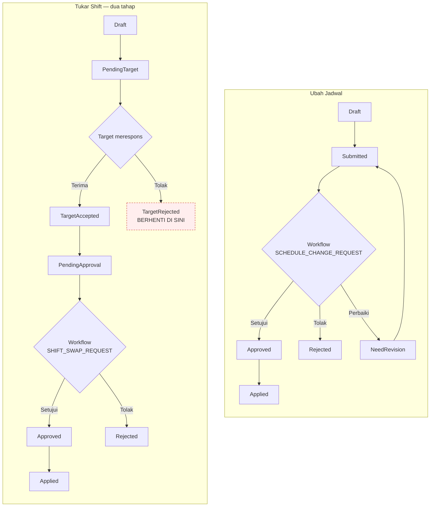

# Flow 06 — Perubahan Jadwal dan Tukar Shift

| Field | Value |
| --- | --- |
| Blueprint ID | `HRD-BP-001` |
| Jenis | Business process flow |
| Slice terkait | `S-B4` (penjadwalan), `S-A2` s.d. `S-A6` (layanan mandiri) |
| Status | `DRAFT` |
| Backend baseline | `origin/QuilvianIntegrationBackend`, diverifikasi `16b8b71` |

---

## 1. Purpose

Mengelola dua transaksi yang **terlihat mirip tapi terbukti berbeda**: permohonan ubah jadwal
(`WfpScheduleChangeRequest`) dan permohonan tukar shift (`WfpShiftSwapRequest`). Keduanya memakai
mesin workflow generik yang sama (`WorkflowService`/`TrxWorkflowApproverAssignment`), tetapi
**bukan alur yang sama** — tukar shift punya prasyarat tambahan yang tidak dimiliki ubah jadwal.
`[EXISTING]`

**Larangan yang mengikat flow ini:** jangan menganggap ubah jadwal dan tukar shift memiliki
persetujuan yang sama hanya karena kode template-nya serupa. Audit source membuktikan
sebaliknya — lihat bagian 8 dan 9.

## 2. Actors

| Aktor | Yang dikerjakan | Provenance |
| --- | --- | --- |
| Pegawai (pemohon) | Mengajukan ubah jadwal atau tukar shift | `[EXISTING]` |
| Pegawai (target tukar shift) | Menerima atau menolak tawaran tukar shift **sebelum** permohonan diteruskan ke manajer | `[EXISTING]` — `ShiftSwapService.RespondAsTargetAsync` |
| Atasan/Manager | Menyetujui permohonan lewat mesin workflow | `[EXISTING]` — lewat `ApprovalInboxController`/`WorkflowService`, bukan aksi khusus di controller domain ini |
| Sistem | Menerapkan perubahan setelah workflow selesai | `[EXISTING]` — `ApplyAsync` pada masing-masing service |

## 3. Trigger

| Pemicu | Provenance |
| --- | --- |
| Pegawai ingin mengubah jadwalnya (jadwal, shift, hari libur, jadwal sementara) | `[EXISTING]` — `ScheduleChangeSelfServiceController` |
| Pegawai ingin bertukar shift dengan rekan kerja | `[EXISTING]` — `ShiftSwapSelfServiceController` |

## 4. Preconditions

1. Penempatan jadwal kerja pegawai sudah ada (flow 05). `[EXISTING]`
2. Untuk tukar shift, ada penempatan shift target yang valid untuk ditukar. `[EXISTING]` —
   `assignment-options`/`target-assignment-options` pada self-service tukar shift.
3. Pengguna punya `[AccessPermission]` yang sesuai. `[EXISTING]`

## 5. Happy Path

### 5.1 Ubah jadwal

1. Pegawai membuka opsi jadwal/shift yang tersedia (`schedule-options`, `shift-options`).
   `[EXISTING]`
2. Mengajukan permohonan. Status `Draft` lalu `Submitted`. `[EXISTING]`
3. `ScheduleChangeWorkflowIntegrationService.SubmitAsync` membuat dan mengirim instance
   `TrxWorkflowInstance` (kode `SCHEDULE_CHANGE_REQUEST`) ke mesin workflow. `[EXISTING]`
4. Atasan menyetujui lewat kotak masuk persetujuan (flow 09). Status `Approved`. `[EXISTING]`
5. `ScheduleChangeWorkflowLifecycleService.SynchronizeAsync` memetakan status workflow ke
   `RequestStatus`, lalu memicu `ScheduleChangeService.ApplyAsync`. Status akhir `Applied`.
   `[EXISTING]`

### 5.2 Tukar shift — **dua tahap terpisah, bukan satu**

1. Pegawai pemohon memilih shift sendiri dan shift target (`target-options`,
   `assignment-options`, `target-assignment-options`), lalu mengajukan. Status `Draft` lalu
   `PendingTarget`. `[EXISTING]`
2. **Tahap 1 — persetujuan rekan (peer).** Pegawai target merespons lewat
   `RespondAsTargetAsync`. Bila diterima, status `TargetAccepted`; bila ditolak,
   `TargetRejected` dan alur berhenti di sini — **belum sampai ke manajer**. `[EXISTING]` —
   `ShiftSwapService.cs` baris 542, 566–571.
3. **Tahap 2 — persetujuan manajer.** Hanya setelah `IsAcceptedByTarget == true`,
   `ShiftSwapWorkflowIntegrationService.SubmitForManagerApprovalAsync` baru dapat mengirim
   instance workflow (kode `SHIFT_SWAP_REQUEST`). Bila dipanggil sebelum tahap 1 selesai, ditolak
   409: "Pengajuan baru dapat diteruskan ke manager setelah target employee menerima tukar
   shift." `[EXISTING]` — baris 107–115.
4. Status berpindah `PendingApproval` → `Approved` lewat mesin workflow yang sama dengan ubah
   jadwal, tetapi dengan `WorkflowDefinitionCode` yang berbeda (`SHIFT_SWAP_REQUEST` vs
   `SCHEDULE_CHANGE_REQUEST`), sehingga matriks persetujuannya **dapat** dikonfigurasi berbeda.
   `[EXISTING]`
5. Diterapkan. Status `Applied`. `[EXISTING]`

## 6. Alternative Flow

| Keadaan | Yang terjadi | Provenance |
| --- | --- | --- |
| Target menolak tukar shift | Status `TargetRejected`; permohonan tidak pernah sampai ke manajer | `[EXISTING]` |
| Permohonan perlu diperbaiki | Status `NeedRevision` pada kedua jenis transaksi | `[EXISTING]` — nilai enum ada di kedua vocabulary |
| Pegawai membatalkan sebelum keputusan | `WithdrawAsync`/`CancelAsync` pada `WorkflowService`, dipanggil kedua integration service | `[EXISTING]` |

## 7. Exception Flow

| Keadaan | Yang terjadi | Provenance |
| --- | --- | --- |
| Tukar shift diteruskan ke manajer sebelum target merespons | Ditolak 409 eksplisit | `[EXISTING]` |
| Ubah jadwal dan tukar shift dianggap satu jenis oleh integrasi lain | Tidak boleh — keduanya `WorkflowDefinitionCode` terpisah, matriks persetujuan dapat berbeda | `[EXISTING]` — larangan berbasis bukti |

## 8. Approval

| Transaksi | Titik keputusan | Otoritas | Provenance |
| --- | --- | --- | --- |
| Ubah jadwal | Satu titik: atasan/manajer via workflow | Mesin workflow generik (`WorkflowService.ApproveAsync`, gate `AssignedApproverUserId == actorContext.UserId`); matriks/approver ditentukan `MstWorkflowStep`/`MstApprovalMatrix` milik `WorkflowDefinitionId` kode `SCHEDULE_CHANGE_REQUEST` | `[EXISTING]` |
| Tukar shift | **Dua titik**: (1) rekan target menerima/menolak — bukan lewat mesin workflow, melainkan aksi langsung `RespondAsTargetAsync`; (2) atasan/manajer via workflow setelah tahap 1 lolos, kode `SHIFT_SWAP_REQUEST` | Tahap 1: siapa pun yang menjadi `TargetWorkforceProfileId` pada permohonan. Tahap 2: sama seperti ubah jadwal, tapi baris konfigurasi terpisah | `[EXISTING]` |

**Larangan yang dipertahankan dari `PHASE 2A.1`:** jangan menyimpulkan kalimat umum "atasan
menyetujui seluruh pengajuan anak buah". Di sini otoritasnya bahkan lebih halus — tukar shift
punya gerbang non-atasan (rekan kerja) yang tidak dimiliki ubah jadwal sama sekali.

## 9. State Transition

### 9.1 Ubah jadwal — `SchedulingRequestValueConstants` (Schedule Change)

State vocabulary: `Draft`, `Submitted`, `UnderReview`, `NeedRevision`, `Approved`, `Rejected`,
`Cancelled`, `Applied`. `[EXISTING]`

| Dari | Tindakan | Ke | Transition edge — evidence |
| --- | --- | --- | --- |
| `Draft` | Ajukan | `Submitted` | `[EXISTING]` — `ScheduleChangeWorkflowIntegrationService.SubmitAsync` baris 82 |
| `Submitted`/`UnderReview` | Sinkronisasi status workflow | `Approved`/`Rejected`/`NeedRevision` | `[EXISTING]` — `ScheduleChangeWorkflowLifecycleService.SynchronizeAsync`/`MapStatus`, baris 27, 110 |
| `Approved` | Terapkan | `Applied` | `[EXISTING]` — `ScheduleChangeService.ApplyAsync`, dipanggil otomatis saat workflow selesai |
| `Draft`/`Submitted` | Batalkan | `Cancelled` | `[EXISTING]` — `WorkflowService.WithdrawAsync`/`CancelAsync`, baris 291–307 |

### 9.2 Tukar shift — `SchedulingRequestValueConstants` (Shift Swap)

State vocabulary: `Draft`, `PendingTarget`, `TargetAccepted`, `TargetRejected`, `PendingApproval`,
`NeedRevision`, `Approved`, `Rejected`, `Cancelled`, `Applied`. `[EXISTING]`

| Dari | Tindakan | Ke | Siapa | Transition edge — evidence |
| --- | --- | --- | --- | --- |
| `Draft` | Ajukan ke target | `PendingTarget` | Pegawai pemohon | `[EXISTING]` |
| `PendingTarget` | Target menerima | `TargetAccepted` | Pegawai target | `[EXISTING]` — `RespondAsTargetAsync`, guard `RequestStatus != PendingTarget` → 409 (baris 566–571) |
| `PendingTarget` | Target menolak | `TargetRejected` | Pegawai target | `[EXISTING]` — method yang sama |
| `TargetAccepted` | Teruskan ke manajer | `PendingApproval` | Sistem, atas pemicu pemohon | `[EXISTING]` — `SubmitForManagerApprovalAsync`, guard eksplisit `IsAcceptedByTarget != true` → 409 (baris 107–115) — **tidak dapat dilewati** |
| `PendingApproval` | Sinkronisasi status workflow | `Approved`/`Rejected`/`NeedRevision` | Atasan via workflow | `[EXISTING]` |
| `Approved` | Terapkan | `Applied` | Sistem | `[EXISTING]` |

**Kesimpulan tegas:** `TargetRejected` adalah status akhir yang tidak pernah mencapai
`PendingApproval` — ini bukan asumsi, dibuktikan guard di atas.

## 10. Data Created/Updated

| Data | Entity | Prefix | Perlakuan |
| --- | --- | --- | --- |
| Permohonan ubah jadwal | `WfpScheduleChangeRequest` | `Wfp` | Tetap `Wfp` `[DECISION]` `HRD-DEC-019` |
| Permohonan tukar shift | `WfpShiftSwapRequest` | `Wfp` | Tetap `Wfp` |

## 11. Backend Capability

| Kemampuan | Endpoint | Status |
| --- | --- | --- |
| Ubah jadwal (korporat) | `.../scheduling-management/schedule-change-requests` — 7 endpoint | `READY TO REUSE` `[EXISTING]` |
| Ubah jadwal (layanan mandiri) | `api/v1/self-services/human-resource/schedule-change-requests` — 12 endpoint (termasuk `schedule-options`, `shift-options`, `validate-preview`) | `READY TO REUSE` `[EXISTING]` |
| Tukar shift (korporat) | `.../scheduling-management/shift-swap-requests` — 7 endpoint | `READY TO REUSE` `[EXISTING]` |
| Tukar shift (layanan mandiri) | `api/v1/self-services/human-resource/shift-swap-requests` — 16 endpoint (termasuk `target-options`, `assignment-options`, `target-assignment-options`, `target-response`, `submit-approval`) | `READY TO REUSE` `[EXISTING]` |

Total 4 controller, 42 endpoint pada kedua transaksi. `[EXISTING]`

## 12. Frontend Capability

| Kemampuan | Lokasi | Status |
| --- | --- | --- |
| Ubah jadwal (korporat maupun layanan mandiri) | Tidak ada | `MISSING` `[EXISTING]` |
| Tukar shift (korporat maupun layanan mandiri) | Tidak ada | `MISSING` `[EXISTING]` |

Pencarian `schedule-change`, `shift-swap` pada `src/` hanya menemukan halaman master data jadwal
(`MstWorkSchedule`, entity berbeda). Tidak ada satu pun konsumen frontend untuk 42 endpoint di
atas. `[EXISTING]`

## 13. Integration Boundary

| Batas | Keterangan | Provenance |
| --- | --- | --- |
| Ubah jadwal / tukar shift → penempatan jadwal | `ApplyAsync` memutakhirkan penempatan efektif (flow 05) | `[EXISTING]` |
| Keduanya → mesin workflow terpadu | Sama-sama lewat `WorkflowService`, tetapi `WorkflowDefinitionCode` terpisah — lihat flow 09 untuk batas UX-vs-aturan bisnis | `[DECISION]` `HRD-DEC-018` |
| Tukar shift → kehadiran/lembur | **Tertutup, `PHASE 2B.1`.** Terbukti — `ShiftSwapService.ApplyAsync` menukar `ShiftDate`/`ShiftId`/`WorkScheduleId`/`ScheduledStartAt/EndAt` antara kedua baris `TrxShiftAssignment` (baris 661–752), menandai `AssignmentSource="ShiftSwap"` dan `IsManualOverride=true` (baris 1105–1107). `AttendanceScheduleResolverService.ResolveCoreAsync` membaca `TrxShiftAssignment` tanpa mengecualikan baris ini (baris 196–208), dan mengembalikan `ScheduleSource.ManualOverride` justru karena flag itu (baris 307–309). `AttendanceProcessingService` memanggil resolver ini (baris 640). Jalur tulis-lalu-baca ini nyata dan dapat ditelusuri, bukan asumsi dari nama status `Applied` | `[EXISTING]` |

## 14. Audit Requirement

| Kebutuhan | Provenance |
| --- | --- |
| Respons target tukar shift tercatat terpisah dari keputusan manajer | `[EXISTING]` — dua field/tahap berbeda |
| Permohonan yang ditolak menyimpan alasannya | `[OPEN]`/`UNVERIFIED` — belum diaudit field alasan pada `WfpScheduleChangeRequest`/`WfpShiftSwapRequest` |

## 15. Blocking Decision

| ID | Isi | Dampak |
| --- | --- | --- |
| `HRD-Q-39` | **Tertutup lewat audit source, `PHASE 2B.1`.** Ya, otomatis — lihat bagian 13. Tidak memerlukan langkah tambahan | Terjawab, tidak memblokir apa pun |
| `HRD-Q-06` | Nilai kebijakan (batas jumlah tukar shift per bulan, dsb.) | Tidak memblokir alurnya |

## 16. Acceptance Criteria

| ID | Kriteria | Cara menguji |
| --- | --- | --- |
| `AC-F06-01` | Tukar shift tidak dapat mencapai manajer tanpa persetujuan target | Ajukan tukar shift, teruskan ke manajer sebelum target merespons; ditolak 409 |
| `AC-F06-02` | Target yang menolak menghentikan alur | Target menolak; status `TargetRejected`, tidak ada instance workflow manajer yang dibuat |
| `AC-F06-03` | Ubah jadwal dan tukar shift memakai matriks persetujuan yang independen | Ubah konfigurasi approval matrix `SCHEDULE_CHANGE_REQUEST`; matrix `SHIFT_SWAP_REQUEST` tidak ikut berubah |
| `AC-F06-04` | Frontend belum ada untuk kedua transaksi | Tidak ada halaman yang memanggil 42 endpoint di atas hari ini — kriteria dokumentasi |
| `AC-F06-05` | Tukar shift `Applied` benar-benar mengubah jadwal efektif yang dipakai kehadiran — **terbukti**, `[EXISTING]` | Terapkan tukar shift antara dua pegawai untuk tanggal tertentu; proses kehadiran tanggal itu untuk keduanya; `ScheduleSource` yang dikembalikan resolver adalah `ManualOverride`, dan jadwal yang dipakai sudah tertukar sesuai `TrxShiftAssignment` hasil `ApplyAsync` |

## 17. Diagram

Kotak merah menandai `TargetRejected` — status akhir yang terbukti tidak pernah menjangkau tahap
manajer, guard-nya eksplisit di source, bukan diasumsikan dari nama status.
