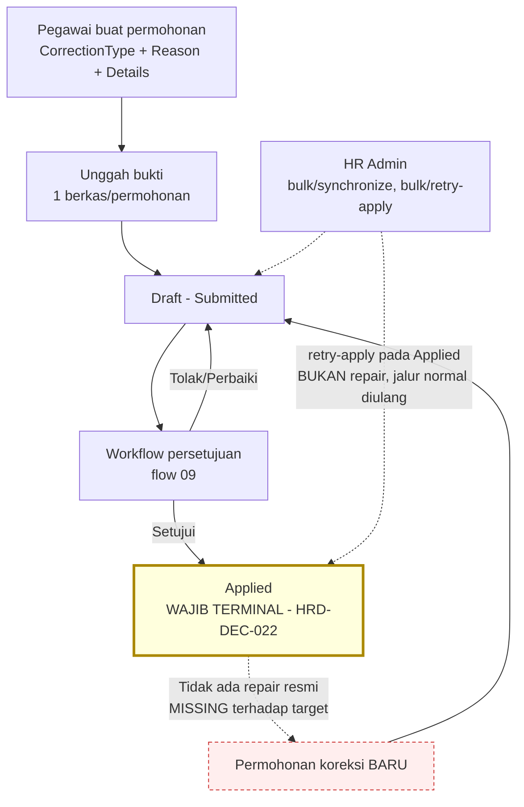

# Flow 07 — Koreksi Kehadiran

| Field | Value |
| --- | --- |
| Blueprint ID | `HRD-BP-001` |
| Jenis | Business process flow |
| Slice terkait | `S-B1` (administrasi kehadiran), `S-A2` s.d. `S-A6` (layanan mandiri) |
| Status | `DRAFT` |
| Backend baseline | `origin/QuilvianIntegrationBackend`, diverifikasi `16b8b71` |

---

## 1. Purpose

Flow ini **memperdalam**, bukan menggantikan, mekanisme koreksi yang sudah dibuktikan pada
[flow 02](./02-attendance.md) bagian 9.4. Invariant flow 02 berlaku penuh di sini dan **tidak
diulang isinya**, hanya dirujuk:

- Rekaman mentah (`HrdAttendanceRawLog`) tidak pernah diubah koreksi apa pun. `[EXISTING]`,
  rujukan flow 02.
- `AttendanceCorrection.RequestStatus = Applied` **wajib** terminal terhadap normal workflow
  synchronization. `[DECISION]` `HRD-DEC-022`, rujukan flow 02 bagian 9.4 dan
  `00-interview-decisions.md` bagian 21.1.

Yang **baru** di flow ini: isi permohonan koreksi (jenis, bukti, alasan), kemampuan pemantauan
massal HR Admin, dan pembuktian tegas bahwa **tidak ada jalur repair resmi** untuk koreksi yang
sudah `Applied` selain permohonan baru — persis seperti yang ditetapkan `HRD-DEC-022` sebagai
`MISSING` terhadap target.

## 2. Actors

| Aktor | Yang dikerjakan | Wewenang (`[AccessPermission]`) | Provenance |
| --- | --- | --- | --- |
| Pegawai (pemohon) | Membuat, mengubah, mengajukan, membatalkan permohonan koreksi miliknya sendiri; mengunggah/menghapus bukti | Resource `MyAttendanceCorrection`: `Read`, `Create`, `Update`, `Submit`, `Cancel`, `Delete` (draft saja) | `[EXISTING]` |
| Atasan/reviewer | Menyetujui/menolak/meminta perbaikan lewat kotak masuk persetujuan | Mesin workflow generik (flow 09), gate `AssignedApproverUserId == actorContext.UserId` | `[EXISTING]` |
| HR Admin | Membaca, menyinkronkan, menerapkan koreksi individual maupun massal | Resource `AttendanceCorrection`: `Read`, `Synchronize`, `Apply`; resource `AttendanceCorrectionMonitoring`: `Read`, `Synchronize`, `Apply` (`bulk/synchronize`, `bulk/retry-apply`) | `[EXISTING]` |

**Current implementation:** HR Admin **tidak dapat** membuat permohonan koreksi atas nama pegawai
lain. `AttendanceCorrectionService.CreateAsync` mensyaratkan tegas
`daily.WorkforceProfileId == actorWorkforceProfileId` (baris 268) — hanya pemilik data kehadiran
yang dapat mengajukan. `[EXISTING]` — tidak ada jalur "create on behalf" di controller korporat
mana pun.

**`HRD-DEC-028`, 28 Agustus 2026 — `HRD-Q-40` ditutup.** Target behavior: `[DECISION]`
`HRD-DEC-028` — **HR Admin boleh membuat koreksi atas nama pegawai bila pegawai tidak dapat
mengakses ESS.** Wajib menyimpan: initiator HR, workforce yang diwakili, alasan, timestamp,
bukti (bila policy membutuhkan), notifikasi kepada pegawai, dan jejak audit. Rekaman mentah
tetap immutable. Persetujuan setelahnya tetap memakai workflow/policy koreksi yang berlaku —
**tidak ada jalur approval baru**. Current implementation di atas adalah `MISSING` terhadap
target ini, dicatat resmi, bukan repair atas cacat — ini kapabilitas baru yang belum pernah
dirancang sebelumnya.

## 3. Trigger

| Pemicu | Provenance |
| --- | --- |
| Pegawai menemukan kehadiran hariannya salah (jenis: `AttendanceTime`, `MissingPunch`, `Location`, `Schedule`, `Status`, `BusinessTrip`, `RemoteAttendance`, `Other`) | `[EXISTING]` — `AttendanceValueConstants.CorrectionType` |
| Pengecualian kehadiran (flow 02 bagian 7) memerlukan koreksi untuk diselesaikan | `[EXISTING]` — rujukan `ExceptionIds` pada permohonan |
| HR Admin menemukan permohonan yang macet dan perlu disinkron ulang massal | `[EXISTING]` — `bulk/synchronize` |

## 4. Preconditions

1. `HrdAttendanceDaily` yang dikoreksi sudah ada. `[EXISTING]`
2. Pemohon adalah pemilik data kehadiran itu. `[EXISTING]` — guard baris 268.
3. Pengguna punya `[AccessPermission]` yang sesuai. `[EXISTING]`

## 5. Happy Path

1. Pegawai membuat permohonan: `AttendanceDailyId`, `CorrectionType` (string, bukan enum C#,
   dibatasi konvensi delapan nilai di atas), `Reason` (wajib, maks. 1500 karakter),
   `RequestReasonId` (opsional, rujukan `MstRequestReason`), `ExceptionIds` (opsional, tautan ke
   pengecualian terkait), dan minimal satu `Details` (`FieldName`, `RequestedValue`, `Reason`
   per-field). `[EXISTING]` — `CreateAttendanceCorrectionRequest` DTO baris 192–207.
2. Pegawai dapat mengunggah **satu** berkas bukti lewat `POST .../{id}/evidence` (multipart).
   Disimpan sebagai tiga field skalar pada entity itu sendiri (`EvidenceFilePath`,
   `EvidenceFileName`, `EvidenceContentType`) — **bukan** entity lampiran terpisah, jadi hanya
   satu bukti per permohonan. `[EXISTING]` — `HrdAttendanceCorrectionRequest.cs` baris 49–56.
3. Pegawai mengajukan. Status `Draft` → `Submitted` (rujukan state machine flow 02 bagian 9.4).
   `[EXISTING]`
4. Atasan/reviewer memutuskan lewat kotak masuk (flow 09). `[EXISTING]`
5. Setelah `Approved`/`PartiallyApproved`, sistem menerapkan ke `HrdAttendanceDaily`. Status
   `Applied` — **wajib terminal**, `[DECISION]` `HRD-DEC-022`. `[EXISTING]` untuk aksinya,
   `[DECISION]` untuk kewajiban terminalnya.

## 6. Alternative Flow

| Keadaan | Yang terjadi | Provenance |
| --- | --- | --- |
| HR Admin perlu memproses banyak permohonan macet sekaligus | `POST bulk/synchronize` dan `POST bulk/retry-apply` — keduanya melakukan loop memanggil method single-item yang sama (`SynchronizeAsync`/`RetryApplyAsync`), **bukan** logika massal yang berbeda | `[EXISTING]` — `AttendanceCorrectionMonitoringService.cs` baris 343–431 |
| `retry-apply` dipanggil pada permohonan yang sudah `Applied` | **Ini bukan mekanisme repair** — `RetryApplyAsync` hanya memanggil ulang `ApplyApprovedRequestAsync`, jalur normal apply. Tidak dirancang untuk memperbaiki koreksi yang sudah diterapkan | `[EXISTING]` — baris 325; konsisten dengan `HRD-DEC-022` yang menyebut ini `MISSING`, bukan jalur repair yang sah |

## 7. Exception Flow

| Keadaan | Yang terjadi | Provenance |
| --- | --- | --- |
| Koreksi terkunci (`AttendanceLocked`) | Terdeteksi pemantauan, remediasi manual — tidak ada tombol otomatis | `[EXISTING]` — `AttendanceCorrectionMonitoringService.cs` baris 902–918 |
| Payroll sudah memproses periode (`PayrollAlreadyProcessed`) | Pesan remediasi eksplisit mengarahkan ke **prosedur payroll adjustment/reversal**, bukan endpoint koreksi ini | `[EXISTING]` — bukti tegas bahwa domain koreksi dan domain payroll adalah dua permukaan berbeda |
| Ketidaksesuaian flag setelah `Applied` (`AppliedFlagMismatch`) | Remediasi: "Audit detail apply dan sinkronkan data attendance" — **manual**, tidak ada aksi API | `[EXISTING]` |
| Koreksi yang sudah `Applied` perlu diperbaiki | **Tidak ada aksi repair eksplisit yang terotorisasi dan diaudit khusus untuk `AttendanceCorrection`.** Satu-satunya jalur sah adalah permohonan koreksi baru, sesuai `HRD-DEC-022`. Ini `MISSING` terhadap target, dicatat resmi, bukan ditutup-tutupi | `[DECISION]` `HRD-DEC-022` (target), `[EXISTING]` (ketiadaan implementasi dikonfirmasi ulang pada pass ini) |

## 8. Approval

Rujukan flow 02 bagian 8 dan flow 09 (kotak masuk terpadu). Tidak ada aturan tambahan pada flow
ini di luar yang sudah dibuktikan: otoritas persetujuan adalah mesin workflow generik, bukan role
hardcode. `[EXISTING]`

## 9. State Transition

Rujukan penuh ke [flow 02](./02-attendance.md) bagian 9.4 untuk `CorrectionRequestStatus`. Tidak
diulang di sini untuk menghindari duplikasi yang dapat menyimpang dari sumber tunggal kebenaran.

**Yang ditambahkan flow ini:** target vs current implementation untuk `HRD-DEC-022`, sudah
dicatat di flow 02 dan `00-interview-decisions.md` bagian 21.1 — dirujuk, tidak diduplikasi.

## 10. Data Created/Updated

| Data | Entity | Prefix | Catatan baru pada pass ini |
| --- | --- | --- | --- |
| Permohonan koreksi | `HrdAttendanceCorrectionRequest` | `Hrd` | Field bukti (`EvidenceFilePath`/`FileName`/`ContentType`) ada langsung pada entity ini — bukan entity lampiran terpisah |
| Detail koreksi per-field | `HrdAttendanceCorrectionDetail` | `Hrd` | `FieldName`/`RequestedValue`/`Reason` per baris |

Tidak ada entity baru di luar yang sudah dicatat flow 02. `[EXISTING]`

## 11. Backend Capability

| Kemampuan | Endpoint | Status |
| --- | --- | --- |
| Layanan mandiri koreksi | `api/v1/self-services/human-resource/attendance-corrections`: `Read`/`Create`/`Update`/`Submit`/`Cancel`/`Delete` + evidence upload/download | `READY TO REUSE` `[EXISTING]` |
| Korporat — koreksi individual | `api/v1/corporate/human-resource/attendance/correction-requests`: `Read`/`Synchronize`/`Apply` | `READY TO REUSE` `[EXISTING]` |
| Korporat — pemantauan massal | `.../attendance/correction-monitoring`: `Read`/`Synchronize`/`Apply`, termasuk `bulk/synchronize`, `bulk/retry-apply` | `READY TO REUSE` `[EXISTING]` untuk mekanismenya; **bukan** jalur repair post-`Applied` |
| Aksi repair/koreksi eksplisit khusus `AttendanceCorrection` untuk permohonan `Applied` | Tidak ada | `MISSING` terhadap target `HRD-DEC-022` |

## 12. Frontend Capability

| Kemampuan | Lokasi | Status |
| --- | --- | --- |
| Layanan mandiri koreksi | Tidak ada | `MISSING` `[EXISTING]` — dikonfirmasi ulang pada pass ini, nol berkas frontend untuk `attendance-corrections`/`correction-monitoring`/`correction-requests` |
| Pemantauan massal HR Admin | Tidak ada | `MISSING` `[EXISTING]` |

## 13. Integration Boundary

| Batas | Keterangan | Provenance |
| --- | --- | --- |
| Koreksi → kehadiran harian | Mengubah `HrdAttendanceDaily`, tidak pernah rekaman mentah | `[EXISTING]`, rujukan flow 02 |
| Koreksi → payroll | Bila periode sudah diproses payroll, remediasi mengarah ke domain payroll (`PayrollAlreadyProcessed`), bukan ke endpoint koreksi ini | `[EXISTING]` |
| Koreksi → mesin workflow terpadu | Sama seperti cuti, lembur, ubah jadwal, tukar shift — lihat flow 09 | `[DECISION]` `HRD-DEC-018` |
| Penyimpanan bukti | `WorkflowFileStorageService` generik, pola penyimpanan fisik belum diketahui | `[OPEN]` `HRD-DEP-006`, rujukan flow 02 |

## 14. Audit Requirement

| Kebutuhan | Provenance |
| --- | --- |
| Setiap koreksi menyimpan alasan, jenis, dan detail per-field | `[EXISTING]` |
| Bukti tersimpan dengan nama pengunggah implisit (`RequestedByUserId`) | `[EXISTING]` — tidak ada field uploader terpisah, diasumsikan dari pemilik permohonan |
| Aksi massal (`bulk/synchronize`, `bulk/retry-apply`) tercatat siapa yang memicu dan permohonan mana saja yang terdampak | `[OPEN]`/`UNVERIFIED` — belum diaudit apakah ada log tersendiri untuk operasi massal, atau hanya jejak per-item yang sama dengan operasi tunggal |

## 15. Blocking Decision

| ID | Isi | Dampak |
| --- | --- | --- |
| `HRD-Q-34` | Sudah **tertutup** `HRD-DEC-022` — rujukan flow 02 dan `00-interview-decisions.md` bagian 21.1 | Menyisakan keputusan implementasi: bangun aksi repair eksplisit, atau terima permohonan baru sebagai satu-satunya jalur |
| `HRD-Q-40` | **Tertutup `HRD-DEC-028`, 28 Agustus 2026.** HR Admin boleh membuat koreksi atas nama pegawai bila ESS tidak dapat diakses, dengan enam syarat wajib (initiator, workforce diwakili, alasan, timestamp, bukti bila perlu, notifikasi, audit trail). Current implementation `MISSING` sepenuhnya | Memblokir implementasi jalur on-behalf, bukan desain — desainnya sudah final |

## 16. Acceptance Criteria

| ID | Kriteria | Cara menguji |
| --- | --- | --- |
| `AC-F07-01` | HR Admin tidak dapat membuat koreksi atas nama pegawai lain | Panggil `Create` dengan `AttendanceDailyId` milik pegawai lain sebagai aktor HR Admin; ditolak |
| `AC-F07-02` | Bukti terbatas satu berkas per permohonan, dan unggahan kedua **membersihkan** berkas lama, bukan meninggalkan file yatim — **terbukti**, `[EXISTING]` | Unggah bukti kedua pada permohonan yang sudah punya bukti; `UploadEvidenceAsync` menyimpan berkas baru → menimpa field DB → `SaveChangesAsync` → menghapus berkas fisik lama lewat `DeletePhysicalFileAsync` (`AttendanceCorrectionService.cs` baris 957–976). Tidak perlu memanggil `DeleteEvidenceAsync` lebih dulu — unggahan tidak bersyarat |
| `AC-F07-03` | `bulk/retry-apply` tidak memperbaiki koreksi yang sudah `Applied` | Panggil pada permohonan `Applied`; tidak ada efek "repair", hanya mengulang jalur apply normal — sejalan `HRD-DEC-022` |
| `AC-F07-04` | Periode yang sudah diproses payroll mengarahkan ke domain payroll, bukan endpoint koreksi | Picu `PayrollAlreadyProcessed`; pesan remediasi menunjuk prosedur payroll |

## 17. Diagram

