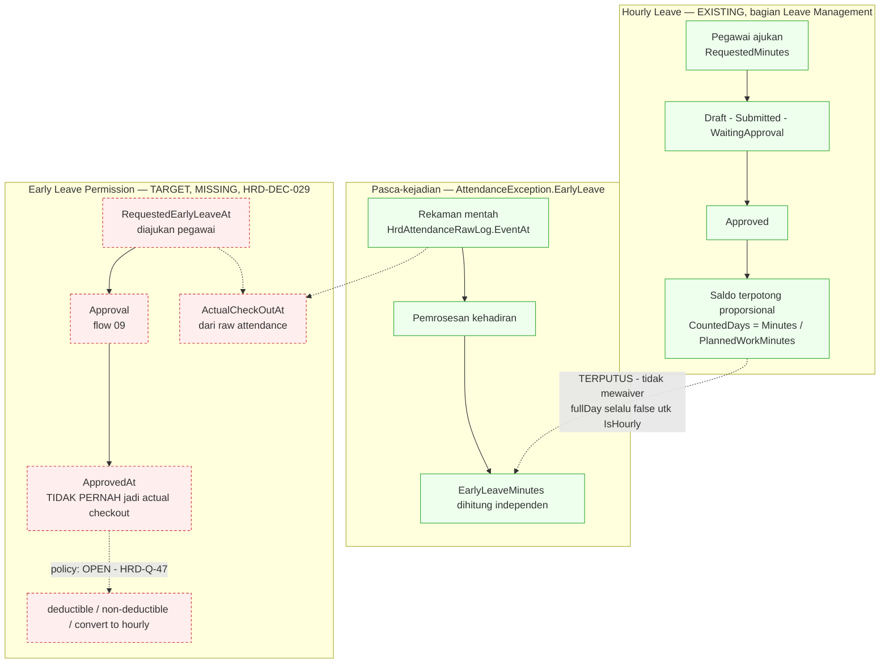

# Flow 08 — Izin Pulang Cepat

| Field | Value |
| --- | --- |
| Blueprint ID | `HRD-BP-001` |
| Jenis | Business process flow |
| Slice terkait | `S-A2` s.d. `S-A6` (layanan mandiri), `S-B1` (administrasi kehadiran), `S-B2` (administrasi cuti) |
| Status | `DRAFT` |
| Backend baseline | `origin/QuilvianIntegrationBackend`, diverifikasi `16b8b71` |

---

## 1. Purpose

**`HRD-DEC-029`, 28 Agustus 2026 — dua konsep ditetapkan tegas terpisah, menutup `HRD-Q-42` dan
`HRD-Q-43`.** Pass sebelumnya (`PHASE 2B`) berisiko mencampur dua hal yang mirip namanya tapi
berbeda sifat bisnisnya. Keputusan pengguna mengunci pemisahan ini:

| Konsep | Definisi | Domain | Status hari ini |
| --- | --- | --- | --- |
| **Hourly Leave** | Mode `IsHourly` pada `WfpLeaveRequest` — bagian **Leave Management**, memakai entitlement/saldo cuti sesuai policy | Cuti (flow 03) | `[EXISTING]` — terverifikasi penuh pass ini |
| **Early Leave Permission** | Izin administratif meninggalkan pekerjaan sebelum jadwal selesai — bagian **attendance/permission flow**, bukan Leave Management | Kehadiran (flow 02/07) | `MISSING` — belum ada kapabilitas berdiri sendiri |

**Larangan yang mengikat, `HRD-DEC-029`:** jangan menganggap `WfpLeaveRequest.IsHourly` sama
dengan Early Leave Permission. Keduanya boleh memakai ulang infrastruktur workflow (mesin
approval generik, flow 09) tetapi **bukan business transaction yang sama** — dilarang disatukan
entity maupun state machine-nya.

Flow ini mendokumentasikan **keduanya secara terpisah**: apa yang sudah terbukti pada Hourly
Leave (bagian 2–3), dan apa yang menjadi target desain Early Leave Permission yang belum
dibangun (bagian 4).

## 2. Hourly Leave — yang sudah ada dan terverifikasi

### 2.1 Matematika saldo — `HRD-Q-41` tertutup

**Formula proporsional per menit, terbukti dari kode, bukan diasumsikan.**
`LeaveRequestCalculationService.CalculateDays` (baris 547–561):

```
planned = PlannedWorkMinutes hasil resolusi jadwal hari itu, fallback 480 menit bila jadwal
          tidak terselesaikan (baris 555)
CountedDays = Math.Round(RequestedMinutes / (decimal)planned, 4, AwayFromZero)   (baris 560)
```

Nilai ini mengalir sebagai `RequestedDays`/`EstimatedBalanceDeduction` (baris 586–587), diteruskan
`LeaveExecutionBalanceService.ApplyDeductionStageAsync` sebagai `desiredUsage` (baris 129).
**Unit yang tersimpan pada buku besar (`TrxLeaveBalanceTransaction`, `WfpLeaveBalance`) adalah
pecahan HARI**, bukan jam/menit — konversi terjadi sekali di titik kalkulasi. `[EXISTING]`

**Catatan teknis, bukan pertanyaan kebijakan:** fallback 480 menit adalah **konstanta hardcode**
(`LeaveRequestCalculationService.cs` baris 555), bukan nilai yang dapat dikonfigurasi per rumah
sakit atau per jenis pegawai. Pemilik teknis perlu tahu ini ada, meski tidak memblokir alur.

### 2.2 Keterputusan dari pengecualian kehadiran `EarlyLeave` — temuan penting

**Klaim lama pada revisi flow ini dicabut.** Sebelumnya tertulis "waktu efektif pulang cepat
adalah `StartTime` yang diajukan, bukan waktu approval" sebagai bukti `[EXISTING]`. Audit
`PHASE 2B.1` membuktikan klaim itu **tidak lengkap dan menyesatkan**:

1. `WfpLeaveRequest.StartTime`/`EndTime` memang tersimpan saat pengajuan — **tetapi nilai ini
   tidak pernah mengalir ke `TrxLeaveAttendanceIntegration`**, yang hanya membawa
   `RequestedMinutes` (`LeaveExecutionProcessorService.cs` baris 703). `StartTime`/`EndTime`
   berhenti di entity permohonan, tidak pernah dibaca sisi kehadiran mana pun. Pencarian
   `LeaveRequest|WfpLeaveRequest|IsHourly|StartTime|EndTime` di seluruh
   `AttendanceProcessingService.cs` menghasilkan **nol** kecocokan.
2. **Hourly Leave dan pengecualian `EarlyLeave` pada kehadiran adalah dua mekanisme yang
   TERPUTUS.** `LeaveExecutionProcessorService.ApplyAttendanceAsync` baris 881:
   `fullDay = RequestedLeaveDays >= 0.999m && !IsHourly` — **untuk Hourly Leave, `fullDay` SELALU
   `false`.** Blok waiver yang mereset `IsEarlyLeave`/`EarlyLeaveMinutes` dan menutup pengecualian
   (baris 969–991) **hanya berjalan di cabang `fullDay`**. Menyetujui atau menjalankan Hourly
   Leave **tidak** memengaruhi pengecualian `EarlyLeave` yang dihitung independen dari rekaman
   mentah pada hari yang sama. `[EXISTING]` — dibuktikan dari kode.
3. Cuti **sehari penuh** (bukan hourly) memang mewaiver `EarlyLeave` lewat cabang `fullDay` yang
   sama — tapi ini di luar skenario izin pulang cepat, dicatat hanya sebagai konteks.
4. **Tidak ada field bernama `RequestedEarlyLeaveAt`/`ActualCheckOutAt` untuk cuti.** Field
   `ActualCheckOutAt` memang ada di source, tapi milik `HrdMissingAttendance` — domain koreksi
   kehadiran hilang, sama sekali tidak berhubungan dengan cuti.

**Konsekuensi:** seorang pegawai yang mengajukan dan disetujui Hourly Leave untuk pulang cepat
tetap dapat memperoleh pengecualian `AttendanceException.EarlyLeave` yang independen pada hari
yang sama, karena kedua mekanisme tidak saling mengetahui. Ini bukan bug yang perlu diperbaiki
diam-diam — ini fakta arsitektur yang harus diketahui sebelum Early Leave Permission dirancang,
supaya tidak diulang kesalahan yang sama.

## 3. Early Leave Permission — target desain, `HRD-DEC-029`

**Tidak ada implementasi apa pun hari ini.** Bagian ini murni target, dan **tidak ada entity yang
dibuat pada pass mana pun** sesuai batasan pengguna.

### 3.1 Invariant yang mengikat desain target

`[DECISION]` `HRD-DEC-029`:

1. **Waktu approval tidak pernah menjadi actual checkout time.**
2. **Actual attendance tetap berasal dari raw attendance** (rekaman mentah, immutable — invariant
   flow 02 berlaku penuh, tidak dilonggarkan untuk fitur ini).
3. **Waktu yang diminta/diizinkan (requested/authorized early-leave time) disimpan terpisah**
   sebagai dasar penilaian exception, bukan sebagai pengganti fakta kehadiran.

Tiga peran waktu yang harus dibedakan tegas pada desain target — **kerangka ini konseptual,
belum tercermin pada satu pun nama field yang ada** (dikonfirmasi `PHASE 2B.1`):

| Peran waktu | Definisi target | Sumbernya |
| --- | --- | --- |
| `RequestedEarlyLeaveAt` | Waktu yang diminta/diizinkan pegawai untuk pulang cepat | Diajukan pegawai, dicatat saat pengajuan |
| `ActualCheckOutAt` | Fakta kehadiran nyata — kapan pegawai benar-benar pulang | Rekaman mentah (`HrdAttendanceRawLog`), immutable |
| `ApprovedAt` | Waktu keputusan atasan/HR menyetujui permohonan | Aksi approval, **tidak boleh** menggantikan dua nilai di atas |

### 3.2 Policy yang boleh dipilih, nilainya `[OPEN]`

Early Leave Permission boleh memiliki salah satu policy berikut, tetapi **nilainya tidak boleh
di-hardcode** sebelum pemilik produk menentukan:

- `deductible` — memotong saldo cuti seperti Hourly Leave;
- `non-deductible` — murni administratif, tidak memotong saldo apa pun;
- dikonversi ke Hourly Leave pada kondisi tertentu.

Dicatat sebagai `HRD-Q-47`, lihat bagian 15.

### 3.3 Yang boleh dipakai ulang, yang tidak boleh disatukan

| Boleh dipakai ulang | Tidak boleh disatukan |
| --- | --- |
| Infrastruktur workflow generik (flow 09) untuk persetujuan | Entity `WfpLeaveRequest` — Early Leave Permission bukan baris cuti |
| Pola evidence/attachment dari koreksi kehadiran (flow 07) bila diperlukan | State machine cuti (`LeaveRequestValueConstants.Status`) |
| Invariant immutability rekaman mentah (flow 02) | Mesin saldo cuti (`BalanceStage`) — kecuali policy `deductible` dipilih, dan itu pun lewat integrasi eksplisit, bukan berbagi entity |

## 4. Actors

Hourly Leave: sama dengan flow 03. Early Leave Permission (target): belum ada aktor yang
terbukti dari source apa pun — desainnya menunggu arsitektur.

## 5. Trigger

| Pemicu | Konsep | Provenance |
| --- | --- | --- |
| Pegawai tahu lebih dulu akan pulang cepat, mengajukan Hourly Leave | Hourly Leave | `[EXISTING]` |
| Pegawai pulang lebih awal tanpa pengajuan apa pun | Pengecualian pasca-kejadian, flow 02 | `[EXISTING]` |
| Pegawai ingin izin administratif pulang cepat tanpa melalui jalur cuti | Early Leave Permission | `[OPEN]`/`MISSING` — target `HRD-DEC-029` |

## 6. Preconditions

Hourly Leave: sama dengan flow 03 — `MstLeaveType.AllowHourly = true`, saling meniadakan dengan
`IsHalfDay`, `RequestedMinutes` wajib. `[EXISTING]`

## 7. Happy Path — Hourly Leave

1. Pegawai mengajukan `WfpLeaveRequest` dengan `IsHourly = true`, `StartTime`/`EndTime`,
   `RequestedMinutes`. `[EXISTING]`
2. Saldo dihitung proporsional per formula bagian 2.1. `[EXISTING]`
3. Permohonan berjalan lewat state machine leave flow 03 (`WaitingApproval` tunggal di lapisan
   domain — lihat bagian 8). `[EXISTING]`
4. Disetujui, saldo terpotong sesuai `CountedDays`. **Pengecualian `EarlyLeave` pada kehadiran
   hari yang sama TIDAK ikut terpengaruh** — lihat bagian 2.2. `[EXISTING]`

## 8. Alternative Flow

| Keadaan | Yang terjadi | Provenance |
| --- | --- | --- |
| Pegawai tidak mengajukan lebih dulu, pulang cepat begitu saja | Tercatat otomatis sebagai `AttendanceException.EarlyLeave`, terputus dari `WfpLeaveRequest` | `[EXISTING]` |
| Waktu pulang cepat pasca-kejadian diambil dari mana | `daily.LastCheckOutAt = punch.LastCheckOut?.EventAt`, bersumber langsung `HrdAttendanceRawLog` | `[EXISTING]` — `AttendanceProcessingService.cs` baris 952 |
| Cuti sehari penuh (bukan hourly) disetujui pada hari yang sama | **Ikut mewaiver** `EarlyLeave` lewat cabang `fullDay` — beda perlakuan dari Hourly Leave | `[EXISTING]` |

## 9. Exception Flow

| Keadaan | Yang terjadi | Provenance |
| --- | --- | --- |
| `IsHourly` dan `IsHalfDay` diisi bersamaan | Ditolak validasi | `[EXISTING]` |
| Jenis cuti tidak mengizinkan `AllowHourly` | Ditolak validasi | `[EXISTING]` |
| Pegawai ingin izin pulang cepat tanpa memotong saldo | **Tidak ada jalur ini hari ini** — setiap Hourly Leave lewat mesin saldo yang sama. Early Leave Permission `non-deductible` adalah target yang belum dibangun | `MISSING`, `HRD-Q-47` |

## 10. Approval

**`HRD-Q-44` tertutup lewat audit source, `PHASE 2B.1` — lihat flow 03 bagian 9.1 untuk detail
lengkap.** Ringkasan: komentar `WfpLeaveRequest.cs` baris 89–92 yang menyebut
`WaitingSupervisorApproval → WaitingManagerApproval → WaitingHrVerification` adalah **komentar
template yang disalin** (identik dengan komentar pada `TrxExpenseClaim.cs`, entity tak
berhubungan), **bukan** implementasi. Status domain `LeaveRequestStatus` tetap satu nilai
`WaitingApproval` di seluruh tingkatan, dibuktikan `LeaveRequestWorkflowLifecycleService.
MapStatus` baris 197. Granularitas step-order **nyata** di lapisan mesin workflow generik
(`MstWorkflowStep.StepOrder`), tapi itu lapisan terpisah dari status domain — tidak
menggantikannya. Flow 03 tetap final dengan `WaitingApproval` tunggal.

Persetujuan Early Leave Permission (target): belum dirancang. `[OPEN]`.

## 11. State Transition

Hourly Leave **tidak punya state machine sendiri** — memakai state machine flow 03 bagian 9.1
apa adanya, final sejak `PHASE 2B.1`. Early Leave Permission (target): state machine-nya sendiri
belum dirancang, **dilarang** disatukan dengan state machine cuti sesuai `HRD-DEC-029`.

## 12. Data Created/Updated

| Data | Status |
| --- | --- |
| Hourly Leave — `IsHourly`, `StartTime`, `EndTime`, `RequestedMinutes` pada `WfpLeaveRequest` | `[EXISTING]`, tidak ada entity baru |
| Early Leave Permission — entity target | **Tidak dibuat pada pass ini**, sesuai batasan pengguna. Desain menunggu task arsitektur terpisah |

## 13. Backend Capability

| Kemampuan | Endpoint | Status |
| --- | --- | --- |
| Pengajuan Hourly Leave | `api/v1/self-services/human-resource/leave/requests` (sama dengan flow 03) | `READY TO REUSE` `[EXISTING]` |
| Konfigurasi `AllowHourly` per jenis cuti | Master data `MstLeaveType` | `READY TO REUSE` `[EXISTING]` |
| Early Leave Permission sebagai kapabilitas berdiri sendiri | Tidak ada | `MISSING` — target `NEW`/`EXTEND` sesuai arsitektur nanti, `HRD-DEC-029` |

## 14. Frontend Capability

| Kemampuan | Lokasi | Status |
| --- | --- | --- |
| Master data — flag `AllowHalfDay`/`AllowHourly` | `leave-type-constants.jsx` baris 94–103, 374–382 | `READY TO REUSE` `[EXISTING]` |
| Pengajuan cuti/Hourly Leave oleh pegawai | Tidak ada | `MISSING` `[EXISTING]` — konsisten flow 03 |
| Early Leave Permission | Tidak ada, backend-nya sendiri belum ada | `MISSING` |

## 15. Integration Boundary

| Batas | Keterangan | Provenance |
| --- | --- | --- |
| Hourly Leave → saldo cuti | Proporsional per formula bagian 2.1 | `[EXISTING]` |
| Hourly Leave → pengecualian `EarlyLeave` kehadiran | **Terputus** — lihat bagian 2.2 | `[EXISTING]` |
| Cuti sehari penuh → pengecualian `EarlyLeave` kehadiran | **Terhubung**, mewaiver lewat cabang `fullDay` | `[EXISTING]` |
| Pengecualian pasca-kejadian → koreksi kehadiran | Lewat flow 07, bukan lewat `WfpLeaveRequest` | `[EXISTING]` |
| Early Leave Permission → attendance/permission flow (target) | Akan menjadi bagian flow 02/07, bukan flow 03, sesuai `HRD-DEC-029` | `[DECISION]`, implementasi `MISSING` |

## 16. Audit Requirement

| Kebutuhan | Provenance |
| --- | --- |
| Waktu pengajuan Hourly Leave tersimpan pada entity permohonan | `[EXISTING]` — tidak terbukti memengaruhi sisi kehadiran, lihat bagian 2.2 |
| Waktu kejadian pulang cepat pasca-kejadian bersumber dari rekaman mentah, tidak dapat diubah manual | `[EXISTING]` |
| Early Leave Permission target: `RequestedEarlyLeaveAt`/`ActualCheckOutAt`/`ApprovedAt` tersimpan terpisah | `[DECISION]` `HRD-DEC-029`, implementasi `MISSING` |

## 17. Blocking Decision

| ID | Isi | Dampak |
| --- | --- | --- |
| `HRD-Q-41` | **Tertutup, `PHASE 2B.1`.** Formula proporsional per menit, fallback hardcode 480 menit, unit tersimpan pecahan hari | Terjawab |
| `HRD-Q-42` | **Tertutup `HRD-DEC-029`.** Early Leave Permission ditetapkan sebagai konsep terpisah dari Hourly Leave, boleh punya policy `non-deductible` | Menyisakan nilai policy — `HRD-Q-47` |
| `HRD-Q-43` | **Tertutup `HRD-DEC-029`.** `IsHourly` bukan Early Leave Permission; keduanya terpisah tegas | Terjawab |
| `HRD-Q-44` | **Tertutup, `PHASE 2B.1`.** Rantai granular adalah komentar template, bukan implementasi. Lihat flow 03 bagian 9.1 | Terjawab, tidak memblokir apa pun |
| `HRD-Q-47` | **Baru.** Nilai policy Early Leave Permission — `deductible`, `non-deductible`, atau konversi ke Hourly Leave — belum ditentukan pemilik produk | Memblokir desain final policy, bukan keberadaan kapabilitasnya |

## 18. Acceptance Criteria

| ID | Kriteria | Cara menguji |
| --- | --- | --- |
| `AC-F08-01` | Saldo Hourly Leave dipotong proporsional, bukan satuan hari penuh | Ajukan `IsHourly` dengan `RequestedMinutes=60` pada jadwal 480 menit; `CountedDays` yang tersimpan adalah `0.125`, bukan `1` |
| `AC-F08-02` | Rekaman mentah tetap sumber kebenaran untuk `EarlyLeave` pasca-kejadian | Bandingkan `EarlyLeaveMinutes`/`LastCheckOutAt` dengan `HrdAttendanceRawLog.EventAt` — harus identik |
| `AC-F08-03` | `IsHourly` dan `IsHalfDay` tidak dapat diisi bersamaan | Ajukan permohonan dengan keduanya `true`; ditolak validasi |
| `AC-F08-04` | Hourly Leave yang disetujui **tidak** mewaiver `EarlyLeave` pada hari yang sama — perilaku terdokumentasi, bukan kriteria "harus diperbaiki" tanpa keputusan produk | Setujui Hourly Leave untuk pulang jam 15:00; pengecualian `EarlyLeave` independen tetap muncul bila kehadiran aktual pulang lebih awal dari jadwal |
| `AC-F08-05` | Early Leave Permission (target) tidak boleh diimplementasikan sebagai entity/state machine yang sama dengan `WfpLeaveRequest` | Kriteria desain — audit implementasi mendatang harus menemukan entity terpisah, bukan kolom tambahan pada `WfpLeaveRequest` |

## 19. Diagram



Kotak hijau adalah yang sudah terbukti ada (Hourly Leave, pengecualian pasca-kejadian). Kotak
merah adalah Early Leave Permission — target desain, belum ada satu pun implementasinya. Panah
kuning menandai keterputusan yang terbukti antara Hourly Leave dan pengecualian `EarlyLeave`.
