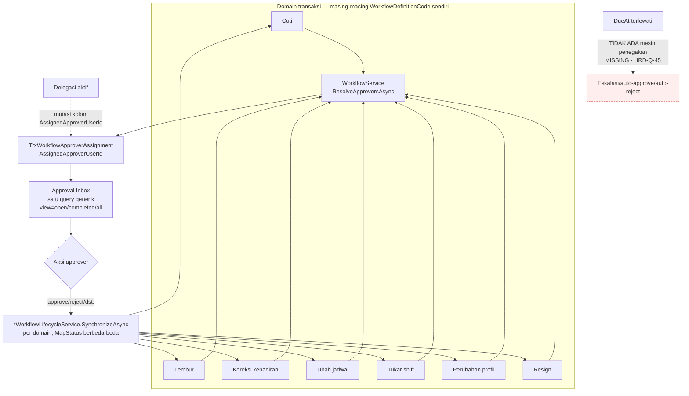

# Flow 09 — Kotak Masuk Persetujuan Terpadu

| Field | Value |
| --- | --- |
| Blueprint ID | `HRD-BP-001` |
| Jenis | Business process flow |
| Slice terkait | `S-A7` |
| Status | `DRAFT` |
| Backend baseline | `origin/QuilvianIntegrationBackend`, diverifikasi `16b8b71` |

---

## 1. Purpose

Mendokumentasikan mesin workflow generik yang **sudah dirujuk berulang kali** oleh flow 02, 03,
04, 06, dan 07 sebagai otoritas persetujuan, tanpa pernah dijelaskan lengkap sampai flow ini.

**Aturan yang mengikat, `[DECISION]` `HRD-DEC-011`/`HRD-DEC-018`:** kotak masuk ini **hanya
menyatukan UX**. Workflow, policy, permission, validasi, SLA, dan eskalasi tetap dimiliki dan
dijalankan **per jenis transaksi**. Flow ini **tidak boleh** dibaca sebagai state machine
persetujuan universal — audit source pada pass ini justru **membuktikan** pemisahan itu sampai
ke lapisan data, bukan cuma UX.

## 2. Actors

| Aktor | Yang dikerjakan | Provenance |
| --- | --- | --- |
| Approver (siapa pun yang ditugaskan `AssignedApproverUserId`) | Menyetujui, menolak, minta revisi, mengembalikan, memverifikasi, atau mengakui satu item dari kotak masuknya | `[EXISTING]` — `ApprovalInboxController` |
| Delegator (approver yang mendelegasikan) | Membuat, mengajukan, mengaktifkan, mencabut delegasi persetujuannya sendiri | `[EXISTING]` — `ApprovalDelegationController`, hanya untuk dirinya sendiri |
| Delegate (penerima delegasi) | Menyetujui item yang didelegasikan, muncul di `delegated-to-me` | `[EXISTING]` |
| Sistem | Menentukan approver lewat `ResolveApproversAsync`, menghitung `DueAt` | `[EXISTING]` |

## 3. Trigger

| Pemicu | Provenance |
| --- | --- |
| Transaksi dari domain mana pun diajukan dan memerlukan persetujuan | `[EXISTING]` — tujuh domain terkonfirmasi, lihat bagian 9 |
| Approver akan cuti/tidak tersedia, ingin mendelegasikan | `[EXISTING]` — `TrxApprovalDelegation` |

## 4. Preconditions

1. Domain pemohon sudah terintegrasi ke `WorkflowService` dengan `WorkflowDefinitionCode`
   miliknya sendiri. `[EXISTING]`
2. `MstWorkflowStep`/`MstApprovalMatrix` untuk `WorkflowDefinitionId` domain itu sudah
   dikonfigurasi. `[EXISTING]`

## 5. Happy Path

1. Transaksi domain (cuti, lembur, koreksi kehadiran, ubah jadwal, tukar shift, perubahan profil,
   resign) diajukan; masing-masing domain memanggil `WorkflowService.CreateAsync`/`SubmitAsync`
   dengan `WorkflowDefinitionCode` miliknya sendiri. `[EXISTING]`
2. `ResolveApproversAsync` menentukan approver dari salah satu sumber yang dikonfigurasi:
   `RequesterManager`, `ManagerLevel`, `SpecificUser`, `Position`, `OrganizationUnit`, `Role*`,
   `ApprovalMatrix`, atau `RequesterSelected` — ditentukan per `MstWorkflowStep`/
   `MstApprovalMatrix` milik `WorkflowDefinitionId` domain itu. `[EXISTING]`
3. Baris `TrxWorkflowApproverAssignment` dibuat dengan `AssignedApproverUserId`. `[EXISTING]`
4. Approver membuka `GET .../approval-inbox` (parameter `view`, `workflowCode`, `referenceType`,
   `dueStatus`, `isDelegated`) — **satu query generik** di atas `TrxWorkflowApproverAssignment`
   difilter `AssignedApproverUserId == userId`, **bukan** adapter per domain. `[EXISTING]` —
   `ApprovalInboxService.BuildBaseQuery` baris 728–745.
5. Approver menjalankan salah satu dari enam aksi: `approve`, `reject`, `request-revision`,
   `return`, `verify`, `acknowledge` — pada `{assignmentId}`, bukan pada entity domain langsung.
   `[EXISTING]`
6. Gate keputusan: `assignment.AssignedApproverUserId == actorContext.UserId` —
   `WorkflowService.ApproveAsync` baris 1024. `[EXISTING]`
7. Domain masing-masing mensinkronkan status lewat `*WorkflowLifecycleService.SynchronizeAsync`
   miliknya sendiri, memetakan status workflow generik ke kosakata status domainnya
   (`MapStatus`) — pemetaan ini **berbeda kode per domain**, bukan satu pemetaan universal.
   `[EXISTING]`

## 6. Alternative Flow

| Keadaan | Yang terjadi | Provenance |
| --- | --- | --- |
| Approver mendelegasikan persetujuannya | `ApprovalDelegationService.ApplyDelegationToOpenAssignmentsAsync` **memutasi langsung** `assignment.OriginalApproverUserId = AssignedApproverUserId` lalu `AssignedApproverUserId = delegation.DelegateUserId` pada assignment yang masih terbuka | `[EXISTING]` — baris 1880–1949 |
| Delegasi dicabut | `RestoreOpenAssignmentsAsync` mengembalikan `AssignedApproverUserId` ke nilai semula | `[EXISTING]` — baris 1951–1991 |
| Approver ingin melihat riwayat, bukan hanya yang menunggu | Parameter `view=completed` atau `view=all` pada `GET .../approval-inbox` | `[EXISTING]` — `HRD-Q-12` tertutup, lihat bagian 8 |

## 7. Exception Flow

| Keadaan | Yang terjadi | Provenance |
| --- | --- | --- |
| Item yang menunggu melewati `DueAt` | `MstWorkflowStep` punya `ReminderAfterHours`/`EscalationAfterHours`/`AutoApproveAfterHours`/`AutoRejectAfterHours`, dan `DueAt` benar-benar dihitung saat instansiasi step | `[EXISTING]` — field dan nilai `DueAt` ada |
| Eskalasi/auto-approve/auto-reject benar-benar dijalankan | **Tidak ditemukan.** Tidak ada `BackgroundService`/`IHostedService`/job terjadwal yang membaca `DueAt` atau keempat field itu dan bertindak. Field-field ini hari ini **hanya konfigurasi dan tampilan** (dipakai filter `dueStatus`), bukan mesin penegakan | `[OPEN]`/`UNVERIFIED` — `HRD-Q-45` |
| `value` yang tidak dikenal pada parameter `view` | `ApplyFilters` memaksa hasil kosong (`x => false`) — bukan error, bukan default diam-diam ke `open` | `[EXISTING]` — baris 785 |
| Ditemukan `TrxLeaveRequestApproval` — entity approval terpisah dengan kolom sendiri (`ApprovalStatus`, `DueAt`, delegasi), **tanpa** `WorkflowInstanceId` | Kemungkinan mekanisme lama/paralel yang tidak lewat mesin generik `TrxWorkflowApproverAssignment` — belum diverifikasi apakah masih aktif atau sisa kode mati | `[OPEN]` `HRD-Q-46` — **jangan diasumsikan salah satu** (aktif atau mati) tanpa audit lanjutan |

## 8. Approval — Q-12 dan Q-13 tertutup

**`HRD-Q-12` tertutup lewat audit source, pass ini.** Kotak masuk **menampilkan keduanya**:
pengajuan yang menunggu (`view=open`, default) **dan** yang sudah diputuskan (`view=completed`,
atau `view=all` untuk semuanya). Bukan pending-only. `[EXISTING]` — `ApplyFilters` baris
771–786.

**`HRD-Q-13` tertutup lewat audit source, pass ini.** Delegasi diaktifkan **oleh approver itu
sendiri** — `CreateDraftAsync` mengunci `DelegatorUserId = actor.UserId` (baris 336), tidak ada
field di DTO permintaan yang memungkinkan pembuatan delegasi atas nama orang lain. Delegasi
lain (misalnya delegasi mundur/menerima) juga tidak dapat menyetujui delegasinya sendiri (guard
baris 723–729: "Pemberi atau penerima delegasi tidak dapat menyetujui..."). Mekanismenya bukan
percabangan kode khusus di `ApproveAsync`, melainkan **mutasi kolom** `AssignedApproverUserId` —
delegate secara harfiah *menjadi* approver yang tercatat. `[EXISTING]`

## 9. State Transition

### 9.1 Assignment persetujuan — status generik

Nilai (disimpulkan dari filter, bukan satu enum tunggal yang eksplisit dikutip): kelompok
"terbuka" (`Pending`/`Available`/`InProgress` — `OpenAssignmentStatuses`) dan kelompok "selesai"
(`CompletedAssignmentStatuses`). `[EXISTING]` — dari `ApplyFilters`.

### 9.2 Delegasi — `TrxApprovalDelegation`

| Dari | Tindakan | Ke | Siapa | Provenance |
| --- | --- | --- | --- | --- |
| `Draft` | Ajukan | `Submitted` | Delegator (diri sendiri) | `[EXISTING]` |
| `Submitted` | Setujui | `Approved`/`Active` | **Bukan** delegator maupun delegate — guard eksplisit melarang keduanya menyetujui delegasinya sendiri | `[EXISTING]` — baris 723–729 |
| `Active` | Aktifkan pada assignment terbuka | Assignment berpindah approver | Sistem (`ApplyDelegationToOpenAssignmentsAsync`) | `[EXISTING]` |
| `Active` | Cabut | `Revoked` | Delegator | `[EXISTING]` — `RestoreOpenAssignmentsAsync` mengembalikan approver semula |
| — | Kedaluwarsa | `Expired` | Sistem | State vocabulary `[EXISTING]`; transition edge (siapa yang menjalankan kedaluwarsa) `[OPEN]`/`UNVERIFIED` |
| `Draft`/`Submitted` | Batalkan | `Cancelled` | Delegator | `[EXISTING]` |

### 9.3 Yang **tidak boleh** disimpulkan dari flow ini

Tidak ada state machine "persetujuan universal" yang menggantikan state machine per-domain (flow
02 `CorrectionRequestStatus`, flow 03 `Status`/`RecallStatus`, flow 04 `RequestStatus`, flow 06
`SchedulingRequestValueConstants`). Assignment adalah lapisan **routing dan keputusan**, bukan
pengganti status domain. `[DECISION]` `HRD-DEC-018`.

## 10. Data Created/Updated

| Data | Entity | Prefix | Catatan |
| --- | --- | --- | --- |
| Instance workflow | `TrxWorkflowInstance` | `Trx` | Dipakai lintas domain, dibedakan `ReferenceType`/`ReferenceId`/`WorkflowDefinitionCode` |
| Penugasan approver | `TrxWorkflowApproverAssignment` | `Trx` | Kolom `AssignedApproverUserId`/`OriginalApproverUserId` — sumber tunggal query kotak masuk |
| Delegasi persetujuan | `TrxApprovalDelegation` | `Trx` | Lifecycle sendiri, lihat bagian 9.2 |
| Konfigurasi step dan matriks | `MstWorkflowStep`, `MstApprovalMatrix` | `Mst` | Di-scope per `WorkflowDefinitionId` — bukti pemisahan per domain |
| **Kemungkinan mekanisme lama** | `TrxLeaveRequestApproval` | `Trx` | Tanpa `WorkflowInstanceId` — status hidup/mati belum diverifikasi, `HRD-Q-46` |

## 11. Backend Capability

| Kemampuan | Endpoint | Status |
| --- | --- | --- |
| Kotak masuk (list, filter, aksi) | `ApprovalInboxController`: `filters/metadata`, `summary`, `GET /` (paged, `view`/`workflowCode`/`referenceType`/`dueStatus`/`isDelegated`), `delegated-to-me`, `GET {assignmentId}`, `POST {assignmentId}/{approve\|reject\|request-revision\|return\|verify\|acknowledge}` | `READY TO REUSE` `[EXISTING]` |
| Delegasi | `ApprovalDelegationController`: `Read`/`Create`/`Update`/`Submit`/`Approve`/`Reject`/`Activate`/`Revoke`/`Cancel`/`Delete` | `READY TO REUSE` `[EXISTING]` |
| Eskalasi/auto-approve/auto-reject terjadwal | Tidak ditemukan | `MISSING` — `HRD-Q-45` |

## 12. Frontend Capability

| Kemampuan | Lokasi | Status |
| --- | --- | --- |
| Kotak masuk persetujuan terpadu | Tidak ada | `MISSING` `[EXISTING]` — nol kecocokan untuk `approval-inbox`/`ApprovalInbox` di kedua repo frontend |
| Delegasi | Tidak ada | `MISSING` `[EXISTING]` |

## 13. Integration Boundary

| Batas | Keterangan | Provenance |
| --- | --- | --- |
| Kotak masuk ↔ domain transaksi | Tujuh domain terkonfirmasi memakai mesin ini: cuti (permohonan/pemanggilan kembali/pembatalan/penyesuaian), lembur, koreksi kehadiran, ubah jadwal, tukar shift, perubahan profil pegawai, resign | `[EXISTING]` |
| Penetapan gaji (salary assignment) | **Tidak terkonfirmasi terintegrasi** ke mesin ini — tidak ditemukan file integrasi workflow untuk `WfpSalaryAssignment` | `[OPEN]` — konsisten dengan `HRD-Q-19` pada flow 01, bukan temuan baru |
| Kotak masuk vs aturan bisnis domain | Kotak masuk hanya menyatukan bentuk ringkasan, filter, dan navigasi; SLA/eskalasi/policy tetap milik domain — meski hari ini eskalasi domain manapun belum benar-benar berjalan (bagian 7) | `[DECISION]` `HRD-DEC-018` |

## 14. Audit Requirement

| Kebutuhan | Provenance |
| --- | --- |
| Setiap aksi assignment (approve/reject/dst.) tercatat pelaku dan waktu | `[EXISTING]` — pola `IdentityModel` konsisten |
| Delegasi tercatat siapa mendelegasikan ke siapa, kapan aktif/dicabut | `[EXISTING]` |
| Assignment yang didelegasikan tetap dapat ditelusuri ke approver asli | `[EXISTING]` — `OriginalApproverUserId` dipertahankan |

## 15. Blocking Decision

| ID | Isi | Dampak |
| --- | --- | --- |
| `HRD-Q-45` | **Baru.** `DueAt`/`ReminderAfterHours`/`EscalationAfterHours`/`AutoApproveAfterHours`/`AutoRejectAfterHours` ada sebagai konfigurasi tapi tidak ada mesin penegakan (tidak ada job terjadwal). Apakah ini memang belum diprioritaskan, atau celah operasional yang perlu segera dibangun? | Memblokir keputusan prioritas SLA/eskalasi |
| `HRD-Q-46` | **Baru.** `TrxLeaveRequestApproval` — entity approval terpisah tanpa `WorkflowInstanceId` — apakah masih aktif dipakai secara paralel dengan mesin generik, atau sisa kode dari mekanisme lama yang sudah digantikan? | Memblokir kepastian apakah cuti benar-benar 100% memakai mesin generik ini, atau sebagian masih lewat jalur lama |
| `HRD-Q-12`, `HRD-Q-13` | Sudah **tertutup** pada pass ini, lihat bagian 8 | — |

## 16. Acceptance Criteria

| ID | Kriteria | Cara menguji |
| --- | --- | --- |
| `AC-F09-01` | Kotak masuk menyatukan lintas domain lewat satu query, bukan adapter per domain | Ajukan cuti, lembur, dan koreksi kehadiran dengan approver yang sama; ketiganya muncul di satu panggilan `GET /` tanpa parameter domain |
| `AC-F09-02` | Kotak masuk menampilkan riwayat, bukan hanya yang menunggu | Setujui satu item; panggil ulang dengan `view=completed`, item itu muncul |
| `AC-F09-03` | Delegasi memindahkan approver tanpa mengubah aturan bisnis domain | Delegasikan persetujuan cuti; policy/matriks cuti tidak berubah, hanya `AssignedApproverUserId` yang berpindah |
| `AC-F09-04` | Delegator/delegate tidak dapat menyetujui delegasinya sendiri | Coba setujui delegasi sebagai salah satu pihaknya; ditolak |
| `AC-F09-05` | Eskalasi otomatis **belum** dapat diandalkan | Lewati `DueAt` sebuah assignment; tidak ada auto-approve/auto-reject/eskalasi yang terjadi — kriteria ini mendokumentasikan celah, bukan perilaku yang diharapkan final |

## 17. Diagram

