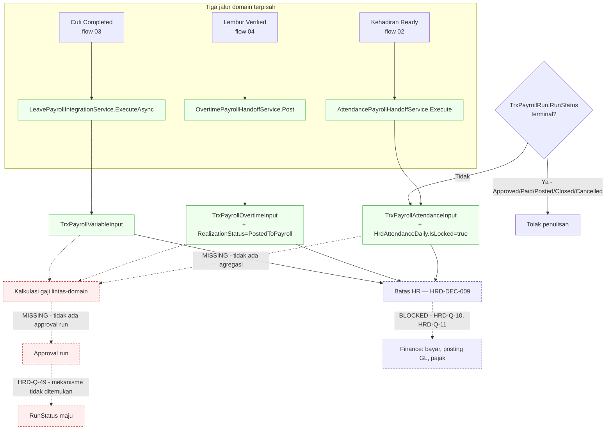

# Flow 10 — Payroll Processing & Handoff

| Field | Value |
| --- | --- |
| Blueprint ID | `HRD-BP-001` |
| Jenis | System / integration flow |
| Slice terkait | `S-B5` |
| Status | **`PARTIAL`** — desain hanya sampai batas HR yang dikunci `HRD-DEC-009`. Sesudah batas itu tetap `[BLOCKED]` oleh `HRD-Q-10` dan `HRD-Q-11` |
| Backend baseline | `origin/QuilvianIntegrationBackend`, diverifikasi `16b8b71` |

---

## 1. Purpose

Mendokumentasikan bagaimana masukan payroll dari kehadiran, cuti, dan lembur disiapkan sampai
batas tanggung jawab HR yang sudah final, `[DECISION]` `HRD-DEC-009`: **HR bertanggung jawab
sampai data terhitung, terekonsiliasi, dan diserahkan. Pembayaran, posting akuntansi, pajak, dan
pelaporan adalah milik Finance.**

**Aturan paling penting flow ini, dibuktikan tegas dari source:**

> **`Payroll Executed` ≠ `Employee Paid`.**

Ketiga aksi "execute"/"post" yang ada hari ini (kehadiran, lembur, cuti) hanya membekukan data
masukan pada sisi domain masing-masing dan mengunci rekaman sumbernya. **Tidak satu pun**
menyentuh `TrxPayrollRun.RunStatus`, memanggil sistem Finance/akuntansi, atau menulis
`TrxPayrollPayment`/`FinancePaymentBatchId`/`GlHeaderId`. Tidak ada kode di mana pun yang
menandai uang benar-benar berpindah tangan.

## 2. Actors

| Aktor | Yang dikerjakan | Provenance |
| --- | --- | --- |
| Petugas payroll | Memicu `execute`/`post` per domain (kehadiran, lembur, cuti), membaca rekonsiliasi | `[EXISTING]` |
| Sistem | Membekukan snapshot input dan mengunci rekaman sumber | `[EXISTING]` |
| Finance | Menerima hasil serah terima, memproses pembayaran | `[BLOCKED]` — bentuk dan perilakunya `HRD-Q-10`/`HRD-Q-11` |

## 3. Trigger

| Pemicu | Provenance |
| --- | --- |
| Periode kehadiran/lembur/cuti siap diserahkan ke payroll | `[EXISTING]` |
| Petugas payroll memanggil `execute`/`post`/`reconcile` per domain | `[EXISTING]` |

## 4. Preconditions

1. Kehadiran harian berstatus `PayrollInputStatus.Ready` (flow 02), realisasi lembur `Verified`
   (flow 04), atau cuti sudah `Completed`/`OnCompletion` (flow 03). `[EXISTING]` — rujukan silang.
2. Periode terkait belum `TerminalPayrollRunStatuses` (`Approved`/`Paid`/`Posted`/`Closed`/
   `Cancelled`) pada `TrxPayrollRun`. `[EXISTING]` — lihat bagian 9.

## 5. Happy Path — apa yang benar-benar terjadi per domain

Tidak ada satu alur "payroll run" tunggal yang menyatukan ketiganya. Yang ada adalah **tiga jalur
domain terpisah**, masing-masing menulis snapshot ke tabel `TrxPayroll*Input` miliknya sendiri:

1. **Kehadiran**: `AttendancePayrollHandoffService.Execute` (baris 295–520) membuat/memutakhirkan
   `TrxPayrollAttendanceInput`, mengunci `HrdAttendanceDaily.IsLocked = true` dan
   `PayrollInputStatus = "Processed"` (baris 477–482). `[EXISTING]`
2. **Lembur**: `OvertimePayrollHandoffService.Post` (baris 555–591) membuat/memutakhirkan
   `TrxPayrollOvertimeInput`, mengubah `TrxOvertimeRealization.RealizationStatus =
   "PostedToPayroll"` (baris 561–568). `[EXISTING]`
3. **Cuti**: `LeavePayrollIntegrationService.ExecuteAsync` menulis `TrxPayrollVariableInput`
   (baris 1283, 1320) dari data cuti yang sudah selesai. `[EXISTING]`

Ketiganya memeriksa `TrxPayrollRun.RunStatus`/`IsLocked` sebelum menulis — **menolak** bila status
sudah termasuk `TerminalPayrollRunStatuses` (`AttendancePayrollHandoffValueConstants.cs` baris
59–66, ditegakkan `AttendancePayrollHandoffService.cs` baris 1774–1783; Overtime baris 393–396;
Leave baris 968–978). `[EXISTING]` — ini satu-satunya guard run-level yang benar-benar terbukti.

## 6. Alternative Flow

| Keadaan | Yang terjadi | Provenance |
| --- | --- | --- |
| `execute`/`post` dipanggil dua kali untuk data yang sama | Idempoten — ketiganya memeriksa snapshot yang sudah ada sebelum menulis ulang (`ResultStatus.Idempotent` pada attendance, `IdempotencyKey` pada overtime, pemeriksaan baris existing pada leave) | `[EXISTING]` |
| Rekonsiliasi ditemukan selisih | Ditangani per domain lewat `GET .../reconciliation` (kehadiran, cuti) atau `POST reconcile` (lembur, dengan `AllowRepair`) | `[EXISTING]` |
| Perlu membatalkan hasil serah terima | `AttendancePayrollHandoffController` punya `repair`/`rollback`; `OvertimePayrollHandoffController` punya `rollback`; `LeavePayrollIntegrationController` punya `rollback` | `[EXISTING]` |

## 7. Exception Flow

| Keadaan | Yang terjadi | Provenance |
| --- | --- | --- |
| Periode sudah terminal (`Approved`/`Paid`/`Posted`/`Closed`/`Cancelled`) | Penulisan snapshot ditolak pada ketiga domain | `[EXISTING]` |
| Kalkulasi gaji lintas-domain (gross/net pay) | **`MISSING`.** Tidak ditemukan service yang mengagregasi `TrxPayrollAttendanceInput`/`TrxPayrollOvertimeInput`/`TrxPayrollVariableInput` menjadi angka gaji. Ketiga snapshot ini adalah **masukan**, bukan hasil hitung | `[EXISTING]` — ketiadaan dikonfirmasi lewat pencarian repo-wide |
| Approval sebelum `execute` | **`MISSING`.** Tidak ada kode yang mengisi `TrxPayrollApproval` atau menulis `ApprovedAt`/`ApprovedByUserId` pada `TrxPayrollRun`. `execute`/`post` hanya digerbangi status-tidak-terminal, bukan oleh persetujuan apa pun | `[EXISTING]` |
| `TrxPayrollRun.RunStatus` maju dari `Draft` ke tahap berikutnya | **`MISSING`/`UNVERIFIED`.** Tidak ditemukan controller untuk `TrxPayrollRun` sama sekali, dan tidak ada service yang menulis `RunStatus` selain guard baca di atas. Tidak jelas mekanisme apa yang benar-benar memajukan status ini di luar migrasi/seed manual | `[OPEN]` — `HRD-Q-49` |

## 8. Approval

Tidak terbukti ada jalur approval run-level. Rekonsiliasi dan repair per domain dijaga
`[AccessPermission]` generik pada masing-masing controller — sama dengan pola domain lain, bukan
mesin workflow. `[EXISTING]`

## 9. State Transition

### 9.1 `TrxPayrollRun.RunStatus`

State vocabulary: `Draft`, `CollectingInput`, `Calculating`, `Review`, `WaitingApproval`,
`Approved`, `PaymentProcessing`, `Paid`, `Posted`, `Closed`, `Cancelled`, `Reversed`. `[EXISTING]`
— ditemukan pada model, lengkap dengan kolom timestamp per milestone (`CalculatedAt`,
`SubmittedAt`, `ApprovedAt`, `PostedAt`, `ClosedAt`).

**Transition edge — sebagian besar TIDAK ADA.** Tidak ada controller untuk `TrxPayrollRun`.
Pencarian repo-wide untuk penulisan `.RunStatus =` pada entity ini menghasilkan nol — satu-
satunya guard nyata adalah **pembacaan** status untuk menolak penulisan snapshot bila sudah
terminal (bagian 5). Setiap edge di bawah ini adalah **state vocabulary saja**, bukan transisi
terbukti, kecuali disebutkan lain:

| Dari | Ke | Transition edge |
| --- | --- | --- |
| `Draft` | `CollectingInput` | `[OPEN]`/`UNVERIFIED` — tidak ada kode yang menuliskannya |
| `CollectingInput` | `Calculating` | `[OPEN]`/`UNVERIFIED` |
| `Calculating` | `Review` | `[OPEN]`/`UNVERIFIED` — juga tidak ada service kalkulasi yang ditemukan |
| `Review` | `WaitingApproval` | `[OPEN]`/`UNVERIFIED` |
| `WaitingApproval` | `Approved` | `[OPEN]`/`UNVERIFIED` — tidak ada approval service |
| `Approved`/`Paid`/`Posted`/`Closed`/`Cancelled` | (mana pun) | **`[EXISTING]`** — status-status ini **dibaca** untuk memblokir penulisan snapshot baru; ini satu-satunya bagian yang benar-benar ditegakkan kode |

### 9.2 Snapshot domain — status per input

| Snapshot | Status yang ditulis | Provenance |
| --- | --- | --- |
| `HrdAttendanceDaily` | `IsLocked = true`, `PayrollInputStatus = "Processed"` | `[EXISTING]` |
| `TrxOvertimeRealization` | `RealizationStatus = "PostedToPayroll"` | `[EXISTING]` |
| Cuti (via `TrxPayrollVariableInput`) | Baris baru/mutakhir per permohonan | `[EXISTING]` |

## 10. Data Created/Updated

| Data | Entity | Prefix | Perlakuan |
| --- | --- | --- | --- |
| Snapshot masukan kehadiran | `TrxPayrollAttendanceInput` | `Trx` | Milik HR, ratchet saat materially touched — `HRD-DEC-019` |
| Snapshot masukan lembur | `TrxPayrollOvertimeInput` | `Trx` | Sama |
| Snapshot masukan cuti | `TrxPayrollVariableInput` | `Trx` | Sama |
| Periode payroll | `TrxPayrollRun` | `Trx` | Sama — **tidak disentuh siapa pun hari ini** |
| **Skema dorman di luar batas HR** | `TrxPayrollPayment`, `TrxPayrollPayslip`, `TrxPayrollReversal`, `TrxMedicalServiceFeePayment`, `TrxMedicalServiceFeeCalculation` | `Trx` | **`[EXISTING]` sebagai skema apa adanya** — model dan EF config ada, kolom `FinancePaymentBatchId`/`GlHeaderId` ada pada `TrxPayrollRun`, tetapi **nol service** yang mengisinya. Dicatat sebagai fakta, **bukan** target kepemilikan HR — batas tetap `HRD-DEC-009` |

## 11. Backend Capability

| Kemampuan | Endpoint | Status |
| --- | --- | --- |
| Master data profil payroll (`Wfp*`: gaji, asuransi, pajak, tunjangan transport) | `PayrollManagement` — 6 controller, CRUD murni, tidak menyentuh run/execute | `READY TO REUSE` `[EXISTING]` |
| Serah terima kehadiran | `AttendancePayrollHandoffController` — 8 endpoint (`filters/metadata`, `payroll-runs/options`, `summary`, `preview`, `reconciliation`, `execute`, `repair`, `rollback`) | `READY TO REUSE` `[EXISTING]` sampai `execute`; sesudahnya `[BLOCKED]` |
| Serah terima lembur | `OvertimePayrollHandoffController` — 9 endpoint | `READY TO REUSE` `[EXISTING]` sampai `post`; sesudahnya `[BLOCKED]` |
| Serah terima cuti | `LeavePayrollIntegrationController` — 8 endpoint | `READY TO REUSE` `[EXISTING]` sampai `execute`; sesudahnya `[BLOCKED]` |
| Kalkulasi gaji lintas-domain | Tidak ada | `MISSING` |
| Approval run sebelum execute | Tidak ada | `MISSING` |
| Progres `TrxPayrollRun.RunStatus` | Tidak ada controller sama sekali | `MISSING` |
| Pembayaran, posting GL, pajak | Skema dorman, nol service | `[BLOCKED]` — di luar wewenang HR |

## 12. Frontend Capability

| Kemampuan | Lokasi | Status |
| --- | --- | --- |
| Master data payroll (periode, komponen, kategori komponen) | `src/app/hr/master-data/payroll-*/**` | `READY TO REUSE` `[EXISTING]` |
| Serah terima payroll (ketiga domain) | Tidak ada | `MISSING` — nol kecocokan `payroll-handoff`/`payroll-integration`/`PayrollRun` di `src/` |

## 13. Integration Boundary

| Batas | Keterangan | Provenance |
| --- | --- | --- |
| Kehadiran/lembur/cuti → snapshot payroll | Tiga jalur domain terpisah, dibuktikan bagian 5 | `[EXISTING]` |
| Snapshot → kalkulasi gaji | `MISSING` — tidak ada yang mengagregasi | `[EXISTING]` (ketiadaan) |
| HR → Finance | **`[DECISION]` `HRD-DEC-009` final**: tanggung jawab HR berhenti setelah data terhitung, terekonsiliasi, dan diserahkan. Bentuk data serah terima dan perilaku penolakan batch tetap `[BLOCKED]` — `HRD-Q-10`, `HRD-Q-11` | `[DECISION]` + `[BLOCKED]` |
| Pembayaran, GL, pajak | Skema dorman `[EXISTING]`, **bukan** target kepemilikan HR | `[BLOCKED]` |

## 14. Audit Requirement

| Kebutuhan | Provenance |
| --- | --- |
| Setiap eksekusi domain menyimpan jejak dan idempoten | `[EXISTING]` |
| Rekonsiliasi dapat ditelusuri per domain | `[EXISTING]` |
| Repair/rollback tercatat | `[EXISTING]` |
| Jejak siapa yang memajukan `TrxPayrollRun.RunStatus` | `[OPEN]`/`UNVERIFIED` — mekanismenya sendiri tidak ditemukan |

## 15. Blocking Decision

| ID | Isi | Dampak |
| --- | --- | --- |
| `HRD-DEC-009` | Batas tanggung jawab HR final: berhenti setelah data terhitung, terekonsiliasi, diserahkan | Mengikat seluruh flow ini |
| `HRD-Q-10` | Bentuk data serah terima ke Finance, siapa menarik/mengirim | `[BLOCKED]` — di luar cakupan flow ini |
| `HRD-Q-11` | Perilaku bila Finance menolak batch yang sudah `execute` | `[BLOCKED]` |
| `HRD-Q-49` | **Baru.** Tidak ditemukan controller atau service yang membuat baris `TrxPayrollRun` atau memajukan `RunStatus` dari `Draft`. Bagaimana sebuah payroll run benar-benar dimulai dan berkembang hari ini — lewat migrasi manual, jalur lain yang belum ditemukan, atau memang belum diimplementasikan sama sekali? | Memblokir kepastian apakah kalkulasi/approval run-level benar-benar `MISSING` atau ada jalur tersembunyi yang belum ditemukan |

## 16. Acceptance Criteria

| ID | Kriteria | Cara menguji |
| --- | --- | --- |
| `AC-F10-01` | Tidak ada endpoint HR yang mengubah status pembayaran | Audit seluruh 91 endpoint tiga controller handoff; tidak satu pun menulis `TrxPayrollPayment`/`FinancePaymentBatchId` |
| `AC-F10-02` | Rantai berhenti pada `execute`/`post` per domain | Panggil ketiganya; hasilnya hanya snapshot + lock sumber, tidak ada mutasi `TrxPayrollRun.RunStatus` |
| `AC-F10-03` | Serah terima idempoten | Jalankan `execute`/`post` dua kali untuk data yang sama; tidak menghasilkan duplikat |
| `AC-F10-04` | Periode terminal menolak penulisan baru | Set `TrxPayrollRun.RunStatus = Closed` (bila memungkinkan), coba `execute`; ditolak |
| `AC-F10-05` | `Payroll Executed` tidak pernah diklaim sebagai `Employee Paid` di dokumentasi maupun UI mendatang | Kriteria dokumentasi — tinjau ulang setiap deskripsi UI yang menyebut "executed"/"posted" agar tidak menyiratkan pembayaran selesai |

## 17. Diagram

Kotak biru putus-putus adalah batas `HRD-DEC-009` — sengaja tidak digambar lebih jauh. Kotak merah
adalah kalkulasi, approval, dan progres `RunStatus` yang terbukti belum ada implementasinya.
