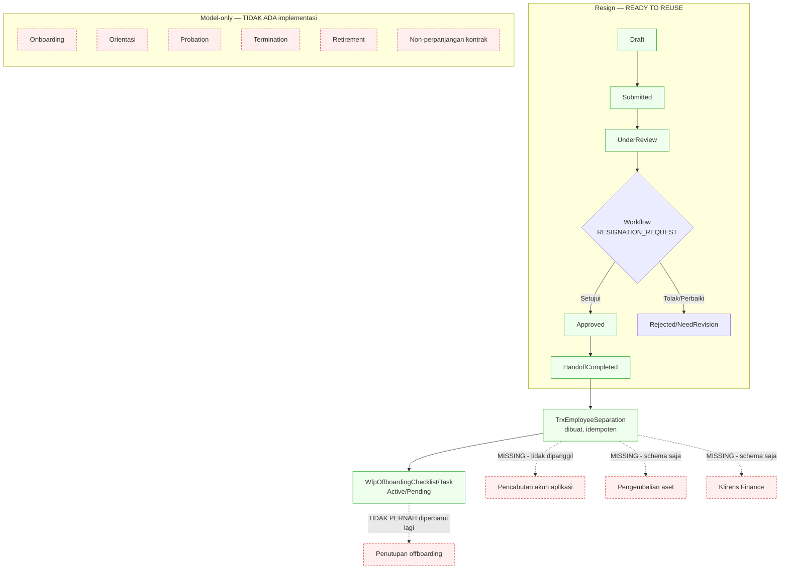

# Flow 11 — Lifecycle dan Offboarding

| Field | Value |
| --- | --- |
| Blueprint ID | `HRD-BP-001` |
| Jenis | Business process flow |
| Slice terkait | `S-C4` |
| Status | `DRAFT` |
| Backend baseline | `origin/QuilvianIntegrationBackend`, diverifikasi `16b8b71` |

---

## 1. Purpose

Mengelola siklus hidup kepegawaian dari onboarding sampai pemberhentian. **Temuan paling
penting:** dari 21 model `LifecycleManagement`, **hanya resign (`TrxResignationRequest`) yang
benar-benar operasional.** Onboarding, orientasi, probation, termination, retirement,
non-perpanjangan kontrak, dan sebagian besar offboarding adalah **skema tanpa satu pun
controller atau service** — dibuktikan pencarian repo-wide, bukan diasumsikan dari nama entity.

**Temuan kedua yang sama pentingnya:** pencabutan akses aplikasi saat pegawai keluar **tidak
otomatis**. Kode sumber sendiri mengakui ini lewat pesan eksplisit — lihat bagian 7.

## 2. Actors

| Aktor | Yang dikerjakan | Provenance |
| --- | --- | --- |
| Pegawai | Mengajukan resign lewat layanan mandiri | `[EXISTING]` |
| Atasan/HR | Menyetujui resign lewat mesin workflow | `[EXISTING]` |
| HR Admin | Menjalankan lifecycle handoff setelah resign disetujui | `[EXISTING]` |
| Sistem | Membuat `TrxEmployeeSeparation` dan checklist offboarding saat handoff | `[EXISTING]` |

## 3. Trigger

| Pemicu | Provenance |
| --- | --- |
| Pegawai mengajukan resign | `[EXISTING]` |
| Resign disetujui, HR menjalankan handoff | `[EXISTING]` |
| Pegawai baru bergabung (onboarding) | `[OPEN]`/`MISSING` — model ada, tidak ada jalur nyata |
| Pemberhentian involunter (termination) | `[OPEN]`/`MISSING` — model ada, tidak ada jalur nyata |

## 4. Preconditions

Resign: profil workforce aktif. `[EXISTING]`. Onboarding/probation/termination: tidak ada
precondition yang dapat dibuktikan karena tidak ada jalur eksekusi.

## 5. Happy Path — Resign (satu-satunya yang matang)

1. Pegawai mengajukan resign lewat `ResignationSelfServiceController`. Status `Draft`.
   `[EXISTING]`
2. Diajukan. Status `Submitted`, lalu `UnderReview`. `[EXISTING]` — guard status pada
   `ResignationRequestService.cs` baris 215–220 dkk.
3. `ResignationWorkflowIntegrationService.SubmitAsync` (baris 159–218) membuat/mengirim instance
   ke mesin workflow generik dengan kode `RESIGNATION_REQUEST`. **Approver routing sepenuhnya
   diserahkan ke konfigurasi `MstWorkflowDefinition`** — `SelectedApproverUserIds` dikirim kosong
   (baris 182), tidak ada logika approval yang bespoke untuk resign. `[EXISTING]`
4. Disetujui. Status `Approved`. `[EXISTING]`
5. HR menjalankan handoff. `ResignationLifecycleHandoffService` (baris 46–51) memeriksa
   `RequestStatus == Approved`, lalu membuat `TrxEmployeeSeparation` (baris 54–80) dan
   `WfpOffboardingChecklist`/`WfpOffboardingTask` (baris 115–164) dengan status `Active`/
   `Pending`. Idempoten lewat pemeriksaan `EmployeeSeparationId.HasValue` (baris 37). `[EXISTING]`
6. Status resign menjadi `HandoffCompleted`. `[EXISTING]`

## 6. Alternative Flow

| Keadaan | Yang terjadi | Provenance |
| --- | --- | --- |
| Resign ditolak/perlu revisi | Status `NeedRevision`/`Rejected` | `[EXISTING]` — state vocabulary |
| Resign dibatalkan sebelum disetujui | Status `Cancelled` | `[EXISTING]` |
| Onboarding pegawai baru | `TrxEmployeeOnboarding`/`WfpOnboardingChecklist` punya state vocabulary (`OnboardingStatus` default `Draft`) — **tidak ada controller atau service yang mengoperasikannya** | `MISSING` |
| Probation dievaluasi | `TrxProbationReview` punya `ReviewResult`/`ReviewStatus` (default `Pending`) — **tidak ada kode yang pernah menulis hasilnya** | `MISSING` |
| Pemberhentian involunter | `TrxTermination` adalah entity terpisah dengan field severance/legal-review sendiri — **model saja, tidak diimplementasikan** | `MISSING` |
| Pensiun, non-perpanjangan kontrak | `TrxRetirement`, `TrxContractNonRenewal` — model saja | `MISSING` |

## 7. Exception Flow

| Keadaan | Yang terjadi | Provenance |
| --- | --- | --- |
| Pegawai keluar, apakah akun aplikasinya otomatis nonaktif | **TIDAK.** `ResignationWorkflowLifecycleService.cs` baris 91–93 secara eksplisit mencatat: *"Workflow resign selesai. HR wajib menjalankan lifecycle handoff; employee belum dinonaktifkan otomatis."* Dikuatkan `01-existing-capability-map.md` baris 552: penyediaan/pencabutan akun "Belum ada bukti integrasi dari sisi HR" | `[EXISTING]` — dibuktikan dari peringatan eksplisit di source, bukan ketiadaan yang disimpulkan |
| Checklist offboarding perlu diselesaikan sebelum ditutup | **Tidak ada penegakan.** Checklist dibuat sekali saat handoff (`Active`/`Pending`), lalu **tidak pernah disentuh kode lagi** — tidak ada endpoint "tutup offboarding", tidak ada pemeriksaan bahwa seluruh task selesai | `MISSING` |
| Aset, akses, klirens Finance perlu dikonfirmasi sebelum offboarding selesai | `TrxAssetReturn`, `TrxAccessRevocation`, `TrxExitClearance` (flag `IsFinanceCleared`/`IsPayrollCleared`) — **seluruhnya schema placeholder, nol service** | `MISSING` |
| Tanggal efektif terakhir bekerja dipakai kehadiran/payroll untuk berhenti menghasilkan kewajiban | **Tidak terbukti.** `ProposedLastWorkingDate`/`LastWorkingDate`/`EffectiveSeparationDate` hanya hidup di `LifecycleManagement` — pencarian repo-wide dari `AttendanceManagement`/`PayrollManagement` menghasilkan nol rujukan balik | `[OPEN]` — `HRD-Q-50` |

## 8. Approval

Resign: mesin workflow generik, sama dengan domain lain — otoritas ditentukan konfigurasi
`MstWorkflowDefinition`/`MstApprovalMatrix`, bukan hardcode. `[EXISTING]`. Onboarding/
probation/termination: tidak ada approval karena tidak ada implementasi sama sekali.

## 9. State Transition

### 9.1 Resign — `ResignationValueConstants`

State vocabulary: `Draft`, `Submitted`, `UnderReview`, `NeedRevision`, `Approved`, `Rejected`,
`Cancelled`, `HandoffCompleted`. `[EXISTING]`

| Dari | Ke | Transition edge — evidence |
| --- | --- | --- |
| `Draft` | `Submitted` | `[EXISTING]` — guard `ResignationRequestService.cs` baris 215–220 |
| `Submitted` | `UnderReview` | `[EXISTING]` — via `ResignationWorkflowIntegrationService.SubmitAsync` |
| `UnderReview` | `Approved`/`Rejected`/`NeedRevision` | `[EXISTING]` — `ResignationWorkflowLifecycleService.MapStatus` baris 97–128, disinkronkan dari mesin workflow |
| `Approved` | `HandoffCompleted` | `[EXISTING]` — `ResignationLifecycleHandoffService`, guard `RequestStatus == Approved`, idempoten |
| `Draft`/`Submitted`/`UnderReview` | `Cancelled` | `[EXISTING]` — guard baris 327–335 |

### 9.2 Onboarding, probation, termination, retirement, non-perpanjangan kontrak

State vocabulary `[EXISTING]` untuk seluruhnya (ditemukan pada model). **Transition edge: TIDAK
ADA** untuk semuanya — tidak ada controller/service yang mengoperasikan salah satu dari:
`TrxEmployeeOnboarding`, `WfpOnboardingChecklist`, `TrxProbationReview`, `TrxTermination`,
`TrxRetirement`, `TrxContractNonRenewal`.

### 9.3 Offboarding checklist — `WfpOffboardingChecklist`/`WfpOffboardingTask`

Dibuat sekali (`Active`/`Pending`) oleh handoff resign. **Transition edge sesudahnya: TIDAK
ADA** — tidak ada kode yang memutakhirkan status task atau checklist setelah pembuatan awal.

## 10. Data Created/Updated

| Data | Entity | Prefix | Backend capability |
| --- | --- | --- | --- |
| Permohonan resign | `TrxResignationRequest` | `Trx` | `READY TO REUSE` |
| Separasi kepegawaian | `TrxEmployeeSeparation` | `Trx` | `READY TO REUSE` — hanya create-only dari handoff |
| Checklist/task offboarding | `WfpOffboardingChecklist`, `WfpOffboardingTask` | `Wfp` | **`EXTEND`** — dibuat, tidak pernah diperbarui lagi |
| Template offboarding | `MstOffboardingTemplate`, `MstOffboardingTemplateTask` | `Mst` | `READY TO REUSE`, read-only via handoff |
| Aset, akses, klirens keluar | `TrxAssetReturn`, `TrxAccessRevocation`, `TrxExitClearance` | `Trx` | **`MISSING`** — schema saja |
| Wawancara keluar | `TrxExitInterview` | `Trx` | **`MISSING`** |
| Termination, retirement, non-perpanjangan kontrak | `TrxTermination`, `TrxRetirement`, `TrxContractNonRenewal` | `Trx` | **`MISSING`** |
| Surat keterangan kerja pasca-kerja | `TrxEmploymentCertificateRequest` | `Trx` | **`MISSING`** |
| Probation | `TrxProbationReview` | `Trx` | **`MISSING`** |
| Onboarding | `TrxEmployeeOnboarding`, `TrxEmployeeOnboardingTask`, `WfpOnboardingChecklist`, `WfpOnboardingTask` | `Trx`/`Wfp` | **`MISSING`** |
| Template onboarding | `MstOnboardingTemplate`, `MstOnboardingTemplateTask` | `Mst` | **`MISSING`** — tidak ada yang membacanya |

Seluruh entity `Trx*` di atas mengikuti `HRD-DEC-019`: **tidak diratchet** kecuali materially
touched saat kapabilitasnya dibangun.

## 11. Backend Capability

| Kemampuan | Endpoint | Status |
| --- | --- | --- |
| Resign (korporat + layanan mandiri) | `ResignationController`, `ResignationSelfServiceController` | `READY TO REUSE` `[EXISTING]` |
| Onboarding, orientasi, probation | Tidak ada | `MISSING` |
| Termination, retirement, non-perpanjangan kontrak | Tidak ada | `MISSING` |
| Penyelesaian klirens keluar (aset, akses, Finance) | Tidak ada | `MISSING` |
| Penutupan offboarding (verifikasi checklist selesai) | Tidak ada | `MISSING` |
| Pencabutan akses aplikasi otomatis | Tidak ada — dikonfirmasi eksplisit oleh pesan source sendiri | `MISSING` |

## 12. Frontend Capability

| Kemampuan | Lokasi | Status |
| --- | --- | --- |
| Resign | `user-profile-sidebar.jsx` baris 69, 789 mendefinisikan menu ke `/karyawan/DaftarPengajuan/Resign-Karyawan/FormResign` | **`REPAIR`** — tautan menu tanpa halaman nyata di `src/app/`, dan tidak memanggil API `resignation-requests` mana pun. Ini tautan menu mati, bukan konsumen yang berfungsi |
| Onboarding, offboarding, termination, dsb. | Tidak ada | `MISSING` — backend-nya sendiri belum ada |

## 13. Integration Boundary

| Batas | Keterangan | Provenance |
| --- | --- | --- |
| HR employment lifecycle vs identity/account | **`MISSING`** — HR tidak memanggil sistem identitas untuk mencabut akun. Pesan source sendiri mengonfirmasi ini disengaja diketahui, bukan bug tersembunyi | `[EXISTING]` (ketiadaan terbukti eksplisit) |
| HR employment lifecycle vs asset return | `TrxAssetReturn` ada sebagai placeholder FK ke `TrxExitClearance`, nol service | `[OPEN]`/`MISSING` |
| HR employment lifecycle vs Finance final settlement | `TrxExitClearance.IsFinanceCleared`/`IsPayrollCleared` ada sebagai flag, nol service yang mengeset atau memeriksanya | `[OPEN]`/`MISSING` |
| HR employment lifecycle vs pencabutan kewenangan klinis | Tidak direferensikan sama sekali dari domain ini | `[BLOCKED]` — kredensial klinis tetap `S-C1`, tidak ditarik ke sini |
| Tanggal efektif terakhir bekerja vs kehadiran/payroll | Tidak terhubung — lihat bagian 7 | `[OPEN]` `HRD-Q-50` |

## 14. Audit Requirement

| Kebutuhan | Provenance |
| --- | --- |
| Resign menyimpan pelaku dan waktu di setiap tahap | `[EXISTING]` |
| Handoff ke separasi idempoten dan tercatat | `[EXISTING]` |
| Checklist offboarding menyimpan status penyelesaian aktual | `[OPEN]`/`MISSING` — dibuat tapi tidak pernah diperbarui |

## 15. Blocking Decision

| ID | Isi | Dampak |
| --- | --- | --- |
| `HRD-DEP-003` | Pembuatan dan pencabutan akun saat onboarding/offboarding — pemilik Administrator/Identity | Integration boundary belum dikonfirmasi pemilik lain |
| `HRD-Q-50` | **Baru.** Tanggal efektif terakhir bekerja (`LastWorkingDate`/`EffectiveSeparationDate`) tidak terhubung ke kehadiran maupun payroll. Apakah integrasi ini memang dibutuhkan supaya kewajiban kehadiran/payroll berhenti otomatis setelah tanggal itu, atau cukup ditangani manual oleh HR? | Memblokir desain final batas integrasi lifecycle ↔ kehadiran/payroll |

## 16. Acceptance Criteria

| ID | Kriteria | Cara menguji |
| --- | --- | --- |
| `AC-F11-01` | Resign mengikuti state machine yang terbukti, bukan asumsi | Ajukan, setujui, jalankan handoff; setiap transisi sesuai bagian 9.1 |
| `AC-F11-02` | Handoff resign idempoten | Jalankan handoff dua kali; tidak ada `TrxEmployeeSeparation` duplikat |
| `AC-F11-03` | Pemberhentian tidak menghilangkan riwayat kepegawaian | Selesaikan resign; riwayat penempatan/gaji/kinerja pegawai tetap terbaca |
| `AC-F11-04` | Pencabutan akses aplikasi **tidak** diklaim otomatis dalam dokumentasi maupun UI mendatang | Kriteria dokumentasi — setiap deskripsi offboarding harus menyatakan langkah ini manual, sampai `HRD-DEP-003` terintegrasi |
| `AC-F11-05` | Onboarding/probation/termination tidak digambarkan sebagai kapabilitas yang berjalan | Panggil endpoint mana pun untuk entity-entity itu; tidak ditemukan — kriteria dokumentasi |

## 17. Diagram

