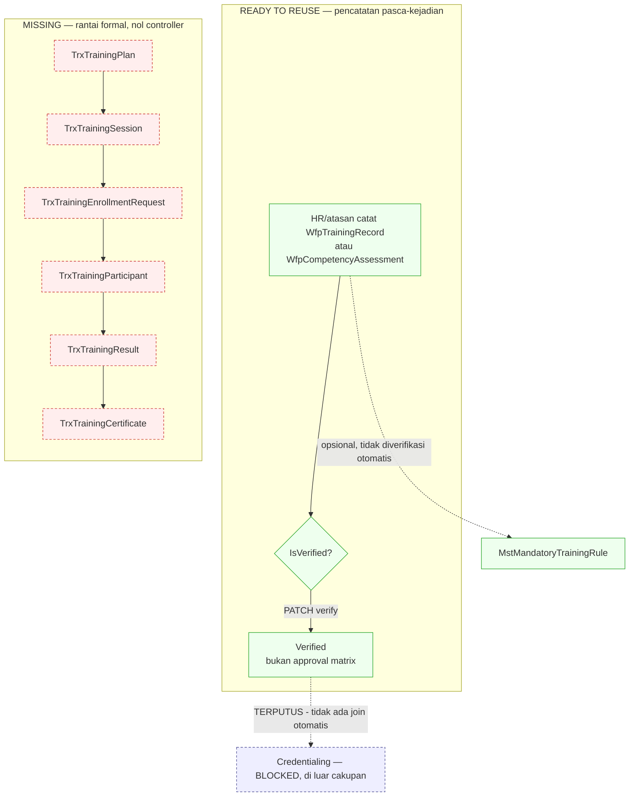

# Flow 12 — Kompetensi dan Pelatihan

| Field | Value |
| --- | --- |
| Blueprint ID | `HRD-BP-001` |
| Jenis | Business process flow |
| Slice terkait | `S-C2` |
| Status | `DRAFT` |
| Backend baseline | `origin/QuilvianIntegrationBackend`, diverifikasi `16b8b71` |

---

## 1. Purpose

Mencatat kompetensi dan pelatihan pegawai **administratif** — tegas terpisah dari kewenangan
klinis (`CredentialingManagement`: `WfpCredentialLicense`, `WfpClinicalPrivilege`,
`WfpCertification`, SPK/RKK, OPPE/FPPE), yang tetap `[BLOCKED]` menunggu Komite Medik. Audit
source membuktikan kedua domain **terputus bersih** hari ini — lihat bagian 13.

**Temuan paling penting:** dari 13 model, **hanya 4 yang punya controller**, dan bahkan yang
punya controller hanya berupa **pencatatan pasca-kejadian dengan satu flag verifikasi**, bukan
lifecycle requirement → enrollment → completion → verification yang sebenarnya. Sembilan model
sisanya membentuk rantai lengkap plan→session→enrollment→participant→result→certificate yang
**sepenuhnya tidak dapat dijangkau API**.

## 2. Actors

| Aktor | Yang dikerjakan | Provenance |
| --- | --- | --- |
| HR Admin/atasan | Mencatat hasil kompetensi/pelatihan pegawai, memverifikasi | `[EXISTING]` |
| Pegawai | Tidak ada jalur layanan mandiri | `[OPEN]`/`MISSING` |

## 3. Trigger

| Pemicu | Provenance |
| --- | --- |
| Pegawai menyelesaikan pelatihan, dicatat pasca-kejadian | `[EXISTING]` — `WfpTrainingRecordController` |
| Kompetensi pegawai dinilai, dicatat pasca-kejadian | `[EXISTING]` — `WfpCompetencyAssessmentController` |
| Aturan pelatihan wajib dibuat/diubah | `[EXISTING]` — `MandatoryTrainingRuleController`, CRUD aturan saja |

## 4. Preconditions

Katalog pelatihan (`MstTrainingCatalog`/`MstTrainingCategory`) dan kompetensi (`MstCompetency`,
di `MasterData/CompetencyAndCredential`, bukan di domain ini) sudah terisi. `[EXISTING]`

## 5. Happy Path — yang benar-benar ada

1. HR/atasan mencatat `WfpTrainingRecord` **setelah pelatihan selesai** — `StartDate`/`EndDate`
   diisi saat pembuatan, bukan hasil proses enrollment→completion. `[EXISTING]` —
   `WfpTrainingRecordController.cs` baris 302–350.
2. Rujukan opsional ke `MandatoryTrainingRuleId` diisi manual oleh pembuat — **tidak ada
   pemeriksaan otomatis** bahwa rekaman ini benar-benar memenuhi aturan yang dirujuk. `[EXISTING]`
3. HR/atasan dapat menandai `IsVerified = true` lewat `PATCH .../verify`. **Ini bukan approval
   matrix** — siapa pun pemegang permission `Update` dapat melakukannya. `[EXISTING]` — baris
   411–428.
4. Pola yang sama persis berlaku untuk `WfpCompetencyAssessment`. `[EXISTING]`

## 6. Alternative Flow

| Keadaan | Yang terjadi | Provenance |
| --- | --- | --- |
| Rencana pelatihan formal (plan → session → enrollment → participant → result → certificate) | Skema lengkap ada (`TrxTrainingPlan`, `TrxTrainingSession`, `TrxTrainingEnrollmentRequest` dengan `WorkflowDefinitionId`/`ManagerUserId`, `TrxTrainingParticipant` dengan `ParticipantStatus`/`ApprovedAt`, `TrxTrainingAttendance`, `TrxTrainingAssessment`, `TrxTrainingResult`, `TrxTrainingEvaluation`, `TrxTrainingBudget`, `TrxIndividualDevelopmentPlan`, `TrxTrainingCertificate`) — **nol controller untuk sebelas entity ini** | `MISSING` sepenuhnya |
| Sertifikat pelatihan formal | `TrxTrainingCertificate.ExpiredDate` ada, tapi **tidak ada controller** yang pernah membacanya | `MISSING` |

## 7. Exception Flow

| Keadaan | Yang terjadi | Provenance |
| --- | --- | --- |
| Pegawai belum memenuhi pelatihan wajib | **Tidak ada endpoint yang mendeteksinya.** `MandatoryTrainingRuleController.Summary` menghitung jumlah **aturan**, bukan pegawai yang belum patuh. `WorkforceTrainingRecordCount` pada rule hanya dipakai untuk mencegah penghapusan aturan yang sudah dipakai | `MISSING` |
| Sertifikat/kompetensi mendekati kedaluwarsa | `WfpCompetencyAssessment` punya perhitungan **saat query** (`GetSummary`, window 90 hari) untuk `ExpiredAssessment`/`ExpiringSoonAssessment` — **bukan** job terjadwal. Tidak ada `BackgroundService` untuk domain ini sama sekali | `[EXISTING]` sebagian — hanya query-time, bukan sweep otomatis |
| Pelatihan/sertifikat menjadi syarat kredensial klinis | `MstCredentialingRequirement` punya field opsional `CompetencyId`/`TrainingCatalogId` yang **mendeskripsikan** apa yang bisa dirujuk sebuah syarat kredensial — **tidak ada join balik** yang otomatis memenuhi syarat kredensial dari penyelesaian pelatihan | `[EXISTING]` (deskripsi field ada) + `MISSING` (tidak ada logika pemenuhan otomatis) — **ini batas yang disengaja**, jangan didesain lebih jauh karena kredensial `[BLOCKED]` |

## 8. Approval

**Bukan mesin workflow generik.** Tidak ada rujukan `WorkflowService`/`TrxWorkflowApproverAssignment` di seluruh domain ini (dikonfirmasi nol hasil pencarian) — berbeda dari
cuti/lembur/koreksi kehadiran/ubah jadwal/tukar shift/resign yang semuanya memakai mesin
generik. "Verifikasi" di sini adalah **flag boolean** (`IsVerified`/`VerifiedByUserId`/
`VerifiedAt`) yang dapat diset siapa pun pemegang permission `Update` — tidak ada routing
approver. `[EXISTING]` — dicatat sebagai **penyimpangan pola** dari domain lain, bukan
kesalahan yang perlu diam-diam diperbaiki. Lihat `HRD-Q-53`.

## 9. State Transition

`WfpTrainingRecord`/`WfpCompetencyAssessment` **tidak punya state machine bertingkat** — hanya
flag `IsVerified` (false→true), tanpa jalur mundur yang ditemukan. `[EXISTING]`

Sebelas entity rencana formal: state vocabulary `[EXISTING]` pada model (`TrxTrainingParticipant.
ParticipantStatus`, dsb.), **transition edge TIDAK ADA** — tidak ada controller yang
mengoperasikannya.

## 10. Data Created/Updated

| Data | Entity | Prefix | Backend capability |
| --- | --- | --- | --- |
| Rekaman pelatihan | `WfpTrainingRecord` | `Wfp` | `READY TO REUSE` — pencatatan pasca-kejadian saja |
| Asesmen kompetensi | `WfpCompetencyAssessment` | `Wfp` | `READY TO REUSE` — sama |
| Katalog & kategori pelatihan | `MstTrainingCatalog`, `MstTrainingCategory` | `Mst` | `READY TO REUSE` |
| Aturan pelatihan wajib | `MstMandatoryTrainingRule` | `Mst` | `READY TO REUSE` untuk CRUD aturan; `MISSING` untuk pengecekan kepatuhan |
| Rencana, sesi, pendaftaran, peserta, kehadiran, asesmen formal, hasil, evaluasi, anggaran, IDP, sertifikat | `TrxTrainingPlan`, `TrxTrainingSession`, `TrxTrainingEnrollmentRequest`, `TrxTrainingParticipant`, `TrxTrainingAttendance`, `TrxTrainingAssessment`, `TrxTrainingResult`, `TrxTrainingEvaluation`, `TrxTrainingBudget`, `TrxIndividualDevelopmentPlan`, `TrxTrainingCertificate` | `Trx` | **`MISSING`** — schema lengkap, nol API. Ratchet `HRD-DEC-019` hanya berlaku saat materially touched |

## 11. Backend Capability

| Kemampuan | Endpoint | Status |
| --- | --- | --- |
| Rekaman pelatihan pasca-kejadian | `WfpTrainingRecordController` | `READY TO REUSE` `[EXISTING]` |
| Asesmen kompetensi pasca-kejadian | `WfpCompetencyAssessmentController` | `READY TO REUSE` `[EXISTING]` |
| Katalog, kategori, aturan wajib | `TrainingCatalogController`, `TrainingCategoryController`, `MandatoryTrainingRuleController` | `READY TO REUSE` `[EXISTING]` |
| Deteksi pegawai belum patuh pelatihan wajib | Tidak ada | `MISSING` |
| Sweep kedaluwarsa terjadwal | Tidak ada | `MISSING` |
| Lifecycle plan→session→enrollment→completion→certificate | Tidak ada | `MISSING` |

## 12. Frontend Capability

| Kemampuan | Lokasi | Status |
| --- | --- | --- |
| Master data (katalog, kategori, aturan wajib) | `src/app/hr/master-data/{training-category,training-catalog,mandatory-training-rule}/**` | `READY TO REUSE` `[EXISTING]` |
| Pencatatan transaksi (asesmen, rekaman pelatihan, enrollment, sertifikat) | Tidak ada | `MISSING` |

## 13. Integration Boundary

| Batas | Keterangan | Provenance |
| --- | --- | --- |
| Kompetensi/pelatihan ↔ kredensial klinis | **Terputus bersih di kode** — nol rujukan silang antar controller, satu FK tidak terpakai (`TrxClinicalPrivilegeAssessment.Competency`). `MstCredentialingRequirement` hanya punya field deskriptif, tidak ada logika pemenuhan otomatis | `[EXISTING]` (terputus) — **jangan didesain lebih jauh**, kredensial tetap `[BLOCKED]` |
| Pelatihan/sertifikat sebagai input kredensialing | Hanya boundary-nya yang didokumentasikan di atas, **bukan** sisi kredensialingnya | `[BLOCKED]` |

## 14. Audit Requirement

| Kebutuhan | Provenance |
| --- | --- |
| Rekaman pelatihan/asesmen menyimpan siapa memverifikasi dan kapan | `[EXISTING]` — `VerifiedByUserId`/`VerifiedAt` |
| Kepatuhan pelatihan wajib dapat dipantau per pegawai | `MISSING` |

## 15. Blocking Decision

| ID | Isi | Dampak |
| --- | --- | --- |
| `HRD-Q-06` | Interval pelatihan wajib per peran | Nilai master data, tidak memblokir alur |
| `HRD-Q-53` | **Baru — consistency issue.** Domain ini (dan flow 13) memakai flag verifikasi bespoke, bukan mesin workflow generik yang dipakai cuti/lembur/koreksi kehadiran/ubah jadwal/tukar shift/resign. Apakah ini penyimpangan yang disengaja (verifikasi memang lebih sederhana dari persetujuan transaksional), atau perlu disatukan ke mesin generik saat kapabilitas transaksional dibangun? | Memblokir keputusan arsitektur approval untuk flow 12 dan 13 saat dirancang |

## 16. Acceptance Criteria

| ID | Kriteria | Cara menguji |
| --- | --- | --- |
| `AC-F12-01` | Verifikasi rekaman pelatihan/kompetensi bukan approval matrix | Verifikasi rekaman dengan akun yang hanya punya permission `Update`; berhasil tanpa perlu menjadi approver tertugas |
| `AC-F12-02` | Kompetensi/pelatihan tidak otomatis memenuhi syarat kredensial | Selesaikan pelatihan yang direferensikan `MstCredentialingRequirement.TrainingCatalogId`; status kredensial pegawai tidak berubah otomatis |
| `AC-F12-03` | Tidak ada lifecycle enrollment→completion yang diklaim berjalan | Panggil endpoint mana pun untuk sebelas entity `Trx*`; tidak ditemukan — kriteria dokumentasi |

## 17. Diagram

