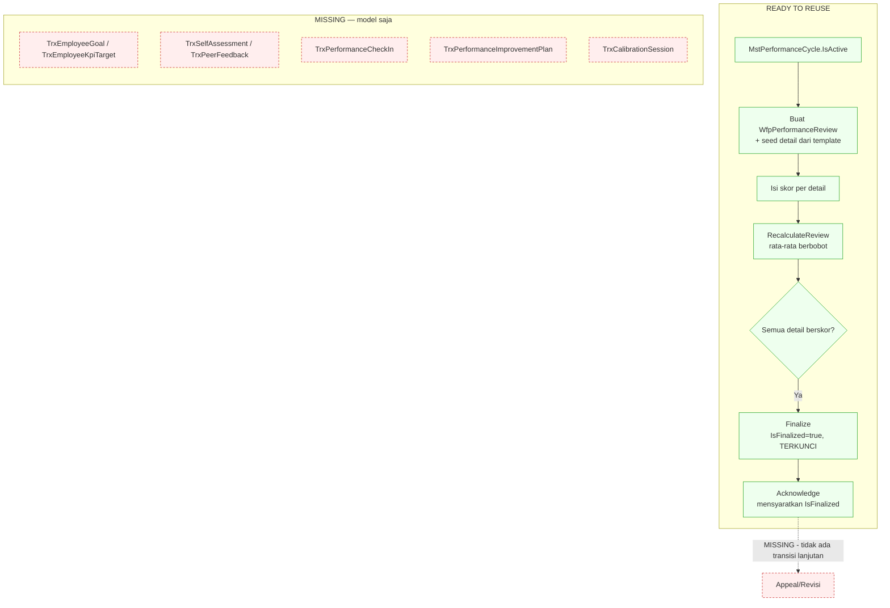

# Flow 13 — Manajemen Kinerja

| Field | Value |
| --- | --- |
| Blueprint ID | `HRD-BP-001` |
| Jenis | Business process flow |
| Slice terkait | `S-C3` |
| Status | `DRAFT` |
| Backend baseline | `origin/QuilvianIntegrationBackend`, diverifikasi `16b8b71` |

---

## 1. Purpose

Mengelola penilaian kinerja pegawai **administratif** — **tegas terpisah dari OPPE/FPPE**
(evaluasi praktik profesional berkelanjutan/terfokus untuk tenaga medis). Audit ulang
mengonfirmasi **nol** model, nol controller, nol baris kode untuk OPPE/FPPE di seluruh repo —
satu-satunya kemunculan adalah di dokumen blueprint, bukan source. OPPE/FPPE tetap `[BLOCKED]`
dan **tidak didesain** di flow ini.

**Temuan paling penting:** dari 11 model, **hanya 2 yang punya controller**
(`WfpPerformanceReview`, `WfpPerformanceReviewDetail`). Sembilan model lain — termasuk seluruh
mekanisme goal/KPI per-pegawai, self-assessment, peer feedback, check-in, PIP, dan kalibrasi —
**model saja, tidak dapat dijangkau API**.

## 2. Actors

| Aktor | Yang dikerjakan | Provenance |
| --- | --- | --- |
| HR/atasan | Membuat dan mengelola review, mengisi skor detail | `[EXISTING]` |
| Pegawai | Mengakui (`Acknowledge`) review yang sudah final | `[EXISTING]` |
| `ReviewerUserId`/`ManagerUserId` | Ditentukan **langsung oleh pemanggil API**, bukan mesin approval | `[EXISTING]` |

## 3. Trigger

| Pemicu | Provenance |
| --- | --- |
| Siklus penilaian dibuka (`MstPerformanceCycle`) | `[EXISTING]` — status vocabulary ada, lihat bagian 9 |
| HR/atasan membuat review untuk satu pegawai pada satu siklus | `[EXISTING]` |

## 4. Preconditions

`MstPerformanceCycle.IsActive = true`. **Bukan** `CycleStatus`-nya — `Validate` pada
`WfpPerformanceReviewController.cs` baris 351 hanya memeriksa `IsActive`, tidak pernah memeriksa
`CycleStatus`. `[EXISTING]`

## 5. Happy Path

1. HR/atasan membuat `WfpPerformanceReview` untuk satu pegawai pada satu siklus aktif. Detail
   (`WfpPerformanceReviewDetail`) di-seed dari template/katalog KPI (`SeedDetailsFromTemplate`,
   baris 357–366). `[EXISTING]`
2. Skor diisi manual per detail (`Score`/`FinalScore`, desimal bebas — `RatingScaleId` ada
   sebagai FK tapi **tidak pernah dipakai memvalidasi** nilai skor). `[EXISTING]`
3. `RecalculateReview` (baris 283–296) menghitung ulang `OverallScore` sebagai rata-rata
   berbobot setiap kali detail berubah — **agregasi nyata**, bukan sekadar label. `[EXISTING]`
4. `Finalize` (baris 231–256) mensyaratkan setiap detail aktif sudah berisi skor, lalu
   menghitung ulang sekali lagi dan mengunci `IsFinalized = true`. Setelah itu, `Update`/
   `Status`/`Delete` pada review dan detail **ditolak**. `[EXISTING]` — guard nyata, bukan flag
   kosmetik.
5. Pegawai `Acknowledge` — **mensyaratkan `IsFinalized == true` lebih dulu** (baris 258–274),
   baru men-set `IsAcknowledged`/`AcknowledgedAt`/status `Acknowledged`. **Ini gate yang benar-
   benar ditegakkan**, berbeda dari pola `Acknowledged` pada flow 03 yang terbukti tidak
   digerbangi. `[EXISTING]`

## 6. Alternative Flow

| Keadaan | Yang terjadi | Provenance |
| --- | --- | --- |
| Siklus performa (`TrxPerformanceCycle`, transaksional) | Ada sebagai model, **tidak ada controller** — hanya `MstPerformanceCycle` (master data) yang operasional | `MISSING` untuk sisi transaksional |
| Goal/KPI per-pegawai yang dilacak berkelanjutan | `TrxEmployeeGoal`, `TrxEmployeeKpiTarget` model lengkap (target/aktual/progres) — **nol controller** | `MISSING` |
| Self-assessment, peer feedback, check-in berkala | `TrxSelfAssessment`, `TrxPeerFeedback`, `TrxPerformanceCheckIn` — model saja | `MISSING` |
| Performance Improvement Plan, kalibrasi | `TrxPerformanceImprovementPlan`, `TrxCalibrationSession` — model saja | `MISSING` |

## 7. Exception Flow

| Keadaan | Yang terjadi | Provenance |
| --- | --- | --- |
| Siklus ditutup lalu dibuka lagi, atau lompat status sembarang | `PerformanceCycleController.cs` baris 216–234 (`PATCH {id}/status`) menerima **nilai apa pun** dalam enum tanpa pemeriksaan urutan — tidak ada guard `Closed` tidak boleh kembali ke `Draft` | `[EXISTING]` — **CycleStatus adalah label, bukan state machine yang ditegakkan** |
| Review yang sudah final ingin direvisi/dibantah pegawai | **Tidak ada.** Satu-satunya transisi setelah `IsFinalized` adalah `Acknowledge`; tidak ada "reopen"/"revise"/"reject"/"appeal" | `MISSING` |
| Riwayat perubahan skor sebelum final | **Tidak ada versioning** — edit menimpa nilai lama, hanya menyisakan satu stempel `UpdateBy`/`UpdateDateTime` terakhir | `MISSING` |

## 8. Approval

**Bukan mesin workflow generik** — sama seperti flow 12. `ReviewerUserId`/`ManagerUserId` adalah
GUID yang dikirim langsung oleh pemanggil API (`WfpPerformanceReviewController.cs` baris
161–162), **tanpa validasi** terhadap hierarki organisasi atau approval matrix. `[EXISTING]` —
dicatat sebagai penyimpangan pola yang sama dengan `HRD-Q-53` (flow 12), bukan diperbaiki diam-
diam di sini.

**Yang benar-benar tergerbangi:** `Finalize` (mensyaratkan seluruh detail terisi skor) dan
`Acknowledge` (mensyaratkan `IsFinalized`). Keduanya nyata, berbeda dari penunjukan reviewer yang
tidak divalidasi.

## 9. State Transition

### 9.1 Siklus — `MstPerformanceCycle.CycleStatus`

State vocabulary: `Draft`, `Open`, `GoalSetting`, `MidReview`, `FinalReview`, `Calibration`,
`Completed`, `Closed`, `Cancelled`. `[EXISTING]`. **Transition edge: TIDAK ADA guard urutan** —
`PATCH status` menerima nilai apa pun. Satu-satunya pemeriksaan nyata di jalur review adalah
`IsActive` (boolean terpisah), bukan `CycleStatus`.

### 9.2 Review — `WfpPerformanceReview`

| Dari | Ke | Transition edge — evidence |
| --- | --- | --- |
| (skor belum lengkap) | `IsFinalized = true` | `[EXISTING]` — `Finalize` baris 231–256, mensyaratkan semua detail berskor |
| `IsFinalized = true` | (terkunci) | `[EXISTING]` — `Update`/`Status`/`Delete` ditolak pada review dan detail |
| `IsFinalized = true` | `IsAcknowledged = true` | `[EXISTING]` — `Acknowledge` baris 258–274, mensyaratkan `IsFinalized` lebih dulu |
| `IsAcknowledged = true` | (mana pun) | **`[OPEN]`/`MISSING`** — tidak ada transisi lanjutan yang ditemukan |

## 10. Data Created/Updated

| Data | Entity | Prefix | Backend capability |
| --- | --- | --- | --- |
| Review kinerja | `WfpPerformanceReview` | `Wfp` | `READY TO REUSE` |
| Detail review (KPI/kompetensi/perilaku/goal) | `WfpPerformanceReviewDetail` | `Wfp` | `READY TO REUSE` |
| Siklus (master) | `MstPerformanceCycle` | `Mst` | `READY TO REUSE` |
| Siklus (transaksional), goal, KPI target, self-assessment, peer feedback, check-in, PIP, kalibrasi | `TrxPerformanceCycle`, `TrxEmployeeGoal`, `TrxEmployeeKpiTarget`, `TrxManagerAssessment`, `TrxSelfAssessment`, `TrxPeerFeedback`, `TrxPerformanceCheckIn`, `TrxPerformanceImprovementPlan`, `TrxCalibrationSession` | `Trx` | **`MISSING`** — schema lengkap, nol API |

## 11. Backend Capability

| Kemampuan | Endpoint | Status |
| --- | --- | --- |
| Review dan detail | `WfpPerformanceReviewController`, `WfpPerformanceReviewDetailController` | `READY TO REUSE` `[EXISTING]` |
| Master data siklus/skala/template/katalog KPI | `PerformanceCycleController`, dsb. | `READY TO REUSE` `[EXISTING]` |
| Goal/KPI per-pegawai berkelanjutan | Tidak ada | `MISSING` |
| Self-assessment, peer feedback, check-in, PIP, kalibrasi | Tidak ada | `MISSING` |
| Appeal/revisi pasca-final | Tidak ada | `MISSING` |
| Riwayat versi skor | Tidak ada | `MISSING` |

## 12. Frontend Capability

| Kemampuan | Lokasi | Status |
| --- | --- | --- |
| Master data (siklus, skala, template, katalog KPI) | `src/app/hr/master-data/{performance-cycle,performance-rating-scale,performance-template,kpi-catalog}/**` | `READY TO REUSE` `[EXISTING]` |
| Transaksi review (mengisi, melihat, mengakui) | Tidak ada | `MISSING` — nol kecocokan `performance-reviews`/`WfpPerformanceReview` di frontend |

## 13. Integration Boundary

| Batas | Keterangan | Provenance |
| --- | --- | --- |
| Manajemen kinerja administratif ↔ OPPE/FPPE | **Tidak ada apa pun untuk OPPE/FPPE di source** — dikonfirmasi ulang, nol model/controller/kode. Jangan mendesain OPPE/FPPE sebagai varian flow ini | `[BLOCKED]` |
| Skor kinerja ↔ kredensial klinis | Tidak direferensikan sama sekali | `[BLOCKED]` — di luar cakupan |

## 14. Audit Requirement

| Kebutuhan | Provenance |
| --- | --- |
| Review final tidak dapat diubah diam-diam | `[EXISTING]` — guard `IsFinalized` |
| Acknowledge menyimpan waktu dan mensyaratkan final lebih dulu | `[EXISTING]` |
| Riwayat revisi skor sebelum final | `MISSING` |

## 15. Blocking Decision

| ID | Isi | Dampak |
| --- | --- | --- |
| `HRD-Q-53` | Lihat flow 12 — penyimpangan dari mesin workflow generik berlaku juga di sini untuk penunjukan reviewer | Memblokir keputusan arsitektur approval |
| `HRD-Q-06` | Metode appraisal, bobot KPI, skala penilaian rumah sakit ini | Nilai master data |

## 16. Acceptance Criteria

| ID | Kriteria | Cara menguji |
| --- | --- | --- |
| `AC-F13-01` | Review final tidak dapat diedit | Finalize review, coba ubah skor detail; ditolak |
| `AC-F13-02` | Acknowledge mensyaratkan final lebih dulu | Coba acknowledge review yang belum final; ditolak |
| `AC-F13-03` | `CycleStatus` tidak menjaga urutan — dokumentasikan sebagai batasan, bukan bug tersembunyi | Set `CycleStatus` dari `Closed` langsung ke `Draft`; diterima tanpa penolakan |
| `AC-F13-04` | `ReviewerUserId` tidak divalidasi terhadap hierarki organisasi | Buat review dengan `ReviewerUserId` sembarang GUID milik user manapun; diterima tanpa pemeriksaan jabatan |

## 17. Diagram

