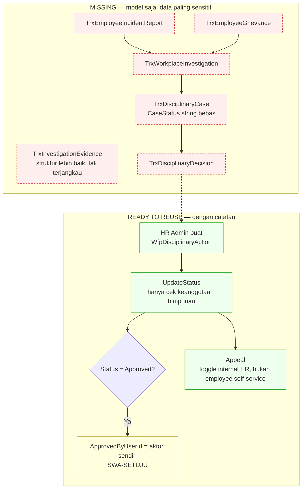

# Flow 14 — Hubungan Karyawan dan Kedisiplinan

| Field | Value |
| --- | --- |
| Blueprint ID | `HRD-BP-001` |
| Jenis | Business process flow |
| Slice terkait | `S-C5` |
| Status | `DRAFT` |
| Backend baseline | `origin/QuilvianIntegrationBackend`, diverifikasi `16b8b71` |

---

## 1. Purpose

Mengelola kasus kedisiplinan pegawai — domain yang memuat **data paling sensitif** di seluruh
modul HR administratif. **Temuan paling penting:** dari 8 model, **hanya 1 yang punya
controller** (`WfpDisciplinaryAction` — hasil/sanksi, bukan kasusnya sendiri). Kasus, keputusan,
investigasi, bukti, keluhan, dan laporan insiden **seluruhnya model saja**. Yang lebih penting
lagi: meski setiap entity ditandai `IsConfidential`/`AccessClassification = "HighlyRestricted"`/
`RequiresEnhancedAudit`, **tidak ada satu pun penegakan izin yang berbeda dari data HR biasa.**

## 2. Actors

| Aktor | Yang dikerjakan | Provenance |
| --- | --- | --- |
| HR Admin (pemegang permission `WorkforceDisciplinaryAction`) | Membuat, mengubah, menyetujui, dan mengajukan banding atas tindakan disiplin — **dengan permission yang sama untuk keempatnya** | `[EXISTING]` |
| Pegawai | Tidak ada jalur layanan mandiri untuk mengajukan keluhan/insiden | `[OPEN]`/`MISSING` |

## 3. Trigger

| Pemicu | Provenance |
| --- | --- |
| Tindakan disiplin dibuat langsung oleh HR Admin | `[EXISTING]` — `WfpDisciplinaryActionController` |
| Laporan insiden, keluhan, kasus, investigasi | `[OPEN]`/`MISSING` — model ada, tidak ada jalur nyata |

## 4. Preconditions

Master data taksonomi (jenis pelanggaran, jenis sanksi, jenis tindakan disiplin, jenis kasus)
sudah terisi. `[EXISTING]` — empat controller master data terkonfirmasi hidup.

## 5. Happy Path — yang benar-benar ada

1. HR Admin membuat `WfpDisciplinaryAction` langsung — **tidak melalui kasus, keputusan, atau
   investigasi apa pun**, karena ketiganya tidak punya controller. `[EXISTING]`
2. Status diubah lewat `UpdateStatus`, dijaga `AllowedStatuses` HashSet hardcode
   (`WfpDisciplinaryActionController.cs` baris 30–33, dipakai baris 322) — **hanya memeriksa
   keanggotaan himpunan**, bukan urutan transisi yang sah (nilai apa pun ke nilai lain yang sama-
   sama ada di himpunan diterima). `[EXISTING]`
3. **Persetujuan adalah swa-setuju.** Baris 329–330: bila `ActionStatus == "Approved"`, sistem
   men-set `ApprovedByUserId = GetCurrentUserId()` — **aktor yang sama yang mengubah status
   dicatat sebagai penyetujunya sendiri**, tidak ada pemisahan pembuat/penyetuju. `[EXISTING]` —
   temuan paling penting bagian ini.
4. Banding dapat diajukan lewat `PATCH .../appeal` (baris 361–387) oleh pemegang permission
   `Update` yang sama — **bukan jalur khusus pegawai**, melainkan toggle internal HR sendiri.
   `[EXISTING]`

## 6. Alternative Flow

| Keadaan | Yang terjadi | Provenance |
| --- | --- | --- |
| Kasus kedisiplinan formal (`TrxDisciplinaryCase`) | `CaseStatus` adalah string bebas, default `"Draft"`, **tidak ada enum, tidak ada whitelist, tidak ada controller** | `MISSING` sepenuhnya |
| Keputusan formal (`TrxDisciplinaryDecision`) | `DecisionType`/`DecisionStatus` bebas teks, **tidak ada controller** | `MISSING` |
| Investigasi (`TrxWorkplaceInvestigation`) | `LeadInvestigatorUserId`, `InvestigationStatus` (default `"Open"`), `FindingsRestricted`/`RecommendationRestricted` — model lengkap, **tidak ada controller** | `MISSING` |
| Bukti investigasi (`TrxInvestigationEvidence`) | **Struktur lebih baik** dari koreksi kehadiran — tabel satu-ke-banyak sungguhan dengan `FilePath`/`FileName`/`FileContentType`/`FileChecksum` per baris, plus rantai penyimpanan (chain-of-custody) — tapi **tidak ada controller**, tidak terjangkau | `MISSING` |
| Laporan insiden (`TrxEmployeeIncidentReport`), keluhan (`TrxEmployeeGrievance`) | Model ada, termasuk opsi anonim pada laporan insiden — **tidak ada controller** | `MISSING` |
| Kasus ditutup tanpa sanksi | Skema mendukung (`ActionStatus` punya `Rejected`/`Cancelled`, `DecisionType` bebas teks) tapi **tidak dapat dijangkau** karena kasus/keputusan tidak punya controller — kapabilitas schema, bukan perilaku yang berjalan | `MISSING` |

## 7. Exception Flow

| Keadaan | Yang terjadi | Provenance |
| --- | --- | --- |
| Enum resmi `DisciplinaryActionStatus` (`Draft`/`Issued`/`Acknowledged`/`UnderReview`/`Resolved`/`Cancelled`/`Expired`) ada di source | **Dead code** — tidak pernah dirujuk controller, yang dipakai adalah himpunan string terpisah dan berbeda pada `WfpDisciplinaryActionController` | `[EXISTING]` — temuan konsistensi internal, dicatat `HRD-Q-52` bersama isu izin |
| Masa berlaku sanksi (`EffectiveStartDate`/`EffectiveEndDate`) lewat | **Tidak ada penegakan** — tidak ada job, tidak ada pemeriksaan baca-waktu yang membandingkan dengan tanggal sekarang | `MISSING` |
| Data kasus sensitif dibaca pihak yang tidak semestinya | **Tidak ada perlindungan tambahan** — `[AccessPermission("WorkforceDisciplinaryAction", "Read")]` yang sama dengan pola generik data HR lain mengembalikan `ConfidentialNotes`/`DecisionSummary` secara penuh, tanpa redaksi field maupun tingkatan izin terpisah, meski model menandai `IsConfidential`/`HighlyRestricted` | `[EXISTING]` — kesenjangan izin nyata, `HRD-Q-52` |

## 8. Approval

**Tidak ada mesin workflow generik** — nol rujukan `WorkflowService` di seluruh domain ini,
meski `WorkflowDefinitionId` ada sebagai FK pada model (tidak pernah di-resolve/dipanggil).
"Persetujuan" adalah **flip status swa-layan** oleh siapa pun pemegang permission `Update` —
termasuk menyetujui tindakannya sendiri. `[EXISTING]` — ini bukan `Larangan kalimat umum
"atasan menyetujui"` yang dipertahankan dari `PHASE 2A.1`; di sini justru **tidak ada** pemisahan
pembuat/penyetuju sama sekali, sebuah temuan yang lebih tajam dari sekadar "otoritas belum
terverifikasi".

## 9. State Transition

### 9.1 Tindakan disiplin — `WfpDisciplinaryAction.ActionStatus`

State vocabulary: himpunan string hardcode pada controller (bukan enum resmi — lihat bagian 7).
`[EXISTING]`. Transition edge: **hanya keanggotaan himpunan diperiksa** (`AllowedStatuses.
Contains`), **bukan** urutan transisi yang sah — status apa pun dalam himpunan dapat berpindah
ke status lain dalam himpunan yang sama tanpa guard urutan. `[EXISTING]` — ini transisi
"lemah", didokumentasikan apa adanya, bukan diasumsikan sebagai state machine penuh.

### 9.2 Kasus, keputusan, investigasi

State vocabulary `[EXISTING]` pada model masing-masing (`TrxDisciplinaryCase.CaseStatus` string
bebas tanpa whitelist sama sekali — bahkan lebih lemah dari 9.1). **Transition edge: TIDAK ADA**
untuk ketiganya — tidak ada controller.

## 10. Data Created/Updated

| Data | Entity | Prefix | Backend capability |
| --- | --- | --- | --- |
| Tindakan disiplin | `WfpDisciplinaryAction` | `Wfp` | `READY TO REUSE` (dengan catatan swa-setuju, bagian 5) |
| Kasus kedisiplinan | `TrxDisciplinaryCase` | `Trx` | **`MISSING`** |
| Keputusan | `TrxDisciplinaryDecision` | `Trx` | **`MISSING`** |
| Investigasi | `TrxWorkplaceInvestigation` | `Trx` | **`MISSING`** |
| Bukti investigasi | `TrxInvestigationEvidence` | `Trx` | **`MISSING`** — struktur lebih baik dari flow 07, tidak terjangkau |
| Keluhan | `TrxEmployeeGrievance` | `Trx` | **`MISSING`** |
| Laporan insiden | `TrxEmployeeIncidentReport` | `Trx` | **`MISSING`** |
| Penghargaan pegawai (tidak berhubungan dengan disiplin) | `HrdEmployeeRecognition` | `Hrd` | `[OPEN]`/`UNVERIFIED` — status controller belum diverifikasi penuh, di luar fokus kedisiplinan |
| Master data taksonomi | Jenis pelanggaran, sanksi, tindakan disiplin, kasus | `Mst` | `READY TO REUSE` |

Seluruh entity `Trx*` di atas mengikuti `HRD-DEC-019`: tidak diratchet kecuali materially touched
saat kapabilitasnya dibangun.

## 11. Backend Capability

| Kemampuan | Endpoint | Status |
| --- | --- | --- |
| Tindakan disiplin | `WfpDisciplinaryActionController` | `READY TO REUSE` `[EXISTING]`, dengan catatan swa-setuju |
| Master data taksonomi | `DisciplinaryActionTypeController`, `EmployeeRelationCaseTypeController`, `SanctionTypeController`, `ViolationTypeController` | `READY TO REUSE` `[EXISTING]` |
| Kasus, keputusan, investigasi, bukti, keluhan, laporan insiden | Tidak ada | `MISSING` sepenuhnya |
| Pemisahan pembuat/penyetuju pada tindakan disiplin | Tidak ada | `MISSING` — `HRD-Q-51` |
| Tingkatan izin baca untuk data sensitif | Tidak ada | `MISSING` — `HRD-Q-52` |

## 12. Frontend Capability

| Kemampuan | Lokasi | Status |
| --- | --- | --- |
| Master data taksonomi | `src/app/hr/master-data/{violation-type,sanction-type,disciplinary-action-type,employee-relation-case-type}/**` | `READY TO REUSE` `[EXISTING]` |
| Transaksi (kasus, tindakan, investigasi, keluhan, laporan) | Tidak ada | `MISSING` — hanya menu yang menunjuk ke master data, bukan transaksi |

## 13. Integration Boundary

Tidak ada batas ke domain lain yang terbukti dari source pada pass ini — domain ini beroperasi
mandiri sejauh yang diimplementasikan.

## 14. Audit Requirement

| Kebutuhan | Provenance |
| --- | --- |
| `RequiresEnhancedAudit`/`IsConfidential` tercantum pada model | `[EXISTING]` sebagai field — **tidak terbukti** ada mekanisme audit yang benar-benar diperkuat dibanding data HR biasa | `[OPEN]`/`MISSING` |
| Pemisahan pembuat dan penyetuju tindakan disiplin | **`MISSING`** — dibuktikan tegas, bukan diasumsikan | `HRD-Q-51` |
| Tingkatan akses baca untuk field sensitif (`ConfidentialNotes`, dsb.) | **`MISSING`** | `HRD-Q-52` |

## 15. Blocking Decision

| ID | Isi | Dampak |
| --- | --- | --- |
| `HRD-Q-51` | **Baru.** `WfpDisciplinaryActionController` mengizinkan aktor yang mengubah status ke `Approved` tercatat sebagai penyetujunya sendiri (`ApprovedByUserId = GetCurrentUserId()`), tanpa pemisahan pembuat/penyetuju. Apakah ini perilaku yang dapat diterima untuk mekanisme hari ini, atau perlu pemisahan peran tegas sebelum kapabilitas ini diperluas? | Memblokir keputusan keamanan proses sebelum flow 14 dirancang lebih jauh |
| `HRD-Q-52` | **Baru.** Data kedisiplinan ditandai `IsConfidential`/`HighlyRestricted`/`RequiresEnhancedAudit` pada model, tetapi diakses lewat permission generik yang sama dengan data HR biasa, tanpa redaksi field atau tingkatan baca terpisah. Apakah tingkatan izin khusus perlu dibangun sebelum kapabilitas kasus/investigasi/keluhan diimplementasikan? | Memblokir desain akses data sensitif domain ini |

## 16. Acceptance Criteria

| ID | Kriteria | Cara menguji |
| --- | --- | --- |
| `AC-F14-01` | Tindakan disiplin saat ini dapat disetujui oleh pembuatnya sendiri — dokumentasikan sebagai temuan, bukan perilaku yang diharapkan tanpa keputusan | Buat tindakan disiplin, lalu set statusnya sendiri ke `Approved` dengan akun yang sama; berhasil — ini kriteria yang **harus gagal** setelah `HRD-Q-51` dijawab dan diimplementasikan |
| `AC-F14-02` | Data sensitif tidak dilindungi tingkatan izin khusus hari ini | Baca detail tindakan disiplin dengan permission `Read` generik; `ConfidentialNotes` ikut kembali tanpa redaksi — kriteria dokumentasi, bukan target akhir |
| `AC-F14-03` | Kasus/investigasi/keluhan tidak diklaim sebagai kapabilitas yang berjalan | Panggil endpoint mana pun untuk keenam entity model-only; tidak ditemukan |

## 17. Diagram

