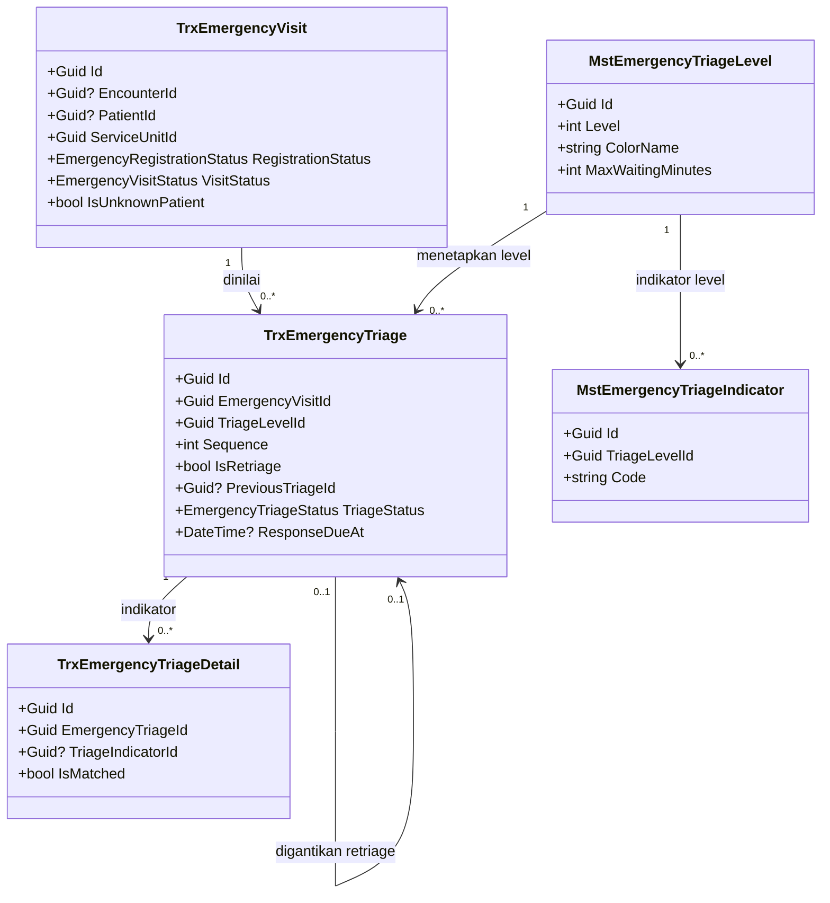
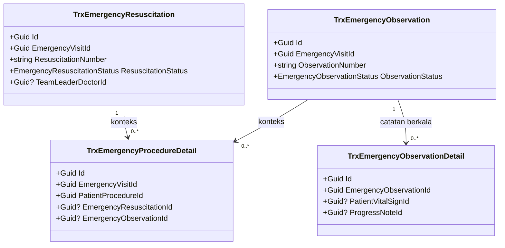
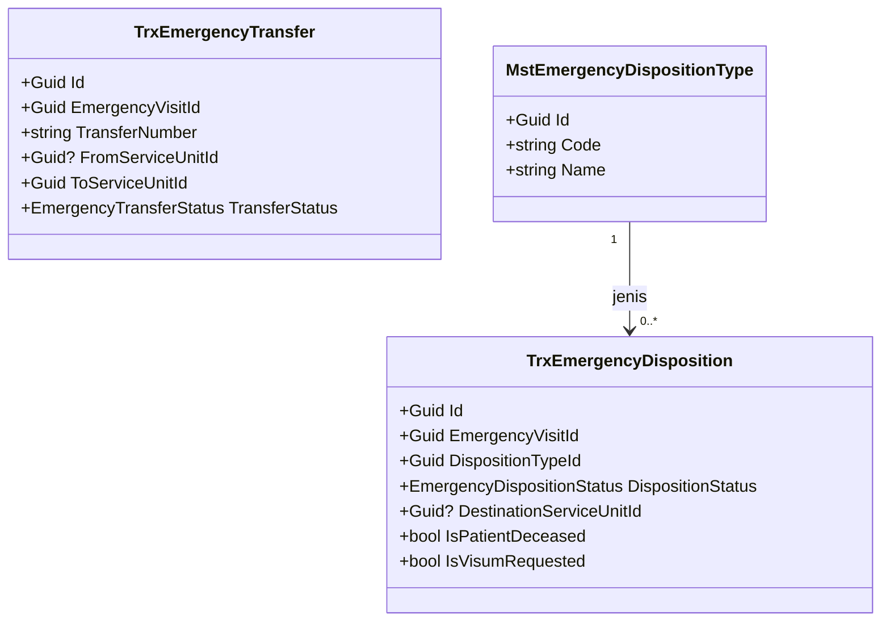

# Arsitektur Backend — Modul IGD

| Field | Nilai |
| --- | --- |
| Blueprint | `IGD-BP-001` revision `4` |
| Status | `approved` — disetujui Product/Domain Owner 14 Agustus 2026 sesuai `IGD-DEC-046`; gate klinis dan security/privacy tetap berlaku sebagai syarat go-live |
| Commit diaudit | backend `e5331a0`, frontend `08c84d371` |
| Keputusan yang mengikat | `IGD-DEC-046` sampai `IGD-DEC-050` |
| Aturan folder | [backend-structure-rules.md](../../../.claude/skills/design-business-module/references/backend-structure-rules.md) |

Modul IGD menyimpan proses yang benar-benar khusus kegawatdaruratan. Data klinis yang dipakai
lintas pelayanan tetap dimiliki modul pusat agar tidak terjadi duplikasi antara Rawat Jalan,
IGD, dan Rawat Inap.

Seluruh tabel mewarisi `IdentityModel`, sehingga memiliki sepuluh kolom audit yang tidak
diulang pada dokumen ini: `CreateDateTime`, `CreateBy`, `UpdateDateTime`, `UpdateBy`,
`DeleteDateTime`, `DeleteBy`, `CancelDateTime`, `CancelBy`, `IsCancel`, dan `IsDelete`.
Penghapusan bersifat penandaan, bukan penghapusan baris.

---

## 1. Kepemilikan data

Tabel ini adalah pertahanan paling langsung terhadap duplikasi entitas.

| Kelompok data | Modul pemilik | Dipakai IGD | Dibuat ulang di IGD |
| --- | --- | :---: | --- |
| Pasien dan identitas | Patient Management | Ya | Tidak |
| Encounter atau episode pelayanan | Registration Management | Ya | Tidak |
| Assessment, SOAP, diagnosis, tindakan, CPPT, tanda vital | Clinical Management | Ya | Tidak |
| Resep dan obat | Pharmacy Management | Ya | Tidak |
| Unit pelayanan, ruangan, dan bed | Master Data | Ya | Tidak |
| Billing dan penjaminan | Billing Management | Ya | Tidak |
| Triage, resusitasi, observasi, disposition, transfer | Emergency Installation | Ya | **Ya, karena khusus IGD** |
| Approval bertingkat, maker-checker, delegasi | Workflow Management | Ya | **Tidak** — engine generik lewat `ReferenceType`/`ReferenceId` |

Penghubung ke seluruh data klinis adalah `EncounterId`. Konteks IGD dibedakan melalui
`ServiceUnitId` dan asal kunjungan, bukan melalui penyalinan entitas.

---

## 2. Class diagram

Diagram dipecah per konteks agar setiap gambar muat dibaca dalam satu layar.

### 2.1 Kunjungan dan triage



### 2.2 Resusitasi, observasi, dan tindakan



### 2.3 Disposition dan transfer



---

## 3. Penjelasan class

### 3.1 Model transaksi

Seluruhnya berstatus **Sudah ada** kecuali disebutkan lain. Lokasi:
`Areas/HealthServices/EmergencyInstallationManagement/Models/`.

#### TrxEmergencyVisit

| Aspek | Penjelasan |
| --- | --- |
| Status | `Sudah ada` |
| Lokasi file | `Areas/HealthServices/EmergencyInstallationManagement/Models/TrxEmergencyVisit.cs` |
| Kategori | Transaksi IGD, header seluruh proses |
| Tanggung jawab utama | Menjadi induk seluruh aktivitas pasien selama di IGD dan menghubungkannya ke encounter pusat |
| Field penting | `EmergencyVisitNumber`, `EncounterId`, `PatientId`, `ServiceUnitId`, `ArrivalModeId`, `CaseTypeId`, `IsUnknownPatient`, `IsImmediateCareAllowed`, `RegistrationStatus`, `VisitStatus`, `VisitCompletedAt` |
| Relasi | Menunjuk encounter, pasien, unit pelayanan, cara kedatangan, jenis kasus; memiliki banyak triage, resusitasi, observasi, procedure detail, disposition, dan transfer |
| Pemakaian dalam alur bisnis | Dibuat saat pasien tiba. Untuk pasien gawat, dapat dibuat bersama encounter provisional agar pelayanan dimulai sebelum administrasi lengkap |
| Catatan desain | `IsUnknownPatient` dan `IsImmediateCareAllowed` adalah jalur keselamatan; jangan menjadikannya syarat administratif |
| Ekuivalen model lama | `IGDPasienDetail` |

#### TrxEmergencyTriage

| Aspek | Penjelasan |
| --- | --- |
| Status | **`Diperbarui`** |
| Lokasi file | `Areas/HealthServices/EmergencyInstallationManagement/Models/TrxEmergencyTriage.cs` |
| Kategori | Transaksi IGD |
| Tanggung jawab utama | Menyimpan satu episode penilaian triage. Penilaian ulang membuat baris baru dan tidak menimpa baris lama |
| Field penting | `EmergencyVisitId`, `TriageLevelId`, `Sequence`, `IsRetriage`, `PreviousTriageId`, `TriageStatus`, `MaxWaitingMinutesSnapshot`, `ResponseDueAt`, `PerformedByUserId` |
| Perubahan pada revisi ini | Tambah `IsSlaBreached` dan `SlaBreachedAt` untuk deteksi pelampauan target respons |
| Relasi | Milik `TrxEmergencyVisit`; menunjuk `MstEmergencyTriageLevel`; menunjuk dirinya sendiri lewat `PreviousTriageId`; memiliki banyak `TrxEmergencyTriageDetail` |
| Pemakaian dalam alur bisnis | Dibuat perawat saat penilaian pertama dan setiap penilaian ulang |
| Catatan desain | `ResponseDueAt` sudah dihitung di server dari `MaxWaitingMinutes` master. Jangan menghitungnya di frontend dan jangan meng-hardcode target waktu |
| Ekuivalen model lama | `IGDTriage` |

#### Model transaksi lainnya

| Model | Status | Tanggung jawab | Ekuivalen lama |
| --- | --- | --- | --- |
| `TrxEmergencyTriageDetail` | Sudah ada | Indikator klinis yang dipilih pada satu triage beserta snapshot master | `IGDTriageDetail` |
| `TrxEmergencyResuscitation` | Sudah ada | Konteks episode resusitasi; tindakan medis aktual tetap pada `TrxPatientProcedure` | Pemisahan baru |
| `TrxEmergencyObservation` | Sudah ada | Header satu periode observasi | `IGDObservasi` |
| `TrxEmergencyObservationDetail` | Sudah ada | Catatan kronologis observasi; tanda vital dan CPPT hanya direferensikan | `IGDObservasiDetail` |
| `TrxEmergencyProcedureDetail` | Sudah ada | Atribut khusus IGD untuk tindakan klinis umum | `IGDTindakanDetail` |
| `TrxEmergencyDisposition` | Sudah ada | Keputusan klinis akhir setelah pelayanan IGD | `IGDTindakLanjut` |
| `TrxEmergencyTransfer` | Sudah ada | Proses operasional perpindahan pasien | `PindahRuangan` |

### 3.2 Model master

Lokasi: `Areas/HealthServices/MasterData/Models/`. Seluruhnya berstatus `Sudah ada`.

| Model | Field penting | Catatan desain |
| --- | --- | --- |
| `MstEmergencyTriageLevel` | `Level`, `Code`, `Name`, `ColorName`, `ColorHex`, `MaxWaitingMinutes` | Warna dan target waktu **wajib** dari master, tidak boleh di-hardcode di controller maupun frontend |
| `MstEmergencyTriageIndicator` | `TriageLevelId`, `Code`, `Name`, `IndicatorGroup` | Dipakai sebagai checklist saat triage |
| `MstEmergencyArrivalMode` | `Code`, `Name`, `IsAmbulance`, `IsReferral` | Dasar pelaporan pasien rujukan dan penggunaan ambulans |
| `MstEmergencyCaseType` | `Code`, `Name` | Klasifikasi trauma, non-trauma, kecelakaan, dan sejenisnya |
| `MstEmergencyDispositionType` | `Code`, `Name` | Menentukan apakah disposition memerlukan unit tujuan atau fasilitas rujukan |
| `MstEmergencySetting` | `DefaultEmergencyServiceUnitId`, `IsDefault` | Hanya satu setting boleh berstatus default; divalidasi `EmergencySettingService` |

### 3.3 Service

Lokasi: `Areas/HealthServices/EmergencyInstallationManagement/Services/`. Tanpa interface,
didaftarkan `AddScoped<TService>()`.

| Service | Status | Fungsi utama | Dipanggil oleh |
| --- | --- | --- | --- |
| `EmergencyVisitService` | Sudah ada | Pembuatan kunjungan, registrasi provisional, pasien tidak dikenal | `EmergencyVisitController` |
| `EmergencyTriageService` | **Diperbarui** | Validasi level, retriage, snapshot master, deadline respons. Ditambah penetapan penanda breach | `EmergencyTriageController` |
| `EmergencyResuscitationService` | Sudah ada | Mulai dan akhiri resusitasi | `EmergencyResuscitationController` |
| `EmergencyObservationService` | Sudah ada | Mulai, akhiri, dan eskalasi observasi | `EmergencyObservationController` |
| `EmergencyDispositionService` | **Diperbarui** | Validasi tujuan dan rujukan. Ditambah transisi `Disposed` ke `Completed` | `EmergencyDispositionController` |
| `EmergencyTransferService` | Sudah ada | Transisi status transfer | `EmergencyTransferController` |
| `EmergencyDocumentNumberService` | Sudah ada | Pembentukan nomor kunjungan, observasi, resusitasi, transfer | Service workflow lain |
| `EmergencyTriageSlaMonitorHostedService` | **Baru** | Memantau `ResponseDueAt` yang terlampaui dan menandai breach | Dijalankan terjadwal, bukan dipanggil controller |

### 3.4 Controller

Lokasi: `Areas/HealthServices/EmergencyInstallationManagement/Controller/` — perhatikan
bentuk tunggal, yang merupakan utang teknis; lihat bagian 4.

| Controller | Endpoint | Resource permission | Status |
| --- | ---: | --- | --- |
| `EmergencyVisitController` | 7 | `EmergencyVisit` | Sudah ada |
| `EmergencyTriageController` | 6 | `EmergencyTriage` | **Diperbarui** — tambah aksi retriage dan daftar breach |
| `EmergencyTriageDetailController` | 5 | `EmergencyTriageDetail` | Sudah ada |
| `EmergencyResuscitationController` | 6 | `EmergencyResuscitation` | Sudah ada |
| `EmergencyObservationController` | 6 | `EmergencyObservation` | Sudah ada |
| `EmergencyObservationDetailController` | 5 | `EmergencyObservationDetail` | Sudah ada |
| `EmergencyProcedureDetailController` | 5 | `EmergencyProcedureDetail` | Sudah ada |
| `EmergencyDispositionController` | 6 | `EmergencyDisposition` | **Diperbarui** — tambah aksi penyelesaian kunjungan |
| `EmergencyTransferController` | 6 | `EmergencyTransfer` | Sudah ada |

Total 52 endpoint. Seluruhnya memakai `[ApiController]`, `[Authorize]`, `[AccessController]`,
`[Tags]`, serta `[AccessAction]` dan `[AccessPermission]` per endpoint.

---

## 4. Arsitektur folder

```text
Areas/HealthServices/EmergencyInstallationManagement/
├── Controllers/                          # UTANG TEKNIS: saat ini bernama Controller (tunggal)
│   ├── EmergencyTriageController.cs      # Diperbarui — aksi retriage dan daftar breach
│   ├── EmergencyDispositionController.cs # Diperbarui — aksi penyelesaian kunjungan
│   └── (7 controller lain)               # Sudah ada
├── DTOs/
│   ├── EmergencyTriageDtos.cs            # Diperbarui — RetriageRequest, BreachListResponse
│   └── EmergencyDispositionDtos.cs       # Diperbarui — CompleteVisitRequest
├── Enums/
│   ├── EmergencyVisitStatus.cs           # Diperbarui — tambah nilai Completed
│   └── (8 enum lain)                     # Sudah ada
├── Models/
│   └── TrxEmergencyTriage.cs             # Diperbarui — IsSlaBreached, SlaBreachedAt
└── Services/
    ├── EmergencyTriageService.cs         # Diperbarui
    ├── EmergencyDispositionService.cs    # Diperbarui
    └── EmergencyTriageSlaMonitorHostedService.cs   # Baru

Areas/HealthServices/MasterData/Models/
└── MstEmergency*.cs                      # Sudah ada, 6 file

Repositories/Configurations/HealthService/EmergencyInstallationManagement/
└── TrxEmergencyTriageConfiguration.cs    # Diperbarui — index breach

Migrations/
└── <timestamp>_AddTriageSlaBreachMarker.cs   # Baru
```

### Utang teknis yang tidak diperbaiki pada revisi ini

| Penyimpangan | Keadaan nyata | Pola standar |
| --- | --- | --- |
| Folder controller IGD | `Controller/` tunggal, satu-satunya dari 26 folder | `Controllers/` jamak |
| Nama domain di Configurations | `HealthService/` tunggal | `HealthServices/` jamak |
| Namespace master IGD | Memuat ruas `EmergencyInstallationManagement` tanpa folder padanan | Namespace mengikuti folder |

Sesuai `DEC-RSK-003`: modul baru tidak boleh meniru penyimpangan ini, implementer tidak boleh
merapikannya diam-diam di tengah task lain, dan perapian menjadi task tersendiri di roadmap.

---

## 5. Status model

| Model atau berkas | Status | Perubahan | Dampak migration |
| --- | --- | --- | --- |
| `TrxEmergencyVisit` | Sudah ada | Tidak ada | Tidak ada |
| `TrxEmergencyTriage` | **Diperbarui** | Tambah `IsSlaBreached` (`bool`, bawaan `false`) dan `SlaBreachedAt` (`DateTime?`); index pada `(EmergencyVisitId, ResponseDueAt, IsSlaBreached)` | Menambah dua kolom dan satu index |
| `EmergencyVisitStatus` | **Diperbarui** | Tambah nilai `Completed = 9` setelah `Disposed` | Tidak ada, enum disimpan sebagai integer |
| Tujuh model transaksi lain | Sudah ada | Tidak ada | Tidak ada |
| Enam model master | Sudah ada | Tidak ada perubahan struktur; membutuhkan data awal | Tidak ada |
| `EmergencyTriageSlaMonitorHostedService` | **Baru** | Berkas baru | Tidak ada |
| `AccessPermissionService` | **Diperbarui** | Pemisahan kewenangan SuperAdmin dan penambahan scope resource/unit | Di luar modul IGD; lihat bagian 8 |

Nilai `Completed = 9` dipilih agar tidak menggeser nilai yang sudah tersimpan di basis data.

---

## 6. Rencana migration

| Urutan | Migration | Tanpa mematikan layanan | Pengisian data lama | Cara mundur |
| ---: | --- | :---: | --- | --- |
| 1 | `AddTriageSlaBreachMarker` | Ya | `IsSlaBreached` diisi `false` untuk seluruh baris lama. Tidak menghitung ulang breach historis karena `ResponseDueAt` lama tidak selalu terisi | Hapus dua kolom dan index; belum ada data yang bergantung |

Penambahan nilai enum `Completed` tidak memerlukan migration karena disimpan sebagai integer
dan tidak ada check constraint pada kolom tersebut. Bila kemudian check constraint
ditambahkan, ia harus ikut memuat nilai baru.

Migration tidak boleh diterapkan ke basis data non-lokal tanpa otorisasi eksplisit.

---

## 7. Rencana data master awal

Tanpa data ini modul tidak dapat dipakai sama sekali: tidak ada level triage yang bisa
dipilih, tidak ada cara kedatangan, dan tidak ada jenis disposition.

### 7.1 `MstEmergencyTriageLevel`

Sesuai `IGD-DEC-047` dan `IGD-DEC-048`: skala lima level ATS atau ESI, dengan warna Permenkes
47/2018 sebagai pengelompokan. Hitam adalah kategori di luar skala antrean.

| Level | Kelompok warna | Code | Target waktu tunggu | Catatan |
| ---: | --- | --- | --- | --- |
| 1 | Merah | `L1` | 0 menit, segera | Tidak menunggu administrasi |
| 2 | Merah | `L2` | Menunggu SOP MMC | Masih dalam kelompok Merah |
| 3 | Kuning | `L3` | Menunggu SOP MMC | `TargetUnconfigured` |
| 4 | Hijau | `L4` | Menunggu SOP MMC | `TargetUnconfigured` |
| 5 | Hijau | `L5` | Menunggu SOP MMC | `TargetUnconfigured` |
| — | Hitam | `BLK` | Tidak berlaku | Di luar skala antrean; tidak boleh ditetapkan otomatis oleh aplikasi |

Target waktu untuk level 2 sampai 5 sengaja dibiarkan belum terkonfigurasi sampai SOP MMC
tersedia, sesuai keputusan yang sudah tercatat. Nilai `MaxWaitingMinutes` untuk baris tersebut
tidak boleh ditebak.

### 7.2 Master lainnya

| Master | Isi minimum | Sumber nilai |
| --- | --- | --- |
| `MstEmergencyArrivalMode` | Datang sendiri, diantar keluarga, ambulans, polisi, rujukan | SOP pendaftaran IGD |
| `MstEmergencyCaseType` | Trauma, non-trauma, kecelakaan lalu lintas, kecelakaan kerja, kriminalitas, obstetri, keracunan, bencana | SOP IGD |
| `MstEmergencyDispositionType` | Pulang, rawat inap, pindah ICU atau OK, rujuk, meninggal, menolak perawatan, pulang atas permintaan sendiri | SOP IGD |
| `MstEmergencyTriageIndicator` | Indikator Airway, Breathing, Circulation, Disability, Exposure per level | SOP triase MMC |
| `MstEmergencySetting` | Satu baris default dengan unit IGD yang berlaku | Konfigurasi operasional |

---

## 8. Kebutuhan lintas modul

Tiga kebutuhan berikut berasal dari keputusan IGD tetapi implementasinya berada di luar modul
IGD. Ketiganya tidak boleh dibangun ulang di dalam IGD.

| Kebutuhan | Sumber keputusan | Tempat implementasi | Status |
| --- | --- | --- | --- |
| Scope resource dan unit pada pemeriksaan akses | `IGD-DEC-026` | `Services/Security/AccessPermissionService.cs` | **Missing** — `HasAccessAsync` belum menerima parameter resource |
| Pemisahan kewenangan SuperAdmin antara endpoint teknis dan klinis | `IGD-DEC-050` | `Services/Security/AccessPermissionService.cs` | **Conflict** dengan kode saat ini |
| Break-glass akses darurat yang tercatat dan berbatas waktu | `IGD-DEC-050` | Belum ditentukan; kandidat `Services/Security/` | **Missing** — tidak ada di kode |

Maker-checker, approval bertingkat, dan delegasi sementara **tidak** masuk daftar ini karena
sudah tersedia dan generik pada `Areas/Corporate/HumanResource/WorkflowManagement/`. IGD
memakainya lewat `ReferenceType` dan `ReferenceId`, bukan membangun kerangka baru.

---

## 9. Yang sengaja tidak dibuat

Daftar ini mencegah usulan yang sama muncul kembali di kemudian hari.

| Yang ditolak | Alasan |
| --- | --- |
| `PatientIGD`, `DoctorIGD`, atau salinan master lain | Sudah dimiliki modul masing-masing dan dipakai lewat relasi |
| SOAP, assessment, diagnosis, atau tindakan versi IGD | Sudah ada di Clinical Management dan dipakai lintas pelayanan melalui `EncounterId` |
| Resep, order laboratorium, dan order radiologi versi IGD | Dimiliki modul Pharmacy, Laboratory, dan Radiology |
| Kerangka approval dan delegasi khusus IGD | Sudah tersedia generik di Workflow Management |
| Mekanisme penjadwalan baru untuk pemantau SLA | Sudah ada lima hosted service sebagai pola yang matang |
| Status `Closed` terpisah selain `Completed` | `IGD-DEC-049` hanya memerlukan satu status penyelesaian klinis |
| Penyimpanan warna dan target waktu triage di kode | Wajib dari master agar kebijakan dapat berubah tanpa mengubah source |
