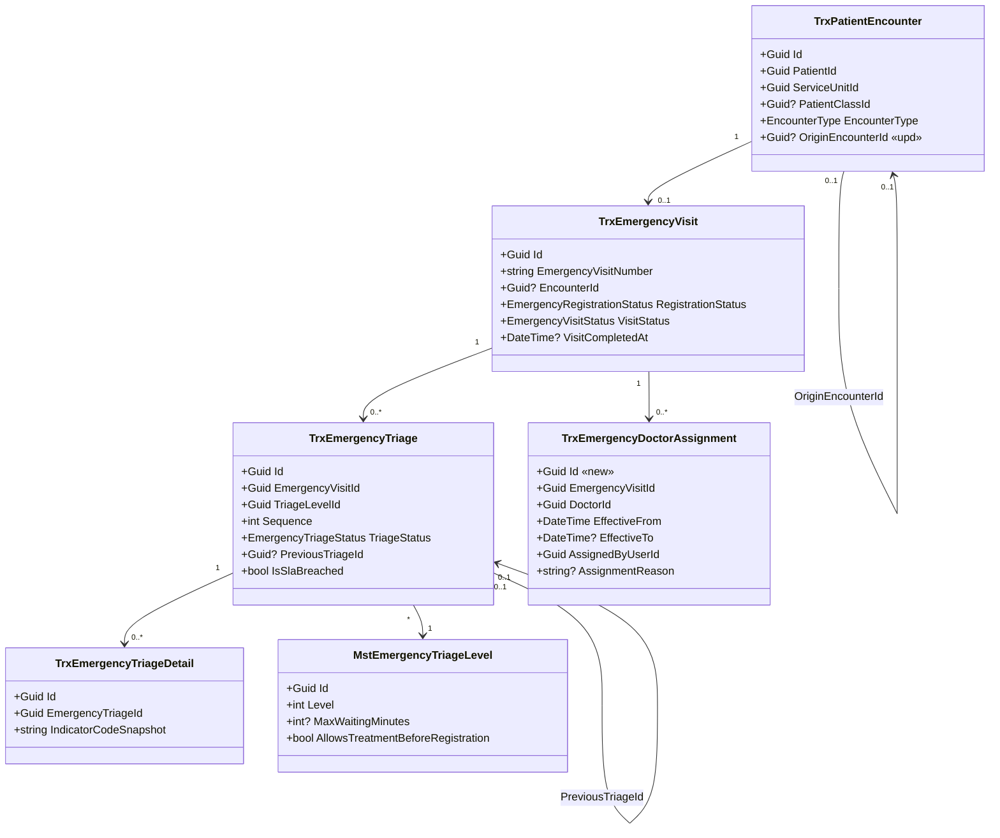
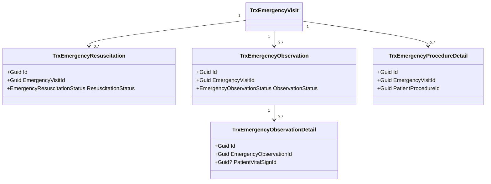
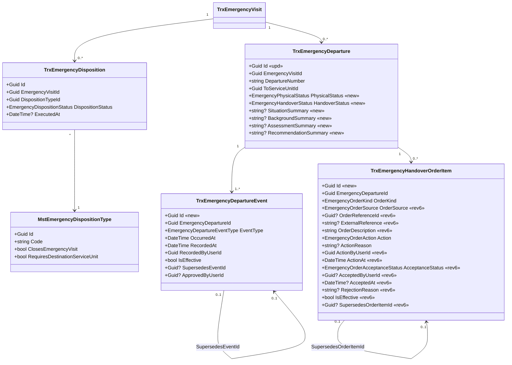

# Arsitektur Backend — Modul IGD

| Field | Nilai |
| --- | --- |
| Blueprint | `IGD-BP-001` revision `5` |
| Status | `draft` — **belum disetujui siapa pun**. Diturunkan dari `IGD-DEC-067` sampai `IGD-DEC-088` yang seluruhnya masih `draft` |
| Commit diaudit | backend `f69e9e483052845d11c91d8b7bbdce33c4acc8d8`, frontend `96a9120111f6acc6b7c0f37973ea0c717ba41f17` |
| Masukan | `00-interview-decisions.md` (88 keputusan), `01-existing-capability-map.md` revision `3` |
| Keputusan yang mengikat | `IGD-DEC-067` sampai `IGD-DEC-088`; keputusan lama `IGD-DEC-001` sampai `IGD-DEC-066` tetap berlaku kecuali dinyatakan `superseded` |
| Gerbang kemampuan rumah sakit | **BELUM TERPENUHI** — lihat bagian 0 |

Modul IGD menyimpan proses yang benar-benar khusus kegawatdaruratan. Data klinis yang dipakai
lintas pelayanan tetap dimiliki modul pusat agar tidak terjadi duplikasi antara Rawat Jalan,
IGD, dan Rawat Inap.

Seluruh tabel mewarisi `IdentityModel`, sehingga memiliki sepuluh kolom audit yang tidak
diulang pada dokumen ini: `CreateDateTime`, `CreateBy`, `UpdateDateTime`, `UpdateBy`,
`DeleteDateTime`, `DeleteBy`, `CancelDateTime`, `CancelBy`, `IsCancel`, dan `IsDelete`.
Penghapusan bersifat penandaan, bukan penghapusan baris.

---

## 0. Gerbang yang belum terpenuhi

Dokumen ini disusun walaupun dua artefak hulu yang diwajibkan untuk kemampuan bisnis rumah
sakit **tidak ada** pada blueprint IGD:

| Artefak hulu yang diwajibkan | Keadaan pada blueprint IGD | Keadaan pada blueprint Rawat Inap sebagai pembanding |
| --- | --- | --- |
| `evidence/02-requirement-completeness-gate.md` | **Tidak ada** | Ada, 728 baris |
| `evidence/03-hospital-domain-architecture.md` | **Tidak ada** | Ada, 764 baris |

**Alasan tetap dilanjutkan.** Substansi yang biasanya dihasilkan kedua skill itu — bounded
context, ownership konsep, invariant, lifecycle, batas billing, dan batas keselamatan klinis —
memang sudah tercatat, tetapi tersebar pada 88 keputusan di decision log dan pada revision `4`
dokumen ini, bukan pada berkas hulu tersendiri.

**Akibat yang harus diketahui pembaca.** Modul IGD tidak memiliki klasifikasi kesiapan
requirement per slice (`READY_FOR_DOMAIN_DESIGN`, `BUSINESS_DECISION_REQUIRED`, dan
sejenisnya) sebagaimana dimiliki Rawat Inap. Karena itu tidak ada cara ringkas menyatakan
slice mana yang secara formal siap dan slice mana yang belum. Yang tersedia hanyalah status
per keputusan.

Gerbang ini **tidak** ditandai terpenuhi. Bila Product/Domain Owner menghendaki kesetaraan
dengan Rawat Inap, `/requirement-completeness-gate` dan `hospital-domain-architect` perlu
dijalankan untuk IGD, dan dokumen ini ditinjau ulang terhadap hasilnya.

---

## 1. Kepemilikan data

Tabel ini adalah pertahanan paling langsung terhadap duplikasi entitas. Baris bertanda
**baru** ditambahkan pada revision `5`.

| Kelompok data | Modul pemilik | Dipakai IGD | Dibuat ulang di IGD |
| --- | --- | :---: | --- |
| Pasien dan identitas | Patient Management | Ya | Tidak |
| Encounter atau episode pelayanan | Registration Management | Ya | Tidak |
| Assessment, SOAP, diagnosis, tindakan, CPPT, tanda vital | Clinical Management | Ya | Tidak |
| Resep dan obat | Pharmacy Management | Ya | Tidak |
| **Pemesanan laboratorium** *(baru)* | **Laboratory Management** | Ya | **Tidak** — `IGD-DEC-087` |
| Unit pelayanan, ruangan, dan bed | Master Data | Ya | Tidak |
| **Kelas pasien** *(baru)* | **Master Data** | Ya | **Tidak** — `IGD-DEC-076` memakai penanda `IsForEmergency` yang sudah ada |
| **Episode rawat inap dan penempatan bed** *(baru)* | **Inpatient Management** (`RWI-BP-001`, belum diimplementasikan) | Ya | **Tidak** — `IGD-DEC-069` |
| **Penugasan pegawai ke simpul organisasi** *(baru)* | **Corporate/HR** | Ya | **Tidak** — `IGD-DEC-086` memakai `WfpOrganizationAssignment` yang sudah ada |
| Billing dan penjaminan | Billing Management | Ya | Tidak |
| Triage, resusitasi, observasi, disposition, kepergian pasien | Emergency Installation | Ya | **Ya, karena khusus IGD** |
| **Riwayat penugasan dokter pemeriksa IGD** *(baru)* | **Emergency Installation** | Ya | **Ya, karena khusus IGD** — `IGD-DEC-082` |
| Approval bertingkat, maker-checker, delegasi | Workflow Management | Ya | **Tidak** — engine generik lewat `ReferenceType`/`ReferenceId` |

Penghubung ke seluruh data klinis tetap `EncounterId`. Konteks IGD dibedakan melalui
`EncounterType.Emergency` sesuai `IGD-DEC-074`, bukan melalui penyalinan entitas.

### 1.1 Tiga perubahan pada tabel milik modul lain

Revision `5` mengusulkan perubahan pada tiga tabel yang **bukan milik IGD**. Ketiganya wajib
disetujui pemiliknya sebelum dikerjakan.

| Tabel | Pemilik | Perubahan | Keputusan | Mengapa tidak dapat dihindari |
| --- | --- | --- | --- | --- |
| `TrxPatientEncounter` | Registration Management | Satu kolom `OriginEncounterId` yang boleh kosong | `IGD-DEC-075` | `RWI-RULE-029` aturan 2 mewajibkan kedua kunjungan terhubung. Tidak ada tempat lain yang dapat menampung hubungan antar-kunjungan |
| `MstServiceUnit` | Master Data | Satu kolom `OrganizationUnitId` yang boleh kosong | `IGD-DEC-086` | Satu-satunya mata rantai yang putus antara pengguna dan unit pelayanan |
| `TrxPatientAssessment`, `TrxDoctorConsultation`, `TrxPatientDiagnosis`, `TrxPatientProcedure`, `TrxPrescription` | Clinical Management dan Pharmacy Management | Pelonggaran kewajiban `QueueId` dan `ConsultationId` untuk kunjungan bertipe `Emergency`; penambahan kolom penanda versi untuk koreksi append-only | `IGD-DEC-068`, `IGD-DEC-080` | Tanpa ini pengkajian, diagnosis, tindakan, dan resep pasien IGD **tidak dapat disimpan sama sekali** |

Baris ketiga adalah **satu-satunya dependency eksternal yang menahan rilis pertama**. Dua
lainnya tidak.

---

## 2. Class diagram

Diagram dipecah per konteks agar setiap gambar muat dibaca dalam satu layar. Penanda:
`«new»` entity baru, `«upd»` entity diperbarui, tanpa penanda berarti sudah ada dan tidak
berubah.

### 2.1 Kunjungan, triase, dan penetapan dokter



### 2.2 Resusitasi, observasi, dan tindakan

Tidak berubah pada revision `5`. Ketiganya tetap milik IGD dan tetap menempel pada
`EmergencyVisitId`.



### 2.3 Tindak lanjut dan kepergian pasien



#### Penjelasan field baru revisi 6 pada `TrxEmergencyHandoverOrderItem`

| Field | Arti | Keputusan |
| --- | --- | --- |
| `OrderSource` | `Internal` bila pesanan punya baris di sistem; `External` bila dibuat di luar sistem | `IGD-DEC-103` |
| `OrderReferenceId` | **Boleh kosong.** Terisi hanya untuk `Internal` | `IGD-DEC-103` |
| `ExternalReference` | **Wajib** bila `OrderSource` = `External`. Identitas atau nomor rujukan dari sistem luar | `IGD-DEC-103` |
| `OrderDescription` | **Wajib selalu.** Deskripsi yang dapat diaudit — tanpa ini pesanan luar sistem tidak dapat ditelusuri sama sekali | `IGD-DEC-103` |
| `ActionByUserId`, `ActionAt` | Pelaku dan waktu penetapan sikap. **Wajib**, termasuk untuk pesanan laboratorium yang sikapnya ditetapkan manual | `IGD-DEC-101` |
| `ActionReason` | **Wajib** bila `Action` = `Cancel`; opsional selain itu | `IGD-DEC-100` butir (c) |
| `AcceptanceStatus` | Penerimaan **per pesanan**, terpisah dari `EmergencyHandoverStatus` milik dokumen serah terima | `IGD-DEC-102` |
| `AcceptedByUserId`, `AcceptedAt` | Terisi saat unit penerima menerima pesanan | `IGD-DEC-102` |
| `RejectionReason` | **Wajib** bila `AcceptanceStatus` = `Rejected` | `IGD-DEC-102` |
| `IsEffective`, `SupersedesOrderItemId` | Sikap pengganti setelah penolakan ditulis sebagai **baris baru** yang menunjuk baris lama; baris lama ditandai tidak berlaku dan **tidak dihapus** | `IGD-DEC-102` butir (c), mengikuti pola tambah-saja `IGD-DEC-090` |

> **Mengapa penerimaan tidak menumpang `EmergencyHandoverStatus`.** `IGD-DEC-102` menyatakan
> penerimaan pasien, dokumen serah terima, dan setiap pesanan adalah **tiga fakta terpisah**.
> Menumpangkannya berarti satu pesanan yang ditolak akan menggagalkan penerimaan pasien —
> akibat yang secara tegas dilarang butir (d).

> **Penamaan.** `TrxEmergencyTransfer` diganti nama menjadi `TrxEmergencyDeparture` mengikuti
> `IGD-DEC-069` yang mengubah artinya dari "perpindahan beserta tempat tidur" menjadi "catatan
> kepergian pasien dari IGD". Nama lama menyesatkan setelah urusan tempat tidur pindah ke
> Rawat Inap. Penggantian nama tabel dibahas pada bagian 6 dan 7.

### 2.4 Satu penafsiran desain yang perlu dikonfirmasi

`IGD-DEC-070` memilih **dua kolom status** pada satu baris dan menolak bentuk daftar kejadian.
Namun `IGD-DEC-065`, `IGD-DEC-066`, `IGD-DEC-080`, dan `IGD-DEC-085` menuntut hal-hal yang
tidak dapat disimpan pada kolom status: waktu kejadian sebenarnya yang berbeda dari waktu
pencatatan, koreksi yang tidak menimpa, pembalikan yang butuh persetujuan orang kedua, dan
pemberitahuan ke catatan turunan.

Desain ini menyatukan keduanya:

| Kebutuhan | Diwadahi oleh |
| --- | --- |
| Membaca keadaan sekarang dengan cepat, dan menyaring daftar pantau | Dua kolom status pada `TrxEmergencyDeparture` — sesuai `IGD-DEC-070` |
| Menyimpan setiap perubahan beserta pelaku, waktu server, waktu sebenarnya, alasan, koreksi, dan pembalikan | `TrxEmergencyDepartureEvent`, bersifat tambah-saja — sesuai `IGD-DEC-065`, `066`, `080`, `085` |

Kolom status adalah **turunan** dari kejadian terakhir yang berlaku, bukan sumber kebenaran
tandingan. Setiap penulisan kejadian memperbarui kolom status dalam transaksi yang sama.

Penafsiran ini **belum dikonfirmasi owner**. Bila Product/Domain Owner menganggap
`IGD-DEC-070` melarang tabel kejadian sama sekali, maka `IGD-DEC-065`, `066`, `085` tidak
dapat dijalankan dan ketiganya harus ditinjau ulang. Dicatat sebagai `IGD-OQ-068`.

---

## 3. Penjelasan class

### 3.1 Model transaksi milik IGD

| Class | Status | Lokasi file | Kegunaan |
| --- | --- | --- | --- |
| `TrxEmergencyVisit` | Sudah ada | `Areas/HealthServices/EmergencyInstallationManagement/Models/TrxEmergencyVisit.cs` | Kunjungan IGD sebagai perluasan kunjungan pasien |
| `TrxEmergencyTriage` | Sudah ada | `.../Models/TrxEmergencyTriage.cs` | Penilaian dan penilaian ulang triase |
| `TrxEmergencyTriageDetail` | Sudah ada | `.../Models/TrxEmergencyTriageDetail.cs` | Indikator yang diamati beserta salinan nilai masternya |
| `TrxEmergencyResuscitation` | Sudah ada | `.../Models/TrxEmergencyResuscitation.cs` | Catatan resusitasi |
| `TrxEmergencyObservation` | Sudah ada | `.../Models/TrxEmergencyObservation.cs` | Periode observasi |
| `TrxEmergencyObservationDetail` | Sudah ada | `.../Models/TrxEmergencyObservationDetail.cs` | Pengamatan berkala dalam satu periode observasi |
| `TrxEmergencyProcedureDetail` | Sudah ada | `.../Models/TrxEmergencyProcedureDetail.cs` | Rincian khas IGD atas tindakan milik Clinical Management |
| `TrxEmergencyDisposition` | Sudah ada | `.../Models/TrxEmergencyDisposition.cs` | Keputusan tindak lanjut |
| `TrxEmergencyDeparture` | **Diperbarui** | `.../Models/TrxEmergencyDeparture.cs` | Catatan kepergian pasien dari IGD. Berganti nama dari `TrxEmergencyTransfer` |
| `TrxEmergencyDepartureEvent` | **Baru** | `.../Models/TrxEmergencyDepartureEvent.cs` | Riwayat kejadian kepergian, bersifat tambah-saja |
| `TrxEmergencyHandoverOrderItem` | **Baru** | `.../Models/TrxEmergencyHandoverOrderItem.cs` | Sikap atas setiap pesanan yang belum selesai saat pasien pergi |
| `TrxEmergencyDoctorAssignment` | **Baru** | `.../Models/TrxEmergencyDoctorAssignment.cs` | Riwayat penugasan dokter pemeriksa pada satu kunjungan IGD |

### 3.2 Model master

| Class | Status | Lokasi file | Perubahan |
| --- | --- | --- | --- |
| `MstEmergencyTriageLevel` | Sudah ada | `Areas/HealthServices/EmergencyInstallationManagement/MasterData/Models/MstEmergencyTriageLevel.cs` | Tidak ada |
| `MstEmergencyTriageIndicator` | Sudah ada | `.../EmergencyInstallationManagement/MasterData/Models/MstEmergencyTriageIndicator.cs` | Tidak ada |
| `MstEmergencyArrivalMode` | Sudah ada | `.../EmergencyInstallationManagement/MasterData/Models/MstEmergencyArrivalMode.cs` | Tidak ada |
| `MstEmergencyCaseType` | Sudah ada | `.../EmergencyInstallationManagement/MasterData/Models/MstEmergencyCaseType.cs` | Tidak ada |
| `MstEmergencyDispositionType` | Sudah ada | `.../EmergencyInstallationManagement/MasterData/Models/MstEmergencyDispositionType.cs` | Tidak ada struktur; `ClosesEmergencyVisit` mulai dibaca |
| `MstEmergencySetting` | **Diperbarui** | `.../EmergencyInstallationManagement/MasterData/Models/MstEmergencySetting.cs` | Empat kolom mati diberi arti atau dicabut — lihat bagian 5 |
| `MstServiceUnit` | **Diperbarui** | `.../MasterData/Models/MstServiceUnit.cs` | Tambah `OrganizationUnitId` — **milik Master Data, bukan IGD** |
| `MstPatientClass` | Sudah ada | `.../MasterData/Models/MstPatientClass.cs` | Tidak ada. `IsForEmergency` sudah tersedia dan mulai dipakai |

### 3.3 Model milik modul lain yang berubah

| Class | Pemilik | Status | Lokasi file | Perubahan |
| --- | --- | --- | --- | --- |
| `TrxPatientEncounter` | Registration Management | **Diperbarui** | `Areas/HealthServices/RegistrationManagement/Models/TrxPatientEncounter.cs` | Tambah `OriginEncounterId` (`Guid?`) |
| `TrxPatientAssessment` | Clinical Management | **Diperbarui** | `Areas/HealthServices/ClinicalManagement/Models/TrxPatientAssessment.cs` | `QueueId` menjadi `Guid?`; tambah penanda versi `IsEffective`, `AmendsAssessmentId`, `AmendmentReason` |
| `TrxDoctorConsultation` | Clinical Management | **Diperbarui** | `.../ClinicalManagement/Models/TrxDoctorConsultation.cs` | `QueueId` menjadi `Guid?` |
| `TrxPatientVitalSign` | Clinical Management | **Diperbarui** | `.../ClinicalManagement/Models/TrxPatientVitalSign.cs` | Tambah penanda versi `IsEffective`, `AmendsVitalSignId`, `AmendmentReason` |
| `TrxPatientIntegratedProgressNote` | Clinical Management | **Diperbarui** | `.../ClinicalManagement/Models/TrxPatientIntegratedProgressNote.cs` | Tambah penanda versi yang sama |
| `TrxPatientDiagnosis`, `TrxPatientProcedure` | Clinical Management | **Diperbarui** | `.../ClinicalManagement/Models/` | `ConsultationId` menjadi `Guid?` |
| `TrxPrescription` | Pharmacy Management | **Diperbarui** | `Areas/HealthServices/PharmacyManagement/Models/TrxPrescription.cs` | `ConsultationId` menjadi `Guid?` |

> Seluruh baris pada tabel 3.3 **tidak boleh dikerjakan** sebelum pemilik modulnya ditunjuk
> dan menyetujui. Lihat bagian 1.1 dan bagian 9.

### 3.4 Enum

| Enum | Status | Lokasi file | Nilai |
| --- | --- | --- | --- |
| `EmergencyVisitStatus` | Sudah ada | `.../EmergencyInstallationManagement/Enums/EmergencyVisitStatus.cs` | `Arrived`=1 … `Completed`=9 |
| `EmergencyTriageStatus` | Sudah ada | `.../Enums/EmergencyTriageStatus.cs` | `Draft`=1 … `Cancelled`=5 |
| `EmergencyRegistrationStatus` | Sudah ada | `.../Enums/EmergencyRegistrationStatus.cs` | `Pending`=1 … `Cancelled`=5 |
| `EmergencyDispositionStatus` | Sudah ada | `.../Enums/EmergencyDispositionStatus.cs` | `Draft`=1 … `Cancelled`=4 |
| `EmergencyObservationStatus`, `EmergencyResuscitationStatus`, `EmergencyProcedureDetailType`, `EmergencyTriageSystem` | Sudah ada | `.../Enums/` | Tidak berubah |
| `EmergencyTransferStatus` | **Digantikan** | `.../Enums/EmergencyTransferStatus.cs` | Dipecah menjadi dua enum di bawah |
| `EmergencyPhysicalStatus` | **Baru** | `.../Enums/EmergencyPhysicalStatus.cs` | `Prepared`=1, `Departed`=2, `Arrived`=3, `Cancelled`=9 |
| `EmergencyHandoverStatus` | **Baru** | `.../Enums/EmergencyHandoverStatus.cs` | `Submitted`=1, `Pending`=2, `Accepted`=3, `Rejected`=4, `Cancelled`=9 |
| `EmergencyDepartureEventType` | **Baru** | `.../Enums/EmergencyDepartureEventType.cs` | `Prepared`=1, `Departed`=2, `Arrived`=3, `HandoverSubmitted`=4, `HandoverAccepted`=5, `HandoverRejected`=6, `Cancelled`=9, `Amended`=10, `Reversed`=11 |
| `EmergencyOrderKind` | **Baru** | `.../Enums/EmergencyOrderKind.cs` | `Medication`=1, `Procedure`=2, `LaboratoryOrder`=3, **`RadiologyOrder`=4** |
| `EmergencyOrderSource` | **Baru — revisi 6** | `.../Enums/EmergencyOrderSource.cs` | `Internal`=1, `External`=2 |
| `EmergencyOrderAction` | **Baru — nilainya berubah pada revisi 6** | `.../Enums/EmergencyOrderAction.cs` | **`Continue`=1, `Handover`=2, `Cancel`=9** |
| `EmergencyOrderAcceptanceStatus` | **Baru — revisi 6** | `.../Enums/EmergencyOrderAcceptanceStatus.cs` | `NotRequired`=1, `Pending`=2, `Accepted`=3, `Rejected`=4 |

Nilai `Cancelled` sengaja diberi angka `9` pada enum baru agar penambahan nilai antara tidak
menggeser nilai terminal.

`EmergencyOrderKind.LaboratoryOrder` **sudah didefinisikan tetapi belum dipakai** pada rilis
pertama, sesuai `IGD-DEC-087`. Ia ada supaya penambahannya kelak tidak menggeser nilai lain.

#### 3.4.1 Empat koreksi revisi 6

Revisi 5 menetapkan `EmergencyOrderAction` bernilai `Completed`/`Cancelled`/`HandedOver`.
`IGD-DEC-100` membuktikan nilai itu **salah**, bukan sekadar salah nama.

| Nilai revisi 5 | Revisi 6 | Sebab |
| --- | --- | --- |
| `Completed`=1 | **`Continue`=1** | Daftar sikap **hanya memuat pesanan yang belum selesai**. Pesanan yang sudah tuntas tidak pernah muncul di sana, sehingga `Completed` adalah nilai yang tidak pernah terpakai. Yang justru tidak punya nilai adalah keadaan sebenarnya: pesanan yang **masih berjalan** dan akan diproses sampai hasil final meski pasien sudah pergi — `IGD-DEC-100` butir (a) |
| `HandedOver`=3 | **`Handover`=2** | Arti sama. Kini menuntut **penerimaan eksplisit** per pesanan — `IGD-DEC-102` |
| `Cancelled`=2 | **`Cancel`=9** | Arti sama. Dipindah ke `9` mengikuti aturan modul ini: nilai terminal diberi `9` agar penambahan nilai antara tidak menggesernya |

Tiga koreksi lain:

| # | Koreksi | Keputusan |
| ---: | --- | --- |
| 2 | `EmergencyOrderKind` menambah `RadiologyOrder`=4 | `IGD-DEC-099` menetapkan pemesanan radiologi sebagai kebutuhan klinis IGD |
| 3 | `EmergencyOrderSource` memisahkan pesanan **internal** dari **luar sistem** | `IGD-DEC-103`. Selama modul radiologi belum ada, pesanannya dibuat di luar sistem dan tidak punya baris untuk ditunjuk |
| 4 | `EmergencyOrderAcceptanceStatus` — penerimaan **per pesanan** | `IGD-DEC-102`. Penerimaan pasien, dokumen serah terima, dan tiap pesanan adalah tiga fakta terpisah |

**`EmergencyOrderSource` sengaja dibuat terpisah, bukan ditumpangkan pada `EmergencyOrderKind`.**
Menambahkan nilai seperti `ExternalRadiologyOrder` akan menggandakan setiap jenis pesanan
begitu ada jenis kedua yang dipesan di luar sistem, dan membuat "jenis pemeriksaan" bercampur
dengan "asal pesanan" — dua hal yang berubah karena sebab berbeda.

`EmergencyOrderAcceptanceStatus.NotRequired` berlaku untuk `Continue` dan `Cancel`: keduanya
tidak melibatkan unit penerima, sehingga tidak ada yang perlu diterima.

### 3.5 Service

| Service | Status | Fungsi utama | Dipanggil | Membuka transaksi |
| --- | --- | --- | --- | :---: |
| `EmergencyVisitService` | **Diperbarui** | Validasi kunjungan, transisi status, nomor kunjungan. Ditambah: wajib `EncounterType.Emergency`, tolak episode ganda | `EmergencyVisitController` | Tidak |
| `EmergencyTriageService` | **Diperbarui** | Validasi triase, penilaian ulang, penanda pelampauan batas. Ditambah: transisi status kunjungan wajib lewat `CanTransition` | `EmergencyTriageController` | Ya, pada `RetriageAsync` |
| `EmergencyDispositionService` | **Diperbarui** | Validasi tindak lanjut, gerbang penutupan. Ditambah: membaca `ClosesEmergencyVisit`, memeriksa sikap pesanan | `EmergencyDispositionController`, `EmergencyVisitController` | Tidak |
| `EmergencyDepartureService` | **Diperbarui** | Menggantikan `EmergencyTransferService`. Mengelola dua rangkaian status, menulis kejadian, koreksi, dan pembalikan | `EmergencyDepartureController` | Ya |
| `EmergencyObservationService` | Sudah ada | Validasi observasi | `EmergencyObservationController` | Tidak |
| `EmergencyResuscitationService` | Sudah ada | Validasi resusitasi | `EmergencyResuscitationController` | Tidak |
| `EmergencyDocumentNumberService` | Sudah ada | Pembentukan nomor dokumen | Beberapa service | Tidak |
| `EmergencyUnitAuthorityService` | **Baru** | Menjawab "apakah pengguna ini berwenang atas unit pelayanan ini" dengan menelusuri profil pegawai dan penugasan organisasi yang sedang berlaku | Seluruh controller IGD yang menuntut kewenangan unit | Tidak |
| `EmergencyDoctorAssignmentService` | **Baru** | Menetapkan, mengalihkan, dan membaca dokter penanggung jawab yang sedang aktif | `EmergencyDoctorAssignmentController` | Ya |
| `EmergencyHandoverOrderService` | **Baru** | Menyusun daftar pesanan yang belum selesai dan menyimpan sikapnya | `EmergencyDepartureController` | Ya |
| `EmergencyReassessmentMonitorHostedService` | **Baru** | Menandai pengkajian ulang yang tertunggak, meniru `EmergencyTriageSlaMonitorHostedService` | Dijalankan latar belakang | Ya |
| `EmergencyTriageSlaMonitorHostedService` | Sudah ada | Menandai pelampauan batas waktu triase | Dijalankan latar belakang | Ya |

Seluruh service baru diletakkan di
`Areas/HealthServices/EmergencyInstallationManagement/Services/` dan didaftarkan
`AddScoped` di `Program.cs` berdampingan dengan delapan service IGD yang sudah terdaftar pada
baris 291–298.

### 3.6 Controller

| Controller | Status | Lokasi file | Service yang dipakai |
| --- | --- | --- | --- |
| `EmergencyVisitController` | **Diperbarui** | `.../EmergencyInstallationManagement/Controllers/EmergencyVisitController.cs` | `EmergencyVisitService`, `EmergencyDispositionService`, `EmergencyUnitAuthorityService` |
| `EmergencyTriageController` | **Diperbarui** | `.../Controllers/EmergencyTriageController.cs` | `EmergencyTriageService`, `EmergencyVisitService` |
| `EmergencyTriageDetailController` | Sudah ada | `.../Controllers/EmergencyTriageDetailController.cs` | — |
| `EmergencyObservationController` | Sudah ada | `.../Controllers/EmergencyObservationController.cs` | `EmergencyObservationService` |
| `EmergencyObservationDetailController` | Sudah ada | `.../Controllers/EmergencyObservationDetailController.cs` | — |
| `EmergencyResuscitationController` | Sudah ada | `.../Controllers/EmergencyResuscitationController.cs` | `EmergencyResuscitationService` |
| `EmergencyProcedureDetailController` | Sudah ada | `.../Controllers/EmergencyProcedureDetailController.cs` | — |
| `EmergencyDispositionController` | **Diperbarui** | `.../Controllers/EmergencyDispositionController.cs` | `EmergencyDispositionService` |
| `EmergencyDepartureController` | **Diperbarui** | `.../Controllers/EmergencyDepartureController.cs` | `EmergencyDepartureService`, `EmergencyHandoverOrderService`, `EmergencyUnitAuthorityService` |
| `EmergencyDoctorAssignmentController` | **Baru** | `.../Controllers/EmergencyDoctorAssignmentController.cs` | `EmergencyDoctorAssignmentService` |
| `EmergencyReassessmentWatchlistController` | **Baru** | `.../Controllers/EmergencyReassessmentWatchlistController.cs` | `EmergencyReassessmentMonitorHostedService` lewat service pembacanya |

### 3.7 EF Core Configuration

Configuration **tidak** berada di dalam `Areas/`. Seluruhnya di bawah
`Repositories/Configurations/HealthServices/EmergencyInstallationManagement/`.

| Configuration | Status | Relasi dan index yang diatur |
| --- | --- | --- |
| `TrxEmergencyDepartureConfiguration` | **Diperbarui** | Nama tabel berubah; empat index tempat tidur dan ruangan dihapus; index baru `(EmergencyVisitId, PhysicalStatus)` dan `(ToServiceUnitId, HandoverStatus)` |
| `TrxEmergencyDepartureEventConfiguration` | **Baru** | `HasOne(EmergencyDeparture)` `DeleteBehavior.Restrict`; index `(EmergencyDepartureId, OccurredAt)`; index `(EmergencyDepartureId, IsEffective)` |
| `TrxEmergencyHandoverOrderItemConfiguration` | **Baru** | `HasOne(EmergencyDeparture)` `DeleteBehavior.Restrict`; unique `(EmergencyDepartureId, OrderKind, OrderReferenceId)` |
| `TrxEmergencyDoctorAssignmentConfiguration` | **Baru** | `HasOne(EmergencyVisit)` `DeleteBehavior.Restrict`; index `(EmergencyVisitId, EffectiveFrom)`; **unique filtered** `(EmergencyVisitId)` untuk baris dengan `EffectiveTo IS NULL` agar tidak pernah ada dua dokter aktif |
| Tujuh configuration IGD lain | Sudah ada | Tidak berubah |

`DeleteBehavior.Restrict` dipilih di seluruh relasi baru karena tidak satu pun catatan klinis
boleh ikut terhapus mengikuti induknya.

---

## 4. Arsitektur folder

```text
Areas/HealthServices/EmergencyInstallationManagement/
├── Controllers/
│   ├── EmergencyVisitController.cs                    Diperbarui
│   ├── EmergencyTriageController.cs                   Diperbarui
│   ├── EmergencyTriageDetailController.cs             Sudah ada
│   ├── EmergencyObservationController.cs              Sudah ada
│   ├── EmergencyObservationDetailController.cs        Sudah ada
│   ├── EmergencyResuscitationController.cs            Sudah ada
│   ├── EmergencyProcedureDetailController.cs          Sudah ada
│   ├── EmergencyDispositionController.cs              Diperbarui
│   ├── EmergencyDepartureController.cs                Diperbarui (dari EmergencyTransferController)
│   ├── EmergencyDoctorAssignmentController.cs         Baru
│   └── EmergencyReassessmentWatchlistController.cs    Baru
├── DTOs/
│   ├── EmergencyVisitDtos.cs                          Diperbarui
│   ├── EmergencyTriageDtos.cs                         Sudah ada
│   ├── EmergencyTriageDetailDtos.cs                   Sudah ada
│   ├── EmergencyObservationDtos.cs                    Sudah ada
│   ├── EmergencyObservationDetailDtos.cs              Sudah ada
│   ├── EmergencyResuscitationDtos.cs                  Sudah ada
│   ├── EmergencyProcedureDetailDtos.cs                Sudah ada
│   ├── EmergencyDispositionDtos.cs                    Sudah ada
│   ├── EmergencyDepartureDtos.cs                      Diperbarui (dari EmergencyTransferDtos)
│   ├── EmergencyDoctorAssignmentDtos.cs               Baru
│   └── EmergencyReassessmentWatchlistDtos.cs          Baru
├── Enums/
│   ├── EmergencyVisitStatus.cs                        Sudah ada
│   ├── EmergencyRegistrationStatus.cs                 Sudah ada
│   ├── EmergencyTriageStatus.cs                       Sudah ada
│   ├── EmergencyTriageSystem.cs                       Sudah ada
│   ├── EmergencyObservationStatus.cs                  Sudah ada
│   ├── EmergencyResuscitationStatus.cs                Sudah ada
│   ├── EmergencyProcedureDetailType.cs                Sudah ada
│   ├── EmergencyDispositionStatus.cs                  Sudah ada
│   ├── EmergencyTransferStatus.cs                     Dihapus setelah migrasi data selesai
│   ├── EmergencyPhysicalStatus.cs                     Baru
│   ├── EmergencyHandoverStatus.cs                     Baru
│   ├── EmergencyDepartureEventType.cs                 Baru
│   ├── EmergencyOrderKind.cs                          Baru
│   └── EmergencyOrderAction.cs                        Baru
├── Models/
│   ├── TrxEmergencyVisit.cs                           Sudah ada
│   ├── TrxEmergencyTriage.cs                          Sudah ada
│   ├── TrxEmergencyTriageDetail.cs                    Sudah ada
│   ├── TrxEmergencyResuscitation.cs                   Sudah ada
│   ├── TrxEmergencyObservation.cs                     Sudah ada
│   ├── TrxEmergencyObservationDetail.cs               Sudah ada
│   ├── TrxEmergencyProcedureDetail.cs                 Sudah ada
│   ├── TrxEmergencyDisposition.cs                     Sudah ada
│   ├── TrxEmergencyDeparture.cs                       Diperbarui (dari TrxEmergencyTransfer)
│   ├── TrxEmergencyDepartureEvent.cs                  Baru
│   ├── TrxEmergencyHandoverOrderItem.cs               Baru
│   └── TrxEmergencyDoctorAssignment.cs                Baru
└── Services/
    ├── EmergencyDocumentNumberService.cs              Sudah ada
    ├── EmergencyVisitService.cs                       Diperbarui
    ├── EmergencyTriageService.cs                      Diperbarui
    ├── EmergencyResuscitationService.cs               Sudah ada
    ├── EmergencyObservationService.cs                 Sudah ada
    ├── EmergencyDispositionService.cs                 Diperbarui
    ├── EmergencyDepartureService.cs                   Diperbarui (dari EmergencyTransferService)
    ├── EmergencyUnitAuthorityService.cs               Baru
    ├── EmergencyDoctorAssignmentService.cs            Baru
    ├── EmergencyHandoverOrderService.cs               Baru
    ├── EmergencyTriageSlaMonitorHostedService.cs      Sudah ada
    ├── EmergencyTriageSlaMonitorOptions.cs            Sudah ada
    ├── EmergencyReassessmentMonitorHostedService.cs   Baru
    └── EmergencyReassessmentMonitorOptions.cs         Baru

Repositories/Configurations/HealthServices/EmergencyInstallationManagement/
├── TrxEmergencyVisitConfiguration.cs                  Sudah ada
├── TrxEmergencyTriageConfiguration.cs                 Sudah ada
├── TrxEmergencyTriageDetailConfiguration.cs           Sudah ada
├── TrxEmergencyResuscitationConfiguration.cs          Sudah ada
├── TrxEmergencyObservationConfiguration.cs            Sudah ada
├── TrxEmergencyObservationDetailConfiguration.cs      Sudah ada
├── TrxEmergencyProcedureDetailConfiguration.cs        Sudah ada
├── TrxEmergencyDispositionConfiguration.cs            Sudah ada
├── TrxEmergencyDepartureConfiguration.cs              Diperbarui
├── TrxEmergencyDepartureEventConfiguration.cs         Baru
├── TrxEmergencyHandoverOrderItemConfiguration.cs      Baru
└── TrxEmergencyDoctorAssignmentConfiguration.cs       Baru
```

### 4.1 Utang teknis

| Utang | Keadaan pada revision 5 |
| --- | --- |
| Folder controller IGD pernah bernama `Controller/` tunggal | **Sudah diperbaiki** oleh `BE-IGD-013`. Sekarang `Controllers/` jamak |
| Nama domain pada `Repositories/Configurations/` pernah `HealthService/` tunggal | **Sudah diperbaiki**. Sekarang `HealthServices/` jamak |
| `LabOrder` tidak memakai awalan `Trx` | **Dibiarkan.** Milik Laboratory Management; merapikannya berarti menyentuh modul orang lain tanpa alasan fungsional |
| `LabOrderConfiguration` berada langsung di `Repositories/Configurations/HealthServices/`, tanpa folder submodul | **Dibiarkan.** Alasan sama |

Utang yang dibiarkan **jangan ditiru** untuk berkas baru.

---

## 5. Status model

| Model atau berkas | Status | Kolom yang berubah | Dampak migration |
| --- | --- | --- | --- |
| `TrxEmergencyVisit` | Sudah ada | Tidak ada | Tidak ada |
| `TrxEmergencyTriage` | Sudah ada | Tidak ada | Tidak ada |
| `TrxEmergencyDeparture` | **Diperbarui** | **Dihapus:** `FromRoomId`, `ToRoomId`, `FromBedId`, `ToBedId`, `TransferStatus`, `AcceptedAt`, `AcceptedByUserId`, `RejectionReason`. **Ditambah:** `PhysicalStatus` (`EmergencyPhysicalStatus`, bawaan `Prepared`), `HandoverStatus` (`EmergencyHandoverStatus`, bawaan `Submitted`), `SituationSummary` (`string?`, 2000), `BackgroundSummary` (`string?`, 2000), `AssessmentSummary` (`string?`, 2000), `RecommendationSummary` (`string?`, 2000), `AllergySnapshot` (`string?`, 1000), `LastVitalSignId` (`Guid?`), `TriageLevelSnapshot` (`string?`, 150). **Diganti nama:** tabel dan kelas dari `TrxEmergencyTransfer` | Ganti nama tabel, hapus delapan kolom, tambah sembilan kolom, ganti dua index. **Tidak dapat dijalankan tanpa memeriksa data lama** — lihat bagian 6 |
| `TrxEmergencyDepartureEvent` | **Baru** | Seluruh kolom baru | Tabel baru |
| `TrxEmergencyHandoverOrderItem` | **Baru** | Seluruh kolom baru | Tabel baru |
| `TrxEmergencyDoctorAssignment` | **Baru** | Seluruh kolom baru | Tabel baru beserta unique index bersyarat |
| `MstEmergencySetting` | **Diperbarui** | **Dihapus:** `AutoCreateProvisionalEncounter`, `RequireTriageBeforeStandardRegistration`. **Dipertahankan dan mulai dibaca:** `ImmediateCareLevelThreshold`, `RequireRegistrationBeforeTreatmentFromLevel` | Hapus dua kolom. Lihat catatan di bawah |
| `MstServiceUnit` | **Diperbarui** | Tambah `OrganizationUnitId` (`Guid?`) beserta index | Satu kolom, boleh kosong. **Milik Master Data** |
| `TrxPatientEncounter` | **Diperbarui** | Tambah `OriginEncounterId` (`Guid?`) beserta index | Satu kolom, boleh kosong. **Milik Registration Management** |
| `TrxPatientAssessment` | **Diperbarui** | `QueueId` `Guid` → `Guid?`; tambah `IsEffective` (`bool`, bawaan `true`), `AmendsAssessmentId` (`Guid?`), `AmendmentReason` (`string?`, 500) | **Milik Clinical Management** |
| `TrxDoctorConsultation` | **Diperbarui** | `QueueId` `Guid` → `Guid?` | **Milik Clinical Management** |
| `TrxPatientDiagnosis`, `TrxPatientProcedure` | **Diperbarui** | `ConsultationId` `Guid` → `Guid?` | **Milik Clinical Management** |
| `TrxPatientVitalSign`, `TrxPatientIntegratedProgressNote` | **Diperbarui** | Tambah `IsEffective`, `Amends…Id`, `AmendmentReason` | **Milik Clinical Management** |
| `TrxPrescription` | **Diperbarui** | `ConsultationId` `Guid` → `Guid?` | **Milik Pharmacy Management** |
| `EmergencyTransferStatus` | **Dihapus** | Seluruh enum | Setelah data lama dipetakan ke dua enum baru |

### 5.1 Dua kolom pengaturan yang dicabut

`IGD-GAP-031` mencatat empat kolom `MstEmergencySetting` yang tersimpan tetapi tidak
menjalankan apa pun. Revision `5` menyelesaikannya begini:

| Kolom | Perlakuan | Alasan |
| --- | --- | --- |
| `ImmediateCareLevelThreshold` | **Dipertahankan dan mulai dibaca** | Menjadi dasar penentuan `ImmediateCareAllowed` bersama `AllowsTreatmentBeforeRegistration` pada master level |
| `RequireRegistrationBeforeTreatmentFromLevel` | **Dipertahankan dan mulai dibaca** | Menegakkan `IGD-DEC-002`: pasien gawat boleh ditangani sebelum administrasi selesai |
| `AutoCreateProvisionalEncounter` | **Dicabut** | Pembuatan kunjungan selalu dilakukan layar pendaftaran secara eksplisit. Kolom ini tidak pernah mengubah perilaku apa pun dan mempertahankannya hanya mengundang salah paham |
| `RequireTriageBeforeStandardRegistration` | **Dicabut** | Bertentangan dengan `IGD-DEC-002`. Urutan triase dan pendaftaran ditentukan kegawatan pasien, bukan oleh sakelar pengaturan |

Pencabutan dua kolom ini **belum diputuskan owner**. Dicatat sebagai `IGD-OQ-069`.

---

## 6. Rencana migration

Seluruh migration di bawah **belum boleh dijalankan**. Basis data pengembangan dipakai
bersama satu tim dan berisi data pasien.

| Urutan | Migration | Tanpa mematikan layanan | Pengisian data lama | Cara mundur |
| ---: | --- | :---: | --- | --- |
| 1 | `AddOriginEncounterToPatientEncounter` | Ya | Tidak ada. Kolom boleh kosong, seluruh baris lama tetap sah | Hapus kolom dan index. Aman selama belum terisi |
| 2 | `AddOrganizationUnitToServiceUnit` | Ya | **Wajib diisi manual** oleh Master Data bersama Corporate/HR sebelum penjagaan kewenangan dinyalakan. Lihat `IGD-UNK-07` | Hapus kolom dan index |
| 3 | `AddEmergencyPatientClassSeed` | Ya | Menambah satu baris `MstPatientClass` bertanda `IsForEmergency` dan `IsDefault`. Tidak mengubah baris yang sudah ada | Hapus baris yang ditambahkan, dikenali dari kodenya |
| 4 | `ChangeEmergencyEncounterTypeToEmergency` | **Tidak** | `UPDATE TrxPatientEncounter SET EncounterType = 2 WHERE Id IN (SELECT EncounterId FROM TrxEmergencyVisit WHERE EncounterId IS NOT NULL)`. Jumlah baris yang berubah **wajib** sama dengan jumlah baris `TrxEmergencyVisit` yang `EncounterId`-nya terisi | `UPDATE ... SET EncounterType = 1` untuk himpunan yang sama. **Aman** karena nilai `2` tidak pernah dipakai sebelumnya |
| 5 | `AddEmergencyDoctorAssignment` | Ya | Untuk setiap kunjungan IGD yang `TrxPatientEncounter.DoctorId`-nya terisi, dibuat satu baris riwayat dengan `EffectiveFrom` diambil dari `UpdateDateTime` encounter dan `EffectiveTo` kosong. Bila `UpdateDateTime` kosong, dipakai `CreateDateTime` | Hapus tabel |
| 6 | `RenameEmergencyTransferToDeparture` | **Tidak** | Ganti nama tabel dan pemetaan `TransferStatus` lama ke dua kolom baru — lihat tabel pemetaan di bawah | Ganti nama kembali dan pulihkan kolom. **Kolom tempat tidur tidak dapat dipulihkan** bila datanya sudah dibuang |
| 7 | `AddEmergencyDepartureEventAndOrderItem` | Ya | Untuk setiap baris kepergian yang sudah ada, dibuat kejadian awal yang mencerminkan status hasil pemetaan langkah 6 | Hapus dua tabel |
| 8 | `RelaxQueueAndConsultationForEmergency` | Ya | Tidak ada. Melepas kewajiban terisi tidak mengubah nilai apa pun | **Mengembalikan kewajiban terisi akan gagal** bila sudah ada baris IGD yang kolomnya kosong. Lihat peringatan |
| 9 | `AddClinicalRecordVersionMarkers` | Ya | `IsEffective` diisi `true` untuk seluruh baris lama | Hapus tiga kolom pada tiga tabel |
| 10 | `DropUnusedEmergencySettingColumns` | Ya | Tidak ada | Tambah kembali dua kolom dengan nilai bawaannya |

### 6.1 Pemetaan status lama ke dua rangkaian baru

Langkah 6 memetakan enam nilai `EmergencyTransferStatus` menjadi dua kolom:

| `TransferStatus` lama | `PhysicalStatus` baru | `HandoverStatus` baru | Catatan |
| --- | --- | --- | --- |
| `Requested` = 1 | `Prepared` | `Submitted` | Belum berangkat, dokumen sudah diajukan |
| `Accepted` = 2 | `Prepared` | `Accepted` | **Ambigu di data lama.** Lihat peringatan |
| `InTransit` = 3 | `Departed` | `Submitted` | |
| `Completed` = 4 | `Arrived` | `Accepted` | |
| `Rejected` = 5 | `Prepared` | `Rejected` | |
| `Cancelled` = 6 | `Cancelled` | `Cancelled` | |

> **Peringatan pemetaan `Accepted`.** Nilai lama `Accepted` tidak dapat dibedakan artinya:
> ia bisa berarti "unit tujuan setuju menerima" atau "pasien sudah diterima secara fisik".
> Pemetaan di atas memilih arti pertama, karena `ArrivedAt` pada baris lama **selalu kosong** —
> tidak ada satu pun endpoint yang pernah mengisinya. Pilihan ini **wajib diperiksa terhadap
> data nyata** sebelum dijalankan, dan hasilnya dicatat sebagai bukti.

### 6.2 Peringatan cara mundur

> **Langkah 4.** Membatalkannya mengembalikan seluruh kunjungan IGD menjadi `Outpatient`, dan
> laporan rawat jalan kembali memuat pasien IGD. Ini memulihkan keadaan sebelumnya dengan
> setia, tetapi angka laporan akan berubah dua kali.

> **Langkah 6.** Empat kolom tempat tidur dan ruangan dihapus. Bila sudah ada baris yang
> mengisinya, nilainya **hilang permanen** kecuali diarsipkan lebih dulu. Jumlah baris
> terdampak belum diketahui — `IGD-UNK-03`. Langkah 6 **tidak boleh dijalankan** sebelum angka
> itu diketahui dan keputusan pengarsipannya diambil.

> **Langkah 8.** Mengembalikan kewajiban `QueueId` dan `ConsultationId` akan **gagal** begitu
> ada satu saja pengkajian atau resep IGD yang tersimpan tanpa keduanya. Setelah modul IGD
> dipakai, langkah ini praktis tidak dapat dibatalkan.

### 6.3 Urutan yang tidak boleh ditukar

```text
1 ─┐
2 ─┼─► boleh paralel, tidak saling bergantung
3 ─┘
       │
       ▼
4  ChangeEmergencyEncounterTypeToEmergency
       │  ← langkah 3 WAJIB selesai lebih dulu,
       │    kalau tidak pendaftaran IGD berhenti total
       ▼
8  RelaxQueueAndConsultationForEmergency
       │  ← menyaring berdasarkan EncounterType,
       │    jadi wajib sesudah langkah 4
       ▼
9  AddClinicalRecordVersionMarkers

5, 6, 7  ─► bebas urutannya terhadap jalur di atas
10       ─► paling akhir, setelah dipastikan tidak ada yang membaca dua kolom itu
```

Langkah 3 sebelum langkah 4 adalah keharusan mutlak. Menukarnya membuat kunjungan IGD berubah
tipe sementara master kelas pasiennya belum ada, sehingga `PatientClassId` kosong dan konteks
tarif hilang tanpa satu pun pesan galat.

---

## 7. Rencana data master awal

Tanpa data ini modul tidak dapat dipakai sama sekali.

| No | Master | Isi minimum | Keadaan |
| ---: | --- | --- | --- |
| 1 | `MstEmergencyTriageLevel` | Lima level beserta warna; `MaxWaitingMinutes` **dibiarkan kosong** untuk level yang SOP-nya belum disahkan | Seeder tersedia |
| 2 | `MstEmergencyTriageIndicator` | Indikator per level | Seeder tersedia |
| 3 | `MstEmergencyArrivalMode` | Cara kedatangan: datang sendiri, ambulans, rujukan, polisi | Seeder tersedia |
| 4 | `MstEmergencyCaseType` | Jenis kasus: trauma, non-trauma, kebidanan, anak | Seeder tersedia |
| 5 | `MstEmergencyDispositionType` | Tujuh jenis; `ClosesEmergencyVisit` kini **menentukan perilaku**, jadi nilainya wajib ditinjau per jenis | Seeder tersedia, **nilai perlu ditinjau ulang** |
| 6 | `MstEmergencySetting` | Satu baris bawaan menunjuk unit IGD | Seeder tersedia |
| 7 | `MstPatientClass` bertanda `IsForEmergency` + `IsDefault` | **Tepat satu baris** | **Belum ada seeder** — `IGD-DEC-076` |
| 8 | `MstServiceUnit.OrganizationUnitId` untuk unit IGD dan unit tujuan | Pemetaan ke simpul organisasi | **Belum ada** — `IGD-DEC-086` |

### 7.1 Peninjauan `ClosesEmergencyVisit`

Seeder mengisi ketujuh jenis dengan `true`. Setelah `IGD-DEC-067` menjadikannya penentu
perilaku, nilai itu perlu ditinjau:

| Kode | Nama | Usulan nilai | Alasan |
| --- | --- | :---: | --- |
| `PULANG` | Pulang | `true` | Pasien meninggalkan rumah sakit |
| `RANAP` | Rawat inap | `true` | Menutup kunjungan IGD dan membuka kunjungan rawat inap — `RWI-RULE-029` |
| `INTENSIF` | Pindah ICU atau kamar operasi | `true` | Sama seperti rawat inap untuk tujuan ICU; kamar operasi perlu ditinjau klinis |
| `RUJUK` | Rujuk ke fasilitas lain | `true` | Pasien meninggalkan rumah sakit |
| `MENINGGAL` | Meninggal | `true` | |
| `TOLAK` | Menolak perawatan | `true` | |
| `APS` | Pulang atas permintaan sendiri | `true` | |

Ketujuhnya bernilai `true`, sehingga **tidak ada perubahan data** yang diperlukan. Yang
berubah hanyalah bahwa nilainya sekarang benar-benar dibaca. Peninjauan ini tetap perlu
persetujuan Clinical Governance karena menyangkut kapan pelayanan IGD dianggap berakhir.

---

## 8. Kebutuhan lintas modul

| No | Kebutuhan | Modul pemilik | Menahan rilis IGD | Keputusan |
| ---: | --- | --- | :---: | --- |
| 1 | Pelonggaran kewajiban `QueueId` dan `ConsultationId` untuk kunjungan `Emergency` | Clinical Management, Pharmacy Management | **Ya** | `IGD-DEC-068` |
| 2 | Penanda versi catatan klinis untuk koreksi tambah-saja | Clinical Management | **Ya** untuk pengkajian; tidak untuk yang lain | `IGD-DEC-080` |
| 3 | Kolom `OriginEncounterId` | Registration Management | Tidak | `IGD-DEC-075` |
| 4 | Kolom `OrganizationUnitId` | Master Data | Tidak — penjagaan kewenangan dapat menyusul | `IGD-DEC-086` |
| 5 | `InpBedPlacement` membaca waktu tiba dari catatan kepergian IGD | Inpatient Management | Tidak | `IGD-DEC-071` |
| 6 | Pelengkapan `LabOrder` | Laboratory Management | Tidak | `IGD-DEC-087`, `IGD-DEC-088` |
| 7 | Revisi `RWI-RULE-026` aturan 6 dan `compatibility_impact` manifest | Inpatient Management | **Ya** lewat nomor 1 | `IGD-DEC-068`, `IGD-DEC-075` |

Nomor 1 dan 2 adalah **satu-satunya** yang menahan rilis pertama. Keduanya menunggu pemilik
modul yang belum ditunjuk.

---

## 9. Yang sengaja tidak dibuat

| Yang dipertimbangkan | Ditolak karena |
| --- | --- |
| Tabel pengkajian keperawatan khusus IGD | `IGD-DEC-003` dan `IGD-DEC-068` melarang tabel klinis tandingan. Rekam medis pasien harus satu tempat |
| Tabel antrean semu untuk pasien IGD | `IGD-DEC-068` dan `RWI-RULE-026` aturan 2 melarangnya. Laporan antrean poliklinik tidak boleh tercemar |
| Tabel penugasan pengguna ke unit pelayanan | `IGD-DEC-086` mencabutnya. Rantai pengguna ke organisasi sudah ada; yang kurang hanya satu jembatan |
| Tabel pemesanan laboratorium milik IGD | `IGD-DEC-087`. `LabOrder` sudah ada dan sudah dapat dipakai |
| Tabel alokasi tempat tidur milik IGD | `IGD-DEC-069`. Milik Rawat Inap lewat `InpBedPlacement` |
| Dokumen serah terima terpisah untuk perawat dan dokter | `IGD-DEC-079` memilih satu dokumen untuk rilis pertama |
| Salinan pasien, dokter, atau master apa pun ke dalam IGD | Aturan kepemilikan data bagian 1 |
| Pemesanan radiologi | Modulnya belum ada; membuatnya di IGD berarti mendirikan modul penunjang kedua |
| Catatan pemberian obat milik IGD | Menyentuh Pharmacy Management. Ditunggu sampai pemiliknya ditunjuk |
| Perubahan pada mesin hak akses `SysAccessPolicy` | `IGD-DEC-081` dan `IGD-DEC-086` menegaskan penjaga ditulis di service IGD, bukan di mesin yang menjaga seluruh aplikasi tanpa satu pun test |

---

## 10. Pertanyaan terbuka yang lahir dari desain ini

| ID | Pertanyaan | Memblokir |
| --- | --- | --- |
| `IGD-OQ-068` | `IGD-DEC-070` memilih dua kolom status dan menolak daftar kejadian, tetapi `IGD-DEC-065`, `066`, `085` menuntut penyimpanan yang hanya mungkin sebagai daftar kejadian. Apakah penafsiran bagian 2.4 — kolom status sebagai turunan, daftar kejadian sebagai sumber audit — dapat diterima? | `IMPLEMENTATION` catatan kepergian |
| `IGD-OQ-069` | Apakah `AutoCreateProvisionalEncounter` dan `RequireTriageBeforeStandardRegistration` benar dicabut, atau justru harus diberi arti? | `IMPLEMENTATION` `MstEmergencySetting` |
| `IGD-OQ-070` | Penggantian nama `TrxEmergencyTransfer` menjadi `TrxEmergencyDeparture` mengubah nama tabel dan seluruh route-nya. Apakah penggantian nama diterima, atau nama lama dipertahankan demi kompatibilitas pemakai luar? | `IMPLEMENTATION` |

---

## 11. Correction pass revisi 6 — 26 Agustus 2026

Ditambahkan atas permintaan Product/Domain Owner. **Bukan** perancangan area baru.

### 11.1 Cara baris pesanan internal dibentuk

Revisi 6 memperkenalkan `EmergencyOrderSource`, tetapi **belum menetapkan** dari mana baris
`Internal` datang. Tanpa itu, `TrxEmergencyHandoverOrderItem` hanya dapat diisi manual, dan
`IGD-DEC-100` butir (d) — larangan pembatalan otomatis — kehilangan artinya karena tidak ada
daftar yang dibentuk sistem.

Sumber per jenis, seluruhnya diverifikasi pada `300922c`:

| `OrderKind` | Tabel sumber | `OrderReferenceId` menunjuk | Penanda "belum selesai" | Pemilik tabel |
| --- | --- | --- | --- | --- |
| `Medication` | `TrxPrescription` | `TrxPrescription.Id` | `FulfillmentStatus` belum terminal | `PharmacyManagement` |
| `Procedure` | `TrxPatientProcedure` | `TrxPatientProcedure.Id` | `ProcedureStatus` belum terminal; nilai awalnya `Planned` | `ClinicalManagement` |
| `LaboratoryOrder` | `LabOrder` | `LabOrder.Id` | **Tidak dapat ditentukan sistem** | `LaboratoryManagement` |
| `RadiologyOrder` | — | **Selalu kosong** | Tidak berlaku | Belum ada modulnya |

#### Tiga akibat yang harus diterima secara sadar

**① Dua dari empat jenis bergantung pada tabel milik modul lain yang pemiliknya belum
ditunjuk.** `Medication` dan `Procedure` hanya dapat dibentuk otomatis setelah `MVP-3` membuka
jalur klinis IGD. Sebelum itu keduanya **kosong**, bukan salah.

**② `LaboratoryOrder` tidak akan pernah terbentuk otomatis dengan benar** selama `LabOrder`
tidak punya kolom status. Baris tetap dapat dibentuk — pesanan lab memang ada dan menempel
pada encounter — tetapi **sikapnya** wajib ditetapkan manual, sesuai `IGD-DEC-101`. Sistem
membentuk barisnya, klinisi menentukan sikapnya.

**③ `RadiologyOrder` selalu `External`.** Selama modul radiologi belum ada, tidak ada baris
untuk ditunjuk, sehingga `OrderReferenceId` selalu kosong dan `ExternalReference` selalu wajib
— `IGD-DEC-099`, `IGD-DEC-103`.

#### Kapan daftar dibentuk

Daftar disusun **saat dokumen serah terima diajukan**, bukan saat pesanan dibuat. Alasannya:
pesanan yang selesai sebelum pasien pergi tidak pernah perlu diberi sikap, dan membentuk
barisnya lebih awal hanya menghasilkan baris yang langsung usang.

`EmergencyHandoverOrderService` menyusunnya dengan menanyakan tiap modul sumber, lalu
menyimpan **snapshot** uraian pesanan pada `OrderDescription`. Snapshot dipakai supaya daftar
tetap terbaca meski baris sumbernya kelak berubah — pola yang sama dengan
`OrderLabelSnapshot` yang sudah ada.

### 11.2 Unique constraint yang mendukung tiga keadaan sekaligus

Rancangan revisi 6 menulis *"tepat satu baris `IsEffective = true` per pesanan yang sama"*.
Rumusan itu **tidak dapat ditegakkan** apa adanya: pesanan `External` tidak punya
`OrderReferenceId` untuk dijadikan kunci, sehingga seluruh pesanan luar sistem akan dianggap
"pesanan yang sama" dan saling menolak.

Diperbaiki menjadi **dua index parsial**, masing-masing dengan kuncinya sendiri:

| Index | Kunci | Syarat |
| --- | --- | --- |
| `UX_EmergencyHandoverOrderItem_Internal` | `EmergencyDepartureId`, `OrderKind`, `OrderReferenceId` | `IsEffective` **dan** `OrderSource = Internal` **dan** `NOT IsDelete` |
| `UX_EmergencyHandoverOrderItem_External` | `EmergencyDepartureId`, `OrderKind`, `ExternalReference` | `IsEffective` **dan** `OrderSource = External` **dan** `NOT IsDelete` |

Ditambah satu `CHECK` yang menjaga keduanya tidak pernah kosong bersamaan:

```
(OrderSource = Internal AND OrderReferenceId IS NOT NULL AND ExternalReference IS NULL)
OR
(OrderSource = External AND ExternalReference IS NOT NULL AND OrderReferenceId IS NULL)
```

#### Kenapa koreksi tambah-saja tidak bertabrakan dengan index ini

Baris yang digantikan ditandai `IsEffective = false` **dalam transaksi yang sama** dengan
penulisan baris penggantinya. Karena kedua index hanya berlaku pada baris `IsEffective = true`,
riwayat sepanjang apa pun tidak pernah melanggarnya — dan urutan penulisannya tidak perlu
diatur khusus.

Ini pola yang sama dengan `TrxEmergencyDepartureEvent` (`IGD-DEC-090`) dan dengan unique index
bersyarat pada `TrxEmergencyDoctorAssignment`. Konsisten, bukan mekanisme baru.

> **Catatan PostgreSQL.** `NULL` tidak dianggap sama dengan `NULL` pada unique index. Tanpa
> syarat `OrderSource` pada tiap index, baris `External` yang `OrderReferenceId`-nya sama-sama
> kosong akan lolos begitu saja — bukan karena aturannya benar, melainkan karena
> perbandingannya tidak pernah terjadi. Syarat `OrderSource` itulah yang membuat index kedua
> benar-benar menjaga.
