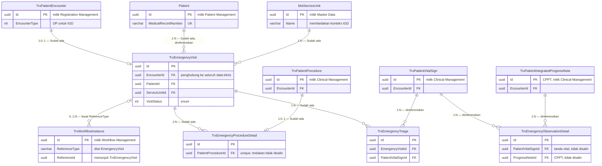

# Context ERD — Modul IGD

| Field | Nilai |
| --- | --- |
| Blueprint | `IGD-BP-001` revision `4` |
| Cakupan | Hubungan antar bounded context, bukan detail kolom |
| Commit diaudit | backend `e5331a0` |

Diagram ini memperlihatkan bagaimana IGD terhubung ke modul lain. Aturannya satu: IGD
**menunjuk**, tidak menyalin.

Kotak entity hanya memuat kolom penghubung, karena tujuan diagram ini adalah memperlihatkan
**titik sentuh antar modul**. Kolom lengkap ada pada
[emergency-episode.md](emergency-episode.md) dan [data-dictionary.md](data-dictionary.md).

## Batas kepemilikan

| Bounded context | Modul pemilik | Cara IGD memakainya |
| --- | --- | --- |
| Encounter | Registration Management | `TrxEmergencyVisit.EncounterId` |
| Pasien | Patient Management | `TrxEmergencyVisit.PatientId` |
| Unit pelayanan, ruangan, bed | Master Data | `ServiceUnitId`, `FromRoomId`, `ToBedId`, dan sejenisnya |
| Tindakan klinis | Clinical Management | `TrxEmergencyProcedureDetail.PatientProcedureId` |
| Tanda vital | Clinical Management | `TrxEmergencyObservationDetail.PatientVitalSignId` |
| CPPT | Clinical Management | `TrxEmergencyObservationDetail.ProgressNoteId` |
| Approval dan delegasi | Workflow Management | `TrxWorkflowInstance.ReferenceType` = `EmergencyVisit`, `ReferenceId` = `TrxEmergencyVisit.Id` |
| Billing | Billing Management | Melalui `EncounterId`; **tidak** menjadi syarat penutupan klinis sesuai `IGD-DEC-021` |

## Arah ketergantungan

IGD bergantung pada modul pusat, tidak sebaliknya. Modul pusat tidak boleh mengetahui adanya
IGD. Konsekuensinya:

- perubahan pada IGD tidak boleh memaksa perubahan pada Clinical Management;
- IGD tidak boleh menambah kolom pada entitas milik modul lain;
- kebutuhan lintas modul diselesaikan lewat relasi atau adapter, bukan penambahan kolom.

## Yang tidak muncul di diagram ini

Modul Laboratory dan Radiology terhubung ke IGD hanya melalui `EncounterId` yang sama, tanpa
relasi langsung ke entitas IGD. Karena itu keduanya tidak digambar sebagai relasi.
