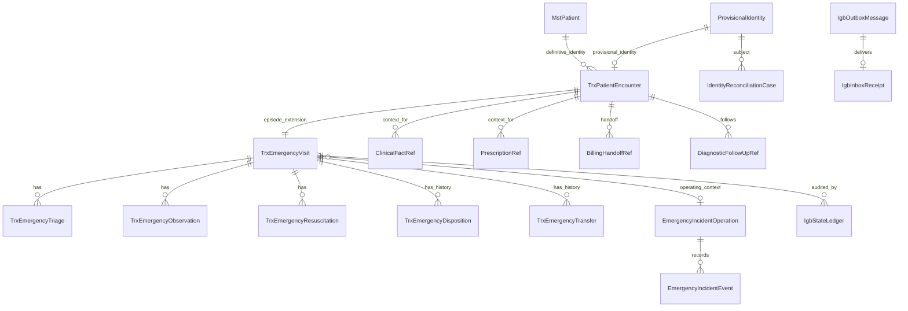

# IGD — Context ERD

| Field | Value |
|---|---|
| Contract version/status | `0.1.0-draft` |
| Owner | Cross-domain owners in `IGD-DEC-039`–`045` |
| Approval | `—` |

This is a logical context ERD. It explicitly marks ownership and does not create duplicate patient,
clinical, prescription, financial, or diagnostic masters.

| Logical entity | Classification / owner | Key relationship and boundary |
|---|---|---|
| `MstPatient` | Existing / Patient Management | Definitive master only; never owned or copied by IGD. |
| `ProvisionalIdentity` | Extend / Registration Management with Patient Management approval | One controlled provisional identity may be resolved to one definitive patient; retains historical link. |
| `TrxPatientEncounter` | Extend / Registration Management | Canonical `EncounterId`; identity is definitive **or** provisional, never neither/both active. |
| `TrxEmergencyVisit` and child records | Existing + Extend / Emergency Installation | IGD extension of one encounter; unique active encounter relationship. |
| `ClinicalFactRef`, `PrescriptionRef` | Adapter/View / Clinical and Pharmacy | References to owners’ records; no clinical/prescription payload copied. |
| `BillingHandoffRef`, `DiagnosticFollowUpRef` | Adapter/View / Finance and Diagnostic Services | References/outcomes only; no invoice/result source-of-truth. |
| `IdentityReconciliationCase`, `IgbStateLedger`, `IgbOutboxMessage`, `IgbInboxReceipt` | New / designated owner | Controlled workflow/audit/reliability records, not patient/clinical/financial masters. |
| `EmergencyIncidentOperation`, `EmergencyIncidentEvent` | New / Emergency Installation | Local operational state pending approved external contract. |

Physical schema naming, migrations, and external diagnostic/billing foreign keys require owner
approval. Cross-domain references may be logical IDs only where database ownership is separate.
