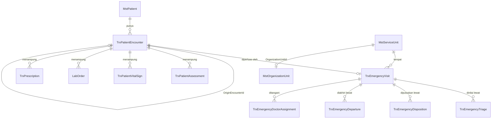

# ERD Konteks — Modul IGD

| Field | Nilai |
| --- | --- |
| Blueprint | `IGD-BP-001` revision `5` |
| Status | `draft` |
| Commit diaudit | backend `f69e9e48`, frontend `96a91201` |
| Masukan | `00-interview-decisions.md` 88 keputusan; `01-existing-capability-map.md` revision `3` |

Dokumen ini menunjukkan **batas kepemilikan** antar modul, bukan seluruh kolom. Rincian kolom
ada di [`data-dictionary.md`](./data-dictionary.md), dan ERD per konteks ada di
[`emergency-episode.md`](./emergency-episode.md) serta
[`emergency-departure.md`](./emergency-departure.md).

Penanda status entity:

| Penanda | Arti |
| --- | --- |
| `Existing` | Sudah ada, tidak berubah pada revisi ini |
| `Extend` | Sudah ada, ditambah kolom atau relasi |
| `New` | Belum ada, dibuat pada revisi ini |
| `External` | Milik modul lain; IGD hanya merujuk, tidak pernah menyalin |

---

## 1. Peta kepemilikan

| Entity | Status | Modul pemilik |
| --- | --- | --- |
| `MstPatient` | `External` | Patient Management |
| `TrxPatientEncounter` | `Extend` | **Registration Management** |
| `TrxPatientAssessment`, `TrxPatientVitalSign` | `Extend` | **Clinical Management** |
| `LabOrder` | `External` | Laboratory Management |
| `TrxPrescription` | `Extend` | **Pharmacy Management** |
| `MstServiceUnit` | `Extend` | **Master Data** |
| `MstOrganizationUnit` | `External` | Corporate/HR |
| `TrxEmergencyVisit`, `TrxEmergencyTriage`, `TrxEmergencyDisposition` | `Existing` | Emergency Installation |
| `TrxEmergencyDeparture` | `Extend` | Emergency Installation |
| `TrxEmergencyDoctorAssignment` | `New` | Emergency Installation |

Empat entity bertanda `Extend` **bukan milik IGD**. Perubahannya diusulkan, bukan
diberlakukan sepihak — lihat `02-backend-architecture.md` bagian 1.1.

---

## 2. Batas yang tidak boleh dilanggar

| Aturan | Sebab |
| --- | --- |
| IGD **tidak pernah** membuat tabel pasien, dokter, atau master tandingan | `IGD-DEC-003` |
| Catatan klinis IGD menempel pada `EncounterId`, bukan disalin ke tabel IGD | `IGD-DEC-003`, `IGD-DEC-068` |
| Tempat tidur dan ruangan **tidak** disimpan pada entity IGD | `IGD-DEC-069` |
| Episode rawat inap **tidak** dibuat modul IGD | `IGD-DEC-067`, `RWI-RULE-029` |
| Antrean **tidak** dibuat untuk pasien IGD | `IGD-DEC-068` |

---

## 3. Titik sentuh dengan modul lain

| Titik sentuh | Arah | Isi | Keputusan |
| --- | --- | --- | --- |
| Kunjungan IGD ke kunjungan rawat inap | IGD → Registration | `OriginEncounterId` diisi saat kunjungan rawat inap dibuat | `IGD-DEC-075` |
| Waktu tiba pasien | IGD → Inpatient | `InpBedPlacement` membaca waktu tiba dari catatan kepergian IGD | `IGD-DEC-071` |
| Kewenangan unit | Corporate/HR → IGD | Penugasan organisasi yang sedang berlaku menentukan kewenangan | `IGD-DEC-086` |
| Pesanan yang belum selesai | Clinical/Pharmacy → IGD | Daftar pesanan dibaca saat serah terima disusun | `IGD-DEC-078` |
| Kelas pasien | Master Data → IGD | Master bertanda `IsForEmergency` menentukan kelas kunjungan IGD | `IGD-DEC-076` |
