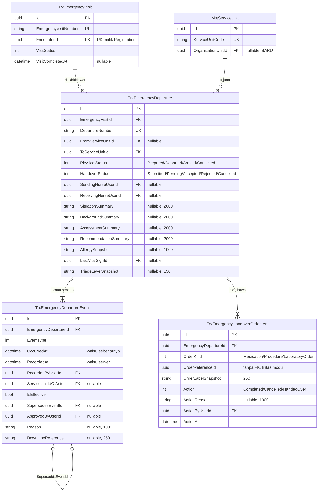

# ERD — Kepergian Pasien dari IGD

| Field | Nilai |
| --- | --- |
| Blueprint | `IGD-BP-001` revision `5` |
| Status | `draft` |
| Bounded context | Emergency Installation — kepergian dan serah terima |
| Keputusan | `IGD-DEC-069`, `070`, `071`, `072`, `078`, `079`, `085` |

Konteks ini menggantikan bekas konteks "transfer". Perubahan artinya dikunci `IGD-DEC-069`:
catatan ini **tidak lagi mengurus tempat tidur**, melainkan mencatat kepergian pasien dari IGD
beserta serah terimanya.

---

## 1. Diagram

---

## 2. Status entity dan pemiliknya

| Entity | Status | Pemilik | Catatan |
| --- | --- | --- | --- |
| `TrxEmergencyDeparture` | `Extend` | Emergency Installation | Berganti nama dari `TrxEmergencyTransfer`; delapan kolom dihapus, sembilan ditambah |
| `TrxEmergencyDepartureEvent` | `New` | Emergency Installation | Tambah-saja; tidak pernah diperbarui di tempat |
| `TrxEmergencyHandoverOrderItem` | `New` | Emergency Installation | Satu baris per pesanan yang belum selesai |
| `MstServiceUnit` | `Extend` | **Master Data** | Satu kolom baru, boleh kosong |

---

## 3. Aturan integritas

| Aturan | Ditegakkan oleh |
| --- | --- |
| `DepartureNumber` unik di seluruh baris, termasuk yang ditandai terhapus | Unique index tanpa penyaring `IsDelete` |
| Satu pesanan hanya boleh punya satu sikap per kepergian | Unique `(EmergencyDepartureId, OrderKind, OrderReferenceId)` |
| Tepat satu kejadian berlaku per jenis kejadian pada satu kepergian | Index `(EmergencyDepartureId, EventType, IsEffective)` beserta pemeriksaan di service |
| Kejadian tidak pernah dihapus | Tidak ada endpoint hapus; `DeleteBehavior.Restrict` pada relasi induk |
| Unit tujuan wajib berbeda dari unit asal | Validasi service |
| `OrderReferenceId` **tanpa** foreign key | Menunjuk tabel milik modul berbeda — resep, tindakan, atau pemesanan lab. Keutuhannya dijaga service, bukan basis data |

> **Mengapa `OrderReferenceId` tanpa foreign key.** Ia dapat menunjuk `TrxPrescription`,
> `TrxPatientProcedure`, atau `LabOrder` bergantung `OrderKind`. Satu kolom tidak dapat
> memiliki tiga foreign key sekaligus. Ini **berbeda** dengan kasus `FromBedId` dan `ToBedId`
> yang dicabut `IGD-DEC-069`: kolom itu selalu menunjuk satu tabel dan seharusnya memang
> berelasi. Perbedaan ini disebut supaya ketiadaan foreign key di sini tidak dibaca sebagai
> pengulangan kesalahan yang sama.

---

## 4. Dua rangkaian status dan artinya

| Rangkaian fisik | Arti | Menentukan |
| --- | --- | --- |
| `Prepared` | Pasien siap dipindahkan, masih di IGD | Pemilik klinis = IGD |
| `Departed` | Pasien meninggalkan IGD | Pemilik klinis = **tetap IGD** (`IGD-DEC-072`) |
| `Arrived` | Pasien sampai di unit tujuan | Pemilik klinis = unit penerima (`IGD-DEC-064`) |
| `Cancelled` | Kepergian batal | Pasien tetap di IGD |

| Rangkaian dokumen | Arti | Menentukan |
| --- | --- | --- |
| `Submitted` | Ringkasan serah terima dikirim | Belum ditinjau |
| `Pending` | Menunggu peninjauan penerima | Eskalasi berjalan |
| `Accepted` | Penerima berwenang menyatakan menerima | Serah terima tuntas |
| `Rejected` | Ditolak beserta alasan | Tetap tercatat sebagai belum tuntas |
| `Cancelled` | Dokumen batal | Mengikuti pembatalan kepergian |

Kombinasi **fisik `Arrived` + dokumen `Pending`** adalah keadaan **sah**, bukan galat
(`IGD-DEC-070`). Kombinasi yang ditolak: dokumen `Accepted` sementara fisik belum `Departed`.
