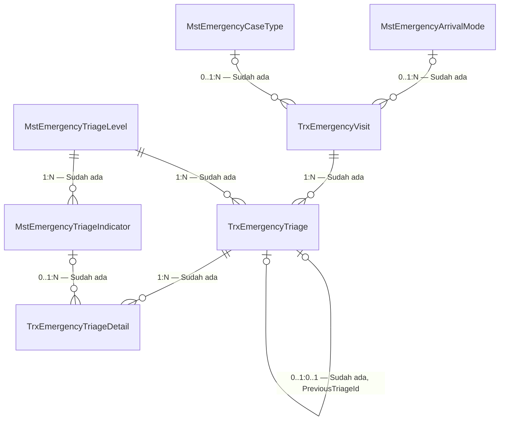
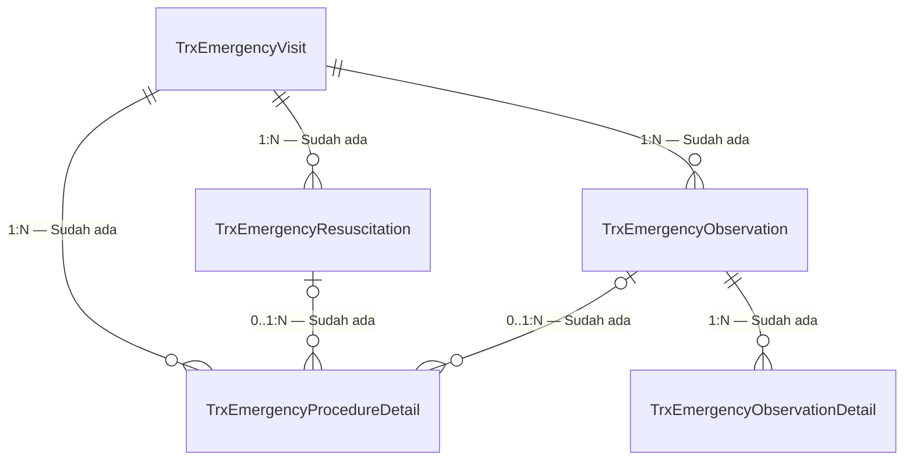
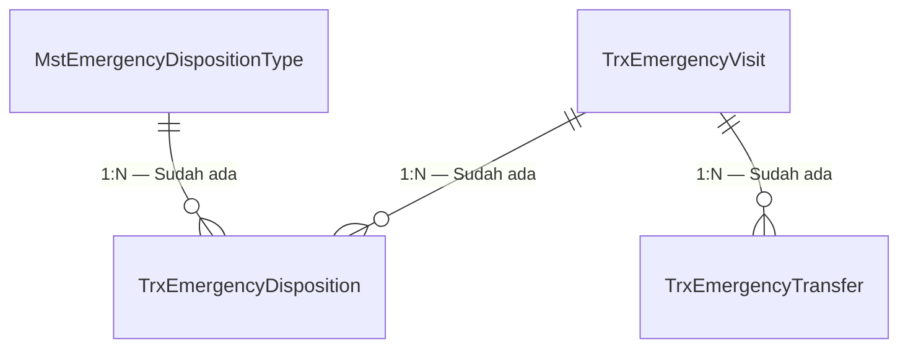

# ERD Bounded Context — Emergency Episode

| Field | Nilai |
| --- | --- |
| Blueprint | `IGD-BP-001` revision `4` |
| Bounded context | Emergency Installation |
| Commit diaudit | backend `e5331a0` |

Diagram dipecah menjadi tiga agar setiap gambar muat dibaca dalam satu layar.

Seluruh tabel mewarisi `IdentityModel`. Sepuluh kolom auditnya tidak digambar.

## 1. Kunjungan, triage, dan master triage

Relasi `TrxEmergencyTriage` ke dirinya sendiri adalah rantai retriage. Penilaian ulang membuat
baris baru yang menunjuk baris sebelumnya, sehingga riwayat perubahan kondisi pasien utuh dan
dapat diaudit.

## 2. Resusitasi, observasi, dan tindakan

`TrxEmergencyProcedureDetail` hanya menyimpan atribut tambahan khas IGD. Tindakan medis
sebenarnya tetap satu sumber di `TrxPatientProcedure` milik Clinical Management.

## 3. Disposition dan transfer

Transfer terjadi setelah disposition rawat inap, ICU, atau kamar operasi, dan juga untuk
perpindahan internal.

## Status entity

| Entity | Status | Owner | Catatan |
| --- | --- | --- | --- |
| `TrxEmergencyVisit` | Sudah ada | Emergency Installation | — |
| `TrxEmergencyTriage` | **Diperbarui** | Emergency Installation | Tambah penanda breach SLA |
| `TrxEmergencyTriageDetail` | Sudah ada | Emergency Installation | Menyimpan snapshot master indikator |
| `TrxEmergencyResuscitation` | Sudah ada | Emergency Installation | — |
| `TrxEmergencyObservation` | Sudah ada | Emergency Installation | — |
| `TrxEmergencyObservationDetail` | Sudah ada | Emergency Installation | Menunjuk tanda vital dan CPPT, tidak menyalinnya |
| `TrxEmergencyProcedureDetail` | Sudah ada | Emergency Installation | Satu banding satu terhadap `TrxPatientProcedure` |
| `TrxEmergencyDisposition` | Sudah ada | Emergency Installation | — |
| `TrxEmergencyTransfer` | Sudah ada | Emergency Installation | Relasi ruangan dan bed menunggu entity final |
| `MstEmergencyTriageLevel` | Sudah ada | Emergency Installation | Membutuhkan data awal |
| `MstEmergencyTriageIndicator` | Sudah ada | Emergency Installation | Membutuhkan data awal |
| `MstEmergencyArrivalMode` | Sudah ada | Emergency Installation | Membutuhkan data awal |
| `MstEmergencyCaseType` | Sudah ada | Emergency Installation | Membutuhkan data awal |
| `MstEmergencyDispositionType` | Sudah ada | Emergency Installation | Membutuhkan data awal |
| `MstEmergencySetting` | Sudah ada | Emergency Installation | Hanya satu baris default |
| `TrxPatientEncounter` | Sudah ada | Registration Management | Direferensikan, **tidak** disalin |
| `TrxPatientProcedure` | Sudah ada | Clinical Management | Direferensikan, **tidak** disalin |
| `TrxPatientVitalSign` | Sudah ada | Clinical Management | Direferensikan, **tidak** disalin |
| `TrxPatientIntegratedProgressNote` | Sudah ada | Clinical Management | Direferensikan, **tidak** disalin |

## Perilaku hapus

Seluruh relasi klinis memakai `DeleteBehavior.Restrict`, sehingga penghapusan master, pasien,
atau encounter tidak menghapus riwayat transaksi secara berantai. Penghapusan tetap berupa
penandaan `IsDelete`, bukan penghapusan baris.
