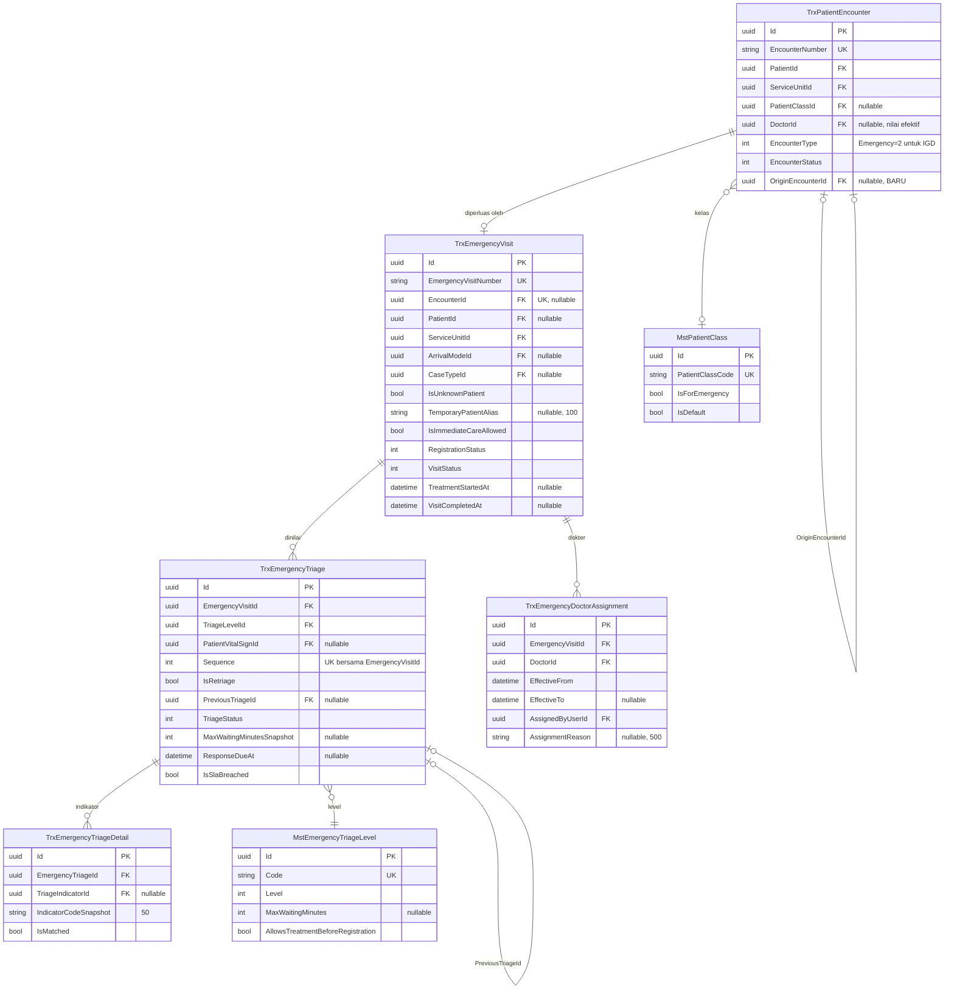

# ERD — Episode IGD

| Field | Nilai |
| --- | --- |
| Blueprint | `IGD-BP-001` revision `5` |
| Status | `draft` |
| Bounded context | Emergency Installation — kunjungan, triase, dan penetapan dokter |
| Keputusan | `IGD-DEC-067`, `074`, `075`, `076`, `082`, `084` |

---

## 1. Diagram

---

## 2. Status entity dan pemiliknya

| Entity | Status | Pemilik | Perubahan pada revisi ini |
| --- | --- | --- | --- |
| `TrxPatientEncounter` | `Extend` | **Registration Management** | Tambah `OriginEncounterId`; nilai `EncounterType` untuk IGD berubah menjadi `Emergency` |
| `TrxEmergencyVisit` | `Existing` | Emergency Installation | Tidak berubah |
| `TrxEmergencyTriage` | `Existing` | Emergency Installation | Tidak berubah |
| `TrxEmergencyTriageDetail` | `Existing` | Emergency Installation | Tidak berubah |
| `TrxEmergencyDoctorAssignment` | `New` | Emergency Installation | Tabel baru |
| `MstEmergencyTriageLevel` | `Existing` | Master Data | Tidak berubah |
| `MstPatientClass` | `Existing` | Master Data | Tidak berubah strukturnya; `IsForEmergency` mulai dipakai |

---

## 3. Aturan integritas

| Aturan | Ditegakkan oleh | Keputusan |
| --- | --- | --- |
| Satu kunjungan pasien hanya boleh punya satu kunjungan IGD | Unique index pada `TrxEmergencyVisit.EncounterId`, **tanpa** penyaring `IsDelete` | Sudah ada |
| Satu pasien tidak boleh punya dua kunjungan IGD aktif | Validasi service; **bukan** index basis data karena "aktif" bergantung pada nilai status | `IGD-DEC-084` |
| Nomor urut triase unik per kunjungan | Unique `(EmergencyVisitId, Sequence)` | Sudah ada |
| Penilaian triase lama tidak pernah ditimpa | Status menjadi `Superseded`, baris baru menunjuk yang lama | `IGD-DEC-004` |
| Tepat satu dokter aktif per kunjungan IGD | **Unique index bersyarat** pada `(EmergencyVisitId)` untuk baris dengan `EffectiveTo IS NULL` | `IGD-DEC-082` |
| Kunjungan tidak boleh menunjuk dirinya sendiri sebagai asal | Validasi service | `IGD-DEC-075` |
| Rangkaian kunjungan tidak boleh membentuk lingkaran | Validasi service saat pembuatan | `IGD-DEC-075` |
| Kunjungan IGD wajib bertipe `Emergency` | Validasi di **dua tempat** — service dan controller | `IGD-DEC-074`, `IGD-CONF-01` |
| Kelas pasien IGD wajib terisi | Validasi service saat pembuatan kunjungan | `IGD-DEC-076` |
| Status kunjungan tidak boleh mundur | Seluruh penulisan `VisitStatus` **wajib** lewat `CanTransition` | `IGD-GAP-014` |

> **Unique index bersyarat.** PostgreSQL mendukungnya lewat
> `CREATE UNIQUE INDEX ... WHERE "EffectiveTo" IS NULL`. Ini menjaga invariant "tepat satu
> dokter aktif" di lapisan basis data, bukan hanya di service, sehingga dua permintaan
> bersamaan tidak dapat menghasilkan dua dokter aktif.

---

## 4. Yang membedakan kunjungan IGD dari kunjungan poliklinik

Setelah `IGD-DEC-074`, pembedanya adalah `EncounterType`, bukan tebakan dari unit atau nama:

| Aspek | Poliklinik | IGD |
| --- | --- | --- |
| `EncounterType` | `Outpatient` = 1 | `Emergency` = 2 |
| Baris `TrxQueue` | Ada | **Tidak ada** |
| Kelas pasien | Master bernama `RAWAT JALAN` | Master bertanda `IsForEmergency` |
| Pengkajian butuh antrean | Ya | **Tidak** setelah `IGD-DEC-068` |
| Diagnosis butuh konsultasi | Ya | **Tidak** setelah `IGD-DEC-068` |
| Dokter | Satu kolom pada kunjungan | Riwayat penugasan beserta nilai efektif |
