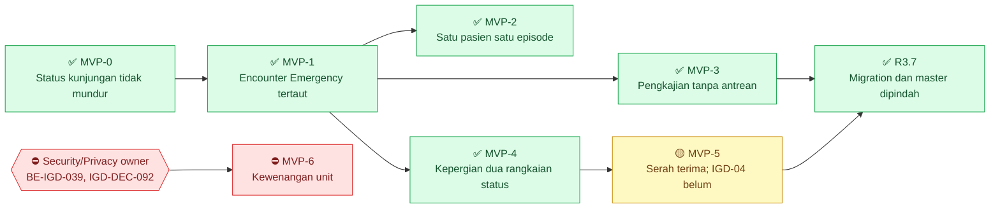

# Bukti Pemeriksaan Status Modul IGD terhadap Source — 15 September 2026

| Field | Nilai |
| --- | --- |
| Blueprint ID | `IGD-BP-001` · revision `6` — **tidak naik**. Dokumen ini hanya bukti, bukan revisi arsitektur |
| Tanggal pemeriksaan | 15 September 2026 |
| Pemicu | Dokumen IGD tidak diperbarui sejak 28 Agustus 2026 (`eb18ac6b`). Sesudah tanggal itu, kode IGD disentuh tim lain, modul Radiologi terbit, dan proyek test backend dihapus |
| Skill yang menjalankan | `manage-module-blueprint` |
| Wewenang tulis | `MODULE BLUEPRINT MODE`, diberikan Rizki Gunawan pada 15 September 2026 **khusus untuk berkas ini**. Manifest, roadmap, traceability, dan artefak IGD lain **tidak** disunting |
| Backend yang diperiksa | `NewQuilvianSystemBackend`, branch `rizkiG`, commit `e89907c5`, working tree bersih |
| Frontend yang diperiksa | `QuilvianSystemFrontendDev`, branch `RizkiV2`, commit `43adae648`, working tree bersih |
| SHA yang tercatat di manifest | Backend `300922c`, frontend `96a91201` — **usang** |
| Sifat pemeriksaan | Hanya membaca: `git log`, `git show`, penelusuran source, dan dokumen blueprint. **Tidak** menjalankan build, test, aplikasi, maupun query ke basis data |
| Status dokumen | **Keputusan sudah dijawab.** Keenam `OD-IGD-*` disetujui Rizki Gunawan pada 15 September 2026 dan dicatat sebagai `IGD-DEC-110` sampai `IGD-DEC-115`. Pemetaan ulang acceptance criteria dan tanda status hasilnya ada di bagian 8 |

---

## Cara membaca dokumen ini

Beberapa istilah dipakai berulang. Artinya:

| Istilah | Arti |
| --- | --- |
| *Commit* | Satu kali penyimpanan perubahan kode ke git, dikenali dari kode pendek seperti `e89907c5` |
| *SHA* | Kode pengenal sebuah commit. Dipakai untuk menyebut "keadaan kode pada titik tertentu" |
| *Endpoint* | Alamat di backend yang dipanggil layar, misalnya `PATCH .../observation-status` |
| Kode `403` | Pengguna tidak punya hak untuk tindakan itu |
| Kode `409` | Permintaan bertentangan dengan keadaan data, misalnya kunjungan sudah ditutup |
| *Thunk* | Fungsi di frontend yang memanggil endpoint lalu menyimpan hasilnya ke state layar |
| `STALE` | Bukti atau artefak yang dasarnya sudah berubah, sehingga perlu ditinjau ulang sebelum dipercaya |

Setiap temuan diberi ID bukti `IGD-EV-*`, melanjutkan penomoran decision log yang terakhir
memakai `IGD-EV-107`. Keputusan yang diusulkan diberi label sementara `OD-IGD-*`. ID resminya
(`IGD-DEC-110` dan seterusnya) baru diberikan saat keputusan dicatat di
`00-interview-decisions.md`.

---

## 1. Ringkasan

1. **Rename tabel encounter dan resep oleh tim Registrasi konsisten di kode IGD.** Satu hal
   belum diketahui: apakah migration-nya sudah diterapkan ke basis data.
2. **Tiga dari empat celah catatan 28 Agustus masih terbuka.** Celah keempat (daftar pesanan
   laboratorium) sudah ditutup di backend, tetapi justru menimbulkan **cacat baru** di layar IGD.
3. **Ada dua perubahan IGD yang tidak punya laporan maupun keputusan**: pengaturan IGD tersirat
   di backend (`f76ebaab`, 28 Agustus) dan perombakan layar pengkajian di frontend (`bd1d94a8a`,
   31 Agustus). Perombakan itu memuat **perbaikan privasi** yang belum tercatat di mana pun.
4. **Klaim "MVP-0 sampai MVP-5 selesai" berlebihan.** `EPIC IGD-04` (riwayat penugasan dokter)
   termasuk `MVP-5`, tetapi belum punya satu pun task.
5. **Premis `IGD-DEC-099` sudah gugur.** Modul Radiologi sudah ada, pemiliknya sudah ditunjuk,
   dan keputusan Radiologi `RAD-DEC-009` meminta IGD bertindak.

---

## 2. Temuan Status

### `IGD-EV-108` — Rename `TrxPatientEncounter` dan `TrxPrescription` konsisten di kode IGD

**Yang diuji.** Commit `58c61a5b` (Yasmina, 10 September 2026, *"Change table with perfix Trx
(Patient Encounter and Perscription)"*) mengganti nama dua entitas milik modul lain. Apakah
kode IGD masih memakai nama lama?

**Berkas IGD yang disentuh commit itu:**

| Berkas | Baris sekarang | Perubahan |
| --- | ---: | --- |
| `Areas/HealthServices/EmergencyInstallationManagement/Controllers/EmergencyVisitController.cs` | 600 | `TrxPatientEncounter` → `RegPatientEncounter` |
| `Areas/HealthServices/EmergencyInstallationManagement/Models/EmgVisit.cs` | 98 | Navigasi `Encounter` → `RegPatientEncounter?` |
| `Areas/HealthServices/EmergencyInstallationManagement/Services/EmergencyVisitService.cs` | 171 | `TrxPatientEncounter` → `RegPatientEncounter` |
| `Areas/HealthServices/EmergencyInstallationManagement/Services/EmergencyDepartureService.cs` | 686 | `TrxPrescription` → `PhmPrescription` |

Catatan lama hanya menyebut rename encounter. Nyatanya commit itu **juga** mengganti nama resep
di `EmergencyDepartureService`, tempat IGD membentuk daftar pesanan obat saat pasien pergi. Tiga
berkas IGD juga mendapat BOM (penanda encoding di awal berkas). Perubahan itu hanya soal encoding
dan tidak mengubah perilaku.

**Hasil penelusuran:**

| Pemeriksaan | Hasil |
| --- | --- |
| Nama `TrxPatientEncounter` atau `TrxPrescription` di luar folder `Migrations/` | **Nol** |
| Kelas `RegPatientEncounter` beserta `[Table("RegPatientEncounter")]` | Ada, `Areas/HealthServices/RegistrationManagement/Models/RegPatientEncounter.cs:12-13` |
| Kelas `PhmPrescription` beserta `[Table("PhmPrescription")]` | Ada, `Areas/HealthServices/PharmacyManagement/Models/PhmPrescription.cs:15-16` |
| Migration rename | Ada: `Migrations/20260910031500_RenameTrxPatientEncounterAndPrescriptionToCanonicalPrefix.cs` |
| Snapshot EF memuat nama baru | Ya, `ToTable("RegPatientEncounter")` dan `ToTable("PhmPrescription")` |
| Tabel `Emg*` di snapshot | **17**, sama dengan catatan 28 Agustus |

**Kesimpulan:** konsisten di kode.

**Yang belum diketahui.** Apakah migration `20260910031500` sudah diterapkan ke basis data?
Pertanyaan ini sengaja tidak dijawab karena pemeriksaan ini dilarang menjalankan query.
Akibatnya penting: bila belum diterapkan, kode memanggil tabel `RegPatientEncounter` yang belum
ada, sehingga pendaftaran IGD dan pembentukan pesanan saat pasien pergi akan gagal.

---

### `IGD-EV-109` — Celah 1: sikap pesanan serah terima belum dipakai frontend, dan jalur tulisnya ikut terhalang `BE-IGD-039`

**Keadaan.** Masih terbuka. Kata `order-items` tidak muncul satu kali pun di `src/` frontend.

**Temuan baru yang mengubah prioritas.** Laporan `FE-IGD-022` menyebut celah ini "paling
bernilai berikutnya". Penelusuran hari ini menunjukkan keempat route tulisnya memanggil
pemeriksaan kewenangan unit, yaitu kode yang cacat pada `BE-IGD-039`:

| Route | Method service | Pemeriksaan kewenangan |
| --- | --- | --- |
| `POST /{id}/order-items` | `AddExternalOrderAsync` | `PeriksaUnitAsalAsync`, `EmergencyDepartureService.cs:231` |
| `PATCH /{id}/order-items/{itemId}/action` | `SetOrderActionAsync` | `PeriksaUnitAsalAsync`, `EmergencyDepartureService.cs:253` |
| `POST /{id}/order-items/{itemId}/accept` | `SetOrderAcceptanceAsync` | `PeriksaAsync`, `EmergencyDepartureService.cs:296` |
| `POST /{id}/order-items/{itemId}/reject` | `SetOrderAcceptanceAsync` | Sama |

**Contoh akibatnya.** Perawat IGD menyiapkan kepergian pasien samaran "Tn. A" ke Rawat Inap.
Ada satu pesanan laboratorium yang belum selesai. Perawat membuka layar sikap pesanan (seandainya
layar itu dibangun hari ini) dan memilih *Lanjutkan*. Backend memeriksa unit asal:

- Bila unit belum dipetakan ke simpul organisasi, dan per 27 Agustus **0 dari 18** unit sudah
  dipetakan, jawabannya `403` dengan pesan *"…Lanjutkan dengan menyertakan alasan…"*. Padahal
  request-nya tidak punya kolom alasan.
- Bila unit sudah dipetakan, jawabannya tetap `403` *"Anda tidak bertugas di unit ini"*, karena
  perbandingannya tidak akan pernah benar (`IGD-EV-113`).

Jadi layar tulis sikap pesanan **tidak dapat dipakai siapa pun** sampai `BE-IGD-039` beres.
Yang dapat dibangun sekarang hanya **tampilan baca** lewat `GET`.

#### Health Services / Emergency Installation Management / Emergency Departure

Base URL: `api/v1/health-services/emergency-installation-management/emergency-departures`

| Method | Path | Kegunaan | Hak akses | Request | Response | Terhalang `BE-IGD-039`? |
| --- | --- | --- | --- | --- | --- | :-: |
| `GET` | `/{id}/order-items` | Melihat pesanan yang belum selesai pada satu kepergian pasien | `EmergencyDeparture : Read` | - | `List<EmergencyHandoverOrderItemResponse>` | Tidak |
| `POST` | `/{id}/order-items` | Mencatat pesanan yang ditempuh di luar sistem | `EmergencyDeparture : Update` | `EmergencyHandoverOrderItemInput` | `EmergencyHandoverOrderItemResponse` | **Ya** |
| `PATCH` | `/{id}/order-items/{itemId}/action` | Menetapkan sikap pesanan: `Continue`, `Handover`, atau `Cancel` | `EmergencyDeparture : Update` | `SetOrderItemActionRequest` | `EmergencyHandoverOrderItemResponse` | **Ya** |
| `POST` | `/{id}/order-items/{itemId}/accept` | Unit tujuan menerima pesanan yang diserahkan | `EmergencyDeparture : Update` | - | `EmergencyHandoverOrderItemResponse` | **Ya** |
| `POST` | `/{id}/order-items/{itemId}/reject` | Unit tujuan menolak pesanan, dengan alasan | `EmergencyDeparture : Update` | `SetOrderItemAcceptanceRequest` | `EmergencyHandoverOrderItemResponse` | **Ya** |

Arti kode status bagi pengguna:

- `200`: permintaan berhasil.
- `403`: petugas dianggap tidak berwenang atas unit asal atau unit tujuan. Selama `BE-IGD-039`
  terbuka, **setiap** petugas menerima kode ini.
- `404`: data kepergian pasien tidak ditemukan.

---

### `IGD-EV-110` — Celah 2: `PATCH observation-status` masih membuang catatan untuk `Completed` dan `Cancelled`

**Keadaan.** Masih terbuka, di
`Areas/HealthServices/EmergencyInstallationManagement/Controllers/EmergencyObservationController.cs:302-307`.

**Proses bisnisnya.**

1. **Tujuan:** perawat menutup satu periode observasi pasien IGD beserta kesimpulannya, supaya
   dokter penentu tindak lanjut membaca ringkasan tanpa membuka setiap catatan pemantauan.
2. **Pelaku:** perawat IGD yang punya hak `EmergencyObservation : Update`.
3. **Pemicu:** periode observasi selesai, dieskalasi, atau dibatalkan.
4. **Prasyarat:** periode berstatus `Active` atau `Escalated`.
5. **Langkah utama:**
   1. Perawat memilih aksi pada periode yang berjalan.
   2. Layar mengirim `observationStatus` dan `notes`.
   3. Backend memeriksa apakah perubahan status kunjungan sah (penjaga `BE-IGD-018`).
   4. Backend mengubah status observasi dan menyimpan catatan.
6. **Perubahan status:**

| Dari status observasi | Tindakan | Ke status observasi | Status kunjungan ikut menjadi | Catatan tersimpan ke |
| --- | --- | --- | --- | --- |
| `Active` | Selesaikan | `Completed` | `AwaitingDisposition` | **Tidak ke mana pun** — dibuang |
| `Active` | Eskalasi | `Escalated` | `InTreatment` | `EscalationReason` |
| `Active` | Batalkan | `Cancelled` | Tidak berubah | **Tidak ke mana pun** — dibuang |
| `Escalated` | Selesaikan | `Completed` | `AwaitingDisposition` | **Tidak ke mana pun** — dibuang |
| `Escalated` | Batalkan | `Cancelled` | Tidak berubah | **Tidak ke mana pun** — dibuang |

**Sebab teknisnya.** Kode mencari properti bernama `Notes` lewat refleksi (membaca nama properti
saat program berjalan). `EmgObservation` tidak punya `Notes`. Yang dimilikinya adalah
`CompletionSummary` (baris 42) dan `EscalationReason` (baris 45). Cabang refleksi itu diam-diam
tidak melakukan apa-apa.

**Contoh.** Perawat menutup observasi pasien samaran "Ny. B" dengan catatan *"Nyeri dada hilang
setelah 2 jam, EKG ulang normal, siap disposisi"*. Backend menjawab `200`. Saat dokter membuka
riwayat, kolom Kesimpulan kosong. Satu-satunya jalan mengisi `CompletionSummary` adalah
`PUT /{id}`, yang menimpa seluruh periode.

**Pola yang sama di tempat lain.** Refleksi `GetProperty("Notes")` juga ada di
`EmergencyResuscitationController.cs:317`, `EmergencyTriageController.cs:474`, dan
`EmergencyVisitController.cs:384` serta `:432`. **Belum diperiksa** apakah entitas pada
keempat tempat itu punya properti `Notes`. Bila tidak punya, catatannya juga terbuang.

#### Health Services / Emergency Installation Management / Emergency Observation

Base URL: `api/v1/health-services/emergency-installation-management/emergency-observations`

| Method | Path | Kegunaan | Hak akses | Request | Response |
| --- | --- | --- | --- | --- | --- |
| `PATCH` | `/{id}/observation-status` | Mengubah status periode observasi beserta catatannya | `EmergencyObservation : Update` | `UpdateEmergencyObservationObservationStatusRequest` (`observationStatus`, `notes` maks. 2000 karakter) | `EmergencyObservationResponse` |

Arti kode status bagi pengguna:

- `200`: status berubah. Untuk `Completed` dan `Cancelled`, catatan **tidak** ikut tersimpan.
- `400`: isian tidak lengkap.
- `404`: periode observasi tidak ditemukan.
- `409`: perubahan status kunjungan tidak sah, misalnya kunjungan sudah ditutup.

---

### `IGD-EV-111` — Celah 3: resusitasi belum punya layar

**Keadaan.** Masih terbuka. Kata `resuscitation` tidak muncul satu kali pun di `src/` frontend.

**Catatan yang membedakannya dari celah 1.** Controller resusitasi **tidak** memanggil
pemeriksaan kewenangan unit, jadi layarnya tidak terhalang `BE-IGD-039`. Yang belum ada adalah
kartu task dan persetujuan tampilannya.

#### Health Services / Emergency Installation Management / Emergency Resuscitation

Base URL: `api/v1/health-services/emergency-installation-management/emergency-resuscitations`

| Method | Path | Kegunaan | Hak akses | Request | Response |
| --- | --- | --- | --- | --- | --- |
| `GET` | `/` | Daftar tindakan resusitasi | `EmergencyResuscitation : Read` | query berhalaman | `PagedResult<EmergencyResuscitationResponse>` |
| `GET` | `/{id}` | Detail satu tindakan resusitasi | `EmergencyResuscitation : Read` | - | `EmergencyResuscitationResponse` |
| `POST` | `/` | Mencatat tindakan resusitasi baru | `EmergencyResuscitation : Create` | `CreateEmergencyResuscitationRequest` | `EmergencyResuscitationResponse` |
| `PUT` | `/{id}` | Mengubah catatan resusitasi | `EmergencyResuscitation : Update` | `UpdateEmergencyResuscitationRequest` | `EmergencyResuscitationResponse` |
| `PATCH` | `/{id}/resuscitation-status` | Mengubah status resusitasi | `EmergencyResuscitation : Update` | `UpdateEmergencyResuscitationResuscitationStatusRequest` | `EmergencyResuscitationResponse` |

Kode `409` pada `POST` dan `PATCH` berarti perubahan status kunjungan tidak sah (penjaga
`BE-IGD-021`).

---

### `IGD-EV-112` — Celah 4: daftar pesanan laboratorium sudah difilter di backend, tetapi layar IGD belum memakainya

**Keadaan backend: tertutup.** Commit `259d53ce` dan `a517cdbd` (Rivenjxv, 4 September 2026)
mengubah `GET lab-orders` menjadi berhalaman dan menerima `encounterId`.

| Parameter `LabOrderPagedQuery` | Nilai bawaan |
| --- | --- |
| `PageNumber` | `1` |
| `PageSize` | **`25`** |
| `EncounterId` | kosong = semua pasien |
| Urutan | `CreateDateTime` terbaru lebih dulu |

**Keadaan frontend: menjadi cacat baru.** `fetchLabOrders` di
`QuilvianSystemFrontendDev/src/lib/state/slice/health-services/emergency-installation-management/emergency-assessment-slice.jsx:531-542`
masih memanggil tanpa parameter apa pun, lalu menyaring `encounterId` sendiri di browser.

**Contoh akibatnya.** Pukul 10.00 laboratorium sudah menerima 40 pesanan hari itu dari poli,
rawat inap, dan IGD. Pasien IGD samaran "Tn. C" dipesankan darah lengkap pukul 08.15, pesanan
urutan ke-12 hari itu.

1. Layar IGD memanggil `GET lab-orders` tanpa parameter.
2. Backend mengirim 25 pesanan **terbaru** dari seluruh rumah sakit, yaitu urutan ke-16 sampai
   ke-40.
3. Pesanan "Tn. C" (urutan ke-12) tidak termasuk.
4. Browser menyaring 25 baris itu dan tidak menemukan apa pun.
5. Perawat melihat tab Penunjang **kosong**, lalu bisa memesan ulang pemeriksaan yang sama.

Ada pula masalah privasi yang tersisa: 25 pesanan milik pasien lain tetap terkirim ke browser
perawat IGD.

Kesimpulan ini berasal dari **membaca source**, belum dari menjalankan layar.

#### Health Services / Laboratory Management / Lab Order

Base URL: `api/v1/health-services/laboratory-management/lab-orders`

| Method | Path | Kegunaan | Hak akses | Request | Response |
| --- | --- | --- | --- | --- | --- |
| `GET` | `/` | Daftar pesanan laboratorium, bisa disaring per kunjungan | `LabOrder : Read` | `LabOrderPagedQuery` (`pageNumber`, `pageSize`, `encounterId`, `orderStatus`, `discipline`, `startDate`, `endDate`, `search`, `sortBy`, `sortDirection`) | `PagedResult<LabOrderListResponse>` |

Kode `400` berarti tanggal awal melewati tanggal akhir.

---

### `IGD-EV-113` — `BE-IGD-039` tidak berubah

`Areas/HealthServices/EmergencyInstallationManagement/Services/EmergencyUnitAuthorityService.cs:85`
masih membandingkan `x.DepartmentId == unit.OrganizationUnitId.Value`. Commit terakhir berkas
itu `f75ea039` (27 Agustus 2026). Keadaannya persis seperti
`task/report/backend/be-igd-036-039-penerapan-migration-pemindahan-master-dan-audit-kesiapan.md`.

Sesuai instruksi owner pada pemeriksaan ini, `BE-IGD-039` **hanya dilaporkan**, tidak dikerjakan.

---

### `IGD-EV-114` — `MVP-5` belum selesai: `EPIC IGD-04` tidak punya task

`backend-roadmap.md` bagian R3.1 mengisi `MVP-5` dengan **dua** epic:

| Epic | Isi | Task |
| --- | --- | --- |
| `EPIC IGD-04` | Riwayat penugasan dokter (`FR-IGD-016` sampai `FR-IGD-022`) | **Tidak ada** |
| `EPIC IGD-07` | Serah terima dan sikap pesanan | `BE-IGD-035` |

`requirement-traceability.md` bagian R3.2 sudah mengakuinya: `EPIC IGD-04` *"belum punya task
pada revision 3"*. Namun metadata roadmap menulis *"MVP-0..MVP-5 selesai"*. Yang benar: `MVP-5`
**sebagian**.

---

### `IGD-EV-115` — Layar IGD masih menyatakan modul Radiologi belum ada

`QuilvianSystemFrontendDev/src/components/view/health-services/emergency-installation-management/emergency-assessment-view/components/emergency-assessment-diagnostic-support-tab.jsx:189`
menampilkan kepada perawat:

> *"…Pemeriksaan radiologi juga belum dapat dipesan lewat sistem — modul Radiologi belum ada,
> sehingga permintaannya ditempuh di luar sistem dan dicatat pada serah terima pasien."*

Komentar serupa ada di `emergency-assessment-slice.jsx:628-629`.

Kalimat itu sudah tidak benar sejak 31 Agustus 2026. Ia melanggar acceptance criteria nomor 3
`RAD-DEC-009` (keputusan Radiologi, `approved`): *"Teks yang menyatakan modul Radiologi belum
ada tidak lagi muncul di layar mana pun."* `RAD-DEC-009` menegaskan perbaikan teks ini **tidak
perlu menunggu apa pun**.

---

### `IGD-EV-116` — Metadata blueprint yang usang

| Artefak | Tertulis | Keadaan sebenarnya |
| --- | --- | --- |
| `blueprint-manifest.md` · `delivery_state` | *"MVP-0 berjalan. BE-IGD-017…020 selesai, belum di-commit"* | `BE-IGD-017` sampai `038` sudah di-commit; `BE-IGD-039` terbuka |
| `blueprint-manifest.md` · `module` | Prefix `TrxEmergency`/`MstEmergency` | Seluruh entitas IGD berprefix `Emg` sejak 27 Agustus 2026 |
| `blueprint-manifest.md` · `owners` | Pemilik `LaboratoryManagement` belum ditunjuk | Yoga Aji Pratama, menurut `laboratorium/blueprint-manifest.md` |
| `blueprint-manifest.md` · SHA | `300922c` / `96a91201` | `e89907c5` / `43adae648` |
| `requirement-traceability.md` · `wave` | *"MVP-0 berjalan; MVP-1..MVP-6 direncanakan"* | Lihat bagian 5.A |
| Roadmap frontend | Tidak punya kartu `FE-IGD-019` | Task itu ada di `task/report/frontend/fe-igd-012-018-penyelesaian-antarmuka.md` |
| `MODULE-STATUS.md` | **Tidak ada** | Diwajibkan template `_template/MODULE-STATUS.md` |
| Ketiga roadmap | Tanpa tanda status dan tanpa grafik Mermaid | Diwajibkan `status-task-roadmap.md` dan `grafik-dependency-roadmap.md` |

Menurut aturan pembaruan blueprint, bukti yang bergantung pada SHA lama ditandai **`STALE`**
sampai tinjauan dampak selesai: capability map revision `3` (+ suplemen `3.1`) dan bukti source
pada roadmap revision `3`.

---

## 3. Yang Berubah Sejak 28 Agustus

### 3.1 Backend

| Commit | Tanggal | Penulis | Isi yang menyentuh IGD | Laporan atau keputusan |
| --- | --- | --- | --- | --- |
| `f76ebaab` | 28 Agt 16:39, **dua jam sesudah** dokumen dibekukan di `eb18ac6b` (14:57) | Rizki Gunawan | Pengaturan IGD tersirat; penjaga seeder level triase. Lihat `IGD-EV-118` | **Tidak ada** |
| `259d53ce`, `a517cdbd` | 4 Sep | Rivenjxv | Paging dan filter `lab-orders`. Lihat `IGD-EV-112` | Milik Laboratorium |
| `58c61a5b` | 10 Sep | yasmina04 | Rename encounter dan resep. Lihat `IGD-EV-108` | Milik modul lain |
| `50ccf615` | 10 Sep | Rivenjxv | **Hanya komentar** `EmergencyOrderKind`: modul Radiologi sudah ada; penyambungan IGD menunggu frontend Radiologi | Sejalan dengan `RAD-DEC-009` |
| `cefd927d`, `b3ab542e` | 11 Sep | devbenari, Rizki Gunawan | Seluruh proyek test backend dihapus. Lihat `IGD-EV-119` | Belum ada keputusan IGD |

### 3.2 Frontend

| Commit | Tanggal | Isi yang menyentuh IGD | Laporan |
| --- | --- | --- | --- |
| `e63fc256d` | 28 Agt 09:25 | Enam baris: URL layanan triase, pendaftaran, pilihan kunjungan, dan slice pengkajian | Tidak ada |
| `a840368df` | 28 Agt 16:39 | Isi `FE-IGD-022` | Ada |
| `40f0e6106`, `5bc96f09b` | 29 Agt | Tim Rawat Inap (MHamzah1): pilihan jenis pasien pada layar pendaftaran IGD | Tidak ada |
| `c8613d88c` | 30 Agt | Langkah kunjungan dan cara bayar pada pendaftaran IGD, −64 baris | Tidak ada |
| **`bd1d94a8a`** | **31 Agt** | **19 berkas, +734/−822.** Lihat `IGD-EV-117` | **Tidak ada** |
| `fc49cc771` | 31 Agt | Hanya menghapus dua baris komentar | Tidak perlu |
| `99d3db7c8` | 1 Sep | Satu baris CSS pengkajian | Tidak perlu |

Catatan sebelumnya menyebut `fc49cc771` sebagai perubahan frontend IGD terakhir yang berarti.
Itu keliru: yang substansial adalah **`bd1d94a8a`**.

---

### `IGD-EV-117` — Perombakan layar pengkajian `bd1d94a8a` memuat perbaikan privasi yang belum tercatat

**Isi perubahan:**

| Bagian | Perubahan |
| --- | --- |
| Tab Tanda Vital IGD terpisah | **Dihapus** (403 baris). Tanda vital tetap diisi di tab Assesmen Awal |
| Komponen baru | `emergency-assessment-date-time-field.jsx` |
| Tab yang dirombak | Disposisi, nosokomial, observasi, assesmen awal, transfer |
| CSS | Perbaikan *sticky* (bagian layar yang tetap di tempat saat digulir) lewat penanda `data-emergency-assessment-detail` |
| **Penjaga lingkup data** | `buildListThunk` diberi parameter `requiredScope`; `fetchNosocomialInfections` diberi penjaga yang sama; hook detail menunggu konteks kunjungan termuat |

**Temuan privasinya.** Sebelum commit ini, layar pengkajian meminta daftar klinis sebelum
`patientId` dan `encounterId` termuat. Nilai kosong berubah menjadi `undefined`, Axios membuang
parameter itu, dan permintaan berangkat **tanpa penyaring**. Endpoint daftar klinis lalu
menjawab dengan isi tabel seluruh pasien.

**Contoh.** Perawat membuka pengkajian pasien samaran "Tn. D". Pada sepersekian detik pertama,
layar meminta daftar pengkajian, tanda vital, catatan terintegrasi, dan resep tanpa filter.
Backend mengirim 50 baris terbaru milik pasien siapa pun. Data itu sempat masuk ke state browser
perawat sebelum permintaan kedua yang benar menggantikannya.

**Yang perlu dicatat:**

1. Perbaikannya sudah ada di frontend: sepuluh thunk kini dijaga, yaitu sembilan lewat
   `requiredScope` pada `buildListThunk` (`emergency-assessment-slice.jsx:252-343`) ditambah
   `fetchNosocomialInfections` (baris 134).
2. Penyebab di hulu **belum** diperiksa: endpoint daftar klinis milik `ClinicalManagement`
   menjawab permintaan tanpa filter dengan data semua pasien. Frontend lain yang lupa memberi
   filter akan mengulang kebocoran yang sama.
3. Temuan ini belum masuk laporan task, decision log, maupun register keamanan mana pun.

---

### `IGD-EV-118` — Pengaturan IGD tersirat (`f76ebaab`) mengubah aturan pendaftaran dan disposisi tanpa keputusan tercatat

**Proses bisnisnya.**

1. **Tujuan:** pasien gawat darurat tetap dapat didaftarkan walau master Pengaturan IGD
   (`EmgSetting`) masih kosong.
2. **Pelaku:** petugas pendaftaran IGD; sistem yang menyimpulkan unit IGD.
3. **Pemicu:** petugas mendaftarkan kunjungan IGD, atau dokter menjalankan disposisi `Executed`.
4. **Prasyarat:** master Unit Pelayanan berisi unit aktif bertipe `Emergency`.
5. **Langkah utama:**
   1. Sistem mencari baris `EmgSetting` aktif.
   2. Bila ada, baris itu yang dipakai.
   3. Bila tidak ada, sistem menghitung unit pelayanan aktif bertipe `Emergency`.
   4. Bila jumlahnya **tepat satu**, unit itu dipakai sebagai pengaturan sementara yang **tidak
      disimpan** ke basis data (`Id = Guid.Empty`, `Code = "IMPLICIT"`).
   5. Bila nol atau lebih dari satu, pendaftaran ditolak dengan pesan
      `EmergencyVisitService.PesanPengaturanTidakTersedia`.
6. **Aturan bisnis:** begitu satu baris `EmgSetting` sungguhan dibuat, pengaturan tersirat tidak
   dipakai lagi. Keputusan rumah sakit selalu menang atas simpulan sistem.
7. **Jalur tidak normal:** rumah sakit dengan dua unit IGD aktif dan tabel pengaturan kosong
   tetap tidak dapat mendaftarkan pasien.
8. **Hasil akhir:** kunjungan tercatat di satu-satunya unit IGD.

**Contoh.** Master Unit Pelayanan berisi "IGD Utama" (aktif, `Emergency`) dan "IGD Lama"
(nonaktif). Tabel `EmgSetting` kosong. Petugas mendaftarkan pasien samaran "An. E". Sistem
menemukan tepat satu unit IGD aktif, jadi "IGD Utama" yang dipakai dan pendaftaran berhasil.
Seandainya "IGD Lama" masih aktif, pendaftaran ditolak.

**Akibat samping yang mengubah perilaku disposisi.** Nilai bawaan
`RequireRegistrationCompletionBeforeDisposition` pada model `EmgSetting` adalah `true`.
Sebelumnya pemeriksaan berbentuk `setting?.X == true`, sehingga saat tabel kosong penjagaannya
**mati diam-diam**. Sekarang pengaturan tersirat membawa nilai `true`, sehingga:

| Keadaan registrasi | Disposisi `Executed` sebelum `f76ebaab` (tabel kosong) | Sesudahnya |
| --- | --- | --- |
| `Completed` | Diterima | Diterima |
| `Provisional` | **Diterima** | **Ditolak** |

**Berkas yang berubah:** `Services/EmergencyVisitService.cs` (+89), `Controllers/EmergencyVisitController.cs`,
`Services/EmergencyDispositionService.cs`, dan `MasterData/Seeders/EmergencyMasterDataSeeder.cs`.
Perubahan di seeder menambah penjaga supaya tabel level triase tidak memuat dua skala sekaligus.
Seeder itu sendiri masih tidak punya pemanggil.

---

### `IGD-EV-119` — Proyek test backend dihapus, termasuk seluruh test IGD

Pada 11 September 2026, `cefd927d` (*"Remove backend test projects and simplify Integration
gate"*) dan `b3ab542e` (*"menghapus folder testing"*) menghapus seluruh proyek test backend.
Solution kini hanya berisi `QuilvianSystemBackend.csproj`.

Test IGD yang ikut hilang, menurut laporan task:

| Test | Yang dijaganya | Jumlah menurut laporan |
| --- | --- | ---: |
| `EmergencyVisitStatusTransitionTests` | Seluruh sel matriks transisi status kunjungan (irisan `approved` `IGD-DEC-093`) | 168 |
| `EmergencyTriageVisitStatusTests` | Jalur triase tidak memundurkan status | 27 |
| `EmergencyClosureHandoverTests` | Gerbang penutupan membaca `PhysicalStatus` saja (`IGD-DEC-106`) | tidak dirinci |

**Akibat:**

1. Angka *"761 test, 759 lulus"* pada laporan IGD tetap sah **sebagai catatan historis**, tetapi
   tidak dapat diulang.
2. Setiap task IGD ke depan yang acceptance criteria-nya berbunyi *"keluaran `dotnet test`"*
   tidak dapat dipenuhi. Kebijakan penggantinya belum ada (`OD-IGD-01`).
3. Matriks transisi status yang sudah `approved` kini **tanpa pengaman otomatis**, padahal tim
   lain terus menyentuh `EmergencyVisitService.cs` (`58c61a5b`, `f76ebaab`).

---

### `IGD-EV-120` — Modul Radiologi dan Laboratorium kini punya pemilik dan keputusan yang mengikat IGD

| Hal | Bukti | Arti bagi IGD |
| --- | --- | --- |
| Blueprint Radiologi `RAD-BP-001` | `radiologi/blueprint-manifest.md`, status `approved` | Premis `IGD-DEC-099` ("modul belum ada, pemilik belum ditunjuk") gugur |
| Pemilik Radiologi | Yoga Aji Pratama, `RAD-DEC-014` (10 Sep 2026) | Approver akhir `IGD-DEC-099` sudah ada |
| `RAD-DEC-009` | `radiologi/00-interview-decisions.md:700`, `approved` 9 Sep 2026 | IGD wajib: (1) memperbaiki teks layar, (2) menyambung ke `POST rad-orders`, (3) meninjau `IGD-DEC-099`. Pesanan `External` lama **tidak** dipindahkan |
| Frontend Radiologi Rilis 1 | `radiologi/roadmap/frontend-roadmap.md`, `FE-RAD-01` sampai `13` selesai per 14 Sep 2026 | Worklist radiografer sudah ada |
| Penghalang di hilir Radiologi | Temuan `FE-RAD-11`: `RadReport : ActAsRadiologist` **tidak dapat diberikan kepada peran mana pun** | Hasil bacaan radiologi belum dapat dirilis siapa pun. Pesanan IGD akan sampai ke radiografer, tetapi hasilnya tidak akan kembali |
| Pemilik Laboratorium | Yoga Aji Pratama, `laboratorium/blueprint-manifest.md` | Approval `IGD-DEC-101` dan validation §5 aturan 5 kini dapat diajukan ke orang yang jelas |

#### Health Services / Radiology Management / Rad Order

Base URL: `api/v1/health-services/radiology-management/rad-orders`

| Method | Path | Kegunaan | Hak akses | Request | Response |
| --- | --- | --- | --- | --- | --- |
| `POST` | `/` | Membuat pesanan radiologi dari modul pemesan mana pun, termasuk IGD | `RadOrder : Create` | `CreateRadOrderRequest` | `RadOrderDetailResponse` |

Kode `400` berarti isian pesanan tidak sah; `404` berarti data rujukan (misalnya pemeriksaan)
tidak ditemukan.

Endpoint ini **belum dipakai IGD**. Penyambungannya sengaja tidak dikerjakan pada pemeriksaan
ini, sesuai instruksi owner.

---

## 4. Keputusan Owner yang Dibutuhkan

### `OD-IGD-01` — Kebijakan verifikasi tanpa automated test

**Pertanyaan:** setelah proyek test dihapus, bukti apa yang sah untuk menandai task IGD selesai?

| Pilihan | Isi | Akibat |
| --- | --- | --- |
| **(a) Disarankan** | Automated test **bukan** acceptance criterion untuk pekerjaan IGD di branch developer, setara `ACC-DEC-081` Accounting. Angka test lama tetap sah sebagai bukti historis. Bukti baru: pemetaan setiap acceptance criteria ke source, ditambah catatan uji API manual. UAT tetap terpisah dan tidak ditulis lulus | Task lama dapat ditandai; task baru dapat ditutup |
| (b) | Automated test tetap wajib | Tidak ada task IGD yang dapat ditutup sampai proyek test kembali |

**Syarat tambahan yang disarankan untuk (a):** buat daftar periksa manual untuk matriks
transisi status kunjungan, irisan yang sudah `approved`.

*Contoh:* kunjungan `Completed` yang diberi `PATCH visit-status` ke `InTreatment` harus menjawab
`409`. Satu baris uji manual semacam ini menggantikan satu sel dari 168 test yang hilang.

### `OD-IGD-02` — Revisi `IGD-DEC-099` terhadap Radiologi

| Pilihan | Isi | Akibat |
| --- | --- | --- |
| **(a) Disarankan** | Ganti `IGD-DEC-099` sekarang: IGD memesan lewat `POST rad-orders`; pesanan `External` lama dibiarkan. Teks layar diperbaiki segera. Penyambungan pemesanan **ditahan** dengan blocker bernama: `ActAsRadiologist` belum dapat diberikan (`FE-RAD-11`, pemilik Yoga Aji Pratama) | Tidak ada pesanan yang masuk tanpa hasil yang dapat kembali |
| (b) | Sambungkan segera karena worklist radiografer sudah ada | Pesanan IGD dikerjakan radiografer, tetapi dokter IGD tidak akan menerima hasil resmi sampai penghalang Radiologi beres |

*Contoh akibat pilihan (b):* dokter IGD memesan rontgen toraks pukul 09.00. Radiografer memotret
pukul 09.30. Hasil bacaan tidak dapat dirilis. Dokter IGD harus menelepon radiolog, padahal
layar menampilkan pesanan "sedang diproses" tanpa batas waktu.

### `OD-IGD-03` — Pengesahan pengaturan IGD tersirat

| Pilihan | Akibat |
| --- | --- |
| **Sahkan (disarankan)**, dengan akibat sampingnya dicatat: disposisi `Executed` kini menuntut registrasi `Completed` | Perilaku kode dan dokumen kembali selaras |
| Cabut | Pendaftaran IGD kembali ditolak `400` selama tabel `EmgSetting` kosong, dan master itu tidak punya layar |

### `OD-IGD-04` — Laporan task gabungan lama

Aturan `lokasi-laporan-task.md` kini mewajibkan *"satu task satu berkas"*. Laporan IGD lama
banyak yang gabungan, misalnya `be-igd-021-035-penyelesaian-perjalanan-pasien.md` untuk lima
belas task.

| Pilihan | Akibat |
| --- | --- |
| **(a) Disarankan** — laporan gabungan lama diterima sebagai tautan bukti tanda ✅; aturan satu berkas berlaku mulai task berikutnya | Tidak ada pekerjaan tulis ulang |
| (b) Pecah seluruh laporan lama | Sekitar 30 berkas baru tanpa informasi baru |

### `OD-IGD-05` — Posisi `EPIC IGD-04`

| Pilihan | Akibat |
| --- | --- |
| **Turunkan `MVP-5` menjadi 🟡 dan jadwalkan perencanaan `EPIC IGD-04` lewat `plan-module-delivery` (disarankan)** | Register jujur; tujuh requirement mendapat task |
| Keluarkan `EPIC IGD-04` dari lingkup MVP | `MVP-5` dapat naik ✅ setelah pemetaan ulang; `FR-IGD-016` sampai `022` dicatat sebagai pasca-MVP |

### `OD-IGD-06` — Catatan observasi untuk `Completed` dan `Cancelled`

| Bagian | Pilihan yang disarankan | Alasan |
| --- | --- | --- |
| `Completed` | Catatan disimpan ke `CompletionSummary` | Kolomnya sudah ada; tanpa migration |
| `Cancelled` | Diputuskan terpisah | Tidak ada kolom alasan pembatalan. Menambahnya berarti migration, dan migration dikerjakan Rizki sendiri |

### Keputusan lama yang masih terbuka

| Keputusan | Menunggu | Menahan |
| --- | --- | --- |
| `BE-IGD-039` dan pengesahan `IGD-DEC-092` | Security/Privacy owner, belum ditunjuk | `MVP-6`; seluruh route tulis `order-items`, `arrive`, `accept-handover` |
| `IGD-DEC-100`, `IGD-DEC-101`, `IGD-DEC-102` | Clinical Governance, Nursing authority; untuk `IGD-DEC-101` juga pemilik Laboratorium | Butir 10 Definition of Done `EPIC IGD-07` |
| Revisi 6 blueprint secara keseluruhan | Approval Product/Domain Owner | Status blueprint tetap `draft` |

---

## 5. Usulan Task Berikutnya

### 5.A Perapian roadmap ke format sekarang

Dikerjakan skill `manage-module-blueprint` dalam `MODULE BLUEPRINT MODE`, **setelah**
`OD-IGD-01` dan `OD-IGD-04` dijawab. Tanpa kedua keputusan itu, tanda status tidak dapat ditulis
jujur.

1. **Legenda tanda status** (✅ 🟡 ⛔ tanpa tanda) pada `backend-roadmap.md`,
   `frontend-roadmap.md`, dan `requirement-traceability.md`.
2. **Tanda pada kartu task.** Usulan di bawah masih **kandidat**, dan sebagian **berubah**
   setelah pemetaan ulang — tanda yang berlaku ada di bagian 8.2. Setiap ✅ hanya sah setelah
   acceptance criteria dipetakan ulang ke source pada `e89907c5`, karena `58c61a5b` dan
   `f76ebaab` menyentuh berkas yang dipakai task-task itu.

| Task | Usulan tanda | Alasan |
| --- | :-: | --- |
| `BE-IGD-017` | ✅ kandidat | Selesai 26 Agt. Objeknya (proyek test dan entri solution) sudah dihapus 11 Sep; dicatat, bukan diturunkan |
| `BE-IGD-018` sampai `BE-IGD-020` | ✅ kandidat | Laporan per task ada |
| `BE-IGD-021` sampai `BE-IGD-035` | ✅ kandidat | Laporan gabungan (`OD-IGD-04`) |
| `BE-IGD-036` sampai `BE-IGD-038` | ✅ kandidat | Laporan gabungan |
| `BE-IGD-039` | ⛔ | Menunggu Security/Privacy owner |
| `FE-IGD-010` | tanpa tanda | Roadmap menyebut belum dikerjakan; **belum diperiksa** pada pemeriksaan ini |
| `FE-IGD-012` | 🟡 | Acceptance criteria menuntut tangkapan layar penolakan; belum ada |
| `FE-IGD-013` | 🟡 | Acceptance criteria 1 menuntut simpan lalu muat ulang lewat layar; belum pernah dijalankan |
| `FE-IGD-014` sampai `FE-IGD-021` | ✅ kandidat | Termasuk `FE-IGD-019`, yang kartunya belum ada |
| `FE-IGD-022` | 🟡 | Uji layar belum dijalankan; tab lab kini cacat (`IGD-EV-112`) |

3. **Grafik Urutan Dependency berbentuk Mermaid.** Backend punya 23 task (`BE-IGD-017` sampai
   `039`), melewati batas 15 node. Usulannya satu grafik ringkasan antar-gelombang di atas, lalu
   satu grafik per gelombang: `MVP-0`, `MVP-1`/`MVP-2`, `MVP-3`, `MVP-4`/`MVP-5`, dan R3.7.
   Frontend dipecah dua dengan `subgraph` "Prasyarat backend". Pohon teks lama (backend bagian 4,
   frontend R3.2) diubah menjadi panah tanpa ada hubungan yang hilang.

   Usulan grafik ringkasan, dengan tanda status yang diandaikan sesudah `OD-IGD-01`, `OD-IGD-04`,
   dan `OD-IGD-05` dijawab sesuai rekomendasi. **Grafik ini sudah digantikan** grafik pada bagian
   8.3: pemetaan ulang menurunkan `MVP-3` dan `MVP-4` menjadi 🟡, dan dua panah menuju R3.7
   dibuang karena tidak punya pasangan pada kolom `Dependency` roadmap.



4. **Manifest dan dokumen status.** Perbarui SHA, `delivery_state`, prefix `Emg`, dan pemilik
   Laboratorium serta Radiologi. Buat `MODULE-STATUS.md` dari template. Catat `OD-IGD-01` sampai
   `06` sebagai `IGD-DEC-110` dan seterusnya. Penambahan kartu `FE-IGD-019` dan penjadwalan
   `EPIC IGD-04` adalah perubahan lingkup, jadi dirutekan ke `plan-module-delivery`.

### 5.B Task build yang dapat jalan tanpa menunggu pihak lain

ID di bawah **usulan**. Penetapan resminya lewat `plan-module-delivery`.

| Usulan ID | Isi | Kenapa tidak menunggu siapa pun | Prasyarat |
| --- | --- | --- | --- |
| `FE-IGD-023` | Tab Penunjang memanggil `lab-orders` dengan `encounterId` dan paging; teks "modul Radiologi belum ada" diganti | Endpoint sudah ada; `RAD-DEC-009` butir 1 sudah `approved` | Kartu task |
| `BE-IGD-040` | `PATCH observation-status` dengan `Completed` menulis `notes` ke `CompletionSummary`; frontend menambah isian kesimpulan | Tabel milik IGD, tanpa migration | `OD-IGD-06` |
| `FE-IGD-024` | Layar resusitasi IGD | Controller lengkap dan tidak dijaga kewenangan unit | Kartu task; persetujuan tampilan |
| `FE-IGD-025` | Tampilan **baca** pesanan kepergian (`GET order-items`): pesanan mana yang menahan penutupan kunjungan | Route baca tidak terhalang | Kartu task. Bagian tulis ⛔ menunggu `BE-IGD-039` |
| Laporan susulan | `f76ebaab`, `bd1d94a8a` (termasuk temuan privasi), `c8613d88c` | Kodenya sudah ada | Ditulis skill build; folder `task/report/` bukan wewenang skill ini |
| Tinjauan dampak | Pemetaan ulang acceptance criteria `BE-IGD-021` sampai `038` pada `e89907c5` | Read-only | `verify-module-readiness` |

### 5.C Yang sengaja tidak dikerjakan, hanya dilaporkan

| Pekerjaan | Menunggu |
| --- | --- |
| `BE-IGD-039` — jembatan kewenangan unit | Security/Privacy owner |
| Penyambungan pemesanan radiologi IGD ke `POST rad-orders` | `OD-IGD-02` dan penghalang `ActAsRadiologist` di Radiologi |
| Tampilan hasil pemeriksaan laboratorium | Pemilik Laboratorium (hasil belum ada di response) |
| Approval `IGD-DEC-100` sampai `102` | Clinical Governance, Nursing authority, pemilik Laboratorium |

---

## 6. Rekomendasi

1. **Jawab `OD-IGD-01` dan `OD-IGD-04` lebih dulu.** Keduanya membuka seluruh perapian roadmap.
2. **Kerjakan `FE-IGD-023` sebagai task build pertama.** Paling kecil, tidak menunggu siapa pun,
   dan menutup cacat nyata sekaligus pelanggaran `RAD-DEC-009`.
3. **Pastikan migration `20260910031500` sudah diterapkan** ke basis data Anda sebelum menjalankan
   layar IGD lagi.
4. **Jangan bangun layar tulis sikap pesanan dulu.** Tanpa `BE-IGD-039`, setiap aksinya ditolak
   `403` untuk semua petugas.
5. **Catat temuan privasi `IGD-EV-117`** ke pemilik `ClinicalManagement`: endpoint daftar klinis
   menjawab permintaan tanpa filter dengan data semua pasien.
6. Bila ingin memastikan rename sudah terkompilasi, jalankan sendiri:

```bash
# NewQuilvianSystemBackend/
dotnet build ./QuilvianSystemBackend.sln -p:RunAnalyzers=false

# QuilvianSystemFrontendDev/
npm run lint:errors
node --import ./tests/helpers/register.mjs --test tests/unit
npm run build
```

---

## 7. Batas operasi pemeriksaan ini

| Tindakan | Dilakukan? |
| --- | :-: |
| Membaca git log, diff, source, dan dokumen blueprint | Ya |
| Menulis berkas ini | Ya, atas izin Rizki Gunawan 15 September 2026 |
| Menyunting manifest, roadmap, traceability, kontrak, atau decision log | Tidak |
| Menulis kode backend atau frontend | Tidak |
| Menjalankan `dotnet build`, `dotnet test`, `npm run build`, atau aplikasi | Tidak |
| Query atau tulis ke basis data, termasuk `SELECT` | Tidak |
| Migration, commit, push, merge | Tidak |
| Menandai UAT lulus | Tidak |
| Mengerjakan `BE-IGD-039` atau penyambungan radiologi | Tidak |

Baris *"Menyunting manifest, roadmap, traceability, kontrak, atau decision log — Tidak"* benar
untuk bagian 1–6. Sesudah owner menjawab, perapian dijalankan pada hari yang sama; lihat bagian 8.

---

## 8. Tindak lanjut 15 September 2026 — keputusan dan pemetaan ulang acceptance criteria

Rizki Gunawan menyetujui keenam rekomendasi bagian 4 dan memberi izin merapikan roadmap serta
manifest (`MODULE BLUEPRINT MODE`, 15 September 2026). Bagian ini mencatat apa yang dikerjakan
sesudahnya. Source tetap dibaca pada backend `e89907c5` dan frontend `43adae648`; tetap tanpa
build, test, query basis data, commit, maupun migration.

### 8.1 Keputusan yang tercatat

| Usulan | Keputusan resmi | Isi singkat |
| --- | --- | --- |
| `OD-IGD-01` | `IGD-DEC-110` | Automated test bukan acceptance criterion; angka test lama tetap sah sebagai bukti historis |
| `OD-IGD-02` | `IGD-DEC-111` | Menggantikan `IGD-DEC-099`: pesan lewat `POST rad-orders`; teks layar diperbaiki segera; penyambungan ditahan blocker `ActAsRadiologist` |
| `OD-IGD-03` | `IGD-DEC-112` | Pengaturan IGD tersirat disahkan beserta akibat sampingnya pada disposisi |
| `OD-IGD-04` | `IGD-DEC-113` | Laporan gabungan lama diterima; satu task satu berkas mulai task berikutnya |
| `OD-IGD-05` | `IGD-DEC-114` | `MVP-5` 🟡; `EPIC IGD-04` tetap dalam lingkup dan dijadwalkan |
| `OD-IGD-06` | `IGD-DEC-115` + `IGD-OQ-083` | `Completed` → `CompletionSummary`; alasan `Cancelled` jadi pertanyaan terbuka |

Seluruhnya ada di `00-interview-decisions.md` bagian *Keputusan 15 September 2026*.

### 8.2 Pemetaan ulang acceptance criteria ke source

Aturan `status-task-roadmap.md` bagian 5 mengizinkan menaikkan status **hanya** dengan bukti
source yang dibaca pada sesi itu. Karena itu setiap acceptance criteria dipetakan ulang, bukan
disalin dari laporan lama.

Dasar penilaian:

1. **Acceptance criteria** harus punya source yang benar-benar ada di `e89907c5`/`43adae648`.
2. **Validasi**: angka build/test yang tercatat pada laporan diterima sebagai bukti historis
   (`IGD-DEC-110`). Acceptance criteria yang menuntut bukti **lain** — tangkapan layar, uji
   langkah mundur migration, uji lewat layar — **tidak** dilepas.
3. **Laporan tracked** wajib ada; laporan gabungan lama diterima (`IGD-DEC-113`).

#### Backend

| Task | Tanda | Bukti source | Yang belum terpenuhi |
| --- | :-: | --- | --- |
| `BE-IGD-017` | 🟡 | Hasil 26 Agt tercatat pada kartu roadmap. Objeknya — proyek test dan entri solution — dihapus 11 Sep (`cefd927d`) | **Laporan tracked tidak pernah ditulis.** Nol berkas di `task/report/` menyebut `BE-IGD-017` |
| `BE-IGD-018` | ✅ | `EmergencyVisitService.TryApplyVisitStatus` baris 443; `CanTransition` baris 366/387 | — |
| `BE-IGD-019` | ✅ | `EmergencyTriageController` baris 286/303 dan 445/453: pesan tutup + penjaga pada kedua titik tulis | — |
| `BE-IGD-020` | ✅ | `EmergencyTriageService` baris 151 memeriksa `Completed` | — |
| `BE-IGD-021` | ✅ | Penjaga dipakai `EmergencyObservationController`, `EmergencyResuscitationController`, `EmergencyDispositionController`. Satu-satunya tulis langsung tersisa `EmergencyVisitController.cs:425`, dan ia sudah didahului `CanTransition` baris 420 | — |
| `BE-IGD-022` | ✅ | `EmergencyVisitController.cs:473` `ValidateVisitClosureAsync`, lalu penjaga baris 489 | — |
| `BE-IGD-023` | ✅ | `EmergencyVisitService.PeriksaJenisEncounter` baris 259, dipakai controller baris 609 dan service baris 180 | Lihat `IGD-EV-121`: syarat pencabutan `Outpatient` sudah terpenuhi, tetapi belum dicabut |
| `BE-IGD-024` | ✅ | `PeriksaEncounterPendaftaran` (service baris 289), dipanggil controller baris 372 → `409`. Kegagalan dipindah ke titik pendaftaran; DTO klinis sendiri mewajibkan `EncounterId` | — |
| `BE-IGD-025` | ✅ | `CariEpisodeAktifAsync` baris 332; pesan memuat nomor kunjungan baris 359; alasan wajib controller baris 208; daftar pantau `hasDuplicateEpisodeOverride` baris 71/112 | — |
| `BE-IGD-026` | 🟡 | `TrxPatientAssessment.QueueId` `Guid?` baris 42 | **Kriteria 1:** langkah mundur migration belum pernah diuji di basis data terpisah. Laporan menulis *"Migration tidak pernah dijalankan ke database"*; penerapan 27 Agt memakai script `Up` saja |
| `BE-IGD-027` | ✅ | `PatientAssessmentController` baris 479 (antrean opsional), baris 1454 `ValidateCreateWithoutQueueAsync` | — |
| `BE-IGD-028` | ✅ | `TrxDoctorConsultation.QueueId` `Guid?` baris 32 | — |
| `BE-IGD-029` | ✅ | `PhmPrescription.ConsultationId` tetap `Guid` baris 28 — rantainya terbuka lewat konsultasi, sesuai hipotesis task | — |
| `BE-IGD-030` | ✅ | `TrxPatientVitalSign`/`TrxPatientIntegratedProgressNote` `QueueId` `Guid?`; `TrxPatientDiagnosis`/`TrxPatientProcedure` tanpa kolom antrean | — |
| `BE-IGD-031` | 🟡 | `EmgDeparture`; nol route `emergency-transfers`; migration baris 51 `RENAME TO`, `Down` baris 270 | **Kriteria 2:** *"Langkah mundur berupa `RENAME` balik, diuji"* — belum pernah diuji |
| `BE-IGD-032` | ✅ | `EmgDeparture.PhysicalStatus` baris 54, `HandoverStatus` baris 57; arsip `TrxEmergencyDepartureLegacyPlacement` mengikuti peringatan bagian 6.2 | — |
| `BE-IGD-033` | ✅ | `EmgDepartureEvent`: `OccurredAt`, `RecordedAt`, `IsEffective`, `SupersedesEventId`, `ApprovedByUserId` | — |
| `BE-IGD-034` | ✅ | `EmergencyDepartureService` baris 76/577/633/661 menolak waktu masa depan; baris 600 menolak penyetuju = pelaku | — |
| `BE-IGD-035` | 🟡 | `EmergencyDispositionService` baris 132–142 menahan penutupan; `ActionReason` wajib untuk `Cancel` baris 527 | **Kriteria 2** tidak terpenuhi (`IGD-EV-122`). **Kewenangan terima/tolak atas unit tujuan** ditolak untuk setiap petugas (`BE-IGD-039`). Approval Clinical Governance atas `IGD-DEC-100`/`101` belum ada |
| `BE-IGD-036` | ✅ | Migration `20260826090500` ada; bukti penerapan dan uji simpan `ASM-20260827-00003` tercatat pada laporan | — |
| `BE-IGD-037` | ✅ | `EmergencyInstallationManagement/MasterData/{Controllers,DTOs,Models,Seeders,Services}`; route `…/emergency-installation-management/master-data/…`; `AccessMenuSeeder.NormalizeEmergencyMasterDataModuleMoveAsync` baris 570 | — |
| `BE-IGD-038` | ✅ | `NurseNote` pada `PatientAssessmentDtos.cs:123`; `ProcedureName`, `PerformedAt`, `Quantity`, `PerformedByName` pada `EmergencyProcedureDetailDtos.cs:20–26` | — |
| `BE-IGD-039` | ⛔ | `EmergencyUnitAuthorityService.cs:85` tidak berubah | Menunggu Security/Privacy owner |

#### Frontend

| Task | Tanda | Bukti source | Yang belum terpenuhi |
| --- | :-: | --- | --- |
| `FE-IGD-010` | tanpa tanda | Tidak ada halaman detail kunjungan IGD; route IGD hanya `emergency-assessment` dan `emergency-triage` | Belum dikerjakan |
| `FE-IGD-012` | 🟡 | Normalisasi pesan `409` tercatat pada laporan | Kriteria 1–3 menuntut **tangkapan layar**; belum ada |
| `FE-IGD-013` | 🟡 | Payload `queueId: null` lewat `patient-assessment-payload.utils.js` | Kriteria 1 menuntut simpan lalu muat ulang **lewat layar**; belum pernah dijalankan |
| `FE-IGD-014` | 🟡 | `encounterType: ENCOUNTER_TYPE.Emergency` (`emergency-registration.utils.js:1118`); isian `duplicateEpisodeOverrideReason` (`emergency-visit-step.jsx:462`) | **Kriteria 2** tidak ada di source (`IGD-EV-123`) |
| `FE-IGD-015` | ✅ | `DEPARTURE_URL` → `emergency-departures` (`emergency-assessment-slice.jsx:17`); nol rujukan `emergency-transfers` | — |
| `FE-IGD-016` | ✅ | `actionsFor` pada `emergency-assessment-transfer-tab.jsx:60–77` menurunkan aksi dari kedua status; badge "Fisik" dan dokumen tampil berdampingan | — |
| `FE-IGD-017` | 🟡 | Riwayat kejadian baris 225–240: waktu terjadi, waktu dicatat, "Berlaku/Tidak berlaku"; penolakan waktu masa depan baris 141 dan 258 | **Kriteria 1 sebagian:** "Pelaku" dan "Penyetuju pembalikan" tampil sebagai ID pengguna mentah, bukan nama (`IGD-EV-123`) |
| `FE-IGD-018` | ✅ | Folder `emergency-pengkajian` tidak ada; folder `test/` kosong dan tidak terlacak git; nol rujukan | — |
| `FE-IGD-020` | ✅ | Seluruh pemanggilan memakai `…/emergency-installation-management/master-data/…` | — |
| `FE-IGD-021` | ✅ | `completionSummary` pada `emergency-assessment-observation-tab.jsx:493` | — |
| `FE-IGD-022` | 🟡 | Tiga bagian ada di source | Uji layar belum dijalankan; tab laboratorium kini cacat (`IGD-EV-112`); teks radiologi usang (`IGD-EV-115`) |

`FE-IGD-019` tidak diberi tanda karena belum punya kartu di roadmap. Penambahan kartunya adalah
perubahan lingkup, jadi dirutekan ke `plan-module-delivery`.

### 8.3 Status gelombang

Sebuah gelombang hanya ✅ bila seluruh task di dalamnya ✅.

| Gelombang | Task | Tanda | Alasan |
| --- | --- | :-: | --- |
| `MVP-0` | `BE-IGD-017`…`022` | 🟡 | Lima task ✅; `BE-IGD-017` tanpa laporan tracked |
| `MVP-1` | `BE-IGD-023`, `024` | ✅ | — |
| `MVP-2` | `BE-IGD-025` | ✅ | — |
| `MVP-3` | `BE-IGD-026`…`030` | 🟡 | `BE-IGD-026` kriteria 1 |
| `MVP-4` | `BE-IGD-031`…`034` | 🟡 | `BE-IGD-031` kriteria 2 |
| `MVP-5` | `BE-IGD-035`; `EPIC IGD-04` tanpa task | 🟡 | `IGD-DEC-114`; `BE-IGD-035` kriteria 2 |
| R3.7 | `BE-IGD-036`…`038` | ✅ | — |
| `MVP-6` | `BE-IGD-039` | ⛔ | Security/Privacy owner; pemetaan unit 0 dari 18 |

Grafik ringkasan yang berlaku kini ada di `roadmap/backend-roadmap.md` bagian *Grafik Urutan
Dependency*. Grafik bagian 5.A dokumen ini adalah usulan awal dan sudah digantikan.

### 8.4 Temuan baru dari pemetaan ulang

#### `IGD-EV-121` — Syarat pencabutan `Outpatient` pada `IGD-DEC-109` sudah terpenuhi, tetapi belum dicabut

`IGD-DEC-109` menetapkan `Outpatient` tetap diterima **sampai** migration langkah 4 diterapkan
**dan** jumlah barisnya cocok, lalu dicabut *"sebagai satu baris perubahan"*. Laporan
`BE-IGD-036` mencatat migration itu sudah diterapkan 27 Agustus 2026: *"`EncounterType`
kunjungan IGD — 3 baris menjadi `2` (Emergency)"*.

Namun `EmergencyVisitService.PeriksaJenisEncounter` baris 261 masih berbunyi
`if (encounterType is EncounterType.Emergency or EncounterType.Outpatient) return null;`.

*Contoh akibatnya:* layar pendaftaran lama yang masih mengirim encounter `Outpatient` untuk
pasien IGD tetap diterima, sehingga pasien itu ikut terhitung pada laporan rawat jalan.

Pencabutannya adalah pekerjaan kecil milik IGD dan tidak menunggu siapa pun. Sebelum dikerjakan,
jumlah baris perlu dipastikan ulang oleh Rizki karena basis data dipakai bersama.

#### `IGD-EV-122` — Penolakan penutupan kunjungan tidak menyebut pesanan mana

`BE-IGD-035` kriteria 2: *"Pesan penolakan menyebut pesanan mana."*

| Titik | Isi |
| --- | --- |
| Yang dipanggil `EmergencyVisitController.cs:473` | `EmergencyDispositionService.ValidateVisitClosureAsync`, yang menjawab kalimat umum *"Masih ada pesanan yang belum ditentukan sikapnya."* (baris 142) |
| Yang menyebut nama pesanan | `EmergencyDepartureService.ValidatePesananSebelumPenutupanAsync` (baris 548) — menyusun daftar hingga lima pesanan |
| Pemanggil method kedua | **Nol** di seluruh repository |

*Contoh:* dokter menutup kunjungan pasien samaran "Tn. F" yang punya dua pesanan ditolak Rawat
Inap — "Darah lengkap" dan "Elektrolit". Balasannya hanya *"Masih ada pesanan yang belum
ditentukan sikapnya."* Perawat harus membuka setiap kepergian satu per satu untuk mencari
pesanan mana yang dimaksud. Padahal kode yang menyebut *"…Darah lengkap, Elektrolit."* sudah ada,
hanya tidak dipanggil.

#### `IGD-EV-123` — Dua kekurangan frontend yang tidak tertulis pada laporan `FE-IGD-012`–`018`

1. **`FE-IGD-014` kriteria 2** — *"Pendaftaran kedua … menampilkan nomor kunjungan pertama, dan
   petugas dapat langsung membukanya — bukan sekadar pesan gagal."* Di
   `registration-management/emergency-registration/` tidak ada tautan maupun navigasi ke
   kunjungan yang sudah ada. Nomornya hanya muncul di dalam teks galat dari backend. Laporan task
   hanya menyebut payload `Emergency` dan isian alasan.
2. **`FE-IGD-017` kriteria 1** — *"Riwayat kejadian terbaca urut beserta pelakunya."* Kolom
   "Pelaku" menampilkan `recordedByUserId` dan "Penyetuju pembalikan" menampilkan
   `approvedByUserId` apa adanya. Petugas melihat deretan seperti `3f2a…-…-9c1d`, bukan nama.

### 8.5 Artefak yang diperbarui pada tindak lanjut ini

| Artefak | Perubahan |
| --- | --- |
| `00-interview-decisions.md` | `IGD-DEC-110`…`115`, `IGD-OQ-083`, `IGD-DEC-099` → `superseded` |
| `roadmap/backend-roadmap.md` | Legenda tanda, grafik urutan dependency Mermaid, register status, tanda dan baris `Status` pada kartu, kolom status gelombang |
| `roadmap/frontend-roadmap.md` | Sama, dengan prasyarat backend sebagai `subgraph` |
| `roadmap/requirement-traceability.md` | Legenda, status dan laporan per task, metadata gelombang |
| `blueprint-manifest.md` | SHA pemeriksaan, `delivery_state`, prefix `Emg`, pemilik Laboratorium dan Radiologi, amendment 15 September 2026, bukti `STALE` |
| `MODULE-STATUS.md` | **Baru**, dari `_template/MODULE-STATUS.md` |

Revision blueprint **tetap `6`** dan revision roadmap **tetap `3`**: arsitektur target, kontrak,
dan lingkup task tidak berubah. Yang berubah hanya status, bukti, dan keputusan.
