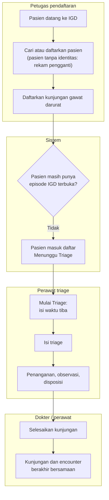

# Alur Utama IGD — dari Loket sampai Episode Berakhir (encounter-first)

| Field | Nilai |
| --- | --- |
| Blueprint | `IGD-BP-001` revisi `6` (`draft`) |
| Dibuat | 22 September 2026 — pass `design-business-module` encounter-first |
| Keputusan | `IGD-DEC-139`, `142`…`148`, `150`…`154` |
| Status | `draft`, **Rencana (belum tersedia)** — alur ini belum berjalan di aplikasi |
| Cakupan | Jalur normal saja. Jalur bercabang dan gagal ada di berkas proses (daftar di bawah) |

Folder `flowcharts/` baru dibuat pada pass ini. Alur IGD yang lebih lama (kepergian, serah terima,
pesanan) masih tergambar di `erd/` — susunan lama yang dipertahankan atas keputusan pemilik 22 September
2026, dicatat sebagai utang struktur di manifest.

| # | Langkah | Pelaku | Masukan | Keluaran | Bila gagal |
| ---: | --- | --- | --- | --- | --- |
| 1 | Cari atau daftarkan pasien | Petugas pendaftaran | Identitas pasien; bila tidak ada identitas, data rekam pengganti | Pasien terpilih | Lihat [pendaftaran-dan-penjaga-episode.md](pendaftaran-dan-penjaga-episode.md) |
| 2 | Daftarkan kunjungan gawat darurat | Petugas pendaftaran | Pasien, penjamin, keluhan utama | Encounter gawat darurat | Episode masih terbuka → proses pendaftaran ganda |
| 3 | Masuk daftar Menunggu Triage | Sistem | Encounter tanpa kunjungan | Baris di daftar, berlabel waktu terdaftar | — |
| 4 | Mulai Triage | Perawat triage | Waktu tiba (terisi awal waktu terdaftar) | Kunjungan IGD lahir, status menunggu triage | Lihat [kelahiran-kunjungan.md](kelahiran-kunjungan.md) |
| 5 | Isi triage, tangani, observasi, disposisi | Perawat, dokter | Pemeriksaan | Kunjungan berjalan sesuai status yang sudah ada | Aturan status kunjungan yang sudah ada |
| 6 | Selesaikan kunjungan | Dokter / perawat | Gerbang penutupan lulus | Kunjungan dan encounter berakhir dalam satu simpan; catatan klinis yang belum ditandatangani terkunci | Lihat [penutupan-encounter.md](penutupan-encounter.md) |

**Berkas proses:**

| Berkas | Proses | Keputusan |
| --- | --- | --- |
| [pendaftaran-dan-penjaga-episode.md](pendaftaran-dan-penjaga-episode.md) | Pendaftaran, pendaftaran ganda, serentak, salah daftar | `IGD-DEC-139`, `144`, `145`, `146`, `151`, `153` |
| [kelahiran-kunjungan.md](kelahiran-kunjungan.md) | Mulai Triage, Tangani Segera, tabrakan keduanya, waktu tiba | `IGD-DEC-143`, `147`, `152` |
| [pergi-sebelum-triage.md](pergi-sebelum-triage.md) | Pasien pergi sebelum ditriage | `IGD-DEC-142` |
| [penutupan-encounter.md](penutupan-encounter.md) | Encounter ikut berakhir bersama kunjungan | `IGD-DEC-139`, `148` |
| [rekonsiliasi-encounter-historis.md](rekonsiliasi-encounter-historis.md) | Membereskan encounter lama yang tertinggal terbuka | `IGD-DEC-148` |
