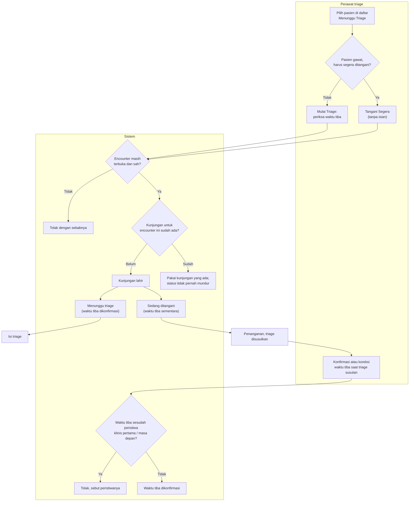

# Kelahiran Kunjungan IGD — Mulai Triage dan Tangani Segera

| Field | Nilai |
| --- | --- |
| Keputusan | `IGD-DEC-139` butir 3, `IGD-DEC-143` (Tangani Segera), `IGD-DEC-147` (waktu tiba), `IGD-DEC-152` (batas koreksi) |
| Status | `draft`, **Rencana (belum tersedia)** |

| # | Langkah | Pelaku | Masukan | Keluaran | Bila gagal / petugas harus |
| ---: | --- | --- | --- | --- | --- |
| 1 | Pilih pasien | Perawat triage | Baris Menunggu Triage (waktu yang tampil = waktu **terdaftar**, bukan waktu tiba) | — | — |
| 2a | Mulai Triage | Perawat triage | Waktu tiba — terisi awal waktu terdaftar, boleh dimundurkan, tidak boleh di masa depan. Opsional: cara datang, jenis kasus, keluhan, penanda pasien tanpa identitas | Kunjungan berstatus menunggu triage; waktu tiba **dikonfirmasi** | Waktu tiba kosong/masa depan → isi ulang |
| 2b | Tangani Segera | Perawat triage | **Tidak ada isian** | Kunjungan langsung berstatus sedang ditangani; waktu tiba **sementara** = waktu terdaftar | — |
| 3 | Periksa encounter | Sistem | — | — | Encounter sudah berakhir → daftarkan ulang; kunjungannya pernah dihapus → daftarkan ulang; pasien punya kunjungan lain yang belum selesai → buka kunjungan itu |
| 4 | Klik ganda / dua perawat bersamaan | Sistem | — | Tetap **satu** kunjungan. Bila salah satunya Tangani Segera, hasil akhirnya sedang ditangani | — |
| 5 | Konfirmasi waktu tiba (sesudah Tangani Segera) | Perawat triage | Waktu tiba sebenarnya | Waktu tiba dikonfirmasi | Lebih lambat dari mulai triage, mulai penanganan, atau penugasan dokter pertama → ditolak dengan nama peristiwanya |

**Contoh tabrakan.** Perawat Ani menekan Mulai Triage, dan dua detik kemudian perawat Budi menekan Tangani
Segera untuk pasien yang sama karena pasien kejang. Hasilnya satu kunjungan berstatus sedang ditangani.
Formulir triage Ani membuka kunjungan yang sama, dan triagenya menjadi triage susulan.
