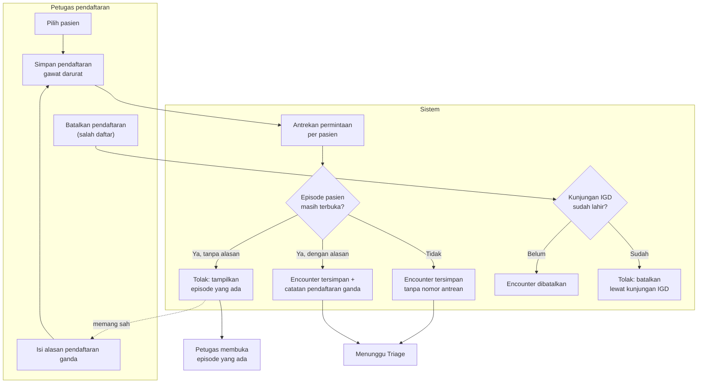

# Pendaftaran Gawat Darurat dan Penjaga Episode

| Field | Nilai |
| --- | --- |
| Keputusan | `IGD-DEC-139` (satu pasien satu episode terbuka), `144` (tanpa antrean), `145` (alasan pendaftaran ganda), `146` (serentak), `151` (pasien tanpa identitas), `153` (salah daftar) |
| Status | `draft`, **Rencana (belum tersedia)** |

| # | Langkah | Pelaku | Masukan | Keluaran | Bila gagal / petugas harus |
| ---: | --- | --- | --- | --- | --- |
| 1 | Pilih pasien | Petugas pendaftaran | Pencarian pasien; bila tanpa identitas: rekam pengganti lewat pendaftaran pasien baru yang sudah ada | Pasien terpilih | Pasien tanpa identitas **tidak** didaftarkan tanpa rekam pasien — rekam pengganti wajib (`IGD-DEC-151`) |
| 2 | Simpan pendaftaran | Petugas pendaftaran | Pasien, penjamin, keluhan utama | Permintaan pendaftaran | — |
| 3 | Antrekan per pasien | Sistem | Identitas pasien | Hanya satu pendaftaran pasien yang sama diproses pada satu waktu | Pendaftaran kedua menunggu sebentar lalu dinilai dengan data terbaru — **bukan** galat |
| 4 | Periksa episode terbuka | Sistem | Encounter gawat darurat yang belum berakhir, kunjungan IGD yang belum selesai | Terbuka / tidak | — |
| 5a | Encounter tersimpan | Sistem | — | Encounter gawat darurat, **tanpa** nomor antrean | — |
| 5b | Tolak | Sistem | — | Pesan menyebut nomor kunjungan atau encounter yang masih terbuka | Petugas membuka episode yang ada; bila pendaftaran kedua memang sah, mengisi alasan |
| 5c | Simpan dengan alasan | Sistem | Alasan (wajib, maks. 500 karakter) | Encounter + catatan pendaftaran ganda (siapa, kapan, alasan, episode yang dilangkahi) dalam satu simpan | Gagal menulis catatan → encounter **tidak** tersimpan; petugas mengulang |
| 6 | Batalkan pendaftaran | Petugas pendaftaran | Alasan pembatalan | Encounter batal — **hanya** bila kunjungan IGD belum lahir | Kunjungan sudah lahir → petugas meminta perawat membatalkan lewat kunjungan IGD; encounter ikut batal |

**Contoh.** Pukul 09.40 dua petugas menyimpan pendaftaran Pak Rayyan hampir bersamaan. Permintaan kedua
menunggu permintaan pertama selesai, lalu melihat encounter yang baru terbentuk dan ditolak dengan nomor
encounter itu. Hanya ada satu encounter.
