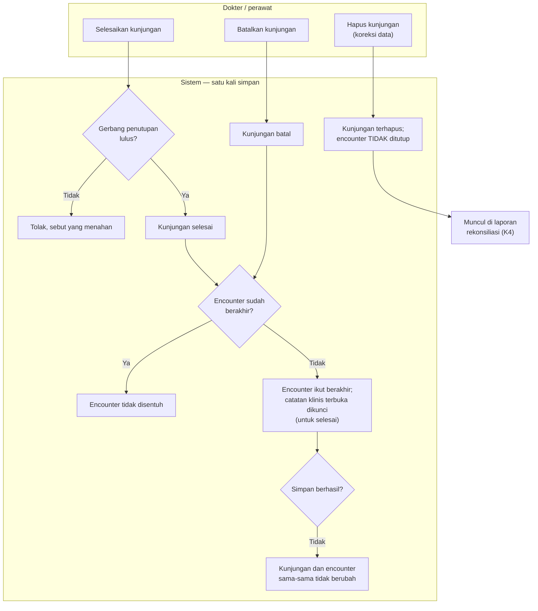

# Encounter Ikut Berakhir Bersama Kunjungan IGD

| Field | Nilai |
| --- | --- |
| Keputusan | `IGD-DEC-139` butir 5; `IGD-DEC-148` (TK-1: hapus kunjungan tidak menutup encounter; TK-2: encounter rawat jalan lama yang tertaut ikut ditutup); `IGD-DEC-153` |
| Status | `draft`, **Rencana (belum tersedia)** |

| # | Langkah | Pelaku | Masukan | Keluaran | Bila gagal / petugas harus |
| ---: | --- | --- | --- | --- | --- |
| 1 | Selesaikan kunjungan | Dokter / perawat | Gerbang penutupan yang sudah ada | Kunjungan selesai **dan** encounter selesai, catatan klinis yang belum ditandatangani terkunci | Gerbang menolak → selesaikan yang menahan (observasi, perpindahan, pesanan) |
| 2 | Batalkan kunjungan | Perawat | Catatan pembatalan | Kunjungan batal **dan** encounter batal | — |
| 3 | Encounter sudah berakhir | Sistem | — | Tidak ditimpa — waktu, pelaku, alasan lama tetap | — |
| 4 | Simpan gagal | Sistem | — | Tidak ada yang berubah di kedua sisi | Petugas mengulang |
| 5 | Hapus kunjungan | Petugas berwenang | — | Encounter **tetap** terbuka | Diselesaikan manusia lewat laporan rekonsiliasi |

**Contoh.** Kunjungan IGD-0007 diselesaikan pukul 13.10. Sebelum desain ini, encounter-nya tetap
"terdaftar" selamanya dan pasien itu kelak ditolak penjaga episode. Sesudahnya, keduanya berakhir pukul
13.10 dalam satu simpan.
