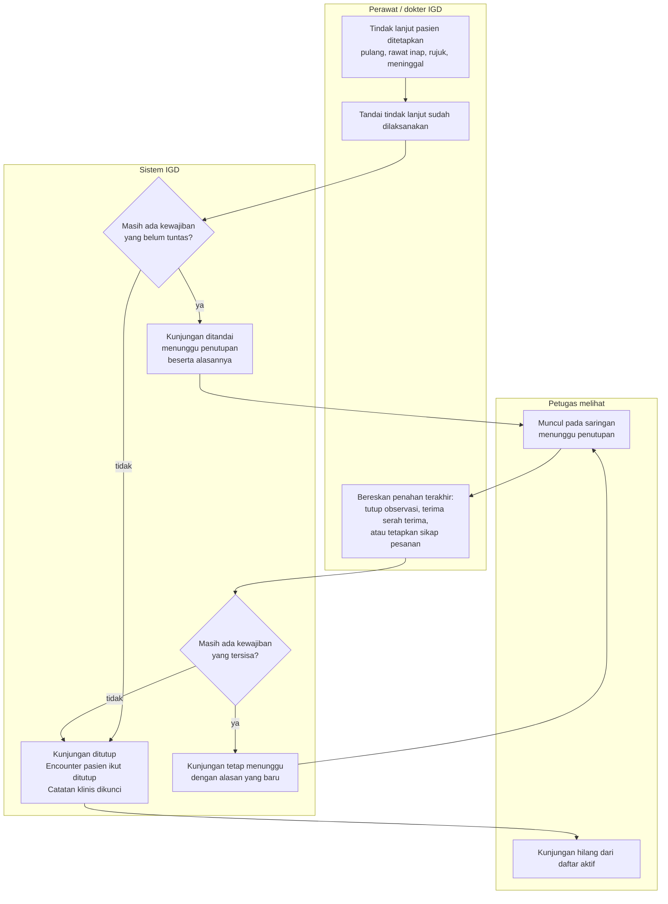

# Alur proses — penutupan kunjungan lewat disposisi yang dilaksanakan

Sumber keputusan: `IGD-DEC-163`…`169` (amendment pass 23 September 2026). Status: `draft`,
**Rencana (belum tersedia)**.

Alur ini menjawab satu pertanyaan sehari-hari: **kapan kunjungan IGD pasien dianggap selesai?** Sebelumnya
jawabannya "kalau petugas ingat menekan tombol selesaikan". Sesudah slice ini, jawabannya "begitu tindak lanjutnya
benar-benar dilaksanakan dan seluruh kewajiban klinisnya tuntas".

## Tabel langkah

| # | Langkah | Pelaku | Masukan | Keluaran | Bila gagal |
| ---: | --- | --- | --- | --- | --- |
| 1 | Menetapkan tindak lanjut pasien | Dokter atau perawat IGD | Jenis tindak lanjut | Tindak lanjut tercatat, belum dilaksanakan | Ulangi pencatatan; kunjungan belum terpengaruh |
| 2 | Menandai tindak lanjut sudah dilaksanakan | Perawat IGD | Tindak lanjut yang sudah ditetapkan | Kunjungan berpindah ke keadaan "keputusan sudah ditetapkan", lalu sistem mencoba menutupnya | Bila penandaan ditolak karena alasan lain, kunjungan tidak berubah sama sekali |
| 3 | Sistem memeriksa kewajiban yang tersisa | Sistem | Observasi aktif, serah terima menggantung, pesanan yang belum disikapi | Boleh ditutup, atau daftar alasan penahan | — |
| 4a | Menutup kunjungan | Sistem, atas nama petugas langkah 2 | — | Kunjungan selesai, encounter pasien ikut tertutup, catatan klinis yang belum ditandatangani dikunci | Seluruh penyimpanan batal; petugas mengulang langkah 2 |
| 4b | Menandai menunggu penutupan | Sistem | Alasan penahan | Kunjungan muncul pada saringan "menunggu penutupan" beserta alasannya | — |
| 5 | Membereskan penahan terakhir | Perawat atau petugas terkait | Observasi, serah terima, atau pesanan | Penahan itu tuntas, lalu sistem mencoba menutup lagi | Bila penyimpanan gagal, penahan tetap ada dan kunjungan tetap menunggu |
| 6 | Kunjungan tertutup menyusul | Sistem, atas nama petugas langkah 5 | — | Sama dengan langkah 4a, dan asal penutupannya menunjuk tindak lanjut dari langkah 2 | Sama dengan langkah 4a |

## Jalur pengecualian

| Keadaan | Yang terjadi | Yang harus dilakukan petugas |
| --- | --- | --- |
| Petugas ingin membatalkan tindak lanjut padahal kunjungan sudah selesai | Ditolak | Daftarkan pasien sebagai episode baru bila ia kembali |
| Pasien butuh pemeriksaan laboratorium atau darah sesudah kunjungan tertutup | Ditolak modul yang bersangkutan | Daftarkan episode baru; episode lama memang sudah berakhir |
| Kunjungan sudah tertutup lebih dulu lewat aksi selesaikan kunjungan manual | Percobaan penutupan dilewati tanpa galat | Tidak ada yang perlu dilakukan |
| Penahan baru muncul sesudah kunjungan tertutup | Ditolak jalurnya masing-masing | Daftarkan episode baru bila memang dibutuhkan |
