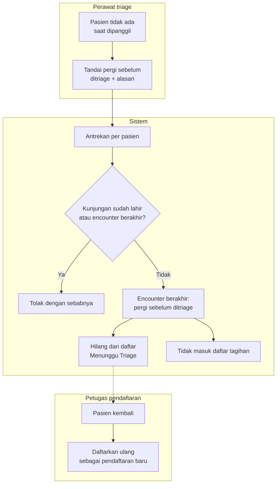

# Pasien Pergi Sebelum Ditriage

| Field | Nilai |
| --- | --- |
| Keputusan | `IGD-DEC-142`; asumsi `IGD-ASM-001` (kriteria = alasan wajib, tanpa jumlah panggilan minimum — wajib ditinjau Clinical Governance + Nursing authority) |
| Status | `draft`, **Rencana (belum tersedia)** |

| # | Langkah | Pelaku | Masukan | Keluaran | Bila gagal / petugas harus |
| ---: | --- | --- | --- | --- | --- |
| 1 | Tandai pergi | Perawat triage | Alasan (wajib, maks. 500 karakter) | Permintaan | Alasan kosong → isi alasan |
| 2 | Antrekan per pasien | Sistem | — | Mencegah tanda "pergi" dan "Mulai Triage" terjadi bersamaan pada pasien yang sama | — |
| 3 | Periksa | Sistem | — | — | Kunjungan sudah lahir → tutup lewat kunjungan; encounter sudah berakhir → tidak ada yang perlu dilakukan |
| 4 | Encounter berakhir | Sistem | — | Status pergi sebelum ditriage, beserta siapa, kapan, alasan | — |
| 5 | Tagihan | Sistem | — | Tidak ditagih | — |
| 6 | Pasien kembali | Petugas pendaftaran | Pendaftaran baru | Encounter baru — **tanda pergi tidak dapat dibatalkan** | — |

**Yang belum diputuskan dan tidak digambar.** Kewajiban menghubungi pasien berisiko yang pergi, dan jumlah
panggilan minimum sebelum ditandai, menunggu peninjauan Clinical Governance (`IGD-DEC-150`).
