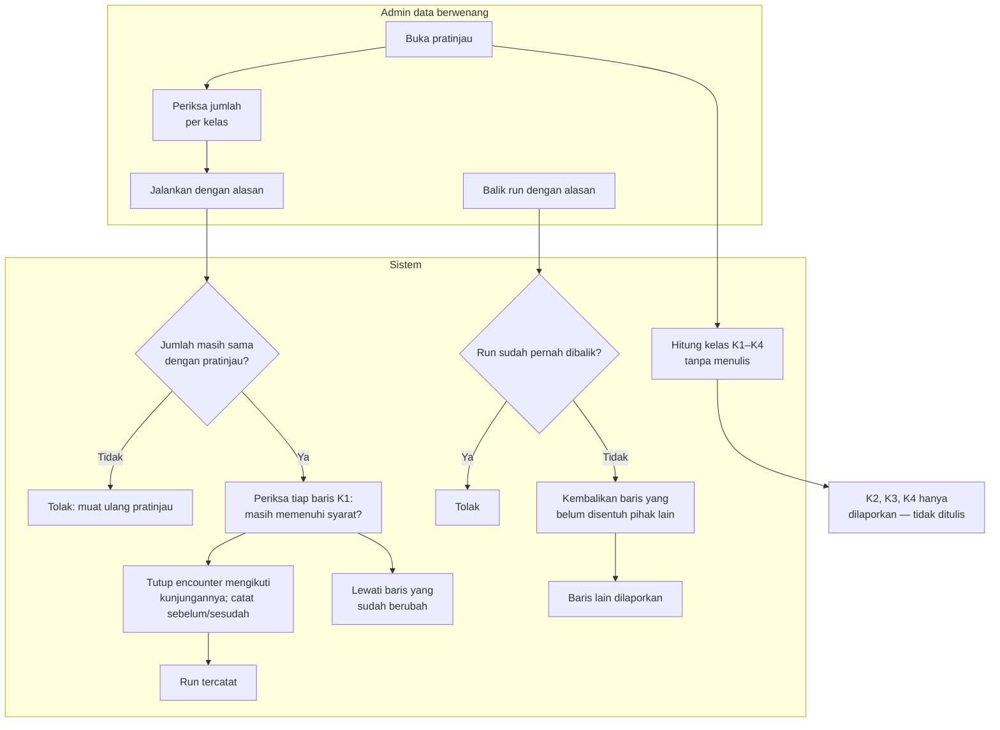

# Rekonsiliasi Encounter Gawat Darurat Historis

| Field | Nilai |
| --- | --- |
| Keputusan | `IGD-DEC-148` (preview + execute; K1–K4 disahkan; hanya K1 dieksekusi; dapat dibalik) |
| Status | `draft`, **Rencana (belum tersedia)** |
| Prasyarat | Penutupan otomatis (penutupan-encounter.md) sudah berjalan, supaya tidak ada K1 baru |

| # | Langkah | Pelaku | Masukan | Keluaran | Bila gagal / petugas harus |
| ---: | --- | --- | --- | --- | --- |
| 1 | Pratinjau | Admin data | — | Jumlah K1, K1 rawat jalan tertaut, K2, K3, K4; daftar baris K1 | — |
| 2 | Jalankan | Admin data | Alasan; jumlah yang dilihat di pratinjau | Encounter K1 ditutup mengikuti kunjungannya; waktu selesai hanya dari catatan kunjungan (kosong bila tidak ada) | Jumlah berubah sejak pratinjau → muat ulang pratinjau |
| 3 | Baris yang berubah di tengah jalan | Sistem | — | Dilewati | — |
| 4 | K2, K3, K4 | Sistem | — | Dilaporkan saja. K3 ditindaklanjuti manusia per baris sesudah audit referensi | — |
| 5 | Balik run | Admin data | Alasan | Baris yang masih bernilai hasil run dikembalikan; baris yang sudah disentuh pihak lain dilewati dan dilaporkan | Run sudah dibalik → tidak dapat dibalik lagi |

**Kelas** (evidence `2026-09-22-desain-encounter-first.md` bagian 6, disahkan `IGD-DEC-148`): K1 — kunjungan
sudah selesai/batal tetapi encounter masih terbuka; K2 — kunjungan masih berjalan; K3 — tanpa kunjungan sama
sekali; K4 — satu-satunya kunjungan dihapus lunak. Subkelas K1 rawat jalan = encounter bertipe rawat jalan
masa transisi yang tertaut kunjungan IGD.
