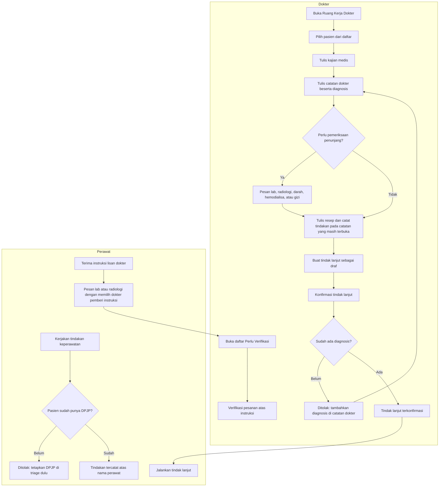

# Alur Proses — Ruang Kerja Dokter IGD

| Field | Nilai |
| --- | --- |
| Status | `approved` (`IGD-DEC-230`, Rizki Gunawan, 6 Oktober 2026) — Rencana (belum tersedia) |
| Sumber | `IGD-DEC-220`…`229` (6 Oktober 2026) |
| Pelaku | Dokter IGD, Perawat IGD, modul klinis dan penunjang |

Alur ini dimulai saat pasien sudah berada di IGD (sesudah pendaftaran dan triage) dan berakhir saat dokter mengonfirmasi
tindak lanjut. Pelaksanaan tindak lanjut dan penutupan kunjungan mengikuti
[penutupan-lewat-disposisi.md](penutupan-lewat-disposisi.md).

| Langkah | Pelaku | Masukan | Keluaran | Bila gagal |
| --- | --- | --- | --- | --- |
| Pilih pasien | Dokter | Saringan *Pasien saya* atau *Semua pasien IGD* | Kartu pasien dan enam tab | Daftar gagal dimuat: tekan *Coba lagi*; pasien tidak ada di *Pasien saya*: ganti saringan |
| Kajian medis | Dokter | Isian kajian | Kajian medis awal atau kajian ulang | Kajian awal sudah ada: buka kajian itu atau buat kajian ulang. Kunjungan berakhir: koreksi lewat addendum |
| Catatan dokter dan diagnosis | Dokter | SOAP, diagnosis ICD-10 | Catatan draf; terkunci sesudah diselesaikan | Catatan terkunci perlu dikoreksi: tambah addendum dari *Catatan Saya* |
| Pesan penunjang | Dokter | Jenis dan isi pesanan | Pesanan di modul penunjang | Modul menolak (misalnya unit belum berizin memesan darah): baca pesan modul, hubungi pemilik data master |
| Resep dan tindakan dokter | Dokter | Resep, tindakan | Resep dan tindakan pada catatan terbuka | Tidak ada catatan terbuka: buat atau buka catatan dokter lebih dulu |
| Tindak lanjut | Dokter | Jenis tindak lanjut | Draf, lalu terkonfirmasi | Ditolak karena belum ada diagnosis: tambahkan diagnosis lalu konfirmasi ulang |
| Tindakan keperawatan | Perawat | Tindakan yang sudah dikerjakan | Tindakan tercatat, DPJP sebagai dokter penanggung jawab | Belum ada DPJP: minta DPJP ditetapkan di triage. Kunjungan berakhir: tindakan tidak dapat dicatat lagi |
| Pesanan atas instruksi | Perawat | Dokter pemberi instruksi, isi pesanan | Pesanan menunggu verifikasi dokter | Dokter tidak aktif: pilih dokter lain. Bank darah, hemodialisa, gizi: minta dokter memesan dari layarnya |
| Verifikasi | Dokter | Daftar *Perlu Verifikasi* | Pesanan terverifikasi | Modul menolak: baca pesannya |
| Jalankan tindak lanjut | Perawat | Tindak lanjut terkonfirmasi | Tindak lanjut dilaksanakan; penutupan kunjungan mengikuti alur penutupan | Mengikuti alur penutupan |
