# Roadmap Delivery Backend — Modul IGD

## Metadata

```yaml
module_id: igd
roadmap_revision: 3
wave: "Dikoreksi 2026-09-15: MVP-1, MVP-2, dan R3.7 selesai; MVP-0, MVP-3, MVP-4, MVP-5 sebagian; MVP-6 terblokir BE-IGD-039. Klaim lama 'MVP-0..MVP-5 selesai' tidak akurat — lihat evidence/2026-09-15-pemeriksaan-status.md bagian 8"
status: ACTIVE
status_synced_at: "2026-09-15 — pemetaan ulang acceptance criteria pada backend e89907c5; IGD-DEC-110 sampai IGD-DEC-115"
planning_updated_at: "2026-09-22 (penutup) — plan-module-delivery FINAL (docs saja) pada source backend 0d13f3a8 (dokumen di commit 69953e98, source tidak berubah): R3.13 diselaraskan dengan IGD-DEC-142 sampai IGD-DEC-162 dan kontrak encounter-first yang disetujui IGD-DEC-157 (API 0.11.0 §8, validation 0.8.0 §10, state 0.5.0 §8, integration 0.4.0 §5, permission/audit 0.5.0 §7); BE-IGD-057 sampai BE-IGD-059 ditambahkan; BE-IGD-056 tetap ⛔ S7 (IGD-OQ-102/103); kandidat tautkan identitas U1 dibatalkan (IGD-DEC-151); IGD-OQ-108 dibuka (tidak menahan). Sebelumnya 2026-09-22 — plan-module-delivery (MODULE BLUEPRINT MODE, docs saja) pada backend 0d13f3a8: R3.13 BE-IGD-051 sampai BE-IGD-056 ditambahkan (encounter-first); IGD-DEC-139 sampai IGD-DEC-141; IGD-OQ-093 ditutup [DIKOREKSI 22 Sep penutup: superseded sebagian, realisasi di BE-IGD-053]; IGD-OQ-094 sampai IGD-OQ-101 dibuka; evidence 2026-09-22-desain-encounter-first.md. Sebelumnya 2026-09-15 (kedua) — plan-module-delivery pada backend 7b0c2ece: BE-IGD-040 sampai BE-IGD-045 ditambahkan, tindak lanjut BE-IGD-017; IGD-DEC-116 sampai IGD-DEC-121. Revision roadmap tetap 3 — task baru ditambahkan tanpa mengubah task lama"
generated_at: "2026-08-24"
activated_at: "2026-08-26"
revision_3_at: "2026-08-26"
revision_3_1_at: "2026-08-27"
scope: >
  Revision 2 hanya MVP-0 (EPIC IGD-03). Revision 3 memperluas ke perjalanan pasien penuh
  atas permintaan owner: pendaftaran & triase, pengkajian sampai tuntas, dan kepergian
  pasien. Penunjang medis, pemakaian alat, dan billing IGD SENGAJA belum direncanakan —
  ketiganya belum punya blueprint. Lihat bagian R3.5.
owners:
  - "Product/Domain Owner IGD — Rizki Gunawan (IGD-DEC-089)"
approved_by:
  - "Rizki Gunawan / 2026-08-26 — IGD-DEC-094, eksekusi gelombang MVP-0"
input_revisions:
  blueprint-manifest.md: 5
  00-interview-decisions.md: "91 keputusan, sampai IGD-DEC-093"
  01-existing-capability-map.md: 3
  04-prd-to-mvp.md: 5
contract_versions:
  - "State 0.4.0 — bagian 1, 1.1, 1.2 APPROVED (IGD-DEC-093)"
  - "Validation 0.4.0 — bagian 2 aturan 4-5 APPROVED (IGD-DEC-093)"
  - "API 0.4.0 — draft, TIDAK dipakai gelombang ini"
  - "Integration 0.3.0 — draft, TIDAK dipakai gelombang ini"
  - "Permission/Audit 0.4.0 — draft, TIDAK dipakai gelombang ini"
  - "R3.13 (22 Sep 2026 penutup): API 0.11.0 §8, validation 0.8.0 §10, state 0.5.0 §8, integration 0.4.0 §5, permission/audit 0.5.0 §7 — bagian encounter-first APPROVED (IGD-DEC-157), terkunci hash di contract_hashes_r313"
contract_hashes_r313:
  contracts/api-contract.md: "c0bcea54125879e328a1b4f28cfcc6adaa5356a7272316cb4dd56a6a8b9fcedd"
  contracts/validation-matrix.md: "580832c37db3f3a1b73b03b6a366d5d5108ee745e4c408ece53b01034d98b504"
  contracts/state-transition-matrix.md: "0661fdf4326f927425828afa42ce71c69ed8a030c599d17eb9063d44d2e6a793"
  contracts/integration-contract.md: "46c869830a078bc2288005cae9b16b44970ccd9bfa6b38c80b01ced249683d53"
  contracts/permission-audit-matrix.md: "597b8f5ef0e8cbed6963c98374508a80726d652ac4dfa3c2bb99eccef4dec662"
artifact_hashes:
  00-interview-decisions.md: "43ba0661bf30d0bd626bca8d4592abbfb6a334fe18dffeaba2d9d4ad1bbb7fb0"
  02-backend-architecture.md: "20fcaad625ab52b7058f751cad96c8732d234264d1d94a28b1f1ccd6f3aa6753"
  04-prd-to-mvp.md: "7061525001d9a7e6b311424b8e3a8d85de13e35f59e545a78dcefedd600b79db"
  contracts/state-transition-matrix.md: "a41efd8d9adc87e1cf1eec2a9397b3521fdc0ebf935ccf0a19a5aa975b6c7c75"
  contracts/validation-matrix.md: "0ee98b750a29e01603db894ed3766614fe8989b2eef3573eab7d72cdc1a6b907"
  testing/acceptance-test-matrix.md: "0795daa024928a583b3b7ca4ef75e15abedac5f7c937814c14dec6a3ad392b8e"
source_commits:
  backend: "300922c — merge Hamzah/Ikbal/Yasmina; bukti bagian 2 diperiksa ulang 2026-08-26"
  backend_at_authoring: "f69e9e483052845d11c91d8b7bbdce33c4acc8d8"
  frontend: "96a9120111f6acc6b7c0f37973ea0c717ba41f17"
  backend_r313: "0d13f3a8 — source yang diaudit untuk R3.13; commit dokumen 69953e98 sesudahnya tidak mengubah source"
  frontend_r313: "c941012ac (RizkiV2)"
supersedes: "roadmap/archive/revision-1/backend-roadmap.md"
```

Revision `1` **tidak dihapus**. Seluruh isinya ada di `roadmap/archive/revision-1/`, dan task
`BE-IGD-001` sampai `BE-IGD-016` yang sudah selesai tetap berlaku sebagai riwayat.

**Arti tanda status pada dokumen ini.**

| Tanda | Artinya |
| :---: | --- |
| ✅ | Selesai. Acceptance criteria dan DoD **terbukti**, buktinya ada pada laporan task |
| 🟡 | Sebagian. Source-nya sudah ada, tetapi acceptance criteria belum terbukti penuh. **Belum selesai** |
| ⛔ | Terblokir. Prasyaratnya belum terpenuhi, dan task **tidak boleh dimulai** |
| tanpa tanda | Belum dikerjakan |

> **Penandaan 15 September 2026.** Tanda pada roadmap ini dipasang setelah setiap acceptance
> criteria dipetakan ulang ke source backend `e89907c5`. Tiga keputusan menjadi dasarnya:
> `IGD-DEC-110` (angka test lama sah sebagai bukti historis; automated test bukan lagi
> acceptance criterion), `IGD-DEC-113` (laporan gabungan lama diterima), dan `IGD-DEC-114`
> (`MVP-5` belum selesai). Rincian per task:
> [evidence/2026-09-15-pemeriksaan-status.md](../evidence/2026-09-15-pemeriksaan-status.md)
> bagian 8.2.

## Grafik Urutan Dependency

Roadmap ini memuat **43 task** menurut *Register status task* (22 September 2026 penutup: 40 baris + `BE-IGD-057`…`059`; sebelumnya 22 September 2026: 34 baris + `BE-IGD-051`…`056`. Angka `35` yang tertulis sebelumnya selisih satu dari register dan dikoreksi hari ini; sebelumnya dikoreksi 21 September 2026 — angka `23` tertinggal sejak `BE-IGD-040`
ditambahkan), melewati batas 15 node untuk satu grafik. Karena itu grafik dipecah:
satu **grafik ringkasan antar-gelombang** di bawah ini, lalu satu grafik per gelombang yang
diletakkan di bawah judul gelombangnya — bagian 4 (`MVP-0`), R3.2 (`MVP-1`/`MVP-2`), R3.3
(`MVP-3`), R3.4 (`MVP-4`/`MVP-5`), R3.7, R3.12, dan R3.13.

Panah **antar-gelombang** hanya digambar pada grafik ringkasan. Tiga dependency task yang
melintasi gelombang terwakili di sana:

| Dependency pada kartu | Diwakili panah ringkasan |
| --- | --- |
| `BE-IGD-023` menunggu *"`MVP-0` selesai"* | `MVP0 --> MVP1` |
| `BE-IGD-026` dan `BE-IGD-030` menunggu `BE-IGD-024` | `MVP1 --> MVP3` |
| `BE-IGD-031` menunggu *"`MVP-1`"* | `MVP1 --> MVP4` |
| `BE-IGD-049` menunggu `BE-IGD-033` dan `BE-IGD-034` (`MVP-4`) | `MVP4 --> R312` |
| `BE-IGD-050` menunggu `BE-IGD-023` (`MVP-1`) dan `BE-IGD-025` (`MVP-2`) | `MVP2 --> R312` |
| `BE-IGD-051` menunggu `BE-IGD-022` (`MVP-0`) | `MVP0 --> R313` |
| `BE-IGD-051` menunggu `BE-IGD-024` (`MVP-1`) | `MVP1 --> R313` |
| `BE-IGD-055` menunggu `BE-IGD-025` (`MVP-2`) | `MVP2 --> R313` |
| `BE-IGD-053` menunggu `BE-IGD-050` (R3.12) | `R312 --> R313` |
| `BE-IGD-056` menunggu `BE-IGD-045` (`EPIC IGD-04` pada `MVP-5`) | `MVP5 --> R313S7` |

*Diselaraskan 22 September 2026 (penutup):* R3.13 dipecah menjadi dua node ringkasan — `R313` (`EPIC IGD-11`,
delapan task, tidak tertahan keputusan) dan `R313S7` (`EPIC IGD-12`, `BE-IGD-056`, ditahan `IGD-OQ-102`/`103`).
Node gerbang lama *"kueri D, E1–E3, IGD-OQ-094…101"* dihapus: `IGD-OQ-094`…`101` sudah `superseded`, kueri D
bukan lagi blocker pengembangan, dan E1–E3 kini bagian dari `IGD-OQ-102`. Blocker `S7` ditulis pada label node
`R313S7` supaya grafik tetap 15 node.

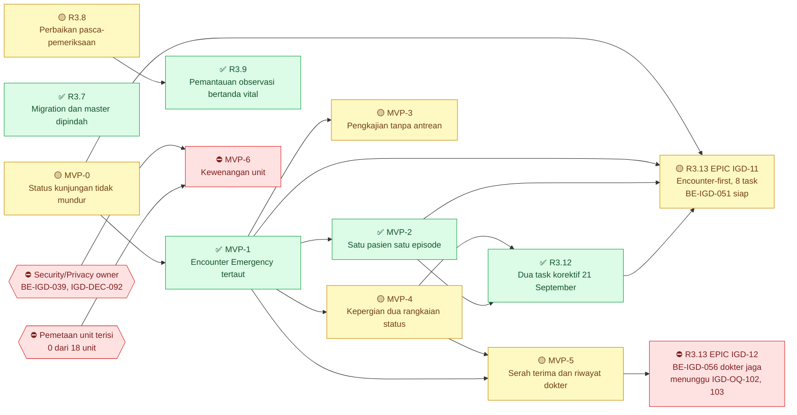

> **Panah `MVP1 --> MVP5` ditambahkan 15 September 2026.** `MVP-5` berisi dua epic dengan
> prasyarat berbeda: `EPIC IGD-07` (serah terima) menunggu kepergian pasien (`MVP-4`), sedangkan
> `EPIC IGD-04` (riwayat dokter, `BE-IGD-044`) hanya menunggu kunjungan yang tertaut encounter
> (`MVP-1`). Tanpa pemisahan ini, riwayat dokter ikut tertahan uji langkah mundur migration
> `BE-IGD-031` yang tidak ada hubungannya.

| Gelombang | Boleh mulai setelah | Isi |
| ---: | --- | --- |
| 1 | — | `MVP-0`; R3.7 dan R3.8 (tanpa dependency antar-gelombang) |
| 2 | `MVP-0` | `MVP-1` |
| 3 | `MVP-1` | `MVP-2`, `MVP-3`, `MVP-4`; `EPIC IGD-04` pada `MVP-5` — boleh paralel |
| 4 | `MVP-4` | `EPIC IGD-07` pada `MVP-5` |
| 2 | R3.8 (`BE-IGD-040` ✅) | R3.9 — `BE-IGD-046` ✅ |
| 4 | `MVP-2` dan `MVP-4` (task prasyarat `BE-IGD-023`, `025`, `033`, `034` sudah ✅ — boleh mulai begitu pemilik menyetujui laporan rencana) | R3.12 — `BE-IGD-049`, `BE-IGD-050`, boleh paralel |
| 5 | `MVP-0`, `MVP-1`, `MVP-2`, R3.12 — seluruh task prasyaratnya sudah ✅ | R3.13 `EPIC IGD-11` — `BE-IGD-051` boleh mulai begitu pemilik memberi go-ahead; tujuh task lainnya berurutan di belakangnya (empat gelombang internal, rincian di bagian R3.13.4) |
| — | ⛔ menunggu `IGD-OQ-102` dan `IGD-OQ-103` | R3.13 `EPIC IGD-12` — `BE-IGD-056` |
| — | ⛔ menunggu Security/Privacy owner dan pemetaan unit | `MVP-6` |

### Register status task

| Task | Judul | Gelombang | Status | Laporan |
| --- | --- | --- | --- | --- |
| `BE-IGD-017` | Pulihkan solution | `MVP-0` | 🟡 laporan tracked tidak ada | — (hasil hanya pada kartu) |
| `BE-IGD-018` | Penjaga transisi status terpusat | `MVP-0` | ✅ | [be-igd-018](../task/report/backend/be-igd-018-penjaga-transisi-status-kunjungan.md) |
| `BE-IGD-019` | Jalur triase memakai penjaga | `MVP-0` | ✅ | [be-igd-019](../task/report/backend/be-igd-019-jalur-triase-tidak-memundurkan-status.md) |
| `BE-IGD-020` | Penilaian ulang menolak kunjungan `Completed` | `MVP-0` | ✅ | [be-igd-020](../task/report/backend/be-igd-020-penilaian-ulang-kunjungan-tertutup.md) |
| `BE-IGD-021` | Lima titik tulis sisanya memakai penjaga | `MVP-0` | ✅ | [be-igd-021-035](../task/report/backend/be-igd-021-035-penyelesaian-perjalanan-pasien.md) |
| `BE-IGD-022` | Penyelesaian kunjungan lewat penjaga | `MVP-0` | ✅ | [be-igd-021-035](../task/report/backend/be-igd-021-035-penyelesaian-perjalanan-pasien.md) |
| `BE-IGD-023` | Kunjungan IGD menerima `Emergency` | `MVP-1` | ✅ | [be-igd-021-035](../task/report/backend/be-igd-021-035-penyelesaian-perjalanan-pasien.md) |
| `BE-IGD-024` | Penghubung kunjungan ke encounter | `MVP-1` | ✅ | [be-igd-021-035](../task/report/backend/be-igd-021-035-penyelesaian-perjalanan-pasien.md) |
| `BE-IGD-025` | Satu pasien satu episode aktif | `MVP-2` | ✅ | [be-igd-021-035](../task/report/backend/be-igd-021-035-penyelesaian-perjalanan-pasien.md) |
| `BE-IGD-026` | `QueueId` pengkajian opsional | `MVP-3` | 🟡 1 dari 3 kriteria belum | [be-igd-021-035](../task/report/backend/be-igd-021-035-penyelesaian-perjalanan-pasien.md) |
| `BE-IGD-027` | Pengkajian tanpa antrean | `MVP-3` | ✅ | [be-igd-021-035](../task/report/backend/be-igd-021-035-penyelesaian-perjalanan-pasien.md) |
| `BE-IGD-028` | Konsultasi dokter tanpa antrean | `MVP-3` | ✅ | [be-igd-021-035](../task/report/backend/be-igd-021-035-penyelesaian-perjalanan-pasien.md) |
| `BE-IGD-029` | Resep IGD | `MVP-3` | ✅ | [be-igd-021-035](../task/report/backend/be-igd-021-035-penyelesaian-perjalanan-pasien.md) |
| `BE-IGD-030` | Empat tabel klinis bekerja | `MVP-3` | ✅ | [be-igd-021-035](../task/report/backend/be-igd-021-035-penyelesaian-perjalanan-pasien.md) |
| `BE-IGD-031` | Transfer menjadi Departure | `MVP-4` | 🟡 1 dari 4 kriteria belum | [be-igd-021-035](../task/report/backend/be-igd-021-035-penyelesaian-perjalanan-pasien.md) |
| `BE-IGD-032` | Dua kolom status kepergian | `MVP-4` | ✅ | [be-igd-021-035](../task/report/backend/be-igd-021-035-penyelesaian-perjalanan-pasien.md) |
| `BE-IGD-033` | Kejadian kepergian tambah-saja | `MVP-4` | ✅ | [be-igd-021-035](../task/report/backend/be-igd-021-035-penyelesaian-perjalanan-pasien.md) |
| `BE-IGD-034` | Entri susulan, koreksi, pembalikan | `MVP-4` | ✅ | [be-igd-021-035](../task/report/backend/be-igd-021-035-penyelesaian-perjalanan-pasien.md) |
| `BE-IGD-035` | Sikap atas pesanan yang belum selesai | `MVP-5` | 🟡 kriteria 2 terpenuhi 16 September 2026 lewat `BE-IGD-041`; tersisa kewenangan unit tujuan yang menunggu `BE-IGD-039` | [be-igd-021-035](../task/report/backend/be-igd-021-035-penyelesaian-perjalanan-pasien.md) |
| `BE-IGD-036` | Migration diterapkan, simpan pengkajian terbukti | R3.7 | ✅ | [be-igd-036-039](../task/report/backend/be-igd-036-039-penerapan-migration-pemindahan-master-dan-audit-kesiapan.md) |
| `BE-IGD-037` | Master data IGD pindah modul | R3.7 | ✅ | [be-igd-036-039](../task/report/backend/be-igd-036-039-penerapan-migration-pemindahan-master-dan-audit-kesiapan.md) |
| `BE-IGD-038` | Dua kolom respons daftar | R3.7 | ✅ | [be-igd-036-039](../task/report/backend/be-igd-036-039-penerapan-migration-pemindahan-master-dan-audit-kesiapan.md) |
| `BE-IGD-039` | Kewenangan unit beda domain identitas | `MVP-6` | ⛔ Security/Privacy owner | [be-igd-036-039](../task/report/backend/be-igd-036-039-penerapan-migration-pemindahan-master-dan-audit-kesiapan.md) |
| `BE-IGD-040` | Kesimpulan observasi tersimpan | R3.8 | ✅ 15 September 2026 — implementasi; build dan runtime belum diverifikasi | [BE-IGD-040](../task/report/backend/BE-IGD-040.md) |
| `BE-IGD-041` | Penolakan penutupan menyebut pesanan | R3.8 | 🟡 16 September 2026 — implementasi selesai, ketujuh kriteria terpetakan; `dotnet build` dan uji API belum dijalankan | [BE-IGD-041](../task/report/backend/BE-IGD-041.md) |
| `BE-IGD-042` | Encounter `Outpatient` ditolak | R3.8 | ⛔ menunggu konfirmasi data owner | — |
| `BE-IGD-043` | Laporan susulan pengaturan IGD tersirat | R3.8 | tanpa tanda — direncanakan | — |
| `BE-IGD-044` | Histori penugasan dokter IGD | `MVP-5` | ✅ **21 September 2026** — migration diterapkan Rizki 17 September. Acceptance 1, 2, 3, dan 6 ✅ (snapshot +102 baris, nol penghapusan). Acceptance 4 dikerjakan `BE-IGD-048` ✅ (terbukti pada salinan berkandidat). **Acceptance 5 ✅ 21 September 2026** — `Down` migration asli diuji di basis data terpisah: 628 → 627 tabel, nol perubahan pada tabel lain, `Up` kembali identik ([bukti](../evidence/2026-09-21-uji-down-migration-be-igd-044.md)). Tanpa UAT | [BE-IGD-044](../task/report/backend/BE-IGD-044.md) |
| `BE-IGD-045` | Penetapan, pengalihan, dan pencarian dokter aktif | `MVP-5` | ✅ **17 September 2026** — Implementation Complete, Build Verified, Runtime Verified. Build nol error; **12 dari 12 skenario uji API `PASS`** termasuk concurrency S12. Tanpa UAT | [BE-IGD-045](../task/report/backend/BE-IGD-045.md) |
| `BE-IGD-048` | Pengisian data lama penugasan dokter IGD | `MVP-5` | ✅ **21 September 2026** — Implementation Complete, Build Verified (`0 Error(s)`, 207 warning), Migration Applied (dev, `20260921032943`), Data Migration Verified. Kriteria A–E terbukti pada **salinan basis data terpisah** berkandidat (3 tersisip) dan pada dev (0 tersisip, dev 0 kandidat); siklus `Up→Down→Up`, guard `Down()` A dan C (atomik), dan idempotensi diuji; probe service asli membuktikan `"Data historis"` dalam satu kueri. **Tidak dijalankan:** uji HTTP dengan token, tampilan layar baris legacy. Tanpa UAT | [BE-IGD-048](../task/report/backend/BE-IGD-048.md) |
| `BE-IGD-046` | Validasi dan proyeksi tanda vital pada detail observasi | R3.9 | ✅ 16 September 2026 — implementasi + build bersih (nol error); runtime belum diverifikasi | [BE-IGD-046](../task/report/backend/BE-IGD-046.md) |
| `BE-IGD-049` | Nama pelaku pada event kepergian (`IGD-DEC-137`) | R3.12 | ✅ **22 September 2026 — atas penilaian pemilik.** Implementation Complete, **Build Verified** (`0 Error(s)`, 207 warning = baseline); kontrak `0.9.0`. Jalur `GET` daftar terbukti lewat layar `FE-IGD-017` 21 September (pelaku `SuperAdmin`). **S2–S5 (`amend`, `reverse`, pelaku tidak ada, satu kueri) dijalankan pemilik dan dilaporkan lulus** — badan respons dan log SQL tidak dilampirkan, jadi hitungan kueri acceptance 5 tidak tercatat sebagai angka. Tanpa UAT | [BE-IGD-049](../task/report/backend/BE-IGD-049.md) |
| `BE-IGD-050` | Pra-cek episode ganda sebelum encounter dibuat — **korektif** encounter yatim (`IGD-DEC-138`) | R3.12 | ✅ **21 September 2026 (malam) — atas penilaian pemilik.** Implementation Complete (tiga berkas source, kontrak `0.10.0`); build dan **uji API S1–S7 `PASS` semuanya menurut pemilik** (agent tidak mengamati). **Dikecualikan:** acceptance 8 (hasil kueri audit A/B belum dilaporkan); angka warning, hitungan baris, log SQL tidak dilampirkan. `IGD-OQ-093` `open` = backend gap eksplisit. Tanpa UAT | [BE-IGD-050](../task/report/backend/BE-IGD-050.md) |
| `BE-IGD-047` | Nomor urut penilaian triage ditetapkan server | R3.10 | ✅ **17 September 2026** — `dotnet build` lulus dan **uji API tiga skenario lulus** oleh pemilik; dibuktikan lagi lewat layar bersama `FE-IGD-033`. Tanpa UAT | [BE-IGD-047](../task/report/backend/BE-IGD-047.md) |
| `BE-IGD-051` | Kunjungan IGD yang berakhir ikut menutup encounter-nya (`IGD-DEC-139`, `148`) | R3.13 | ✅ **22 September 2026 — atas penilaian pemilik.** Implementation Complete, Build Verified (artefak), uji API S1–S9 lulus menurut pemilik (tanpa lampiran). Kriteria 8 (kueri invarian) dikecualikan sampai sesudah rilis. Tanpa UAT | [BE-IGD-051](../task/report/backend/BE-IGD-051.md) |
| `BE-IGD-052` | Rekonsiliasi encounter `Emergency` historis — endpoint admin (`IGD-DEC-148`) | R3.13 | 🟡 **23 September 2026 — Implementation Complete.** Belum: migration `AddEmergencyEncounterReconciliation` dan build (milik pemilik), uji API, serta angka kueri D untuk acceptance 1 | [BE-IGD-052](../task/report/backend/BE-IGD-052.md) |
| `BE-IGD-053` | Penjaga episode terbuka pada pintu encounter `Emergency` — **realisasi** `IGD-OQ-093` (`superseded` sebagian) | R3.13 | tanpa tanda — menunggu `BE-IGD-052` (`BE-IGD-055` ✅ 23 September 2026); dirilis bersama `FE-IGD-038` sesudah rekonsiliasi K1 dijalankan | — |
| `BE-IGD-054` | Daftar Menunggu Triage terpadu (`GET triage-queue`) | R3.13 | tanpa tanda — menunggu `BE-IGD-051` | — |
| `BE-IGD-055` | Kunjungan IGD lahir lewat Mulai Triage atau Tangani Segera (`POST start-triage`) | R3.13 | ✅ **23 September 2026 — atas penilaian pemilik.** Migration `20260923021224` diterapkan; penjaga `Down()` diuji agent di basis data terpisah (lulus 4 tahap); uji API S1–S15 lulus menurut pemilik. Jumlah warning build tidak dilaporkan | [BE-IGD-055](../task/report/backend/BE-IGD-055.md) |
| `BE-IGD-056` | Dokter layak IGD, validasi ulang, dan override beralasan (`IGD-DEC-141`) | R3.13 | ⛔ `IGD-OQ-102`, `IGD-OQ-103` (`S7`, tidak dikontrakkan); isi kartu dibekukan | — |
| `BE-IGD-057` | Pasien pergi sebelum ditriage ditandai perawat (`POST no-show`, `IGD-DEC-142`) — **baru** | R3.13 | tanpa tanda — **siap**, prasyarat `BE-IGD-055` ✅ 23 September 2026 | — |
| `BE-IGD-058` | Waktu tiba satu jalur; identitas kunjungan terkunci pada `PUT` (`IGD-DEC-152`, `154`, `159`) — **baru** | R3.13 | tanpa tanda — **siap**, prasyarat `BE-IGD-055` ✅ 23 September 2026 (kolom sumber waktu tiba sudah ada di basis data) | — |
| `BE-IGD-059` | Jalur umum Registrasi dibatasi untuk encounter `Emergency` (`IGD-DEC-153`) — **baru** | R3.13 | tanpa tanda — menunggu `BE-IGD-051`, `BE-IGD-057` | — |


**Tindak lanjut `BE-IGD-017`** (task yang sama, ID tidak diganti): laporan tracked susulan.
Lihat baris *Tindak lanjut* pada kartunya.


`EPIC IGD-04` kini dipecah menjadi `BE-IGD-044` dan `BE-IGD-045` (bagian R3.4), dengan sisi
layar `FE-IGD-027`. Rentang requirement-nya `FR-IGD-016`…`021`; tulisan `FR-IGD-016`…`022` pada
`IGD-DEC-114` dikoreksi di decision log — `FR-IGD-022` milik `EPIC IGD-05`.

---

## 0. Peringatan yang mendahului seluruh task

> **Diperbarui 15 September 2026.** Bagian 0.1 dan 0.2 menggambarkan keadaan 26 Agustus 2026
> dan disimpan sebagai riwayat. Sejak 11 September 2026 **seluruh proyek test backend dihapus**
> atas arahan lead (`cefd927d`, `b3ab542e`), termasuk test IGD. Kalimat *"Roadmap ini menuntut
> test sebagai bukti acceptance"* pada 0.2 **digantikan `IGD-DEC-110`**: angka test yang sudah
> tercatat tetap sah sebagai bukti historis, dan bukti untuk task berikutnya adalah pemetaan
> acceptance criteria ke source ditambah catatan uji API manual.

### 0.1 Solution rusak sejak merge `300922c` — CI merah

Roadmap ini disusun ketika `HEAD` masih `f69e9e48`. Di tengah penyusunannya, merge
**`300922c` "merge dengan branch Hamzah, Ikbal dan Yasmina"** mendarat dan mengubah keadaan.
Angka commit pada metadata di atas karena itu **tertinggal**; keadaan yang berlaku adalah
`300922c`.

Diverifikasi 26 Agustus 2026 dengan perintah yang persis dipakai CI:

```
dotnet build ./QuilvianSystemBackend.sln --configuration Release
→ Solution file error MSB5004: The solution file has two projects
  named "QuilvianSystemBackend.Tests".
  Build FAILED. 1 Error(s). Time Elapsed 00:00:00.02
```

Dua cacat, keduanya sudah **ter-commit dan ter-push** ke `origin/rizkiG`:

| # | Cacat | Akibat |
| --- | --- | --- |
| 1 | `QuilvianSystemBackend.sln` mendaftarkan `QuilvianSystemBackend.Tests` **dua kali** — baris 8 (`{2F4C3E18…}`, tipe SDK) dan baris 14 (`{5C98C11A…}`, tipe legacy `{FAE04EC0…}`), keduanya menunjuk csproj yang sama | `MSB5004`. Seluruh perintah tingkat solution gagal seketika, termasuk **CI** |
| 2 | `QuilvianSystemBackend.Tests.csproj` memuat **penanda konflik merge yang ter-commit** — `<<<<<<< HEAD` baris 13, `=======` baris 19, `>>>>>>> origin/Ikbal` baris 26, dan blok kedua baris 34–40 | `MSB4025` — berkas project tidak dapat dibaca sama sekali. `dotnet test` mustahil |

Cacat 1 punya lapisan tambahan: entri baris 8 yang tipe project-nya benar **tidak punya satu
pun baris konfigurasi build**. Yang punya justru entri duplikatnya, baris 34–37. Menghapus
duplikat begitu saja membuat project test tidak ikut ter-build.

`QuilvianSystemBackend.csproj` **sendirian tetap sehat**:
`dotnet build ./QuilvianSystemBackend.csproj` → `Build succeeded, 0 Error(s), 135 Warning(s)`.
Jadi kerusakannya ada pada berkas solution dan berkas project test, bukan pada kode aplikasi.

**Akibatnya seluruh task di bawah tidak dapat divalidasi** sebelum `BE-IGD-017` selesai — CI
tidak dapat hijau, dan tidak satu pun `AT-IGD-*` dapat dijalankan.

### 0.2 Solution **punya** project test

`QuilvianSystemBackend.Tests` terdaftar di `QuilvianSystemBackend.sln` — xUnit dengan
`Microsoft.EntityFrameworkCore.InMemory` dan `ProjectReference` ke project utama. Setelah
merge `300922c` isinya **59 berkas**: `BillingManagement`, `HealthServices/OperatingRoomManagement`,
`HealthServices/PharmacyManagement`, dan `InPatientManagement`. Ada pula project test kedua,
`Tests/QuilvianSystemBackend.BillingTests` (3 berkas). Per 26 Agustus 2026 suite berisi
**686 test**.

Ini **membantah** `NewQuilvianSystemBackend/CLAUDE.md` yang menyatakan solution *"hanya berisi
satu project — tidak ada test project sama sekali"*, dan membantah kesimpulan laporan
`BE-IGD-*` sebelumnya bahwa `AT-IGD-*` tidak dapat dijalankan.

**Roadmap ini menuntut test sebagai bukti acceptance, bukan mengecualikannya.**

---

## 1. Batas gelombang `MVP-0`

`04-prd-to-mvp.md` bagian 5 mengisi `MVP-0` dengan tiga hal. Hanya satu yang dapat dikerjakan.

| Isi `MVP-0` | Pemilik | Keadaan |
| --- | --- | --- |
| `EPIC IGD-03` — status kunjungan tidak dapat mundur | **IGD** | **Direncanakan di sini** |
| Pengisian master kelas pasien IGD | Master Data — **belum ditunjuk** | **Tidak direncanakan.** Lihat bagian 5 |
| Pemetaan unit layanan ke simpul organisasi | Master Data — **belum ditunjuk** | **Tidak direncanakan.** Lihat bagian 5 |

Gelombang ini **tidak** membuat tabel baru, **tidak** membuat endpoint baru, dan **tidak**
membutuhkan migration. Karena itu otorisasi menulis ke basis data bersama — yang masih belum
diberikan — **tidak** menghalanginya.

---

## 2. Slice

### `IGD-S01` — Status kunjungan tidak dapat mundur

| Field | Isi |
| --- | --- |
| Epic | `EPIC IGD-03` |
| Requirement | `FR-IGD-013`, `FR-IGD-014`, `FR-IGD-015` |
| Keputusan | `IGD-GAP-014`, `IGD-CONF-05`, `IGD-DEC-093` |
| Kontrak | State `0.3.0` bagian 1/1.1/1.2 **approved**; Validation `0.3.0` bagian 2 aturan 4–5 **approved** |
| Tabel | `TrxEmergencyVisit`, `TrxEmergencyTriage` — **keduanya milik IGD** |
| Perubahan lintas modul | **Nol.** Butir 2 Definition of Done tidak berlaku untuk gelombang ini |
| Migration | **Tidak ada** |

**Bukti cacat.** Penelusuran `visit.VisitStatus =` pada
`Areas/HealthServices/EmergencyInstallationManagement` menemukan **sembilan** titik tulis di
lima controller. Hanya **satu** yang melewati `CanTransition`.

| Berkas | Baris | Menulis | Penjagaan saat ini |
| --- | ---: | --- | --- |
| `Controllers/EmergencyTriageController.cs` | 250 | `Triaged` | **Tidak ada** |
| `Controllers/EmergencyTriageController.cs` | 356 | `Triaged` | **Tidak ada** — yang diperiksa `TriageStatus`, bukan `VisitStatus` |
| `Controllers/EmergencyObservationController.cs` | 277 | `UnderObservation` | **Tidak ada** |
| `Controllers/EmergencyObservationController.cs` | 279 | `AwaitingDisposition` | **Tidak ada** |
| `Controllers/EmergencyObservationController.cs` | 283 | `InTreatment` | **Tidak ada** |
| `Controllers/EmergencyResuscitationController.cs` | 295 | `InTreatment` | **Tidak ada** |
| `Controllers/EmergencyDispositionController.cs` | 335 | `Disposed` | **Tidak ada** |
| `Controllers/EmergencyVisitController.cs` | 378 | dari request | `CanTransition` baris 373 — **sudah benar** |
| `Controllers/EmergencyVisitController.cs` | 433 | `Completed` | Aturan bisnis `ValidateVisitClosureAsync`, **bukan** `CanTransition` |

`EmergencyVisitService.CanTransition(EmergencyVisitStatus, EmergencyVisitStatus)` baris 172
**sudah cocok** dengan tabel kontrak bagian 1 — termasuk `Completed` yang final dan `Triaged`
yang hanya dapat dicapai dari `WaitingForTriage`. Cacatnya bukan pada matriksnya, melainkan
pada tujuh titik tulis yang melewatinya.

---

## 3. Task

Urutan wajib. `BE-IGD-017` mendahului segalanya; `BE-IGD-018` mendahului `019`–`022`.

### 🟡 `BE-IGD-017` — Pulihkan solution: konflik merge dan entri ganda

> **`SELESAI` 26 Agustus 2026.** Dikerjakan atas persetujuan lisan Rizki Gunawan. **Belum
> di-commit dan belum di-push** — menunggu tinjauan. Bukti ada di bagian "Hasil" di bawah.

| Field | Isi |
| --- | --- |
| **Tindak lanjut** | **Direncanakan 15 September 2026 — laporan tracked susulan, tanpa perubahan source.** Berkas: `task/report/backend/BE-IGD-017.md`, ditulis `build-module-backend`. Acceptance: 1. Laporan memuat keempat hasil 26 Agustus 2026 dari bagian "Hasil `BE-IGD-017`" apa adanya, termasuk dua kegagalan test milik Rawat Inap. 2. Laporan menyatakan proyek test dan entri solution yang dipulihkan task ini **dihapus 11 September 2026** atas arahan lead (`cefd927d`, `b3ab542e`), sehingga hasilnya historis dan tidak dapat diulang (`IGD-DEC-110`). 3. Empat baris `using` pada berkas test Rawat Inap dicatat sebagai perubahan pada modul lain. 4. **Nol perubahan source.** Setelah laporan ada, kartu ini boleh dinilai ulang menjadi ✅, dan `MVP-0` ikut naik bila kelima task lain tetap ✅. Dependency: — |
| **Status** | 🟡 **SEBAGIAN — ditandai 15 September 2026.** Keempat acceptance criteria terpenuhi pada 26 Agustus 2026 dan hasilnya tercatat pada bagian "Hasil `BE-IGD-017`" di bawah: `0 Error(s)`, `Total: 518, Passed: 516, Failed: 2`. Yang menahan ✅: **laporan tracked tidak pernah ditulis** — nol berkas di `task/report/` menyebut task ini. Objeknya (proyek test dan entri solution) kemudian dihapus 11 September 2026 atas arahan lead (`cefd927d`); itu keputusan lead, bukan regresi. Penilaian: [evidence 2026-09-15 bagian 8.2](../evidence/2026-09-15-pemeriksaan-status.md) |
| **Slice** | Prasyarat. **Bukan** bagian `EPIC IGD-03`, dan **bukan** milik IGD |
| **Scope** | `QuilvianSystemBackend.Tests/QuilvianSystemBackend.Tests.csproj` dan `QuilvianSystemBackend.sln` |
| **Perubahan a — konflik merge** | Selesaikan konflik `rizkiG` × `origin/Ikbal`. **Ambil versi paket sisi Ikbal** (`Microsoft.NET.Test.Sdk` 17.13.0, `xunit` 2.9.3, `xunit.runner.visualstudio` 3.1.5, tambahan `Microsoft.Extensions.DependencyModel` 9.0.18) karena lebih baru dan test barunya sudah menuntutnya. **Pertahankan `<ItemGroup><Using Include="Xunit" /></ItemGroup>` sisi `HEAD`** yang dihapus sisi Ikbal. Hapus seluruh penanda konflik |
| **Perubahan b — entri ganda** | Hapus baris 14–15 `QuilvianSystemBackend.sln` (entri `{5C98C11A…}` bertipe legacy `{FAE04EC0…}`), lalu **pindahkan** empat baris konfigurasi build 34–37 ke GUID entri yang dipertahankan, `{2F4C3E18-3FD8-4A3A-A8A5-D3F7C11672D5}`. Menghapus baris 14–15 tanpa memindahkan konfigurasinya membuat project test tidak ikut ter-build |
| **Requirement** | — (perbaikan infrastruktur, bukan functional requirement) |
| **Kontrak** | Tidak ada |
| **Dependency** | Tidak ada |
| **Acceptance** | 1. `dotnet build ./QuilvianSystemBackend.sln --configuration Release` → `Build succeeded`, `0 Error(s)`. 2. `dotnet test ./QuilvianSystemBackend.Tests/QuilvianSystemBackend.Tests.csproj` berjalan dan melaporkan jumlah test. 3. Nol penanda konflik tersisa: `grep -rn "^<<<<<<< " ` tidak menghasilkan apa pun. 4. `dotnet build ./QuilvianSystemBackend.csproj` tetap `0 Error(s)` — jangan sampai perbaikan solution merusak project utama |
| **Bukti** | Keluaran ketiga perintah sebelum dan sesudah; diff kedua berkas |
| **Risiko** | **Menengah, dan bukan risiko teknis.** Perubahannya kecil dan terukur, tetapi menyentuh hasil merge tiga rekan (Hamzah, Ikbal, Yasmina). Versi paket yang dipilih memengaruhi test mereka |
| **Owner** | **Bukan IGD.** Pemilik repository, atau orang yang melakukan merge `300922c` |
| **Bukti pendukung pilihan `<Using Include="Xunit" />`** | **43 dari 60** berkas test tidak memuat `using Xunit;` eksplisit dan akan gagal kompilasi bila baris itu hilang. Seluruh `BillingManagement` dan `InPatientManagement` bergantung padanya; hanya `HealthServices/OperatingRoomManagement` dan `PharmacyManagement` yang eksplisit |

#### Hasil `BE-IGD-017`

Setelah perubahan a dan b dikerjakan, `MSB5004` dan `MSB4025` hilang dan project test **mulai
ikut dikompilasi**. Kompilasi itu membuka **enam error CS yang sebelumnya tersembunyi**,
seluruhnya di berkas test `InPatientManagement` dan seluruhnya sekadar `using` yang kurang:

| Error | Berkas | Sebab |
| --- | --- | --- |
| `CS0246` `TagsAttribute` ×4 | `InpatientEpisodeControllerContractTests.cs`, `InpatientMasterDataControllerContractTests.cs` ×2, `InpatientModuleControllerContractTests.cs` | `TagsAttribute` ada di `Microsoft.AspNetCore.Http`, yang tersedia otomatis di project utama (Web SDK) tetapi **tidak** di project test (`Microsoft.NET.Sdk`) |
| `CS0103` `InpDischargeType`, `InpFinancialClearanceStatus` | `InpatientEpisodeTestWorld.cs` | Kedua enum ada di `Areas/HealthServices/InPatientManagement/Enums/`, tetapi berkas itu meng-import `.DTOs`, `.Models`, `.Services` — **bukan** `.Enums` |

Keenamnya diperbaiki dengan **empat baris `using`**, nol perubahan semantik. Ini melebar dari
dua berkas yang direncanakan menjadi enam, dan keempat berkas tambahan itu **milik Rawat
Inap**, bukan IGD — dicatat terbuka di sini agar dapat ditolak bila pemiliknya keberatan.

**Verifikasi acceptance:**

| Kriteria | Hasil |
| --- | --- |
| 1. `dotnet build ./QuilvianSystemBackend.sln --configuration Release` | **`Build succeeded. 0 Error(s), 15 Warning(s)`** — CI hijau |
| 2. `dotnet test …/QuilvianSystemBackend.Tests.csproj` | **Berjalan.** `Total: 518, Passed: 516, Failed: 2, Skipped: 0` |
| 3. Nol penanda konflik | **Bersih.** `grep -rn "^<<<<<<< "` nol hasil |
| 4. `dotnet build ./QuilvianSystemBackend.csproj` tetap sehat | **Ya**, `0 Error(s)` |

**Dua test yang gagal, keduanya milik Rawat Inap dan bukan akibat perbaikan ini:**

| Test | Kegagalan |
| --- | --- |
| `InpStatusHistoryAndMonitoringTests.Kriteria1Dan4_RiwayatTerbacaUrutDanTetapTerbacaSetelahEpisodeDitutup` | `Assert.Equal()` — diharapkan `3`, nyatanya `4` baris riwayat |
| `InpCorrectionAndNewbornTests.Kriteria2Dan3_StatusTetapClosedTempatTidurTidakKembaliDanLamaDirawatTidakBertambah` | Asersi perilaku episode tertutup |

Keduanya kegagalan asersi perilaku bisnis, bukan kegagalan kompilasi atau infrastruktur.
Keduanya **tidak** dapat disebabkan perubahan `BE-IGD-017`, yang hanya menyentuh versi paket,
berkas solution, dan baris `using`. Diserahkan kepada Product/Domain Owner Rawat Inap
(Muhammad Hamzah) — **task ini tidak memperbaikinya**.

### ✅ `BE-IGD-018` — Penjaga transisi status kunjungan yang terpusat

> **`SELESAI` 26 Agustus 2026.** Keempat kriteria acceptance terpenuhi dan terbukti lewat
> **168 test**. Laporan: `task/report/backend/be-igd-018-penjaga-transisi-status-kunjungan.md`.
> **Belum di-commit.**
>
> | Verifikasi | Hasil |
> | --- | --- |
> | `dotnet test --filter EmergencyVisitStatusTransitionTests` | `Passed! 168/168` |
> | Suite penuh | `686 total, 684 lulus`, naik dari `518`. Dua gagal = dua yang sama milik Rawat Inap, **nol regresi** |
> | `dotnet build sln --configuration Release` | `0 Error(s)` |
>
> Perubahan test disimpan di `HealthServices/EmergencyInstallationManagement/`, bukan di akar
> folder test seperti tertulis di baris **Test** bawah — mengikuti tetangga terdekatnya
> `HealthServices/OperatingRoomManagement` dan `HealthServices/PharmacyManagement`.

| Field | Isi |
| --- | --- |
| **Status** | ✅ **SELESAI 26 Agustus 2026; dipetakan ulang 15 September 2026.** Keempat acceptance criteria terpetakan ke source `e89907c5`: `EmergencyVisitService.TryApplyVisitStatus` baris 443, `CanTransition` baris 366/387. Validasi historis: `168/168` test, suite `686 total, 684 lulus`, build `0 Error(s)` — sah sebagai bukti historis menurut `IGD-DEC-110`; test-nya ikut terhapus 11 September 2026. Bukti: [laporan](../task/report/backend/be-igd-018-penjaga-transisi-status-kunjungan.md) |
| **Slice** | `IGD-S01` |
| **Scope** | `Areas/HealthServices/EmergencyInstallationManagement/Services/EmergencyVisitService.cs` |
| **Perubahan** | Tambahkan satu metode penjaga, misal `TryApplyVisitStatus(TrxEmergencyVisit visit, EmergencyVisitStatus target, Guid actorUserId, DateTime now, out string? penolakan)`. Metode ini memanggil `CanTransition` yang **sudah ada**, lalu bila sah menulis `VisitStatus`, `UpdateDateTime`, dan `UpdateBy` sekaligus. **Nol pemanggil diubah pada task ini** — perilaku aplikasi tidak berubah sama sekali |
| **Requirement** | `FR-IGD-015` (fondasi) |
| **Keputusan** | `IGD-CONF-05` |
| **Kontrak** | State `0.3.0` bagian 1, 1.1, 1.2 — hash `a41efd8d…` |
| **Dependency** | `BE-IGD-017` |
| **Acceptance** | 1. `CanTransition` **tidak diubah** — matriksnya sudah cocok dengan kontrak. 2. Test unit menutup seluruh sel tabel kontrak bagian 1: setiap ✓ diterima, setiap — ditolak. 3. `Completed` → `Completed` ditolak. 4. Transisi ke status yang sama pada status non-`Completed` diterima, sesuai perilaku kode yang berlaku |
| **Test** | `AT-IGD-089` sebagian. Berkas baru `QuilvianSystemBackend.Tests/EmergencyInstallationManagement/EmergencyVisitStatusTransitionTests.cs` |
| **Bukti** | Keluaran `dotnet test`, jumlah test lulus |
| **Risiko** | Rendah. Menambah kode mati sementara sampai `BE-IGD-019` memakainya |
| **Owner** | Backend |

> **Satu hal yang perlu diputuskan saat mengerjakan.** Kontrak bagian 1 menampilkan diagonal
> tabel sebagai `—`, tetapi bagian 1.2 hanya menyebut `Completed` → `Completed` yang ditolak.
> Kode saat ini menerima transisi ke status yang sama untuk status lain. Roadmap ini mengikuti
> kode. Bila Product/Domain Owner menghendaki seluruh diagonal ditolak, itu perubahan kontrak
> dan **bukan** wewenang task ini.

### ✅ `BE-IGD-019` — Jalur triase memakai penjaga dan menolak kunjungan tertutup

> **`SELESAI` 26 Agustus 2026.** Kelima kriteria acceptance terpenuhi. **18 test baru**, suite
> naik `686 → 704`, dua gagal = dua yang sama milik Rawat Inap, **nol regresi**. CI
> `0 Error(s)`. Laporan:
> `task/report/backend/be-igd-019-jalur-triase-tidak-memundurkan-status.md`. **Belum di-commit.**
>
> Ditemukan cacat **ketiga** yang tidak tertulis di task: `ValidateRequestAsync` memeriksa
> `Disposed` dan `Cancelled` tetapi **bukan `Completed`**, sehingga kunjungan yang sudah
> selesai masih menerima triase baru. Ditutup dalam task ini karena berada di jalur yang sama.
>
> **`IGD-OQ-079` ditutup `IGD-DEC-104` pada hari yang sama.** Rumusan pertama implementasi —
> *"setiap penolakan penjaga pada kunjungan terbuka diabaikan"* — **ditolak Product/Domain
> Owner karena terlalu luas**. Aturannya kini per status: `WaitingForTriage` berubah lewat
> `CanTransition`; empat status yang sudah melewati triase **tidak dicoba** diubah; kunjungan
> tertutup `409`; dan **`Arrived` yang melompati `WaitingForTriage` juga `409`** — satu-satunya
> tempat kedua rumusan berbeda hasilnya.
>
> Kode dan test disesuaikan sebelum di-commit: test **18 → 27**, suite **704 → 713**,
> CI `0 Error(s)`. Jalur create juga dirapikan — pemeriksaan kunjungan dipindah ke sebelum
> penyimpanan, sehingga `409` tidak meninggalkan baris triase yang terlanjur tersimpan.

| Field | Isi |
| --- | --- |
| **Status** | ✅ **SELESAI 26 Agustus 2026; dipetakan ulang 15 September 2026.** Kelima acceptance criteria terpetakan ke source `e89907c5`: `EmergencyTriageController` baris 286/303 dan 445/453 — pesan kunjungan tertutup dan penjaga pada **kedua** titik tulis; `EmergencyTriageService` baris 151 memeriksa `Completed`. Validasi historis: 27 test, suite `713`, build `0 Error(s)` (`IGD-DEC-110`). Bukti: [laporan](../task/report/backend/be-igd-019-jalur-triase-tidak-memundurkan-status.md) |
| **Slice** | `IGD-S01` |
| **Scope** | `Controllers/EmergencyTriageController.cs` baris 250 dan 356 |
| **Perubahan** | Dua titik tulis `visit.VisitStatus = EmergencyVisitStatus.Triaged` diganti pemanggilan penjaga `BE-IGD-018`. Bila kunjungan sudah `Disposed`, `Completed`, atau `Cancelled` → `409` dengan pesan *"Kunjungan IGD sudah ditutup, penilaian tidak dapat diselesaikan."* Bila transisi tidak sah → `409` dengan pesan *"Penilaian ini tidak dapat mengubah status kunjungan dari {status}."* |
| **Requirement** | `FR-IGD-013`, `FR-IGD-014`, `FR-IGD-015` |
| **Kontrak** | Validation `0.3.0` bagian 2 aturan 4 dan 5 — hash `0ee98b75…`; State `0.3.0` bagian 1 |
| **Dependency** | `BE-IGD-018` |
| **Acceptance** | 1. Pasien `InTreatment` yang dinilai ulang **tetap** `InTreatment`. 2. Menyelesaikan triase pada kunjungan `Disposed` ditolak `409`, dan kunjungan **tidak** terbuka kembali. 3. Menyelesaikan triase pada kunjungan `Completed` ditolak `409`. 4. Pasien `WaitingForTriage` yang triasenya selesai **tetap** menjadi `Triaged` — jalur normal tidak boleh ikut rusak. 5. Pesan penolakan persis seperti kontrak, dan menyebut apa yang harus dilakukan petugas |
| **Test** | `AT-IGD-086`, `AT-IGD-087`, `AT-IGD-088` |
| **Bukti** | Keluaran `dotnet test`; potongan diff kedua titik tulis |
| **Risiko** | **Menengah — paling tinggi di gelombang ini.** Ini jalur yang dipakai setiap hari. Salah sedikit, triase normal ikut tertolak. Butir acceptance 4 ada khusus untuk itu |
| **Owner** | Backend |
| **Pelajaran yang berlaku** | `BE-IGD-016` membuktikan satu status dapat berubah dari lebih dari satu endpoint dan jalur kedua terlewat. Di sini **kedua** titik tulis wajib diubah dalam satu task, bukan satu-satu |

### ✅ `BE-IGD-020` — Penilaian ulang menolak kunjungan yang sudah `Completed`

> **`SELESAI` 26 Agustus 2026.** Kedua kriteria acceptance terpenuhi. Test **27 → 34**, suite
> **713 → 720**, CI `0 Error(s)`. Laporan:
> `task/report/backend/be-igd-020-penilaian-ulang-kunjungan-tertutup.md`. **Belum di-commit.**
>
> Seluruh **empat** pemeriksaan `VisitStatus` pada `EmergencyTriageService` ditelusuri, bukan
> hanya yang disebut task. Dua di antaranya — pemantau SLA baris 263 dan 322 — **tidak
> disentuh** karena diatur `IGD-DEC-083`, tetapi satu celahnya dicatat sebagai `IGD-OQ-080`:
> kunjungan yang ditutup `Completed` tanpa penanganan pernah dimulai akan **terus muncul di
> daftar pantau**.

| Field | Isi |
| --- | --- |
| **Status** | ✅ **SELESAI 26 Agustus 2026; dipetakan ulang 15 September 2026.** Kedua acceptance criteria terpetakan ke source `e89907c5`: `EmergencyTriageService` baris 151 menolak `Completed`, dan status `InTreatment`/`Triaged` tidak ikut tertolak. Validasi historis: test `27 → 34`, suite `720`, build `0 Error(s)` (`IGD-DEC-110`). Bukti: [laporan](../task/report/backend/be-igd-020-penilaian-ulang-kunjungan-tertutup.md) |
| **Slice** | `IGD-S01` |
| **Scope** | `Services/EmergencyTriageService.cs` baris 141–143 |
| **Perubahan** | Penjaga kunjungan tertutup saat ini hanya memeriksa `Disposed` dan `Cancelled`. Tambahkan `Completed`. Pesan yang sudah ada dipertahankan |
| **Requirement** | `FR-IGD-014` |
| **Kontrak** | Validation `0.3.0` bagian 2 aturan 4 |
| **Dependency** | `BE-IGD-017` — dapat berjalan paralel dengan `BE-IGD-019` |
| **Acceptance** | 1. Penilaian ulang pada kunjungan `Completed` ditolak `409`. 2. Penilaian ulang pada kunjungan `InTreatment` dan `Triaged` tetap berhasil |
| **Test** | `AT-IGD-088` |
| **Bukti** | Keluaran `dotnet test` |
| **Risiko** | Rendah |
| **Owner** | Backend |

### ✅ `BE-IGD-021` — Lima titik tulis sisanya memakai penjaga

| Field | Isi |
| --- | --- |
| **Status** | ✅ **SELESAI 26 Agustus 2026; dipetakan ulang 15 September 2026.** Ketiga acceptance criteria terpetakan ke source `e89907c5`: `TryApplyVisitStatus` dipakai `EmergencyObservationController`, `EmergencyResuscitationController`, dan `EmergencyDispositionController`. Penelusuran `.VisitStatus =` menyisakan satu tulis langsung di luar service — `EmergencyVisitController.cs:425` — dan ia sudah didahului `CanTransition` baris 420, sesuai catatan bagian 2. Validasi historis: `234 passed` pada filter IGD, suite `761 total, 759 lulus` (`IGD-DEC-110`). Bukti: [laporan gabungan](../task/report/backend/be-igd-021-035-penyelesaian-perjalanan-pasien.md) (`IGD-DEC-113`) |
| **Slice** | `IGD-S01` |
| **Scope** | `EmergencyObservationController.cs` 277, 279, 283; `EmergencyResuscitationController.cs` 295; `EmergencyDispositionController.cs` 335 |
| **Perubahan** | Kelima titik memanggil penjaga `BE-IGD-018`. Transisi tidak sah → `409` |
| **Requirement** | `FR-IGD-015` |
| **Keputusan** | `IGD-CONF-05` |
| **Kontrak** | State `0.3.0` bagian 1 |
| **Dependency** | `BE-IGD-018` |
| **Acceptance** | 1. Kelima jalur menolak transisi yang tidak sah dengan `409`. 2. Jalur sah pada kelimanya tetap berjalan seperti sebelumnya. 3. Observasi yang selesai tetap dapat mengembalikan kunjungan ke `InTreatment` — itu transisi yang sah menurut kontrak |
| **Test** | `AT-IGD-089` |
| **Bukti** | Keluaran `dotnet test`; diff kelima titik |
| **Risiko** | Menengah. Tiga titik pada observasi berada di satu percabangan; salah membaca cabangnya mengubah perilaku observasi |
| **Owner** | Backend |

### ✅ `BE-IGD-022` — Penyelesaian kunjungan lewat penjaga

| Field | Isi |
| --- | --- |
| **Status** | ✅ **SELESAI 26 Agustus 2026; dipetakan ulang 15 September 2026.** Ketiga acceptance criteria terpetakan ke source `e89907c5`: `EmergencyVisitController.cs:473` tetap memanggil `ValidateVisitClosureAsync`, lalu penjaga `TryApplyVisitStatus` baris 489. Validasi historis: suite `761 total, 759 lulus` (`IGD-DEC-110`). Bukti: [laporan gabungan](../task/report/backend/be-igd-021-035-penyelesaian-perjalanan-pasien.md) |
| **Slice** | `IGD-S01` |
| **Scope** | `EmergencyVisitController.cs` baris 433 |
| **Perubahan** | Penulisan `Completed` dialihkan lewat penjaga. `ValidateVisitClosureAsync` **tetap dipanggil** — ia memeriksa aturan bisnis lain (observasi aktif, kepergian belum tuntas, pesanan tanpa sikap) yang bukan urusan matriks transisi |
| **Requirement** | `FR-IGD-015` |
| **Kontrak** | State `0.3.0` bagian 1; Validation `0.3.0` bagian 6 — **bagian 6 masih `draft`, jadi aturannya tidak diubah, hanya dipertahankan apa adanya** |
| **Dependency** | `BE-IGD-018` |
| **Acceptance** | 1. Menyelesaikan kunjungan `Disposed` tetap berhasil. 2. Menyelesaikan kunjungan yang sudah `Completed` ditolak. 3. Empat pemeriksaan `ValidateVisitClosureAsync` tetap berjalan dan pesannya tidak berubah |
| **Test** | `AT-IGD-089` |
| **Bukti** | Keluaran `dotnet test` |
| **Risiko** | Rendah. Perilaku sudah benar; yang berubah hanya jalannya lewat penjaga |
| **Owner** | Backend |

---

## 4. Urutan dan paralelisasi

Grafik gelombang `MVP-0`. Pohon teks sebelumnya diganti Mermaid pada 15 September 2026; kelima
hubungannya muncul kembali sebagai panah.

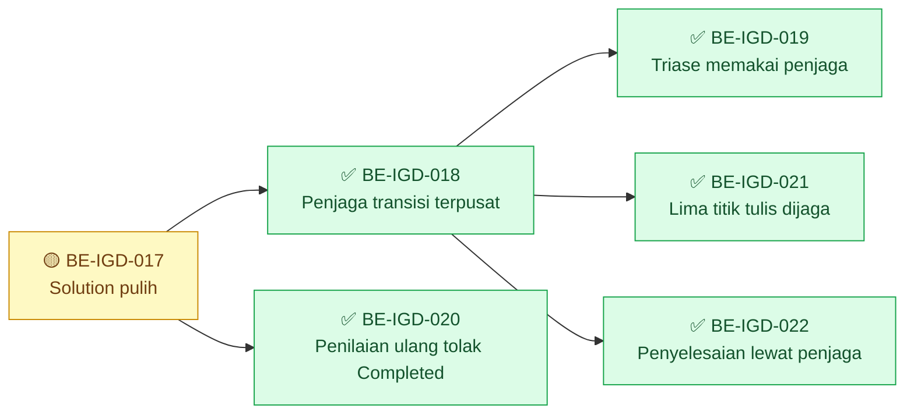

| Gelombang | Boleh mulai setelah | Task |
| ---: | --- | --- |
| 1 | — | `BE-IGD-017` |
| 2 | `BE-IGD-017` | `BE-IGD-018`, `BE-IGD-020` — boleh paralel |
| 3 | `BE-IGD-018` | `BE-IGD-019`, `BE-IGD-021`, `BE-IGD-022` — boleh paralel |

`BE-IGD-019`, `BE-IGD-021`, dan `BE-IGD-022` boleh paralel karena menyentuh berkas berbeda.
`BE-IGD-020` boleh jalan segera setelah build pulih.

Frontend **tidak** boleh mulai sebelum `BE-IGD-019` selesai — pesan penolakan yang harus
ditampilkan belum ada sebelum itu. Lihat `frontend-roadmap.md`.

---

## 5. Yang sengaja tidak direncanakan

| Yang tidak direncanakan | Alasan | Yang membukanya |
| --- | --- | --- |
| Pengisian master kelas pasien IGD | Data master milik **Master Data**, pemiliknya belum ditunjuk. Pengisiannya juga menulis ke basis data bersama satu tim, dan otorisasinya belum ada | Penunjukan pemilik Master Data — `approval-requests/2026-08-24-permintaan-penunjukan-pemilik-modul.md` bagian 3.2 |
| Pemetaan unit layanan ke simpul organisasi | Menambah kolom pada `MstServiceUnit`, tabel **milik Master Data**. Butuh migration, dan otorisasi migration belum diberikan | Sama seperti di atas, ditambah otorisasi migration |
| `EPIC IGD-01`, `02`, `04`, `05`, `06`, `07`, `08`, `10` | Gelombang `MVP-1` ke atas. Kontraknya masih `draft`; `IGD-DEC-093` sengaja tidak menyentuhnya | Approval kontrak yang bersangkutan |
| `EPIC IGD-09` | `OPEN DECISION`. Pemilik `ClinicalManagement` dan `PharmacyManagement` belum ditunjuk | Penunjukan kedua pemilik |
| Perbaikan 127 warning kompilasi | Di luar cakupan gelombang, dan mencampurnya dengan `BE-IGD-017` membuat diff perbaikan build sulit ditinjau | Keputusan tersendiri |
| Memperbaiki `NewQuilvianSystemBackend/CLAUDE.md` | Bukan artefak blueprint. Tetapi isinya salah dan menyesatkan — lihat bagian 0.2 | Keputusan pemilik repository |

---

## 6. Definition of Done gelombang `MVP-0`

Mengikuti `04-prd-to-mvp.md` bagian 6, dengan keadaan yang sudah diketahui.

| No | Butir | Berlaku? | Bukti yang diterima |
| ---: | --- | :-: | --- |
| 1 | Seluruh functional requirement punya test yang lulus | **Ya** | Keluaran `dotnet test`. **Dapat dipenuhi** — project test ada, lihat bagian 0.2 |
| 2 | Test regresi jalur rawat jalan untuk perubahan lintas modul | **Tidak** | Gelombang ini nol perubahan lintas modul |
| 3 | Migration punya langkah mundur yang diuji | **Tidak** | Gelombang ini tanpa migration |
| 4 | Tidak ada endpoint yang menghapus permanen catatan klinis | **Ya** | Penelusuran kode; gelombang ini tidak menambah endpoint |
| 5 | Tidak ada isi klinis di berkas log | **Ya** | Contoh keluaran log dari jalur triase |
| 6 | Setiap tahap kepergian punya pemilik klinis tepat satu | **Tidak** | `AT-IGD-095` milik `EPIC IGD-05`, bukan gelombang ini |
| 7 | Layar menyatakan keterbatasan penunjang | **Tidak** | Bukan gelombang ini |
| 8 | Data master gelombangnya sudah terisi | **Tidak** | Bagian data master `MVP-0` tidak direncanakan — lihat bagian 5 |
| 9 | Kontrak yang berubah sudah dinaikkan versinya dan hash-nya dihitung ulang | **Ya** | Sudah dilakukan `IGD-DEC-093`; hash tercatat di `blueprint-manifest.md` |
| 10 | Perubahan pada modul milik pihak lain disetujui pemiliknya tertulis | **Ya, satu butir** | `BE-IGD-017` menyentuh `Program.cs` untuk memulihkan `LaboratoryManagement`. Perlu catatan persetujuan, atau penyerahan task itu kepada pemiliknya |

Butir 10 adalah satu-satunya yang belum dapat dijawab "ya" pada gelombang ini, dan hanya
karena `BE-IGD-017`.

> **Diperbarui 15 September 2026.** Butir 1 dijawab dengan angka test historis yang tercatat
> pada laporan `BE-IGD-018`…`022`; `IGD-DEC-110` menetapkan angka itu tetap sah walau proyek
> test sudah dihapus. Butir 10 dijawab sementara oleh `IGD-DEC-107` (27 Agustus 2026). Yang
> masih menahan gelombang ini dari ✅ bukan butir DoD, melainkan **laporan tracked
> `BE-IGD-017` yang tidak pernah ditulis**.

---

# Revision 3 — perluasan ke perjalanan pasien penuh

Ditambahkan 26 Agustus 2026 atas permintaan Rizki Gunawan: melanjutkan pendaftaran dan triase
yang masih kurang, menuntaskan pengkajian pasien IGD, lalu kepergian pasien — dan sesudahnya
penunjang medis, pemakaian alat, dan billing.

Revision `2` **tidak dibuang**. Seluruh isinya di atas tetap berlaku; `BE-IGD-017` dan
`BE-IGD-018` sudah selesai. Bagian ini menambah gelombang sesudah `MVP-0`.

## R3.0 Audit kemampuan enam area — 26 Agustus 2026

Diperiksa langsung pada source `300922c`, bukan disimpulkan dari blueprint.

| Area | Bukti | Kesimpulan |
| --- | --- | --- |
| Pendaftaran & triase | 9 controller, 9 model transaksi, 6 master IGD | Ada, tinggal dilengkapi |
| Pengkajian & pemeriksaan | `ClinicalManagement` 16 controller, 14 model transaksi | **Ada dan kaya.** Terhalang dua kolom, bukan ketiadaan |
| Kepergian pasien | `TrxEmergencyTransfer`, `TrxEmergencyDisposition` | Ada, perlu dirombak sesuai `IGD-DEC-090`/`091` |
| Penunjang medis | `LaboratoryManagement` **4 berkas**: controller, DTO, model, service. `RadiologyManagement` **0 berkas** | Lab kerangka; radiologi tidak ada |
| Pemakaian alat | **0 berkas.** Folder `DeviceManagement` tidak ada; `csproj` mengecualikan path yang tidak eksis | Tidak ada dasarnya |
| Billing | `BillingManagement` 121 berkas, 14 controller, seam `POST /folios/internal/milestones/recognize` | **Matang.** Nol modul luar memanggilnya |

### R3.0.1 Tiga temuan yang mengubah urutan gelombang

**Pengkajian IGD jauh lebih murah dari dugaan blueprint.** `04-prd-to-mvp.md` menempatkan
`EPIC IGD-09` di `POST-MVP` sebagai `OPEN DECISION`. Buktinya menunjukkan penghalangnya sempit:

| Tabel klinis | `QueueId` | Dapat dipakai kunjungan IGD? |
| --- | --- | :-: |
| `TrxPatientAssessment` | `Guid` wajib | **Tidak** |
| `TrxDoctorConsultation` | `Guid` wajib | **Tidak** |
| `TrxPatientVitalSign` | `Guid?` | **Ya** |
| `TrxPatientIntegratedProgressNote` | `Guid?` | **Ya** |
| `TrxPatientDiagnosis` | tanpa kolom | **Ya** |
| `TrxPatientProcedure` | tanpa kolom | **Ya** |

Empat dari enam **sudah** bekerja tanpa antrean. Dua sisanya terhalang karena
`PatientAssessmentController` memuat `TrxQueue` dengan `FirstAsync`, yang melempar bila pasien
tidak punya baris antrean — dan pasien IGD memang tidak pernah punya. Resep ikut terhalang
lewat rantai `TrxPrescription.ConsultationId` → `TrxDoctorConsultation.QueueId`, sehingga satu
perbaikan yang sama membuka keduanya.

**Billing sudah menyediakan pintu masuknya.** `RecognizeBillingMilestoneRequest` memuat
`IdempotencyKey`, `MilestoneFactId`, `MilestoneFactVersion`, `EncounterId`, `SourceContext`,
`SourceAggregateId`, `SourceItemId`. Tidak ada entitas `MilestoneFact` — ia identitas milik
modul sumber. Jadi pekerjaan "IGD sampai billing" adalah **menerbitkan kejadian**, bukan
membangun billing.

**`EncounterType.Emergency` sudah ada di enum tetapi ditolak IGD.** Dua tempat menolaknya, dan
keduanya duplikat satu sama lain — pola yang sama dengan cacat `BE-IGD-016`.

## R3.1 Gelombang setelah `MVP-0`

| Gelombang | Isi | Prasyarat | Status 15 September 2026 |
| --- | --- | --- | --- |
| `MVP-1` | Pendaftaran & triase: `EPIC IGD-01`, `EPIC IGD-10` | `MVP-0` selesai | ✅ `BE-IGD-023`, `024` |
| `MVP-2` | Satu pasien satu episode: `EPIC IGD-02` | `MVP-1` | ✅ `BE-IGD-025` |
| `MVP-3` | **Pengkajian IGD tuntas**: `EPIC IGD-09` | `MVP-1`; **approval pemilik `ClinicalManagement`** — dijawab sementara `IGD-DEC-107`/`108` | 🟡 empat task ✅; `BE-IGD-026` kriteria 1 belum |
| `MVP-4` | Kepergian pasien: `EPIC IGD-05`, `EPIC IGD-06` | `MVP-1`; approval kontrak state/validation bagian kepergian — `IGD-DEC-108` | 🟡 tiga task ✅; `BE-IGD-031` kriteria 2 belum |
| `MVP-5` | Riwayat dokter & serah terima: `EPIC IGD-04`, `EPIC IGD-07` | `MVP-4` untuk `EPIC IGD-07`; `MVP-1` untuk `EPIC IGD-04` (diperjelas 15 Sep 2026) | 🟡 `BE-IGD-035` sebagian; `EPIC IGD-04` — `BE-IGD-044` ✅ (acceptance 5 terbukti 21 September 2026), `BE-IGD-045` ✅, `BE-IGD-048` ✅ |
| `MVP-6` | Kewenangan unit: `EPIC IGD-08` | Data pemetaan terisi; pengesahan Security/Privacy owner | ⛔ `BE-IGD-039`; pemetaan 0 dari 18 unit |
| **Belum dapat direncanakan** | Penunjang medis, pemakaian alat, billing IGD | **Tidak punya blueprint sama sekali.** Lihat R3.5 | — |

`MVP-0` (bagian 1–6 di atas): 🟡 lima task ✅; `BE-IGD-017` tanpa laporan tracked. R3.7: ✅
`BE-IGD-036`…`038`.

> **Penomoran gelombang berubah dari revision `2`.** `04-prd-to-mvp.md` bagian 5 dan tabel
> gelombang revision `2` menempatkan kepergian pasien di `MVP-3` dan kewenangan unit di
> `MVP-5`. Revision `3` menyisipkan pengkajian sebagai `MVP-3`, sehingga kepergian bergeser ke
> `MVP-4`, serah terima ke `MVP-5`, dan kewenangan unit ke `MVP-6`. Isi tiap gelombang tidak
> berubah — hanya nomornya. `04-prd-to-mvp.md` **belum** diselaraskan karena ia keluaran
> `/qv-design`; penyelarasannya pekerjaan pass desain berikutnya.

`EPIC IGD-09` dinaikkan dari `POST-MVP` ke `MVP-3` **atas dasar bukti**, bukan preferensi.
Kepemilikan `ClinicalManagement` tetap belum ditunjuk, sehingga butir 10 Definition of Done
tetap tidak dapat dijawab "ya" — tetapi pekerjaan teknisnya kini terukur dan kecil.

---

## R3.2 Task `MVP-1` dan `MVP-2` — pendaftaran dan triase

Grafik gelombang `MVP-1` dan `MVP-2`. Prasyarat *"`MVP-0` selesai"* digambar pada grafik
ringkasan.

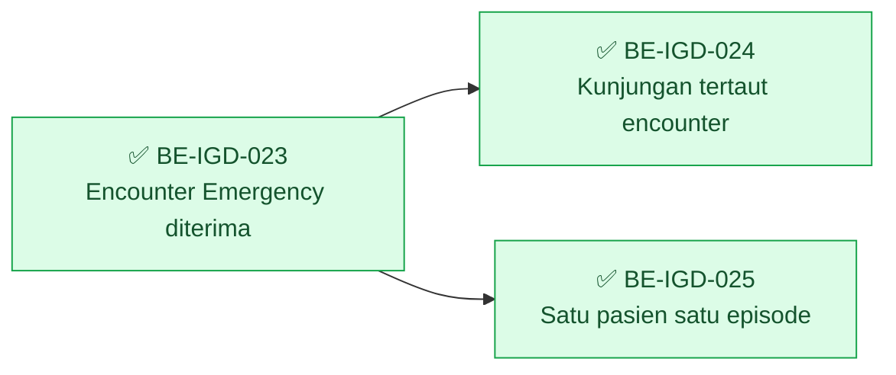

| Gelombang | Boleh mulai setelah | Task |
| ---: | --- | --- |
| 1 | `MVP-0` (grafik ringkasan) | `BE-IGD-023` |
| 2 | `BE-IGD-023` | `BE-IGD-024`, `BE-IGD-025` — boleh paralel |

### ✅ `BE-IGD-023` — Kunjungan IGD menerima `EncounterType.Emergency`

| Field | Isi |
| --- | --- |
| **Status** | ✅ **SELESAI 26 Agustus 2026; dipetakan ulang 15 September 2026.** Keempat acceptance criteria terpetakan ke source `e89907c5`: satu pemeriksaan bersama `EmergencyVisitService.PeriksaJenisEncounter` baris 259, dipakai controller baris 609 dan service baris 180 — duplikasinya sudah hilang. Kriteria 4 dijawab `IGD-DEC-109`. **Tindak lanjut terbuka:** syarat pencabutan `Outpatient` pada `IGD-DEC-109` sudah terpenuhi 27 Agustus 2026, tetapi baris 261 masih menerimanya — `IGD-EV-121`. Validasi historis: suite `761 total, 759 lulus` (`IGD-DEC-110`). Bukti: [laporan gabungan](../task/report/backend/be-igd-021-035-penyelesaian-perjalanan-pasien.md) |
| **Slice** | `IGD-S02` · `EPIC IGD-01` |
| **Scope** | `EmergencyVisitController.cs` baris 525–526 dan `EmergencyVisitService.cs` baris 97–98 |
| **Perubahan** | Keduanya kini berbunyi `if (encounter.EncounterType != EncounterType.Outpatient) return "Jenis kunjungan pasien IGD harus OP…"`. Ubah menjadi menerima `EncounterType.Emergency`. **Kedua tempat wajib diubah dalam satu task** — keduanya duplikat, dan mengubah satu saja mengulang persis cacat `BE-IGD-016` |
| **Requirement** | `FR-IGD-001` … `FR-IGD-004` |
| **Keputusan** | `IGD-DEC-067`, `IGD-DEC-074` |
| **Kontrak** | State `0.3.0`; API `0.3.0` bagian 1.1 — **keduanya masih `draft`, wajib di-`approved` lebih dulu** |
| **Dependency** | `MVP-0` selesai |
| **Acceptance** | 1. Pendaftaran IGD dengan encounter `Emergency` diterima. 2. Pesan penolakan tidak lagi menyebut "harus OP". 3. Kedua jalur diuji terpisah — controller dan service. 4. Pemanggil lama yang mengirim `Outpatient`: perilakunya **wajib diputuskan owner**, lihat catatan |
| **Test** | Baru, di `HealthServices/EmergencyInstallationManagement/` |
| **Risiko** | **Tinggi — memutus.** `blueprint-manifest.md` bagian 3.1 mencatat test `FE-IGD-001 K1` akan gagal. Data kunjungan IGD lama seluruhnya bertipe `Outpatient` |
| **Owner** | Backend; approval `IGD-DEC-074` menyentuh Registration API owner yang **belum ditunjuk** |

> **Satu keputusan yang belum ada.** Apakah `Outpatient` masih diterima selama masa transisi,
> atau ditolak sejak hari pertama? Menolak langsung memutus pemanggil lama dan membuat data
> lama tidak konsisten dengan data baru. Menerima keduanya membuat `EncounterType` berhenti
> bermakna. **Belum diputuskan siapa pun** — dicatat sebagai pertanyaan yang harus dijawab
> sebelum task ini dimulai, bukan diputuskan sendiri saat implementasi.

### ✅ `BE-IGD-024` — Penghubung kunjungan IGD ke encounter

| Field | Isi |
| --- | --- |
| **Status** | ✅ **SELESAI 26 Agustus 2026; dipetakan ulang 15 September 2026.** Ketiga acceptance criteria terpetakan ke source `e89907c5`: `EmergencyVisitService.PeriksaEncounterPendaftaran` baris 289, dipanggil `EmergencyVisitController` baris 372 dengan `409`. Kriteria 2 diwujudkan **lebih awal** dari rumusan kartu — pendaftaran tidak dapat dituntaskan tanpa encounter, sehingga kegagalan tidak baru muncul saat pencatatan klinis. Kunjungan lama tidak diubah (kriteria 3). Validasi historis: suite `761 total, 759 lulus` (`IGD-DEC-110`). Bukti: [laporan gabungan](../task/report/backend/be-igd-021-035-penyelesaian-perjalanan-pasien.md) |
| **Slice** | `IGD-S02` · `EPIC IGD-10` |
| **Scope** | `TrxEmergencyVisit.EncounterId` yang bertipe `Guid?` |
| **Perubahan** | Menegakkan kapan `EncounterId` wajib terisi dan siapa yang mengisinya. Kunjungan IGD tanpa encounter tidak dapat menyimpan catatan klinis apa pun, karena seluruh tabel `ClinicalManagement` bertumpu pada `EncounterId` |
| **Requirement** | `FR-IGD-065` … `FR-IGD-068` |
| **Kontrak** | API `0.3.0`; validation `0.3.0` — **`draft`** |
| **Dependency** | `BE-IGD-023` |
| **Acceptance** | 1. Kunjungan IGD yang sudah melewati pendaftaran selalu punya `EncounterId`. 2. Kunjungan tanpa `EncounterId` ditolak saat pencatatan klinis, dengan pesan yang menyebut apa yang harus dilakukan petugas. 3. Kunjungan lama tanpa `EncounterId` **tidak** dirusak — perilakunya dicatat, bukan diperbaiki diam-diam |
| **Risiko** | Menengah. Bergantung berapa banyak baris lama yang `EncounterId`-nya kosong — **`IGD-UNK`, hanya terjawab kueri basis data bersama** |
| **Owner** | Backend |

### ✅ `BE-IGD-025` — Satu pasien satu episode IGD aktif

| Field | Isi |
| --- | --- |
| **Status** | ✅ **SELESAI 26 Agustus 2026; dipetakan ulang 15 September 2026.** Keempat acceptance criteria terpetakan ke source `e89907c5`: `CariEpisodeAktifAsync` baris 332; pesan memuat nomor kunjungan baris 359; alasan wajib dan tersimpan `EmergencyVisitController` baris 208/262–264; daftar pantau `hasDuplicateEpisodeOverride` baris 71/112. Validasi historis: suite `761 total, 759 lulus` (`IGD-DEC-110`). Bukti: [laporan gabungan](../task/report/backend/be-igd-021-035-penyelesaian-perjalanan-pasien.md) |
| **Slice** | `IGD-S03` · `EPIC IGD-02` |
| **Scope** | Jalur pendaftaran kunjungan IGD |
| **Perubahan** | Menolak pendaftaran selama pasien yang sama masih punya kunjungan IGD yang belum `Completed` dan belum `Cancelled`. Pesan penolakan **wajib menyebut nomor kunjungan yang sudah ada** beserta cara membukanya. Tersedia jalan keluar beralasan yang tercatat |
| **Requirement** | `FR-IGD-005` … `FR-IGD-012` |
| **Keputusan** | `IGD-DEC-084` |
| **Kontrak** | Validation `0.3.0` bagian 1 dan 1.1 — **`draft`** |
| **Dependency** | `BE-IGD-023` |
| **Acceptance** | 1. Pendaftaran kedua ditolak `409` dan pesannya memuat nomor kunjungan pertama. 2. Jalan keluar beralasan berhasil, dan alasannya tersimpan serta terbaca. 3. Pasien tanpa identitas yang belum tertaut data pasien **tidak** ikut tertolak — `AT-IGD-085`. 4. Pemakaian jalan keluar muncul di daftar pantau |
| **Test** | `AT-IGD-085` dan skenario episode ganda |
| **Risiko** | Menengah. Terlalu ketat berarti pasien yang benar-benar datang dua kali tertahan di depan pintu IGD |
| **Owner** | Backend |

---

## R3.3 Task `MVP-3` — pengkajian pasien IGD sampai tuntas

Gelombang inilah yang menjawab "pengkajian / pemeriksaan lebih lanjut pasien IGD sampai
tuntas". Seluruhnya menyentuh tabel milik `ClinicalManagement` dan `PharmacyManagement`.

> **Gerbang kepemilikan.** Pemilik kedua modul **belum ditunjuk**. Task di bawah boleh
> disusun dan ditinjau, tetapi butir 10 Definition of Done tidak dapat dijawab "ya" sampai
> ada nama tertulis. Permintaannya sudah disiapkan di
> `approval-requests/2026-08-24-permintaan-penunjukan-pemilik-modul.md`.
>
> **Diperbarui 15 September 2026.** Gerbang ini dijawab sementara oleh `IGD-DEC-107` (IGD boleh
> menyentuh modul tanpa pemilik) dan `IGD-DEC-108` (irisan kontrak pengkajian `approved`),
> keduanya 27 Agustus 2026. Status wewenang sementaranya wajib ditinjau ulang begitu pemilik
> `ClinicalManagement` dan `PharmacyManagement` ditunjuk.

Grafik gelombang `MVP-3`. Prasyarat `BE-IGD-024` (gelombang `MVP-1`) untuk `BE-IGD-026` dan
`BE-IGD-030` digambar pada grafik ringkasan.

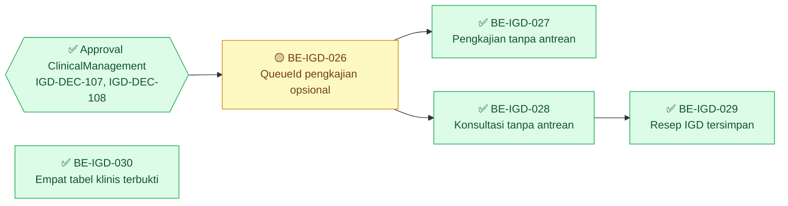

| Gelombang | Boleh mulai setelah | Task |
| ---: | --- | --- |
| 1 | `BE-IGD-024` (grafik ringkasan); untuk `BE-IGD-026` juga approval `ClinicalManagement` | `BE-IGD-026`, `BE-IGD-030` — boleh paralel |
| 2 | `BE-IGD-026` | `BE-IGD-027`, `BE-IGD-028` — boleh paralel |
| 3 | `BE-IGD-028` | `BE-IGD-029` |

### 🟡 `BE-IGD-026` — `TrxPatientAssessment.QueueId` menjadi opsional

| Field | Isi |
| --- | --- |
| **Status** | 🟡 **SEBAGIAN — ditandai 15 September 2026.** Kriteria 2 dan 3 terpetakan: `TrxPatientAssessment.QueueId` kini `Guid?` (baris 42), dan jalur rawat jalan dijaga test regresi historis (suite `761 total, 759 lulus`, `IGD-DEC-110`). **Kriteria 1 belum terpenuhi:** langkah mundur migration `20260826090500_ImplementIgdFullPatientJourney` tertulis (`Down` ada), tetapi **belum pernah diuji di basis data terpisah** — laporan mencatat *"Migration tidak pernah dijalankan ke database"*, dan penerapan 27 Agustus 2026 memakai script `Up` saja. `IGD-DEC-110` tidak melepas kriteria ini karena ia bukan automated test. Bukti: [laporan gabungan](../task/report/backend/be-igd-021-035-penyelesaian-perjalanan-pasien.md) |
| **Slice** | `IGD-S04` · `EPIC IGD-09` |
| **Scope** | `ClinicalManagement/Models/TrxPatientAssessment.cs` baris 24; konfigurasi EF; satu migration |
| **Perubahan** | `public Guid QueueId` menjadi `public Guid? QueueId`. **Satu kolom.** Tidak ada perubahan perilaku pada jalur rawat jalan — baris lama tetap terisi |
| **Requirement** | `FR-IGD-060` |
| **Keputusan** | `IGD-DEC-068` |
| **Kontrak** | Belum ada bagian kontrak untuk ini — **wajib ditambahkan dan di-`approved` lebih dulu** |
| **Dependency** | `BE-IGD-024`; **approval pemilik `ClinicalManagement`** |
| **Acceptance** | 1. Migration punya langkah mundur tertulis dan sudah diuji di basis data terpisah. 2. Seluruh test rawat jalan yang menyentuh pengkajian tetap lulus. 3. Nol baris lama berubah nilainya |
| **Risiko** | **Menengah.** Tabel milik modul lain, dan `QueueId` yang menjadi opsional berarti setiap pembaca yang mengasumsikannya selalu terisi harus diperiksa |
| **Owner** | **Pemilik `ClinicalManagement`** — belum ditunjuk |

### ✅ `BE-IGD-027` — Pengkajian dapat dibuat tanpa baris antrean

| Field | Isi |
| --- | --- |
| **Status** | ✅ **SELESAI 26 Agustus 2026; dipetakan ulang 15 September 2026.** Keempat acceptance criteria terpetakan ke source `e89907c5`: `PatientAssessmentController` baris 479 memuat antrean hanya bila `QueueId` dikirim, dan baris 1454 mengarahkan permintaan tanpa antrean ke `ValidateCreateWithoutQueueAsync`. Jalur simpan dibuktikan pada basis data 27 Agustus 2026 (`ASM-20260827-00003`, `BE-IGD-036`). Test regresi rawat jalan tercatat historis (`IGD-DEC-110`). Bukti: [laporan gabungan](../task/report/backend/be-igd-021-035-penyelesaian-perjalanan-pasien.md) |
| **Slice** | `IGD-S04` · `EPIC IGD-09` |
| **Scope** | `PatientAssessmentController.cs` baris 265–278 |
| **Perubahan** | Jalur create memuat `TrxQueue` dengan `FirstAsync`, yang **melempar** bila pasien tidak punya antrean. Diubah menjadi: bila `QueueId` dikirim, perilakunya persis seperti sekarang; bila tidak, pengkajian dibuat dari `EncounterId` saja, dan `ServiceUnitId` diambil dari kunjungan IGD alih-alih dari antrean |
| **Requirement** | `FR-IGD-060`, `FR-IGD-061` |
| **Kontrak** | API — bagian baru, **wajib di-`approved`** |
| **Dependency** | `BE-IGD-026` |
| **Acceptance** | 1. Pengkajian pasien IGD tersimpan tanpa antrean, dan seluruh field terisi benar. 2. Pengkajian rawat jalan **tetap** memakai antrean dan perilakunya tidak berubah sedikit pun. 3. Permintaan tanpa `QueueId` maupun `EncounterId` ditolak `400`. 4. Test regresi jalur rawat jalan disertakan — **butir 2 Definition of Done berlaku di sini** |
| **Risiko** | **Tinggi.** Ini jalur pengkajian yang dipakai seluruh poli setiap hari |
| **Owner** | Pemilik `ClinicalManagement` |

### ✅ `BE-IGD-028` — Konsultasi dokter tanpa antrean

| Field | Isi |
| --- | --- |
| **Status** | ✅ **SELESAI 26 Agustus 2026; dipetakan ulang 15 September 2026.** Ketiga acceptance criteria terpetakan ke source `e89907c5`: `TrxDoctorConsultation.QueueId` kini `Guid?` (baris 32). Kolomnya ikut diubah migration `20260826090500`, tetapi kartu ini tidak menuntut uji langkah mundur. Test regresi rawat jalan tercatat historis (`IGD-DEC-110`). Bukti: [laporan gabungan](../task/report/backend/be-igd-021-035-penyelesaian-perjalanan-pasien.md) |
| **Slice** | `IGD-S04` · `EPIC IGD-09` |
| **Scope** | `TrxDoctorConsultation.QueueId` baris 25; jalur create `DoctorConsultationController` |
| **Perubahan** | Pola yang sama dengan `BE-IGD-026` dan `BE-IGD-027`, digabung karena tabel dan jalurnya jauh lebih kecil |
| **Requirement** | `FR-IGD-062` |
| **Dependency** | `BE-IGD-026` |
| **Acceptance** | 1. Konsultasi dokter IGD tersimpan tanpa antrean. 2. Konsultasi rawat jalan tidak berubah. 3. Test regresi rawat jalan disertakan |
| **Risiko** | Menengah |
| **Owner** | Pemilik `ClinicalManagement` |

### ✅ `BE-IGD-029` — Resep IGD

| Field | Isi |
| --- | --- |
| **Status** | ✅ **SELESAI 26 Agustus 2026; dipetakan ulang 15 September 2026.** Kedua acceptance criteria terpetakan ke source `e89907c5`: hipotesis task terbukti — tabel resep (kini `PhmPrescription`, di-rename tim Registrasi 10 September 2026) **tidak diubah**; `ConsultationId` tetap `Guid` baris 28, dan rantainya terbuka lewat `BE-IGD-028`. Pembuktian tersimpan-dan-terbaca tercatat sebagai test historis (`IGD-DEC-110`). Bukti: [laporan gabungan](../task/report/backend/be-igd-021-035-penyelesaian-perjalanan-pasien.md) |
| **Slice** | `IGD-S04` · `EPIC IGD-09` |
| **Scope** | `TrxPrescription.ConsultationId` yang bertipe `Guid` wajib |
| **Perubahan** | Resep menuntut konsultasi, dan konsultasi dulu menuntut antrean. Setelah `BE-IGD-028`, rantainya terbuka **tanpa perubahan pada `TrxPrescription` sama sekali** — task ini membuktikannya, dan hanya menulis kode bila pembuktian gagal |
| **Requirement** | `FR-IGD-063` |
| **Keputusan** | `IGD-DEC-078` |
| **Dependency** | `BE-IGD-028` |
| **Acceptance** | 1. Dokter IGD dapat menulis resep yang tersimpan dan terbaca farmasi. 2. Bila ternyata masih ada penghalang lain, **hentikan dan laporkan** — jangan melebarkan perbaikan ke modul farmasi tanpa pemiliknya |
| **Risiko** | Rendah bila hipotesisnya benar; **berhenti** bila salah |
| **Owner** | Pemilik `PharmacyManagement` — belum ditunjuk |

### ✅ `BE-IGD-030` — Membuktikan empat tabel klinis lain sudah bekerja

| Field | Isi |
| --- | --- |
| **Status** | ✅ **SELESAI 26 Agustus 2026; dipetakan ulang 15 September 2026.** Kedua acceptance criteria terpetakan ke source `e89907c5`: `TrxPatientVitalSign.QueueId` dan `TrxPatientIntegratedProgressNote.QueueId` `Guid?`; `TrxPatientDiagnosis` dan `TrxPatientProcedure` tanpa kolom antrean. Pembuktian tersimpan-dan-terbaca untuk kunjungan IGD tercatat sebagai test historis (`IGD-DEC-110`). Bukti: [laporan gabungan](../task/report/backend/be-igd-021-035-penyelesaian-perjalanan-pasien.md) |
| **Slice** | `IGD-S04` · `EPIC IGD-09` |
| **Scope** | `TrxPatientDiagnosis`, `TrxPatientProcedure`, `TrxPatientVitalSign`, `TrxPatientIntegratedProgressNote` |
| **Perubahan** | **Diharapkan nol.** Keempatnya sudah encounter-only. Task ini menulis test yang membuktikannya untuk kunjungan IGD, sehingga tidak ada yang diam-diam rusak nanti |
| **Requirement** | `FR-IGD-064` |
| **Dependency** | `BE-IGD-024` |
| **Acceptance** | 1. Keempatnya tersimpan dan terbaca untuk kunjungan IGD. 2. Bila salah satu ternyata gagal, itu temuan baru — catat, jangan perbaiki dalam task ini |
| **Risiko** | Rendah |
| **Owner** | Backend |

---

## R3.4 Task `MVP-4` — kepergian pasien

Keputusan sudah lengkap sejak Amendment Pass kedua: `IGD-DEC-090` (dua lapis penyimpanan) dan
`IGD-DEC-091` (penggantian nama). Yang belum: bagian kontrak yang bersangkutan masih `draft`.
*(Diperbarui 15 September 2026: irisan kontrak itu dinaikkan `approved` oleh `IGD-DEC-108`,
27 Agustus 2026. Nama tabel kini berprefix `Emg` — `EmgDeparture`, `EmgDepartureEvent`,
`EmgHandoverOrderItem`.)*

Grafik gelombang `MVP-4` dan `MVP-5`. Prasyarat *"`MVP-1`"* untuk `BE-IGD-031` digambar pada
grafik ringkasan. `EPIC IGD-04` belum punya task sehingga belum muncul sebagai node
(`IGD-DEC-114`).

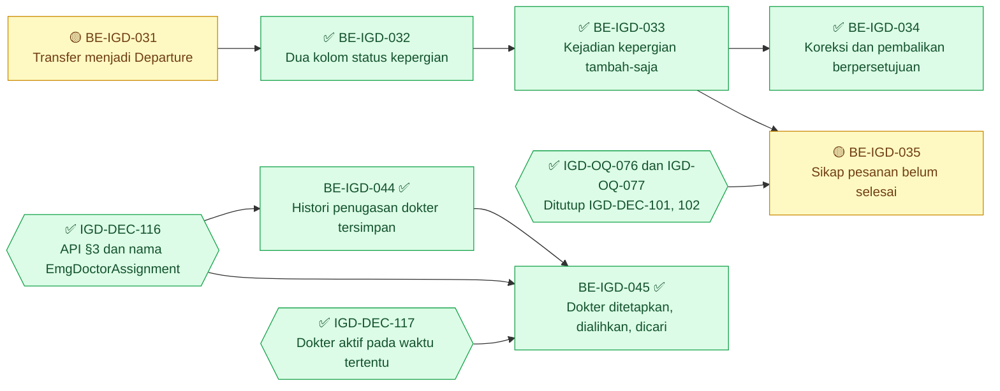

| Gelombang | Boleh mulai setelah | Task |
| ---: | --- | --- |
| 1 | `MVP-1` (grafik ringkasan) | `BE-IGD-031` |
| 2 | `BE-IGD-031` | `BE-IGD-032` |
| 3 | `BE-IGD-032` | `BE-IGD-033` |
| 4 | `BE-IGD-033`; untuk `BE-IGD-035` juga `IGD-OQ-076`/`077` | `BE-IGD-034`, `BE-IGD-035` — boleh paralel |
| 1 | `MVP-1` ✅ (grafik ringkasan) dan `IGD-DEC-116` ✅ | `BE-IGD-044` — **dapat dikerjakan sekarang**; rantai `EPIC IGD-04` tidak menunggu `BE-IGD-031`…`035` |
| 2 | `BE-IGD-044`, `IGD-DEC-116` ✅, `IGD-DEC-117` ✅ | `BE-IGD-045` |

### 🟡 `BE-IGD-031` — `TrxEmergencyTransfer` menjadi `TrxEmergencyDeparture`

| Field | Isi |
| --- | --- |
| **Status** | 🟡 **SEBAGIAN — ditandai 15 September 2026.** Tiga dari empat acceptance criteria terpetakan ke source `e89907c5`: nol baris hilang (`TrxEmergencyTransfer` 0 baris, `IGD-UNK-03`); nol route `emergency-transfers` tersisa; frontend `DEPARTURE_URL` sudah `emergency-departures` (`FE-IGD-015`). **Kriteria 2 belum terpenuhi:** langkah mundur `RENAME` balik tertulis pada migration `20260826090500` baris 270, tetapi **belum pernah diuji**. Bukti: [laporan gabungan](../task/report/backend/be-igd-021-035-penyelesaian-perjalanan-pasien.md) |
| **Slice** | `IGD-S05` · `EPIC IGD-05` |
| **Scope** | 9 berkas source: controller, DTO, enum, model, `TrxEmergencyVisit`, dua service, konfigurasi EF, `Program.cs`, `ApplicationDbContext`. Ditambah 1 baris frontend |
| **Perubahan** | Ganti nama menyeluruh; route `emergency-transfers` menjadi `emergency-departures`; **tanpa route usang**. Migration wajib `RENAME TABLE`, bukan drop-create |
| **Keputusan** | `IGD-DEC-091` — **`draft`, menunggu pemilik integrasi** |
| **Dependency** | `MVP-1` |
| **Acceptance** | 1. Nol baris data hilang. 2. Langkah mundur berupa `RENAME` balik, diuji. 3. Seluruh route lama tidak lagi ada. 4. Frontend `TRANSFER_URL` ikut berubah dalam rilis yang sama |
| **Risiko** | Menengah. Ukurannya sudah terukur dan kecil; risikonya pada pemakai di luar kedua repo yang tidak terlihat dari sini |
| **Owner** | Backend + Frontend serentak |

### ✅ `BE-IGD-032` — Dua kolom status kepergian

| Field | Isi |
| --- | --- |
| **Status** | ✅ **SELESAI 26 Agustus 2026; dipetakan ulang 15 September 2026.** Ketiga acceptance criteria terpetakan ke source `e89907c5`: `EmgDeparture.PhysicalStatus` baris 54 dan `HandoverStatus` baris 57; peringatan cara mundur bagian 6.2 diikuti lewat tabel arsip `TrxEmergencyDepartureLegacyPlacement`; nol baris lama kehilangan arti karena tabelnya 0 baris. Gerbang penutupan membaca fisik saja (`IGD-DEC-106`). Validasi historis: suite `761 total, 759 lulus` (`IGD-DEC-110`). Bukti: [laporan gabungan](../task/report/backend/be-igd-021-035-penyelesaian-perjalanan-pasien.md) |
| **Slice** | `IGD-S05` · `EPIC IGD-05` |
| **Perubahan** | `TransferStatus` tunggal dipecah menjadi `PhysicalStatus` dan `HandoverStatus`, beserta migration pemetaan status lama ke dua rangkaian baru sesuai `02-backend-architecture.md` bagian 6.1 |
| **Keputusan** | `IGD-DEC-070`, diperluas `IGD-DEC-090` |
| **Dependency** | `BE-IGD-031` |
| **Acceptance** | 1. Setiap baris lama terpetakan, nol baris kehilangan arti. 2. Urutan migration bagian 6.3 tidak ditukar. 3. Peringatan cara mundur bagian 6.2 diikuti |
| **Risiko** | **Tinggi.** Pemetaan status yang salah mengubah arti data klinis yang sudah ada |
| **Owner** | Backend |

### ✅ `BE-IGD-033` — `TrxEmergencyDepartureEvent` yang tambah-saja

| Field | Isi |
| --- | --- |
| **Status** | ✅ **SELESAI 26 Agustus 2026; dipetakan ulang 15 September 2026.** Ketiga acceptance criteria terpetakan ke source `e89907c5`: `EmgDepartureEvent` memuat `OccurredAt`, `RecordedAt`, `IsEffective`, `SupersedesEventId`, dan `ApprovedByUserId`; koreksi menulis baris baru, bukan menimpa. Validasi historis: suite `761 total, 759 lulus` (`IGD-DEC-110`). Bukti: [laporan gabungan](../task/report/backend/be-igd-021-035-penyelesaian-perjalanan-pasien.md) |
| **Slice** | `IGD-S05` · `EPIC IGD-06` |
| **Perubahan** | Tabel kejadian baru: pelaku, waktu server, waktu kejadian sebenarnya, alasan, `IsEffective`, `SupersedesEventId`, `ApprovedByUserId`. Kolom status menjadi turunan yang diperbarui **dalam transaksi yang sama** |
| **Keputusan** | `IGD-DEC-090` |
| **Dependency** | `BE-IGD-032` |
| **Acceptance** | 1. Baris kejadian tidak pernah ditimpa maupun dihapus. 2. Kolom status selalu sama dengan kejadian terakhir yang berlaku. 3. Kegagalan di tengah menyisakan nol baris — keduanya satu `SaveChangesAsync` |
| **Risiko** | Menengah |
| **Owner** | Backend |

### ✅ `BE-IGD-034` — Entri susulan, koreksi, dan pembalikan berpersetujuan

| Field | Isi |
| --- | --- |
| **Status** | ✅ **SELESAI 26 Agustus 2026; dipetakan ulang 15 September 2026.** Ketiga acceptance criteria terpetakan ke source `e89907c5`: `EmergencyDepartureService` baris 76, 577, 633, dan 661 menolak waktu kejadian di masa depan; baris 600 menolak pembalikan tanpa penyetuju atau dengan penyetuju yang sama dengan pelaku. Validasi historis: suite `761 total, 759 lulus` (`IGD-DEC-110`). Bukti: [laporan gabungan](../task/report/backend/be-igd-021-035-penyelesaian-perjalanan-pasien.md) |
| **Slice** | `IGD-S05` · `EPIC IGD-06` |
| **Perubahan** | Waktu kejadian sebenarnya boleh berbeda dari waktu pencatatan; koreksi ditulis sebagai baris baru yang menunjuk baris lama; pembalikan menuntut persetujuan orang kedua |
| **Keputusan** | `IGD-DEC-065`, `IGD-DEC-066`, `IGD-DEC-085` |
| **Dependency** | `BE-IGD-033` |
| **Acceptance** | 1. Waktu sebenarnya di masa depan ditolak. 2. Pembalikan tanpa persetujuan ditolak. 3. Pelaku pembalikan dan pemberi persetujuan **tidak boleh orang yang sama** |
| **Risiko** | Menengah |
| **Owner** | Backend |

### 🟡 `BE-IGD-035` — Sikap atas pesanan yang belum selesai

| Field | Isi |
| --- | --- |
| **Status** | 🟡 **SEBAGIAN — ditandai 15 September 2026.** Terpetakan ke source `e89907c5`: kriteria 1 (`EmergencyDispositionService` baris 132–142 menahan penutupan), 3 (nol pembatalan otomatis), 4 (`Continue` tidak menahan), dan 5 (`ActionReason` wajib untuk `Cancel`, `EmergencyDepartureService` baris 527). **Kriteria 2 — dinilai ulang 16 September 2026: terpenuhi pada source.** `BE-IGD-041` membuat balasan penutupan menyebut pesanan yang menahannya, dan kueri kembar yang dulu berdiri sendiri di `EmergencyDispositionService` dihapus; `IGD-EV-122` ditutup. Pembuktian runtime-nya ikut menunggu `dotnet build` dan uji API `BE-IGD-041`. **Yang masih menahan task ini:** **acceptance tambahan kewenangan terima/tolak atas unit tujuan** menolak **setiap** petugas karena `BE-IGD-039`. Approval Clinical Governance atas `IGD-DEC-100`/`101` belum tercatat. Bukti: [laporan gabungan](../task/report/backend/be-igd-021-035-penyelesaian-perjalanan-pasien.md) |
| **Slice** | `IGD-S05` · `EPIC IGD-07` |
| **Perubahan** | `TrxEmergencyHandoverOrderItem`: setiap pesanan yang belum tuntas saat pasien pergi wajib punya sikap — dilanjutkan, dibatalkan, atau diserahkan |
| **Kontrak** | Validation `0.3.0` bagian 5 — **`draft`** |
| **Dependency** | `BE-IGD-033`; `IGD-OQ-076` dan `IGD-OQ-077` terjawab |
| **Acceptance** | 1. Kunjungan tidak dapat diselesaikan bila ada pesanan tanpa sikap. 2. Pesan penolakan menyebut pesanan mana. 3. **Tidak ada pembatalan otomatis** hanya karena kunjungan selesai — `IGD-DEC-100` butir (d). 4. Pesanan berstatus `Continue` **tidak** menahan penutupan kunjungan; ia memang sengaja dibiarkan berjalan. 5. Pembatalan menuntut alasan dan klinisi berwenang |
| **Risiko** | Menengah |
| **Owner** | Backend |

> **Diperbarui 26 Agustus 2026 — correction pass revisi 6.**
>
> **`IGD-OQ-076` dan `IGD-OQ-077` sudah ditutup.** Task ini **tidak lagi terblokir keputusan**.
>
> | Pertanyaan | Ditutup oleh | Isi |
> | --- | --- | --- |
> | `IGD-OQ-076` | `IGD-DEC-101` | Sikap pesanan laboratorium ditetapkan **manual klinisi**, menyimpan pelaku/waktu/alasan. Sistem **dilarang** mengklaim sikap itu berasal dari `LabOrder` |
> | `IGD-OQ-077` | `IGD-DEC-102` | Penerimaan dicatat **per pesanan**, terpisah dari `EmergencyHandoverStatus`. Penolakan pesanan **tidak** membatalkan penerimaan pasien; pesanan ditolak wajib diberi sikap pengganti sebelum penutupan |
>
> Keempat koreksi rancangan juga **selesai** pada revisi 6, ditambah dua dari correction pass:
> pembentukan baris pesanan internal (`02-backend-architecture.md` §11.1) dan unique constraint
> yang mendukung internal, eksternal, serta koreksi tambah-saja (§11.2).
>
> **Yang masih menahan — bukan lagi keputusan, melainkan urutan:**
>
> | Penahan | Sifat |
> | --- | --- |
> | `BE-IGD-033` dan `BE-IGD-034` | Dependency teknis. Tabel kejadian dan koreksi harus ada lebih dulu |
> | Pembentukan baris `Medication` dan `Procedure` | Bergantung `MVP-3`. Sebelum itu keduanya **kosong, bukan salah** — §11.1 |
> | Penyalaan penjagaan kewenangan pesanan | Terikat `MVP-6`, karena `IGD-DEC-092` membuat seluruhnya berjalan lewat jalan keluar beralasan sampai pemetaan unit terisi — permission §3.1 |
> | Approval Clinical Governance atas `IGD-DEC-100`/`101` | Butir 10 Definition of Done |
>
> **Acceptance bertambah** mengikuti keputusan baru: kewenangan `accept`/`reject` wajib atas
> unit tujuan (`403`), sikap `Cancel` wajib klinisi berwenang, dan sikap pesanan laboratorium
> wajib ditampilkan sebagai ditetapkan petugas — bukan dibaca dari sistem lab.
>
> **Diperbarui 15 September 2026.** Kriteria 2 direncanakan ditutup lewat `BE-IGD-041`
> (`IGD-DEC-118`). Kewenangan unit tujuan tetap menunggu `BE-IGD-039`.

### `EPIC IGD-04` — riwayat penugasan dokter (direncanakan 15 September 2026)

**Bisnis prosesnya.**

1. **Tujuan:** setiap saat hanya ada satu dokter penanggung jawab untuk satu pasien IGD, dan
   siapa pun dapat mengetahui dokter mana yang bertanggung jawab pada jam berapa.
2. **Pelaku:** petugas IGD berhak `EmergencyDoctorAssignment : Create` menetapkan dokter pertama;
   petugas berhak `: Update` mengalihkan; petugas berhak `: Read` membaca riwayat.
3. **Pemicu:** pasien IGD mulai ditangani dokter, atau terjadi pergantian dokter — misalnya
   pergantian shift.
4. **Prasyarat:** kunjungan IGD sudah ada; dokter terdaftar dan aktif.
5. **Langkah utama:**
   1. Petugas menetapkan dokter pertama.
   2. Sistem membuat baris riwayat aktif dan menyalin dokter itu ke encounter sebagai nilai
      efektif.
   3. Saat pergantian, petugas memilih dokter pengganti dan menulis alasan.
   4. Sistem menutup baris lama (mengisi waktu berakhir) dan membuka baris baru dalam satu
      transaksi.
6. **Aturan bisnis:** validation §3 aturan 1–5 dan state §6; nama tabel `EmgDoctorAssignment`
   (`IGD-DEC-116`); pencarian berdasarkan waktu lewat query `at` (`IGD-DEC-117`).
7. **Perubahan keadaan:**

| Dari | Tindakan | Ke | Siapa | Syarat |
| --- | --- | --- | --- | --- |
| Belum ada dokter | Tetapkan | Satu baris aktif | `EmergencyDoctorAssignment : Create` | Dokter aktif; waktu tidak mendahului kedatangan |
| Baris aktif dr. A | Alihkan ke dr. B | Baris dr. A berakhir, baris dr. B aktif | `EmergencyDoctorAssignment : Update` | Alasan wajib |
| Baris aktif | Tetapkan lagi lewat `POST /` | **Ditolak `409`** | — | Harus lewat pengalihan |

8. **Jalur tidak normal:** dua petugas menetapkan dokter bersamaan → satu ditolak oleh unique
   index bersyarat; pengalihan tanpa alasan → `400`; pencabutan dokter tanpa pengganti tidak
   disediakan.
9. **Hasil akhir:** riwayat utuh dan tidak pernah ditimpa; `RegPatientEncounter.DoctorId` selalu
   sama dengan dokter aktif, sehingga layar dan laporan lama tetap benar.

*Contoh:* dr. Budi ditetapkan pukul 08.00 untuk Ny. Sari. Pukul 14.00 ia menyerahkan kepada dr.
Sita dengan alasan "pergantian shift". Riwayat memuat dua baris: dr. Budi 08.00–14.00 dan dr.
Sita sejak 14.00. Pertanyaan "siapa dokternya pukul 10.30?" dijawab dr. Budi.

#### Health Services / Emergency Installation Management / Emergency Doctor Assignment

Base URL: `api/v1/health-services/emergency-installation-management/emergency-doctor-assignments`
— **Rencana (belum tersedia)**. Nama tag Swagger final mengikuti pola controller IGD lain dan
dipastikan saat implementasi.

| Method | Path | Kegunaan | Hak akses | Request | Response |
| --- | --- | --- | --- | --- | --- |
| `GET` | `/` | Riwayat penugasan dokter pada satu kunjungan IGD | `EmergencyDoctorAssignment : Read` | query kunjungan | daftar riwayat |
| `GET` | `/active` | Dokter aktif sekarang, atau pada waktu `at` | `EmergencyDoctorAssignment : Read` | query kunjungan, `at` opsional | satu penugasan |
| `POST` | `/` | Menetapkan dokter pertama | `EmergencyDoctorAssignment : Create` | dokter, waktu mulai | penugasan baru |
| `POST` | `/{id}/handover` | Mengalihkan ke dokter lain | `EmergencyDoctorAssignment : Update` | dokter pengganti, alasan | penugasan baru |

Arti kode status bagi pengguna: `201` penugasan dibuat; `400` isian tidak sah — dokter tidak
aktif, alasan kosong, atau waktu mendahului kedatangan; `403` tidak berhak; `404` belum ada
dokter aktif pada waktu yang ditanyakan; `409` kunjungan sudah punya dokter aktif, atau dua
penetapan bersamaan.

### ✅ `BE-IGD-044` — Histori penugasan dokter IGD tersimpan

| Field | Isi |
| --- | --- |
| **Status** | ✅ **SELESAI — 21 September 2026.** Model `EmgDoctorAssignment`, EF configuration beserta unique bersyarat, `DbSet`, dan navigation `EmgVisit.DoctorAssignments` selesai; migration `20260917072515` diterapkan pemilik 17 September 2026. **Per acceptance:** 1, 2, 3 = terpetakan ke source; 4 = dikerjakan **`BE-IGD-048`** ✅ (pelaku `IGD-OQ-092` dijawab `IGD-DEC-136`; 3 kandidat sintetis tersisip pada salinan terpisah, dev 0 kandidat); 5 = **`Down` asli diuji 21 September 2026 di basis data terpisah** — `DropTable` menghapus tepat satu tabel (628 → 627), sidik jari kolom/index/constraint tabel lain tidak berubah, `Up` kembali menghasilkan definisi identik ([bukti](../evidence/2026-09-21-uji-down-migration-be-igd-044.md)); 6 = snapshot +102 baris, nol penghapusan. `IGD-DEC-082` `approved` 17 September 2026 (butir 10 DoD). Yang tidak dicakup: tabel berisi data saat `Down` (perlindungan baris legacy ada pada `Down()` `BE-IGD-048`) dan selisih versi PostgreSQL 16 lokal lawan 15 di dev. **UAT belum dan tidak diklaim**. [Laporan](../task/report/backend/BE-IGD-044.md) |
| **Outcome** | Setiap kunjungan IGD punya tabel riwayat dokter penanggung jawab yang tidak pernah ditimpa, dan kunjungan lama yang sudah punya dokter langsung punya satu baris riwayat aktif |
| **Slice** | `IGD-S06` · `EPIC IGD-04` · `MVP-5` |
| **Requirement** | `FR-IGD-017` (struktur tutup-buka baris), `FR-IGD-019` (tepat satu dokter aktif, dijaga basis data) |
| **Keputusan** | `IGD-DEC-082`, `IGD-DEC-073`, `IGD-DEC-107` (menulis tabel Registrasi), `IGD-DEC-116` |
| **Kontrak** | State §6 (`approved` `IGD-DEC-108`); kamus data §4 dengan nama tabel diganti `IGD-DEC-116`; arsitektur backend migration langkah 5 |
| **Reuse** | Pola `InPatientManagement/Models/InpDoctorAssignment.cs`; relasi ke `EmgVisit`; pola konfigurasi di `Repositories/Configurations/HealthServices/EmergencyInstallationManagement/` |
| **Scope** | `Areas/HealthServices/EmergencyInstallationManagement/Models/EmgDoctorAssignment.cs` (baru); `Repositories/Configurations/HealthServices/EmergencyInstallationManagement/EmgDoctorAssignmentConfiguration.cs` (baru); DbSet pada `ApplicationDbContext`; migration `AddEmergencyDoctorAssignment` |
| **Perubahan** | Tabel `EmgDoctorAssignment` dengan kolom kamus data §4: `Id`, `EmergencyVisitId`, `DoctorId`, `EffectiveFrom`, `EffectiveTo`, `AssignedByUserId`, `AssignmentReason` (500). **Nol kolom `IsActive`** — `IGD-DEC-130` menjadikan `EffectiveTo IS NULL` satu-satunya penanda penugasan berjalan, dan kolom itu **dihapus dari rancangan sebelum migration dibuat**, bukan ditambahkan lalu dicabut. Index `(EmergencyVisitId, EffectiveFrom)` dan **unique bersyarat** `(EmergencyVisitId)` untuk `EffectiveTo IS NULL`. Pengisian data lama: satu baris berjalan untuk setiap kunjungan IGD yang `RegPatientEncounter.DoctorId`-nya terisi |
| **Dependency** | `MVP-1` ✅ (grafik ringkasan); `IGD-DEC-116` ✅ |
| **Acceptance** | 1. Nama class, tabel, konfigurasi, dan DbSet memakai `EmgDoctorAssignment`; nol nama `TrxEmergencyDoctorAssignment` di source. 2. Kolom, tipe, dan panjang sesuai kamus data §4 — termasuk **nol properti `IsActive`** pada model maupun configuration (`IGD-DEC-130`). 3. Unique index bersyarat membuat basis data **menolak** baris berjalan kedua untuk kunjungan yang sama, memakai penyaring `EffectiveTo IS NULL`. 4. Pengisian data lama menghasilkan tepat satu baris aktif per kunjungan IGD yang encounter-nya punya dokter; `EffectiveFrom` diambil dari `UpdateDateTime` encounter, atau `CreateDateTime` bila kosong; kunjungan tanpa dokter tidak mendapat baris. 5. Langkah mundur migration tertulis **dan diuji di basis data terpisah** — pelajaran `BE-IGD-026` dan `BE-IGD-031`. 6. `ApplicationDbContextModelSnapshot.cs` hanya bertambah blok `EmgDoctorAssignment`; nol blok modul lain berubah |
| **Batas eksekusi** | Agent **berhenti sebelum** `dotnet ef migrations add` dan menyerahkan perintahnya kepada Rizki. Pembuatan dan penerapan migration dikerjakan Rizki sendiri. Nol kueri basis data oleh agent |
| **Bukti** | Pemetaan acceptance criteria ke source; perintah build untuk Rizki (`dotnet build ./QuilvianSystemBackend.sln -p:RunAnalyzers=false`); catatan hasil migration dan uji langkah mundur dari Rizki; laporan `task/report/backend/BE-IGD-044.md` |
| **Risiko** | **Menengah.** Migration dan pengisian data lama menyentuh basis data; snapshot EF pernah menjadi titik gagal modul IGD |
| **Owner** | Backend IGD; migration: Rizki |
| **DoD** | Acceptance 1–6 terpetakan; laporan tracked ada; roadmap dan traceability diperbarui; QBE preflight dan kesesuaian engineering diselesaikan saat eksekusi mengikuti `AGENTS.md` backend; tanpa UAT PASS |

### ✅ `BE-IGD-045` — Dokter penanggung jawab ditetapkan, dialihkan, dan dicari berdasarkan waktu

| Field | Isi |
| --- | --- |
| **Status** | ✅ **SELESAI — 17 September 2026.** Ketiga belas acceptance terpetakan ke source; **build lulus nol error** (207 warning, nol warning baru); **dua belas skenario uji API seluruhnya `PASS`** termasuk concurrency S12 yang menghasilkan satu `201` dan satu `409` dengan tepat satu penugasan berjalan. Dijalankan pemilik — [evidence](../evidence/2026-09-17-verifikasi-runtime-be-igd-045.md). **UAT belum dan tidak diklaim**. [Laporan](../task/report/backend/BE-IGD-045.md) |
| **Outcome** | Petugas IGD menetapkan dokter pertama, mengalihkan dengan alasan, membaca riwayat, dan menanyakan dokter aktif sekarang maupun pada waktu tertentu |
| **Slice** | `IGD-S06` · `EPIC IGD-04` · `MVP-5` |
| **Requirement** | `FR-IGD-016`, `FR-IGD-017`, `FR-IGD-018`, `FR-IGD-019`, `FR-IGD-020`, `FR-IGD-021` |
| **Keputusan** | `IGD-DEC-082`, `IGD-DEC-107`, `IGD-DEC-116`, `IGD-DEC-117` |
| **Kontrak** | API §3 (`approved` `IGD-DEC-116`) ditambah query `at` pada `GET /active` (`IGD-DEC-117`) dan **proyeksi nama §3.2** pada `0.7.0` (`IGD-DEC-129`); validation §3 dan state §6 (`approved` `IGD-DEC-108`). Penanda penugasan berjalan mengikuti `IGD-DEC-130`: `EffectiveTo IS NULL`, bukan `IsActive` |
| **Reuse** | Validasi dokter aktif yang dipakai `RegistrationManagement/Controllers/PatientEncounterController.cs` `PATCH {id}/doctor`; pola service `InpDoctorAssignment` |
| **Scope** | `EmergencyInstallationManagement/Controllers/EmergencyDoctorAssignmentController.cs`, `Services/EmergencyDoctorAssignmentService.cs`, `DTOs/EmergencyDoctorAssignmentDtos.cs` (baru); pendaftaran hak akses `EmergencyDoctorAssignment`. **`Program.cs` boleh disentuh — `IGD-DEC-131`, 16 September 2026 — semata-mata untuk mendaftarkan DI service `Emergency Doctor Assignment` yang memang baru.** Dilarang membersihkan, menata ulang, atau me-refactor `Program.cs` maupun pendaftaran DI lain; baris pendaftarannya wajib dicantumkan pada laporan task. *Sebelumnya: agent berhenti dan meminta persetujuan owner lebih dulu — persetujuan itu kini sudah diberikan di muka beserta batasnya* |
| **Dependency** | `BE-IGD-044`; `IGD-DEC-116` ✅; `IGD-DEC-117` ✅ |
| **Acceptance** | 1. `POST /` untuk dokter pertama → `201`; dokter tidak ada atau tidak aktif → `400` *"Dokter tidak ditemukan atau tidak aktif."* 2. `POST /` pada kunjungan yang sudah punya dokter aktif → `409` *"Kunjungan ini sudah memiliki dokter penanggung jawab. Gunakan aksi pengalihan dokter."* (`AT-IGD-124`). 3. `POST /{id}/handover` menutup baris lama dan membuka baris baru dalam **satu transaksi**; kedua baris tersimpan (`AT-IGD-125`). 4. Pengalihan tanpa alasan → `400` *"Alasan pengalihan dokter wajib diisi."* (`AT-IGD-129`). 5. Waktu penugasan lebih awal dari kedatangan pasien → `400` sesuai validation §3 aturan 4. 6. Dua penetapan bersamaan → satu berhasil, satu `409`; tidak pernah ada dua dokter aktif (`AT-IGD-127`). 7. Setelah penetapan atau pengalihan, `RegPatientEncounter.DoctorId` sama dengan dokter aktif, dalam transaksi yang sama (`AT-IGD-128`, `FR-IGD-020`). 8. `GET /` mengembalikan riwayat urut waktu lengkap dengan alasan. 9. `GET /active` tanpa `at` → dokter aktif sekarang; dengan `at` → dokter yang aktif pada waktu itu; tidak ada dokter pada waktu itu → `404` (`AT-IGD-126`, `IGD-DEC-117`). **Tidak ada endpoint baru terpisah** untuk pencarian berdasarkan waktu. 10. Tidak ada endpoint pencabutan dokter tanpa pengganti (validation §3 aturan 5). 11. Endpoint Registrasi `PATCH /patient-encounters/{id}/doctor` tidak diubah. **12.** `GET /` dan `GET /active` memproyeksikan **`doctorName` dan `assignedByName`** di samping `doctorId` dan `assignedByUserId` yang tetap dikirim — API §3.2, `IGD-DEC-129`. Diambil lewat **satu kueri berproyeksi** mengikuti pola `recordedByName` pada `BE-IGD-046`; **nol `N+1`**. Nama yang tidak tersedia dikirim kosong, bukan GUID. **13.** Penugasan berjalan dan penugasan pada waktu `T` dihitung **hanya** dari `EffectiveFrom`/`EffectiveTo` sesuai `IGD-DEC-130`; **nol** pembacaan `IsActive` sebagai status penugasan |
| **Bukti** | Pemetaan acceptance criteria ke source; contoh request/response untuk uji API manual per kriteria (`IGD-DEC-110`); perintah build untuk Rizki; laporan `task/report/backend/BE-IGD-045.md` |
| **Risiko** | **Menengah.** Menulis tabel milik Registrasi (`RegPatientEncounter`) dalam transaksi yang sama; konkurensi penetapan |
| **Owner** | Backend IGD |
| **DoD** | Acceptance 1–13 terpetakan; baris pendaftaran DI pada `Program.cs` dicantumkan di laporan (`IGD-DEC-131`); laporan tracked ada; roadmap dan traceability diperbarui; QBE preflight diselesaikan saat eksekusi mengikuti `AGENTS.md` backend; butir 10 DoD **tidak lagi terbuka** sejak `IGD-DEC-082` `approved` 17 September 2026 oleh Product/Domain Owner — peran Clinical Governance tetap `OPEN` dan wajib meninjau ulang bila kelak ditunjuk; tanpa UAT PASS |

---

## R3.5 Tiga area yang **belum dapat direncanakan**

Permintaan Rizki Gunawan mencakup penunjang medis, pemakaian alat, dan billing IGD. Ketiganya
**tidak punya epic, functional requirement, kontrak, maupun keputusan** — tidak satu pun.

Menulis task konkret untuk ketiganya berarti mengarang kebutuhan bisnis. Itu dilarang kontrak
PRD, dan pernah terjadi: `BE-IGD-015` lahir dari kebutuhan layar alih-alih dari wawancara,
sehingga daftar jenis infeksi nosokomialnya sampai sekarang belum disahkan tim PPI.

| Area | Yang sudah diketahui dari source | Yang belum ada |
| --- | --- | --- |
| **Penunjang medis** | `LabOrder` punya `EncounterId` + `ProcedureId` saja. Nol status, nol hasil, nol spesimen. Empat endpoint: daftar, detail, buat, batal. Radiologi nol berkas | Siapa memesan, siapa mengerjakan, bagaimana hasil masuk, apa yang terjadi bila pasien pergi sebelum hasil keluar, apakah radiologi masuk lingkup |
| **Pemakaian alat** | **Nol.** Tidak ada master alat, tidak ada tabel pemakaian. `TrxNosocomialInfection` menyinggung infeksi terkait alat, tetapi itu bukan pencatatan pemakaian | Alat apa yang dicatat, satuan tagihannya, siapa mencatat, hubungannya dengan sterilisasi dan stok |
| **Billing IGD** | Seam `POST /folios/internal/milestones/recognize` sudah matang dan idempoten | **Kejadian IGD mana yang layak tagih** — triase? tindakan? observasi per jam? pemakaian alat? Ini keputusan bisnis dan keuangan, bukan teknis |

> **Diperbarui 15 September 2026.** Kolom "Yang sudah diketahui" untuk penunjang medis sudah
> usang. `LabOrder` kini punya status, spesimen, dan riwayat transisi; yang masih nol hanya
> **hasil pemeriksaan**. `RadiologyManagement` sudah ada sejak 31 Agustus 2026 dengan pemilik
> Yoga Aji Pratama, dan titik sentuh IGD ditetapkan `IGD-DEC-111` (menggantikan
> `IGD-DEC-099`). Pemilik `LaboratoryManagement` juga Yoga Aji Pratama.

**Langkah berikutnya untuk ketiganya: `/qv-grill`.** Setelah keputusannya tercatat, `/qv-design`
menyusun kontraknya, baru `/qv-plan` dapat menghasilkan task yang konkret — urutan yang sama
yang sudah dilalui pendaftaran, triase, dan kepergian.

---

## R3.6 Kontrak yang wajib di-`approved` sebelum gelombangnya jalan

`IGD-DEC-093` sengaja mempersempit approval ke `EPIC IGD-03` saja. Gelombang berikutnya
masing-masing menunggu irisan kontraknya sendiri.

| Gelombang | Kontrak yang perlu di-`approved` | Approver |
| --- | --- | --- |
| `MVP-1` | API `0.3.0` bagian 1.1; validation bagian 1 | Rizki Gunawan; **Registration API owner belum ditunjuk** |
| `MVP-2` | Validation `0.3.0` bagian 1 dan 1.1 | Rizki Gunawan |
| `MVP-3` | Bagian kontrak untuk pengkajian **belum ditulis sama sekali** | **Pemilik `ClinicalManagement` belum ditunjuk** |
| `MVP-4` | State bagian 2–4; validation bagian 4 dan 4.1; API bagian 2 | Rizki Gunawan; pemilik integrasi belum ditunjuk |
| `MVP-5` | Validation bagian 5; permission/audit | Rizki Gunawan |
| `MVP-6` | Validation bagian 7 | **Security/Privacy owner belum ditunjuk** |

Pola yang terbukti murah: setujui **irisan sekecil mungkin** tepat sebelum gelombangnya jalan,
seperti `IGD-DEC-093`. Bukan menyetujui lima kontrak sekaligus.

> **Gerbang ditutup 27 Agustus 2026, dicatat 15 September 2026.** `IGD-DEC-108` menaikkan
> seluruh irisan di tabel ini menjadi `approved`, dengan Product/Domain Owner IGD sebagai
> pengganti sementara approver yang belum ditunjuk (`IGD-DEC-107`). Pola "irisan sekecil
> mungkin" ditinggalkan atas permintaan owner. Wewenang sementara itu wajib ditinjau ulang
> begitu pemilik modul terkait ditunjuk.

---

## R3.7 Gelombang 27 Agustus 2026 — penerapan, pemindahan master, dan audit kesiapan

Laporan lengkapnya di
`task/report/backend/be-igd-036-039-penerapan-migration-pemindahan-master-dan-audit-kesiapan.md`.

| Task | Judul | Status | Laporan |
| --- | --- | --- | --- |
| `BE-IGD-036` | Migration `ImplementIgdFullPatientJourney` diterapkan; jalur simpan pengkajian dibuktikan | ✅ **SELESAI 27 Agustus 2026; dipetakan ulang 15 September 2026.** Migration ada; penerapan dan simpan `ASM-20260827-00003` tercatat pada laporan | [be-igd-036-039](../task/report/backend/be-igd-036-039-penerapan-migration-pemindahan-master-dan-audit-kesiapan.md) |
| `BE-IGD-037` | Master data IGD pindah ke modul `EmergencyInstallationManagement` | ✅ **SELESAI 27 Agustus 2026; dipetakan ulang 15 September 2026.** `EmergencyInstallationManagement/MasterData/{Controllers,DTOs,Models,Seeders,Services}`; route `…/emergency-installation-management/master-data/…`; `AccessMenuSeeder.NormalizeEmergencyMasterDataModuleMoveAsync` baris 570 | [be-igd-036-039](../task/report/backend/be-igd-036-039-penerapan-migration-pemindahan-master-dan-audit-kesiapan.md) |
| `BE-IGD-038` | Dua kolom respons daftar yang selalu kosong diperbaiki | ✅ **SELESAI 27 Agustus 2026; dipetakan ulang 15 September 2026.** `NurseNote` pada `PatientAssessmentDtos.cs:123`; empat kolom identitas tindakan pada `EmergencyProcedureDetailDtos.cs:20–26`. Validasi historis: build `0 Error(s)`, suite `761 total, 759 lulus` (`IGD-DEC-110`) | [be-igd-036-039](../task/report/backend/be-igd-036-039-penerapan-migration-pemindahan-master-dan-audit-kesiapan.md) |
| `BE-IGD-039` | Kewenangan unit membandingkan dua domain identitas berbeda | ⛔ **TERBLOKIR — menunggu Security/Privacy owner.** Tidak berubah per 15 September 2026 (`EmergencyUnitAuthorityService.cs:85`) | [be-igd-036-039](../task/report/backend/be-igd-036-039-penerapan-migration-pemindahan-master-dan-audit-kesiapan.md) |

Grafik gelombang R3.7. Tidak satu pun task di sini mencantumkan dependency antar-task.
`BE-IGD-039` termasuk slice `IGD-S07`/`MVP-6` dan tertahan keputusan kewenangan.

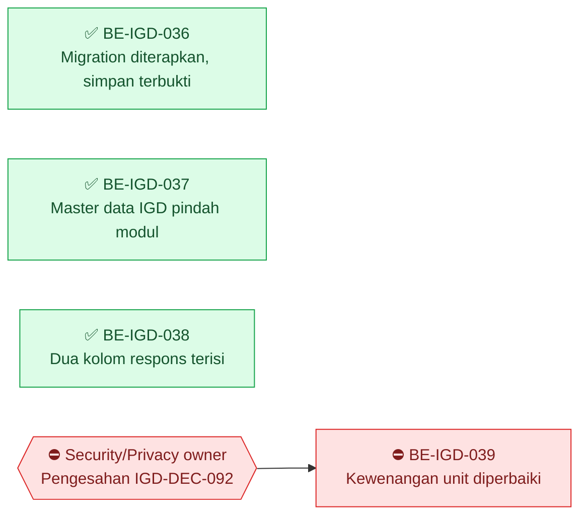

| Gelombang | Boleh mulai setelah | Task |
| ---: | --- | --- |
| 1 | — | `BE-IGD-036`, `BE-IGD-037`, `BE-IGD-038` — boleh paralel |
| — | ⛔ menunggu Security/Privacy owner | `BE-IGD-039` |

### ✅ `BE-IGD-036` — migration diterapkan

Berstatus `Pending` sejak 26 Agustus. Selama itu pengkajian IGD **tidak mungkin disimpan**, dan
login pun rusak bagi siapa pun yang menjalankan cabang ini. Diterapkan 27 Agt atas persetujuan
owner.

`IGD-UNK-03` **terjawab**: `TrxEmergencyTransfer` **0 baris**, jadi pembuangan empat kolom
penempatan tidak menghilangkan apa pun. Batasan arsitektur bagian 6.2 dengan demikian sudah
tidak berlaku.

Jalur simpan dibuktikan: `ASM-20260827-00003` tersimpan dengan `queueId = null`, lengkap dengan
tujuh kolom nyeri dan kolom turunan `BMI`, `MAP`, `EWS`.

### ✅ `BE-IGD-037` — menutup bagian `BE-IGD-013` yang ditahan

Bagian ketiga `BE-IGD-013` ditahan sejak 18 Agustus karena roadmap tidak menyatakan mana dari
dua cara yang dimaksud. Owner memilih pola `BillingManagement`: master data menjadi bagian modul
IGD. Route API, tag Swagger, dan `moduleCode` ikut berubah — lihat `FE-IGD-020` untuk sisi
frontend-nya.

Konfigurasi EF **tetap di `Repositories`** atas arahan owner, berbeda dari `BillingManagement`.
Penyimpangan yang disengaja.

### ⛔ `BE-IGD-039` — yang membuat `MVP-6` belum dapat jalan

| Field | Isi |
| --- | --- |
| **Status** | ⛔ **TERBLOKIR — menunggu keputusan Security/Privacy owner (belum ditunjuk) atas jembatan kewenangan unit dan pengesahan `IGD-DEC-092`.** Diperiksa ulang 15 September 2026: `EmergencyUnitAuthorityService.cs:85` tidak berubah sejak `f75ea039`. Temuan tambahan: keempat route **tulis** `order-items` ikut memanggil pemeriksaan ini, sehingga layar sikap pesanan tidak dapat dipakai siapa pun sebelum task ini beres — lihat [evidence 2026-09-15](../evidence/2026-09-15-pemeriksaan-status.md) `IGD-EV-109`. Laporan: [be-igd-036-039](../task/report/backend/be-igd-036-039-penerapan-migration-pemindahan-master-dan-audit-kesiapan.md) |
| **Slice** | `IGD-S07` · `MVP-6` |
| **Scope** | `EmergencyInstallationManagement/Services/EmergencyUnitAuthorityService.cs` |
| **Masalah** | `x.DepartmentId == unit.OrganizationUnitId.Value` membandingkan FK ke `MstDepartment` dengan FK ke `MstOrganizationUnit`. Nol id yang beririsan di basis data, sehingga **tidak akan pernah benar** |
| **Akibat** | `arrive`, `accept-handover`, dan `order-items` akan tetap `403` walau Master Data mengisi pemetaan unit — hanya berganti pesan |
| **Temuan menyertai** | `Hasil.UnitBelumDipetakan` diisi tetapi **tidak pernah dibaca**; nol DTO punya kolom alasan penembusan. `IGD-DEC-092` mensyaratkan fail-closed **beserta** jalan keluar beralasan; kode baru memenuhi separuhnya, sementara pesan galatnya menjanjikan jalan yang tidak ada |
| **Dugaan perbaikan** | `MstOrganizationUnit.DepartmentId` sebagai jembatan: pengguna berwenang bila ditugaskan pada departemen yang menaungi simpul organisasi unit itu |
| **Kenapa belum dikerjakan** | Mengubah aturan otorisasi, sedangkan `IGD-DEC-092` masih keputusan sementara |
| **Owner** | **Security/Privacy owner — belum ditunjuk** |

### Catatan `MVP-6`

Baris "menunggu `MstServiceUnit.OrganizationUnitId` terisi" pada catatan sebelumnya **tidak
lengkap**. Datanya memang kosong — 0 dari 18 unit — tetapi mengisinya saja tidak cukup selama
`BE-IGD-039` belum ditutup.

### Yang wajib dijawab sebelum push ke server

1. `BE-IGD-039` — jembatan kewenangan unit.
2. Jalan keluar beralasan: dibuat, atau pesan galatnya dikoreksi?
3. **Frontend dan backend wajib naik bersamaan** — route master data IGD berubah.
4. Dua migration billing yang sudah ada di basis data tetapi berkasnya tidak ada di cabang ini
   wajib diperiksa saat merge.

---

## R3.8 Gelombang 15 September 2026 — perbaikan pasca-pemeriksaan dan laporan susulan

Direncanakan `plan-module-delivery` pada 15 September 2026 dari temuan
[evidence/2026-09-15-pemeriksaan-status.md](../evidence/2026-09-15-pemeriksaan-status.md) dan
keputusan `IGD-DEC-110`…`121`. Slice baru: `IGD-S08`. **Belum ada source yang ditulis.**

Tiga task memperbaiki perilaku yang sudah ada tanpa migration; satu task hanya menulis laporan.
Teks berkas kontrak belum diselaraskan dengan `IGD-DEC-118`, `IGD-DEC-119`, dan `IGD-DEC-120`;
**keputusan yang berlaku** bila teks kontrak berbeda.

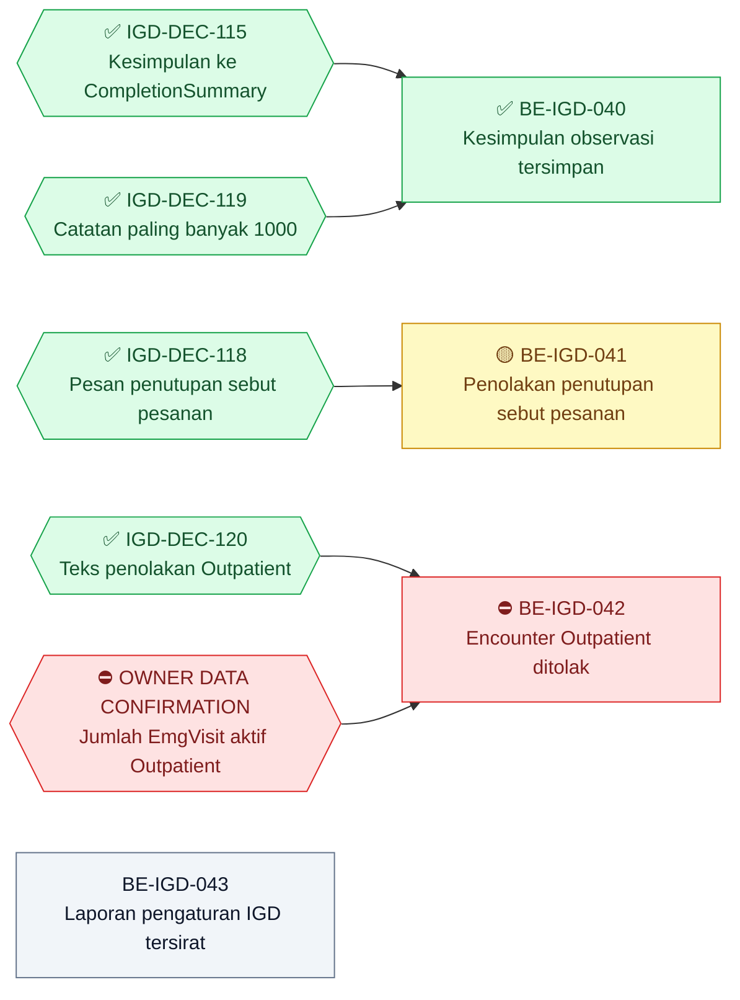

| Gelombang | Boleh mulai setelah | Task |
| ---: | --- | --- |
| 1 | `IGD-DEC-115` ✅, `IGD-DEC-119` ✅ | `BE-IGD-040` |
| 1 | `IGD-DEC-118` ✅ | `BE-IGD-041` 🟡 |
| 1 | — | `BE-IGD-043` |
| — | ⛔ menunggu **OWNER DATA CONFIRMATION** dari Rizki | `BE-IGD-042` |

Keempatnya boleh dikerjakan paralel karena menyentuh berkas berbeda: `BE-IGD-040` pada
`EmergencyObservationController`, `BE-IGD-041` pada `EmergencyDispositionService`,
`BE-IGD-042` pada `EmergencyVisitService`, dan `BE-IGD-043` tanpa source.

### ✅ `BE-IGD-040` — Kesimpulan observasi tersimpan saat periode diselesaikan

| Field | Isi |
| --- | --- |
| **Status** | ✅ **SELESAI (implementasi) 15 September 2026.** Acceptance 1–7 dipetakan ke source `EmergencyObservationController.UpdateObservationStatus` (branch `rizkiG`; di-commit owner pada `9f464cf3`, tidak berubah oleh merge `0aa42668` — diperiksa ulang 15 September 2026); satu berkas source, 36 baris ditambah, 4 dihapus; nol migration. Kriteria 5 dengan **delta tercatat**: catatan > 2000 karakter ditolak lebih dulu oleh `[MaxLength(2000)]` DTO dengan pesan bawaan validasi model — DTO sengaja tidak diubah **atas keputusan pengguna 15 September 2026**. **Build = Not Verified** — `dotnet build ./QuilvianSystemBackend.csproj -p:RunAnalyzers=false` diserahkan kepada Rizki. Proyek test tidak ada (`IGD-DEC-110`). Uji API manual contoh 1–6: belum dijalankan (`NOT FEASIBLE` bagi agent). **Runtime verified: belum.** Bukan UAT. Bukti: [laporan](../task/report/backend/BE-IGD-040.md). *Keadaan sebelumnya: direncanakan 15 September 2026, belum dikerjakan* |
| **Outcome** | Perawat menutup periode observasi beserta kesimpulannya, dan kesimpulan itu benar-benar tersimpan — hari ini kalimat itu dibuang tanpa pesan galat |
| **Slice** | `IGD-S08` |
| **Requirement** | **Coverage gap:** tidak ada `FR-IGD-*` untuk penutupan observasi; kapabilitasnya `IGD-CAP-26` (`EXISTING / REUSE`). Dijejak ke keputusan |
| **Keputusan** | `IGD-DEC-115`, `IGD-DEC-119`, `IGD-OQ-083` (bagian `Cancelled` dikecualikan); bukti `IGD-EV-110` |
| **Kontrak** | Bentuk request/response tidak berubah — `UpdateEmergencyObservationObservationStatusRequest` (`observationStatus`, `notes`). Perilaku baru dan batas 1000 karakter berasal dari `IGD-DEC-115`/`119` |
| **Reuse** | Pola `EscalationReason = NormalizeText(request.Notes) ?? entity.EscalationReason` pada baris 303 |
| **Scope** | `Areas/HealthServices/EmergencyInstallationManagement/Controllers/EmergencyObservationController.cs` — method `UpdateObservationStatus`, baris 302–307 pada `e89907c5`. Tanpa migration |
| **Dependency** | `IGD-DEC-115` ✅; `IGD-DEC-119` ✅ |
| **Acceptance** | 1. `Completed` + `notes` → `200`; `CompletionSummary` berisi catatan yang sudah dirapikan; `EndedAt` terisi; status kunjungan berpindah lewat penjaga seperti sekarang. 2. `Completed` tanpa `notes` → `200`; `CompletionSummary` lama **tidak** terhapus. 3. `Escalated` tetap menulis ke `EscalationReason`. 4. `Cancelled` **tidak berubah perilakunya** — catatan tidak disimpan (`IGD-OQ-083`). 5. `Completed` atau `Escalated` dengan `notes` lebih dari 1000 karakter → `400` *"Catatan paling banyak 1000 karakter."*, diperiksa **sebelum** data apa pun berubah; **tidak ada pemotongan diam-diam**. 6. Cabang refleksi `GetProperty("Notes")` pada method ini dibuang; refleksi serupa di `EmergencyResuscitationController`, `EmergencyTriageController`, dan `EmergencyVisitController` hanya **dicatat** di laporan, tidak diubah. 7. Penolakan `409` dari penjaga status kunjungan tetap terjadi lebih dulu dan pesannya tidak berubah |
| **Contoh** | `PATCH .../emergency-observations/{id}/observation-status` dengan `{"observationStatus":2,"notes":"Nyeri dada hilang setelah 2 jam, EKG ulang normal, siap disposisi"}` → `200`, `completionSummary` berisi kalimat itu. Catatan 1.250 karakter → `400`, periode tetap `Active` |
| **Bukti** | Pemetaan acceptance criteria ke source; contoh request/response uji API manual untuk kriteria 1–5 (`IGD-DEC-110`); perintah build untuk Rizki; laporan `task/report/backend/BE-IGD-040.md` |
| **Risiko** | Rendah |
| **Owner** | Backend IGD |
| **DoD** | Acceptance 1–7 terpetakan; laporan tracked ada; roadmap dan traceability diperbarui; QBE preflight diselesaikan saat eksekusi mengikuti `AGENTS.md` backend; tanpa UAT PASS |

### 🟡 `BE-IGD-041` — Penolakan penutupan kunjungan menyebut pesanan yang menahannya

| Field | Isi |
| --- | --- |
| **Status** | 🟡 **SEBAGIAN — 16 September 2026.** Implementasi selesai pada dua berkas (`+66/−19`): kueri pesanan penahan dipisahkan menjadi `EmergencyDepartureService.AmbilPesananPenahanPenutupanAsync` beserta peringkas statis `RingkasUraianPesanan`, lalu `EmergencyDispositionService` menyuntik service itu dan menyusun pesan §6 aturan 4 beserta daftar pesanannya. Kueri kembar dihapus — aturannya kini hanya ada satu di seluruh modul. Ketujuh acceptance criteria **terpetakan ke source**; nol baris baru di `Program.cs`, nol migration, nol endpoint. **Yang menahan ✅:** `dotnet build` dan uji API tiga skenario (nol, dua, tujuh pesanan) **belum dijalankan** — keduanya milik Rizki. **Delta scope:** `EmergencyDepartureService.cs` ikut disentuh di luar scope kartu, karena dua kalimat approved yang berbeda (`IGD-DEC-102` §5 aturan 12 dan `IGD-DEC-118` §6 aturan 4) memakai kueri yang sama — yang dibagi aturannya, bukan kalimatnya; nol kalimat approved diubah. **Temuan dilaporkan, tidak ditambal:** kondisi aturan 4 hanya menyaring pesanan `Rejected`, sedangkan judulnya menyebut "pesanan tanpa sikap" — memperluasnya mengubah perilaku dan butuh keputusan pemilik. Bukti: [laporan](../task/report/backend/BE-IGD-041.md). *Keadaan sebelumnya: direncanakan 15 September 2026, belum dikerjakan* |
| **Outcome** | Dokter yang menutup kunjungan langsung tahu pesanan mana yang belum diberi sikap, tanpa membuka setiap kepergian satu per satu |
| **Slice** | `IGD-S08` · menutup kriteria 2 `BE-IGD-035` (`EPIC IGD-07`) |
| **Requirement** | `FR-IGD-051` — kunjungan tidak dapat diselesaikan bila ada pesanan tanpa sikap |
| **Keputusan** | `IGD-DEC-118`, `IGD-DEC-106`; bukti `IGD-EV-122` |
| **Kontrak** | Validation §6 aturan 4 **sebagaimana diubah `IGD-DEC-118`**: pesan generik diperkaya menjadi *"Masih ada pesanan yang belum ditentukan sikapnya: {daftar pesanan}."* Kode tetap `409`; kondisi penolakan tidak berubah |
| **Reuse** | `EmergencyDepartureService.ValidatePesananSebelumPenutupanAsync` (baris 548) — sudah menyusun daftar hingga lima uraian beserta *"dan N lainnya"*, sudah terdaftar di DI, dan saat ini **nol pemanggil**. `EmergencyDispositionService` hanya bergantung pada `ApplicationDbContext`, sehingga menyuntikkan `EmergencyDepartureService` tidak membuat ketergantungan melingkar |
| **Scope** | `Areas/HealthServices/EmergencyInstallationManagement/Services/EmergencyDispositionService.cs` — `ValidateVisitClosureAsync`, baris 132–142; konstruktor service yang sama |
| **Dependency** | `IGD-DEC-118` ✅ |
| **Acceptance** | 1. Penutupan kunjungan yang punya pesanan ditolak dan belum diberi sikap pengganti → `409` dengan pesan yang **menyebut uraian pesanannya**. 2. Paling banyak lima uraian; bila lebih, ditambah *"dan N lainnya"*. 3. **Satu sumber aturan:** kueri kembar pada `ValidateVisitClosureAsync` dihapus dan diganti pemanggilan `ValidatePesananSebelumPenutupanAsync`; nol kueri aturan kedua. 4. Aturan §6 nomor 1–3 tetap dijalankan lebih dulu, dengan urutan dan pesan yang sama. 5. Kunjungan tanpa pesanan ditolak tetap dapat ditutup. 6. Nol baris baru di `Program.cs`. 7. Status `BE-IGD-035` dinilai ulang: kriteria 2 terpenuhi, tetapi task itu tetap 🟡 selama `BE-IGD-039` belum beres |
| **Contoh** | Tujuh pesanan ditolak Rawat Inap → *"Masih ada pesanan yang belum ditentukan sikapnya: Darah lengkap, Elektrolit, Ureum, Kreatinin, Gula darah sewaktu dan 2 lainnya."* |
| **Bukti** | Pemetaan acceptance criteria ke source; uji API manual `PATCH /emergency-visits/{id}/complete` untuk nol, dua, dan tujuh pesanan; perintah build untuk Rizki; laporan `task/report/backend/BE-IGD-041.md` |
| **Risiko** | Rendah-menengah — jalur penutupan dipakai setiap kunjungan IGD |
| **Owner** | Backend IGD |
| **DoD** | Acceptance 1–7 terpetakan; laporan tracked ada; roadmap dan traceability diperbarui, termasuk baris Status `BE-IGD-035`; QBE preflight diselesaikan saat eksekusi mengikuti `AGENTS.md` backend; tanpa UAT PASS |

### ⛔ `BE-IGD-042` — Encounter `Outpatient` ditolak untuk kunjungan IGD

| Field | Isi |
| --- | --- |
| **Status** | ⛔ **BLOCKED — menunggu konfirmasi owner mengenai jumlah `EmgVisit` aktif dengan `EncounterType.Outpatient`.** Rizki menjalankan kueri sendiri dan menyerahkan hasilnya. **Agent dilarang menjalankan kueri basis data**, termasuk `SELECT`. Selama hasil belum diserahkan, kartu ini tetap ⛔ dan **tidak boleh** diasumsikan nol |
| **Outcome** | Pasien IGD tidak lagi dapat didaftarkan dengan encounter rawat jalan, sehingga tidak ikut terhitung pada laporan rawat jalan |
| **Slice** | `IGD-S08` · `EPIC IGD-01` |
| **Requirement** | `FR-IGD-001`, `FR-IGD-002` |
| **Keputusan** | `IGD-DEC-074`, `IGD-DEC-109` (syarat pencabutan), `IGD-DEC-120` (teks pesan); bukti `IGD-EV-121` |
| **Kontrak** | Validation §1 aturan 2 **sebagaimana diselaraskan `IGD-DEC-120`** — kode `400`, pesan *"Encounter yang dipilih bukan kunjungan IGD. Pilih atau buat encounter dengan jenis kunjungan gawat darurat untuk pasien ini."* |
| **Reuse** | `EmergencyVisitService.PeriksaJenisEncounter` (baris 259) — satu tempat, sudah dipakai jalur controller (baris 609) dan service (baris 180) |
| **Scope** | `Areas/HealthServices/EmergencyInstallationManagement/Services/EmergencyVisitService.cs` baris 250–267 (pemeriksaan dan komentar masa transisi) |
| **Dependency** | ⛔ **OWNER DATA CONFIRMATION — jumlah `EmgVisit` aktif dengan `EncounterType.Outpatient`**; `IGD-DEC-120` ✅ |
| **Prasyarat data** | Kueri yang **dijalankan Rizki sendiri**: `SELECT COUNT(*) FROM public."EmgVisit" v JOIN public."RegPatientEncounter" e ON e."Id" = v."EncounterId" WHERE v."IsDelete" = false AND e."EncounterType" = 1;` Bila hasilnya **bukan nol**, task ini **tidak** dilanjutkan; kunjungan-kunjungan itu dibawa kembali ke owner untuk diputuskan lebih dulu |
| **Acceptance** | 1. `EncounterType.Outpatient` ditolak `400` dengan pesan `IGD-DEC-120`, pada jalur controller maupun service. 2. `EncounterType.Emergency` tetap diterima. 3. Kunjungan lama tidak diubah; daftar dan detailnya tetap terbaca. 4. Frontend tidak perlu diubah — `FE-IGD-014` sudah mengirim `Emergency`. 5. Komentar masa transisi diperbarui menjadi keadaan sesudah pencabutan, merujuk `IGD-DEC-109` dan hasil konfirmasi owner beserta tanggalnya |
| **Bukti** | Hasil kueri dari Rizki beserta tanggal; pemetaan acceptance criteria ke source; uji API manual kedua jenis encounter; perintah build untuk Rizki; laporan `task/report/backend/BE-IGD-042.md` |
| **Risiko** | **Menengah** — pintu masuk pasien IGD |
| **Owner** | Backend IGD; konfirmasi data: Rizki |
| **DoD** | Acceptance 1–5 terpetakan; laporan tracked ada; roadmap dan traceability diperbarui; QBE preflight diselesaikan saat eksekusi mengikuti `AGENTS.md` backend; tanpa UAT PASS |

### `BE-IGD-043` — Laporan susulan pengaturan IGD tersirat (`f76ebaab`)

| Field | Isi |
| --- | --- |
| **Status** | **Direncanakan 15 September 2026 — belum dikerjakan.** Task laporan; **nol perubahan source** |
| **Outcome** | Perubahan 28 Agustus 2026 yang sudah di-commit tanpa laporan kini punya laporan tracked yang dapat ditinjau |
| **Slice** | `IGD-S08` |
| **Requirement** | — (laporan atas perilaku pendaftaran dan disposisi yang sudah berjalan) |
| **Keputusan** | `IGD-DEC-112`; bukti `IGD-EV-118` |
| **Kontrak** | Tidak ada perubahan |
| **Scope** | Baca-saja: `EmergencyVisitService.ResolveActiveSettingAsync` dan `PesanPengaturanTidakTersedia`, `EmergencyVisitController`, `EmergencyDispositionService`, `MasterData/Seeders/EmergencyMasterDataSeeder.cs`. Tulis: `task/report/backend/BE-IGD-043.md`, baris status roadmap, traceability |
| **Dependency** | — |
| **Acceptance** | 1. Setiap aturan `IGD-DEC-112` dipetakan ke baris source. 2. Akibat samping pada disposisi dijelaskan dengan contoh: registrasi `Provisional` + disposisi `Executed` kini ditolak saat tabel pengaturan kosong. 3. Penjaga seeder level triase dicatat, termasuk fakta bahwa seeder itu masih tanpa pemanggil. 4. Uji API manual dicatat, atau dinyatakan `NOT FEASIBLE` beserta alasannya. 5. **Nol perubahan source** |
| **Bukti** | Laporan tracked; `git diff` source kosong |
| **Risiko** | Rendah |
| **Owner** | Backend IGD |
| **DoD** | Acceptance 1–5 terpenuhi; laporan tracked ada; roadmap dan traceability diperbarui; tanpa UAT PASS |

### Blocker yang tetap dicatat, bukan dikerjakan

| Blocker | Menahan | Pemilik | Keadaan |
| --- | --- | --- | --- |
| `BE-IGD-039` — kewenangan unit | `MVP-6`; route tulis `order-items`, `arrive`, `accept-handover` | Security/Privacy owner (belum ditunjuk) | ⛔ tidak diperbaiki pada gelombang ini |
| Penyambungan pemesanan radiologi IGD | `IGD-DEC-111` butir (d) | Yoga Aji Pratama — `ActAsRadiologist` belum dapat diberikan | ⛔ tidak diimplementasikan |
| OWNER DATA CONFIRMATION | `BE-IGD-042` | Rizki | ⛔ menunggu jumlah baris |

### Gap yang dicatat tanpa ID task

Atas instruksi Product/Domain Owner 15 September 2026, dua gap berikut **tidak** diberi ID dan
tidak memakai `FE-IGD-024`/`FE-IGD-025`: **layar resusitasi IGD** (`IGD-EV-111`) dan **layar
baca/aksi pesanan kepergian `order-items`** (`IGD-EV-109`). Keduanya murni frontend.

---

## R3.9 Gelombang 16 September 2026 — pemantauan observasi bertanda vital

Lahir dari audit Observasi V1 lawan V2
([evidence](../evidence/2026-09-15-audit-observasi-v1-v2.md)) dan keputusan `IGD-DEC-122`
sampai `IGD-DEC-126`. Kontrak yang mengikat: API `0.6.0` bagian 7 dan validation `0.6.0`
bagian 9. **Source sudah ditulis 16 September 2026** dan build-nya bersih; runtime belum
diverifikasi.

DoD baku gelombang ini: acceptance criteria terpetakan ke source; contoh request/response uji
API manual per kriteria (`IGD-DEC-110`); perintah build diberikan kepada Rizki; laporan tracked
`task/report/backend/<TASK-ID>.md`; roadmap dan traceability diperbarui; QBE preflight
diselesaikan saat eksekusi mengikuti `AGENTS.md` backend; tanpa UAT PASS.

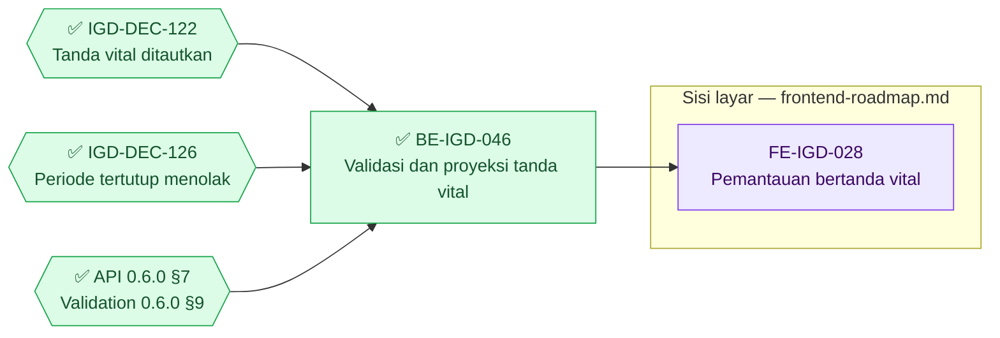

| Gelombang | Boleh mulai setelah | Task |
| ---: | --- | --- |
| 1 | `IGD-DEC-122` ✅, `IGD-DEC-126` ✅, kontrak `0.6.0` | `BE-IGD-046` ✅ |
| 2 | `BE-IGD-046` | `FE-IGD-028` — milik roadmap frontend |

### ✅ `BE-IGD-046` — Validasi dan proyeksi tanda vital pada detail observasi

| Field | Isi |
| --- | --- |
| **Status** | ✅ **SELESAI (implementasi) 16 September 2026.** Seluruh 12 acceptance criteria dipetakan ke source pada tiga berkas: `EmergencyObservationService.cs` (+177/−1), `EmergencyObservationDetailController.cs` (+113/−42), `EmergencyObservationDetailDtos.cs` (+56/−0); nol migration, nol kolom baru, nol endpoint baru, nol registrasi service baru. **Build = Verified** — `dotnet build ./QuilvianSystemBackend.csproj -p:RunAnalyzers=false` dijalankan Rizki 16 September 2026: *Build succeeded with 207 warning(s) in 223,7s*, **nol error**; 207 warning adalah baseline repository, bukan hasil task ini. Proyek test tidak ada (`IGD-DEC-110`). Uji API manual contoh 1–10: belum dijalankan (`NOT FEASIBLE` bagi agent). **Runtime verified: belum.** Bukan UAT. Butir 10 DoD tetap terbuka: `IGD-DEC-122`…`126` belum disetujui Clinical Governance dan Nursing authority. Delta tercatat: `PUT` sengaja tidak ikut menolak periode tertutup, dan pesan periode tidak ditemukan mengikuti teks validation `0.6.0`. Bukti: [laporan](../task/report/backend/BE-IGD-046.md). *Keadaan sebelumnya: direncanakan 16 September 2026, belum dikerjakan* |
| **Outcome** | Pemantauan observasi hanya dapat menautkan tanda vital milik pasien dan kunjungan yang sama, pelaku pencatat tidak dapat dipalsukan, periode yang sudah ditutup menolak pemantauan baru, dan layar dapat menampilkan angka tanda vital beserta nama pencatat tanpa permintaan tambahan per baris |
| **Slice** | `IGD-S04` · `EPIC IGD-09` (pemantauan observasi) |
| **Requirement** | **Coverage gap:** tidak ada `FR-IGD-*` untuk pemantauan observasi; kapabilitasnya `IGD-CAP-26` (`EXISTING / REUSE`) dan `IGD-CAP-21` (`Ready to reuse`). Dijejak ke keputusan |
| **Keputusan** | `IGD-DEC-122`, `IGD-DEC-123`, `IGD-DEC-124`, `IGD-DEC-125`, `IGD-DEC-126`; `IGD-DEC-056` (kosong bukan nol), `IGD-DEC-057` (identitas pencatat); bukti `IGD-EV-124`…`130` |
| **Kontrak** | API `0.6.0` bagian 7 — request tidak bertambah field, response bertambah `vitalSign` dan `recordedByName`, `recordedByUserId` usang tetapi tetap diterima; validation `0.6.0` bagian 9 aturan 1–12 beserta urutan pemeriksaan 9.1 |
| **Reuse** | `EmergencyObservationService` yang sudah terdaftar; relasi `PatientVitalSign` dan `RecordedByUser` yang sudah dikonfigurasi pada `EmgObservationDetailConfiguration`; pola penolakan `ApiResponse<object>.Fail` yang sudah dipakai controller ini |
| **Scope** | `Areas/HealthServices/EmergencyInstallationManagement/Services/EmergencyObservationService.cs`, `Controllers/EmergencyObservationDetailController.cs`, `DTOs/EmergencyObservationDetailDtos.cs`. **Tanpa migration, tanpa kolom baru, tanpa endpoint baru.** Bila pendaftaran service menuntut baris baru di `Program.cs`, agent berhenti dan meminta persetujuan owner lebih dulu |
| **Dependency** | `IGD-DEC-122` ✅, `IGD-DEC-126` ✅, kontrak `0.6.0`. Tidak menunggu task lain |
| **Acceptance** | 1. `POST` dengan `patientVitalSignId` milik pasien **dan** encounter yang sama → `200`, tautan tersimpan. 2. Tanda vital milik pasien lain → `400` *"Tanda vital yang dipilih bukan milik pasien pada kunjungan ini."* 3. Tanda vital dari encounter lain → `400` *"Tanda vital yang dipilih berasal dari kunjungan lain. Pilih tanda vital dari kunjungan IGD yang sedang dibuka."* 4. Tanda vital yang dibatalkan, dihapus, atau tidak aktif → `400` *"Tanda vital yang dipilih sudah tidak berlaku. Pilih tanda vital lain atau catat tanda vital baru."* 5. `recordedByUserId` yang dikirim pemanggil **diabaikan**; nilai tersimpan selalu dari pengguna terautentikasi, dan permintaannya **tidak** ditolak. 6. `POST` pada periode `Completed` atau `Cancelled` → `409` *"Periode observasi ini sudah ditutup, pemantauan baru tidak dapat ditambahkan. Buka periode observasi baru bila pasien masih perlu dipantau."*; periode `Active` dan `Escalated` tetap diterima. 7. Response `GET /` dan `GET /{id}` membawa `vitalSign` sesuai kontrak bagian 7.2 dalam **satu** kueri — tidak ada permintaan tambahan per baris dari frontend. 8. Response membawa `recordedByName`; kosong bila pengguna tidak ditemukan, **tanpa** menampilkan GUID. 9. Baris pemantauan lama tanpa `patientVitalSignId` tetap terbaca dengan `vitalSign` bernilai `null`. 10. Nol migration dan nol perubahan kolom. 11. Alur `PATCH .../observation-status` beserta `CompletionSummary` (`BE-IGD-040`) **tidak berubah**. 12. `progressNoteId` mengikuti aturan lingkup yang sama dengan tanda vital (validation bagian 9 aturan 8) |
| **Bukti** | Pemetaan acceptance criteria ke source; contoh request/response uji API manual untuk kriteria 1–9 (`IGD-DEC-110`); perintah build untuk Rizki; laporan `task/report/backend/BE-IGD-046.md` |
| **Risiko** | **Rendah–menengah.** Menambah penolakan pada endpoint yang sudah dipakai layar; pemantauan yang sudah berjalan tidak berubah bentuk requestnya. Perhatian: jangan mengubah perilaku `Escalated`, dan jangan membuka jalur entri susulan (`IGD-OQ-090`) |
| **Owner** | Backend IGD |
| **DoD** | DoD baku gelombang ini; butir 10 DoD dicatat terbuka selama `IGD-DEC-122`…`126` belum disetujui Clinical Governance dan Nursing authority |

---

## R3.10 Gelombang 17 September 2026 — nomor urut penilaian triage

Lahir dari uji layar pemilik, bukan dari perencanaan. Saat mencoba **Simpan Pemeriksaan** pada
triage IGD, layar menolak dengan `409`. Penelusuran menemukan cacat yang jauh lebih luas
daripada satu layar.

### 🟡 `BE-IGD-047` — Nomor urut, penanda penilaian ulang, dan penunjuk pendahulu ditetapkan server

**Status.** ✅ **SELESAI — 17 September 2026.** Akar masalah terbukti lewat log, kueri basis
data pemilik, dan pembacaan source. Ketujuh perubahan ditulis, `dotnet build` lulus, dan **uji
API tiga skenario lulus** dijalankan pemilik. Dibuktikan sekali lagi lewat layar bersama
`FE-IGD-033`. Tanpa UAT.
[Laporan](../task/report/backend/BE-IGD-047.md).

**Akar masalah.** `CreateEmergencyTriageRequest.Sequence` berbawaan `1`, sementara controller
memakai `request.Sequence > 0 ? request.Sequence : hitung()`. Cabang penghitungan di server
karena itu **tidak pernah dijalankan**, dan setiap penilaian disimpan dengan nomor urut `1`.
Penilaian **kedua** pada kunjungan mana pun selalu menabrak
`IX_EmgTriage_EmergencyVisitId_Sequence` dan ditolak `409`.

Cacat ini sudah ada sejak endpoint-nya dibuat. Ia tidak pernah terlihat karena uji lewat layar
pada modul ini baru dijalankan 16 September 2026.

**Lingkup.** Nol migration, nol perubahan kontrak, nol kolom baru. Tiga ruas request menjadi
usang-tetapi-tetap-diterima — pola yang sama dengan `recordedByUserId` pada `BE-IGD-046`.

**Acceptance criteria.**

| # | Kriteria | Bukti |
| ---: | --- | --- |
| 1 | Penilaian kedua pada satu kunjungan tersimpan dengan nomor urut `2` | Uji API skenario 1 |
| 2 | Penilaian ketiga tersimpan dengan nomor urut `3` | Uji API skenario 2 |
| 3 | `sequence` kiriman pemanggil diabaikan | Uji API skenario 1 dengan `sequence` diisi sembarang |
| 4 | `isRetriage` dan `previousTriageId` diisi server | Response skenario 1 |
| 5 | `PUT` tanpa `sequence` tidak mengubah nomor urut baris | Uji API skenario 3 |
| 6 | Nomor urut dihitung tanpa menyaring `IsDelete`, sejajar index unik | Pembacaan source |
| 7 | Tabrakan nomor urut diulang sekali sebelum ditolak | Pembacaan source |
| 8 | Penolakan duplikat dan penolakan foreign key memakai pesan berbeda | Pembacaan source; uji API bila tersedia |
| 9 | Kegagalan simpan mencatat `EmergencyVisitId` dan nomor urut yang dicoba | Entri log `EmergencyTriage.Create` |

**Definition of Done.** Butir 1 dan 2 DoD gelombang tidak dapat dijawab — proyek test backend
dihapus (`IGD-DEC-110`); penggantinya uji API tiga skenario pada laporan bagian 6. Butir 10
tidak berlaku: seluruh perubahan berada di dalam `EmergencyInstallationManagement`.

**Yang perlu dinilai pemilik.** `IsRetriage` dan `PreviousTriageId` kini terisi, padahal
sebelumnya selalu kosong karena layar tidak pernah mengirimnya. Keduanya memakai definisi yang
sudah dipakai jalur retriage. Lihat laporan bagian 4.

---

## R3.11 Gelombang 17 September 2026 (kedua) — `EPIC IGD-04` dikerjakan

Dua task dikerjakan dan satu task lahir dari audit.

### ✅ `BE-IGD-045` — selesai dan terverifikasi

Lihat kartunya di R3.4. Build lulus nol error dan **dua belas skenario uji API seluruhnya `PASS`**
17 September 2026, dijalankan pemilik. UAT belum dan tidak diklaim.

### ✅ `BE-IGD-048` — Pengisian data lama penugasan dokter IGD

| Field | Isi |
| --- | --- |
| **Status** | ✅ **SELESAI — 21 September 2026.** Pemilik menyetujui rekonsiliasi schema (`IGD-DEC-136`). Source: model `Guid?`, konfigurasi EF opsional, DTO `Guid?`, proyeksi service `"Data historis"` dalam satu kueri, kamus data, API contract `0.8.0`. Migration `20260921032943_BackfillEmergencyDoctorAssignment`: `AlterColumn` nullable + `INSERT` idempoten (`EffectiveFrom` = `EmgVisit.ArrivalDateTime`, historical fallback) + `Down()` berguard (guard A, `DELETE` terbatas, guard C). `dotnet build` → `0 Error(s)`, `207 Warning(s)`. **Terbukti** di salinan basis data terpisah berkandidat sintetis dan di dev; rinciannya di [laporan](../task/report/backend/BE-IGD-048.md) bagian 5.1. **Tidak dijalankan:** uji HTTP dengan token dan tampilan layar baris legacy; UAT belum. *Sebelumnya ⛔ 18 September (schema `NOT NULL`), lalu 🟡 pada hari yang sama sebelum migration dijalankan* |
| **Outcome** | Setiap kunjungan IGD yang encounter-nya sudah punya dokter memperoleh satu baris riwayat berjalan, sehingga `GET /active` tidak lagi membalas `404` untuk kunjungan lama |
| **Slice** | `IGD-S06` · `EPIC IGD-04` · `MVP-5` |
| **Requirement** | `FR-IGD-017`, `FR-IGD-019` — melanjutkan acceptance 4 `BE-IGD-044` |
| **Keputusan** | `IGD-DEC-082`, `IGD-DEC-116`, `IGD-DEC-130`, **`IGD-DEC-136`** |
| **Dependency** | `BE-IGD-044` ✅ tabel ada; `BE-IGD-045` ✅ terverifikasi; rekonsiliasi schema **disetujui pemilik 21 September 2026** |
| **Batas eksekusi** | Agent menyusun source dan migration lalu **berhenti**; `migrations add` dan `database update` dijalankan Rizki. **Dilarang** menyunting, menghapus, atau meregenerasi `20260917072515_AddEmergencyDoctorAssignment` yang sudah applied |
| **Owner** | Backend IGD; migration: Rizki |

#### Hasil audit schema — semuanya `NOT NULL`

| Artefak | Keadaan aktual |
| --- | --- |
| `Models/EmgDoctorAssignment.cs` | `[Required] public Guid AssignedByUserId` — value type non-nullable |
| `EmgDoctorAssignmentConfiguration.cs` | `HasOne(AssignedByUser).HasForeignKey(AssignedByUserId)` — relasi wajib, `Restrict` |
| Migration `20260917072515` | `AssignedByUserId = table.Column<Guid>(type: "uuid", nullable: false)` + FK `Restrict` |
| `ApplicationDbContextModelSnapshot.cs` | `b.Property<Guid>("AssignedByUserId")` tanpa `IsRequired(false)` |
| `erd/data-dictionary.md` §4 | "Wajib" |
| DTO `EmergencyDoctorAssignmentResponse` | `public Guid AssignedByUserId` |

Keenam artefak konsisten satu sama lain, dan **keenamnya bertentangan dengan `IGD-DEC-136`**.

#### Rekonsiliasi yang dibutuhkan

| Berkas | Perubahan |
| --- | --- |
| `Models/EmgDoctorAssignment.cs` | `[Required] Guid` → `Guid?`; atribut `[Required]` dicabut |
| `EmgDoctorAssignmentConfiguration.cs` | Relasi menjadi opsional; FK tetap `Restrict` |
| `DTOs/EmergencyDoctorAssignmentDtos.cs` | `AssignedByUserId` pada response → `Guid?` |
| `erd/data-dictionary.md` §4 | "Wajib" → wajib untuk transaksi baru, boleh kosong untuk baris legacy |
| `contracts/api-contract.md` §3.2 | Catatan bahwa `assignedByUserId` dapat kosong pada baris legacy |

**Harga yang harus disadari.** Mencabut `NOT NULL` memindahkan jaminan "setiap penugasan baru
punya pelaku" dari basis data ke lapisan service. Jaminan itu **tetap kuat**, karena
`AssignEmergencyDoctorRequest` dan `HandoverEmergencyDoctorRequest` tidak punya ruas pelaku
sama sekali — pemanggil tidak dapat menentukannya, dan service selalu mengisinya dari token.
Yang hilang hanyalah jaring pengaman terakhir bila kelak ada jalur tulis baru yang lupa.

#### Perubahan data

| Kolom | Nilai untuk baris legacy |
| --- | --- |
| `EmergencyVisitId` | Kunjungan lama |
| `DoctorId` | Dari `RegPatientEncounter.DoctorId` |
| `EffectiveFrom` | **`v."ArrivalDateTime"`** (`EmgVisit`, waktu kedatangan pasien di IGD) — **historical fallback**, bukan waktu penetapan dokter yang terbukti. *Dikoreksi 21 September 2026 (review final pemilik): sebelumnya `COALESCE(e."UpdateDateTime", e."CreateDateTime")`; `UpdateDateTime` adalah waktu edit terakhir apa pun, bukan waktu penetapan dokter* |
| `EffectiveTo` | `NULL` — penugasannya memang masih berjalan |
| `AssignedByUserId` | **`NULL`** — pelaku historis tidak dapat dibuktikan (`IGD-DEC-136`) |
| `AssignmentReason` | Penanda data historis |

`RegPatientEncounter.DoctorId` **tidak dipindahkan dan tidak dihapus**. Ia tetap menjadi pointer
dokter efektif; tabel penugasan menyimpan riwayat temporalnya.

#### Acceptance — diverifikasi pemilik lewat kueri sesudah migration

| # | Kriteria | Kueri | Harapan |
| ---: | --- | --- | :-: |
| A | Nol kunjungan berdokter yang belum punya assignment | `MissingAssignment` | `0` |
| B | Nol kunjungan dengan lebih dari satu assignment aktif | `ActiveAssignmentCount > 1` | `0 row` |
| C | Dokter aktif sinkron dengan `RegPatientEncounter.DoctorId` | `IS DISTINCT FROM` | `0 row` |
| D | ~~Dijalankan dua kali~~ **Dikoreksi pemilik 21 September 2026:** migration yang sudah applied tidak menjalankan `Up()` lagi. Diuji di basis data terpisah dengan siklus `Up → verifikasi → Down → verifikasi → Up → verifikasi`; idempotensi `INSERT … WHERE NOT EXISTS` diuji terpisah sebagai pernyataan lepas | `Up→Down→Up` + `INSERT` lepas | hasil `Up` kedua sama dengan pertama; `INSERT` lepas menyisipkan `0` baris |
| E | Jumlah baris tersisip dan terlewati dicatat pada laporan task | — | tercatat |

#### Nol kandidat bukan tanda task ini tidak perlu

Kueri kandidat pemilik pada basis data dev 18 September 2026 mengembalikan **0 baris**. Pada
environment itu migration akan menyisipkan 0 baris, dan **itu hasil yang benar**. Task ini tetap
diperlukan sebagai jalur migrasi bagi environment dan basis data lain yang memuat data lama.
**Dilarang** menyatakan task ini selesai hanya karena dev bersih.

#### Yang **tidak** dibuat

Nol halaman, nol menu, dan nol layar frontend untuk pengisian data lama. `BE-IGD-048` adalah
corrective/data migration, bukan fitur operasional. Hasilnya dibaca `FE-IGD-027` yang sudah ada.

---

## R3.12 Gelombang 21 September 2026 (sore) — dua task dari keputusan pemilik

Keputusan pemilik atas dua temuan gerbang backlog frontend (`IGD-DEC-137`, `IGD-DEC-138`, `IGD-OQ-093`).
**`BE-IGD-049` ✅ dan `BE-IGD-050` ✅ — keduanya selesai atas penilaian pemilik (`BE-IGD-049` uji API S2–S5 lulus 22 September 2026;
`BE-IGD-050` build dan uji API S1–S7 lulus 21 September 2026 malam). Source dan dokumen sudah di-commit pemilik sebagai `3ebc4110`.** Keputusan pemilik untuk `BE-IGD-050`: mekanisme lapis A,
hak akses `EmergencyVisit : Create`, dan `fail-open` pada `FE-IGD-034`.

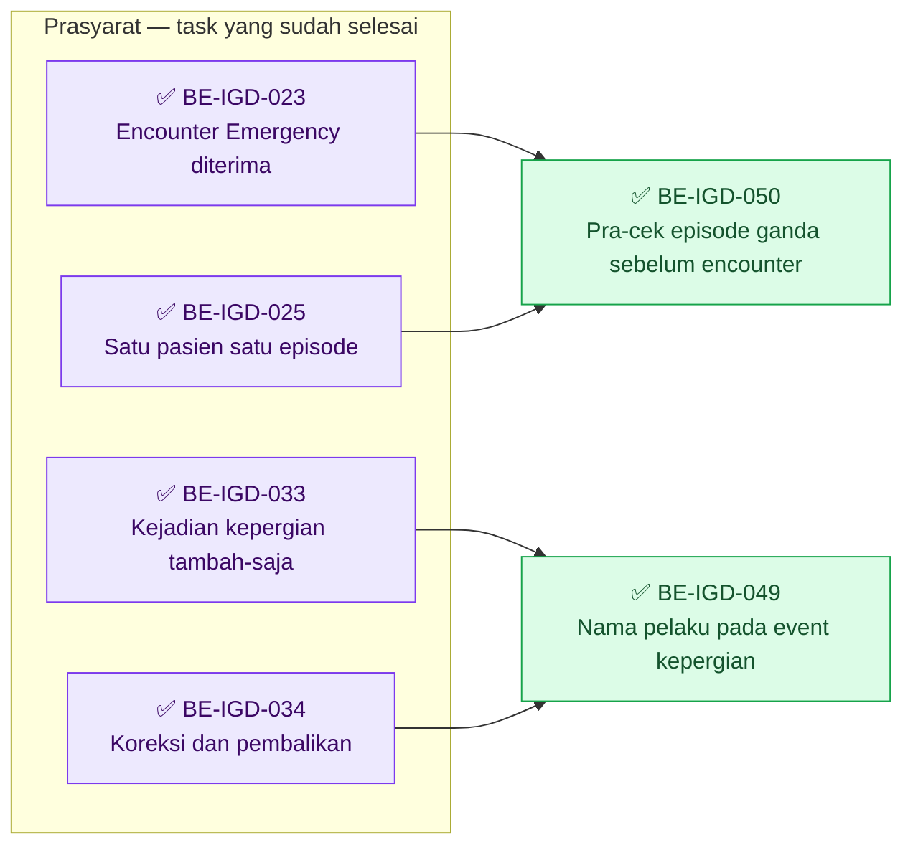

| Gelombang | Boleh mulai setelah | Task |
| ---: | --- | --- |
| 1 | `BE-IGD-033` ✅, `BE-IGD-034` ✅ | `BE-IGD-049` |
| 1 | `BE-IGD-023` ✅, `BE-IGD-025` ✅ | `BE-IGD-050` |

Kedua task **tidak saling menunggu** dan boleh paralel. Satu-satunya titik temu adalah berkas
`contracts/api-contract.md`: masing-masing menaikkan versi API **satu minor dari versi yang berlaku
saat task itu dikerjakan** (rencana `0.9.0` untuk task yang lebih dulu, `0.10.0` untuk yang berikutnya).
`IGD-OQ-093` (jaminan sisi server) **tidak menahan** salah satunya.

**Sisi frontend.** `FE-IGD-017` ✅ dan `FE-IGD-034` ✅ — keduanya selesai atas penilaian pemilik (build dan uji layar dilaporkan lulus), sesudah `BE-IGD-049` dan `BE-IGD-050`.
Lihat `frontend-roadmap.md` bagian R3.11.

### ✅ `BE-IGD-049` — Nama pelaku pada event kepergian

| Field | Isi |
| --- | --- |
| **Status** | ✅ **22 September 2026 — atas penilaian pemilik.** Uji API **S2–S5 dijalankan pemilik dan dilaporkan lulus** (`amend`, `reverse`, pelaku tidak ada, satu kueri), melengkapi acceptance 1, 3, dan 5; badan respons dan log SQL **tidak dilampirkan**, sehingga hitungan kueri tidak tercatat sebagai angka. Agent tidak mengamati uji itu. *Riwayat penilaian 21 September 2026 (malam):* 🟡 **SEBAGIAN.** Keputusan `IGD-DEC-137` **`approved`**; go-ahead implementasi dari pemilik. **Implementation Complete** — tiga berkas source (`EmergencyDepartureDtos.cs` +13, `EmergencyDepartureService.cs` +85, `EmergencyDepartureController.cs` 14 baris), kontrak `0.9.0` bagian `2.4`. **Build Verified**: `dotnet build -p:RunAnalyzers=false` → `0 Error(s)`, `207 Warning(s)` (sama dengan baseline), 4 menit 51 detik, nol warning pada berkas yang diubah. Acceptance 2, 4, 6, 7, 8, 9 ✅; **1 terbukti runtime hanya untuk `GET` daftar** (layar `FE-IGD-017`, `recordedByName = SuperAdmin`, 21 September 2026 larut malam); **`amend`/`reverse`, 3, dan 5 terpetakan ke source tetapi belum terbukti runtime** — uji API S2–S5 dan log SQL milik pemilik (laporan bagian 5.1). Catatan: `DisplayName` bawaan `""` sehingga nilai kosong dilewati — laporan 3.3. Syarat pemilik untuk membuka `FE-IGD-017` (*kontrak selesai dan build verified*) **terpenuhi**. Tanpa UAT. [Laporan](../task/report/backend/BE-IGD-049.md) |
| **Outcome** | Petugas yang membuka riwayat kejadian kepergian pasien membaca **nama** pencatat dan penyetuju, bukan deretan GUID |
| **Slice** | `IGD-S05` · `EPIC IGD-06` · `MVP-4` |
| **Requirement** | `FR-IGD-036`…`043` — melanjutkan kriteria 1 `FE-IGD-017` |
| **Keputusan** | **`IGD-DEC-137`**; pola `IGD-DEC-129` dan `BE-IGD-046`; `IGD-DEC-065`, `IGD-DEC-066`, `IGD-DEC-085`, `IGD-DEC-090` |
| **Kontrak** | API — **aditif**, satu minor di atas versi berlaku (rencana `0.9.0`), bagian baru `2.4` pada grup `Emergency Departure`. Dua ruas baru pada `EmergencyDepartureEventResponse`: `recordedByName` (`string?`) dan `approvedByName` (`string?`). Ruas lama **tetap** dikirim tanpa perubahan nilai |
| **Reuse** | Urutan nama `DisplayName ?? UserName ?? Email ?? UserCode` yang sudah dipakai `BE-IGD-046` dan `BE-IGD-045`; `EmergencyDepartureService` yang sudah terdaftar (nol baris `Program.cs`) |
| **Dependency** | `BE-IGD-033` ✅, `BE-IGD-034` ✅ |
| **Owner** | Backend IGD |
| **Risiko** | Rendah — aditif, nol schema |

#### Hasil audit yang menentukan rancangan

`BE-IGD-046` mengambil nama dengan navigasi `x.RecordedByUser` di dalam ekspresi kueri. **Pola itu tidak
dapat disalin mentah-mentah ke sini**, karena:

| Temuan | Bukti |
| --- | --- |
| `EmgDepartureEvent` **tidak punya navigasi** ke tabel pengguna, dan konfigurasi EF-nya **tidak punya foreign key** ke `AspNetUsers` — `RecordedByUserId` dan `ApprovedByUserId` adalah kolom `Guid` biasa | `Models/EmgDepartureEvent.cs` baris 52 dan 80; `EmgDepartureEventConfiguration.cs` hanya berisi relasi ke `EmergencyDeparture` dan `SupersedesEvent` |
| Pemeta respons adalah fungsi **statis di memori** (`EmergencyDepartureService.ToResponse(EmgDepartureEvent)`, baris 851–856), bukan ekspresi kueri; `Query()` memuat `Include(x => x.Events)` lalu memetakan di memori | `Services/EmergencyDepartureService.cs` baris 45–52, 828–856 |
| Menambah navigasi + foreign key berarti **perubahan model dan migration**, yang bertentangan dengan `IGD-DEC-137` ("tanpa kolom baru dan tanpa migration") dan dapat gagal pada data lama yang menunjuk pengguna yang tidak ada | — |

**Rancangan yang dipilih: satu kueri batch per respons, bukan per kejadian.** Setelah respons dipetakan,
service mengumpulkan seluruh `RecordedByUserId` dan `ApprovedByUserId` yang **berbeda dan tidak kosong** dari
semua kejadian pada respons itu, menjalankan **satu** kueri ke tabel pengguna
(`WHERE Id IN (...)`, `AsNoTracking`, hanya kolom nama), lalu mengisi kamus `Id → nama`. Jumlah kueri nama
**konstan (satu) berapa pun jumlah kejadian atau kepergian** pada halaman — jadi bebas `N+1`.

*Contoh.* Daftar 25 kepergian dengan total 120 kejadian dan 6 petugas berbeda: kueri nama tetap **satu**, memuat
6 baris. Tanpa penyatuan seperti ini, 120 kejadian dapat menjadi 120 kueri.

#### Endpoint yang berubah bentuk responsnya

#### Health Services / Emergency Installation Management / Emergency Departure

| Method | Path | Perubahan | Hak akses |
| --- | --- | --- | --- |
| `GET` | `/` | Setiap event pada setiap kepergian di halaman membawa `recordedByName`, `approvedByName` | `EmergencyDeparture : Read` — **tidak berubah** |
| `GET` | `/{id}` | Sama | `EmergencyDeparture : Read` — tidak berubah |
| `POST` | `/` | Sama (event `Prepared` pada respons `201`) | `EmergencyDeparture : Create` — tidak berubah |
| `POST` | `/{id}/submit-handover`, `/depart`, `/arrive`, `/accept-handover`, `/reject-handover`; `PATCH /{id}/cancel` | Sama, lewat pembangun respons `EmergencyDepartureResponse` bersama | Tidak berubah |
| `POST` | `/{id}/events/{eventId}/amend` | Respons `EmergencyDepartureEventResponse` berisi nama | `EmergencyDeparture : Update` — tidak berubah |
| `POST` | `/{id}/events/{eventId}/reverse` | Sama; `approvedByName` terisi | `EmergencyDeparture : Update` — tidak berubah |

**Tidak berubah:** seluruh route `order-items`, semua request, dan semua atribut `[AccessController]`,
`[AccessAction]`, `[AccessPermission]`.

#### File yang akan disentuh

| Berkas | Perubahan |
| --- | --- |
| `Areas/HealthServices/EmergencyInstallationManagement/DTOs/EmergencyDepartureDtos.cs` | `EmergencyDepartureEventResponse` +2 properti `string?` |
| `Areas/HealthServices/EmergencyInstallationManagement/Services/EmergencyDepartureService.cs` | Satu method pengayaan nama (kueri batch); nol perubahan pada `TetapkanAction`, penjaga, dan aturan bisnis |
| `Areas/HealthServices/EmergencyInstallationManagement/Controllers/EmergencyDepartureController.cs` | Enam titik pemetaan respons memanggil pengayaan nama (`GetAll`, `GetById`, `Create`, `Amend`, `Reverse`, dan pembangun respons aksi bersama) |
| `docs/module-blueprints/igd/contracts/api-contract.md` | Bagian `2.4` baru; versi naik satu minor |
| Roadmap, `requirement-traceability.md`, `MODULE-STATUS.md`, laporan `BE-IGD-049.md` | Penandaan status |

**Tidak disentuh:** model, konfigurasi EF, `Migrations/`, snapshot, `Program.cs`, seluruh frontend,
dan modul Rawat Inap/Registrasi.

#### Acceptance

| # | Kriteria | Bukti yang diminta |
| ---: | --- | --- |
| 1 | Setiap respons yang memuat event menyertakan `recordedByName`; `approvedByName` terisi bila `approvedByUserId` ada | Uji API pada enam endpoint di atas |
| 2 | `recordedByUserId` dan `approvedByUserId` **tetap dikirim** dengan nilai yang sama seperti sebelum perubahan | Perbandingan respons sebelum/sesudah |
| 3 | Pengguna tidak ditemukan, atau ruas ID kosong → nama **`null`** — bukan GUID, bukan `Guid.Empty`, bukan string kosong | Skenario dengan pelaku yang penggunanya sudah tidak ada |
| 4 | Urutan nama: `DisplayName`, lalu `UserName`, `Email`, `UserCode` | Baca source + satu skenario pengguna tanpa `DisplayName` |
| 5 | **Tanpa `N+1`:** jumlah kueri nama = **1** per respons, untuk satu kepergian berkejadian ≥ 3 **dan** untuk `GET /` berisi ≥ 2 kepergian | Log SQL EF atau probe service seperti `BE-IGD-048` langkah H; hitungan kueri dicatat |
| 6 | **Nol perubahan schema:** model, konfigurasi EF, snapshot, dan `Migrations/` tidak berubah; nol route baru; nol perubahan request | `git diff --stat` |
| 7 | Nol perubahan authorization: atribut `Access*` dan permission tidak berubah | `git diff` |
| 8 | Kontrak: `api-contract.md` naik satu minor (aditif); bagian `2.4` memuat ruas, aturan `null`, urutan nama, dan larangan menampilkan GUID; ruas aktor lain dicatat **tidak** termasuk (`IGD-DEC-137`) | Berkas kontrak |
| 9 | `dotnet build -p:RunAnalyzers=false` → 0 error, jumlah warning sama dengan baseline (207) | Keluaran build **milik Rizki** |

**Uji API (dijalankan pemilik).** S1 detail kepergian berkejadian pelaku ada; S2 `amend` → nama pada event baru;
S3 `reverse` → `approvedByName` terisi; S4 pelaku yang penggunanya tidak ada → `null`; S5 `GET /` dengan ≥ 2
kepergian → satu kueri nama.

**Batas eksekusi.** Agent menyusun source lalu **berhenti**; `dotnet build` dijalankan Rizki. **Nol
migration, nol tulis basis data.** Tanpa commit, push, merge, atau pindah branch. QBE preflight dan kesesuaian
engineering diselesaikan pada waktu eksekusi dari `AGENTS.md` backend dan dokumen engineering canonical.

**Coverage gap yang sengaja dicatat, tidak dikerjakan.** Ruas aktor lain pada kontrak kepergian tetap berupa ID:
`requestedByUserId`, `sendingNurseUserId`, `receivingNurseUserId` (kepergian) dan `actionByUserId`,
`acceptedByUserId` (order item). Layar kepergian yang ada tidak menampilkannya. Menambah nama untuk ruas itu
butuh keputusan tersendiri — `IGD-DEC-137` sengaja sempit.

**DoD.** Acceptance 1–9 terpenuhi; laporan tracked ada; roadmap, traceability, dan `MODULE-STATUS.md` diperbarui;
`FE-IGD-017` **baru boleh dimulai** setelah kontrak selesai **dan** build terverifikasi (`IGD-DEC-137`, keputusan
pemilik 21 September 2026).

### ✅ `BE-IGD-050` — Pra-cek episode ganda sebelum encounter dibuat (korektif)

| Field | Isi |
| --- | --- |
| **Status** | ✅ **21 September 2026 (malam) — atas penilaian pemilik.** Perilaku target `IGD-DEC-138` **`approved`**; mekanisme lapis A, hak akses `EmergencyVisit : Create`. **Implementation Complete** — tiga berkas source (`EmergencyVisitController.cs` +57, `EmergencyVisitDtos.cs` +36, `EmergencyVisitService.cs` +19/−3), kontrak API `0.10.0` bagian `1.3` dan validation matrix `0.7.0` bagian `1.2`. **Build dan uji API S1–S7 dijalankan pemilik; ketujuhnya dilaporkan `PASS`** (pernyataan pemilik; agent tidak mengamati). **Dikecualikan / belum tercatat:** acceptance 8 (hasil kueri audit A dan B belum dilaporkan; nol pembersihan dilakukan) dan tiga angka yang tidak dilampirkan (warning build, hitungan baris S4, log SQL S5). **`IGD-OQ-093` (`open`) tetap backend gap eksplisit** — dua pendaftaran serentak dan klien tanpa pra-cek tidak tertutup. Tanpa UAT. [Laporan](../task/report/backend/BE-IGD-050.md) |
| **Outcome** | Petugas yang mendaftarkan pasien yang **masih punya kunjungan IGD berjalan** diberi tahu **sebelum** encounter baru dibuat, dengan kunjungan yang sudah ada, dan **tidak ada** `RegPatientEncounter` baru yang lahir tanpa `EmgVisit` |
| **Slice** | `IGD-S02` · `EPIC IGD-01` · `MVP-2` |
| **Requirement** | `FR-IGD-005`…`012` (satu pasien satu episode aktif) |
| **Keputusan** | **`IGD-DEC-138`**; `IGD-DEC-084`; `IGD-DEC-135` (izin remediasi teknis, tidak memindahkan kepemilikan) |
| **Kontrak** | API — **aditif**, satu minor di atas versi berlaku (rencana `0.10.0` bila `BE-IGD-049` lebih dulu), bagian baru `1.3` pada grup `Emergency Visit`: satu endpoint baca-saja. `POST /` **tidak berubah** |
| **Reuse** | `EmergencyVisitService.CariEpisodeAktifAsync` — **aturan "episode aktif" yang sama persis** dengan penolakan `409` pada `POST /`, sehingga tidak ada aturan kedua yang dapat menyimpang |
| **Dependency** | `BE-IGD-023` ✅, `BE-IGD-025` ✅ |
| **Owner** | Backend IGD |
| **Risiko** | Menengah — ini pintu masuk pasien; endpoint baru tidak boleh menahan pendaftaran |

#### Hasil audit alur backend aktual — encounter dibuat SEBELUM validasi duplikat

| Langkah | Modul | Commit | Validasi episode ganda |
| ---: | --- | --- | --- |
| 1 | Registrasi — `POST /patient-encounters` (`PatientEncounterController.CreateEncounterCoreAsync`, transaksi sendiri, baris 559) | **Ya** | **Tidak ada** — controller tidak menyebut `Emergency`/`EmgVisit`/IGD |
| 2 | IGD — `POST /emergency-visits` (`EmergencyVisitController.Create`, baris 202–213) | Bila lolos | **Di sini**, sesudah langkah 1 commit |

Layar memanggil keduanya sebagai dua permintaan HTTP terpisah, jadi penolakan langkah 2 **selalu**
meninggalkan encounter dari langkah 1. **Terkonfirmasi dari source, bukan dugaan — dan terbukti lewat layar**
oleh pemilik 21 September 2026 (malam): percobaan ulang menampilkan peringatan *"Encounter sudah terbentuk"*, artinya
encounter dari percobaan gagal sebelumnya tersimpan tanpa kunjungan ([laporan `FE-IGD-014`](../task/report/frontend/FE-IGD-014.md) bagian 6.1).
Uji itu sendiri meninggalkan minimal satu encounter yatim di dev — kandidat pertama untuk kueri audit acceptance 8.

*Contoh.* Pasien RAYYAN didaftarkan 09.35 (kunjungan `IGD-0001`, *Menunggu triage*). Pukul 09.40 petugas lain
mendaftarkannya lagi tanpa alasan: langkah 1 membuat encounter `REG-…-B`, langkah 2 menjawab `409`. Sekarang
ada `REG-…-B` **tanpa kunjungan IGD** di basis data.

#### Rancangan: dua lapis

| Lapis | Isi | Di task ini? |
| --- | --- | :-: |
| **A — pra-cek** | Endpoint baca-saja yang dipanggil layar **sebelum** membuat encounter. Bila ada episode aktif dan alasan pendaftaran ganda kosong, layar berhenti dan menampilkan kunjungan yang sudah ada. Encounter **tidak dibuat** | **Ya** |
| **B — jaminan sisi server** | Menutup dua celah lapis A: dua pendaftaran serentak, dan klien lain yang tidak memanggil pra-cek | **Tidak** — `IGD-OQ-093`, backend gap eksplisit |

Lapis A dipilih untuk task ini karena **tidak menyentuh berkas modul Registrasi**, aditif, dan memenuhi
preferensi pemilik ("validasi dulu, jangan buat encounter baru"). Kelemahannya diakui: jaminannya
ditegakkan oleh **pemanggil**, bukan server. `POST /emergency-visits` tetap menolak `409` sebagai jaring pengaman.

#### Endpoint baru

#### Health Services / Emergency Installation Management / Emergency Visit

| Method | Path | Kegunaan | Hak akses | Respons |
| --- | --- | --- | --- | --- |
| `GET` | `/api/v1/health-services/emergency-installation-management/emergency-visits/active-episode?patientId={guid}` | Memeriksa apakah pasien masih punya kunjungan IGD berjalan, **tanpa menulis apa pun** | `EmergencyVisit : Create` (usulan — lihat catatan) | `200` (`hasActiveEpisode` benar/salah + `visit`), `400` (`patientId` kosong), `401`, `403` |

Bentuk respons `200`:

```json
{
  "hasActiveEpisode": true,
  "visit": {
    "id": "…", "encounterId": "…", "patientId": "…",
    "patientName": "RAYYAN DHAFIR PRASETYA MAULANA",
    "emergencyVisitNumber": "IGD-0001",
    "visitStatus": 2,
    "arrivalDateTime": "2026-09-21T09:35:00Z"
  }
}
```

Tanpa episode aktif: `{ "hasActiveEpisode": false, "visit": null }`. Status `200` dipilih (bukan `404`)
supaya pra-cek yang normal tidak menghasilkan galat di log dan di layar.

**Catatan hak akses.** Usulan `EmergencyVisit : Create` — peran yang boleh mendaftarkan kunjungan otomatis boleh
memeriksa. Alternatifnya `Read`. Peran petugas pendaftaran belum tentu memegang `Read`; **hak akses pada basis
data tidak diperiksa** (agent dilarang membaca basis data). Ketidakpastian itu pula alasan pencarian daftar
kunjungan pada perubahan `FE-IGD-014` **dapat gagal senyap** untuk peran tanpa `Read`. Pemilik mengonfirmasi
pilihan; **Dikoreksi 21 September 2026 (malam), sesudah pemilik memutuskan `EmergencyVisit : Create`:** sesuai `role-access-rules.md` bagian 2–3, method baru **wajib** memuat pasangan `[AccessAction("Create", "<deskripsi>", AccessType = AccessTypes.Create)]` dan `[AccessPermission("EmergencyVisit", "Create")]` **pada method yang sama**, dengan nama aksi sama huruf demi huruf. Memakai nama aksi `Create` yang sudah ada **tidak menciptakan permission baru** — polanya sama dengan banyak method `Update` pada `EmergencyDepartureController`. *Rumusan awal kartu ("`[AccessAction]` baru tidak ditambahkan") keliru dan dicabut.*

#### File yang akan disentuh

| Berkas | Perubahan |
| --- | --- |
| `Areas/HealthServices/EmergencyInstallationManagement/Controllers/EmergencyVisitController.cs` | Satu action `GET active-episode`, memanggil `CariEpisodeAktifAsync` |
| `Areas/HealthServices/EmergencyInstallationManagement/DTOs/EmergencyVisitDtos.cs` | Response baru `EmergencyActiveEpisodeResponse` (+ ringkasan kunjungan) |
| `Areas/HealthServices/EmergencyInstallationManagement/Services/EmergencyVisitService.cs` | Bila perlu, satu pembantu proyeksi; **aturan aktif tidak diduplikasi** |
| `docs/module-blueprints/igd/contracts/api-contract.md` dan `validation-matrix.md` | Bagian `1.3` baru; aturan pra-cek; versi naik satu minor |
| Roadmap, `requirement-traceability.md`, `MODULE-STATUS.md`, laporan `BE-IGD-050.md` | Penandaan status |

**Tidak disentuh:** `PatientEncounterController.cs` dan seluruh modul Registrasi, `EncounterIntakeService`,
`Program.cs` (nol service baru), model, konfigurasi EF, `Migrations/`, snapshot, seluruh frontend.

#### Acceptance

| # | Kriteria | Bukti yang diminta |
| ---: | --- | --- |
| 1 | Pasien terdaftar dengan episode aktif (status bukan `Completed`/`Cancelled`) → `200`, `hasActiveEpisode` benar, `visit` berisi `id`, `encounterId`, `patientId`, `patientName`, `emergencyVisitNumber`, `visitStatus`, `arrivalDateTime` | Uji API |
| 2 | Pasien tanpa episode aktif → `200`, `hasActiveEpisode` salah, `visit` `null` | Uji API |
| 3 | `patientId` kosong atau `Guid.Empty` → `400` dengan pesan jelas | Uji API |
| 4 | Aturan "aktif" **sama persis** dengan penolakan `POST /`: keduanya memanggil `CariEpisodeAktifAsync`, nol salinan aturan | Baca source |
| 5 | **Baca-saja:** jumlah baris `RegPatientEncounter` dan `EmgVisit` sebelum dan sesudah pemanggilan sama | Hitungan baris dicatat pemilik |
| 6 | Satu kueri berproyeksi per pemanggilan; nol `N+1` | Log SQL EF |
| 7 | `POST /emergency-visits` **tidak berubah** — `409` episode ganda tetap sebagai jaring pengaman | `git diff` + uji API |
| 8 | **Audit encounter yatim yang sudah ada — hanya baca, dijalankan pemilik, hasilnya dicatat.** **Tidak ada `hard-delete` dan tidak ada pembersihan** (`IGD-DEC-138`); nasib baris yatim adalah keputusan terpisah setelah referensinya diaudit | Kueri di bawah; angka pada laporan |
| 9 | Celah yang **tidak** ditutup dinyatakan apa adanya pada laporan: dua pendaftaran serentak dan klien tanpa pra-cek (`IGD-OQ-093`) | Laporan task |
| 10 | Nol perubahan schema; nol migration; nol tulis basis data; `dotnet build -p:RunAnalyzers=false` → 0 error, warning sama dengan baseline | Keluaran build **milik Rizki** |

**Kueri audit encounter yatim (baca-saja, dijalankan pemilik).**

```sql
-- A. Kandidat: encounter Emergency (EncounterType = 2) yang tidak punya kunjungan IGD aktif
SELECT e."Id", e."EncounterNumber", e."PatientId", e."RegisteredAt", e."EncounterStatus"
FROM public."RegPatientEncounter" e
WHERE e."EncounterType" = 2 AND NOT e."IsDelete"
  AND NOT EXISTS (SELECT 1 FROM public."EmgVisit" v
                  WHERE v."EncounterId" = e."Id" AND NOT v."IsDelete")
ORDER BY e."RegisteredAt" DESC;

-- B. Tabel apa saja yang menunjuk ke RegPatientEncounter (dasar audit referensi sebelum
--    keputusan apa pun tentang baris yatim)
SELECT conrelid::regclass AS tabel_pereferensi, conname
FROM pg_constraint
WHERE contype = 'f' AND confrelid = 'public."RegPatientEncounter"'::regclass
ORDER BY 1;
```

Kueri A hanya **menemukan kandidat**. Menyatakan sebuah encounter benar-benar yatim membutuhkan kueri B
diterapkan per kandidat, karena encounter yang sudah dipakai billing, antrean, atau catatan klinis **bukan
yatim**. Agent tidak menjalankan keduanya.

**Batas eksekusi.** Agent menyusun source lalu **berhenti**; build oleh Rizki. **Nol migration, nol tulis
basis data.** Tanpa commit, push, merge, atau pindah branch.

**DoD.** Acceptance 1–10 terpenuhi; laporan tracked ada; roadmap, traceability, dan `MODULE-STATUS.md`
diperbarui; `IGD-OQ-093` tercatat sebagai backend gap eksplisit pada laporan; `FE-IGD-034` **baru boleh
dimulai** setelah kontrak selesai dan build terverifikasi.

---

## R3.13 Gelombang 22 September 2026 — encounter-first (`EPIC IGD-11`, `MVP-7`) dan dokter jaga (`EPIC IGD-12`, ditahan)

> **Diselaraskan 22 September 2026 (penutup) — `plan-module-delivery` final.** Kartu versi pagi disusun dari
> `IGD-DEC-139`…`141` yang baru disetujui **prinsip**, dengan `IGD-OQ-094`…`101` sebagai blocker. Sejak itu pemilik
> menjawab seluruh pertanyaan itu (`IGD-DEC-142`…`154`), kontraknya disusun (`design-business-module`), lalu
> disetujui (`IGD-DEC-157`…`162`). Bagian ini **menggantikan** isi kartu versi pagi. Versi pagi tetap ada di riwayat
> git (commit backend `69953e98`). Nomor task lama **tidak** diganti; tiga task baru ditambahkan (`BE-IGD-057`…`059`).

**Keputusan yang menjadi dasar.** `IGD-DEC-139` (encounter-first, lima tanda "berakhir" — koreksi amendment),
`IGD-DEC-142` (NoShow), `143` (Tangani Segera), `144` (tanpa antrean), `145` (catatan override milik IGD), `146`
(kunci per pasien), `147` (waktu tiba oleh perawat triage), `148` (rekonsiliasi endpoint admin, K1–K4 disahkan,
TK-1 tidak, TK-2 ya), `150` (pembagian wewenang), `151` (pasien tanpa identitas lewat rekam pengganti), `152`
(batas koreksi waktu tiba), `153` (jalur umum Registrasi dibatasi), `154` (identitas kunjungan terkunci),
`157` (kontrak disetujui), `158` (izin bersama `EmergencyVisit : Create`), `159`…`162` (jawaban `IGD-OQ-104`…`107`).
`IGD-DEC-140` U1 dan `IGD-DEC-149` **`superseded`** oleh `IGD-DEC-151`; `IGD-DEC-141` tetap `approved` prinsip
tetapi kriterianya ditahan `IGD-OQ-102`/`103`.

**Kontrak terkunci** (`IGD-DEC-157`, hash SHA-256 di metadata roadmap ini dan manifest bagian 2):

| Kontrak | Versi dan bagian | Status bagian |
| --- | --- | --- |
| API | `0.11.0` §8 | `approved`, Rencana (belum tersedia) |
| Validation | `0.8.0` §10 | `approved` |
| State | `0.5.0` §8 | `approved` |
| Integration | `0.4.0` §5 | `approved` |
| Permission/audit | `0.5.0` §7 | `approved` |

Task pada gelombang ini **merealisasikan** kontrak tersebut dan **tidak** mengubah teksnya. Bila implementasi
menemukan cacat kontrak, task berhenti dan dikembalikan ke perencanaan. Label *Rencana (belum tersedia)* pada
kontrak diganti oleh pass penyelarasan sesudah task-nya ✅ — bukan oleh task build.

**`IGD-OQ-093` — status yang benar.** Versi pagi menulis `IGD-OQ-093` "**ditutup**" dan menamai `BE-IGD-053`
"**menutup** `IGD-OQ-093`". Keduanya **dikoreksi**: repository tidak punya status `closed`. Status yang benar adalah
**`superseded` sebagian** — sisi bisnis dijawab `IGD-DEC-139` (bentuk B1), sisi teknis dijawab `IGD-DEC-145` dan
`IGD-DEC-146`, sedangkan **realisasinya masih terbuka sampai `BE-IGD-053` ✅**.

**Snapshot.** Source backend `0d13f3a8` (branch `rizkiG`). Commit dokumen `69953e98` sesudahnya tidak mengubah
source. Frontend `c941012ac` (branch `RizkiV2`).

### R3.13.0 Keputusan perencanaan pass ini

| # | Kandidat | Keputusan | Alasan |
| ---: | --- | --- | --- |
| 1 | Aksi NoShow (backend + frontend) | **Kartu baru `BE-IGD-057` dan `FE-IGD-039`** | Endpoint baru, aksi hak akses baru (`EmergencyVisit : NoShow`), dan uji serentak melawan Mulai Triage. Tidak cocok ditumpangkan ke `BE-IGD-053` yang sudah menjadi task berisiko tertinggi |
| 2 | Penguncian identitas pada `PUT` | **Masuk kartu baru `BE-IGD-058`**, bersama `PATCH /{id}/arrival-time`; **bukan** kartu tersendiri | `PUT` mengunci tiga ruas (`patientId`, `encounterId`, `arrivalDateTime`) di satu method. Mengunci `arrivalDateTime` hanya sah bila jalur penggantinya ada (`IGD-DEC-159`). Nol layar memakai `PUT` (`IGD-FACT-023`), jadi tidak ada pasangan frontend |
| 3 | Aksi tautkan identitas U1 | **Dibatalkan** — tidak ada kartu | `IGD-DEC-151` menggantikan U1; rekam pengganti sudah punya encounter sejak awal |
| 4 | Pembatasan jalur umum Registrasi (`IGD-DEC-153`) | **Kartu baru `BE-IGD-059`** | API §8.1 nomor 3 dan 4 belum punya kartu. Menolak `PATCH …/status` sebelum NoShow dan penutupan encounter tersedia akan menghapus satu-satunya jalan keluar hari ini |
| 5 | Loket mengirim alasan pendaftaran ganda ke pintu encounter | **Kartu baru `FE-IGD-038`** (frontend) — rilis **bersama** `BE-IGD-053` | Loket hari ini mengirim alasan itu **hanya** ke `POST /emergency-visits` (`use-emergency-registration.js:983`, `emergency-registration.utils.js:1191`). Begitu `BE-IGD-053` aktif, `POST /patient-encounters` tanpa alasan ditolak `409`, dan pendaftaran ganda yang sah tidak dapat disimpan dari layar |
| 6 | Panel waktu tiba pada Detail triage | **Kartu baru `FE-IGD-040`** (frontend) | Layar dan endpoint berbeda dari Mulai Triage (`03-frontend-architecture.md` §13.3 D) |
| 7 | Kueri D | **Bukan lagi blocker pengembangan** `BE-IGD-052` | `04-prd-to-mvp.md` §8.7: angka K1–K4 dibutuhkan untuk acceptance 1 dan untuk **eksekusi** di tiap lingkungan, bukan untuk menulis kode |
| 8 | `BE-IGD-056` / `FE-IGD-037` | **Tetap ⛔**, isi kartu dibekukan | `S7` tidak dikontrakkan (API §8.5). Kartu diselaraskan ulang sesudah `IGD-OQ-102`/`103` dijawab |

### R3.13.1 Mengapa urutannya begini

1. **`BE-IGD-051` lebih dulu.** Selama IGD tidak pernah menutup encounter, setiap kunjungan yang selesai hari ini
   menambah satu encounter "masih terbuka" (K1 baru). Task ini juga melahirkan `EmergencyEpisodeRule` dengan rumus
   "encounter berakhir" — satu-satunya rumus yang dipakai seluruh task sesudahnya.
2. **`BE-IGD-052`, `054`, `055` sesudahnya, boleh paralel.** Rekonsiliasi membutuhkan penutupan sudah berjalan
   (tidak ada K1 baru); daftar triage dan Mulai Triage membutuhkan rumus "berakhir".
3. **`BE-IGD-053` sesudah rekonsiliasi dan Mulai Triage.** Penjaga episode ganda baru boleh menyala ketika K1 lama
   sudah dibereskan — kalau tidak, pasien yang kunjungan lamanya sudah selesai ikut tertolak. Kunci per pasien
   dilahirkan `BE-IGD-055`, dan `BE-IGD-053` memakainya.
4. **`BE-IGD-057` dan `058` sesudah Mulai Triage.** NoShow harus diuji serentak melawan Mulai Triage; waktu tiba
   butuh kolom sumber waktu tiba yang dibuat migration `BE-IGD-055`.
5. **`BE-IGD-059` terakhir.** Jalur umum Registrasi baru boleh ditutup untuk encounter Emergency setelah dua jalan
   penggantinya ada: penutupan ikut kunjungan (`BE-IGD-051`) dan NoShow (`BE-IGD-057`).
6. **`BE-IGD-056` berdiri sendiri** dan ditahan keputusan `S7`.

### R3.13.2 Grafik urutan — `EPIC IGD-11` (`MVP-7`)

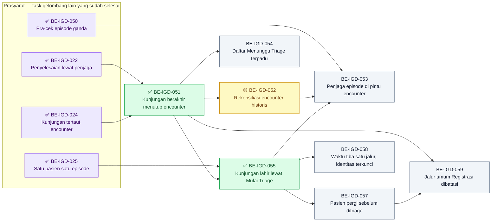

Jumlah panah: **13**, sama dengan isi kolom `Dependency` kedelapan kartu (2 + 1 + 1 + 2 + 3 + 1 + 1 + 2).

### R3.13.3 Grafik urutan — `EPIC IGD-12` (ditahan `S7`)

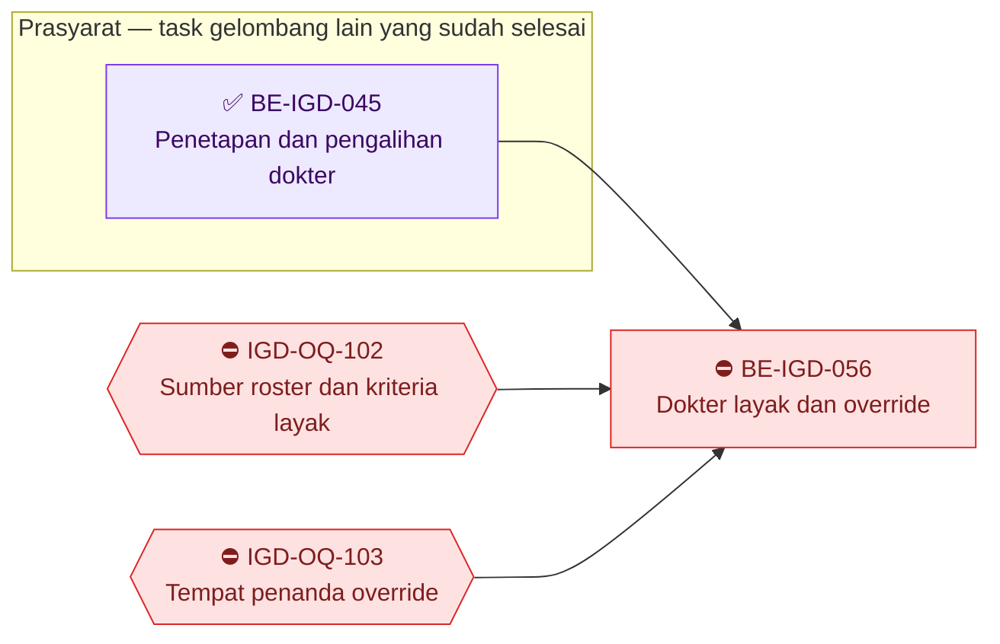

Jumlah panah: **3**, sama dengan kolom `Dependency` `BE-IGD-056`. Total R3.13: **16 panah** pada kedua grafik.

### R3.13.4 Gelombang eksekusi

| Gelombang | Boleh mulai setelah | Task |
| ---: | --- | --- |
| 1 | `BE-IGD-022` ✅, `BE-IGD-024` ✅ — **boleh mulai begitu pemilik memberi go-ahead** | `BE-IGD-051` |
| 2 | `BE-IGD-051` (dan `BE-IGD-025` ✅ untuk `055`) | `BE-IGD-052`, `BE-IGD-054`, `BE-IGD-055` — boleh paralel, **kecuali migration** (lihat di bawah) |
| 3 | `BE-IGD-055`; untuk `053` juga `BE-IGD-052` dan `BE-IGD-050` ✅ | `BE-IGD-053`, `BE-IGD-057`, `BE-IGD-058` — boleh paralel |
| 4 | `BE-IGD-051` dan `BE-IGD-057` | `BE-IGD-059` |
| — | ⛔ menunggu `IGD-OQ-102` dan `IGD-OQ-103` (pemilik: Product/Domain Owner IGD + pemilik jadwal dokter/HR, belum dipetakan) | `BE-IGD-056` |

**Migration tidak paralel.** Tiga task membawa migration yang **dibuat Rizki sendiri** — agent berhenti sebelum
`dotnet ef migrations add`:

| Task | Migration (`02-backend-architecture.md` §13.8) | Isi |
| --- | --- | --- |
| `BE-IGD-055` | `AddEmergencyArrivalTimeSource` | 3 kolom pada `EmgVisit` + FK |
| `BE-IGD-052` | `AddEmergencyEncounterReconciliation` | 2 tabel rekonsiliasi |
| `BE-IGD-053` | `AddEmergencyDuplicateEpisodeOverride` | 1 tabel catatan override |

Ketiganya tidak saling merujuk (nol FK antar-tabel baru), jadi nomor urut pada §13.8 **bukan** urutan wajib. Yang
wajib: dibuat **satu per satu di branch yang sama**, supaya snapshot EF tidak bentrok — pelajaran snapshot yang
kehilangan blok modul lain. Contoh: bila `BE-IGD-055` selesai lebih dulu, migration-nya dibuat dan diterapkan,
baru migration `BE-IGD-052` dibuat di atasnya.

### R3.13.5 Urutan rilis per lingkungan

Dependency di atas mengatur **kapan task boleh dikerjakan**. Urutan rilis mengatur **kapan task boleh dinyalakan**
di satu lingkungan (dev, staging, produksi). Keduanya berbeda, dan yang kedua tidak boleh dibalik:

| Langkah | Yang dirilis | Syarat di lingkungan itu | Bila dibalik |
| ---: | --- | --- | --- |
| 1 | `BE-IGD-051` | — | K1 baru terus bertambah |
| 2 | `BE-IGD-052`, lalu **jalankan** pratinjau dan eksekusi K1 | Angka pratinjau dicatat; sesudah eksekusi, K1 = 0 | — |
| 3 | `BE-IGD-053` **bersama** `FE-IGD-038` | Langkah 2 selesai di lingkungan yang sama | Tanpa langkah 2: pasien yang kunjungan lamanya sudah selesai ikut ditolak. Tanpa `FE-IGD-038`: pendaftaran ganda sah tidak dapat disimpan dari loket |
| 4 | `BE-IGD-057`, lalu `BE-IGD-059` | `BE-IGD-051` sudah aktif | Encounter Emergency kehilangan jalan keluar |
| 5 | `FE-IGD-036` | `BE-IGD-053`, `BE-IGD-055`, `BE-IGD-059`, `FE-IGD-035`, `FE-IGD-038` sudah aktif | Membuka pintu pendaftaran ganda |

**K3 tidak pernah ditutup otomatis** (`IGD-DEC-148`). Daftar K3 dari pratinjau `BE-IGD-052` menjadi daftar kerja
petugas pendaftaran: encounter yang memang duplikat dibatalkan lewat `PATCH /patient-encounters/{id}/cancel`
(masih boleh karena belum punya kunjungan, `IGD-DEC-153`). Selama belum dibatalkan, baris K3 tampil *Menunggu
Triage* di `triage-queue`, dan pasiennya tertolak di pintu encounter kecuali petugas mengisi alasan override.

### R3.13.6 Batas eksekusi untuk seluruh task R3.13

Agent menyusun source lalu **berhenti**; `dotnet build -p:RunAnalyzers=false` dijalankan Rizki. **Nol migration yang
dijalankan agent**. **Nol tulis basis data** — kueri acceptance dijalankan pemilik. Tanpa commit, push, merge, atau
pindah branch. **Nol baris `Program.cs`**: aturan episode dan rekonsiliasi berupa static class
(`02-backend-architecture.md` §13.10). QBE preflight dan kesesuaian engineering diselesaikan pada waktu eksekusi dari
`AGENTS.md` backend dan dokumen engineering canonical. Perubahan pada berkas Registrasi (`PatientEncounterController.cs`,
`PatientEncounterDtos.cs`) berjalan di bawah `IGD-DEC-135` — izin remediasi teknis, **bukan** pemindahan kepemilikan;
butir 8 DoD PRD §8.6 (persetujuan tertulis pemilik Registrasi) tetap **belum dapat dijawab "ya"**.
Proyek test backend sudah dihapus (`IGD-CAP-43`), jadi skenario `AT-IGD-*` dibuktikan lewat **uji API dan kueri
baca-saja oleh pemilik**. Status UAT dipisah; agent tidak pernah menulis `UAT PASS`.

**Sisi frontend.** Pasangan layar ada di `frontend-roadmap.md` bagian R3.12: `FE-IGD-035` menunggu `BE-IGD-054`;
`FE-IGD-038` menunggu `BE-IGD-053`; `FE-IGD-039` menunggu `BE-IGD-057`; `FE-IGD-040` menunggu `BE-IGD-058`;
`FE-IGD-036` menunggu `BE-IGD-053`, `055`, `059`; `FE-IGD-037` menunggu `BE-IGD-056`.

### ✅ `BE-IGD-051` — Kunjungan IGD yang berakhir ikut menutup encounter-nya

| Field | Isi |
| --- | --- |
| **Status** | ✅ **SELESAI atas penilaian pemilik — 22 September 2026.** Build terverifikasi dari artefak (DLL 15.23 WIB, sesudah edit source; jumlah warning tidak dilaporkan); **uji API S1–S9 dinyatakan lulus semua oleh pemilik** (dengan bantuan agent GPT, tanpa lampiran). **Kriteria 8 dikecualikan atas keputusan pemilik 22 September 2026** — kueri invarian baru dapat dijalankan sesudah rilis; dijalankan dan dicatat pada laporan yang sama sesudah rilis. Bukti: [laporan](../task/report/backend/BE-IGD-051.md). *Riwayat:* 🟡 **SEBAGIAN — 22 September 2026.** Implementation Complete: `EmergencyEpisodeRule.cs` (baru), `EmergencyVisitService.ApplyEncounterClosureAsync`, dua titik panggil di `EmergencyVisitController`. Kesepuluh kriteria terpetakan ke source; kriteria 3, 7, 9 terbukti (pembacaan source, `git diff --stat`). **Belum:** `dotnet build` (kriteria 10, milik pemilik — `NOT RUN`), uji API S1–S9 (kriteria 1, 2, 4, 5, 6), kueri invarian sesudah rilis (kriteria 8). Nol migration, nol tulis basis data, nol `Program.cs`. Lima selisih terhadap kartu dicatat pada laporan bagian 3.2. Bukti: [laporan](../task/report/backend/BE-IGD-051.md) *Sebelumnya: tanpa tanda — siap (go-ahead pemilik diberikan 22 September 2026).* |
| **Outcome** | Setiap kunjungan IGD yang selesai atau dibatalkan tidak lagi meninggalkan encounter "masih terbuka" — encounter-nya berakhir pada detik dan penyimpanan yang sama |
| **Slice** | `S5` · `EPIC IGD-11` · `MVP-7` |
| **Requirement** | `FR-IGD-080`, `FR-IGD-081` |
| **Keputusan** | `IGD-DEC-139` butir 5 + koreksi lima tanda; `IGD-DEC-148` (TK-1 tidak, TK-2 ya); `RM-DEC-003`; `IGD-DEC-135` |
| **Kontrak** | API `0.11.0` §8.3.7 (efek samping `complete` dan `visit-status` → `Cancelled`; `DELETE` tidak menutup); validation `0.8.0` §10.1 aturan 1, §10.5; state `0.5.0` §8.2; integration `0.4.0` §5.2 (daftar kolom tertutup); permission/audit `0.5.0` §7.2 baris terakhir |
| **Reuse** | `EmergencyVisitService.TryApplyVisitStatus` (penjaga transisi); `ClinicalDocumentIntegrityService.LockOpenDocumentsForEncounterAsync` — tidak menyimpan sendiri, sudah terdaftar di DI (`Program.cs:392`); ruas yang diisi `PATCH /patient-encounters/{id}/cancel` sebagai acuan — **tanpa** memanggil controller Registrasi |
| **Dependency** | `BE-IGD-022` ✅, `BE-IGD-024` ✅ |
| **Owner** | Backend IGD |
| **Risiko** | **Menengah-tinggi.** (1) Menulis ke tabel milik Registrasi — dibatasi daftar kolom tertutup integration §5.2. (2) Billing menagih `Completed` dan tidak menagih `Cancelled` (`IGD-EV-142` butir 7): kunjungan yang dibatalkan padahal pasien sempat dilayani hilang dari daftar tagihan. Billing IGD belum direncanakan — risiko dinyatakan, tidak diselesaikan |

#### Aturan

| # | Aturan | Contoh |
| ---: | --- | --- |
| 1 | `EmergencyEpisodeRule.IsEncounterEnded` adalah **satu-satunya** rumus "encounter berakhir": salah satu dari `EncounterStatus` ∈ {`Completed`, `Cancelled`, `NoShow`}, `IsCancel = true`, `CancelledAt`/`CompletedAt`/`NoShowAt` terisi. Rumus disediakan dalam dua bentuk dari sumber yang sama: pemeriksaan objek dan *expression* yang dapat diterjemahkan ke SQL (dipakai `BE-IGD-052` dan `054`) | Encounter `REG-…-7` berstatus `Registered` dengan `CompletedAt` terisi → **berakhir** (tanda keempat), walau statusnya belum 9 |
| 2 | `complete` → encounter `Completed`, `CompletedAt` = waktu server bila kosong, catatan klinis belum ditandatangani dikunci | Kunjungan `IGD-0007` diselesaikan 13.10 → encounter `Completed` 13.10, SOAP yang lupa ditandatangani terkunci |
| 3 | `visit-status` → `Cancelled` → encounter `Cancelled`, `IsCancel = true`, `IsActive = false`, `CancelledAt`, `CancelledByUserId` (token), `CancelReason` = catatan permintaan atau *"Kunjungan IGD dibatalkan"* | — |
| 4 | Encounter yang sudah berakhir **tidak ditimpa** — waktu, pelaku, dan alasan lama tetap | Encounter yang sudah dibatalkan manual pukul 10.00 tetap bertanda 10.00 |
| 5 | Encounter `Outpatient` yang tertaut kunjungan IGD **ikut** ditutup (TK-2) | Kunjungan masa transisi ber-encounter `Outpatient` diselesaikan → encounter itu `Completed` |
| 6 | `DELETE` kunjungan (hapus lunak) **tidak** menutup encounter (TK-1); encounter-nya menjadi K4 | — |
| 7 | Perubahan encounter dan penguncian catatan ikut `SaveChangesAsync` aksi kunjungan yang sudah ada; gagal = keduanya batal | — |

#### Endpoint yang berubah perilakunya

#### Health Services / Emergency Installation Management / Emergency Visit

Base URL: `api/v1/health-services/emergency-installation-management/emergency-visits`

| Method | Path | Kegunaan | Hak akses | Request | Response |
| --- | --- | --- | --- | --- | --- |
| `PATCH` | `/{id}/complete` | Menyelesaikan kunjungan — **kini** encounter ikut `Completed` | `EmergencyVisit : Update` (tidak berubah) | Tidak berubah | Tidak berubah |
| `PATCH` | `/{id}/visit-status` | Mengubah status kunjungan — target `Cancelled` **kini** ikut membatalkan encounter | `EmergencyVisit : Update` (tidak berubah) | Tidak berubah | Tidak berubah |
| `DELETE` | `/{id}` | Hapus lunak — **ditegaskan tidak** menutup encounter | `EmergencyVisit : Delete` (tidak berubah) | — | Tidak berubah |

Kode status tidak bertambah. Kegagalan penguncian catatan menggagalkan seluruh penyimpanan (integration §5.4).

#### File yang akan disentuh

| Berkas | Perubahan |
| --- | --- |
| `Areas/HealthServices/EmergencyInstallationManagement/Services/EmergencyEpisodeRule.cs` | **Baru** (static) — `IsEncounterEnded` dalam dua bentuk (objek + expression) |
| `Areas/HealthServices/EmergencyInstallationManagement/Services/EmergencyVisitService.cs` | `ApplyEncounterClosure` — tidak membuka transaksi, tidak menyimpan |
| `Areas/HealthServices/EmergencyInstallationManagement/Controllers/EmergencyVisitController.cs` | Titik panggil `complete` (:513) dan `visit-status` (:460); constructor menerima `ClinicalDocumentIntegrityService` |
| Roadmap, traceability, `MODULE-STATUS.md`, laporan `BE-IGD-051.md` | Penandaan status |

**Tidak disentuh:** seluruh berkas Registrasi, `Program.cs`, model, konfigurasi EF, `Migrations/`, snapshot, berkas
kontrak, seluruh frontend.

#### Acceptance

| # | Kriteria | Bukti yang diminta | `AT-IGD-*` |
| ---: | --- | --- | --- |
| 1 | `complete` → encounter `Completed` dan `CompletedAt` terisi pada **satu** `SaveChangesAsync` | Baca source + uji API | `178` |
| 2 | `visit-status` → `Cancelled` → keenam ruas pembatalan encounter terisi | Uji API | — |
| 3 | Atomik: penyimpanan gagal → kunjungan dan encounter sama-sama tidak berubah | Baca source; skenario gagal bila dapat dipicu | — |
| 4 | Encounter yang sudah berakhir tidak ditimpa | Uji API pada encounter yang sudah dibatalkan manual | — |
| 5 | Hapus lunak tidak menutup encounter; encounter `Outpatient` tertaut ikut ditutup | Uji API | `179` |
| 6 | Catatan klinis belum ditandatangani terkunci saat `complete`, sama dengan jalur Registrasi | Uji API + baca source | `178` |
| 7 | Rumus "berakhir" satu tempat (`EmergencyEpisodeRule`), dua bentuk dari sumber yang sama; nol salinan di berkas lain | Baca source | — |
| 8 | **Invarian:** kueri di bawah mengembalikan **0 baris** sesudah rilis | Kueri baca-saja pemilik; angka dicatat | PRD §8.6 butir 6 |
| 9 | Nol perubahan rawat jalan, rawat inap, berkas Registrasi, `Program.cs`, schema, migration, dan berkas kontrak | `git diff --stat` | — |
| 10 | Build 0 error, warning sama dengan baseline | Keluaran build **milik Rizki** | — |

```sql
-- Invarian BE-IGD-051 (baca-saja, dijalankan pemilik). Harus 0 baris.
SELECT v."EmergencyVisitNumber", v."VisitStatus", e."EncounterStatus", e."CompletedAt", e."IsCancel"
FROM public."EmgVisit" v
JOIN public."RegPatientEncounter" e ON e."Id" = v."EncounterId"
WHERE NOT v."IsDelete"
  AND v."VisitStatus" IN (8, 9)                    -- Cancelled, Completed
  AND v."UpdateDateTime" >= :waktu_rilis_be_igd_051
  AND NOT e."IsCancel" AND e."CancelledAt" IS NULL AND e."CompletedAt" IS NULL AND e."NoShowAt" IS NULL
  AND e."EncounterStatus" NOT IN (9, 10, 11);
```

**DoD.** Acceptance 1–10; laporan tracked; roadmap, traceability, `MODULE-STATUS.md` diperbarui.

### 🟡 `BE-IGD-052` — Rekonsiliasi encounter `Emergency` historis (*Historical Emergency Encounter Reconciliation*)

| Field | Isi |
| --- | --- |
| **Status** | 🟡 **SEBAGIAN — 23 September 2026.** Implementation Complete: sembilan berkas baru — dua model (`EmgEncounterReconciliationRun`, `…Item`), dua configuration, dua enum, DTO, service static `EmergencyEncounterReconciliation` (pratinjau, eksekusi, pembalikan; satu transaksi per run + kunci advisory `EMG_ENCOUNTER_RECONCILIATION`), controller lima action dengan resource izin baru — ditambah dua `DbSet`. **Terbukti agent:** kriteria 3 (nol update massal; tiap baris dievaluasi ulang di dalam transaksi), 4 sisi source (`CompletedAt` hanya dari `EmgVisit.VisitCompletedAt`; pelaku selalu dari token), 6 (nilai sebelum/sesudah per baris; alasan **tidak** masuk log aplikasi), 8 (nol `Program.cs`, nol kolom baru `RegPatientEncounter`). **Belum:** migration `AddEmergencyEncounterReconciliation` (kriteria 7, milik pemilik, dibuat **di atas** `20260923021224`), `dotnet build` (kriteria 9 — `NOT RUN`), uji API pratinjau/eksekusi/pembalikan (kriteria 1, 2, 5), dan **angka kueri D** yang dibutuhkan kriteria 1. Sepuluh selisih terhadap kartu dicatat pada laporan bagian 3.2. Bukti: [laporan](../task/report/backend/BE-IGD-052.md). *Sebelumnya: tanpa tanda — siap sesudah `BE-IGD-051`; bentuk diputuskan `IGD-DEC-148`, kelas K1–K4 disahkan, angka kueri D belum ada (evidence `2026-09-22-desain-encounter-first.md` §7.1).* |
| **Outcome** | Admin data melihat berapa encounter `Emergency` lama yang tertinggal terbuka per kelas, lalu menutup **hanya** yang buktinya pasti (K1) — tercatat siapa, kapan, dan baris mana, dan dapat dibalik |
| **Slice** | `S6` · `EPIC IGD-11` · `MVP-7` |
| **Requirement** | `FR-IGD-084` |
| **Keputusan** | `IGD-DEC-148`, `IGD-DEC-162` (tanpa layar); `IGD-DEC-138` (larangan pembersihan tanpa audit); prinsip `IGD-DEC-136` (pelaku tidak dikarang) |
| **Kontrak** | API `0.11.0` §8.4 (grup baru); validation `0.8.0` §10.6; state `0.5.0` §8.4 (`EmergencyReconciliationRunStatus`); integration `0.4.0` §5.2 baris K1; permission/audit `0.5.0` §7.1 (resource `EmergencyEncounterReconciliation` Read/Process/Reverse), §7.2 |
| **Reuse** | `EmergencyEpisodeRule.IsEncounterEnded` (expression) dari `BE-IGD-051`; pola admin preview + execute `YearEndClosing`/`LeaveAccrual` (`IGD-FACT-020`); `DocumentNumberService` untuk `RunNumber`; pola `Down()` berpenjaga `BE-IGD-048` |
| **Dependency** | `BE-IGD-051` |
| **Owner** | Backend IGD; migration **dibuat dan dijalankan Rizki** |
| **Risiko** | **Tinggi** — mengubah data historis tabel milik modul lain. Dijaga oleh `expectedCount`, evaluasi per baris, dan run yang dapat dibalik |

#### Kelas (disahkan `IGD-DEC-148`)

| Kelas | Isi | Ditulis? |
| --- | --- | :-: |
| K1 | Encounter `Emergency` belum berakhir, kunjungannya `Completed`/`Cancelled` | **Ya** — status mengikuti kunjungan |
| K1-Outpatient | Sama dengan K1, tetapi encounter bertipe `Outpatient` (masa transisi, TK-2) | **Ya** |
| K2 | Encounter dengan kunjungan yang masih berjalan | Tidak — normal |
| K3 | Encounter `Emergency` tanpa kunjungan | Tidak — dilaporkan; ditindaklanjuti petugas pendaftaran (R3.13.5) |
| K4 | Encounter yang satu-satunya kunjungannya dihapus lunak | Tidak — dilaporkan |

*Contoh.* Pratinjau di dev menampilkan K1 = 42, K1-Outpatient = 3, K2 = 5, K3 = 7, K4 = 1. Admin mengisi alasan
*"Penutupan encounter IGD sebelum BE-IGD-051"* dan `expectedCount = 45`. Bila di antara pratinjau dan eksekusi satu
kunjungan lain selesai (K1 menjadi 43), eksekusi ditolak `409` *"Data berubah sejak pratinjau; muat ulang
pratinjau."* Sesudah dimuat ulang dengan `expectedCount = 46`, run tercatat dengan 46 baris.

#### Endpoint baru

#### Emergency Encounter Reconciliation

Base URL: `api/v1/health-services/emergency-installation-management/emergency-encounter-reconciliations` ·
**Rencana (belum tersedia)**

| Method | Path | Kegunaan | Hak akses | Request | Response |
| --- | --- | --- | --- | --- | --- |
| `GET` | `/preview` | Jumlah tiap kelas + daftar K1/K1-Outpatient berhalaman; **tidak menulis** | `EmergencyEncounterReconciliation : Read` | Query halaman | `…PreviewResponse` |
| `POST` | `/runs` | Menutup K1 dan K1-Outpatient yang lolos syarat | `EmergencyEncounterReconciliation : Process` | `ExecuteEmergencyEncounterReconciliationRequest` (`reason`, `expectedCount`) | `…RunResponse` |
| `GET` | `/runs` | Riwayat run | `EmergencyEncounterReconciliation : Read` | Query halaman | `PagedResult<…RunResponse>` |
| `GET` | `/runs/{id}` | Satu run beserta barisnya | `EmergencyEncounterReconciliation : Read` | — | `…RunResponse` + `…ItemResponse[]` |
| `POST` | `/runs/{id}/reverse` | Membalik satu run | `EmergencyEncounterReconciliation : Reverse` | `ReverseEmergencyEncounterReconciliationRequest` (`reason`) | `…RunResponse` |

Kode status: `201` run tercatat; `400` alasan kosong/terlalu panjang; `401` belum login; `403` tidak memegang hak
admin rekonsiliasi; `404` run tidak ada; `409` data berubah sejak pratinjau, atau run sudah dibalik. **Tanpa layar**
(`IGD-DEC-162`): dijalankan lewat Swagger di Development, atau HTTP client bertoken di lingkungan lain.

#### File yang akan disentuh

| Berkas | Perubahan |
| --- | --- |
| `…/Controllers/EmergencyEncounterReconciliationController.cs` | **Baru** — lima action; `[AccessController]` resource `EmergencyEncounterReconciliation`; pasangan `[AccessAction]` + `[AccessPermission]` per method (permission §7.1) |
| `…/Services/EmergencyEncounterReconciliation.cs` | **Baru** (static) — pratinjau, eksekusi, pembalikan; satu transaksi per run |
| `…/DTOs/EmergencyEncounterReconciliationDtos.cs` | **Baru** |
| `…/Enums/EmergencyReconciliationClass.cs`, `EmergencyReconciliationRunStatus.cs` | **Baru** |
| `…/Models/EmgEncounterReconciliationRun.cs`, `EmgEncounterReconciliationItem.cs` | **Baru** |
| `Repositories/Configurations/…/EmgEncounterReconciliationRunConfiguration.cs`, `…ItemConfiguration.cs` | **Baru** (02 §13.6) |
| `Repositories/ApplicationDbContext.cs` | + 2 `DbSet` |
| `Migrations/` | `AddEmergencyEncounterReconciliation` — **dibuat Rizki**; `Down()` berpenjaga menolak bila ada run |

**Tidak disentuh:** berkas Registrasi, `Program.cs`, berkas kontrak, frontend.

#### Acceptance

| # | Kriteria | Bukti yang diminta | `AT-IGD-*` |
| ---: | --- | --- | --- |
| 1 | Pratinjau menghasilkan jumlah per kelas yang **sama** dengan kueri D; **nol** baris berubah | Angka keduanya dicatat — **menunggu angka kueri D dari pemilik** | `182` |
| 2 | Eksekusi dengan `expectedCount` basi → `409`; eksekusi benar → hanya K1/K1-Outpatient berubah, jumlahnya = `expectedCount` | Hitungan sebelum/sesudah | `183` |
| 3 | Nol pernyataan update massal; setiap baris dievaluasi ulang di dalam transaksi run | Baca source | — |
| 4 | `CompletedAt` hanya dari `EmgVisit.VisitCompletedAt`; bila kosong tetap kosong; nol pelaku dikarang | Baca source + contoh baris | `183` |
| 5 | Pembalikan mengembalikan nilai sebelum; baris yang sudah berubah sesudah run dilewati dan dilaporkan; run yang sudah dibalik → `409` | Uji API | `183` |
| 6 | Nilai sebelum/sesudah tercatat per baris; alasan tidak masuk custom logger (permission §7.2) | Baca source + isi tabel | — |
| 7 | `Down()` berpenjaga diuji di basis data terpisah (pola `BE-IGD-048`); snapshot hanya bertambah blok dua tabel ini | Catatan uji + `git diff` snapshot | PRD §8.6 butir 3–4 |
| 8 | Nol baris `Program.cs`; nol kolom baru `RegPatientEncounter` | `git diff --stat` | PRD §8.6 butir 5 |
| 9 | Build 0 error, warning sama dengan baseline | Keluaran build **milik Rizki** | — |

**DoD.** Acceptance 1–9; laporan tracked; daftar K3/K4 diserahkan pada laporan sebagai daftar kerja, tanpa ditulis.

### `BE-IGD-053` — Penjaga episode terbuka pada pintu encounter `Emergency` (realisasi `IGD-OQ-093`)

| Field | Isi |
| --- | --- |
| **Status** | Tanpa tanda — **menunggu `BE-IGD-052` dan `BE-IGD-055`**. Keputusan yang dulu menahannya (`IGD-OQ-096`, `IGD-OQ-101`) sudah dijawab `IGD-DEC-142`, `145`, `146`. **Dirilis** di satu lingkungan hanya sesudah rekonsiliasi K1 dijalankan di sana (R3.13.5), dan **bersama** `FE-IGD-038` |
| **Outcome** | Pendaftaran IGD kedua untuk pasien yang episodenya masih terbuka ditolak server **sebelum** encounter dibuat — dari layar mana pun, juga bila dua petugas menekan simpan pada detik yang sama; pendaftaran ganda yang sah tetap bisa, dengan alasan tercatat; encounter IGD tidak lagi membuat antrean |
| **Slice** | `S1` · `EPIC IGD-11` · `MVP-7` |
| **Requirement** | `FR-IGD-069` (sisi backend: pintu encounter tanpa kunjungan), `FR-IGD-071`, `FR-IGD-072`, `FR-IGD-073`, `FR-IGD-074` |
| **Keputusan** | `IGD-DEC-139` (rumus A+B), `IGD-DEC-144`, `IGD-DEC-145`, `IGD-DEC-146`, `IGD-DEC-084`, `IGD-DEC-138`, `IGD-DEC-135`. **Realisasi `IGD-OQ-093`** — status OQ tetap `superseded` sebagian sampai task ini ✅ |
| **Kontrak** | API `0.11.0` §8.1 nomor 1, 2, 7, 8, 9; §8.2 (baris `POST`); §8.3.6 (`active-episode` + ruas `encounter`); validation `0.8.0` §10.1 aturan 2–7; integration `0.4.0` §5.2 baris pertama, §5.3 dua baris pertama, §5.4; permission/audit `0.5.0` §7.1 baris `PatientEncounter`, §7.2 baris override |
| **Reuse** | `EmergencyEpisodeRule` (`IsEncounterEnded` dari `BE-IGD-051`; `FindOpenEpisodeAsync` dan `LockPatientEpisodeAsync` dari `BE-IGD-055`); transaksi `CreateEncounterCoreAsync` yang sudah ada (`PatientEncounterController.cs:559`); pola `EmergencyVisitService.PeriksaJenisEncounter` (static tanpa DI); pesan `IGD-DEC-084` |
| **Dependency** | `BE-IGD-050` ✅, `BE-IGD-052`, `BE-IGD-055` |
| **Owner** | Backend IGD; berkas Registrasi di bawah `IGD-DEC-135`; migration **dibuat Rizki** |
| **Risiko** | **Tinggi** — ini pintu masuk pasien. Penjaga yang salah menolak pasien gawat. Karena itu urutan rilis R3.13.5 langkah 2–3 **tidak boleh** dilewati |

#### Aturan

| # | Aturan | Contoh |
| ---: | --- | --- |
| 1 | Hanya `encounterType = Emergency`. Rawat jalan dan rawat inap **tidak** diperiksa, tidak dikunci | Pendaftaran poliklinik berjalan persis seperti hari ini |
| 2 | Urutan di dalam transaksi yang sudah ada: kunci `EMG_EPISODE_{patientId}` → rumus episode terbuka → tolak `409` **atau** tulis catatan override → **baru** kunci penomoran `REG_PATIENT_ENCOUNTER_NUMBER` dan sisip encounter | Tidak ada jalur yang mengambil kunci penomoran lebih dulu (integration §5.3 — mencegah *deadlock*, yaitu dua proses saling menunggu selamanya) |
| 3 | Episode terbuka = klausa A (encounter Emergency lain belum berakhir) **atau** klausa B (kunjungan belum `Completed`/`Cancelled`) — `EmergencyEpisodeRule.FindOpenEpisodeAsync`, satu method untuk keempat pemakai | Pasien dengan encounter K3 lama tanpa kunjungan → klausa A → ditolak kecuali beralasan |
| 4 | Alasan kosong → `409` dengan pesan validation §10.1 aturan 3; alasan terisi (≤ 500) → encounter dibuat **dan** `EmgDuplicateEpisodeOverride` ditulis pada transaksi yang sama | Petugas mengisi *"Pasien kembali 2 jam kemudian, kunjungan pagi belum ditutup dokter"* → encounter kedua lahir, catatan override menunjuk kunjungan pagi |
| 5 | Encounter Emergency **tidak pernah** membuat `TrxQueue`, apa pun `IsQueueRequired` (`PatientEncounterController.cs:544`, `:608`, `:749`) | Unit IGD diset `IsQueueRequired = true` → nol baris antrean |
| 6 | `POST /emergency-visits` (jalur lama) dibungkus **transaksi eksplisit**, mengambil kunci yang sama, memakai rumus A+B dengan pengecualian encounter miliknya sendiri. Alasan tingkat kunjungan (`EmgVisit.DuplicateEpisodeOverride*`) tetap berlaku di jalur ini (`IGD-DEC-145`) | Loket sebelum `FE-IGD-036`: encounter dibuat lalu kunjungan dibuat untuk encounter yang sama → tidak tertolak oleh encounter-nya sendiri |
| 7 | `CariEpisodeAktifAsync` **mendelegasikan** ke `FindOpenEpisodeAsync`; `GET /active-episode` kini benar untuk klausa A atau B dan mengisi ruas `encounter` | Pra-cek pasien yang sedang *Menunggu Triage* → `hasActiveEpisode = true`, `encounter = { encounterNumber: "REG-260922-0012", registeredAt: … }`, `visit = null` |
| 8 | **Dilarang** heuristik waktu dalam bentuk apa pun | — |

*Contoh serentak.* Dua petugas loket mendaftarkan RAYYAN pukul 09.40:00 dan 09.40:00,3. Permintaan kedua menunggu
kunci per pasien sampai yang pertama selesai, lalu membaca encounter yang baru dibuat dan ditolak `409`. Tepat satu
encounter terbuka di basis data.

#### Endpoint yang berubah perilakunya

#### Health Services / Registration Management / Patient Encounter

Base URL: `api/v1/health-services/registration-management/patient-encounters` — **milik Registration Management**

| Method | Path | Kegunaan | Hak akses | Request | Response |
| --- | --- | --- | --- | --- | --- |
| `POST` | `/`, `/admin`, `/kiosk` | Membuat encounter — **khusus Emergency:** kunci, rumus episode, override, tanpa antrean | `PatientEncounter : Create` (tidak berubah) | `PatientEncounterCreateRequest` + `duplicateEpisodeOverrideReason` (`string?`, aditif) | Tidak berubah |

Kode status baru: `409` — pasien masih punya episode IGD terbuka dan alasan pendaftaran ganda kosong. Pesannya
menyebut nomor kunjungan (bila sudah lahir) atau nomor encounter dan *"Menunggu Triage"*.

#### Health Services / Emergency Installation Management / Emergency Visit

Base URL: `api/v1/health-services/emergency-installation-management/emergency-visits`

| Method | Path | Kegunaan | Hak akses | Request | Response |
| --- | --- | --- | --- | --- | --- |
| `GET` | `/active-episode?patientId=` | Pra-cek — kini klausa A atau B | `EmergencyVisit : Create` (tidak berubah; keterbatasan `IGD-DEC-158`) | Query `patientId` | `EmergencyActiveEpisodeResponse` + ruas `encounter` (aditif) |
| `POST` | `/` | Jalur lama — kini transaksi + kunci + rumus A+B | `EmergencyVisit : Create` (tidak berubah) | Tidak berubah | Tidak berubah; `409` kini juga untuk klausa A |

#### File yang akan disentuh

| Berkas | Perubahan |
| --- | --- |
| `Areas/HealthServices/RegistrationManagement/Controllers/PatientEncounterController.cs` | **Berkas Registrasi.** Cabang Emergency di `CreateEncounterCoreAsync` sebelum alokasi nomor (`:567`) |
| `Areas/HealthServices/RegistrationManagement/DTOS/PatientEncounterDtos.cs` | **Berkas Registrasi.** `DuplicateEpisodeOverrideReason` (`string?` — supaya tidak terkena `[Required]` implisit) |
| `…/Services/EmergencyEpisodeRule.cs` | Dipakai; tidak ada rumus baru |
| `…/Services/EmergencyVisitService.cs` | `CariEpisodeAktifAsync` mendelegasikan |
| `…/Controllers/EmergencyVisitController.cs` | `Create` (:240) dibungkus transaksi + kunci; `ActiveEpisode` (:196) + ruas `encounter` |
| `…/DTOs/EmergencyVisitDtos.cs` | `EmergencyActiveEncounterSummary`; `EmergencyActiveEpisodeResponse` + `Encounter` |
| `…/Models/EmgDuplicateEpisodeOverride.cs`, konfigurasinya, `ApplicationDbContext` (+1 `DbSet`) | **Baru** (02 §13.6) |
| `Migrations/` | `AddEmergencyDuplicateEpisodeOverride` — **dibuat Rizki**; `Down()` berpenjaga menolak bila tabel berisi |

**Tidak disentuh:** `EncounterIntakeService`, `InpEpisodeService`, `Program.cs`, berkas kontrak, frontend.

#### Acceptance

| # | Kriteria | Bukti yang diminta | `AT-IGD-*` |
| ---: | --- | --- | --- |
| 1 | Pasien beridentitas didaftarkan → satu encounter Emergency, nol baris antrean | Uji API + hitungan | `166` (sisi backend), `171` |
| 2 | Pasien *Menunggu Triage* didaftarkan lagi tanpa alasan → `409`, pesan menyebut nomor encounter dan "Menunggu Triage"; jumlah encounter tetap | Uji API + hitungan | `168` |
| 3 | Klausa B (kunjungan lama berjalan) → `409` dengan nomor kunjungan | Uji API | — |
| 4 | Dua pendaftaran paralel → satu `200`, satu `409`, tepat satu episode terbuka | Uji paralel seperti S12 `BE-IGD-045`; hitungan | `169` |
| 5 | Pendaftaran kedua beralasan → encounter lahir, catatan override berisi alasan, pelaku token, waktu server, episode yang dilangkahi; tabel encounter tanpa kolom baru | Uji API + isi tabel | `170` |
| 6 | Klien memanggil `POST /patient-encounters` **tanpa** pra-cek → tetap `409` | Uji API | `185` |
| 7 | Pasien yang episodenya sudah berakhir (termasuk K1 yang sudah direkonsiliasi) → encounter dibuat | Uji API | — |
| 8 | Rawat jalan/rawat inap dan `EncounterIntakeService`/`InpEpisodeService` tidak berubah | Uji API + `git diff` | — |
| 9 | Jalur lama `POST /emergency-visits` dalam transaksi eksplisit dengan kunci yang sama; loket sebelum `FE-IGD-036` tetap dapat mendaftar | Baca source + uji layar pemilik | — |
| 10 | `active-episode` mengenali klausa A (ruas `encounter`); ruas lama tidak berubah | Uji API | — |
| 11 | Satu rumus episode (`FindOpenEpisodeAsync`) untuk keempat pemakai; nol heuristik waktu | Baca source | — |
| 12 | `Down()` berpenjaga diuji di basis data terpisah; snapshot hanya bertambah blok tabel override | Catatan uji + `git diff` snapshot | PRD §8.6 butir 3–4 |
| 13 | Laporan menyatakan celah `IGD-OQ-093` (serentak + klien tanpa pra-cek) **hilang**, dengan bukti acceptance 4 dan 6 | Laporan task | — |
| 14 | Build 0 error, warning sama dengan baseline | Keluaran build **milik Rizki** | — |

**Data yang belum ada:** `IGD-UNK-06` (jumlah `TrxQueue` lama yang tertaut encounter Emergency). Task ini **tidak**
membersihkan antrean lama — hanya berhenti membuat yang baru; angkanya dicatat pada laporan bila pemilik
menjalankan kuerinya.

**DoD.** Acceptance 1–14; laporan tracked; `IGD-OQ-093` dicatat realisasinya pada decision log oleh pass
penyelarasan; `FE-IGD-038` dirilis pada waktu yang sama.

### `BE-IGD-054` — Daftar Menunggu Triage terpadu (`GET triage-queue`)

| Field | Isi |
| --- | --- |
| **Status** | Tanpa tanda — **siap sesudah `BE-IGD-051`** |
| **Outcome** | Perawat triage melihat **satu** daftar berisi semua pasien yang perlu ditriage — yang baru didaftarkan (belum punya kunjungan) maupun kunjungan yang sudah lahir — tanpa layar menggabungkan dua sumber sendiri |
| **Slice** | `S2` · `EPIC IGD-11` · `MVP-7` |
| **Requirement** | `FR-IGD-070` |
| **Keputusan** | `IGD-DEC-139` butir 2, `IGD-DEC-144` (daftar = tampilan turunan milik IGD, bukan antrean), `IGD-DEC-143` (aksi `ImmediateCare` pada baris tanpa kunjungan), `IGD-DEC-142` (aksi `NoShow`), `IGD-DEC-151` (rekam pengganti tampil apa adanya) |
| **Kontrak** | API `0.11.0` §8.3.1; permission/audit `0.5.0` §7.1 baris `Read` |
| **Reuse** | `EmergencyEpisodeRule.IsEncounterEnded` (expression) dari `BE-IGD-051`; proyeksi daftar kunjungan yang ada (`EmergencyVisitController` :57); `PagedResult<T>` |
| **Dependency** | `BE-IGD-051` |
| **Owner** | Backend IGD |
| **Risiko** | Menengah. Encounter K3 lama **tidak pernah** ditutup otomatis (`IGD-DEC-148`) — mereka tampil *Menunggu Triage* sampai petugas pendaftaran membatalkannya (R3.13.5). Risiko ini **dikoreksi** dari versi pagi, yang menyebut K3 hilang sesudah `BE-IGD-052` |

#### Aturan

| # | Aturan | Contoh |
| ---: | --- | --- |
| 1 | Dua jenis baris: encounter Emergency belum berakhir **tanpa** kunjungan (`queueStatus = WaitingForTriage`, `rowKey = enc:{id}`), dan kunjungan (`rowKey = visit:{id}`) | — |
| 2 | Satu episode satu baris — encounter yang sudah punya kunjungan hanya tampil sebagai baris kunjungan | RAYYAN yang sudah Mulai Triage tampil sekali, sebagai `IGD-0012` |
| 3 | Baris tanpa kunjungan membawa `registeredAt` dan **tanpa** `arrivalDateTime` | *"Terdaftar 09.35"*, tidak pernah *"Tiba 09.35"* |
| 4 | `availableActions`: baris tanpa kunjungan → `StartTriage`, `ImmediateCare`, `NoShow`; baris kunjungan `Arrived`/`WaitingForTriage` → `FillTriage`, `ImmediateCare` (`IGD-DEC-128`) | Asal baris tidak diekspos sebagai ruas yang wajib dibaca layar |
| 5 | Encounter yang sudah berakhir (lima tanda) dan encounter bertipe lain tidak tampil | Encounter `NoShow` hilang dari daftar |
| 6 | Halaman dihitung di basis data atas gabungan kedua jenis baris | Halaman 2 tidak mengulang atau melompati pasien |

#### Endpoint baru

#### Health Services / Emergency Installation Management / Emergency Visit

Base URL: `api/v1/health-services/emergency-installation-management/emergency-visits`

| Method | Path | Kegunaan | Hak akses | Request | Response |
| --- | --- | --- | --- | --- | --- |
| `GET` | `/triage-queue` | Daftar Menunggu Triage terpadu, baca-saja | `EmergencyVisit : Read` — pasangan `[AccessAction]` + `[AccessPermission("EmergencyVisit","Read")]` | `EmergencyTriageQueueQuery` (`page`, `pageSize` 1–100, `search`, `queueStatus`) | `PagedResult<EmergencyTriageQueueRowResponse>` |

Kode status: `200`; `400` parameter halaman tidak sah; `401`; `403` tidak memegang `EmergencyVisit : Read`. Contoh
baris ada pada API §8.3.1.

#### File yang akan disentuh

| Berkas | Perubahan |
| --- | --- |
| `…/Controllers/EmergencyVisitController.cs` | Action `TriageQueue` |
| `…/Services/EmergencyVisitService.cs` | `GetTriageQueueAsync` |
| `…/DTOs/EmergencyVisitDtos.cs` | `EmergencyTriageQueueQuery`, `EmergencyTriageQueueRowResponse` |

**Tidak disentuh:** `GET /emergency-visits` (tetap dipakai layar lain), berkas Registrasi, schema, migration,
`Program.cs`, berkas kontrak, frontend.

#### Acceptance

| # | Kriteria | Bukti yang diminta | `AT-IGD-*` |
| ---: | --- | --- | --- |
| 1 | Encounter Emergency belum berakhir tanpa kunjungan tampil `WaitingForTriage` dengan `registeredAt`, tanpa `arrivalDateTime` | Uji API | `167` |
| 2 | Satu episode tidak pernah tampil dua kali | Uji API pada encounter yang sudah punya kunjungan | `167` |
| 3 | Encounter berakhir dan tipe lain tidak tampil | Uji API | — |
| 4 | `availableActions` sesuai aturan 4 | Uji API | — |
| 5 | Gabungan halaman 1..n = seluruh baris, tanpa ulang, tanpa loncat | Uji API dengan `pageSize` kecil | — |
| 6 | Jumlah kueri tetap berapa pun jumlah baris; nol `N+1` | Log SQL EF | — |
| 7 | `GET /emergency-visits` tidak berubah; nol schema, nol migration | `git diff` + uji API | — |
| 8 | Build 0 error, warning sama dengan baseline | Keluaran build **milik Rizki** | — |

**DoD.** Acceptance 1–8; laporan tracked; `FE-IGD-035` boleh mulai sesudah build terverifikasi.

### ✅ `BE-IGD-055` — Kunjungan IGD lahir lewat Mulai Triage atau Tangani Segera (`POST start-triage`)

| Field | Isi |
| --- | --- |
| **Status** | ✅ **SELESAI atas penilaian pemilik — 23 September 2026.** Implementasi: `POST start-triage` (`StartTriage` → `EmergencyVisitService.StartVisitAsync`, transaksi eksplisit + kunci `EMG_EPISODE_{patientId}` + satu kali ulang saat bentrok unique index), `EmergencyEpisodeRule.FindOpenEpisodeAsync` dan `LockPatientEpisodeAsync`, dua enum baru, tiga kolom `EmgVisit` + FK, tiga ruas waktu tiba pada `EmergencyVisitResponse`. Migration **`20260923021224_AddEmergencyArrivalTimeSource`** dibuat dan diterapkan pemilik; `Up()` diperiksa agent = 3 `AddColumn` + 1 `CreateIndex` + 1 `AddForeignKey`, snapshot **+20 baris, 0 penghapusan**. **Kriteria 9 terbukti agent**: penjaga `Down()` diuji empat tahap pada `postgres:16` terpisah (238 migration) — tanpa data `Down` berhasil; dengan satu baris `ArrivalTimeSource = 2` `Down` **ditolak** `PostgresException P0001` dan kolom tetap utuh; sesudah dinolkan `Down` berhasil lagi. **Uji API S1–S15 dinyatakan lulus semua oleh pemilik** (Development, 23 September 2026; S6 ditegaskan benar-benar serentak; lampiran tangkapan layar S13 `400`/`201`, skenario lain tanpa badan respons, agent tidak mengamati). **Kriteria 10 terpenuhi sebagian**: build berhasil dari artefak (DLL 10.23 memuat literal penjaga `Down()`), tetapi **jumlah warning tidak dilaporkan** sehingga kesamaannya dengan baseline tidak dapat dinyatakan. Dua belas selisih terhadap kartu dicatat pada laporan bagian 3.2. Bukti: [laporan](../task/report/backend/BE-IGD-055.md). *Riwayat:* 🟡 **SEBAGIAN — 22 September 2026**, source lengkap tetapi migration, build, dan uji API belum ada. *Sebelumnya: tanpa tanda — siap sesudah `BE-IGD-051`.* |
| **Outcome** | Perawat triage menekan **Mulai Triage** (dengan waktu tiba) atau **Tangani Segera** (tanpa isian) pada pasien yang baru didaftarkan, dan kunjungan IGD lahir saat itu — sekali saja, walau tombolnya ditekan dua kali atau oleh dua perawat |
| **Slice** | `S3` (dan `S8`) · `EPIC IGD-11` · `MVP-7` |
| **Requirement** | `FR-IGD-075`, `FR-IGD-076`, `FR-IGD-077`; `FR-IGD-085` (ruas pasien tanpa identitas) |
| **Keputusan** | `IGD-DEC-139` butir 3; `IGD-DEC-143`; `IGD-DEC-147`; `IGD-DEC-151`; `IGD-DEC-161` (ruas opsional); `IGD-DEC-158` (izin bersama); `IGD-DEC-146` (kunci) |
| **Kontrak** | API `0.11.0` §8.3.2, §8.3.4 (tiga ruas waktu tiba pada `EmergencyVisitResponse`); validation `0.8.0` §10.2; state `0.5.0` §8.1, §8.3; integration `0.4.0` §5.3 baris `start-triage`; permission/audit `0.5.0` §7.1 baris `Create` |
| **Reuse** | `EmergencyVisitService.GenerateVisitNumberAsync`; `CanTransition`/`TryApplyVisitStatus` (penerusan `WaitingForTriage`/`Arrived` → `InTreatment`); unique index `EmgVisit.EncounterId` sebagai jaring pengaman serentak; `EmergencyEpisodeRule.IsEncounterEnded` |
| **Dependency** | `BE-IGD-025` ✅, `BE-IGD-051` |
| **Owner** | Backend IGD; migration **dibuat Rizki** |
| **Risiko** | Menengah — titik lahir data klinis; kesalahan idempotensi melahirkan dua kunjungan untuk satu encounter |

#### Aturan

| # | Aturan | Contoh |
| ---: | --- | --- |
| 1 | `mode = Triage` → lahir `WaitingForTriage`; waktu tiba **wajib**, tidak di masa depan, sumber `Confirmed` (pelaku token, waktu server) | Perawat mengubah prefill 09.35 menjadi 09.25 → kunjungan `WaitingForTriage`, tiba 09.25 *dikonfirmasi* |
| 2 | `mode = ImmediateCare` → lahir `InTreatment` dengan `TreatmentStartedAt` = waktu server; `arrivalDateTime` dari body **diabaikan**, diisi `RegisteredAt`, sumber `Fallback` | Pasien kejang, perawat menekan Tangani Segera → nol ketikan |
| 3 | Idempoten: kunjungan sudah ada + `Triage` → `200` kunjungan yang sama, status tidak diubah; + `ImmediateCare` pada `WaitingForTriage`/`Arrived` → diteruskan ke `InTreatment`; status lain tidak diubah. Status **tidak pernah mundur** | Ani menekan Mulai Triage, dua detik kemudian Budi menekan Tangani Segera → satu kunjungan `InTreatment` (`IGD-DEC-143`) |
| 4 | Kunci `EMG_EPISODE_{patientId}` diambil di dalam transaksi eksplisit; insert kedua yang bentrok unique index ditangkap dan dijawab sesuai aturan 3 | — |
| 5 | Encounter tidak ada → `404`; bukan Emergency → `400`; sudah berakhir → `409`; K4 → `409` | Pesan validation §10.2 aturan 3–6 |
| 6 | Pasien punya **kunjungan** lain yang belum berakhir pada encounter berbeda → `409` (validation §10.2 aturan 7 — **klausa B saja**). Encounter lain tanpa kunjungan (klausa A) **tidak** menolak, karena encounter kedua hanya dapat lahir lewat override (`IGD-DEC-145`) | Lihat `IGD-OQ-108` untuk kasus encounter kedua hasil override |
| 7 | Ruas opsional `arrivalModeId`, `caseTypeId`, `chiefComplaint` (bawaan: salinan `RegPatientEncounter.ChiefComplaint`), `isUnknownPatient` + `temporaryPatientAlias` (wajib bila tanpa identitas) — `IGD-DEC-161` | — |
| 8 | Unit layanan diambil dari encounter, bukan dari body | — |
| 9 | Membuka detail atau membaca daftar **tidak pernah** melahirkan kunjungan | — |

`IGD-DEC-160`: task ini **tidak** menambahkan penolakan triage selama waktu tiba `Fallback`.

`EmergencyEpisodeRule` bertambah `FindOpenEpisodeAsync` (klausa A+B, mengembalikan jenis episode) dan
`LockPatientEpisodeAsync`. Keduanya **lahir di task ini** dan dipakai ulang `BE-IGD-053`, `057`, `059`.

#### Endpoint baru

#### Health Services / Emergency Installation Management / Emergency Visit

Base URL: `api/v1/health-services/emergency-installation-management/emergency-visits`

| Method | Path | Kegunaan | Hak akses | Request | Response |
| --- | --- | --- | --- | --- | --- |
| `POST` | `/start-triage` | Melahirkan kunjungan dari encounter — Mulai Triage atau Tangani Segera | `EmergencyVisit : Create` — pasangan `[AccessAction]` + `[AccessPermission("EmergencyVisit","Create")]` | `StartEmergencyVisitRequest` (API §8.3.2) | `EmergencyVisitResponse` + `arrivalTimeSource`, `arrivalConfirmedByName`, `arrivalConfirmedAt` |

Kode status: `201` kunjungan lahir; `200` kunjungan sudah ada (idempoten); `400` mode/waktu tiba/alias tidak sah
atau encounter bukan Emergency; `401`; `403`; `404` encounter tidak ada; `409` encounter berakhir, K4, atau
kunjungan lain masih berjalan.

#### File yang akan disentuh

| Berkas | Perubahan |
| --- | --- |
| `…/Services/EmergencyEpisodeRule.cs` | + `FindOpenEpisodeAsync`, `LockPatientEpisodeAsync` |
| `…/Services/EmergencyVisitService.cs` | `StartVisitAsync` (transaksi eksplisit) |
| `…/Controllers/EmergencyVisitController.cs` | Action `StartTriage`; `EmergencyVisitResponse` membawa ruas waktu tiba |
| `…/DTOs/EmergencyVisitDtos.cs` | `StartEmergencyVisitRequest`; tiga ruas waktu tiba pada `EmergencyVisitResponse` |
| `…/Enums/EmergencyArrivalTimeSource.cs`, `EmergencyVisitStartMode.cs` | **Baru** |
| `…/Models/EmgVisit.cs`, `EmgVisitConfiguration.cs` | + `ArrivalTimeSource` (bawaan `Unverified`), `ArrivalConfirmedByUserId` (FK `Restrict`), `ArrivalConfirmedAt` |
| `Migrations/` | `AddEmergencyArrivalTimeSource` — **dibuat Rizki**; seluruh baris lama `Unverified`; `Down()` berpenjaga menolak bila ada `ArrivalTimeSource <> 0` |

**Tidak disentuh:** berkas Registrasi, `Program.cs`, berkas kontrak, frontend. `POST /emergency-visits` (jalur lama)
tidak diubah task ini — perubahannya milik `BE-IGD-053`.

#### Acceptance

| # | Kriteria | Bukti yang diminta | `AT-IGD-*` |
| ---: | --- | --- | --- |
| 1 | Mulai Triage dengan waktu tiba 10 menit sebelum waktu terdaftar → `201`, `WaitingForTriage`, sumber `Confirmed` | Uji API | `172` |
| 2 | Tangani Segera pada baris tanpa kunjungan → `201`, `InTreatment` dalam satu permintaan tanpa isian, tiba = waktu terdaftar, sumber `Fallback` | Uji API | `173` |
| 3 | Mulai Triage dan Tangani Segera paralel → tepat satu kunjungan, status akhir `InTreatment` | Uji paralel; hitungan | `174` |
| 4 | Panggilan kedua `Triage` → `200`, kunjungan sama, status tidak mundur | Uji API + hitungan | `174` |
| 5 | Encounter berakhir → `409`; bukan Emergency → `400`; tidak ada → `404`; K4 → `409`; kunjungan lain berjalan → `409` | Uji API | — |
| 6 | Waktu tiba di masa depan → `400`; nol jalur yang mengisi waktu tiba dari jam klien untuk mode `ImmediateCare` | Uji API + baca source | — |
| 7 | Pasien rekam pengganti: `isUnknownPatient` + alias tersimpan; tanpa alias → `400` | Uji API | `184` (sisi backend) |
| 8 | Membuka detail atau daftar tidak melahirkan kunjungan | `GET` lalu hitungan | — |
| 9 | Migration: baris lama `Unverified`; `Down()` berpenjaga diuji di basis data terpisah; snapshot hanya bertambah tiga kolom | Catatan uji + `git diff` snapshot | PRD §8.6 butir 3–4 |
| 10 | Build 0 error, warning sama dengan baseline | Keluaran build **milik Rizki** | — |

**DoD.** Acceptance 1–10; laporan tracked; `BE-IGD-053`, `057`, `058` boleh mulai sesudahnya.

### `BE-IGD-056` — Dokter layak IGD, validasi ulang saat penetapan, dan override beralasan

| Field | Isi |
| --- | --- |
| **Status** | ⛔ **Terblokir** — menunggu **`IGD-OQ-102`** (sumber roster dokter jaga dan kriteria "layak"; mencakup angka kueri E1–E3, evidence §7.2) dan **`IGD-OQ-103`** (tempat penanda override: kolom baru pada `EmgDoctorAssignment` atau teks `AssignmentReason`). Pemilik: Product/Domain Owner IGD + pemilik jadwal dokter/Human Resource (belum dipetakan). `S7` **tidak dikontrakkan** (API §8.5) |
| **Outcome** | Petugas triage hanya ditawari dokter yang sedang jaga IGD, backend menolak penetapan dokter yang tidak jaga kecuali beralasan, dan pelayanan darurat tidak pernah terhenti karena roster kosong |
| **Slice** | `S7` · `EPIC IGD-12` (`OPEN DECISION`, tidak di gelombang mana pun) |
| **Requirement** | `FR-IGD-016`…`021`; kelayakan belum punya FR — coverage gap (PRD §8.4 `EPIC IGD-12`) |
| **Keputusan** | `IGD-DEC-141` (prinsip); `IGD-DEC-082`, `129`, `130`, `136` |
| **Kontrak** | **Belum ada** — dikontrakkan sesudah `IGD-OQ-102`/`103` dijawab |
| **Reuse** | `EmergencyDoctorAssignmentService` (`BE-IGD-045`) |
| **Dependency** | `BE-IGD-045` ✅; ⛔ `IGD-OQ-102`; ⛔ `IGD-OQ-103` |
| **Owner** | Backend IGD; kriteria cuti menunggu jembatan identitas milik Human Resource |
| **Risiko** | **Tinggi (keselamatan)** — kriteria yang salah atau roster kosong dapat membuat tidak ada dokter yang dapat ditetapkan; override wajib selalu tersedia |

**Isi kartu dibekukan.** Rancangan, endpoint, dan acceptance versi pagi (endpoint `eligible-doctors`, ruas
`eligibilityOverrideReason`, sepuluh kriteria acceptance) **tidak** diselaraskan pada pass ini dan **tidak** boleh
dipakai sebagai dasar implementasi. Kartu disusun ulang `plan-module-delivery` sesudah `IGD-OQ-102`/`103` dijawab
dan kontraknya disetujui. Yang tetap: `FE-IGD-027` **tetap ✅** (`IGD-DEC-141` butir 6); penetapan dokter berjalan
seperti hari ini (`BE-IGD-045`) selama task ini ditahan.

### `BE-IGD-057` — Pasien pergi sebelum ditriage ditandai perawat (`POST no-show`)

| Field | Isi |
| --- | --- |
| **Status** | Tanpa tanda — **baru, direncanakan 22 September 2026 (penutup)**. Menunggu `BE-IGD-055` |
| **Outcome** | Perawat triage menandai pasien yang pergi sebelum ditriage, dengan alasan; encounter-nya berakhir `NoShow` secara final, hilang dari daftar triage, tidak ditagih, dan pasien yang kembali dapat didaftarkan ulang |
| **Slice** | `S4` · `EPIC IGD-11` · `MVP-7` |
| **Requirement** | `FR-IGD-079` |
| **Keputusan** | `IGD-DEC-142`; `IGD-DEC-146` (kunci); `IGD-DEC-150` (kriteria wajib ditinjau Clinical Governance + Nursing authority); asumsi `IGD-ASM-001` (cukup alasan wajib, tanpa jumlah panggilan minimum — `PROPOSED`) |
| **Kontrak** | API `0.11.0` §8.3.3; validation `0.8.0` §10.3; state `0.5.0` §8.2 baris NoShow; integration `0.4.0` §5.2 baris NoShow, §5.3 baris `no-show`; permission/audit `0.5.0` §7.1 aksi **`NoShow`** (baru), §7.2 |
| **Reuse** | `EmergencyEpisodeRule.IsEncounterEnded` dan `LockPatientEpisodeAsync`; kolom `RegPatientEncounter.NoShowAt`/`NoShowByUserId`/`NoShowReason` yang **sudah ada** (dipakai antrean dokter, `DoctorQueueController.cs:674-676`) — nol kolom baru |
| **Dependency** | `BE-IGD-055` |
| **Owner** | Backend IGD |
| **Risiko** | Menengah — NoShow final; salah tandai tidak dapat dibatalkan dan pasien harus didaftarkan ulang. Karena itu alasan wajib dan tombolnya hanya pada baris tanpa kunjungan |

#### Aturan

| # | Aturan | Contoh |
| ---: | --- | --- |
| 1 | Hanya encounter Emergency **tanpa** kunjungan dan belum berakhir | Bu Sari terdaftar 10.05, dipanggil tiga kali tidak ada → perawat menandai *pergi* |
| 2 | Alasan wajib (1–500, di-*trim*) | Tanpa alasan → `400` *"Alasan pasien dinyatakan pergi sebelum ditriage wajib diisi."* |
| 3 | Kunci per pasien, lalu periksa ulang "belum punya kunjungan" **di dalam** kunci | NoShow dan Mulai Triage serentak: yang kedua membaca hasil yang pertama — tidak pernah ada kunjungan pada encounter `NoShow` |
| 4 | Menulis `EncounterStatus = NoShow`, `NoShowAt` (server), `NoShowByUserId` (token), `NoShowReason` pada satu `SaveChanges` | — |
| 5 | Final — tidak ada endpoint pembatalan | Bu Sari kembali 11.30 → didaftarkan ulang sebagai encounter baru; tidak tertolak penjaga karena encounter lama sudah berakhir |
| 6 | Alasan **tidak** masuk custom logger (permission §7.2) | — |

#### Endpoint baru

#### Health Services / Emergency Installation Management / Emergency Visit

Base URL: `api/v1/health-services/emergency-installation-management/emergency-visits`

| Method | Path | Kegunaan | Hak akses | Request | Response |
| --- | --- | --- | --- | --- | --- |
| `POST` | `/no-show` | Menandai pasien pergi sebelum ditriage | `EmergencyVisit : NoShow` — `[AccessAction("NoShow", "Mark Emergency Encounter No Show", Description = "Menandai pasien IGD pergi sebelum ditriage", AccessType = AccessTypes.Update)]` + `[AccessPermission("EmergencyVisit", "NoShow")]` | `MarkEmergencyEncounterNoShowRequest` (`encounterId`, `reason`) | `EmergencyEncounterNoShowResponse` (`encounterId`, `encounterStatus`, `noShowAt`, `noShowByName`, `noShowReason`) |

Kode status: `200` ditandai; `400` alasan kosong/terlalu panjang atau encounter bukan Emergency; `401`; `403` tidak
memegang `EmergencyVisit : NoShow`; `404` encounter tidak ada; `409` encounter sudah punya kunjungan atau sudah
berakhir. **Pemberian hak ke peran** (`IGD-UNK-11`) dilakukan admin di basis data; rekomendasi: perawat triage.

#### File yang akan disentuh

| Berkas | Perubahan |
| --- | --- |
| `…/Controllers/EmergencyVisitController.cs` | Action `NoShow` dengan pasangan atribut di atas |
| `…/Services/EmergencyVisitService.cs` | `MarkNoShowAsync` (transaksi eksplisit) |
| `…/DTOs/EmergencyVisitDtos.cs` | `MarkEmergencyEncounterNoShowRequest`, `EmergencyEncounterNoShowResponse` |

**Tidak disentuh:** berkas Registrasi, schema, migration, `Program.cs`, berkas kontrak, frontend.

#### Acceptance

| # | Kriteria | Bukti yang diminta | `AT-IGD-*` |
| ---: | --- | --- | --- |
| 1 | Tanpa alasan → `400` | Uji API | `176` |
| 2 | Dengan alasan → encounter `NoShow` + pelaku/waktu/alasan; hilang dari `triage-queue` | Uji API | `177` |
| 3 | Encounter `NoShow` tidak muncul di daftar tagihan | Uji API/layar billing oleh pemilik | `177` |
| 4 | Pasien yang kembali didaftarkan ulang → encounter baru, tanpa penolakan | Uji API (sesudah `BE-IGD-053` aktif, juga tanpa penolakan) | `177` |
| 5 | Encounter yang sudah punya kunjungan atau sudah berakhir → `409` | Uji API | — |
| 6 | NoShow dan Mulai Triage paralel pada encounter yang sama → tidak pernah ada kunjungan pada encounter `NoShow` | Uji paralel; hitungan | — |
| 7 | Aksi `NoShow` muncul pada daftar hak akses peran (pasangan atribut identik huruf demi huruf) | Layar hak akses + baca source | — |
| 8 | Nol schema, nol migration, nol `Program.cs` | `git diff --stat` | — |
| 9 | Build 0 error, warning sama dengan baseline | Keluaran build **milik Rizki** | — |

**DoD.** Acceptance 1–9; laporan tracked; `FE-IGD-039` dan `BE-IGD-059` boleh mulai sesudahnya.

### `BE-IGD-058` — Waktu tiba dikonfirmasi lewat satu jalur; identitas kunjungan terkunci pada `PUT`

| Field | Isi |
| --- | --- |
| **Status** | Tanpa tanda — **baru, direncanakan 22 September 2026 (penutup)**. Menunggu `BE-IGD-055` (kolom sumber waktu tiba) |
| **Outcome** | Perawat mengonfirmasi atau mengoreksi waktu tiba lewat satu jalur yang menolak nilai mustahil (masa depan, atau sesudah peristiwa klinis pertama); pasien, encounter, dan waktu tiba kunjungan tidak lagi dapat ditimpa diam-diam lewat ubah kunjungan |
| **Slice** | `S3` · `EPIC IGD-11` · `MVP-7` |
| **Requirement** | `FR-IGD-078`, `FR-IGD-083` |
| **Keputusan** | `IGD-DEC-147`, `IGD-DEC-152`, `IGD-DEC-154`, `IGD-DEC-159` (satu jalur); `IGD-DEC-160` (tidak menahan triage) |
| **Kontrak** | API `0.11.0` §8.1 nomor 5, §8.3.4, §8.3.5; validation `0.8.0` §10.4 (termasuk pesan aturan 4 hasil koreksi B2); state `0.5.0` §8.3; permission/audit `0.5.0` §7.1 baris `Update`, §7.2 baris waktu tiba |
| **Reuse** | Kolom dan enum dari `BE-IGD-055`; `EmgTriage.StartedAt`, `EmgVisit.TreatmentStartedAt`, `EmgDoctorAssignment.EffectiveFrom` (dibaca untuk batas); penjaga `EffectiveFrom` penugasan dokter yang membaca `ArrivalDateTime` (`EmergencyDoctorAssignmentService.cs:173,261`) — tidak diubah |
| **Dependency** | `BE-IGD-055` |
| **Owner** | Backend IGD |
| **Risiko** | Rendah-menengah. `PUT` menjadi lebih ketat, tetapi nol layar memakainya (`IGD-FACT-023`). Riwayat koreksi waktu tiba **tidak** disimpan — hanya nilai terakhir (`IGD-DEC-152` tidak memintanya) |

#### Aturan

| # | Aturan | Contoh |
| ---: | --- | --- |
| 1 | `PATCH /{id}/arrival-time` menyimpan nilai lalu menandai `Confirmed` (pelaku token, waktu server); nilai sama dengan sekarang = konfirmasi tanpa koreksi | Sesudah Tangani Segera (tiba sementara 09.35), perawat mengonfirmasi 09.28 → sumber `Confirmed` atas nama perawat itu |
| 2 | Nilai di masa depan → `400` | — |
| 3 | Nilai lebih lambat dari peristiwa klinis pertama yang sudah tercatat (triage paling awal `StartedAt`, `TreatmentStartedAt`, `EffectiveFrom` penugasan dokter paling awal) → `409` menyebut peristiwanya | Triage dimulai 09.42; koreksi menjadi 10.00 → *"Waktu tiba tidak boleh lebih lambat dari mulai triage pukul 09.42."* |
| 4 | Batasnya peristiwa klinis, **bukan** `RegisteredAt` | Pasien pra-notifikasi didaftarkan 09.00, tiba 09.20 → koreksi ke 09.20 diterima |
| 5 | `PUT /{id}` yang **mengubah** `patientId`, `encounterId`, atau `arrivalDateTime` → `409` dengan pesan validation §10.4 aturan 4; mengirim nilai yang sama diterima; ruas lain tidak berubah perilakunya | Klien mengirim `PUT` dengan `patientId` berbeda → `409` |

#### Endpoint baru dan yang berubah

#### Health Services / Emergency Installation Management / Emergency Visit

Base URL: `api/v1/health-services/emergency-installation-management/emergency-visits`

| Method | Path | Kegunaan | Hak akses | Request | Response |
| --- | --- | --- | --- | --- | --- |
| `PATCH` | `/{id}/arrival-time` | Mengonfirmasi atau mengoreksi waktu tiba — **baru** | `EmergencyVisit : Update` | `UpdateEmergencyArrivalTimeRequest` (`arrivalDateTime`) | `EmergencyVisitResponse` |
| `PUT` | `/{id}` | Ubah kunjungan — **kini** menolak perubahan tiga ruas | `EmergencyVisit : Update` (tidak berubah) | Tidak berubah | Tidak berubah; + `409` |

Kode status `PATCH`: `200`; `400` masa depan; `401`; `403`; `404` kunjungan tidak ada; `409` sesudah peristiwa klinis
pertama. `PUT`: tambahan `409` untuk perubahan identitas atau waktu tiba.

#### File yang akan disentuh

| Berkas | Perubahan |
| --- | --- |
| `…/Controllers/EmergencyVisitController.cs` | Action `UpdateArrivalTime`; `Update` (:349) mengunci tiga ruas |
| `…/Services/EmergencyVisitService.cs` | `ValidateArrivalTimeAsync` |
| `…/DTOs/EmergencyVisitDtos.cs` | `UpdateEmergencyArrivalTimeRequest` |

**Tidak disentuh:** schema, migration (kolom sudah dibuat `BE-IGD-055`), penyimpanan triage (`IGD-DEC-160`),
berkas Registrasi, `Program.cs`, berkas kontrak, frontend.

#### Acceptance

| # | Kriteria | Bukti yang diminta | `AT-IGD-*` |
| ---: | --- | --- | --- |
| 1 | Konfirmasi/koreksi sah → nilai tersimpan, sumber `Confirmed`, pelaku dan waktu terisi | Uji API | — |
| 2 | Koreksi sesudah mulai triage → `409` menyebut "mulai triage" dan jamnya; waktu tiba tidak berubah | Uji API | `175` |
| 3 | Koreksi di masa depan → `400`; koreksi lebih awal dari `RegisteredAt` → diterima | Uji API | — |
| 4 | `PUT` mengubah `patientId` → `409`; ruas lain tetap dapat diubah | Uji API | `181` |
| 5 | `PUT` mengubah `encounterId` atau `arrivalDateTime` → `409`; nilai sama → diterima | Uji API | — |
| 6 | Penyimpanan triage tidak ditolak karena sumber `Fallback` | Uji API | — |
| 7 | Nol schema, nol migration, nol `Program.cs` | `git diff --stat` | — |
| 8 | Build 0 error, warning sama dengan baseline | Keluaran build **milik Rizki** | — |

**DoD.** Acceptance 1–8; laporan tracked; `FE-IGD-040` boleh mulai sesudah build terverifikasi.

### `BE-IGD-059` — Jalur umum Registrasi dibatasi untuk encounter `Emergency`

| Field | Isi |
| --- | --- |
| **Status** | Tanpa tanda — **baru, direncanakan 22 September 2026 (penutup)**. Menunggu `BE-IGD-051` dan `BE-IGD-057` — jalan pengganti harus ada sebelum jalur umum ditutup |
| **Outcome** | Status akhir encounter IGD hanya dapat ditetapkan lewat aksi IGD, sehingga tidak pernah ada keadaan "kunjungan berjalan, encounter sudah berakhir", dan setiap NoShow IGD berpelaku dan beralasan |
| **Slice** | `S1` · `EPIC IGD-11` · `MVP-7` |
| **Requirement** | `FR-IGD-082` |
| **Keputusan** | `IGD-DEC-153`; `IGD-DEC-146` (kunci pada pembatalan); `IGD-DEC-135` |
| **Kontrak** | API `0.11.0` §8.1 nomor 3 dan 4, §8.2 baris `PATCH`; validation `0.8.0` §10.1 aturan 8–9; state `0.5.0` §8.2 tabel transisi yang ditolak; integration `0.4.0` §5.2 baris kedua, §5.3 baris `cancel` |
| **Reuse** | `EmergencyEpisodeRule.LockPatientEpisodeAsync` (`BE-IGD-055`); pembatalan Registrasi yang sudah ada (`CancelEncounter`, `PatientEncounterController.cs:1046`) — isinya tidak diubah |
| **Dependency** | `BE-IGD-051`, `BE-IGD-057` |
| **Owner** | Backend IGD; berkas Registrasi di bawah `IGD-DEC-135` |
| **Risiko** | Menengah — mengubah perilaku endpoint milik modul lain. Layar Registrasi yang memakai kedua endpoint untuk encounter IGD akan menerima `409` dengan pesan yang menjelaskan jalan penggantinya |

#### Aturan

| # | Aturan | Contoh |
| ---: | --- | --- |
| 1 | `PATCH /{id}/status` dan `/admin/{id}/status` pada encounter Emergency → `409` (validation §10.1 aturan 8); tipe lain tidak berubah | Petugas mencoba menandai encounter IGD `Completed` dari layar Registrasi → ditolak, diarahkan ke layar IGD |
| 2 | `PATCH /{id}/cancel` dan `/admin/{id}/cancel` pada encounter Emergency yang **sudah punya kunjungan** → `409` (aturan 9) | Encounter `REG-…-0012` sudah punya `IGD-0012` → *"Batalkan lewat kunjungan IGD tersebut; encounter akan ikut dibatalkan."* |
| 3 | Pembatalan encounter Emergency **tanpa** kunjungan tetap boleh (salah daftar/duplikat, termasuk K3); diambil kunci per pasien lalu diperiksa ulang "belum punya kunjungan" di dalam kunci | Pembatalan dan Mulai Triage serentak: tidak pernah ada kunjungan pada encounter yang dibatalkan |

#### Endpoint yang berubah perilakunya

#### Health Services / Registration Management / Patient Encounter

Base URL: `api/v1/health-services/registration-management/patient-encounters` — **milik Registration Management**

| Method | Path | Kegunaan | Hak akses | Request | Response |
| --- | --- | --- | --- | --- | --- |
| `PATCH` | `/{id}/status`, `/admin/{id}/status` | Ubah status encounter — **menolak** Emergency | `PatientEncounter : Update` (tidak berubah) | Tidak berubah | Tidak berubah; + `409` |
| `PATCH` | `/{id}/cancel`, `/admin/{id}/cancel` | Batalkan encounter — **menolak** Emergency yang sudah punya kunjungan | `PatientEncounter : Update` (tidak berubah) | Tidak berubah | Tidak berubah; + `409` |

#### File yang akan disentuh

| Berkas | Perubahan |
| --- | --- |
| `Areas/HealthServices/RegistrationManagement/Controllers/PatientEncounterController.cs` | **Berkas Registrasi.** Penolakan di `UpdateEncounterStatus` (:906); syarat "belum punya kunjungan" + kunci di `CancelEncounter` (:1046) |

**Tidak disentuh:** berkas IGD selain pemakaian `EmergencyEpisodeRule`, schema, migration, `Program.cs`, berkas
kontrak, frontend.

#### Acceptance

| # | Kriteria | Bukti yang diminta | `AT-IGD-*` |
| ---: | --- | --- | --- |
| 1 | `PATCH …/status` pada encounter Emergency → `409` dengan pesan aturan 8 | Uji API | `180` |
| 2 | `PATCH …/cancel` pada encounter Emergency yang sudah punya kunjungan → `409` dengan pesan aturan 9 | Uji API | `180` |
| 3 | Pembatalan encounter Emergency tanpa kunjungan tetap berhasil, isi pembatalannya sama dengan hari ini | Uji API | — |
| 4 | Pembatalan dan Mulai Triage paralel → tidak pernah ada kunjungan pada encounter yang dibatalkan | Uji paralel; hitungan | — |
| 5 | Encounter rawat jalan/rawat inap: kedua endpoint tidak berubah | Uji API + `git diff` | — |
| 6 | Nol schema, nol migration, nol `Program.cs` | `git diff --stat` | — |
| 7 | Build 0 error, warning sama dengan baseline | Keluaran build **milik Rizki** | — |

**DoD.** Acceptance 1–7; laporan tracked; `FE-IGD-036` boleh dirilis sesudah task ini aktif.
