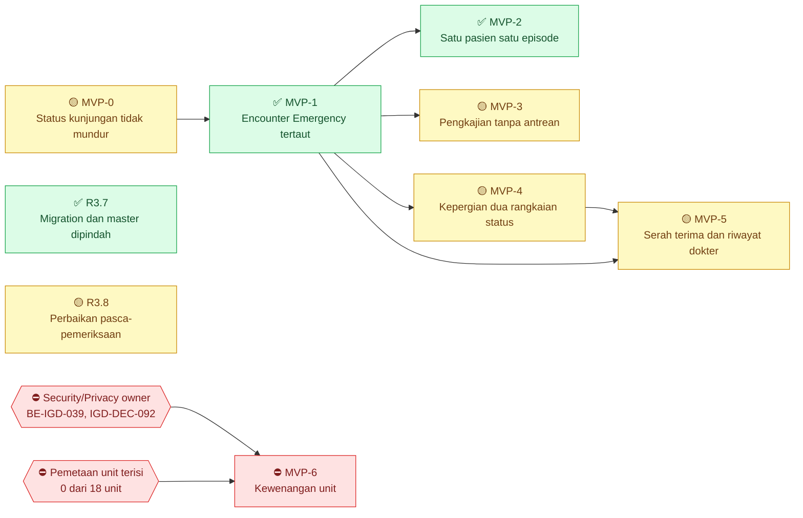
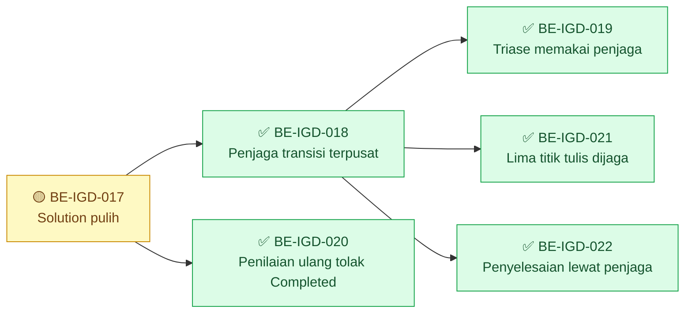
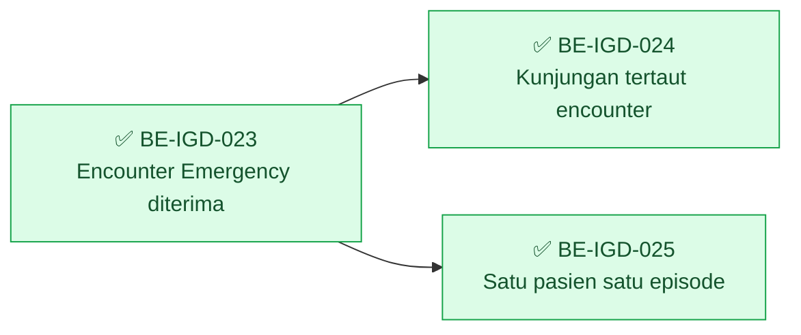
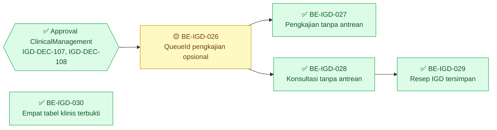
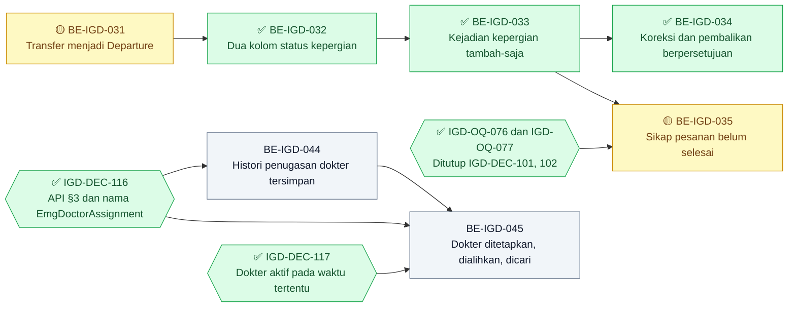
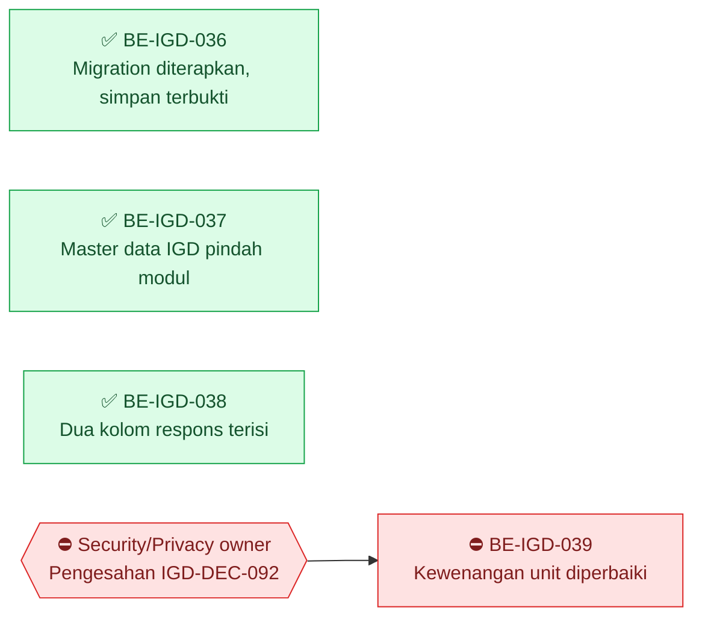
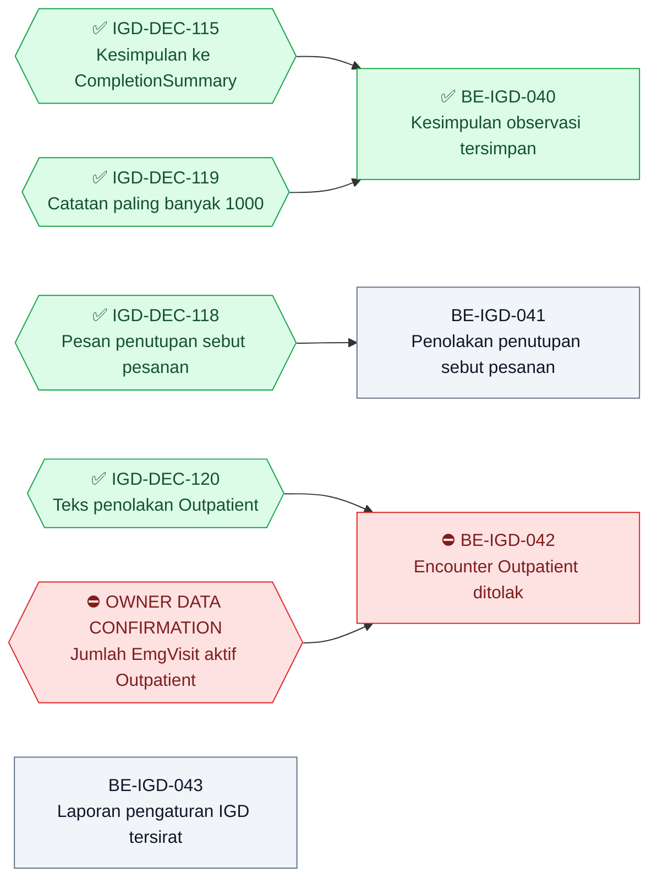

# Roadmap Delivery Backend — Modul IGD

## Metadata

```yaml
module_id: igd
roadmap_revision: 3
wave: "Dikoreksi 2026-09-15: MVP-1, MVP-2, dan R3.7 selesai; MVP-0, MVP-3, MVP-4, MVP-5 sebagian; MVP-6 terblokir BE-IGD-039. Klaim lama 'MVP-0..MVP-5 selesai' tidak akurat — lihat evidence/2026-09-15-pemeriksaan-status.md bagian 8"
status: ACTIVE
status_synced_at: "2026-09-15 — pemetaan ulang acceptance criteria pada backend e89907c5; IGD-DEC-110 sampai IGD-DEC-115"
planning_updated_at: "2026-09-15 (kedua) — plan-module-delivery pada backend 7b0c2ece: BE-IGD-040 sampai BE-IGD-045 ditambahkan, tindak lanjut BE-IGD-017; IGD-DEC-116 sampai IGD-DEC-121. Revision roadmap tetap 3 — task baru ditambahkan tanpa mengubah task lama"
generated_at: "2026-08-24"
activated_at: "2026-08-26"
revision_3_at: "2026-08-26"
revision_3_1_at: "2026-08-27"
scope: >
  Revision 2 hanya MVP-0 (EPIC IGD-03). Revision 3 memperluas ke perjalanan pasien penuh
  atas permintaan owner: pendaftaran & triase, pengkajian sampai tuntas, dan kepergian
  pasien. Penunjang medis, pemakaian alat, dan billing IGD SENGAJA belum direncanakan —
  ketiganya belum punya blueprint. Lihat bagian R3.5.
owners:
  - "Product/Domain Owner IGD — Rizki Gunawan (IGD-DEC-089)"
approved_by:
  - "Rizki Gunawan / 2026-08-26 — IGD-DEC-094, eksekusi gelombang MVP-0"
input_revisions:
  blueprint-manifest.md: 5
  00-interview-decisions.md: "91 keputusan, sampai IGD-DEC-093"
  01-existing-capability-map.md: 3
  04-prd-to-mvp.md: 5
contract_versions:
  - "State 0.4.0 — bagian 1, 1.1, 1.2 APPROVED (IGD-DEC-093)"
  - "Validation 0.4.0 — bagian 2 aturan 4-5 APPROVED (IGD-DEC-093)"
  - "API 0.4.0 — draft, TIDAK dipakai gelombang ini"
  - "Integration 0.3.0 — draft, TIDAK dipakai gelombang ini"
  - "Permission/Audit 0.4.0 — draft, TIDAK dipakai gelombang ini"
artifact_hashes:
  00-interview-decisions.md: "43ba0661bf30d0bd626bca8d4592abbfb6a334fe18dffeaba2d9d4ad1bbb7fb0"
  02-backend-architecture.md: "20fcaad625ab52b7058f751cad96c8732d234264d1d94a28b1f1ccd6f3aa6753"
  04-prd-to-mvp.md: "7061525001d9a7e6b311424b8e3a8d85de13e35f59e545a78dcefedd600b79db"
  contracts/state-transition-matrix.md: "a41efd8d9adc87e1cf1eec2a9397b3521fdc0ebf935ccf0a19a5aa975b6c7c75"
  contracts/validation-matrix.md: "0ee98b750a29e01603db894ed3766614fe8989b2eef3573eab7d72cdc1a6b907"
  testing/acceptance-test-matrix.md: "0795daa024928a583b3b7ca4ef75e15abedac5f7c937814c14dec6a3ad392b8e"
source_commits:
  backend: "300922c — merge Hamzah/Ikbal/Yasmina; bukti bagian 2 diperiksa ulang 2026-08-26"
  backend_at_authoring: "f69e9e483052845d11c91d8b7bbdce33c4acc8d8"
  frontend: "96a9120111f6acc6b7c0f37973ea0c717ba41f17"
supersedes: "roadmap/archive/revision-1/backend-roadmap.md"
```

Revision `1` **tidak dihapus**. Seluruh isinya ada di `roadmap/archive/revision-1/`, dan task
`BE-IGD-001` sampai `BE-IGD-016` yang sudah selesai tetap berlaku sebagai riwayat.

**Arti tanda status pada dokumen ini.**

| Tanda | Artinya |
| :---: | --- |
| ✅ | Selesai. Acceptance criteria dan DoD **terbukti**, buktinya ada pada laporan task |
| 🟡 | Sebagian. Source-nya sudah ada, tetapi acceptance criteria belum terbukti penuh. **Belum selesai** |
| ⛔ | Terblokir. Prasyaratnya belum terpenuhi, dan task **tidak boleh dimulai** |
| tanpa tanda | Belum dikerjakan |

> **Penandaan 15 September 2026.** Tanda pada roadmap ini dipasang setelah setiap acceptance
> criteria dipetakan ulang ke source backend `e89907c5`. Tiga keputusan menjadi dasarnya:
> `IGD-DEC-110` (angka test lama sah sebagai bukti historis; automated test bukan lagi
> acceptance criterion), `IGD-DEC-113` (laporan gabungan lama diterima), dan `IGD-DEC-114`
> (`MVP-5` belum selesai). Rincian per task:
> [evidence/2026-09-15-pemeriksaan-status.md](../evidence/2026-09-15-pemeriksaan-status.md)
> bagian 8.2.

## Grafik Urutan Dependency

Roadmap ini memuat 23 task, melewati batas 15 node untuk satu grafik. Karena itu grafik dipecah:
satu **grafik ringkasan antar-gelombang** di bawah ini, lalu satu grafik per gelombang yang
diletakkan di bawah judul gelombangnya — bagian 4 (`MVP-0`), R3.2 (`MVP-1`/`MVP-2`), R3.3
(`MVP-3`), R3.4 (`MVP-4`/`MVP-5`), dan R3.7.

Panah **antar-gelombang** hanya digambar pada grafik ringkasan. Tiga dependency task yang
melintasi gelombang terwakili di sana:

| Dependency pada kartu | Diwakili panah ringkasan |
| --- | --- |
| `BE-IGD-023` menunggu *"`MVP-0` selesai"* | `MVP0 --> MVP1` |
| `BE-IGD-026` dan `BE-IGD-030` menunggu `BE-IGD-024` | `MVP1 --> MVP3` |
| `BE-IGD-031` menunggu *"`MVP-1`"* | `MVP1 --> MVP4` |



> **Panah `MVP1 --> MVP5` ditambahkan 15 September 2026.** `MVP-5` berisi dua epic dengan
> prasyarat berbeda: `EPIC IGD-07` (serah terima) menunggu kepergian pasien (`MVP-4`), sedangkan
> `EPIC IGD-04` (riwayat dokter, `BE-IGD-044`) hanya menunggu kunjungan yang tertaut encounter
> (`MVP-1`). Tanpa pemisahan ini, riwayat dokter ikut tertahan uji langkah mundur migration
> `BE-IGD-031` yang tidak ada hubungannya.

| Gelombang | Boleh mulai setelah | Isi |
| ---: | --- | --- |
| 1 | — | `MVP-0`; R3.7 dan R3.8 (tanpa dependency antar-gelombang) |
| 2 | `MVP-0` | `MVP-1` |
| 3 | `MVP-1` | `MVP-2`, `MVP-3`, `MVP-4`; `EPIC IGD-04` pada `MVP-5` — boleh paralel |
| 4 | `MVP-4` | `EPIC IGD-07` pada `MVP-5` |
| — | ⛔ menunggu Security/Privacy owner dan pemetaan unit | `MVP-6` |

### Register status task

| Task | Judul | Gelombang | Status | Laporan |
| --- | --- | --- | --- | --- |
| `BE-IGD-017` | Pulihkan solution | `MVP-0` | 🟡 laporan tracked tidak ada | — (hasil hanya pada kartu) |
| `BE-IGD-018` | Penjaga transisi status terpusat | `MVP-0` | ✅ | [be-igd-018](../task/report/backend/be-igd-018-penjaga-transisi-status-kunjungan.md) |
| `BE-IGD-019` | Jalur triase memakai penjaga | `MVP-0` | ✅ | [be-igd-019](../task/report/backend/be-igd-019-jalur-triase-tidak-memundurkan-status.md) |
| `BE-IGD-020` | Penilaian ulang menolak kunjungan `Completed` | `MVP-0` | ✅ | [be-igd-020](../task/report/backend/be-igd-020-penilaian-ulang-kunjungan-tertutup.md) |
| `BE-IGD-021` | Lima titik tulis sisanya memakai penjaga | `MVP-0` | ✅ | [be-igd-021-035](../task/report/backend/be-igd-021-035-penyelesaian-perjalanan-pasien.md) |
| `BE-IGD-022` | Penyelesaian kunjungan lewat penjaga | `MVP-0` | ✅ | [be-igd-021-035](../task/report/backend/be-igd-021-035-penyelesaian-perjalanan-pasien.md) |
| `BE-IGD-023` | Kunjungan IGD menerima `Emergency` | `MVP-1` | ✅ | [be-igd-021-035](../task/report/backend/be-igd-021-035-penyelesaian-perjalanan-pasien.md) |
| `BE-IGD-024` | Penghubung kunjungan ke encounter | `MVP-1` | ✅ | [be-igd-021-035](../task/report/backend/be-igd-021-035-penyelesaian-perjalanan-pasien.md) |
| `BE-IGD-025` | Satu pasien satu episode aktif | `MVP-2` | ✅ | [be-igd-021-035](../task/report/backend/be-igd-021-035-penyelesaian-perjalanan-pasien.md) |
| `BE-IGD-026` | `QueueId` pengkajian opsional | `MVP-3` | 🟡 1 dari 3 kriteria belum | [be-igd-021-035](../task/report/backend/be-igd-021-035-penyelesaian-perjalanan-pasien.md) |
| `BE-IGD-027` | Pengkajian tanpa antrean | `MVP-3` | ✅ | [be-igd-021-035](../task/report/backend/be-igd-021-035-penyelesaian-perjalanan-pasien.md) |
| `BE-IGD-028` | Konsultasi dokter tanpa antrean | `MVP-3` | ✅ | [be-igd-021-035](../task/report/backend/be-igd-021-035-penyelesaian-perjalanan-pasien.md) |
| `BE-IGD-029` | Resep IGD | `MVP-3` | ✅ | [be-igd-021-035](../task/report/backend/be-igd-021-035-penyelesaian-perjalanan-pasien.md) |
| `BE-IGD-030` | Empat tabel klinis bekerja | `MVP-3` | ✅ | [be-igd-021-035](../task/report/backend/be-igd-021-035-penyelesaian-perjalanan-pasien.md) |
| `BE-IGD-031` | Transfer menjadi Departure | `MVP-4` | 🟡 1 dari 4 kriteria belum | [be-igd-021-035](../task/report/backend/be-igd-021-035-penyelesaian-perjalanan-pasien.md) |
| `BE-IGD-032` | Dua kolom status kepergian | `MVP-4` | ✅ | [be-igd-021-035](../task/report/backend/be-igd-021-035-penyelesaian-perjalanan-pasien.md) |
| `BE-IGD-033` | Kejadian kepergian tambah-saja | `MVP-4` | ✅ | [be-igd-021-035](../task/report/backend/be-igd-021-035-penyelesaian-perjalanan-pasien.md) |
| `BE-IGD-034` | Entri susulan, koreksi, pembalikan | `MVP-4` | ✅ | [be-igd-021-035](../task/report/backend/be-igd-021-035-penyelesaian-perjalanan-pasien.md) |
| `BE-IGD-035` | Sikap atas pesanan yang belum selesai | `MVP-5` | 🟡 kriteria 2 dan kewenangan unit tujuan belum | [be-igd-021-035](../task/report/backend/be-igd-021-035-penyelesaian-perjalanan-pasien.md) |
| `BE-IGD-036` | Migration diterapkan, simpan pengkajian terbukti | R3.7 | ✅ | [be-igd-036-039](../task/report/backend/be-igd-036-039-penerapan-migration-pemindahan-master-dan-audit-kesiapan.md) |
| `BE-IGD-037` | Master data IGD pindah modul | R3.7 | ✅ | [be-igd-036-039](../task/report/backend/be-igd-036-039-penerapan-migration-pemindahan-master-dan-audit-kesiapan.md) |
| `BE-IGD-038` | Dua kolom respons daftar | R3.7 | ✅ | [be-igd-036-039](../task/report/backend/be-igd-036-039-penerapan-migration-pemindahan-master-dan-audit-kesiapan.md) |
| `BE-IGD-039` | Kewenangan unit beda domain identitas | `MVP-6` | ⛔ Security/Privacy owner | [be-igd-036-039](../task/report/backend/be-igd-036-039-penerapan-migration-pemindahan-master-dan-audit-kesiapan.md) |
| `BE-IGD-040` | Kesimpulan observasi tersimpan | R3.8 | ✅ 15 September 2026 — implementasi; build dan runtime belum diverifikasi | [BE-IGD-040](../task/report/backend/BE-IGD-040.md) |
| `BE-IGD-041` | Penolakan penutupan menyebut pesanan | R3.8 | tanpa tanda — direncanakan | — |
| `BE-IGD-042` | Encounter `Outpatient` ditolak | R3.8 | ⛔ menunggu konfirmasi data owner | — |
| `BE-IGD-043` | Laporan susulan pengaturan IGD tersirat | R3.8 | tanpa tanda — direncanakan | — |
| `BE-IGD-044` | Histori penugasan dokter IGD | `MVP-5` | tanpa tanda — direncanakan | — |
| `BE-IGD-045` | Penetapan, pengalihan, dan pencarian dokter aktif | `MVP-5` | tanpa tanda — direncanakan | — |

**Tindak lanjut `BE-IGD-017`** (task yang sama, ID tidak diganti): laporan tracked susulan.
Lihat baris *Tindak lanjut* pada kartunya.

`EPIC IGD-04` kini dipecah menjadi `BE-IGD-044` dan `BE-IGD-045` (bagian R3.4), dengan sisi
layar `FE-IGD-027`. Rentang requirement-nya `FR-IGD-016`…`021`; tulisan `FR-IGD-016`…`022` pada
`IGD-DEC-114` dikoreksi di decision log — `FR-IGD-022` milik `EPIC IGD-05`.

---

## 0. Peringatan yang mendahului seluruh task

> **Diperbarui 15 September 2026.** Bagian 0.1 dan 0.2 menggambarkan keadaan 26 Agustus 2026
> dan disimpan sebagai riwayat. Sejak 11 September 2026 **seluruh proyek test backend dihapus**
> atas arahan lead (`cefd927d`, `b3ab542e`), termasuk test IGD. Kalimat *"Roadmap ini menuntut
> test sebagai bukti acceptance"* pada 0.2 **digantikan `IGD-DEC-110`**: angka test yang sudah
> tercatat tetap sah sebagai bukti historis, dan bukti untuk task berikutnya adalah pemetaan
> acceptance criteria ke source ditambah catatan uji API manual.

### 0.1 Solution rusak sejak merge `300922c` — CI merah

Roadmap ini disusun ketika `HEAD` masih `f69e9e48`. Di tengah penyusunannya, merge
**`300922c` "merge dengan branch Hamzah, Ikbal dan Yasmina"** mendarat dan mengubah keadaan.
Angka commit pada metadata di atas karena itu **tertinggal**; keadaan yang berlaku adalah
`300922c`.

Diverifikasi 26 Agustus 2026 dengan perintah yang persis dipakai CI:

```
dotnet build ./QuilvianSystemBackend.sln --configuration Release
→ Solution file error MSB5004: The solution file has two projects
  named "QuilvianSystemBackend.Tests".
  Build FAILED. 1 Error(s). Time Elapsed 00:00:00.02
```

Dua cacat, keduanya sudah **ter-commit dan ter-push** ke `origin/rizkiG`:

| # | Cacat | Akibat |
| --- | --- | --- |
| 1 | `QuilvianSystemBackend.sln` mendaftarkan `QuilvianSystemBackend.Tests` **dua kali** — baris 8 (`{2F4C3E18…}`, tipe SDK) dan baris 14 (`{5C98C11A…}`, tipe legacy `{FAE04EC0…}`), keduanya menunjuk csproj yang sama | `MSB5004`. Seluruh perintah tingkat solution gagal seketika, termasuk **CI** |
| 2 | `QuilvianSystemBackend.Tests.csproj` memuat **penanda konflik merge yang ter-commit** — `<<<<<<< HEAD` baris 13, `=======` baris 19, `>>>>>>> origin/Ikbal` baris 26, dan blok kedua baris 34–40 | `MSB4025` — berkas project tidak dapat dibaca sama sekali. `dotnet test` mustahil |

Cacat 1 punya lapisan tambahan: entri baris 8 yang tipe project-nya benar **tidak punya satu
pun baris konfigurasi build**. Yang punya justru entri duplikatnya, baris 34–37. Menghapus
duplikat begitu saja membuat project test tidak ikut ter-build.

`QuilvianSystemBackend.csproj` **sendirian tetap sehat**:
`dotnet build ./QuilvianSystemBackend.csproj` → `Build succeeded, 0 Error(s), 135 Warning(s)`.
Jadi kerusakannya ada pada berkas solution dan berkas project test, bukan pada kode aplikasi.

**Akibatnya seluruh task di bawah tidak dapat divalidasi** sebelum `BE-IGD-017` selesai — CI
tidak dapat hijau, dan tidak satu pun `AT-IGD-*` dapat dijalankan.

### 0.2 Solution **punya** project test

`QuilvianSystemBackend.Tests` terdaftar di `QuilvianSystemBackend.sln` — xUnit dengan
`Microsoft.EntityFrameworkCore.InMemory` dan `ProjectReference` ke project utama. Setelah
merge `300922c` isinya **59 berkas**: `BillingManagement`, `HealthServices/OperatingRoomManagement`,
`HealthServices/PharmacyManagement`, dan `InPatientManagement`. Ada pula project test kedua,
`Tests/QuilvianSystemBackend.BillingTests` (3 berkas). Per 26 Agustus 2026 suite berisi
**686 test**.

Ini **membantah** `NewQuilvianSystemBackend/CLAUDE.md` yang menyatakan solution *"hanya berisi
satu project — tidak ada test project sama sekali"*, dan membantah kesimpulan laporan
`BE-IGD-*` sebelumnya bahwa `AT-IGD-*` tidak dapat dijalankan.

**Roadmap ini menuntut test sebagai bukti acceptance, bukan mengecualikannya.**

---

## 1. Batas gelombang `MVP-0`

`04-prd-to-mvp.md` bagian 5 mengisi `MVP-0` dengan tiga hal. Hanya satu yang dapat dikerjakan.

| Isi `MVP-0` | Pemilik | Keadaan |
| --- | --- | --- |
| `EPIC IGD-03` — status kunjungan tidak dapat mundur | **IGD** | **Direncanakan di sini** |
| Pengisian master kelas pasien IGD | Master Data — **belum ditunjuk** | **Tidak direncanakan.** Lihat bagian 5 |
| Pemetaan unit layanan ke simpul organisasi | Master Data — **belum ditunjuk** | **Tidak direncanakan.** Lihat bagian 5 |

Gelombang ini **tidak** membuat tabel baru, **tidak** membuat endpoint baru, dan **tidak**
membutuhkan migration. Karena itu otorisasi menulis ke basis data bersama — yang masih belum
diberikan — **tidak** menghalanginya.

---

## 2. Slice

### `IGD-S01` — Status kunjungan tidak dapat mundur

| Field | Isi |
| --- | --- |
| Epic | `EPIC IGD-03` |
| Requirement | `FR-IGD-013`, `FR-IGD-014`, `FR-IGD-015` |
| Keputusan | `IGD-GAP-014`, `IGD-CONF-05`, `IGD-DEC-093` |
| Kontrak | State `0.3.0` bagian 1/1.1/1.2 **approved**; Validation `0.3.0` bagian 2 aturan 4–5 **approved** |
| Tabel | `TrxEmergencyVisit`, `TrxEmergencyTriage` — **keduanya milik IGD** |
| Perubahan lintas modul | **Nol.** Butir 2 Definition of Done tidak berlaku untuk gelombang ini |
| Migration | **Tidak ada** |

**Bukti cacat.** Penelusuran `visit.VisitStatus =` pada
`Areas/HealthServices/EmergencyInstallationManagement` menemukan **sembilan** titik tulis di
lima controller. Hanya **satu** yang melewati `CanTransition`.

| Berkas | Baris | Menulis | Penjagaan saat ini |
| --- | ---: | --- | --- |
| `Controllers/EmergencyTriageController.cs` | 250 | `Triaged` | **Tidak ada** |
| `Controllers/EmergencyTriageController.cs` | 356 | `Triaged` | **Tidak ada** — yang diperiksa `TriageStatus`, bukan `VisitStatus` |
| `Controllers/EmergencyObservationController.cs` | 277 | `UnderObservation` | **Tidak ada** |
| `Controllers/EmergencyObservationController.cs` | 279 | `AwaitingDisposition` | **Tidak ada** |
| `Controllers/EmergencyObservationController.cs` | 283 | `InTreatment` | **Tidak ada** |
| `Controllers/EmergencyResuscitationController.cs` | 295 | `InTreatment` | **Tidak ada** |
| `Controllers/EmergencyDispositionController.cs` | 335 | `Disposed` | **Tidak ada** |
| `Controllers/EmergencyVisitController.cs` | 378 | dari request | `CanTransition` baris 373 — **sudah benar** |
| `Controllers/EmergencyVisitController.cs` | 433 | `Completed` | Aturan bisnis `ValidateVisitClosureAsync`, **bukan** `CanTransition` |

`EmergencyVisitService.CanTransition(EmergencyVisitStatus, EmergencyVisitStatus)` baris 172
**sudah cocok** dengan tabel kontrak bagian 1 — termasuk `Completed` yang final dan `Triaged`
yang hanya dapat dicapai dari `WaitingForTriage`. Cacatnya bukan pada matriksnya, melainkan
pada tujuh titik tulis yang melewatinya.

---

## 3. Task

Urutan wajib. `BE-IGD-017` mendahului segalanya; `BE-IGD-018` mendahului `019`–`022`.

### 🟡 `BE-IGD-017` — Pulihkan solution: konflik merge dan entri ganda

> **`SELESAI` 26 Agustus 2026.** Dikerjakan atas persetujuan lisan Rizki Gunawan. **Belum
> di-commit dan belum di-push** — menunggu tinjauan. Bukti ada di bagian "Hasil" di bawah.

| Field | Isi |
| --- | --- |
| **Tindak lanjut** | **Direncanakan 15 September 2026 — laporan tracked susulan, tanpa perubahan source.** Berkas: `task/report/backend/BE-IGD-017.md`, ditulis `build-module-backend`. Acceptance: 1. Laporan memuat keempat hasil 26 Agustus 2026 dari bagian "Hasil `BE-IGD-017`" apa adanya, termasuk dua kegagalan test milik Rawat Inap. 2. Laporan menyatakan proyek test dan entri solution yang dipulihkan task ini **dihapus 11 September 2026** atas arahan lead (`cefd927d`, `b3ab542e`), sehingga hasilnya historis dan tidak dapat diulang (`IGD-DEC-110`). 3. Empat baris `using` pada berkas test Rawat Inap dicatat sebagai perubahan pada modul lain. 4. **Nol perubahan source.** Setelah laporan ada, kartu ini boleh dinilai ulang menjadi ✅, dan `MVP-0` ikut naik bila kelima task lain tetap ✅. Dependency: — |
| **Status** | 🟡 **SEBAGIAN — ditandai 15 September 2026.** Keempat acceptance criteria terpenuhi pada 26 Agustus 2026 dan hasilnya tercatat pada bagian "Hasil `BE-IGD-017`" di bawah: `0 Error(s)`, `Total: 518, Passed: 516, Failed: 2`. Yang menahan ✅: **laporan tracked tidak pernah ditulis** — nol berkas di `task/report/` menyebut task ini. Objeknya (proyek test dan entri solution) kemudian dihapus 11 September 2026 atas arahan lead (`cefd927d`); itu keputusan lead, bukan regresi. Penilaian: [evidence 2026-09-15 bagian 8.2](../evidence/2026-09-15-pemeriksaan-status.md) |
| **Slice** | Prasyarat. **Bukan** bagian `EPIC IGD-03`, dan **bukan** milik IGD |
| **Scope** | `QuilvianSystemBackend.Tests/QuilvianSystemBackend.Tests.csproj` dan `QuilvianSystemBackend.sln` |
| **Perubahan a — konflik merge** | Selesaikan konflik `rizkiG` × `origin/Ikbal`. **Ambil versi paket sisi Ikbal** (`Microsoft.NET.Test.Sdk` 17.13.0, `xunit` 2.9.3, `xunit.runner.visualstudio` 3.1.5, tambahan `Microsoft.Extensions.DependencyModel` 9.0.18) karena lebih baru dan test barunya sudah menuntutnya. **Pertahankan `<ItemGroup><Using Include="Xunit" /></ItemGroup>` sisi `HEAD`** yang dihapus sisi Ikbal. Hapus seluruh penanda konflik |
| **Perubahan b — entri ganda** | Hapus baris 14–15 `QuilvianSystemBackend.sln` (entri `{5C98C11A…}` bertipe legacy `{FAE04EC0…}`), lalu **pindahkan** empat baris konfigurasi build 34–37 ke GUID entri yang dipertahankan, `{2F4C3E18-3FD8-4A3A-A8A5-D3F7C11672D5}`. Menghapus baris 14–15 tanpa memindahkan konfigurasinya membuat project test tidak ikut ter-build |
| **Requirement** | — (perbaikan infrastruktur, bukan functional requirement) |
| **Kontrak** | Tidak ada |
| **Dependency** | Tidak ada |
| **Acceptance** | 1. `dotnet build ./QuilvianSystemBackend.sln --configuration Release` → `Build succeeded`, `0 Error(s)`. 2. `dotnet test ./QuilvianSystemBackend.Tests/QuilvianSystemBackend.Tests.csproj` berjalan dan melaporkan jumlah test. 3. Nol penanda konflik tersisa: `grep -rn "^<<<<<<< " ` tidak menghasilkan apa pun. 4. `dotnet build ./QuilvianSystemBackend.csproj` tetap `0 Error(s)` — jangan sampai perbaikan solution merusak project utama |
| **Bukti** | Keluaran ketiga perintah sebelum dan sesudah; diff kedua berkas |
| **Risiko** | **Menengah, dan bukan risiko teknis.** Perubahannya kecil dan terukur, tetapi menyentuh hasil merge tiga rekan (Hamzah, Ikbal, Yasmina). Versi paket yang dipilih memengaruhi test mereka |
| **Owner** | **Bukan IGD.** Pemilik repository, atau orang yang melakukan merge `300922c` |
| **Bukti pendukung pilihan `<Using Include="Xunit" />`** | **43 dari 60** berkas test tidak memuat `using Xunit;` eksplisit dan akan gagal kompilasi bila baris itu hilang. Seluruh `BillingManagement` dan `InPatientManagement` bergantung padanya; hanya `HealthServices/OperatingRoomManagement` dan `PharmacyManagement` yang eksplisit |

#### Hasil `BE-IGD-017`

Setelah perubahan a dan b dikerjakan, `MSB5004` dan `MSB4025` hilang dan project test **mulai
ikut dikompilasi**. Kompilasi itu membuka **enam error CS yang sebelumnya tersembunyi**,
seluruhnya di berkas test `InPatientManagement` dan seluruhnya sekadar `using` yang kurang:

| Error | Berkas | Sebab |
| --- | --- | --- |
| `CS0246` `TagsAttribute` ×4 | `InpatientEpisodeControllerContractTests.cs`, `InpatientMasterDataControllerContractTests.cs` ×2, `InpatientModuleControllerContractTests.cs` | `TagsAttribute` ada di `Microsoft.AspNetCore.Http`, yang tersedia otomatis di project utama (Web SDK) tetapi **tidak** di project test (`Microsoft.NET.Sdk`) |
| `CS0103` `InpDischargeType`, `InpFinancialClearanceStatus` | `InpatientEpisodeTestWorld.cs` | Kedua enum ada di `Areas/HealthServices/InPatientManagement/Enums/`, tetapi berkas itu meng-import `.DTOs`, `.Models`, `.Services` — **bukan** `.Enums` |

Keenamnya diperbaiki dengan **empat baris `using`**, nol perubahan semantik. Ini melebar dari
dua berkas yang direncanakan menjadi enam, dan keempat berkas tambahan itu **milik Rawat
Inap**, bukan IGD — dicatat terbuka di sini agar dapat ditolak bila pemiliknya keberatan.

**Verifikasi acceptance:**

| Kriteria | Hasil |
| --- | --- |
| 1. `dotnet build ./QuilvianSystemBackend.sln --configuration Release` | **`Build succeeded. 0 Error(s), 15 Warning(s)`** — CI hijau |
| 2. `dotnet test …/QuilvianSystemBackend.Tests.csproj` | **Berjalan.** `Total: 518, Passed: 516, Failed: 2, Skipped: 0` |
| 3. Nol penanda konflik | **Bersih.** `grep -rn "^<<<<<<< "` nol hasil |
| 4. `dotnet build ./QuilvianSystemBackend.csproj` tetap sehat | **Ya**, `0 Error(s)` |

**Dua test yang gagal, keduanya milik Rawat Inap dan bukan akibat perbaikan ini:**

| Test | Kegagalan |
| --- | --- |
| `InpStatusHistoryAndMonitoringTests.Kriteria1Dan4_RiwayatTerbacaUrutDanTetapTerbacaSetelahEpisodeDitutup` | `Assert.Equal()` — diharapkan `3`, nyatanya `4` baris riwayat |
| `InpCorrectionAndNewbornTests.Kriteria2Dan3_StatusTetapClosedTempatTidurTidakKembaliDanLamaDirawatTidakBertambah` | Asersi perilaku episode tertutup |

Keduanya kegagalan asersi perilaku bisnis, bukan kegagalan kompilasi atau infrastruktur.
Keduanya **tidak** dapat disebabkan perubahan `BE-IGD-017`, yang hanya menyentuh versi paket,
berkas solution, dan baris `using`. Diserahkan kepada Product/Domain Owner Rawat Inap
(Muhammad Hamzah) — **task ini tidak memperbaikinya**.

### ✅ `BE-IGD-018` — Penjaga transisi status kunjungan yang terpusat

> **`SELESAI` 26 Agustus 2026.** Keempat kriteria acceptance terpenuhi dan terbukti lewat
> **168 test**. Laporan: `task/report/backend/be-igd-018-penjaga-transisi-status-kunjungan.md`.
> **Belum di-commit.**
>
> | Verifikasi | Hasil |
> | --- | --- |
> | `dotnet test --filter EmergencyVisitStatusTransitionTests` | `Passed! 168/168` |
> | Suite penuh | `686 total, 684 lulus`, naik dari `518`. Dua gagal = dua yang sama milik Rawat Inap, **nol regresi** |
> | `dotnet build sln --configuration Release` | `0 Error(s)` |
>
> Perubahan test disimpan di `HealthServices/EmergencyInstallationManagement/`, bukan di akar
> folder test seperti tertulis di baris **Test** bawah — mengikuti tetangga terdekatnya
> `HealthServices/OperatingRoomManagement` dan `HealthServices/PharmacyManagement`.

| Field | Isi |
| --- | --- |
| **Status** | ✅ **SELESAI 26 Agustus 2026; dipetakan ulang 15 September 2026.** Keempat acceptance criteria terpetakan ke source `e89907c5`: `EmergencyVisitService.TryApplyVisitStatus` baris 443, `CanTransition` baris 366/387. Validasi historis: `168/168` test, suite `686 total, 684 lulus`, build `0 Error(s)` — sah sebagai bukti historis menurut `IGD-DEC-110`; test-nya ikut terhapus 11 September 2026. Bukti: [laporan](../task/report/backend/be-igd-018-penjaga-transisi-status-kunjungan.md) |
| **Slice** | `IGD-S01` |
| **Scope** | `Areas/HealthServices/EmergencyInstallationManagement/Services/EmergencyVisitService.cs` |
| **Perubahan** | Tambahkan satu metode penjaga, misal `TryApplyVisitStatus(TrxEmergencyVisit visit, EmergencyVisitStatus target, Guid actorUserId, DateTime now, out string? penolakan)`. Metode ini memanggil `CanTransition` yang **sudah ada**, lalu bila sah menulis `VisitStatus`, `UpdateDateTime`, dan `UpdateBy` sekaligus. **Nol pemanggil diubah pada task ini** — perilaku aplikasi tidak berubah sama sekali |
| **Requirement** | `FR-IGD-015` (fondasi) |
| **Keputusan** | `IGD-CONF-05` |
| **Kontrak** | State `0.3.0` bagian 1, 1.1, 1.2 — hash `a41efd8d…` |
| **Dependency** | `BE-IGD-017` |
| **Acceptance** | 1. `CanTransition` **tidak diubah** — matriksnya sudah cocok dengan kontrak. 2. Test unit menutup seluruh sel tabel kontrak bagian 1: setiap ✓ diterima, setiap — ditolak. 3. `Completed` → `Completed` ditolak. 4. Transisi ke status yang sama pada status non-`Completed` diterima, sesuai perilaku kode yang berlaku |
| **Test** | `AT-IGD-089` sebagian. Berkas baru `QuilvianSystemBackend.Tests/EmergencyInstallationManagement/EmergencyVisitStatusTransitionTests.cs` |
| **Bukti** | Keluaran `dotnet test`, jumlah test lulus |
| **Risiko** | Rendah. Menambah kode mati sementara sampai `BE-IGD-019` memakainya |
| **Owner** | Backend |

> **Satu hal yang perlu diputuskan saat mengerjakan.** Kontrak bagian 1 menampilkan diagonal
> tabel sebagai `—`, tetapi bagian 1.2 hanya menyebut `Completed` → `Completed` yang ditolak.
> Kode saat ini menerima transisi ke status yang sama untuk status lain. Roadmap ini mengikuti
> kode. Bila Product/Domain Owner menghendaki seluruh diagonal ditolak, itu perubahan kontrak
> dan **bukan** wewenang task ini.

### ✅ `BE-IGD-019` — Jalur triase memakai penjaga dan menolak kunjungan tertutup

> **`SELESAI` 26 Agustus 2026.** Kelima kriteria acceptance terpenuhi. **18 test baru**, suite
> naik `686 → 704`, dua gagal = dua yang sama milik Rawat Inap, **nol regresi**. CI
> `0 Error(s)`. Laporan:
> `task/report/backend/be-igd-019-jalur-triase-tidak-memundurkan-status.md`. **Belum di-commit.**
>
> Ditemukan cacat **ketiga** yang tidak tertulis di task: `ValidateRequestAsync` memeriksa
> `Disposed` dan `Cancelled` tetapi **bukan `Completed`**, sehingga kunjungan yang sudah
> selesai masih menerima triase baru. Ditutup dalam task ini karena berada di jalur yang sama.
>
> **`IGD-OQ-079` ditutup `IGD-DEC-104` pada hari yang sama.** Rumusan pertama implementasi —
> *"setiap penolakan penjaga pada kunjungan terbuka diabaikan"* — **ditolak Product/Domain
> Owner karena terlalu luas**. Aturannya kini per status: `WaitingForTriage` berubah lewat
> `CanTransition`; empat status yang sudah melewati triase **tidak dicoba** diubah; kunjungan
> tertutup `409`; dan **`Arrived` yang melompati `WaitingForTriage` juga `409`** — satu-satunya
> tempat kedua rumusan berbeda hasilnya.
>
> Kode dan test disesuaikan sebelum di-commit: test **18 → 27**, suite **704 → 713**,
> CI `0 Error(s)`. Jalur create juga dirapikan — pemeriksaan kunjungan dipindah ke sebelum
> penyimpanan, sehingga `409` tidak meninggalkan baris triase yang terlanjur tersimpan.

| Field | Isi |
| --- | --- |
| **Status** | ✅ **SELESAI 26 Agustus 2026; dipetakan ulang 15 September 2026.** Kelima acceptance criteria terpetakan ke source `e89907c5`: `EmergencyTriageController` baris 286/303 dan 445/453 — pesan kunjungan tertutup dan penjaga pada **kedua** titik tulis; `EmergencyTriageService` baris 151 memeriksa `Completed`. Validasi historis: 27 test, suite `713`, build `0 Error(s)` (`IGD-DEC-110`). Bukti: [laporan](../task/report/backend/be-igd-019-jalur-triase-tidak-memundurkan-status.md) |
| **Slice** | `IGD-S01` |
| **Scope** | `Controllers/EmergencyTriageController.cs` baris 250 dan 356 |
| **Perubahan** | Dua titik tulis `visit.VisitStatus = EmergencyVisitStatus.Triaged` diganti pemanggilan penjaga `BE-IGD-018`. Bila kunjungan sudah `Disposed`, `Completed`, atau `Cancelled` → `409` dengan pesan *"Kunjungan IGD sudah ditutup, penilaian tidak dapat diselesaikan."* Bila transisi tidak sah → `409` dengan pesan *"Penilaian ini tidak dapat mengubah status kunjungan dari {status}."* |
| **Requirement** | `FR-IGD-013`, `FR-IGD-014`, `FR-IGD-015` |
| **Kontrak** | Validation `0.3.0` bagian 2 aturan 4 dan 5 — hash `0ee98b75…`; State `0.3.0` bagian 1 |
| **Dependency** | `BE-IGD-018` |
| **Acceptance** | 1. Pasien `InTreatment` yang dinilai ulang **tetap** `InTreatment`. 2. Menyelesaikan triase pada kunjungan `Disposed` ditolak `409`, dan kunjungan **tidak** terbuka kembali. 3. Menyelesaikan triase pada kunjungan `Completed` ditolak `409`. 4. Pasien `WaitingForTriage` yang triasenya selesai **tetap** menjadi `Triaged` — jalur normal tidak boleh ikut rusak. 5. Pesan penolakan persis seperti kontrak, dan menyebut apa yang harus dilakukan petugas |
| **Test** | `AT-IGD-086`, `AT-IGD-087`, `AT-IGD-088` |
| **Bukti** | Keluaran `dotnet test`; potongan diff kedua titik tulis |
| **Risiko** | **Menengah — paling tinggi di gelombang ini.** Ini jalur yang dipakai setiap hari. Salah sedikit, triase normal ikut tertolak. Butir acceptance 4 ada khusus untuk itu |
| **Owner** | Backend |
| **Pelajaran yang berlaku** | `BE-IGD-016` membuktikan satu status dapat berubah dari lebih dari satu endpoint dan jalur kedua terlewat. Di sini **kedua** titik tulis wajib diubah dalam satu task, bukan satu-satu |

### ✅ `BE-IGD-020` — Penilaian ulang menolak kunjungan yang sudah `Completed`

> **`SELESAI` 26 Agustus 2026.** Kedua kriteria acceptance terpenuhi. Test **27 → 34**, suite
> **713 → 720**, CI `0 Error(s)`. Laporan:
> `task/report/backend/be-igd-020-penilaian-ulang-kunjungan-tertutup.md`. **Belum di-commit.**
>
> Seluruh **empat** pemeriksaan `VisitStatus` pada `EmergencyTriageService` ditelusuri, bukan
> hanya yang disebut task. Dua di antaranya — pemantau SLA baris 263 dan 322 — **tidak
> disentuh** karena diatur `IGD-DEC-083`, tetapi satu celahnya dicatat sebagai `IGD-OQ-080`:
> kunjungan yang ditutup `Completed` tanpa penanganan pernah dimulai akan **terus muncul di
> daftar pantau**.

| Field | Isi |
| --- | --- |
| **Status** | ✅ **SELESAI 26 Agustus 2026; dipetakan ulang 15 September 2026.** Kedua acceptance criteria terpetakan ke source `e89907c5`: `EmergencyTriageService` baris 151 menolak `Completed`, dan status `InTreatment`/`Triaged` tidak ikut tertolak. Validasi historis: test `27 → 34`, suite `720`, build `0 Error(s)` (`IGD-DEC-110`). Bukti: [laporan](../task/report/backend/be-igd-020-penilaian-ulang-kunjungan-tertutup.md) |
| **Slice** | `IGD-S01` |
| **Scope** | `Services/EmergencyTriageService.cs` baris 141–143 |
| **Perubahan** | Penjaga kunjungan tertutup saat ini hanya memeriksa `Disposed` dan `Cancelled`. Tambahkan `Completed`. Pesan yang sudah ada dipertahankan |
| **Requirement** | `FR-IGD-014` |
| **Kontrak** | Validation `0.3.0` bagian 2 aturan 4 |
| **Dependency** | `BE-IGD-017` — dapat berjalan paralel dengan `BE-IGD-019` |
| **Acceptance** | 1. Penilaian ulang pada kunjungan `Completed` ditolak `409`. 2. Penilaian ulang pada kunjungan `InTreatment` dan `Triaged` tetap berhasil |
| **Test** | `AT-IGD-088` |
| **Bukti** | Keluaran `dotnet test` |
| **Risiko** | Rendah |
| **Owner** | Backend |

### ✅ `BE-IGD-021` — Lima titik tulis sisanya memakai penjaga

| Field | Isi |
| --- | --- |
| **Status** | ✅ **SELESAI 26 Agustus 2026; dipetakan ulang 15 September 2026.** Ketiga acceptance criteria terpetakan ke source `e89907c5`: `TryApplyVisitStatus` dipakai `EmergencyObservationController`, `EmergencyResuscitationController`, dan `EmergencyDispositionController`. Penelusuran `.VisitStatus =` menyisakan satu tulis langsung di luar service — `EmergencyVisitController.cs:425` — dan ia sudah didahului `CanTransition` baris 420, sesuai catatan bagian 2. Validasi historis: `234 passed` pada filter IGD, suite `761 total, 759 lulus` (`IGD-DEC-110`). Bukti: [laporan gabungan](../task/report/backend/be-igd-021-035-penyelesaian-perjalanan-pasien.md) (`IGD-DEC-113`) |
| **Slice** | `IGD-S01` |
| **Scope** | `EmergencyObservationController.cs` 277, 279, 283; `EmergencyResuscitationController.cs` 295; `EmergencyDispositionController.cs` 335 |
| **Perubahan** | Kelima titik memanggil penjaga `BE-IGD-018`. Transisi tidak sah → `409` |
| **Requirement** | `FR-IGD-015` |
| **Keputusan** | `IGD-CONF-05` |
| **Kontrak** | State `0.3.0` bagian 1 |
| **Dependency** | `BE-IGD-018` |
| **Acceptance** | 1. Kelima jalur menolak transisi yang tidak sah dengan `409`. 2. Jalur sah pada kelimanya tetap berjalan seperti sebelumnya. 3. Observasi yang selesai tetap dapat mengembalikan kunjungan ke `InTreatment` — itu transisi yang sah menurut kontrak |
| **Test** | `AT-IGD-089` |
| **Bukti** | Keluaran `dotnet test`; diff kelima titik |
| **Risiko** | Menengah. Tiga titik pada observasi berada di satu percabangan; salah membaca cabangnya mengubah perilaku observasi |
| **Owner** | Backend |

### ✅ `BE-IGD-022` — Penyelesaian kunjungan lewat penjaga

| Field | Isi |
| --- | --- |
| **Status** | ✅ **SELESAI 26 Agustus 2026; dipetakan ulang 15 September 2026.** Ketiga acceptance criteria terpetakan ke source `e89907c5`: `EmergencyVisitController.cs:473` tetap memanggil `ValidateVisitClosureAsync`, lalu penjaga `TryApplyVisitStatus` baris 489. Validasi historis: suite `761 total, 759 lulus` (`IGD-DEC-110`). Bukti: [laporan gabungan](../task/report/backend/be-igd-021-035-penyelesaian-perjalanan-pasien.md) |
| **Slice** | `IGD-S01` |
| **Scope** | `EmergencyVisitController.cs` baris 433 |
| **Perubahan** | Penulisan `Completed` dialihkan lewat penjaga. `ValidateVisitClosureAsync` **tetap dipanggil** — ia memeriksa aturan bisnis lain (observasi aktif, kepergian belum tuntas, pesanan tanpa sikap) yang bukan urusan matriks transisi |
| **Requirement** | `FR-IGD-015` |
| **Kontrak** | State `0.3.0` bagian 1; Validation `0.3.0` bagian 6 — **bagian 6 masih `draft`, jadi aturannya tidak diubah, hanya dipertahankan apa adanya** |
| **Dependency** | `BE-IGD-018` |
| **Acceptance** | 1. Menyelesaikan kunjungan `Disposed` tetap berhasil. 2. Menyelesaikan kunjungan yang sudah `Completed` ditolak. 3. Empat pemeriksaan `ValidateVisitClosureAsync` tetap berjalan dan pesannya tidak berubah |
| **Test** | `AT-IGD-089` |
| **Bukti** | Keluaran `dotnet test` |
| **Risiko** | Rendah. Perilaku sudah benar; yang berubah hanya jalannya lewat penjaga |
| **Owner** | Backend |

---

## 4. Urutan dan paralelisasi

Grafik gelombang `MVP-0`. Pohon teks sebelumnya diganti Mermaid pada 15 September 2026; kelima
hubungannya muncul kembali sebagai panah.



| Gelombang | Boleh mulai setelah | Task |
| ---: | --- | --- |
| 1 | — | `BE-IGD-017` |
| 2 | `BE-IGD-017` | `BE-IGD-018`, `BE-IGD-020` — boleh paralel |
| 3 | `BE-IGD-018` | `BE-IGD-019`, `BE-IGD-021`, `BE-IGD-022` — boleh paralel |

`BE-IGD-019`, `BE-IGD-021`, dan `BE-IGD-022` boleh paralel karena menyentuh berkas berbeda.
`BE-IGD-020` boleh jalan segera setelah build pulih.

Frontend **tidak** boleh mulai sebelum `BE-IGD-019` selesai — pesan penolakan yang harus
ditampilkan belum ada sebelum itu. Lihat `frontend-roadmap.md`.

---

## 5. Yang sengaja tidak direncanakan

| Yang tidak direncanakan | Alasan | Yang membukanya |
| --- | --- | --- |
| Pengisian master kelas pasien IGD | Data master milik **Master Data**, pemiliknya belum ditunjuk. Pengisiannya juga menulis ke basis data bersama satu tim, dan otorisasinya belum ada | Penunjukan pemilik Master Data — `approval-requests/2026-08-24-permintaan-penunjukan-pemilik-modul.md` bagian 3.2 |
| Pemetaan unit layanan ke simpul organisasi | Menambah kolom pada `MstServiceUnit`, tabel **milik Master Data**. Butuh migration, dan otorisasi migration belum diberikan | Sama seperti di atas, ditambah otorisasi migration |
| `EPIC IGD-01`, `02`, `04`, `05`, `06`, `07`, `08`, `10` | Gelombang `MVP-1` ke atas. Kontraknya masih `draft`; `IGD-DEC-093` sengaja tidak menyentuhnya | Approval kontrak yang bersangkutan |
| `EPIC IGD-09` | `OPEN DECISION`. Pemilik `ClinicalManagement` dan `PharmacyManagement` belum ditunjuk | Penunjukan kedua pemilik |
| Perbaikan 127 warning kompilasi | Di luar cakupan gelombang, dan mencampurnya dengan `BE-IGD-017` membuat diff perbaikan build sulit ditinjau | Keputusan tersendiri |
| Memperbaiki `NewQuilvianSystemBackend/CLAUDE.md` | Bukan artefak blueprint. Tetapi isinya salah dan menyesatkan — lihat bagian 0.2 | Keputusan pemilik repository |

---

## 6. Definition of Done gelombang `MVP-0`

Mengikuti `04-prd-to-mvp.md` bagian 6, dengan keadaan yang sudah diketahui.

| No | Butir | Berlaku? | Bukti yang diterima |
| ---: | --- | :-: | --- |
| 1 | Seluruh functional requirement punya test yang lulus | **Ya** | Keluaran `dotnet test`. **Dapat dipenuhi** — project test ada, lihat bagian 0.2 |
| 2 | Test regresi jalur rawat jalan untuk perubahan lintas modul | **Tidak** | Gelombang ini nol perubahan lintas modul |
| 3 | Migration punya langkah mundur yang diuji | **Tidak** | Gelombang ini tanpa migration |
| 4 | Tidak ada endpoint yang menghapus permanen catatan klinis | **Ya** | Penelusuran kode; gelombang ini tidak menambah endpoint |
| 5 | Tidak ada isi klinis di berkas log | **Ya** | Contoh keluaran log dari jalur triase |
| 6 | Setiap tahap kepergian punya pemilik klinis tepat satu | **Tidak** | `AT-IGD-095` milik `EPIC IGD-05`, bukan gelombang ini |
| 7 | Layar menyatakan keterbatasan penunjang | **Tidak** | Bukan gelombang ini |
| 8 | Data master gelombangnya sudah terisi | **Tidak** | Bagian data master `MVP-0` tidak direncanakan — lihat bagian 5 |
| 9 | Kontrak yang berubah sudah dinaikkan versinya dan hash-nya dihitung ulang | **Ya** | Sudah dilakukan `IGD-DEC-093`; hash tercatat di `blueprint-manifest.md` |
| 10 | Perubahan pada modul milik pihak lain disetujui pemiliknya tertulis | **Ya, satu butir** | `BE-IGD-017` menyentuh `Program.cs` untuk memulihkan `LaboratoryManagement`. Perlu catatan persetujuan, atau penyerahan task itu kepada pemiliknya |

Butir 10 adalah satu-satunya yang belum dapat dijawab "ya" pada gelombang ini, dan hanya
karena `BE-IGD-017`.

> **Diperbarui 15 September 2026.** Butir 1 dijawab dengan angka test historis yang tercatat
> pada laporan `BE-IGD-018`…`022`; `IGD-DEC-110` menetapkan angka itu tetap sah walau proyek
> test sudah dihapus. Butir 10 dijawab sementara oleh `IGD-DEC-107` (27 Agustus 2026). Yang
> masih menahan gelombang ini dari ✅ bukan butir DoD, melainkan **laporan tracked
> `BE-IGD-017` yang tidak pernah ditulis**.

---

# Revision 3 — perluasan ke perjalanan pasien penuh

Ditambahkan 26 Agustus 2026 atas permintaan Rizki Gunawan: melanjutkan pendaftaran dan triase
yang masih kurang, menuntaskan pengkajian pasien IGD, lalu kepergian pasien — dan sesudahnya
penunjang medis, pemakaian alat, dan billing.

Revision `2` **tidak dibuang**. Seluruh isinya di atas tetap berlaku; `BE-IGD-017` dan
`BE-IGD-018` sudah selesai. Bagian ini menambah gelombang sesudah `MVP-0`.

## R3.0 Audit kemampuan enam area — 26 Agustus 2026

Diperiksa langsung pada source `300922c`, bukan disimpulkan dari blueprint.

| Area | Bukti | Kesimpulan |
| --- | --- | --- |
| Pendaftaran & triase | 9 controller, 9 model transaksi, 6 master IGD | Ada, tinggal dilengkapi |
| Pengkajian & pemeriksaan | `ClinicalManagement` 16 controller, 14 model transaksi | **Ada dan kaya.** Terhalang dua kolom, bukan ketiadaan |
| Kepergian pasien | `TrxEmergencyTransfer`, `TrxEmergencyDisposition` | Ada, perlu dirombak sesuai `IGD-DEC-090`/`091` |
| Penunjang medis | `LaboratoryManagement` **4 berkas**: controller, DTO, model, service. `RadiologyManagement` **0 berkas** | Lab kerangka; radiologi tidak ada |
| Pemakaian alat | **0 berkas.** Folder `DeviceManagement` tidak ada; `csproj` mengecualikan path yang tidak eksis | Tidak ada dasarnya |
| Billing | `BillingManagement` 121 berkas, 14 controller, seam `POST /folios/internal/milestones/recognize` | **Matang.** Nol modul luar memanggilnya |

### R3.0.1 Tiga temuan yang mengubah urutan gelombang

**Pengkajian IGD jauh lebih murah dari dugaan blueprint.** `04-prd-to-mvp.md` menempatkan
`EPIC IGD-09` di `POST-MVP` sebagai `OPEN DECISION`. Buktinya menunjukkan penghalangnya sempit:

| Tabel klinis | `QueueId` | Dapat dipakai kunjungan IGD? |
| --- | --- | :-: |
| `TrxPatientAssessment` | `Guid` wajib | **Tidak** |
| `TrxDoctorConsultation` | `Guid` wajib | **Tidak** |
| `TrxPatientVitalSign` | `Guid?` | **Ya** |
| `TrxPatientIntegratedProgressNote` | `Guid?` | **Ya** |
| `TrxPatientDiagnosis` | tanpa kolom | **Ya** |
| `TrxPatientProcedure` | tanpa kolom | **Ya** |

Empat dari enam **sudah** bekerja tanpa antrean. Dua sisanya terhalang karena
`PatientAssessmentController` memuat `TrxQueue` dengan `FirstAsync`, yang melempar bila pasien
tidak punya baris antrean — dan pasien IGD memang tidak pernah punya. Resep ikut terhalang
lewat rantai `TrxPrescription.ConsultationId` → `TrxDoctorConsultation.QueueId`, sehingga satu
perbaikan yang sama membuka keduanya.

**Billing sudah menyediakan pintu masuknya.** `RecognizeBillingMilestoneRequest` memuat
`IdempotencyKey`, `MilestoneFactId`, `MilestoneFactVersion`, `EncounterId`, `SourceContext`,
`SourceAggregateId`, `SourceItemId`. Tidak ada entitas `MilestoneFact` — ia identitas milik
modul sumber. Jadi pekerjaan "IGD sampai billing" adalah **menerbitkan kejadian**, bukan
membangun billing.

**`EncounterType.Emergency` sudah ada di enum tetapi ditolak IGD.** Dua tempat menolaknya, dan
keduanya duplikat satu sama lain — pola yang sama dengan cacat `BE-IGD-016`.

## R3.1 Gelombang setelah `MVP-0`

| Gelombang | Isi | Prasyarat | Status 15 September 2026 |
| --- | --- | --- | --- |
| `MVP-1` | Pendaftaran & triase: `EPIC IGD-01`, `EPIC IGD-10` | `MVP-0` selesai | ✅ `BE-IGD-023`, `024` |
| `MVP-2` | Satu pasien satu episode: `EPIC IGD-02` | `MVP-1` | ✅ `BE-IGD-025` |
| `MVP-3` | **Pengkajian IGD tuntas**: `EPIC IGD-09` | `MVP-1`; **approval pemilik `ClinicalManagement`** — dijawab sementara `IGD-DEC-107`/`108` | 🟡 empat task ✅; `BE-IGD-026` kriteria 1 belum |
| `MVP-4` | Kepergian pasien: `EPIC IGD-05`, `EPIC IGD-06` | `MVP-1`; approval kontrak state/validation bagian kepergian — `IGD-DEC-108` | 🟡 tiga task ✅; `BE-IGD-031` kriteria 2 belum |
| `MVP-5` | Riwayat dokter & serah terima: `EPIC IGD-04`, `EPIC IGD-07` | `MVP-4` untuk `EPIC IGD-07`; `MVP-1` untuk `EPIC IGD-04` (diperjelas 15 Sep 2026) | 🟡 `BE-IGD-035` sebagian; `EPIC IGD-04` direncanakan sebagai `BE-IGD-044`, `BE-IGD-045` (belum dikerjakan) |
| `MVP-6` | Kewenangan unit: `EPIC IGD-08` | Data pemetaan terisi; pengesahan Security/Privacy owner | ⛔ `BE-IGD-039`; pemetaan 0 dari 18 unit |
| **Belum dapat direncanakan** | Penunjang medis, pemakaian alat, billing IGD | **Tidak punya blueprint sama sekali.** Lihat R3.5 | — |

`MVP-0` (bagian 1–6 di atas): 🟡 lima task ✅; `BE-IGD-017` tanpa laporan tracked. R3.7: ✅
`BE-IGD-036`…`038`.

> **Penomoran gelombang berubah dari revision `2`.** `04-prd-to-mvp.md` bagian 5 dan tabel
> gelombang revision `2` menempatkan kepergian pasien di `MVP-3` dan kewenangan unit di
> `MVP-5`. Revision `3` menyisipkan pengkajian sebagai `MVP-3`, sehingga kepergian bergeser ke
> `MVP-4`, serah terima ke `MVP-5`, dan kewenangan unit ke `MVP-6`. Isi tiap gelombang tidak
> berubah — hanya nomornya. `04-prd-to-mvp.md` **belum** diselaraskan karena ia keluaran
> `/qv-design`; penyelarasannya pekerjaan pass desain berikutnya.

`EPIC IGD-09` dinaikkan dari `POST-MVP` ke `MVP-3` **atas dasar bukti**, bukan preferensi.
Kepemilikan `ClinicalManagement` tetap belum ditunjuk, sehingga butir 10 Definition of Done
tetap tidak dapat dijawab "ya" — tetapi pekerjaan teknisnya kini terukur dan kecil.

---

## R3.2 Task `MVP-1` dan `MVP-2` — pendaftaran dan triase

Grafik gelombang `MVP-1` dan `MVP-2`. Prasyarat *"`MVP-0` selesai"* digambar pada grafik
ringkasan.



| Gelombang | Boleh mulai setelah | Task |
| ---: | --- | --- |
| 1 | `MVP-0` (grafik ringkasan) | `BE-IGD-023` |
| 2 | `BE-IGD-023` | `BE-IGD-024`, `BE-IGD-025` — boleh paralel |

### ✅ `BE-IGD-023` — Kunjungan IGD menerima `EncounterType.Emergency`

| Field | Isi |
| --- | --- |
| **Status** | ✅ **SELESAI 26 Agustus 2026; dipetakan ulang 15 September 2026.** Keempat acceptance criteria terpetakan ke source `e89907c5`: satu pemeriksaan bersama `EmergencyVisitService.PeriksaJenisEncounter` baris 259, dipakai controller baris 609 dan service baris 180 — duplikasinya sudah hilang. Kriteria 4 dijawab `IGD-DEC-109`. **Tindak lanjut terbuka:** syarat pencabutan `Outpatient` pada `IGD-DEC-109` sudah terpenuhi 27 Agustus 2026, tetapi baris 261 masih menerimanya — `IGD-EV-121`. Validasi historis: suite `761 total, 759 lulus` (`IGD-DEC-110`). Bukti: [laporan gabungan](../task/report/backend/be-igd-021-035-penyelesaian-perjalanan-pasien.md) |
| **Slice** | `IGD-S02` · `EPIC IGD-01` |
| **Scope** | `EmergencyVisitController.cs` baris 525–526 dan `EmergencyVisitService.cs` baris 97–98 |
| **Perubahan** | Keduanya kini berbunyi `if (encounter.EncounterType != EncounterType.Outpatient) return "Jenis kunjungan pasien IGD harus OP…"`. Ubah menjadi menerima `EncounterType.Emergency`. **Kedua tempat wajib diubah dalam satu task** — keduanya duplikat, dan mengubah satu saja mengulang persis cacat `BE-IGD-016` |
| **Requirement** | `FR-IGD-001` … `FR-IGD-004` |
| **Keputusan** | `IGD-DEC-067`, `IGD-DEC-074` |
| **Kontrak** | State `0.3.0`; API `0.3.0` bagian 1.1 — **keduanya masih `draft`, wajib di-`approved` lebih dulu** |
| **Dependency** | `MVP-0` selesai |
| **Acceptance** | 1. Pendaftaran IGD dengan encounter `Emergency` diterima. 2. Pesan penolakan tidak lagi menyebut "harus OP". 3. Kedua jalur diuji terpisah — controller dan service. 4. Pemanggil lama yang mengirim `Outpatient`: perilakunya **wajib diputuskan owner**, lihat catatan |
| **Test** | Baru, di `HealthServices/EmergencyInstallationManagement/` |
| **Risiko** | **Tinggi — memutus.** `blueprint-manifest.md` bagian 3.1 mencatat test `FE-IGD-001 K1` akan gagal. Data kunjungan IGD lama seluruhnya bertipe `Outpatient` |
| **Owner** | Backend; approval `IGD-DEC-074` menyentuh Registration API owner yang **belum ditunjuk** |

> **Satu keputusan yang belum ada.** Apakah `Outpatient` masih diterima selama masa transisi,
> atau ditolak sejak hari pertama? Menolak langsung memutus pemanggil lama dan membuat data
> lama tidak konsisten dengan data baru. Menerima keduanya membuat `EncounterType` berhenti
> bermakna. **Belum diputuskan siapa pun** — dicatat sebagai pertanyaan yang harus dijawab
> sebelum task ini dimulai, bukan diputuskan sendiri saat implementasi.

### ✅ `BE-IGD-024` — Penghubung kunjungan IGD ke encounter

| Field | Isi |
| --- | --- |
| **Status** | ✅ **SELESAI 26 Agustus 2026; dipetakan ulang 15 September 2026.** Ketiga acceptance criteria terpetakan ke source `e89907c5`: `EmergencyVisitService.PeriksaEncounterPendaftaran` baris 289, dipanggil `EmergencyVisitController` baris 372 dengan `409`. Kriteria 2 diwujudkan **lebih awal** dari rumusan kartu — pendaftaran tidak dapat dituntaskan tanpa encounter, sehingga kegagalan tidak baru muncul saat pencatatan klinis. Kunjungan lama tidak diubah (kriteria 3). Validasi historis: suite `761 total, 759 lulus` (`IGD-DEC-110`). Bukti: [laporan gabungan](../task/report/backend/be-igd-021-035-penyelesaian-perjalanan-pasien.md) |
| **Slice** | `IGD-S02` · `EPIC IGD-10` |
| **Scope** | `TrxEmergencyVisit.EncounterId` yang bertipe `Guid?` |
| **Perubahan** | Menegakkan kapan `EncounterId` wajib terisi dan siapa yang mengisinya. Kunjungan IGD tanpa encounter tidak dapat menyimpan catatan klinis apa pun, karena seluruh tabel `ClinicalManagement` bertumpu pada `EncounterId` |
| **Requirement** | `FR-IGD-065` … `FR-IGD-068` |
| **Kontrak** | API `0.3.0`; validation `0.3.0` — **`draft`** |
| **Dependency** | `BE-IGD-023` |
| **Acceptance** | 1. Kunjungan IGD yang sudah melewati pendaftaran selalu punya `EncounterId`. 2. Kunjungan tanpa `EncounterId` ditolak saat pencatatan klinis, dengan pesan yang menyebut apa yang harus dilakukan petugas. 3. Kunjungan lama tanpa `EncounterId` **tidak** dirusak — perilakunya dicatat, bukan diperbaiki diam-diam |
| **Risiko** | Menengah. Bergantung berapa banyak baris lama yang `EncounterId`-nya kosong — **`IGD-UNK`, hanya terjawab kueri basis data bersama** |
| **Owner** | Backend |

### ✅ `BE-IGD-025` — Satu pasien satu episode IGD aktif

| Field | Isi |
| --- | --- |
| **Status** | ✅ **SELESAI 26 Agustus 2026; dipetakan ulang 15 September 2026.** Keempat acceptance criteria terpetakan ke source `e89907c5`: `CariEpisodeAktifAsync` baris 332; pesan memuat nomor kunjungan baris 359; alasan wajib dan tersimpan `EmergencyVisitController` baris 208/262–264; daftar pantau `hasDuplicateEpisodeOverride` baris 71/112. Validasi historis: suite `761 total, 759 lulus` (`IGD-DEC-110`). Bukti: [laporan gabungan](../task/report/backend/be-igd-021-035-penyelesaian-perjalanan-pasien.md) |
| **Slice** | `IGD-S03` · `EPIC IGD-02` |
| **Scope** | Jalur pendaftaran kunjungan IGD |
| **Perubahan** | Menolak pendaftaran selama pasien yang sama masih punya kunjungan IGD yang belum `Completed` dan belum `Cancelled`. Pesan penolakan **wajib menyebut nomor kunjungan yang sudah ada** beserta cara membukanya. Tersedia jalan keluar beralasan yang tercatat |
| **Requirement** | `FR-IGD-005` … `FR-IGD-012` |
| **Keputusan** | `IGD-DEC-084` |
| **Kontrak** | Validation `0.3.0` bagian 1 dan 1.1 — **`draft`** |
| **Dependency** | `BE-IGD-023` |
| **Acceptance** | 1. Pendaftaran kedua ditolak `409` dan pesannya memuat nomor kunjungan pertama. 2. Jalan keluar beralasan berhasil, dan alasannya tersimpan serta terbaca. 3. Pasien tanpa identitas yang belum tertaut data pasien **tidak** ikut tertolak — `AT-IGD-085`. 4. Pemakaian jalan keluar muncul di daftar pantau |
| **Test** | `AT-IGD-085` dan skenario episode ganda |
| **Risiko** | Menengah. Terlalu ketat berarti pasien yang benar-benar datang dua kali tertahan di depan pintu IGD |
| **Owner** | Backend |

---

## R3.3 Task `MVP-3` — pengkajian pasien IGD sampai tuntas

Gelombang inilah yang menjawab "pengkajian / pemeriksaan lebih lanjut pasien IGD sampai
tuntas". Seluruhnya menyentuh tabel milik `ClinicalManagement` dan `PharmacyManagement`.

> **Gerbang kepemilikan.** Pemilik kedua modul **belum ditunjuk**. Task di bawah boleh
> disusun dan ditinjau, tetapi butir 10 Definition of Done tidak dapat dijawab "ya" sampai
> ada nama tertulis. Permintaannya sudah disiapkan di
> `approval-requests/2026-08-24-permintaan-penunjukan-pemilik-modul.md`.
>
> **Diperbarui 15 September 2026.** Gerbang ini dijawab sementara oleh `IGD-DEC-107` (IGD boleh
> menyentuh modul tanpa pemilik) dan `IGD-DEC-108` (irisan kontrak pengkajian `approved`),
> keduanya 27 Agustus 2026. Status wewenang sementaranya wajib ditinjau ulang begitu pemilik
> `ClinicalManagement` dan `PharmacyManagement` ditunjuk.

Grafik gelombang `MVP-3`. Prasyarat `BE-IGD-024` (gelombang `MVP-1`) untuk `BE-IGD-026` dan
`BE-IGD-030` digambar pada grafik ringkasan.



| Gelombang | Boleh mulai setelah | Task |
| ---: | --- | --- |
| 1 | `BE-IGD-024` (grafik ringkasan); untuk `BE-IGD-026` juga approval `ClinicalManagement` | `BE-IGD-026`, `BE-IGD-030` — boleh paralel |
| 2 | `BE-IGD-026` | `BE-IGD-027`, `BE-IGD-028` — boleh paralel |
| 3 | `BE-IGD-028` | `BE-IGD-029` |

### 🟡 `BE-IGD-026` — `TrxPatientAssessment.QueueId` menjadi opsional

| Field | Isi |
| --- | --- |
| **Status** | 🟡 **SEBAGIAN — ditandai 15 September 2026.** Kriteria 2 dan 3 terpetakan: `TrxPatientAssessment.QueueId` kini `Guid?` (baris 42), dan jalur rawat jalan dijaga test regresi historis (suite `761 total, 759 lulus`, `IGD-DEC-110`). **Kriteria 1 belum terpenuhi:** langkah mundur migration `20260826090500_ImplementIgdFullPatientJourney` tertulis (`Down` ada), tetapi **belum pernah diuji di basis data terpisah** — laporan mencatat *"Migration tidak pernah dijalankan ke database"*, dan penerapan 27 Agustus 2026 memakai script `Up` saja. `IGD-DEC-110` tidak melepas kriteria ini karena ia bukan automated test. Bukti: [laporan gabungan](../task/report/backend/be-igd-021-035-penyelesaian-perjalanan-pasien.md) |
| **Slice** | `IGD-S04` · `EPIC IGD-09` |
| **Scope** | `ClinicalManagement/Models/TrxPatientAssessment.cs` baris 24; konfigurasi EF; satu migration |
| **Perubahan** | `public Guid QueueId` menjadi `public Guid? QueueId`. **Satu kolom.** Tidak ada perubahan perilaku pada jalur rawat jalan — baris lama tetap terisi |
| **Requirement** | `FR-IGD-060` |
| **Keputusan** | `IGD-DEC-068` |
| **Kontrak** | Belum ada bagian kontrak untuk ini — **wajib ditambahkan dan di-`approved` lebih dulu** |
| **Dependency** | `BE-IGD-024`; **approval pemilik `ClinicalManagement`** |
| **Acceptance** | 1. Migration punya langkah mundur tertulis dan sudah diuji di basis data terpisah. 2. Seluruh test rawat jalan yang menyentuh pengkajian tetap lulus. 3. Nol baris lama berubah nilainya |
| **Risiko** | **Menengah.** Tabel milik modul lain, dan `QueueId` yang menjadi opsional berarti setiap pembaca yang mengasumsikannya selalu terisi harus diperiksa |
| **Owner** | **Pemilik `ClinicalManagement`** — belum ditunjuk |

### ✅ `BE-IGD-027` — Pengkajian dapat dibuat tanpa baris antrean

| Field | Isi |
| --- | --- |
| **Status** | ✅ **SELESAI 26 Agustus 2026; dipetakan ulang 15 September 2026.** Keempat acceptance criteria terpetakan ke source `e89907c5`: `PatientAssessmentController` baris 479 memuat antrean hanya bila `QueueId` dikirim, dan baris 1454 mengarahkan permintaan tanpa antrean ke `ValidateCreateWithoutQueueAsync`. Jalur simpan dibuktikan pada basis data 27 Agustus 2026 (`ASM-20260827-00003`, `BE-IGD-036`). Test regresi rawat jalan tercatat historis (`IGD-DEC-110`). Bukti: [laporan gabungan](../task/report/backend/be-igd-021-035-penyelesaian-perjalanan-pasien.md) |
| **Slice** | `IGD-S04` · `EPIC IGD-09` |
| **Scope** | `PatientAssessmentController.cs` baris 265–278 |
| **Perubahan** | Jalur create memuat `TrxQueue` dengan `FirstAsync`, yang **melempar** bila pasien tidak punya antrean. Diubah menjadi: bila `QueueId` dikirim, perilakunya persis seperti sekarang; bila tidak, pengkajian dibuat dari `EncounterId` saja, dan `ServiceUnitId` diambil dari kunjungan IGD alih-alih dari antrean |
| **Requirement** | `FR-IGD-060`, `FR-IGD-061` |
| **Kontrak** | API — bagian baru, **wajib di-`approved`** |
| **Dependency** | `BE-IGD-026` |
| **Acceptance** | 1. Pengkajian pasien IGD tersimpan tanpa antrean, dan seluruh field terisi benar. 2. Pengkajian rawat jalan **tetap** memakai antrean dan perilakunya tidak berubah sedikit pun. 3. Permintaan tanpa `QueueId` maupun `EncounterId` ditolak `400`. 4. Test regresi jalur rawat jalan disertakan — **butir 2 Definition of Done berlaku di sini** |
| **Risiko** | **Tinggi.** Ini jalur pengkajian yang dipakai seluruh poli setiap hari |
| **Owner** | Pemilik `ClinicalManagement` |

### ✅ `BE-IGD-028` — Konsultasi dokter tanpa antrean

| Field | Isi |
| --- | --- |
| **Status** | ✅ **SELESAI 26 Agustus 2026; dipetakan ulang 15 September 2026.** Ketiga acceptance criteria terpetakan ke source `e89907c5`: `TrxDoctorConsultation.QueueId` kini `Guid?` (baris 32). Kolomnya ikut diubah migration `20260826090500`, tetapi kartu ini tidak menuntut uji langkah mundur. Test regresi rawat jalan tercatat historis (`IGD-DEC-110`). Bukti: [laporan gabungan](../task/report/backend/be-igd-021-035-penyelesaian-perjalanan-pasien.md) |
| **Slice** | `IGD-S04` · `EPIC IGD-09` |
| **Scope** | `TrxDoctorConsultation.QueueId` baris 25; jalur create `DoctorConsultationController` |
| **Perubahan** | Pola yang sama dengan `BE-IGD-026` dan `BE-IGD-027`, digabung karena tabel dan jalurnya jauh lebih kecil |
| **Requirement** | `FR-IGD-062` |
| **Dependency** | `BE-IGD-026` |
| **Acceptance** | 1. Konsultasi dokter IGD tersimpan tanpa antrean. 2. Konsultasi rawat jalan tidak berubah. 3. Test regresi rawat jalan disertakan |
| **Risiko** | Menengah |
| **Owner** | Pemilik `ClinicalManagement` |

### ✅ `BE-IGD-029` — Resep IGD

| Field | Isi |
| --- | --- |
| **Status** | ✅ **SELESAI 26 Agustus 2026; dipetakan ulang 15 September 2026.** Kedua acceptance criteria terpetakan ke source `e89907c5`: hipotesis task terbukti — tabel resep (kini `PhmPrescription`, di-rename tim Registrasi 10 September 2026) **tidak diubah**; `ConsultationId` tetap `Guid` baris 28, dan rantainya terbuka lewat `BE-IGD-028`. Pembuktian tersimpan-dan-terbaca tercatat sebagai test historis (`IGD-DEC-110`). Bukti: [laporan gabungan](../task/report/backend/be-igd-021-035-penyelesaian-perjalanan-pasien.md) |
| **Slice** | `IGD-S04` · `EPIC IGD-09` |
| **Scope** | `TrxPrescription.ConsultationId` yang bertipe `Guid` wajib |
| **Perubahan** | Resep menuntut konsultasi, dan konsultasi dulu menuntut antrean. Setelah `BE-IGD-028`, rantainya terbuka **tanpa perubahan pada `TrxPrescription` sama sekali** — task ini membuktikannya, dan hanya menulis kode bila pembuktian gagal |
| **Requirement** | `FR-IGD-063` |
| **Keputusan** | `IGD-DEC-078` |
| **Dependency** | `BE-IGD-028` |
| **Acceptance** | 1. Dokter IGD dapat menulis resep yang tersimpan dan terbaca farmasi. 2. Bila ternyata masih ada penghalang lain, **hentikan dan laporkan** — jangan melebarkan perbaikan ke modul farmasi tanpa pemiliknya |
| **Risiko** | Rendah bila hipotesisnya benar; **berhenti** bila salah |
| **Owner** | Pemilik `PharmacyManagement` — belum ditunjuk |

### ✅ `BE-IGD-030` — Membuktikan empat tabel klinis lain sudah bekerja

| Field | Isi |
| --- | --- |
| **Status** | ✅ **SELESAI 26 Agustus 2026; dipetakan ulang 15 September 2026.** Kedua acceptance criteria terpetakan ke source `e89907c5`: `TrxPatientVitalSign.QueueId` dan `TrxPatientIntegratedProgressNote.QueueId` `Guid?`; `TrxPatientDiagnosis` dan `TrxPatientProcedure` tanpa kolom antrean. Pembuktian tersimpan-dan-terbaca untuk kunjungan IGD tercatat sebagai test historis (`IGD-DEC-110`). Bukti: [laporan gabungan](../task/report/backend/be-igd-021-035-penyelesaian-perjalanan-pasien.md) |
| **Slice** | `IGD-S04` · `EPIC IGD-09` |
| **Scope** | `TrxPatientDiagnosis`, `TrxPatientProcedure`, `TrxPatientVitalSign`, `TrxPatientIntegratedProgressNote` |
| **Perubahan** | **Diharapkan nol.** Keempatnya sudah encounter-only. Task ini menulis test yang membuktikannya untuk kunjungan IGD, sehingga tidak ada yang diam-diam rusak nanti |
| **Requirement** | `FR-IGD-064` |
| **Dependency** | `BE-IGD-024` |
| **Acceptance** | 1. Keempatnya tersimpan dan terbaca untuk kunjungan IGD. 2. Bila salah satu ternyata gagal, itu temuan baru — catat, jangan perbaiki dalam task ini |
| **Risiko** | Rendah |
| **Owner** | Backend |

---

## R3.4 Task `MVP-4` — kepergian pasien

Keputusan sudah lengkap sejak Amendment Pass kedua: `IGD-DEC-090` (dua lapis penyimpanan) dan
`IGD-DEC-091` (penggantian nama). Yang belum: bagian kontrak yang bersangkutan masih `draft`.
*(Diperbarui 15 September 2026: irisan kontrak itu dinaikkan `approved` oleh `IGD-DEC-108`,
27 Agustus 2026. Nama tabel kini berprefix `Emg` — `EmgDeparture`, `EmgDepartureEvent`,
`EmgHandoverOrderItem`.)*

Grafik gelombang `MVP-4` dan `MVP-5`. Prasyarat *"`MVP-1`"* untuk `BE-IGD-031` digambar pada
grafik ringkasan. `EPIC IGD-04` belum punya task sehingga belum muncul sebagai node
(`IGD-DEC-114`).



| Gelombang | Boleh mulai setelah | Task |
| ---: | --- | --- |
| 1 | `MVP-1` (grafik ringkasan) | `BE-IGD-031` |
| 2 | `BE-IGD-031` | `BE-IGD-032` |
| 3 | `BE-IGD-032` | `BE-IGD-033` |
| 4 | `BE-IGD-033`; untuk `BE-IGD-035` juga `IGD-OQ-076`/`077` | `BE-IGD-034`, `BE-IGD-035` — boleh paralel |
| 1 | `MVP-1` ✅ (grafik ringkasan) dan `IGD-DEC-116` ✅ | `BE-IGD-044` — **dapat dikerjakan sekarang**; rantai `EPIC IGD-04` tidak menunggu `BE-IGD-031`…`035` |
| 2 | `BE-IGD-044`, `IGD-DEC-116` ✅, `IGD-DEC-117` ✅ | `BE-IGD-045` |

### 🟡 `BE-IGD-031` — `TrxEmergencyTransfer` menjadi `TrxEmergencyDeparture`

| Field | Isi |
| --- | --- |
| **Status** | 🟡 **SEBAGIAN — ditandai 15 September 2026.** Tiga dari empat acceptance criteria terpetakan ke source `e89907c5`: nol baris hilang (`TrxEmergencyTransfer` 0 baris, `IGD-UNK-03`); nol route `emergency-transfers` tersisa; frontend `DEPARTURE_URL` sudah `emergency-departures` (`FE-IGD-015`). **Kriteria 2 belum terpenuhi:** langkah mundur `RENAME` balik tertulis pada migration `20260826090500` baris 270, tetapi **belum pernah diuji**. Bukti: [laporan gabungan](../task/report/backend/be-igd-021-035-penyelesaian-perjalanan-pasien.md) |
| **Slice** | `IGD-S05` · `EPIC IGD-05` |
| **Scope** | 9 berkas source: controller, DTO, enum, model, `TrxEmergencyVisit`, dua service, konfigurasi EF, `Program.cs`, `ApplicationDbContext`. Ditambah 1 baris frontend |
| **Perubahan** | Ganti nama menyeluruh; route `emergency-transfers` menjadi `emergency-departures`; **tanpa route usang**. Migration wajib `RENAME TABLE`, bukan drop-create |
| **Keputusan** | `IGD-DEC-091` — **`draft`, menunggu pemilik integrasi** |
| **Dependency** | `MVP-1` |
| **Acceptance** | 1. Nol baris data hilang. 2. Langkah mundur berupa `RENAME` balik, diuji. 3. Seluruh route lama tidak lagi ada. 4. Frontend `TRANSFER_URL` ikut berubah dalam rilis yang sama |
| **Risiko** | Menengah. Ukurannya sudah terukur dan kecil; risikonya pada pemakai di luar kedua repo yang tidak terlihat dari sini |
| **Owner** | Backend + Frontend serentak |

### ✅ `BE-IGD-032` — Dua kolom status kepergian

| Field | Isi |
| --- | --- |
| **Status** | ✅ **SELESAI 26 Agustus 2026; dipetakan ulang 15 September 2026.** Ketiga acceptance criteria terpetakan ke source `e89907c5`: `EmgDeparture.PhysicalStatus` baris 54 dan `HandoverStatus` baris 57; peringatan cara mundur bagian 6.2 diikuti lewat tabel arsip `TrxEmergencyDepartureLegacyPlacement`; nol baris lama kehilangan arti karena tabelnya 0 baris. Gerbang penutupan membaca fisik saja (`IGD-DEC-106`). Validasi historis: suite `761 total, 759 lulus` (`IGD-DEC-110`). Bukti: [laporan gabungan](../task/report/backend/be-igd-021-035-penyelesaian-perjalanan-pasien.md) |
| **Slice** | `IGD-S05` · `EPIC IGD-05` |
| **Perubahan** | `TransferStatus` tunggal dipecah menjadi `PhysicalStatus` dan `HandoverStatus`, beserta migration pemetaan status lama ke dua rangkaian baru sesuai `02-backend-architecture.md` bagian 6.1 |
| **Keputusan** | `IGD-DEC-070`, diperluas `IGD-DEC-090` |
| **Dependency** | `BE-IGD-031` |
| **Acceptance** | 1. Setiap baris lama terpetakan, nol baris kehilangan arti. 2. Urutan migration bagian 6.3 tidak ditukar. 3. Peringatan cara mundur bagian 6.2 diikuti |
| **Risiko** | **Tinggi.** Pemetaan status yang salah mengubah arti data klinis yang sudah ada |
| **Owner** | Backend |

### ✅ `BE-IGD-033` — `TrxEmergencyDepartureEvent` yang tambah-saja

| Field | Isi |
| --- | --- |
| **Status** | ✅ **SELESAI 26 Agustus 2026; dipetakan ulang 15 September 2026.** Ketiga acceptance criteria terpetakan ke source `e89907c5`: `EmgDepartureEvent` memuat `OccurredAt`, `RecordedAt`, `IsEffective`, `SupersedesEventId`, dan `ApprovedByUserId`; koreksi menulis baris baru, bukan menimpa. Validasi historis: suite `761 total, 759 lulus` (`IGD-DEC-110`). Bukti: [laporan gabungan](../task/report/backend/be-igd-021-035-penyelesaian-perjalanan-pasien.md) |
| **Slice** | `IGD-S05` · `EPIC IGD-06` |
| **Perubahan** | Tabel kejadian baru: pelaku, waktu server, waktu kejadian sebenarnya, alasan, `IsEffective`, `SupersedesEventId`, `ApprovedByUserId`. Kolom status menjadi turunan yang diperbarui **dalam transaksi yang sama** |
| **Keputusan** | `IGD-DEC-090` |
| **Dependency** | `BE-IGD-032` |
| **Acceptance** | 1. Baris kejadian tidak pernah ditimpa maupun dihapus. 2. Kolom status selalu sama dengan kejadian terakhir yang berlaku. 3. Kegagalan di tengah menyisakan nol baris — keduanya satu `SaveChangesAsync` |
| **Risiko** | Menengah |
| **Owner** | Backend |

### ✅ `BE-IGD-034` — Entri susulan, koreksi, dan pembalikan berpersetujuan

| Field | Isi |
| --- | --- |
| **Status** | ✅ **SELESAI 26 Agustus 2026; dipetakan ulang 15 September 2026.** Ketiga acceptance criteria terpetakan ke source `e89907c5`: `EmergencyDepartureService` baris 76, 577, 633, dan 661 menolak waktu kejadian di masa depan; baris 600 menolak pembalikan tanpa penyetuju atau dengan penyetuju yang sama dengan pelaku. Validasi historis: suite `761 total, 759 lulus` (`IGD-DEC-110`). Bukti: [laporan gabungan](../task/report/backend/be-igd-021-035-penyelesaian-perjalanan-pasien.md) |
| **Slice** | `IGD-S05` · `EPIC IGD-06` |
| **Perubahan** | Waktu kejadian sebenarnya boleh berbeda dari waktu pencatatan; koreksi ditulis sebagai baris baru yang menunjuk baris lama; pembalikan menuntut persetujuan orang kedua |
| **Keputusan** | `IGD-DEC-065`, `IGD-DEC-066`, `IGD-DEC-085` |
| **Dependency** | `BE-IGD-033` |
| **Acceptance** | 1. Waktu sebenarnya di masa depan ditolak. 2. Pembalikan tanpa persetujuan ditolak. 3. Pelaku pembalikan dan pemberi persetujuan **tidak boleh orang yang sama** |
| **Risiko** | Menengah |
| **Owner** | Backend |

### 🟡 `BE-IGD-035` — Sikap atas pesanan yang belum selesai

| Field | Isi |
| --- | --- |
| **Status** | 🟡 **SEBAGIAN — ditandai 15 September 2026.** Terpetakan ke source `e89907c5`: kriteria 1 (`EmergencyDispositionService` baris 132–142 menahan penutupan), 3 (nol pembatalan otomatis), 4 (`Continue` tidak menahan), dan 5 (`ActionReason` wajib untuk `Cancel`, `EmergencyDepartureService` baris 527). **Belum terpenuhi:** **kriteria 2** — balasan penutupan hanya berbunyi *"Masih ada pesanan yang belum ditentukan sikapnya."*; method yang menyebut nama pesanan, `ValidatePesananSebelumPenutupanAsync` (baris 548), **nol pemanggil** (`IGD-EV-122`). **Acceptance tambahan kewenangan terima/tolak atas unit tujuan** menolak **setiap** petugas karena `BE-IGD-039`. Approval Clinical Governance atas `IGD-DEC-100`/`101` belum tercatat. Bukti: [laporan gabungan](../task/report/backend/be-igd-021-035-penyelesaian-perjalanan-pasien.md) |
| **Slice** | `IGD-S05` · `EPIC IGD-07` |
| **Perubahan** | `TrxEmergencyHandoverOrderItem`: setiap pesanan yang belum tuntas saat pasien pergi wajib punya sikap — dilanjutkan, dibatalkan, atau diserahkan |
| **Kontrak** | Validation `0.3.0` bagian 5 — **`draft`** |
| **Dependency** | `BE-IGD-033`; `IGD-OQ-076` dan `IGD-OQ-077` terjawab |
| **Acceptance** | 1. Kunjungan tidak dapat diselesaikan bila ada pesanan tanpa sikap. 2. Pesan penolakan menyebut pesanan mana. 3. **Tidak ada pembatalan otomatis** hanya karena kunjungan selesai — `IGD-DEC-100` butir (d). 4. Pesanan berstatus `Continue` **tidak** menahan penutupan kunjungan; ia memang sengaja dibiarkan berjalan. 5. Pembatalan menuntut alasan dan klinisi berwenang |
| **Risiko** | Menengah |
| **Owner** | Backend |

> **Diperbarui 26 Agustus 2026 — correction pass revisi 6.**
>
> **`IGD-OQ-076` dan `IGD-OQ-077` sudah ditutup.** Task ini **tidak lagi terblokir keputusan**.
>
> | Pertanyaan | Ditutup oleh | Isi |
> | --- | --- | --- |
> | `IGD-OQ-076` | `IGD-DEC-101` | Sikap pesanan laboratorium ditetapkan **manual klinisi**, menyimpan pelaku/waktu/alasan. Sistem **dilarang** mengklaim sikap itu berasal dari `LabOrder` |
> | `IGD-OQ-077` | `IGD-DEC-102` | Penerimaan dicatat **per pesanan**, terpisah dari `EmergencyHandoverStatus`. Penolakan pesanan **tidak** membatalkan penerimaan pasien; pesanan ditolak wajib diberi sikap pengganti sebelum penutupan |
>
> Keempat koreksi rancangan juga **selesai** pada revisi 6, ditambah dua dari correction pass:
> pembentukan baris pesanan internal (`02-backend-architecture.md` §11.1) dan unique constraint
> yang mendukung internal, eksternal, serta koreksi tambah-saja (§11.2).
>
> **Yang masih menahan — bukan lagi keputusan, melainkan urutan:**
>
> | Penahan | Sifat |
> | --- | --- |
> | `BE-IGD-033` dan `BE-IGD-034` | Dependency teknis. Tabel kejadian dan koreksi harus ada lebih dulu |
> | Pembentukan baris `Medication` dan `Procedure` | Bergantung `MVP-3`. Sebelum itu keduanya **kosong, bukan salah** — §11.1 |
> | Penyalaan penjagaan kewenangan pesanan | Terikat `MVP-6`, karena `IGD-DEC-092` membuat seluruhnya berjalan lewat jalan keluar beralasan sampai pemetaan unit terisi — permission §3.1 |
> | Approval Clinical Governance atas `IGD-DEC-100`/`101` | Butir 10 Definition of Done |
>
> **Acceptance bertambah** mengikuti keputusan baru: kewenangan `accept`/`reject` wajib atas
> unit tujuan (`403`), sikap `Cancel` wajib klinisi berwenang, dan sikap pesanan laboratorium
> wajib ditampilkan sebagai ditetapkan petugas — bukan dibaca dari sistem lab.
>
> **Diperbarui 15 September 2026.** Kriteria 2 direncanakan ditutup lewat `BE-IGD-041`
> (`IGD-DEC-118`). Kewenangan unit tujuan tetap menunggu `BE-IGD-039`.

### `EPIC IGD-04` — riwayat penugasan dokter (direncanakan 15 September 2026)

**Bisnis prosesnya.**

1. **Tujuan:** setiap saat hanya ada satu dokter penanggung jawab untuk satu pasien IGD, dan
   siapa pun dapat mengetahui dokter mana yang bertanggung jawab pada jam berapa.
2. **Pelaku:** petugas IGD berhak `EmergencyDoctorAssignment : Create` menetapkan dokter pertama;
   petugas berhak `: Update` mengalihkan; petugas berhak `: Read` membaca riwayat.
3. **Pemicu:** pasien IGD mulai ditangani dokter, atau terjadi pergantian dokter — misalnya
   pergantian shift.
4. **Prasyarat:** kunjungan IGD sudah ada; dokter terdaftar dan aktif.
5. **Langkah utama:**
   1. Petugas menetapkan dokter pertama.
   2. Sistem membuat baris riwayat aktif dan menyalin dokter itu ke encounter sebagai nilai
      efektif.
   3. Saat pergantian, petugas memilih dokter pengganti dan menulis alasan.
   4. Sistem menutup baris lama (mengisi waktu berakhir) dan membuka baris baru dalam satu
      transaksi.
6. **Aturan bisnis:** validation §3 aturan 1–5 dan state §6; nama tabel `EmgDoctorAssignment`
   (`IGD-DEC-116`); pencarian berdasarkan waktu lewat query `at` (`IGD-DEC-117`).
7. **Perubahan keadaan:**

| Dari | Tindakan | Ke | Siapa | Syarat |
| --- | --- | --- | --- | --- |
| Belum ada dokter | Tetapkan | Satu baris aktif | `EmergencyDoctorAssignment : Create` | Dokter aktif; waktu tidak mendahului kedatangan |
| Baris aktif dr. A | Alihkan ke dr. B | Baris dr. A berakhir, baris dr. B aktif | `EmergencyDoctorAssignment : Update` | Alasan wajib |
| Baris aktif | Tetapkan lagi lewat `POST /` | **Ditolak `409`** | — | Harus lewat pengalihan |

8. **Jalur tidak normal:** dua petugas menetapkan dokter bersamaan → satu ditolak oleh unique
   index bersyarat; pengalihan tanpa alasan → `400`; pencabutan dokter tanpa pengganti tidak
   disediakan.
9. **Hasil akhir:** riwayat utuh dan tidak pernah ditimpa; `RegPatientEncounter.DoctorId` selalu
   sama dengan dokter aktif, sehingga layar dan laporan lama tetap benar.

*Contoh:* dr. Budi ditetapkan pukul 08.00 untuk Ny. Sari. Pukul 14.00 ia menyerahkan kepada dr.
Sita dengan alasan "pergantian shift". Riwayat memuat dua baris: dr. Budi 08.00–14.00 dan dr.
Sita sejak 14.00. Pertanyaan "siapa dokternya pukul 10.30?" dijawab dr. Budi.

#### Health Services / Emergency Installation Management / Emergency Doctor Assignment

Base URL: `api/v1/health-services/emergency-installation-management/emergency-doctor-assignments`
— **Rencana (belum tersedia)**. Nama tag Swagger final mengikuti pola controller IGD lain dan
dipastikan saat implementasi.

| Method | Path | Kegunaan | Hak akses | Request | Response |
| --- | --- | --- | --- | --- | --- |
| `GET` | `/` | Riwayat penugasan dokter pada satu kunjungan IGD | `EmergencyDoctorAssignment : Read` | query kunjungan | daftar riwayat |
| `GET` | `/active` | Dokter aktif sekarang, atau pada waktu `at` | `EmergencyDoctorAssignment : Read` | query kunjungan, `at` opsional | satu penugasan |
| `POST` | `/` | Menetapkan dokter pertama | `EmergencyDoctorAssignment : Create` | dokter, waktu mulai | penugasan baru |
| `POST` | `/{id}/handover` | Mengalihkan ke dokter lain | `EmergencyDoctorAssignment : Update` | dokter pengganti, alasan | penugasan baru |

Arti kode status bagi pengguna: `201` penugasan dibuat; `400` isian tidak sah — dokter tidak
aktif, alasan kosong, atau waktu mendahului kedatangan; `403` tidak berhak; `404` belum ada
dokter aktif pada waktu yang ditanyakan; `409` kunjungan sudah punya dokter aktif, atau dua
penetapan bersamaan.

### `BE-IGD-044` — Histori penugasan dokter IGD tersimpan

| Field | Isi |
| --- | --- |
| **Status** | **Direncanakan 15 September 2026 — belum dikerjakan.** Kontrak dan nama tabel sudah diputuskan (`IGD-DEC-116`). `IGD-DEC-082` masih menunggu approval Clinical Governance; itu menahan butir 10 Definition of Done, **tidak** menahan pekerjaan dimulai |
| **Outcome** | Setiap kunjungan IGD punya tabel riwayat dokter penanggung jawab yang tidak pernah ditimpa, dan kunjungan lama yang sudah punya dokter langsung punya satu baris riwayat aktif |
| **Slice** | `IGD-S06` · `EPIC IGD-04` · `MVP-5` |
| **Requirement** | `FR-IGD-017` (struktur tutup-buka baris), `FR-IGD-019` (tepat satu dokter aktif, dijaga basis data) |
| **Keputusan** | `IGD-DEC-082`, `IGD-DEC-073`, `IGD-DEC-107` (menulis tabel Registrasi), `IGD-DEC-116` |
| **Kontrak** | State §6 (`approved` `IGD-DEC-108`); kamus data §4 dengan nama tabel diganti `IGD-DEC-116`; arsitektur backend migration langkah 5 |
| **Reuse** | Pola `InPatientManagement/Models/InpDoctorAssignment.cs`; relasi ke `EmgVisit`; pola konfigurasi di `Repositories/Configurations/HealthServices/EmergencyInstallationManagement/` |
| **Scope** | `Areas/HealthServices/EmergencyInstallationManagement/Models/EmgDoctorAssignment.cs` (baru); `Repositories/Configurations/HealthServices/EmergencyInstallationManagement/EmgDoctorAssignmentConfiguration.cs` (baru); DbSet pada `ApplicationDbContext`; migration `AddEmergencyDoctorAssignment` |
| **Perubahan** | Tabel `EmgDoctorAssignment` dengan kolom kamus data §4: `Id`, `EmergencyVisitId`, `DoctorId`, `EffectiveFrom`, `EffectiveTo`, `AssignedByUserId`, `AssignmentReason` (500), `IsActive`. Index `(EmergencyVisitId, EffectiveFrom)` dan **unique bersyarat** `(EmergencyVisitId)` untuk `EffectiveTo IS NULL`. Pengisian data lama: satu baris aktif untuk setiap kunjungan IGD yang `RegPatientEncounter.DoctorId`-nya terisi |
| **Dependency** | `MVP-1` ✅ (grafik ringkasan); `IGD-DEC-116` ✅ |
| **Acceptance** | 1. Nama class, tabel, konfigurasi, dan DbSet memakai `EmgDoctorAssignment`; nol nama `TrxEmergencyDoctorAssignment` di source. 2. Kolom, tipe, dan panjang sesuai kamus data §4. 3. Unique index bersyarat membuat basis data **menolak** baris aktif kedua untuk kunjungan yang sama. 4. Pengisian data lama menghasilkan tepat satu baris aktif per kunjungan IGD yang encounter-nya punya dokter; `EffectiveFrom` diambil dari `UpdateDateTime` encounter, atau `CreateDateTime` bila kosong; kunjungan tanpa dokter tidak mendapat baris. 5. Langkah mundur migration tertulis **dan diuji di basis data terpisah** — pelajaran `BE-IGD-026` dan `BE-IGD-031`. 6. `ApplicationDbContextModelSnapshot.cs` hanya bertambah blok `EmgDoctorAssignment`; nol blok modul lain berubah |
| **Batas eksekusi** | Agent **berhenti sebelum** `dotnet ef migrations add` dan menyerahkan perintahnya kepada Rizki. Pembuatan dan penerapan migration dikerjakan Rizki sendiri. Nol kueri basis data oleh agent |
| **Bukti** | Pemetaan acceptance criteria ke source; perintah build untuk Rizki (`dotnet build ./QuilvianSystemBackend.sln -p:RunAnalyzers=false`); catatan hasil migration dan uji langkah mundur dari Rizki; laporan `task/report/backend/BE-IGD-044.md` |
| **Risiko** | **Menengah.** Migration dan pengisian data lama menyentuh basis data; snapshot EF pernah menjadi titik gagal modul IGD |
| **Owner** | Backend IGD; migration: Rizki |
| **DoD** | Acceptance 1–6 terpetakan; laporan tracked ada; roadmap dan traceability diperbarui; QBE preflight dan kesesuaian engineering diselesaikan saat eksekusi mengikuti `AGENTS.md` backend; tanpa UAT PASS |

### `BE-IGD-045` — Dokter penanggung jawab ditetapkan, dialihkan, dan dicari berdasarkan waktu

| Field | Isi |
| --- | --- |
| **Status** | **Direncanakan 15 September 2026 — belum dikerjakan.** Menunggu `BE-IGD-044` |
| **Outcome** | Petugas IGD menetapkan dokter pertama, mengalihkan dengan alasan, membaca riwayat, dan menanyakan dokter aktif sekarang maupun pada waktu tertentu |
| **Slice** | `IGD-S06` · `EPIC IGD-04` · `MVP-5` |
| **Requirement** | `FR-IGD-016`, `FR-IGD-017`, `FR-IGD-018`, `FR-IGD-019`, `FR-IGD-020`, `FR-IGD-021` |
| **Keputusan** | `IGD-DEC-082`, `IGD-DEC-107`, `IGD-DEC-116`, `IGD-DEC-117` |
| **Kontrak** | API §3 (`approved` `IGD-DEC-116`) ditambah query `at` pada `GET /active` (`IGD-DEC-117`); validation §3 dan state §6 (`approved` `IGD-DEC-108`) |
| **Reuse** | Validasi dokter aktif yang dipakai `RegistrationManagement/Controllers/PatientEncounterController.cs` `PATCH {id}/doctor`; pola service `InpDoctorAssignment` |
| **Scope** | `EmergencyInstallationManagement/Controllers/EmergencyDoctorAssignmentController.cs`, `Services/EmergencyDoctorAssignmentService.cs`, `DTOs/EmergencyDoctorAssignmentDtos.cs` (baru); pendaftaran hak akses `EmergencyDoctorAssignment`. **Bila pendaftaran service menuntut baris baru di `Program.cs`, agent berhenti dan meminta persetujuan owner lebih dulu** |
| **Dependency** | `BE-IGD-044`; `IGD-DEC-116` ✅; `IGD-DEC-117` ✅ |
| **Acceptance** | 1. `POST /` untuk dokter pertama → `201`; dokter tidak ada atau tidak aktif → `400` *"Dokter tidak ditemukan atau tidak aktif."* 2. `POST /` pada kunjungan yang sudah punya dokter aktif → `409` *"Kunjungan ini sudah memiliki dokter penanggung jawab. Gunakan aksi pengalihan dokter."* (`AT-IGD-124`). 3. `POST /{id}/handover` menutup baris lama dan membuka baris baru dalam **satu transaksi**; kedua baris tersimpan (`AT-IGD-125`). 4. Pengalihan tanpa alasan → `400` *"Alasan pengalihan dokter wajib diisi."* (`AT-IGD-129`). 5. Waktu penugasan lebih awal dari kedatangan pasien → `400` sesuai validation §3 aturan 4. 6. Dua penetapan bersamaan → satu berhasil, satu `409`; tidak pernah ada dua dokter aktif (`AT-IGD-127`). 7. Setelah penetapan atau pengalihan, `RegPatientEncounter.DoctorId` sama dengan dokter aktif, dalam transaksi yang sama (`AT-IGD-128`, `FR-IGD-020`). 8. `GET /` mengembalikan riwayat urut waktu lengkap dengan alasan. 9. `GET /active` tanpa `at` → dokter aktif sekarang; dengan `at` → dokter yang aktif pada waktu itu; tidak ada dokter pada waktu itu → `404` (`AT-IGD-126`, `IGD-DEC-117`). **Tidak ada endpoint baru terpisah** untuk pencarian berdasarkan waktu. 10. Tidak ada endpoint pencabutan dokter tanpa pengganti (validation §3 aturan 5). 11. Endpoint Registrasi `PATCH /patient-encounters/{id}/doctor` tidak diubah |
| **Bukti** | Pemetaan acceptance criteria ke source; contoh request/response untuk uji API manual per kriteria (`IGD-DEC-110`); perintah build untuk Rizki; laporan `task/report/backend/BE-IGD-045.md` |
| **Risiko** | **Menengah.** Menulis tabel milik Registrasi (`RegPatientEncounter`) dalam transaksi yang sama; konkurensi penetapan |
| **Owner** | Backend IGD |
| **DoD** | Acceptance 1–11 terpetakan; laporan tracked ada; roadmap dan traceability diperbarui; QBE preflight diselesaikan saat eksekusi mengikuti `AGENTS.md` backend; butir 10 DoD dicatat terbuka selama `IGD-DEC-082` belum disetujui Clinical Governance; tanpa UAT PASS |

---

## R3.5 Tiga area yang **belum dapat direncanakan**

Permintaan Rizki Gunawan mencakup penunjang medis, pemakaian alat, dan billing IGD. Ketiganya
**tidak punya epic, functional requirement, kontrak, maupun keputusan** — tidak satu pun.

Menulis task konkret untuk ketiganya berarti mengarang kebutuhan bisnis. Itu dilarang kontrak
PRD, dan pernah terjadi: `BE-IGD-015` lahir dari kebutuhan layar alih-alih dari wawancara,
sehingga daftar jenis infeksi nosokomialnya sampai sekarang belum disahkan tim PPI.

| Area | Yang sudah diketahui dari source | Yang belum ada |
| --- | --- | --- |
| **Penunjang medis** | `LabOrder` punya `EncounterId` + `ProcedureId` saja. Nol status, nol hasil, nol spesimen. Empat endpoint: daftar, detail, buat, batal. Radiologi nol berkas | Siapa memesan, siapa mengerjakan, bagaimana hasil masuk, apa yang terjadi bila pasien pergi sebelum hasil keluar, apakah radiologi masuk lingkup |
| **Pemakaian alat** | **Nol.** Tidak ada master alat, tidak ada tabel pemakaian. `TrxNosocomialInfection` menyinggung infeksi terkait alat, tetapi itu bukan pencatatan pemakaian | Alat apa yang dicatat, satuan tagihannya, siapa mencatat, hubungannya dengan sterilisasi dan stok |
| **Billing IGD** | Seam `POST /folios/internal/milestones/recognize` sudah matang dan idempoten | **Kejadian IGD mana yang layak tagih** — triase? tindakan? observasi per jam? pemakaian alat? Ini keputusan bisnis dan keuangan, bukan teknis |

> **Diperbarui 15 September 2026.** Kolom "Yang sudah diketahui" untuk penunjang medis sudah
> usang. `LabOrder` kini punya status, spesimen, dan riwayat transisi; yang masih nol hanya
> **hasil pemeriksaan**. `RadiologyManagement` sudah ada sejak 31 Agustus 2026 dengan pemilik
> Yoga Aji Pratama, dan titik sentuh IGD ditetapkan `IGD-DEC-111` (menggantikan
> `IGD-DEC-099`). Pemilik `LaboratoryManagement` juga Yoga Aji Pratama.

**Langkah berikutnya untuk ketiganya: `/qv-grill`.** Setelah keputusannya tercatat, `/qv-design`
menyusun kontraknya, baru `/qv-plan` dapat menghasilkan task yang konkret — urutan yang sama
yang sudah dilalui pendaftaran, triase, dan kepergian.

---

## R3.6 Kontrak yang wajib di-`approved` sebelum gelombangnya jalan

`IGD-DEC-093` sengaja mempersempit approval ke `EPIC IGD-03` saja. Gelombang berikutnya
masing-masing menunggu irisan kontraknya sendiri.

| Gelombang | Kontrak yang perlu di-`approved` | Approver |
| --- | --- | --- |
| `MVP-1` | API `0.3.0` bagian 1.1; validation bagian 1 | Rizki Gunawan; **Registration API owner belum ditunjuk** |
| `MVP-2` | Validation `0.3.0` bagian 1 dan 1.1 | Rizki Gunawan |
| `MVP-3` | Bagian kontrak untuk pengkajian **belum ditulis sama sekali** | **Pemilik `ClinicalManagement` belum ditunjuk** |
| `MVP-4` | State bagian 2–4; validation bagian 4 dan 4.1; API bagian 2 | Rizki Gunawan; pemilik integrasi belum ditunjuk |
| `MVP-5` | Validation bagian 5; permission/audit | Rizki Gunawan |
| `MVP-6` | Validation bagian 7 | **Security/Privacy owner belum ditunjuk** |

Pola yang terbukti murah: setujui **irisan sekecil mungkin** tepat sebelum gelombangnya jalan,
seperti `IGD-DEC-093`. Bukan menyetujui lima kontrak sekaligus.

> **Gerbang ditutup 27 Agustus 2026, dicatat 15 September 2026.** `IGD-DEC-108` menaikkan
> seluruh irisan di tabel ini menjadi `approved`, dengan Product/Domain Owner IGD sebagai
> pengganti sementara approver yang belum ditunjuk (`IGD-DEC-107`). Pola "irisan sekecil
> mungkin" ditinggalkan atas permintaan owner. Wewenang sementara itu wajib ditinjau ulang
> begitu pemilik modul terkait ditunjuk.

---

## R3.7 Gelombang 27 Agustus 2026 — penerapan, pemindahan master, dan audit kesiapan

Laporan lengkapnya di
`task/report/backend/be-igd-036-039-penerapan-migration-pemindahan-master-dan-audit-kesiapan.md`.

| Task | Judul | Status | Laporan |
| --- | --- | --- | --- |
| `BE-IGD-036` | Migration `ImplementIgdFullPatientJourney` diterapkan; jalur simpan pengkajian dibuktikan | ✅ **SELESAI 27 Agustus 2026; dipetakan ulang 15 September 2026.** Migration ada; penerapan dan simpan `ASM-20260827-00003` tercatat pada laporan | [be-igd-036-039](../task/report/backend/be-igd-036-039-penerapan-migration-pemindahan-master-dan-audit-kesiapan.md) |
| `BE-IGD-037` | Master data IGD pindah ke modul `EmergencyInstallationManagement` | ✅ **SELESAI 27 Agustus 2026; dipetakan ulang 15 September 2026.** `EmergencyInstallationManagement/MasterData/{Controllers,DTOs,Models,Seeders,Services}`; route `…/emergency-installation-management/master-data/…`; `AccessMenuSeeder.NormalizeEmergencyMasterDataModuleMoveAsync` baris 570 | [be-igd-036-039](../task/report/backend/be-igd-036-039-penerapan-migration-pemindahan-master-dan-audit-kesiapan.md) |
| `BE-IGD-038` | Dua kolom respons daftar yang selalu kosong diperbaiki | ✅ **SELESAI 27 Agustus 2026; dipetakan ulang 15 September 2026.** `NurseNote` pada `PatientAssessmentDtos.cs:123`; empat kolom identitas tindakan pada `EmergencyProcedureDetailDtos.cs:20–26`. Validasi historis: build `0 Error(s)`, suite `761 total, 759 lulus` (`IGD-DEC-110`) | [be-igd-036-039](../task/report/backend/be-igd-036-039-penerapan-migration-pemindahan-master-dan-audit-kesiapan.md) |
| `BE-IGD-039` | Kewenangan unit membandingkan dua domain identitas berbeda | ⛔ **TERBLOKIR — menunggu Security/Privacy owner.** Tidak berubah per 15 September 2026 (`EmergencyUnitAuthorityService.cs:85`) | [be-igd-036-039](../task/report/backend/be-igd-036-039-penerapan-migration-pemindahan-master-dan-audit-kesiapan.md) |

Grafik gelombang R3.7. Tidak satu pun task di sini mencantumkan dependency antar-task.
`BE-IGD-039` termasuk slice `IGD-S07`/`MVP-6` dan tertahan keputusan kewenangan.



| Gelombang | Boleh mulai setelah | Task |
| ---: | --- | --- |
| 1 | — | `BE-IGD-036`, `BE-IGD-037`, `BE-IGD-038` — boleh paralel |
| — | ⛔ menunggu Security/Privacy owner | `BE-IGD-039` |

### ✅ `BE-IGD-036` — migration diterapkan

Berstatus `Pending` sejak 26 Agustus. Selama itu pengkajian IGD **tidak mungkin disimpan**, dan
login pun rusak bagi siapa pun yang menjalankan cabang ini. Diterapkan 27 Agt atas persetujuan
owner.

`IGD-UNK-03` **terjawab**: `TrxEmergencyTransfer` **0 baris**, jadi pembuangan empat kolom
penempatan tidak menghilangkan apa pun. Batasan arsitektur bagian 6.2 dengan demikian sudah
tidak berlaku.

Jalur simpan dibuktikan: `ASM-20260827-00003` tersimpan dengan `queueId = null`, lengkap dengan
tujuh kolom nyeri dan kolom turunan `BMI`, `MAP`, `EWS`.

### ✅ `BE-IGD-037` — menutup bagian `BE-IGD-013` yang ditahan

Bagian ketiga `BE-IGD-013` ditahan sejak 18 Agustus karena roadmap tidak menyatakan mana dari
dua cara yang dimaksud. Owner memilih pola `BillingManagement`: master data menjadi bagian modul
IGD. Route API, tag Swagger, dan `moduleCode` ikut berubah — lihat `FE-IGD-020` untuk sisi
frontend-nya.

Konfigurasi EF **tetap di `Repositories`** atas arahan owner, berbeda dari `BillingManagement`.
Penyimpangan yang disengaja.

### ⛔ `BE-IGD-039` — yang membuat `MVP-6` belum dapat jalan

| Field | Isi |
| --- | --- |
| **Status** | ⛔ **TERBLOKIR — menunggu keputusan Security/Privacy owner (belum ditunjuk) atas jembatan kewenangan unit dan pengesahan `IGD-DEC-092`.** Diperiksa ulang 15 September 2026: `EmergencyUnitAuthorityService.cs:85` tidak berubah sejak `f75ea039`. Temuan tambahan: keempat route **tulis** `order-items` ikut memanggil pemeriksaan ini, sehingga layar sikap pesanan tidak dapat dipakai siapa pun sebelum task ini beres — lihat [evidence 2026-09-15](../evidence/2026-09-15-pemeriksaan-status.md) `IGD-EV-109`. Laporan: [be-igd-036-039](../task/report/backend/be-igd-036-039-penerapan-migration-pemindahan-master-dan-audit-kesiapan.md) |
| **Slice** | `IGD-S07` · `MVP-6` |
| **Scope** | `EmergencyInstallationManagement/Services/EmergencyUnitAuthorityService.cs` |
| **Masalah** | `x.DepartmentId == unit.OrganizationUnitId.Value` membandingkan FK ke `MstDepartment` dengan FK ke `MstOrganizationUnit`. Nol id yang beririsan di basis data, sehingga **tidak akan pernah benar** |
| **Akibat** | `arrive`, `accept-handover`, dan `order-items` akan tetap `403` walau Master Data mengisi pemetaan unit — hanya berganti pesan |
| **Temuan menyertai** | `Hasil.UnitBelumDipetakan` diisi tetapi **tidak pernah dibaca**; nol DTO punya kolom alasan penembusan. `IGD-DEC-092` mensyaratkan fail-closed **beserta** jalan keluar beralasan; kode baru memenuhi separuhnya, sementara pesan galatnya menjanjikan jalan yang tidak ada |
| **Dugaan perbaikan** | `MstOrganizationUnit.DepartmentId` sebagai jembatan: pengguna berwenang bila ditugaskan pada departemen yang menaungi simpul organisasi unit itu |
| **Kenapa belum dikerjakan** | Mengubah aturan otorisasi, sedangkan `IGD-DEC-092` masih keputusan sementara |
| **Owner** | **Security/Privacy owner — belum ditunjuk** |

### Catatan `MVP-6`

Baris "menunggu `MstServiceUnit.OrganizationUnitId` terisi" pada catatan sebelumnya **tidak
lengkap**. Datanya memang kosong — 0 dari 18 unit — tetapi mengisinya saja tidak cukup selama
`BE-IGD-039` belum ditutup.

### Yang wajib dijawab sebelum push ke server

1. `BE-IGD-039` — jembatan kewenangan unit.
2. Jalan keluar beralasan: dibuat, atau pesan galatnya dikoreksi?
3. **Frontend dan backend wajib naik bersamaan** — route master data IGD berubah.
4. Dua migration billing yang sudah ada di basis data tetapi berkasnya tidak ada di cabang ini
   wajib diperiksa saat merge.

---

## R3.8 Gelombang 15 September 2026 — perbaikan pasca-pemeriksaan dan laporan susulan

Direncanakan `plan-module-delivery` pada 15 September 2026 dari temuan
[evidence/2026-09-15-pemeriksaan-status.md](../evidence/2026-09-15-pemeriksaan-status.md) dan
keputusan `IGD-DEC-110`…`121`. Slice baru: `IGD-S08`. **Belum ada source yang ditulis.**

Tiga task memperbaiki perilaku yang sudah ada tanpa migration; satu task hanya menulis laporan.
Teks berkas kontrak belum diselaraskan dengan `IGD-DEC-118`, `IGD-DEC-119`, dan `IGD-DEC-120`;
**keputusan yang berlaku** bila teks kontrak berbeda.



| Gelombang | Boleh mulai setelah | Task |
| ---: | --- | --- |
| 1 | `IGD-DEC-115` ✅, `IGD-DEC-119` ✅ | `BE-IGD-040` |
| 1 | `IGD-DEC-118` ✅ | `BE-IGD-041` |
| 1 | — | `BE-IGD-043` |
| — | ⛔ menunggu **OWNER DATA CONFIRMATION** dari Rizki | `BE-IGD-042` |

Keempatnya boleh dikerjakan paralel karena menyentuh berkas berbeda: `BE-IGD-040` pada
`EmergencyObservationController`, `BE-IGD-041` pada `EmergencyDispositionService`,
`BE-IGD-042` pada `EmergencyVisitService`, dan `BE-IGD-043` tanpa source.

### ✅ `BE-IGD-040` — Kesimpulan observasi tersimpan saat periode diselesaikan

| Field | Isi |
| --- | --- |
| **Status** | ✅ **SELESAI (implementasi) 15 September 2026.** Acceptance 1–7 dipetakan ke source `EmergencyObservationController.UpdateObservationStatus` (branch `rizkiG`; di-commit owner pada `9f464cf3`, tidak berubah oleh merge `0aa42668` — diperiksa ulang 15 September 2026); satu berkas source, 36 baris ditambah, 4 dihapus; nol migration. Kriteria 5 dengan **delta tercatat**: catatan > 2000 karakter ditolak lebih dulu oleh `[MaxLength(2000)]` DTO dengan pesan bawaan validasi model — DTO sengaja tidak diubah **atas keputusan pengguna 15 September 2026**. **Build = Not Verified** — `dotnet build ./QuilvianSystemBackend.csproj -p:RunAnalyzers=false` diserahkan kepada Rizki. Proyek test tidak ada (`IGD-DEC-110`). Uji API manual contoh 1–6: belum dijalankan (`NOT FEASIBLE` bagi agent). **Runtime verified: belum.** Bukan UAT. Bukti: [laporan](../task/report/backend/BE-IGD-040.md). *Keadaan sebelumnya: direncanakan 15 September 2026, belum dikerjakan* |
| **Outcome** | Perawat menutup periode observasi beserta kesimpulannya, dan kesimpulan itu benar-benar tersimpan — hari ini kalimat itu dibuang tanpa pesan galat |
| **Slice** | `IGD-S08` |
| **Requirement** | **Coverage gap:** tidak ada `FR-IGD-*` untuk penutupan observasi; kapabilitasnya `IGD-CAP-26` (`EXISTING / REUSE`). Dijejak ke keputusan |
| **Keputusan** | `IGD-DEC-115`, `IGD-DEC-119`, `IGD-OQ-083` (bagian `Cancelled` dikecualikan); bukti `IGD-EV-110` |
| **Kontrak** | Bentuk request/response tidak berubah — `UpdateEmergencyObservationObservationStatusRequest` (`observationStatus`, `notes`). Perilaku baru dan batas 1000 karakter berasal dari `IGD-DEC-115`/`119` |
| **Reuse** | Pola `EscalationReason = NormalizeText(request.Notes) ?? entity.EscalationReason` pada baris 303 |
| **Scope** | `Areas/HealthServices/EmergencyInstallationManagement/Controllers/EmergencyObservationController.cs` — method `UpdateObservationStatus`, baris 302–307 pada `e89907c5`. Tanpa migration |
| **Dependency** | `IGD-DEC-115` ✅; `IGD-DEC-119` ✅ |
| **Acceptance** | 1. `Completed` + `notes` → `200`; `CompletionSummary` berisi catatan yang sudah dirapikan; `EndedAt` terisi; status kunjungan berpindah lewat penjaga seperti sekarang. 2. `Completed` tanpa `notes` → `200`; `CompletionSummary` lama **tidak** terhapus. 3. `Escalated` tetap menulis ke `EscalationReason`. 4. `Cancelled` **tidak berubah perilakunya** — catatan tidak disimpan (`IGD-OQ-083`). 5. `Completed` atau `Escalated` dengan `notes` lebih dari 1000 karakter → `400` *"Catatan paling banyak 1000 karakter."*, diperiksa **sebelum** data apa pun berubah; **tidak ada pemotongan diam-diam**. 6. Cabang refleksi `GetProperty("Notes")` pada method ini dibuang; refleksi serupa di `EmergencyResuscitationController`, `EmergencyTriageController`, dan `EmergencyVisitController` hanya **dicatat** di laporan, tidak diubah. 7. Penolakan `409` dari penjaga status kunjungan tetap terjadi lebih dulu dan pesannya tidak berubah |
| **Contoh** | `PATCH .../emergency-observations/{id}/observation-status` dengan `{"observationStatus":2,"notes":"Nyeri dada hilang setelah 2 jam, EKG ulang normal, siap disposisi"}` → `200`, `completionSummary` berisi kalimat itu. Catatan 1.250 karakter → `400`, periode tetap `Active` |
| **Bukti** | Pemetaan acceptance criteria ke source; contoh request/response uji API manual untuk kriteria 1–5 (`IGD-DEC-110`); perintah build untuk Rizki; laporan `task/report/backend/BE-IGD-040.md` |
| **Risiko** | Rendah |
| **Owner** | Backend IGD |
| **DoD** | Acceptance 1–7 terpetakan; laporan tracked ada; roadmap dan traceability diperbarui; QBE preflight diselesaikan saat eksekusi mengikuti `AGENTS.md` backend; tanpa UAT PASS |

### `BE-IGD-041` — Penolakan penutupan kunjungan menyebut pesanan yang menahannya

| Field | Isi |
| --- | --- |
| **Status** | **Direncanakan 15 September 2026 — belum dikerjakan** |
| **Outcome** | Dokter yang menutup kunjungan langsung tahu pesanan mana yang belum diberi sikap, tanpa membuka setiap kepergian satu per satu |
| **Slice** | `IGD-S08` · menutup kriteria 2 `BE-IGD-035` (`EPIC IGD-07`) |
| **Requirement** | `FR-IGD-051` — kunjungan tidak dapat diselesaikan bila ada pesanan tanpa sikap |
| **Keputusan** | `IGD-DEC-118`, `IGD-DEC-106`; bukti `IGD-EV-122` |
| **Kontrak** | Validation §6 aturan 4 **sebagaimana diubah `IGD-DEC-118`**: pesan generik diperkaya menjadi *"Masih ada pesanan yang belum ditentukan sikapnya: {daftar pesanan}."* Kode tetap `409`; kondisi penolakan tidak berubah |
| **Reuse** | `EmergencyDepartureService.ValidatePesananSebelumPenutupanAsync` (baris 548) — sudah menyusun daftar hingga lima uraian beserta *"dan N lainnya"*, sudah terdaftar di DI, dan saat ini **nol pemanggil**. `EmergencyDispositionService` hanya bergantung pada `ApplicationDbContext`, sehingga menyuntikkan `EmergencyDepartureService` tidak membuat ketergantungan melingkar |
| **Scope** | `Areas/HealthServices/EmergencyInstallationManagement/Services/EmergencyDispositionService.cs` — `ValidateVisitClosureAsync`, baris 132–142; konstruktor service yang sama |
| **Dependency** | `IGD-DEC-118` ✅ |
| **Acceptance** | 1. Penutupan kunjungan yang punya pesanan ditolak dan belum diberi sikap pengganti → `409` dengan pesan yang **menyebut uraian pesanannya**. 2. Paling banyak lima uraian; bila lebih, ditambah *"dan N lainnya"*. 3. **Satu sumber aturan:** kueri kembar pada `ValidateVisitClosureAsync` dihapus dan diganti pemanggilan `ValidatePesananSebelumPenutupanAsync`; nol kueri aturan kedua. 4. Aturan §6 nomor 1–3 tetap dijalankan lebih dulu, dengan urutan dan pesan yang sama. 5. Kunjungan tanpa pesanan ditolak tetap dapat ditutup. 6. Nol baris baru di `Program.cs`. 7. Status `BE-IGD-035` dinilai ulang: kriteria 2 terpenuhi, tetapi task itu tetap 🟡 selama `BE-IGD-039` belum beres |
| **Contoh** | Tujuh pesanan ditolak Rawat Inap → *"Masih ada pesanan yang belum ditentukan sikapnya: Darah lengkap, Elektrolit, Ureum, Kreatinin, Gula darah sewaktu dan 2 lainnya."* |
| **Bukti** | Pemetaan acceptance criteria ke source; uji API manual `PATCH /emergency-visits/{id}/complete` untuk nol, dua, dan tujuh pesanan; perintah build untuk Rizki; laporan `task/report/backend/BE-IGD-041.md` |
| **Risiko** | Rendah-menengah — jalur penutupan dipakai setiap kunjungan IGD |
| **Owner** | Backend IGD |
| **DoD** | Acceptance 1–7 terpetakan; laporan tracked ada; roadmap dan traceability diperbarui, termasuk baris Status `BE-IGD-035`; QBE preflight diselesaikan saat eksekusi mengikuti `AGENTS.md` backend; tanpa UAT PASS |

### ⛔ `BE-IGD-042` — Encounter `Outpatient` ditolak untuk kunjungan IGD

| Field | Isi |
| --- | --- |
| **Status** | ⛔ **BLOCKED — menunggu konfirmasi owner mengenai jumlah `EmgVisit` aktif dengan `EncounterType.Outpatient`.** Rizki menjalankan kueri sendiri dan menyerahkan hasilnya. **Agent dilarang menjalankan kueri basis data**, termasuk `SELECT`. Selama hasil belum diserahkan, kartu ini tetap ⛔ dan **tidak boleh** diasumsikan nol |
| **Outcome** | Pasien IGD tidak lagi dapat didaftarkan dengan encounter rawat jalan, sehingga tidak ikut terhitung pada laporan rawat jalan |
| **Slice** | `IGD-S08` · `EPIC IGD-01` |
| **Requirement** | `FR-IGD-001`, `FR-IGD-002` |
| **Keputusan** | `IGD-DEC-074`, `IGD-DEC-109` (syarat pencabutan), `IGD-DEC-120` (teks pesan); bukti `IGD-EV-121` |
| **Kontrak** | Validation §1 aturan 2 **sebagaimana diselaraskan `IGD-DEC-120`** — kode `400`, pesan *"Encounter yang dipilih bukan kunjungan IGD. Pilih atau buat encounter dengan jenis kunjungan gawat darurat untuk pasien ini."* |
| **Reuse** | `EmergencyVisitService.PeriksaJenisEncounter` (baris 259) — satu tempat, sudah dipakai jalur controller (baris 609) dan service (baris 180) |
| **Scope** | `Areas/HealthServices/EmergencyInstallationManagement/Services/EmergencyVisitService.cs` baris 250–267 (pemeriksaan dan komentar masa transisi) |
| **Dependency** | ⛔ **OWNER DATA CONFIRMATION — jumlah `EmgVisit` aktif dengan `EncounterType.Outpatient`**; `IGD-DEC-120` ✅ |
| **Prasyarat data** | Kueri yang **dijalankan Rizki sendiri**: `SELECT COUNT(*) FROM public."EmgVisit" v JOIN public."RegPatientEncounter" e ON e."Id" = v."EncounterId" WHERE v."IsDelete" = false AND e."EncounterType" = 1;` Bila hasilnya **bukan nol**, task ini **tidak** dilanjutkan; kunjungan-kunjungan itu dibawa kembali ke owner untuk diputuskan lebih dulu |
| **Acceptance** | 1. `EncounterType.Outpatient` ditolak `400` dengan pesan `IGD-DEC-120`, pada jalur controller maupun service. 2. `EncounterType.Emergency` tetap diterima. 3. Kunjungan lama tidak diubah; daftar dan detailnya tetap terbaca. 4. Frontend tidak perlu diubah — `FE-IGD-014` sudah mengirim `Emergency`. 5. Komentar masa transisi diperbarui menjadi keadaan sesudah pencabutan, merujuk `IGD-DEC-109` dan hasil konfirmasi owner beserta tanggalnya |
| **Bukti** | Hasil kueri dari Rizki beserta tanggal; pemetaan acceptance criteria ke source; uji API manual kedua jenis encounter; perintah build untuk Rizki; laporan `task/report/backend/BE-IGD-042.md` |
| **Risiko** | **Menengah** — pintu masuk pasien IGD |
| **Owner** | Backend IGD; konfirmasi data: Rizki |
| **DoD** | Acceptance 1–5 terpetakan; laporan tracked ada; roadmap dan traceability diperbarui; QBE preflight diselesaikan saat eksekusi mengikuti `AGENTS.md` backend; tanpa UAT PASS |

### `BE-IGD-043` — Laporan susulan pengaturan IGD tersirat (`f76ebaab`)

| Field | Isi |
| --- | --- |
| **Status** | **Direncanakan 15 September 2026 — belum dikerjakan.** Task laporan; **nol perubahan source** |
| **Outcome** | Perubahan 28 Agustus 2026 yang sudah di-commit tanpa laporan kini punya laporan tracked yang dapat ditinjau |
| **Slice** | `IGD-S08` |
| **Requirement** | — (laporan atas perilaku pendaftaran dan disposisi yang sudah berjalan) |
| **Keputusan** | `IGD-DEC-112`; bukti `IGD-EV-118` |
| **Kontrak** | Tidak ada perubahan |
| **Scope** | Baca-saja: `EmergencyVisitService.ResolveActiveSettingAsync` dan `PesanPengaturanTidakTersedia`, `EmergencyVisitController`, `EmergencyDispositionService`, `MasterData/Seeders/EmergencyMasterDataSeeder.cs`. Tulis: `task/report/backend/BE-IGD-043.md`, baris status roadmap, traceability |
| **Dependency** | — |
| **Acceptance** | 1. Setiap aturan `IGD-DEC-112` dipetakan ke baris source. 2. Akibat samping pada disposisi dijelaskan dengan contoh: registrasi `Provisional` + disposisi `Executed` kini ditolak saat tabel pengaturan kosong. 3. Penjaga seeder level triase dicatat, termasuk fakta bahwa seeder itu masih tanpa pemanggil. 4. Uji API manual dicatat, atau dinyatakan `NOT FEASIBLE` beserta alasannya. 5. **Nol perubahan source** |
| **Bukti** | Laporan tracked; `git diff` source kosong |
| **Risiko** | Rendah |
| **Owner** | Backend IGD |
| **DoD** | Acceptance 1–5 terpenuhi; laporan tracked ada; roadmap dan traceability diperbarui; tanpa UAT PASS |

### Blocker yang tetap dicatat, bukan dikerjakan

| Blocker | Menahan | Pemilik | Keadaan |
| --- | --- | --- | --- |
| `BE-IGD-039` — kewenangan unit | `MVP-6`; route tulis `order-items`, `arrive`, `accept-handover` | Security/Privacy owner (belum ditunjuk) | ⛔ tidak diperbaiki pada gelombang ini |
| Penyambungan pemesanan radiologi IGD | `IGD-DEC-111` butir (d) | Yoga Aji Pratama — `ActAsRadiologist` belum dapat diberikan | ⛔ tidak diimplementasikan |
| OWNER DATA CONFIRMATION | `BE-IGD-042` | Rizki | ⛔ menunggu jumlah baris |

### Gap yang dicatat tanpa ID task

Atas instruksi Product/Domain Owner 15 September 2026, dua gap berikut **tidak** diberi ID dan
tidak memakai `FE-IGD-024`/`FE-IGD-025`: **layar resusitasi IGD** (`IGD-EV-111`) dan **layar
baca/aksi pesanan kepergian `order-items`** (`IGD-EV-109`). Keduanya murni frontend.
