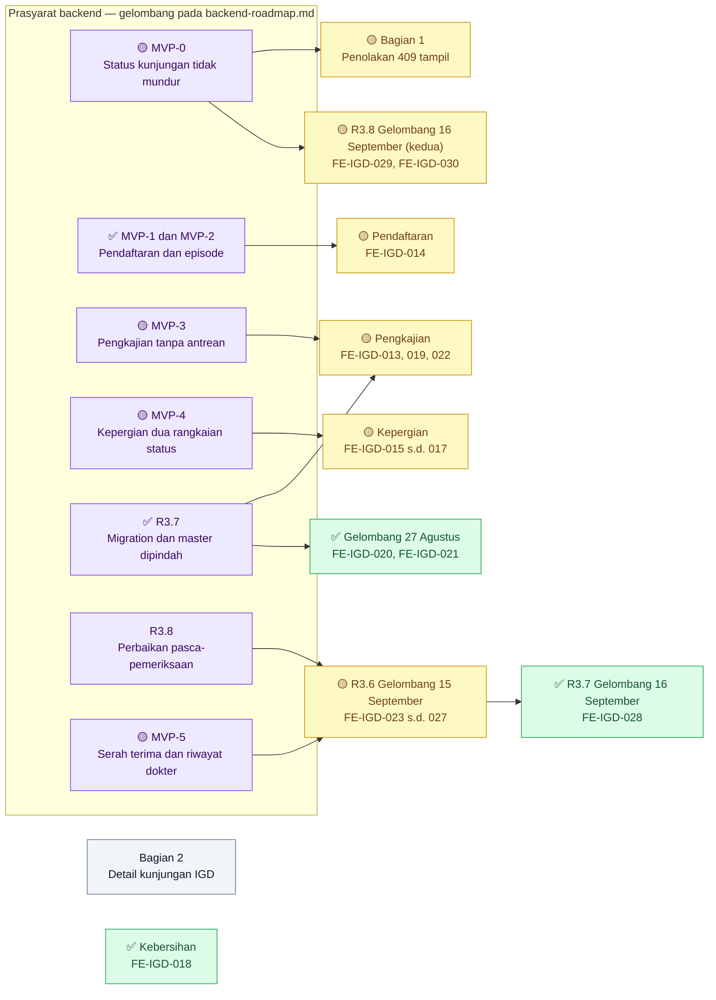
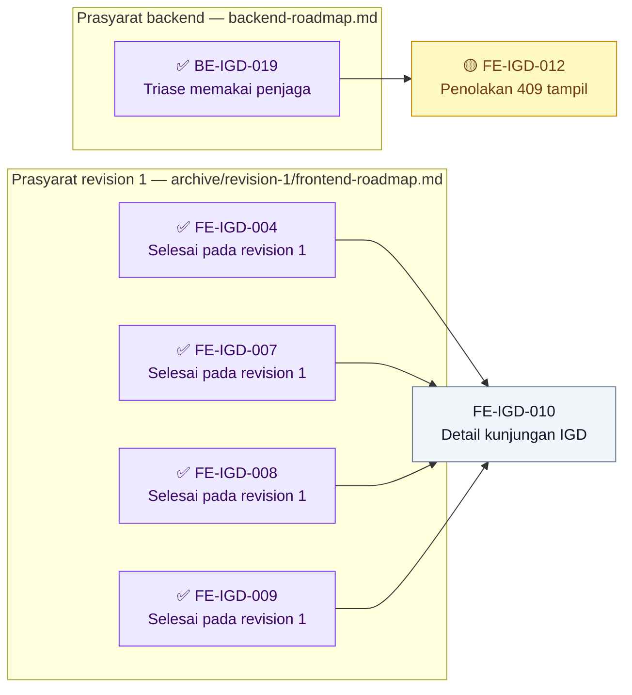
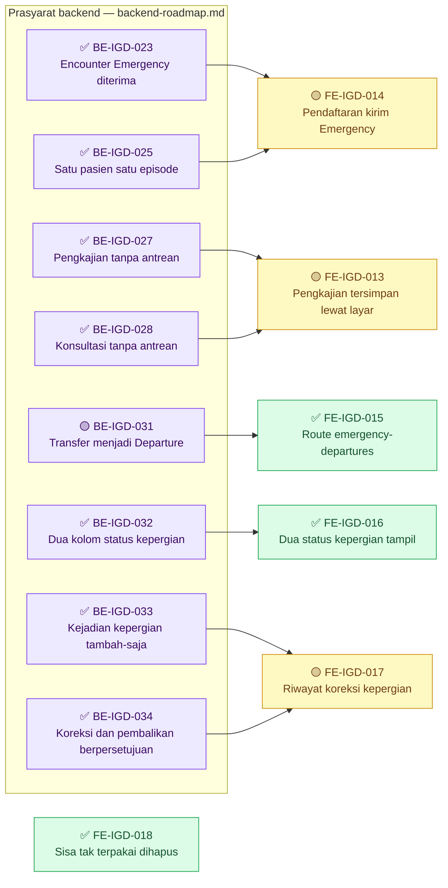
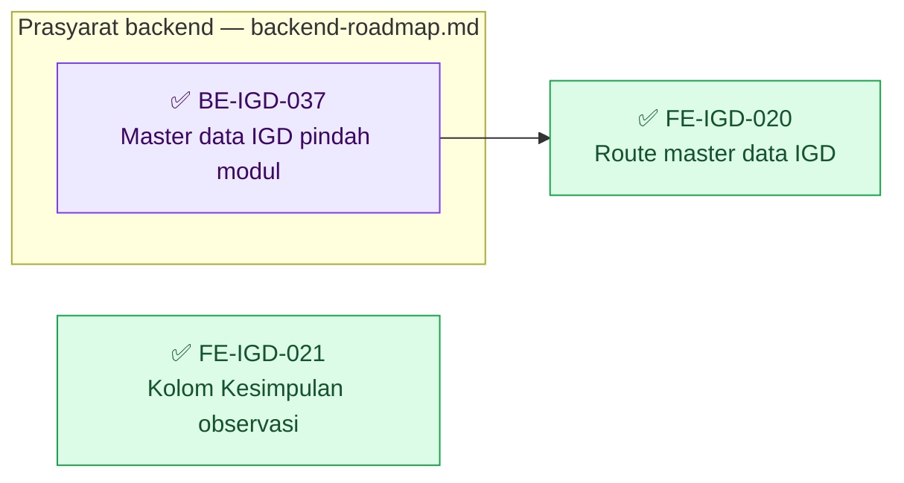
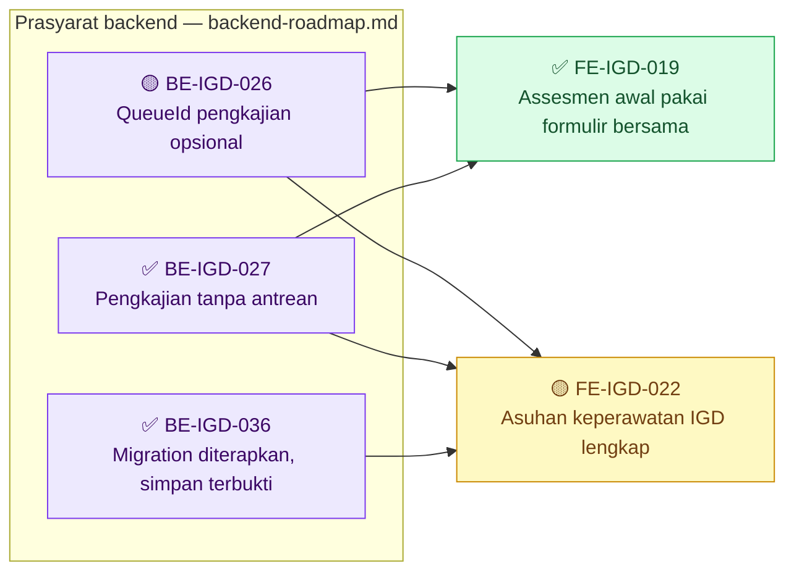
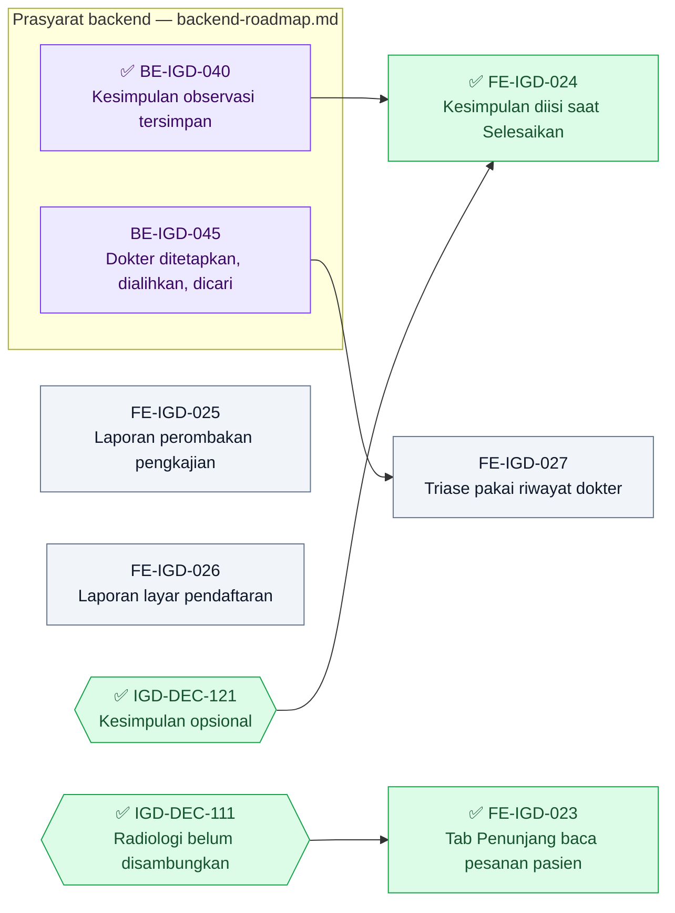
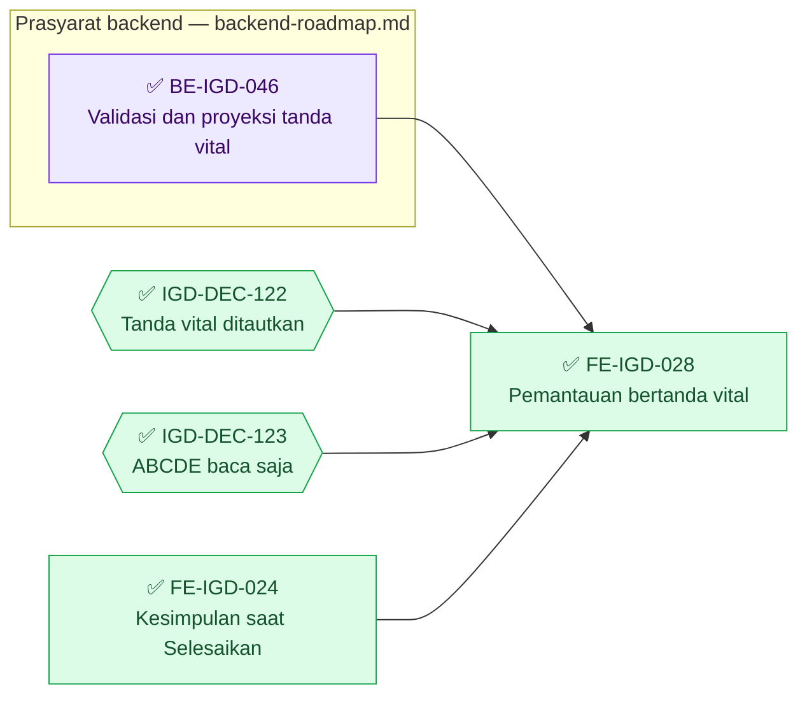
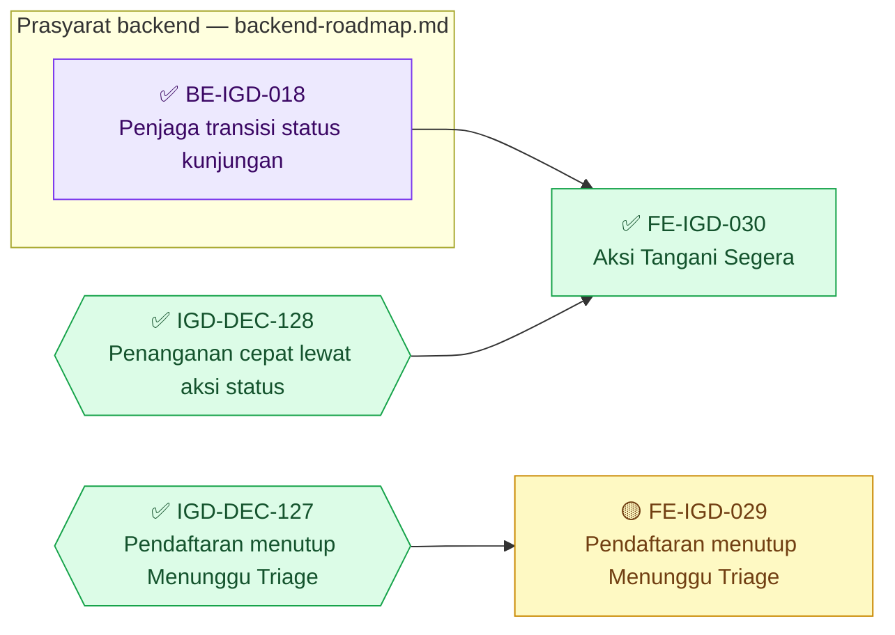

# Roadmap Delivery Frontend — Modul IGD

## Metadata

```yaml
module_id: igd
roadmap_revision: 3
wave: "Dikoreksi 2026-09-15: lima task selesai (FE-IGD-015, 016, 018, 020, 021); lima sebagian (FE-IGD-012, 013, 014, 017, 022); FE-IGD-010 belum dikerjakan. Klaim lama 'MVP-0..MVP-5 selesai' tidak akurat — lihat evidence/2026-09-15-pemeriksaan-status.md bagian 8"
status: ACTIVE
status_synced_at: "2026-09-15 — pemetaan ulang acceptance criteria pada frontend 43adae648; IGD-DEC-110, IGD-DEC-113"
planning_updated_at: "2026-09-16 (kedua) — plan-module-delivery: FE-IGD-029 dan FE-IGD-030 ditambahkan (kunjungan keluar dari Arrived); IGD-DEC-127, IGD-DEC-128; evidence 2026-09-16-kunjungan-terjebak-arrived.md. Nol perubahan kontrak. Revision roadmap tetap 3. Sebelumnya 2026-09-16: FE-IGD-028; 2026-09-15 (kedua): kartu susulan FE-IGD-019, FE-IGD-023 sampai FE-IGD-027, IGD-DEC-111, IGD-DEC-116 sampai IGD-DEC-121"
generated_at: "2026-08-24"
revision_3_at: "2026-08-26"
revision_3_1_at: "2026-08-27"
owners:
  - "Product/Domain Owner IGD — Rizki Gunawan (IGD-DEC-089)"
  - "Frontend authority untuk area DEV_DISCRETION (IGD-UI-004)"
approved_by:
  - "Rizki Gunawan / 2026-08-26 — IGD-DEC-094"
input_revisions:
  blueprint-manifest.md: 5
  03-frontend-architecture.md: 5
  04-prd-to-mvp.md: 5
contract_versions:
  - "State 0.4.0 — bagian 1, 1.1, 1.2 APPROVED (IGD-DEC-093)"
  - "Validation 0.4.0 — bagian 2 aturan 4-5 APPROVED (IGD-DEC-093)"
  - "API 0.4.0 — draft. TIDAK dipakai: gelombang ini nol perubahan endpoint"
artifact_hashes:
  03-frontend-architecture.md: "2b4339f9587ed1daff8444ccb68cb5415df578d76a2157dd3ec168f9a2a1fd95"
  04-prd-to-mvp.md: "7061525001d9a7e6b311424b8e3a8d85de13e35f59e545a78dcefedd600b79db"
  contracts/state-transition-matrix.md: "a41efd8d9adc87e1cf1eec2a9397b3521fdc0ebf935ccf0a19a5aa975b6c7c75"
  contracts/validation-matrix.md: "0ee98b750a29e01603db894ed3766614fe8989b2eef3573eab7d72cdc1a6b907"
source_commits:
  frontend: "96a9120111f6acc6b7c0f37973ea0c717ba41f17"
supersedes: "roadmap/archive/revision-1/frontend-roadmap.md"
```

**Arti tanda status pada dokumen ini.**

| Tanda | Artinya |
| :---: | --- |
| ✅ | Selesai. Acceptance criteria dan DoD **terbukti**, buktinya ada pada laporan task |
| 🟡 | Sebagian. Source-nya sudah ada, tetapi acceptance criteria belum terbukti penuh. **Belum selesai** |
| ⛔ | Terblokir. Prasyaratnya belum terpenuhi, dan task **tidak boleh dimulai** |
| tanpa tanda | Belum dikerjakan |

> **Penandaan 15 September 2026.** Tanda dipasang setelah setiap acceptance criteria dipetakan
> ulang ke source frontend `43adae648`. `IGD-DEC-110` membuat angka test lama sah sebagai bukti
> historis, tetapi **tidak** melepas acceptance criteria yang menuntut tangkapan layar atau uji
> lewat layar. `IGD-DEC-113` menerima laporan gabungan lama. Rincian per task:
> [evidence/2026-09-15-pemeriksaan-status.md](../evidence/2026-09-15-pemeriksaan-status.md)
> bagian 8.2.

## Grafik Urutan Dependency

Roadmap ini memuat 20 task, tetapi bersama prasyarat backend dan revision `1` jumlah node
melewati 25. Grafik dipecah: satu **grafik ringkasan** di bawah ini, lalu grafik per bagian di
bawah judulnya masing-masing — bagian 1 (`MVP-0` dan warisan revision `1`), R3.2 (pendaftaran,
pengkajian, kepergian, kebersihan), R3.4 (gelombang 27 Agustus), R3.5 (`FE-IGD-022`),
R3.7 (pemantauan observasi), dan R3.8 (kunjungan keluar dari `Arrived`).

*Jumlah task dikoreksi 16 September 2026: angka `11` tertinggal sejak revision `3` ditulis dan
tidak pernah ikut diperbarui saat `FE-IGD-019` sampai `FE-IGD-028` ditambahkan.*

Seluruh prasyarat frontend berasal dari **backend**, bukan dari task frontend lain. Karena itu
setiap task frontend berada di gelombang 1, dan kolom "Boleh mulai setelah" menyebut prasyarat
backend beserta tandanya.



| Gelombang | Boleh mulai setelah | Bagian |
| ---: | --- | --- |
| 1 | Prasyarat backend masing-masing | Seluruh bagian — boleh paralel. Bagian 2 menunggu task revision `1` yang seluruhnya sudah selesai; Kebersihan tanpa prasyarat. Pada R3.6, `FE-IGD-023`, `025`, dan `026` tidak menunggu backend; `FE-IGD-024` menunggu `BE-IGD-040` (R3.8 **backend**); `FE-IGD-027` menunggu `BE-IGD-045` (`MVP-5`). Pada R3.8 **frontend**, `FE-IGD-029` dan `FE-IGD-030` boleh mulai sekarang: prasyarat backend-nya `BE-IGD-018` sudah ✅ dan endpoint-nya sudah berjalan |

### Register status task

| Task | Judul | Status | Laporan |
| --- | --- | --- | --- |
| `FE-IGD-010` | Halaman detail satu kunjungan IGD | tanpa tanda — belum dikerjakan | — |
| `FE-IGD-012` | Penolakan `409` triase tampil dengan pesan backend | 🟡 kriteria 1–3 menuntut tangkapan layar | [fe-igd-012-018](../task/report/frontend/fe-igd-012-018-penyelesaian-antarmuka.md) |
| `FE-IGD-013` | Pengkajian tersimpan lewat layar | 🟡 uji simpan-muat ulang lewat layar belum | [fe-igd-012-018](../task/report/frontend/fe-igd-012-018-penyelesaian-antarmuka.md) |
| `FE-IGD-014` | Pendaftaran mengikuti `Emergency` | 🟡 kriteria 2 belum ada di source | [fe-igd-012-018](../task/report/frontend/fe-igd-012-018-penyelesaian-antarmuka.md) |
| `FE-IGD-015` | Route `emergency-departures` | ✅ | [fe-igd-012-018](../task/report/frontend/fe-igd-012-018-penyelesaian-antarmuka.md) |
| `FE-IGD-016` | Dua rangkaian status kepergian | ✅ | [fe-igd-012-018](../task/report/frontend/fe-igd-012-018-penyelesaian-antarmuka.md) |
| `FE-IGD-017` | Entri susulan, koreksi, daftar pantau | 🟡 pelaku tampil sebagai ID | [fe-igd-012-018](../task/report/frontend/fe-igd-012-018-penyelesaian-antarmuka.md) |
| `FE-IGD-018` | Bersih-bersih sisa yang tidak dipakai | ✅ | [fe-igd-012-018](../task/report/frontend/fe-igd-012-018-penyelesaian-antarmuka.md) |
| `FE-IGD-020` | Route master data IGD | ✅ | [fe-igd-020-021](../task/report/frontend/fe-igd-020-021-route-master-igd-dan-kolom-kesimpulan.md) |
| `FE-IGD-021` | Kolom Kesimpulan observasi | ✅ | [fe-igd-020-021](../task/report/frontend/fe-igd-020-021-route-master-igd-dan-kolom-kesimpulan.md) |
| `FE-IGD-022` | Layar asuhan keperawatan IGD | 🟡 uji layar belum; tab lab cacat; teks radiologi usang — *tab lab dan teks radiologi ditangani `FE-IGD-023` ✅ 15 September 2026; uji layar `FE-IGD-022` tetap belum* | [fe-igd-022](../task/report/frontend/fe-igd-022-asuhan-keperawatan-pengkajian-observasi-penunjang.md) |
| `FE-IGD-019` | Assesmen Awal IGD memakai formulir bersama | ✅ — kartu susulan 15 September 2026 | [fe-igd-012-018](../task/report/frontend/fe-igd-012-018-penyelesaian-antarmuka.md) |
| `FE-IGD-023` | Tab Penunjang Medis membaca pesanan milik pasien | ✅ 15 September 2026 — implementasi; runtime belum diverifikasi | [FE-IGD-023](../task/report/frontend/FE-IGD-023.md) |
| `FE-IGD-024` | Isian Kesimpulan saat menyelesaikan observasi | ✅ 15 September 2026 — implementasi; build dan runtime belum diverifikasi | [FE-IGD-024](../task/report/frontend/FE-IGD-024.md) |
| `FE-IGD-025` | Laporan susulan perombakan layar pengkajian dan temuan privasi | tanpa tanda — direncanakan | — |
| `FE-IGD-026` | Laporan susulan layar pendaftaran IGD | tanpa tanda — direncanakan | — |
| `FE-IGD-027` | Layar triase memakai riwayat penugasan dokter | tanpa tanda — direncanakan, menunggu `BE-IGD-045` | — |
| `FE-IGD-028` | Pemantauan observasi dengan tanda vital tertaut | ✅ 16 September 2026 — lint, 857 unit test, dan `npm run build` lulus; **runtime terverifikasi sebagian lewat layar** (jalur pilih-existing dan ABCDE terisi belum dilalui) | [FE-IGD-028](../task/report/frontend/FE-IGD-028.md) |
| `FE-IGD-029` | Pendaftaran IGD menutup dengan status Menunggu Triage | 🟡 16 September 2026 — kriteria 1 terbukti lewat layar (pasien baru langsung "Menunggu Triage"); kriteria 2 menunggu satu klik **Isi Triage** pada pasien baru itu | [FE-IGD-029](../task/report/frontend/FE-IGD-029.md) |
| `FE-IGD-030` | Aksi Tangani Segera pada daftar triage | ✅ 16 September 2026 — kedelapan kriteria terbukti lewat layar; lint, 859 unit test, dan `npm run build` lulus; tanpa UAT | [FE-IGD-030](../task/report/frontend/FE-IGD-030.md) |

`FE-IGD-019` sebelumnya belum punya kartu. Kartunya ditambahkan 15 September 2026 pada bagian
R3.5, tepat sebelum `FE-IGD-022`.

---

## 0. Gelombang ini nyaris tidak menyentuh frontend

`EPIC IGD-03` adalah perbaikan perilaku backend. **Nol endpoint berubah, nol bentuk response
berubah, nol layar baru.** Yang berubah bagi petugas hanyalah: beberapa perbuatan yang dulu
diam-diam berhasil kini ditolak `409` beserta alasannya.

Karena itu gelombang ini hanya punya **satu** task frontend, dan sifatnya verifikasi.

### Yang sudah benar dan tidak perlu diubah

Diperiksa pada `96a91201`:

| Yang diperiksa | Hasil |
| --- | --- |
| `emergency-triage-form-view.jsx` baris 149 | Sudah punya `errorBanner` yang menampilkan `saveError` |
| `emergency-management-triage-slice.jsx` baris 279–281 | Jalur simpan sudah `catch` dan meneruskan `normalizeErrorMessage(error, …)` |

Pesan `409` dari backend karena itu **sudah punya jalan tampil**. Task di bawah membuktikannya
benar-benar tampil, bukan membangunnya dari nol.

---

## 1. Task

Grafik bagian 1 dan warisan revision `1` (bagian 2).



| Gelombang | Boleh mulai setelah | Task |
| ---: | --- | --- |
| 1 | `BE-IGD-019` ✅ | `FE-IGD-012` |
| 1 | `FE-IGD-004`, `007`, `008`, `009` — seluruhnya ✅ pada revision `1` | `FE-IGD-010` — **dapat dikerjakan sekarang** |

### 🟡 `FE-IGD-012` — Penolakan `409` jalur triase tampil dengan pesan backend

| Field | Isi |
| --- | --- |
| **Status** | 🟡 **SEBAGIAN — ditandai 15 September 2026.** Kriteria 4 terpetakan: normalisasi galat membaca `response.data.message` (laporan). Kriteria 1–3 menuntut **tangkapan layar** kedua penolakan dan status kunjungan sesudah penilaian ulang; tangkapan layar itu **belum ada** — laporan mencatat *"Bukti screenshot dan reload terhadap backend nyata belum dibuat"*. `IGD-DEC-110` tidak melepas bukti layar. Validasi historis: `npm run build` berhasil, `npm run lint` 0 error, `npm test` 46 lulus (laporan bagian `FE-IGD-019`). DoD bagian 4 butir 5 (alur simpan lewat layar) **belum terpenuhi**. Bukti: [laporan gabungan](../task/report/frontend/fe-igd-012-018-penyelesaian-antarmuka.md) |
| **Slice** | `IGD-S01` |
| **Scope** | `emergency-triage-form-view.jsx`, `emergency-management-triage-slice.jsx`, dan tab penilaian ulang pada `emergency-assessment-view` |
| **Perubahan** | Diharapkan **nol atau nyaris nol**. Task ini memverifikasi; perubahan hanya ditulis bila verifikasi gagal |
| **Requirement** | `FR-IGD-013`, `FR-IGD-014` — sisi tampilan |
| **Kontrak** | Validation `0.3.0` bagian 2 aturan 4 dan 5 — hash `0ee98b75…` |
| **Dependency** | **`BE-IGD-019` selesai dan berjalan.** Sebelum itu penolakan yang harus ditampilkan belum ada |
| **Acceptance** | 1. Menyelesaikan triase pada kunjungan yang sudah ditutup menampilkan pesan backend apa adanya — *"Kunjungan IGD sudah ditutup, penilaian tidak dapat diselesaikan."* — **bukan** pesan cadangan *"Gagal menyimpan pemeriksaan triage."* 2. Penolakan transisi menampilkan pesan yang menyebut status kunjungan saat ini. 3. Tidak ada layar yang menampilkan status kunjungan sebagai `Triaged` setelah pasien `InTreatment` dinilai ulang. 4. Bila `normalizeErrorMessage` ternyata tidak membaca `response.data.message` untuk `409`, perbaiki **di tempat yang sudah ada**, jangan membuat penangan error tandingan |
| **Test** | `AT-IGD-086` sisi tampilan; `npm run lint` dan `npm test` tetap lulus |
| **Bukti** | Tangkapan layar kedua penolakan; catatan hasil untuk keempat butir acceptance |
| **Risiko** | Rendah |
| **Kewenangan UI** | **Tidak ada layar baru, tidak ada komponen baru, tidak ada CSS baru.** Bila butir 4 menuntut perubahan, ikuti `errorBanner` dan pola gaya yang sudah dipakai layar triase |
| **Owner** | Frontend |

---

## 2. Warisan revision `1` yang belum selesai

Task berikut **bukan** bagian `MVP-0`, tetapi belum dikerjakan dan tidak boleh hilang karena
pergantian revisi roadmap.

| Task | Isi | Keadaan | Catatan |
| --- | --- | --- | --- |
| `FE-IGD-010` | Halaman detail satu kunjungan IGD | **Belum dikerjakan** — diperiksa ulang 15 September 2026: route IGD di frontend hanya `emergency-assessment` dan `emergency-triage`. Seluruh dependency-nya (`FE-IGD-004`, `007`, `008`, `009`) sudah selesai | Rincian penuh ada di `roadmap/archive/revision-1/frontend-roadmap.md` bagian `FE-IGD-010` |

`FE-IGD-010` dapat dikerjakan kapan saja dan **tidak** bergantung pada gelombang ini. Ia juga
tidak terpengaruh `IGD-DEC-091`: penggantian nama `emergency-transfers` menjadi
`emergency-departures` baru berlaku pada `MVP-3`, dan `FE-IGD-010` menampilkan data, bukan
memanggil route perpindahan.

`FE-IGD-001` sampai `FE-IGD-009` dan `FE-IGD-011` sudah selesai pada revision `1`.

---

## 3. Yang menunggu gelombang berikutnya

> **Digantikan revision `3`.** Tabel ini benar saat revision `2` ditulis. Revision `3`
> menomori ulang gelombang — kepergian pasien pindah dari `MVP-3` ke `MVP-4`, dan pengkajian
> IGD naik dari `POST-MVP` ke `MVP-3` atas dasar bukti baru. Yang berlaku adalah bagian R3.
> Tabel ini disimpan sebagai catatan keadaan saat itu.

| Pekerjaan frontend | Menunggu | Sebabnya |
| --- | --- | --- |
| Mengganti `TRANSFER_URL` menjadi `emergency-departures` | `MVP-3` | `IGD-DEC-091`. Satu baris pada `emergency-assessment-slice.jsx:16`; **jangan** diubah sebelum backend-nya berganti |
| Layar dua rangkaian status kepergian | `MVP-3` | `IGD-DEC-090` |
| Layar koreksi dan pembalikan berpersetujuan | `MVP-3` | `IGD-DEC-090` |
| Serah terima SBAR dan sikap pesanan | `MVP-4` | `EPIC IGD-07` |
| Penanda unit tanpa kewenangan | `MVP-5` | `IGD-DEC-092`, dan pengesahan Security/Privacy owner |
| Layar pengkajian IGD tersimpan sungguhan | `POST-MVP` | Pemilik `ClinicalManagement` belum ditunjuk |

---

## 4. Definition of Done gelombang `MVP-0` — sisi frontend

| No | Butir | Bukti yang diterima |
| ---: | --- | --- |
| 1 | `FE-IGD-012` keempat butir acceptance-nya terjawab | Catatan hasil beserta tangkapan layar |
| 2 | `npm run lint` lulus | Keluaran perintah |
| 3 | `npm test` lulus | Keluaran perintah |
| 4 | Nol komponen, layar, atau modul CSS baru | Diff; bila kosong, sebutkan kosong |
| 5 | Alur simpan dijalankan sungguhan lewat layar | **Belum pernah terpenuhi** — butuh kredensial petugas. Bila masih belum ada, catat sebagai belum terbukti, jangan ditandai lulus |

Butir 5 adalah utang lama yang berlaku sejak revision `1` dan **tidak** diselesaikan gelombang
ini. Ia dicatat supaya tidak hilang, bukan supaya dianggap selesai.

---

# Revision 3 — perluasan ke perjalanan pasien penuh

Ditambahkan 26 Agustus 2026. Revision `2` di atas tetap berlaku.

## R3.0 Temuan yang mengubah bentuk pekerjaan frontend

Diperiksa pada `96a91201`.

**Layar pengkajian IGD sudah dibangun.** `emergency-assessment-view` memuat sebelas komponen:
SOAP, tanda vital, observasi, disposisi, transfer, catatan terintegrasi, nosokomial, rekam,
kartu pasien, kartu formulir, dan section. Ditambah `emergency-assessment-list-view` dan
`emergency-assessment-detail-view`.

Artinya pekerjaan frontend untuk pengkajian **bukan membangun layar**, melainkan membuktikan
bahwa layar yang sudah ada benar-benar menyimpan setelah backend dibuka. Utang lama
*"alur simpan lewat layar belum pernah dijalankan sungguhan"* akhirnya dapat dilunasi —
tetapi hanya setelah `BE-IGD-027`.

| Yang diperiksa | Hasil |
| --- | --- |
| `emergency-assessment-view` | **11 komponen tab**, lengkap |
| `emergency-triage` dan `emergency-registration` | Ada, punya halaman `page.jsx` |
| `app/…/emergency-pengkajian/` | **Folder kosong, nol berkas** — rute yang tidak pernah jadi |
| `components/view/…/emergency-installation-management/test/test.txt` | Berkas sisa yang tidak dipakai |

## R3.1 Task

### 🟡 `FE-IGD-013` — Pengkajian IGD benar-benar tersimpan lewat layar

| Field | Isi |
| --- | --- |
| **Status** | 🟡 **SEBAGIAN — ditandai 15 September 2026.** Kriteria 2 dan 3 terpetakan: payload `queueId: null` lewat `patient-assessment-payload.utils.js`, dan layar hanya menampilkan field yang punya rumah pada DTO. Jalur simpan backend-nya terbukti lewat API pada `BE-IGD-036` (`ASM-20260827-00003`). **Kriteria 1 dan 4 belum terbukti:** keduanya menuntut perawat menyimpan **lewat layar** lalu membukanya ulang, dengan tangkapan layar sebelum dan sesudah; itu belum pernah dijalankan. Validasi historis: `npm run build` berhasil, `npm run lint` 0 error, `npm test` 46 lulus. Bukti: [laporan gabungan](../task/report/frontend/fe-igd-012-018-penyelesaian-antarmuka.md) |
| **Slice** | `IGD-S04` · `EPIC IGD-09` |
| **Scope** | `emergency-assessment-view` beserta sebelas tab-nya |
| **Perubahan** | Diharapkan **kecil**. Layarnya sudah ada; yang dikerjakan adalah menyambungkan ke jalur simpan yang baru terbuka, dan memperbaiki hanya bagian yang terbukti gagal |
| **Requirement** | `FR-IGD-060` … `FR-IGD-064` sisi tampilan |
| **Dependency** | **`BE-IGD-027` dan `BE-IGD-028` selesai dan berjalan.** Sebelum itu tidak ada yang dapat dibuktikan |
| **Acceptance** | 1. Perawat mengisi pengkajian pasien IGD, menekan simpan, dan datanya **benar-benar ada** saat layar dibuka ulang. 2. Setiap field yang tampil di layar punya rumah di basis data — pelajaran `review-triage-igd-alur-penyimpanan` yang menemukan 17 dari 20 field hilang diam-diam. 3. Field yang belum punya rumah **ditandai jelas di laporan**, bukan dibiarkan tampil seolah tersimpan. 4. Tanda vital, diagnosis, tindakan, dan CPPT ikut dibuktikan |
| **Bukti** | Tangkapan layar sebelum dan sesudah muat ulang, plus kueri jumlah baris per tabel |
| **Risiko** | **Menengah.** Butuh kredensial petugas — utang yang belum pernah terlunasi sejak revision `1` |
| **Kewenangan UI** | Nol layar baru. Ikuti `emergency-triage.module.css` dan komponen `form-pemeriksaan-ui` yang sudah dipakai |
| **Owner** | Frontend |

### 🟡 `FE-IGD-014` — Pendaftaran IGD mengikuti `EncounterType.Emergency`

| Field | Isi |
| --- | --- |
| **Status** | 🟡 **SEBAGIAN — ditandai 15 September 2026.** Kriteria 1 terpetakan: `encounterType: ENCOUNTER_TYPE.Emergency` (`emergency-registration.utils.js:1118`). Kriteria 3 terpetakan: isian `duplicateEpisodeOverrideReason` ada (`emergency-visit-step.jsx:462`), dan backend menolak pendaftaran ganda tanpa alasan. **Kriteria 2 tidak ada di source:** tidak ada tautan maupun navigasi ke kunjungan yang sudah ada; nomornya hanya muncul di dalam teks galat backend. Laporan task tidak menyebut kriteria ini (`IGD-EV-123`). Layar ini juga disentuh `40f0e6106`/`5bc96f09b` (tim Rawat Inap, 29 Agustus) dan `c8613d88c` (30 Agustus) tanpa laporan. Bukti: [laporan gabungan](../task/report/frontend/fe-igd-012-018-penyelesaian-antarmuka.md) |
| **Slice** | `IGD-S02`, `IGD-S03` · `EPIC IGD-01`, `EPIC IGD-02` |
| **Scope** | `registration-management/emergency-registration` |
| **Perubahan** | Menyesuaikan jenis kunjungan yang dikirim, dan menampilkan penolakan episode ganda beserta **nomor kunjungan yang sudah ada** sebagai jalan pintas yang dapat diklik petugas |
| **Requirement** | `FR-IGD-001` … `FR-IGD-012` sisi tampilan |
| **Dependency** | `BE-IGD-023`, `BE-IGD-025` |
| **Acceptance** | 1. Pendaftaran IGD baru terkirim sebagai `Emergency`. 2. Pendaftaran kedua untuk pasien yang sama menampilkan nomor kunjungan pertama, dan petugas dapat langsung membukanya — bukan sekadar pesan gagal. 3. Jalan keluar beralasan tersedia dan alasannya wajib diisi |
| **Risiko** | Menengah. Ini pintu masuk pasien; salah sedikit, pendaftaran berhenti |
| **Owner** | Frontend |

### ✅ `FE-IGD-015` — Route `emergency-departures`

| Field | Isi |
| --- | --- |
| **Status** | ✅ **SELESAI 26 Agustus 2026; dipetakan ulang 15 September 2026.** Kedua acceptance criteria terpetakan ke source `43adae648`: `DEPARTURE_URL` → `emergency-departures` (`emergency-assessment-slice.jsx:17`); nol rujukan `emergency-transfers`; tab tetap di dalam `emergency-assessment/[slug]` sehingga nol URL halaman berubah. Validasi historis: `npm run build` berhasil, `npm run lint` 0 error, `npm test` 46 lulus. Bukti: [laporan gabungan](../task/report/frontend/fe-igd-012-018-penyelesaian-antarmuka.md) (`IGD-DEC-113`) |
| **Slice** | `IGD-S05` · `EPIC IGD-05` |
| **Scope** | `emergency-assessment-slice.jsx` baris 16 — konstanta `TRANSFER_URL`. **Satu baris** |
| **Perubahan** | `emergency-transfers` menjadi `emergency-departures`, dirilis **bersamaan** dengan `BE-IGD-031`. Tidak ada route usang di backend, sehingga mendahului atau terlambat sama-sama memutus |
| **Keputusan** | `IGD-DEC-091` |
| **Dependency** | `BE-IGD-031` — **rilis serentak, bukan berurutan** |
| **Acceptance** | 1. Tab Transfer tetap bekerja. 2. Nol URL halaman berubah — tab ini ada di dalam `emergency-assessment/[slug]`, jadi nol bookmark petugas rusak |
| **Risiko** | Rendah secara teknis; **koordinasi rilisnya** yang berisiko |
| **Owner** | Frontend, serentak dengan Backend |

### ✅ `FE-IGD-016` — Dua rangkaian status kepergian

| Field | Isi |
| --- | --- |
| **Status** | ✅ **SELESAI 26 Agustus 2026; dipetakan ulang 15 September 2026.** Ketiga acceptance criteria terpetakan ke source `43adae648`: badge keadaan fisik dan keadaan dokumen tampil berdampingan, dan `actionsFor` (`emergency-assessment-transfer-tab.jsx:60–77`) menurunkan aksi dari **kedua** status sehingga kombinasi mustahil tidak ditawarkan. Tab ini dirombak `bd1d94a8a` (31 Agustus); kedua rangkaian tetap utuh. Validasi historis: `npm run build` berhasil, `npm run lint` 0 error. Bukti: [laporan gabungan](../task/report/frontend/fe-igd-012-018-penyelesaian-antarmuka.md) |
| **Slice** | `IGD-S05` · `EPIC IGD-05` |
| **Scope** | `emergency-assessment-transfer-tab.jsx` |
| **Perubahan** | Satu status tunggal menjadi dua yang berdampingan: keadaan fisik pasien dan keadaan serah terima. Keduanya bergerak sendiri-sendiri |
| **Keputusan** | `IGD-DEC-090` |
| **Dependency** | `BE-IGD-032` |
| **Acceptance** | 1. Kedua rangkaian terbaca sekaligus tanpa perlu berpindah tab. 2. Kombinasi yang mustahil tidak dapat dipilih. 3. Petugas dapat membedakan "pasien sudah berangkat" dari "unit tujuan sudah menerima" — dua hal yang selama ini tertukar |
| **Risiko** | Menengah. Dua status berdampingan mudah membingungkan bila penamaannya tidak jelas |
| **Owner** | Frontend |

### 🟡 `FE-IGD-017` — Entri susulan, koreksi, dan daftar pantau

| Field | Isi |
| --- | --- |
| **Status** | 🟡 **SEBAGIAN — ditandai 15 September 2026.** Kriteria 2 dan 3 terpetakan: kejadian yang dikoreksi tetap tampil dengan badge "Tidak berlaku" (`emergency-assessment-transfer-tab.jsx:229`), dan waktu sebenarnya di masa depan ditolak di layar (baris 141 dan 258). **Kriteria 1 sebagian:** riwayat tampil bersama waktu terjadi dan waktu dicatat, tetapi kolom "Pelaku" dan "Penyetuju pembalikan" (baris 234–235) menampilkan **ID pengguna mentah**, bukan nama petugas (`IGD-EV-123`). Bukti: [laporan gabungan](../task/report/frontend/fe-igd-012-018-penyelesaian-antarmuka.md) |
| **Slice** | `IGD-S05` · `EPIC IGD-06` |
| **Scope** | Tab kepergian, ditambah satu daftar pantau |
| **Perubahan** | Mencatat waktu kejadian sebenarnya yang berbeda dari waktu pencatatan; menampilkan riwayat koreksi tanpa menyembunyikan yang lama; pembalikan menampilkan siapa yang menyetujui |
| **Keputusan** | `IGD-DEC-065`, `IGD-DEC-066`, `IGD-DEC-085`, `IGD-DEC-090` |
| **Dependency** | `BE-IGD-033`, `BE-IGD-034` |
| **Acceptance** | 1. Riwayat kejadian terbaca urut beserta pelakunya. 2. Baris yang sudah dikoreksi **tetap terlihat**, ditandai tidak berlaku — tidak dihapus dari layar. 3. Waktu sebenarnya di masa depan ditolak di layar, bukan hanya di backend |
| **Risiko** | Menengah |
| **Owner** | Frontend |

### ✅ `FE-IGD-018` — Bersih-bersih sisa yang tidak dipakai

| Field | Isi |
| --- | --- |
| **Status** | ✅ **SELESAI 26 Agustus 2026; dipetakan ulang 15 September 2026.** Ketiga acceptance criteria terpetakan ke source `43adae648`: folder `emergency-pengkajian` tidak ada; `test/test.txt` sudah dihapus — folder `test/` tersisa kosong dan tidak terlacak git; nol rujukan ke keduanya. Validasi historis: `npm run build` berhasil, `npm run lint` 0 error. Bukti: [laporan gabungan](../task/report/frontend/fe-igd-012-018-penyelesaian-antarmuka.md) |
| **Slice** | Kebersihan. Bukan bagian epic mana pun |
| **Scope** | `app/health-services/emergency-installation-management/emergency-pengkajian/` yang **kosong**, dan `components/view/…/emergency-installation-management/test/test.txt` |
| **Perubahan** | Menghapus keduanya **setelah dipastikan tidak ada yang menunjuk ke sana**. Folder rute kosong pada App Router membingungkan: ia tampak seperti halaman yang ada padahal tidak |
| **Dependency** | Tidak ada |
| **Acceptance** | 1. Penelusuran menunjukkan nol rujukan ke keduanya. 2. `npm run build` dan `npm run lint` tetap lulus. 3. Nol rute yang sebelumnya bekerja menjadi rusak |
| **Risiko** | Rendah. **Periksa dulu, hapus kemudian** |
| **Owner** | Frontend |

## R3.2 Urutan

Pohon teks sebelumnya diganti Mermaid pada 15 September 2026; kedelapan hubungannya muncul
kembali sebagai panah. `BE-IGD-031` → `FE-IGD-015` tetap berarti **rilis serentak**, bukan
berurutan. `FE-IGD-010` ada pada grafik bagian 1.



| Gelombang | Boleh mulai setelah | Task |
| ---: | --- | --- |
| 1 | — | `FE-IGD-018` |
| 1 | `BE-IGD-023` ✅, `BE-IGD-025` ✅ | `FE-IGD-014` |
| 1 | `BE-IGD-027` ✅, `BE-IGD-028` ✅ | `FE-IGD-013` |
| 1 | `BE-IGD-031` 🟡 — rilis serentak | `FE-IGD-015` |
| 1 | `BE-IGD-032` ✅ | `FE-IGD-016` |
| 1 | `BE-IGD-033` ✅, `BE-IGD-034` ✅ | `FE-IGD-017` |

## R3.3 Yang belum dapat direncanakan

Penunjang medis, pemakaian alat, dan billing IGD **belum punya blueprint**, sehingga belum
punya task frontend. Lihat `backend-roadmap.md` bagian R3.5.

Satu hal yang sudah pasti sekarang: layar penunjang medis tidak dapat menampilkan hasil
pemeriksaan, karena `LabOrder` **tidak menyimpan hasil sama sekali** — hanya `EncounterId` dan
`ProcedureId`. Layar apa pun yang dibuat sekarang hanya akan menampilkan daftar pesanan
kosong.

---

## R3.4 Gelombang 27 Agustus 2026

Laporan lengkapnya di
`task/report/frontend/fe-igd-020-021-route-master-igd-dan-kolom-kesimpulan.md`.

| Task | Judul | Status | Laporan |
| --- | --- | --- | --- |
| `FE-IGD-020` | Route master data IGD mengikuti pemindahan modul | ✅ **SELESAI 27 Agustus 2026; dipetakan ulang 15 September 2026.** Seluruh pemanggilan master IGD memakai `…/emergency-installation-management/master-data/…`; nol rujukan route lama. Keenam endpoint dijalankan pada route baru → `200`, route lama → `404`. Validasi: `node --import ./tests/helpers/register.mjs --test tests/unit` 119 lulus, 0 gagal; `npm run lint` 0 error, 570 warning lama | [fe-igd-020-021](../task/report/frontend/fe-igd-020-021-route-master-igd-dan-kolom-kesimpulan.md) |
| `FE-IGD-021` | Kolom "Kesimpulan" pada Riwayat Observasi tidak pernah terisi | ✅ **SELESAI 27 Agustus 2026; dipetakan ulang 15 September 2026.** Layar membaca `completionSummary` (`emergency-assessment-observation-tab.jsx:493`). Catatan: kolom itu baru benar-benar terisi dari layar setelah `IGD-DEC-115` diimplementasikan di backend | [fe-igd-020-021](../task/report/frontend/fe-igd-020-021-route-master-igd-dan-kolom-kesimpulan.md) |

Grafik gelombang 27 Agustus. `FE-IGD-020` mengikuti perubahan route oleh `BE-IGD-037` dan wajib
naik bersamaan; `FE-IGD-021` tidak punya prasyarat.



| Gelombang | Boleh mulai setelah | Task |
| ---: | --- | --- |
| 1 | `BE-IGD-037` ✅ — rilis serentak | `FE-IGD-020` |
| 1 | — | `FE-IGD-021` |

### `FE-IGD-020` — RILIS SERENTAK

`BE-IGD-037` mengubah route master data IGD:

```
sebelum : /v1/health-services/master-data/emergency-installation-management/<res>
sesudah : /v1/health-services/emergency-installation-management/master-data/<res>
```

Lima pemanggilan di empat berkas disesuaikan; nol rujukan route lama tersisa.

> Ini perubahan kontrak, sama seperti `FE-IGD-015`. Frontend baru terhadap backend lama akan
> `404` pada seluruh pilihan master IGD — cara kedatangan dan jenis kasus pada layar
> pendaftaran, level dan indikator triase, jenis tindak lanjut pada layar pengkajian.
> **Keduanya wajib naik bersamaan.**

### `FE-IGD-021` dan pemeriksaan kolom layar

Tab Observasi merujuk `conclusion`, sedangkan `EmergencyObservationResponse` menamainya
`completionSummary`. Kolomnya kosong selamanya tanpa pernah melempar galat.

Ditemukan lewat pemeriksaan menyeluruh yang membandingkan **setiap kolom yang dideklarasikan
layar pengkajian** dengan isi respons daftar sungguhan. Sembilan bagian diperiksa; tiga cacat
ditemukan — satu diperbaiki di frontend, dua di backend (`BE-IGD-038`). Sesudahnya, bagian yang
punya data menunjukkan **nol kolom hilang**.

**Pelajaran:** kolom yang dideklarasikan layar tetapi tidak dikirim endpoint tidak pernah
tampil sebagai galat, hanya kosong. Membaca kode layar saja tidak cukup, membaca DTO saja juga
tidak — keduanya terlihat wajar sendiri-sendiri.

### Peringatan perkakas: `npm test` dapat lulus tanpa menjalankan test

`npm test` memakai `node --test "tests/unit/**/*.test.mjs"`. Node **v20** belum mendukung glob
pada `--test` — dukungan itu masuk pada Node 21 — sehingga perintahnya gagal menemukan berkas,
**nol test berjalan**, tetapi exit code-nya tetap `0`.

Sampai `package.json` atau versi Node-nya diperbaiki, jalankan
`node --import ./tests/helpers/register.mjs --test tests/unit` supaya angkanya benar-benar
berarti. Per 27 Agt: **119 lulus, 0 gagal**.

---

## R3.5 Gelombang 28 Agustus 2026 — layar asuhan keperawatan IGD

Laporan lengkapnya di
`task/report/frontend/fe-igd-022-asuhan-keperawatan-pengkajian-observasi-penunjang.md`.

| Task | Judul | Status | Laporan |
| --- | --- | --- | --- |
| `FE-IGD-022` | Pengkajian lanjutan, pemantauan observasi, dan penunjang medis | 🟡 **SEBAGIAN** — lihat baris Status pada kartu | [fe-igd-022](../task/report/frontend/fe-igd-022-asuhan-keperawatan-pengkajian-observasi-penunjang.md) |

Grafik `FE-IGD-019` dan `FE-IGD-022`.



| Gelombang | Boleh mulai setelah | Task |
| ---: | --- | --- |
| 1 | `BE-IGD-026` 🟡 (kolomnya sudah ada; yang belum hanya uji langkah mundur migration), `BE-IGD-027` ✅ | `FE-IGD-019` |
| 1 | `BE-IGD-026` 🟡 (kolomnya sudah ada; yang belum hanya uji langkah mundur migration), `BE-IGD-027` ✅, `BE-IGD-036` ✅ | `FE-IGD-022` |

### ✅ `FE-IGD-019` — Assesmen Awal IGD berisi pemeriksaan yang sebenarnya

| Field | Isi |
| --- | --- |
| **Status** | ✅ **SELESAI 26 Agustus 2026; kartu susulan dan pemetaan ulang 15 September 2026.** Keenam acceptance criteria terpetakan ke source `43adae648`: `emergency-assessment-initial-tab.jsx` meng-import `VitalSignTab` (baris 13) dan `AssessmentTab` (baris 12) lalu merendernya berurutan (baris 146, 154); `buildPatientAssessmentPayload` dipakai tab IGD dan `use-nurse-station-queue.js`; `queueId` bawaan `null` (`patient-assessment-payload.utils.js:42`); prop `saveError`/`canSubmit`/`disabledHint` diteruskan dengan nama yang benar (baris 140–142, dan `emergency-assessment-transfer-tab.jsx:165–167`); `toNullableText` mengubah isian kosong menjadi `null` (`patient-assessment-payload.utils.js:34`, dipakai baris 53); `tests/unit/patient-assessment-payload.test.mjs` ada. Isi tab tetap utuh setelah perombakan `bd1d94a8a`. Validasi historis: `npm run build` berhasil, `npm run lint` 0 error, `npm test` 46 lulus. Uji simpan lewat layar belum dijalankan — tercatat pada `FE-IGD-013`, bukan acceptance task ini. Bukti: [laporan gabungan](../task/report/frontend/fe-igd-012-018-penyelesaian-antarmuka.md) (`IGD-DEC-113`) |
| **Outcome** | Tab Assesmen Awal IGD memuat tanda vital, pemeriksaan pernapasan dan kesadaran, pengkajian awal, dan tujuh kolom pengkajian nyeri — memakai formulir yang sama dengan skrining perawat rawat jalan |
| **Slice** | `IGD-S04` · `EPIC IGD-09` |
| **Requirement** | `FR-IGD-060` sisi tampilan |
| **Keputusan** | Permintaan owner 26 Agustus 2026 (tercatat pada laporan); `IGD-DEC-107` untuk perubahan pada layar milik Registrasi |
| **Scope** | `emergency-assessment-initial-tab.jsx`; `emergency-assessment-transfer-tab.jsx` (prop kartu); `utils/health-services/clinical-management/patient-assessment-payload.utils.js` (baru, diekstrak dari `use-nurse-station-queue.js`); `tests/unit/patient-assessment-payload.test.mjs` |
| **Dependency** | `BE-IGD-026`, `BE-IGD-027` |
| **Acceptance** | 1. `VitalSignTab` dan `AssessmentTab` dipakai apa adanya, bukan ditiru. 2. Tanda vital beserta oksigen dan kesadaran tampil sebelum pengkajian awal dan pengkajian nyeri. 3. Satu pembentuk payload `POST /patient-assessments` dipakai tab IGD dan skrining perawat. 4. `queueId` dikirim `null`, bukan Guid nol. 5. Tombol simpan mati saat isian belum lengkap, dan galat simpan tampil — prop `canSubmit`/`saveError` benar. 6. Nilai kosong dikirim sebagai `null`, bukan string kosong |
| **Risiko** | Rendah |
| **Owner** | Frontend |

### 🟡 `FE-IGD-022`

| Field | Isi |
| --- | --- |
| **Status** | 🟡 **SEBAGIAN — ditandai 15 September 2026.** Ketiga bagian (delapan kolom pengkajian, pemantauan observasi, tab Penunjang) ada di source `43adae648`; validasi 28 Agustus: `npm run lint:errors` bersih, 119/119 unit test, `npm run build` berhasil. **Yang menahan:** (1) uji lewat layar belum pernah dijalankan (laporan bagian 13, *MANUAL TEST: NOT FEASIBLE*); (2) tab Penunjang kini **cacat** — `fetchLabOrders` memanggil `lab-orders` tanpa `encounterId`, padahal sejak 4 September 2026 backend hanya mengirim 25 pesanan terbaru dari seluruh rumah sakit (`IGD-EV-112`); (3) layar masih menyatakan *"modul Radiologi belum ada"*, bertentangan dengan `IGD-DEC-111` dan `RAD-DEC-009` (`IGD-EV-115`). Layar ini juga dirombak `bd1d94a8a` (31 Agustus) tanpa laporan, termasuk perbaikan privasi `IGD-EV-117`. Bukti: [laporan](../task/report/frontend/fe-igd-022-asuhan-keperawatan-pengkajian-observasi-penunjang.md) |
| **Slice** | `IGD-S04` · `EPIC IGD-09` |
| **Scope** | `emergency-assessment-slice.jsx`, `emergency-assessment-constant.jsx`, `emergency-assessment-initial-tab.jsx`, `emergency-assessment-observation-tab.jsx`, `emergency-assessment-detail-view.jsx`, `use-emergency-assessment-detail.jsx`, `emergency-assessment.module.css`, ditambah satu komponen baru `emergency-assessment-diagnostic-support-tab.jsx` |
| **Perubahan** | Tiga bagian: (a) delapan kolom pengkajian yang dikirim payload tetapi tidak pernah punya isian; (b) pemantauan berkala `EmergencyObservationDetail` beserta aksi status periode; (c) tab Penunjang Medis tersambung ke `laboratory-management/lab-orders` |
| **Kontrak** | **Nol perubahan.** Seluruh endpoint sudah ada sejak `BE-IGD-026`…`035` |
| **Dependency** | `BE-IGD-026`, `BE-IGD-027`, `BE-IGD-036` — seluruhnya selesai |
| **Kewenangan UI** | Nol modul CSS baru, nol komponen bersama diubah. Satu komponen tab baru mengikuti `EmergencyAssessmentFormCard`/`EmergencyAssessmentSection` yang sudah ada; satu aturan CSS `.recordItem[data-active]` |
| **Validasi** | `npm run lint:errors` lulus; 119/119 unit test lulus; `npm run build` lulus |
| **Owner** | Frontend |

### Cacat yang diperbaiki: `OBSERVATION_STATUS_OPTIONS` salah memetakan enum

Daftar status pembukaan periode observasi memetakan `3` sebagai **"Dibatalkan"**. Enum backend
`EmergencyObservationStatus` menempatkan `3` sebagai **`Escalated`** dan `4` sebagai
`Cancelled`.

Akibatnya perawat yang memilih "Dibatalkan" justru membuat periode ber-status `Escalated` —
dan `Escalated` memindahkan status kunjungan ke `InTreatment`. Kebalikan dari yang diniatkan,
dan tanpa satu pun pesan galat.

Diperbaiki dengan mempersempit daftar pembukaan menjadi `Aktif` saja. Ketiga status lain
dicapai lewat aksi pada periode yang sudah ada, mengikuti `CanTransition`.

**Pelajaran, sejalan dengan `FE-IGD-021`:** daftar pilihan berisi angka enum yang ditulis
tangan tidak pernah melempar galat ketika angkanya meleset — ia mengirim perintah yang salah
dengan sukses. Cocokkan setiap daftar semacam itu terhadap enum backend, bukan terhadap label
yang terbaca masuk akal.

### Empat celah backend yang dilaporkan, bukan ditambal

1. `PATCH .../observation-status` **membuang** `notes` untuk `Completed` dan `Cancelled` —
   cabang refleksi mencari properti `Notes` yang tidak dimiliki `EmgObservation`. Akibatnya
   `CompletionSummary` tidak punya jalan tulis dari layar sama sekali.
2. `GET /laboratory-management/lab-orders` **nol parameter** dan mengembalikan seluruh tabel;
   penyaringan per pasien terpaksa di sisi klien.
3. Sikap pesanan serah terima (`order-items`, lima route) **nol pemakai di frontend** —
   padahal `BE-IGD-035` menahan penutupan kunjungan bila ada pesanan tanpa sikap. Kunjungan
   dapat tertahan tanpa jalan keluar lewat antarmuka.
4. `EmergencyResuscitationController` **nol pemakai di frontend**.

Nomor 3 dan 4 adalah pekerjaan frontend berikutnya yang paling bernilai.

> **Diperiksa ulang 15 September 2026** ([evidence](../evidence/2026-09-15-pemeriksaan-status.md)
> `IGD-EV-109`…`112`):
>
> | Celah | Keadaan |
> | --- | --- |
> | 1. Catatan `observation-status` dibuang | **Masih terbuka.** Diputuskan `IGD-DEC-115`: `Completed` → `CompletionSummary`; alasan `Cancelled` jadi `IGD-OQ-083` |
> | 2. `lab-orders` tanpa parameter | **Tertutup di backend** 4 September 2026 (paging + `encounterId`), tetapi **berubah menjadi cacat di layar ini**: `fetchLabOrders` belum mengirim `encounterId`, sehingga pesanan pasien bisa tidak tampil |
> | 3. `order-items` nol pemakai | **Masih terbuka.** Keempat route tulisnya ikut ditolak `403` untuk setiap petugas selama `BE-IGD-039` belum beres — layar tulis sikap pesanan **belum** layak dibangun; tampilan baca lewat `GET` dapat dibangun |
> | 4. Resusitasi nol pemakai | **Masih terbuka.** Tidak terhalang kewenangan unit |
>
> Urutan nilai berubah: yang **pertama** kini perbaikan tab Penunjang (celah 2 + teks radiologi
> `IGD-DEC-111`), bukan sikap pesanan.
>
> Kalimat R3.3 *"`LabOrder` tidak menyimpan hasil sama sekali — hanya `EncounterId` dan
> `ProcedureId`"* juga sudah usang: `LabOrder` kini punya status dan spesimen; yang masih nol
> hanya kolom hasil pemeriksaan.

---

## R3.6 Gelombang 15 September 2026 — perbaikan layar, riwayat dokter, dan laporan susulan

Direncanakan `plan-module-delivery` pada 15 September 2026 dari temuan
[evidence/2026-09-15-pemeriksaan-status.md](../evidence/2026-09-15-pemeriksaan-status.md) dan
keputusan `IGD-DEC-111`, `IGD-DEC-116`…`121`. **Belum ada source yang ditulis.**

DoD baku seluruh kartu di bagian ini, kecuali disebut lain: acceptance criteria terpetakan ke
source; `npm run lint:errors` dan `node --import ./tests/helpers/register.mjs --test tests/unit`
dijalankan dan hasilnya dicatat apa adanya; perintah `npm run build` diberikan kepada Rizki;
catatan uji layar ditulis apa adanya; laporan tracked `task/report/frontend/<TASK-ID>.md`;
roadmap dan traceability diperbarui; nol komponen bersama dan CSS global diubah; tanpa UAT PASS.



| Gelombang | Boleh mulai setelah | Task |
| ---: | --- | --- |
| 1 | `IGD-DEC-111` ✅ | `FE-IGD-023` — **dapat dikerjakan sekarang** |
| 1 | — | `FE-IGD-025`, `FE-IGD-026` — boleh paralel |
| 1 | `BE-IGD-040` (belum dikerjakan), `IGD-DEC-121` ✅ | `FE-IGD-024` — mulai setelah `BE-IGD-040` selesai |
| 1 | `BE-IGD-045` (belum dikerjakan) | `FE-IGD-027` — mulai setelah `BE-IGD-045` selesai |

### ✅ `FE-IGD-023` — Tab Penunjang Medis membaca pesanan milik pasien

| Field | Isi |
| --- | --- |
| **Status** | ✅ **SELESAI (implementasi) 15 September 2026.** Delapan acceptance criteria dipetakan ke source frontend `RizkiV2` (belum di-commit, dasar `43adae648`). `npm run lint:errors` exit 0, nol error; `node --import ./tests/helpers/register.mjs --test tests/unit` **686 test, 686 lulus**; `npm run test:unit` tidak berjalan di Node 20 karena pola glob (`EXISTING / ENVIRONMENT ISSUE`). `npm run build` **tidak dijalankan agent** — perintahnya diserahkan kepada Rizki sesuai DoD. Uji layar dan tangkapan layar: `NOT FEASIBLE` — dev server dan kredensial petugas tidak tersedia bagi agent. **Runtime verified: belum.** Bukan UAT. Nol perubahan backend. Bukti: [laporan](../task/report/frontend/FE-IGD-023.md). *Keadaan sebelumnya: direncanakan 15 September 2026, belum dikerjakan* |
| **Outcome** | Perawat melihat seluruh pesanan laboratorium milik pasien yang sedang dibuka, dan layar menyatakan keadaan radiologi dengan benar |
| **Slice** | `IGD-S05` · `EPIC IGD-07` (keterbatasan penunjang dinyatakan di layar) |
| **Requirement** | `FR-IGD-046` — keterbatasan penunjang dinyatakan di layar |
| **Keputusan** | `IGD-DEC-105` (IGD hanya memesan dan membaca), `IGD-DEC-111`; bukti `IGD-EV-112`, `IGD-EV-115` |
| **Kontrak** | API Laboratorium apa adanya, milik `LaboratoryManagement`: `GET api/v1/health-services/laboratory-management/lab-orders` dengan `LabOrderPagedQuery` (`pageNumber`, `pageSize` bawaan 25, `encounterId`). Nol kontrak IGD berubah |
| **Reuse** | Helper `unwrapPaged` pada `emergency-assessment-slice.jsx`; tab Penunjang yang sudah ada |
| **Scope** | `src/lib/state/slice/health-services/emergency-installation-management/emergency-assessment-slice.jsx` — `fetchLabOrders` baris 531–542 dan komentar baris 628–629; `src/components/view/health-services/emergency-installation-management/emergency-assessment-view/components/emergency-assessment-diagnostic-support-tab.jsx` baris 189 |
| **Dependency** | `IGD-DEC-111` ✅. Dependency eksternal yang **sengaja tidak disambungkan**: pemesanan radiologi ke `POST rad-orders`, ditahan `IGD-DEC-111` butir (d) sampai `ActAsRadiologist` dapat diberikan (pemilik Radiologi) |
| **Acceptance** | 1. Request membawa `encounterId`, `pageNumber`, dan `pageSize`; penyaringan pesanan di browser dihapus. 2. **Tanpa `encounterId`, request tidak dikirim sama sekali.** 3. Pesanan pasien tetap tampil walau banyak pesanan lain dibuat sesudahnya — contoh: dari 40 pesanan sehari, pesanan urutan ke-12 milik pasien tetap tampil. 4. Bila `totalData` lebih besar dari jumlah baris yang dimuat, layar menyebut jumlah seluruhnya dan menyediakan cara memuat sisanya memakai paging backend; bentuknya `DEV_DISCRETION`. 5. Kalimat *"modul Radiologi belum ada"* **tidak muncul lagi** di layar maupun komentar. Penggantinya menyatakan bahwa pemesanan radiologi dari IGD **belum disambungkan**, dan permintaannya dicatat sebagai pesanan luar sistem pada serah terima pasien (`IGD-DEC-111`). 6. **Nol tombol pemesanan radiologi, nol integrasi Radiologi**, dan nol tombol alur di dalam laboratorium. 7. Keterangan *"hasil pemeriksaan belum dapat ditampilkan"* tetap ada selama respons laboratorium belum memuat hasil. 8. Nol perubahan backend |
| **Bukti** | DoD baku bagian ini; tangkapan layar tab Penunjang untuk pasien yang punya pesanan, bila backend dan kredensial tersedia — bila tidak, dinyatakan `NOT FEASIBLE` beserta alasannya |
| **Risiko** | Rendah |
| **Owner** | Frontend |

### ✅ `FE-IGD-024` — Isian Kesimpulan saat menyelesaikan periode observasi

| Field | Isi |
| --- | --- |
| **Status** | ✅ **SELESAI (implementasi) 15 September 2026.** Enam acceptance criteria dipetakan ke source frontend `RizkiV2` (belum di-commit, dasar `f37e949ea`): `emergency-assessment-observation-tab.jsx` dan `emergency-assessment-constant.jsx`. `npm run lint:errors` exit 0, nol error; `node --import ./tests/helpers/register.mjs --test tests/unit` **852 test, 852 lulus**; `npm run test:unit` tidak berjalan di Node 20 karena pola glob (`EXISTING / ENVIRONMENT ISSUE`). **Build = Not Verified** — `npm run build` diserahkan kepada Rizki. Uji peramban: `NOT FEASIBLE` bagi agent. **Runtime verified: belum.** Dependency `BE-IGD-040`: source selesai, build dan runtime belum diverifikasi. Bukan UAT. Bukti: [laporan](../task/report/frontend/FE-IGD-024.md). *Keadaan sebelumnya: direncanakan 15 September 2026, menunggu `BE-IGD-040`* |
| **Outcome** | Perawat dapat menulis kesimpulan saat menyelesaikan observasi, dan kesimpulan itu langsung tampil pada riwayat |
| **Slice** | `IGD-S04` · layar observasi |
| **Requirement** | **Coverage gap:** tidak ada `FR-IGD-*`; dijejak ke keputusan (lihat `BE-IGD-040`) |
| **Keputusan** | `IGD-DEC-115`, `IGD-DEC-119`, `IGD-DEC-121`, `IGD-OQ-083` |
| **Kontrak** | `PATCH .../emergency-observations/{id}/observation-status` dengan `{ observationStatus, notes }` — bentuk tidak berubah; perilaku mengikuti `BE-IGD-040` |
| **Reuse** | Aksi status periode pada `emergency-assessment-observation-tab.jsx`; thunk `updateObservationStatus` yang sudah mengirim `notes`; kolom Kesimpulan riwayat dari `FE-IGD-021` |
| **Scope** | `src/components/view/health-services/emergency-installation-management/emergency-assessment-view/components/emergency-assessment-observation-tab.jsx`; bila perlu, konstanta aksi di `emergency-assessment-constant.jsx` |
| **Dependency** | `BE-IGD-040`; `IGD-DEC-121` ✅ |
| **Acceptance** | 1. Memilih aksi **Selesaikan** menampilkan isian **Kesimpulan**, paling banyak 1000 karakter. 2. Isian **opsional**: kosong pun penyelesaian tetap dapat dikirim. 3. Setelah berhasil, riwayat observasi menampilkan kesimpulan itu tanpa memuat ulang halaman. 4. Aksi **Batalkan** tidak berubah — tanpa isian alasan (`IGD-OQ-083`). 5. Aksi eskalasi tidak ikut diubah. 6. Pesan `400` *"Catatan paling banyak 1000 karakter."* dan `409` dari backend tampil apa adanya. Bentuk isian `DEV_DISCRETION`, mengikuti pola aksi beralasan yang sudah ada di tab ini |
| **Bukti** | DoD baku bagian ini |
| **Risiko** | Rendah |
| **Owner** | Frontend |

### `FE-IGD-025` — Laporan susulan perombakan layar pengkajian (`bd1d94a8a`) dan temuan privasi

| Field | Isi |
| --- | --- |
| **Status** | **Direncanakan 15 September 2026 — belum dikerjakan.** Task laporan; **nol perubahan source** |
| **Outcome** | Perombakan 31 Agustus 2026 punya laporan tracked, dan temuan privasi `IGD-EV-117` tercatat lengkap untuk pemilik `ClinicalManagement` |
| **Slice** | `IGD-S04` · lanjutan `FE-IGD-022` |
| **Requirement** | — (laporan atas perubahan yang sudah di-commit) |
| **Keputusan** | `IGD-DEC-107` (IGD pemegang wewenang sementara `ClinicalManagement`); bukti `IGD-EV-117` |
| **Scope** | Baca-saja: 19 berkas pada `bd1d94a8a`, dan controller daftar `ClinicalManagement` di backend untuk memeriksa perilaku tanpa filter. Tulis: `task/report/frontend/FE-IGD-025.md`, status roadmap, traceability |
| **Dependency** | — |
| **Acceptance** | 1. Laporan merinci perubahan 19 berkas, termasuk alasan tab Tanda Vital IGD terpisah dihapus dan di mana isiannya kini berada. 2. Penjaga lingkup data dijelaskan dengan contoh sebelum/sesudah: sembilan thunk lewat `requiredScope` dan `fetchNosocomialInfections`. 3. Laporan mendaftar endpoint daftar klinis yang menjawab permintaan **tanpa filter** dengan data seluruh pasien, dengan bukti `path + method + baris` dari source backend. 4. Temuan itu diserahkan sebagai rekomendasi kepada pemilik `ClinicalManagement` — **tidak diperbaiki** pada task ini. 5. **Nol perubahan source** di kedua repository |
| **Bukti** | Laporan tracked; `git diff` source kosong |
| **Risiko** | Rendah untuk task-nya; **temuannya berisiko tinggi** (privasi data pasien) |
| **Owner** | Frontend |
| **DoD** | Acceptance 1–5 terpenuhi; laporan tracked ada; roadmap dan traceability diperbarui |

### `FE-IGD-026` — Laporan susulan layar pendaftaran IGD (`c8613d88c`)

| Field | Isi |
| --- | --- |
| **Status** | **Direncanakan 15 September 2026 — belum dikerjakan.** Task laporan; **nol perubahan source** |
| **Outcome** | Perubahan layar pendaftaran IGD yang di-commit tanpa laporan kini tercatat, termasuk validasi layar yang dinonaktifkan |
| **Slice** | `IGD-S02`, `IGD-S03` · `EPIC IGD-01`, `EPIC IGD-02` |
| **Requirement** | `FR-IGD-001`…`012` sisi tampilan (dibaca, tidak diubah) |
| **Keputusan** | `IGD-DEC-084`, `IGD-DEC-107` |
| **Scope** | Baca-saja: `registration-management/emergency-registration/` — `emergency-visit-step.jsx`, `payment-method-step.jsx`, `verification-step.jsx`, dan `emergency-registration.module.css` pada `c8613d88c` (30 Agustus 2026). Juga dicatat `40f0e6106`/`5bc96f09b` (tim Rawat Inap, 29 Agustus 2026) yang menyentuh `emergency-registration-stepper.jsx` dan `patient-entry-choice-step.jsx`. Tulis: `task/report/frontend/FE-IGD-026.md` |
| **Dependency** | — |
| **Acceptance** | 1. Laporan merinci perubahan ketiga commit dan siapa pembuatnya. 2. Setiap validasi layar yang dinonaktifkan dicatat lalu dibandingkan dengan validation §1 — contoh: komentar *"TEMPORARY: required dinonaktifkan"* pada alias sementara pasien, padahal §1 aturan 3 mewajibkan nama sementara. 3. Laporan menyatakan apakah backend tetap menegakkan aturan yang dinonaktifkan di layar, dengan bukti baris source. 4. **Nol perubahan source** |
| **Bukti** | Laporan tracked; `git diff` source kosong |
| **Risiko** | Rendah |
| **Owner** | Frontend |
| **DoD** | Acceptance 1–4 terpenuhi; laporan tracked ada; roadmap dan traceability diperbarui |

### `FE-IGD-027` — Layar triase memakai riwayat penugasan dokter

| Field | Isi |
| --- | --- |
| **Status** | **Direncanakan 15 September 2026 — belum dikerjakan.** Mulai setelah `BE-IGD-045` selesai |
| **Outcome** | Penetapan dan pengalihan dokter IGD dilakukan lewat `Emergency Doctor Assignment`, dan petugas melihat riwayat dokter penanggung jawab, bukan hanya dokter sekarang |
| **Slice** | `IGD-S06` · `EPIC IGD-04` |
| **Requirement** | `FR-IGD-016`…`021` sisi tampilan |
| **Keputusan** | `IGD-DEC-082`, `IGD-DEC-116`, `IGD-DEC-117`; `03-frontend-architecture.md` bagian 4 |
| **Kontrak** | API §3 `Emergency Doctor Assignment` (`IGD-DEC-116`) dengan query `at` (`IGD-DEC-117`) — dipakai persis seperti yang dibangun `BE-IGD-045` |
| **Reuse** | Layar triase IGD yang ada; mengganti pemanggilan `PATCH /patient-encounters/{id}/doctor` pada `emergency-management-triage-slice.jsx` baris 530 |
| **Scope** | `src/lib/state/slice/health-services/emergency-installation-management/emergency-management-triage-slice.jsx`; komponen layar triase yang menampilkan dokter pada `emergency-management-triage-view/` |
| **Dependency** | `BE-IGD-045` |
| **Acceptance** | 1. Layar IGD **tidak lagi bergantung** pada endpoint Registrasi `PATCH /patient-encounters/{id}/doctor` untuk penetapan dokter IGD. 2. Penetapan dokter pertama memakai `POST /`. 3. Pengalihan memakai `POST /{id}/handover` dengan alasan **wajib** diisi di layar. 4. Riwayat tampil berurutan waktu: dokter, sejak kapan, sampai kapan, alasan pengalihan; baris aktif dibedakan — bentuknya `DEV_DISCRETION`. 5. Penolakan `409` tampil beserta arahan memakai aksi pengalihan. 6. Dokter dan penugas tampil sebagai **nama**, bukan ID pengguna — pelajaran `IGD-EV-123` |
| **Bukti** | DoD baku bagian ini |
| **Risiko** | Menengah — layar triase dipakai setiap hari |
| **Owner** | Frontend |

### Gap yang dicatat tanpa ID task

Atas instruksi Product/Domain Owner 15 September 2026, dua gap berikut **tidak** diberi ID task
dan **tidak** memakai `FE-IGD-024` maupun `FE-IGD-025`:

| Gap | Bukti | Catatan |
| --- | --- | --- |
| Layar resusitasi IGD | `IGD-EV-111` | `EmergencyResuscitationController` nol pemakai; tidak terhalang kewenangan unit |
| Layar baca/aksi pesanan kepergian (`order-items`) | `IGD-EV-109` | Aksi tulis terhalang `BE-IGD-039`; tampilan baca tidak |

---

## R3.7 Gelombang 16 September 2026 — pemantauan observasi bertanda vital

Lahir dari audit Observasi V1 lawan V2
([evidence](../evidence/2026-09-15-audit-observasi-v1-v2.md)) dan keputusan `IGD-DEC-122`
sampai `IGD-DEC-126`. Kontrak yang mengikat: API `0.6.0` bagian 7 dan validation `0.6.0`
bagian 9; skema layar ada di `03-frontend-architecture.md` bagian 12. **Source sudah ditulis
16 September 2026** dan build-nya bersih; uji lewat layar belum dijalankan.

DoD baku gelombang ini: acceptance criteria terpetakan ke source; `npm run lint:errors` dan
`node --import ./tests/helpers/register.mjs --test tests/unit` dijalankan dan hasilnya dicatat
apa adanya; perintah `npm run build` diberikan kepada Rizki; catatan uji layar ditulis apa
adanya; laporan tracked `task/report/frontend/<TASK-ID>.md`; roadmap dan traceability
diperbarui; nol komponen bersama dan CSS global diubah; tanpa UAT PASS.



| Gelombang | Boleh mulai setelah | Task |
| ---: | --- | --- |
| 1 | `BE-IGD-046` dinyatakan siap dipakai layar | `FE-IGD-028` ✅ |

Panah dari `FE-IGD-024` berarti urutan sentuhan berkas, bukan ketergantungan data: keduanya
menyentuh `emergency-assessment-observation-tab.jsx`, dan `FE-IGD-028` dibangun di atas layar
hasil `FE-IGD-024` tanpa mengubah alur penyelesaian periode.

### ✅ `FE-IGD-028` — Pemantauan observasi dengan tanda vital tertaut

| Field | Isi |
| --- | --- |
| **Status** | ✅ **SELESAI (implementasi) 16 September 2026.** Seluruh 13 acceptance criteria dipetakan ke source: tab Observasi (+689/−109; +595/−15 bila indentasi diabaikan), `emergency-assessment-slice.jsx` (+28), `emergency-assessment-constant.jsx` (+44), hook detail (+5/−1), view detail (+2), util `patient-vital-sign-payload.utils.js` baru, dan satu berkas test unit baru. Nol komponen bersama, nol CSS, nol endpoint baru. `npm run lint:errors` **PASS**; `node --import ./tests/helpers/register.mjs --test tests/unit` **857/857 lulus** (852 lama + 5 baru); `npm run test:unit` tetap gagal karena glob skrip — masalah lama yang sama seperti `FE-IGD-023`/`FE-IGD-024`. **Build = Verified** — `npm run build` dijalankan Rizki 16 September 2026, berhasil tanpa error beserta tahap `postbuild`. Uji lewat layar: `NOT FEASIBLE` bagi agent. **Runtime verified: belum.** Bukan UAT. Delta tercatat pada kriteria 8: ringkasan ABCDE ternyata belum pernah dimuat workspace, sehingga satu thunk daftar triase ditambahkan memakai endpoint yang sudah ada — atas keputusan pemilik 16 September 2026. Bukti: [laporan](../task/report/frontend/FE-IGD-028.md). *Keadaan sebelumnya: direncanakan 16 September 2026, belum dikerjakan* |
| **Outcome** | Perawat mencatat satu putaran pemantauan beserta tanda vitalnya dari satu layar, dan riwayat pemantauan menampilkan angka tanda vital, GCS, kesadaran, oksigen, serta nama pencatatnya |
| **Slice** | `IGD-S04` · `EPIC IGD-09` (pemantauan observasi) |
| **Requirement** | **Coverage gap:** tidak ada `FR-IGD-*`; dijejak ke keputusan (lihat `BE-IGD-046`) |
| **Keputusan** | `IGD-DEC-122`, `IGD-DEC-123`, `IGD-DEC-124`, `IGD-DEC-125`, `IGD-DEC-126`; `IGD-DEC-056` |
| **Kontrak** | API `0.6.0` bagian 7 (termasuk 7.3 endpoint tanda vital milik `ClinicalManagement`) dan validation `0.6.0` bagian 9. Skema layar: `03-frontend-architecture.md` bagian 12 |
| **Reuse** | Tab Observasi yang sudah ada; formulir tanda vital bersama yang sudah dipakai tab Assesmen Awal; `EmergencyAssessmentFormCard`, `EmergencyAssessmentSection`, `ConfirmModal`, `InformationAlert`; thunk daftar dan simpan yang sudah ada pada `emergency-assessment-slice.jsx` |
| **Scope** | `src/components/view/health-services/emergency-installation-management/emergency-assessment-view/components/emergency-assessment-observation-tab.jsx`; `src/lib/state/slice/health-services/emergency-installation-management/emergency-assessment-slice.jsx`; bila perlu `emergency-assessment-constant.jsx`. **Nol komponen bersama diubah, nol CSS global** |
| **Dependency** | `BE-IGD-046`; `IGD-DEC-122` ✅. Tidak menunggu `BE-IGD-045` |
| **Acceptance** | 1. Bagian **Tanda Vital** tersedia di dalam *Catat Pemantauan*. 2. Petugas dapat mencatat tanda vital baru memakai kemampuan formulir tanda vital yang sudah ada, tanpa berpindah tab. 3. Petugas dapat memilih tanda vital yang sudah tercatat, dan daftarnya **hanya** memuat tanda vital pasien dan encounter kunjungan itu — penyaring dikirim ke backend, bukan disaring di browser. 4. Yang dikirim ke `emergency-observation-details` hanya `patientVitalSignId`; **nol** angka tanda vital ikut dikirim. 5. Riwayat pemantauan menampilkan angka tanda vital dari proyeksi backend, bukan dari isian formulir. 6. Riwayat menampilkan GCS E/V/M beserta total, kesadaran, dan oksigen **bila** backend mengirimnya; layar tidak menghitung total sendiri. 7. Riwayat menampilkan nama pencatat dari `recordedByName`; kosong ditampilkan sebagai tanda hubung, **bukan** GUID. 8. Ringkasan ABCDE penilaian triase terakhir tampil sebagai konteks **baca saja**, memakai data yang sudah dimuat workspace — tanpa endpoint baru. 9. Periode `Completed` dan `Cancelled` tidak menyediakan jalan masuk pencatatan pemantauan normal; bila backend tetap menolak `409`, pesannya tampil apa adanya. 10. Isian Kesimpulan dan alur Selesaikan milik `FE-IGD-024` **tetap bekerja**. 11. **Nol** isian obat, gambaran EKG, atau DC Shock ditambahkan. 12. Layar Resusitasi **tidak** disentuh. 13. Nilai kosong tampil sebagai tanda hubung; kosong berarti tidak diukur, bukan nol |
| **Bukti** | DoD baku bagian ini; tangkapan layar tab Observasi sesudah satu putaran pemantauan bertanda vital, bila backend dan kredensial tersedia — bila tidak, dinyatakan `NOT FEASIBLE` beserta alasannya |
| **Risiko** | **Menengah.** Dua permintaan berurutan (tanda vital lalu pemantauan) tidak atomik: bila permintaan kedua gagal, baris tanda vital tetap tersimpan sebagai pengukuran sah dan layar wajib menjelaskannya, bukan menghapusnya |
| **Owner** | Frontend |

---

## R3.8 Gelombang 16 September 2026 (kedua) — kunjungan keluar dari `Arrived`

Lahir dari temuan pemakaian layar oleh Product/Domain Owner
([evidence](../evidence/2026-09-16-kunjungan-terjebak-arrived.md), `IGD-EV-131`…`IGD-EV-136`)
dan keputusan `IGD-DEC-127` serta `IGD-DEC-128`.

**Gelombang ini memperbaiki modul yang tidak dapat dipakai, bukan menambah kemampuan.**
Kunjungan IGD lahir `Arrived`, dan ketiga jalan keluar yang sah menurut kontrak state bagian 1
sama-sama tidak punya pemanggil di layar. Akibatnya perawat **tidak pernah** dapat menyimpan
pemeriksaan triage: setiap penyimpanan dijawab `409` *"Status kunjungan tidak dapat berubah dari
Arrived ke Triaged."* Seluruh jalur sesudah triage — pengkajian, observasi, disposisi, kepergian
— ikut tidak terjangkau untuk pasien baru.

**Kontrak: nol perubahan.** Kedua transisi yang dipakai gelombang ini sudah sah dan sudah
`approved` sejak `IGD-DEC-093`. Tidak ada endpoint baru, tidak ada kenaikan versi kontrak, dan
`CanTransition` **tidak** boleh disentuh.

DoD baku gelombang ini: acceptance criteria terpetakan ke source; `npm run lint:errors` dan
`node --import ./tests/helpers/register.mjs --test tests/unit` dijalankan dan hasilnya dicatat
apa adanya; perintah `npm run build` diberikan kepada Rizki; catatan uji layar ditulis apa
adanya; laporan tracked `task/report/frontend/<TASK-ID>.md`; roadmap dan traceability
diperbarui; nol komponen bersama dan CSS global diubah; tanpa UAT PASS.



| Gelombang | Boleh mulai setelah | Task |
| ---: | --- | --- |
| 1 | Prasyaratnya sudah selesai seluruhnya — boleh mulai sekarang, dan keduanya boleh paralel | `FE-IGD-029` 🟡, `FE-IGD-030` ✅ |

Kedua task **tidak** saling bergantung: `FE-IGD-029` membuka jalur normal, `FE-IGD-030` membuka
jalur cepat. Mengerjakan salah satunya saja sudah memberi nilai, tetapi hanya keduanya bersama
yang menutup seluruh lubang pada `IGD-EV-133` dan `IGD-EV-134`.

### 🟡 `FE-IGD-029` — Pendaftaran IGD menutup dengan status Menunggu Triage

| Field | Isi |
| --- | --- |
| **Status** | 🟡 **SEBAGIAN — 16 September 2026.** Implementasi selesai dan build bersih: default `visitStatus` payload pendaftaran kini `WaitingForTriage`, ditambah dua test unit yang mengunci perilakunya. Kriteria 1, 3, 4, 5, dan 6 **terpenuhi** — kriteria 1 **terbukti lewat layar 16 September 2026**: pasien yang baru didaftarkan langsung berstatus "Menunggu Triage". Kriteria 2 **belum terbukti**: pada uji itu pasien barunya ditekan **Tangani Segera**, bukan **Isi Triage**, sehingga transisi `WaitingForTriage` → `Triaged` belum dilalui lewat layar. Validasi: `npm run lint:errors` **PASS**; `node --import ./tests/helpers/register.mjs --test tests/unit` **859/859 lulus** (857 lama + 2 baru); `npm run build` **berhasil**. Uji lewat layar: `NOT FEASIBLE` bagi agent. Bukti: [laporan](../task/report/frontend/FE-IGD-029.md). *Keadaan sebelumnya: direncanakan 16 September 2026, belum dikerjakan* |
| **Outcome** | Pasien yang baru didaftarkan di IGD langsung berada pada antrean triage, sehingga perawat dapat menyimpan pemeriksaan triage tanpa ditolak `409` |
| **Slice** | `IGD-S01` · `EPIC IGD-01` (pendaftaran dan triage) |
| **Requirement** | `FR-IGD-013`, `FR-IGD-015` — sisi tampilan |
| **Keputusan** | `IGD-DEC-127`; `IGD-DEC-093` (kontrak state bagian 1 `approved`) |
| **Kontrak** | State `0.4.0` bagian 1 — **nol perubahan**. Transisi `WaitingForTriage` → `Triaged` sudah sah. Nol endpoint baru; payload `POST /emergency-visits` yang sudah ada hanya berganti nilai |
| **Reuse** | Konstanta `EMERGENCY_VISIT_STATUS` beserta label dan warna badge-nya yang sudah lengkap di `emergency-registration.constants.js` baris 260-300 |
| **Scope** | `src/utils/health-services/registration-management/emergency-management/emergency-registration.utils.js` baris 1174-1177. **Nol layar, nol komponen, nol CSS** |
| **Dependency** | `IGD-DEC-127` ✅. Tidak menunggu backend — tidak ada perubahan backend sama sekali |
| **Acceptance** | 1. Pendaftaran IGD yang tuntas menyimpan kunjungan dengan `visitStatus = 2` (`WaitingForTriage`); daftar triage menampilkannya sebagai **"Menunggu triage"**, bukan "Pasien tiba". 2. Menyimpan pemeriksaan triage pada pasien yang baru didaftarkan **berhasil**, dan status kunjungan berpindah ke `Triaged`. 3. Nilai `registrationStatus` dan `registrationCompletedAt` **tidak** berubah perilakunya. 4. Bila pemanggil menyertakan `context.visitStatus` secara eksplisit, nilai itu **tetap** dihormati — yang berubah hanya nilai default. 5. Pasien lama yang terlanjur `Arrived` **tidak** ikut berpindah sendiri; perbaikannya lewat `FE-IGD-030` atau tindakan data terpisah, dan itu dinyatakan apa adanya. 6. Nol perubahan pada backend, `CanTransition`, maupun berkas kontrak |
| **Bukti** | DoD baku bagian ini; tangkapan layar daftar triage sesudah satu pendaftaran baru, memperlihatkan badge "Menunggu triage"; tangkapan layar penyimpanan triage yang berhasil. Bila kredensial atau backend tidak tersedia, dinyatakan `NOT FEASIBLE` beserta alasannya |
| **Risiko** | **Rendah pada kode, menengah pada arti data.** Satu nilai berubah, tetapi `Arrived` praktis berhenti dihasilkan lewat layar pendaftaran — konsekuensi yang sudah diterima `IGD-DEC-127` dan dicatat sebagai `IGD-OQ-091` |
| **Owner** | Frontend |

### ✅ `FE-IGD-030` — Aksi Tangani Segera pada daftar triage

| Field | Isi |
| --- | --- |
| **Status** | ✅ **SELESAI 16 September 2026 — kedelapan acceptance criteria terpenuhi dan terbukti lewat layar.** Implementasi pada lima berkas: thunk `startEmergencyImmediateCare` beserta cabang state `immediateCare` pada slice triage, aksi pada hook daftar, dialog konfirmasi `ConfirmModal` dengan isian alasan opsional, tombol **Tangani Segera** pada kolom AKSI, dan satu kelas penataan letak `.tableActionCell`. Nol layar baru, nol komponen bersama diubah, nol CSS global. **Uji lewat layar oleh pemilik, ketiganya lulus:** (1) BAGUS SETIAWAN berpindah "Pasien tiba" → "Sedang ditangani", grant izin `EmergencyVisit` + `Update` terbukti ada; (2) pengalihan ke layar Assesmen IGD bekerja pada NABILA PUTRI MAHARANI; (3) triage susulan pada pasien `InTreatment` tersimpan dan status **tidak mundur** — `IGD-DEC-104` huruf (b) terbukti ujung ke ujung. Dua penyempurnaan atas keputusan pemilik pada hari yang sama: spanduk berhasil menyebut nama pasien, dan perawat dialihkan langsung ke Assesmen IGD memakai route token yang sama dengan daftar pengkajian — delta kriteria 3 (perubahan badge tidak lagi diamati perawat) dicatat di laporan. Validasi: `npm run lint:errors` **PASS**; `node --import ./tests/helpers/register.mjs --test tests/unit` **859/859 lulus**; `npm run build` **berhasil**; grep anti-regresi warna, tipografi, dan kelas bootstrap **nihil**. **Bukan UAT** — UAT milik tim terpisah dan belum dijalankan. Satu pilihan tampilan masih terbuka: kedua tombol pada kolom AKSI tampil identik; lihat laporan bagian 8. Bukti: [laporan](../task/report/frontend/FE-IGD-030.md). *Keadaan sebelumnya: 🟡 sebagian, uji layar belum dijalankan* |
| **Outcome** | Perawat dapat mendahulukan pasien gawat dengan satu tombol: kunjungan berpindah ke `InTreatment`, tim langsung bekerja, dan pengkajian triage-nya disusulkan tanpa memundurkan status |
| **Slice** | `IGD-S01` · `EPIC IGD-01` (pendaftaran dan triage) |
| **Requirement** | **Coverage gap:** tidak ada `FR-IGD-*` yang menuliskan jalur penanganan cepat; dijejak ke `IGD-DEC-128` |
| **Keputusan** | `IGD-DEC-128`; `IGD-DEC-104` huruf (b); `IGD-DEC-093` |
| **Kontrak** | State `0.4.0` bagian 1 — **nol perubahan**. Endpoint `PATCH /emergency-visits/{id}/visit-status` sudah ada sejak sebelum gelombang ini; bentuknya ada pada [evidence](../evidence/2026-09-16-kunjungan-terjebak-arrived.md) bagian G |
| **Reuse** | Kolom AKSI dan `styles.primaryMiniButton` yang sudah dipakai tombol "Isi Triage"; `ConfirmModal` dan pola toast/`errorBanner` yang sudah dipakai layar triage; thunk dan service triage yang sudah ada |
| **Scope** | `emergency-triage-patient-table.jsx` (kolom AKSI), `emergency-triage-patient-list-view.jsx`, service dan slice triage yang sudah ada. **Nol layar baru, nol komponen bersama diubah, nol CSS global** |
| **Dependency** | `BE-IGD-018` ✅ (penjaga transisi); `IGD-DEC-128` ✅ |
| **Acceptance** | 1. Baris pasien berstatus `Arrived` atau `WaitingForTriage` menampilkan aksi **Tangani Segera** di samping "Isi Triage"; status lain **tidak** menampilkannya. 2. Aksi itu meminta konfirmasi lebih dulu memakai pola konfirmasi yang sudah ada, bukan langsung mengirim. 3. Berhasil → kunjungan menjadi `InTreatment`, badge daftar berubah menjadi "Sedang ditangani" tanpa muat ulang halaman penuh. 4. Alasan singkat boleh diisi dan dikirim sebagai `notes`; dikosongkan tetap sah. 5. Penolakan backend tampil **apa adanya** dari `response.data.message` — termasuk `400` untuk transisi ilegal dan `403` bila izin `EmergencyVisit` + `Update` belum diberikan; **jangan** membuat penangan galat tandingan, dan **jangan** berasumsi transisi ilegal selalu `409` (`IGD-EV-136`). 6. Sesudah pasien `InTreatment`, tombol "Isi Triage" **tetap** bekerja, penilaian tersimpan, dan status **tetap** `InTreatment` — `IGD-DEC-104` huruf (b). 7. `TreatmentStartedAt` **tidak** dikirim dari layar; backend yang mengisinya. 8. Layar Resusitasi **tidak** dibangun dan **tidak** disentuh |
| **Bukti** | DoD baku bagian ini; tangkapan layar sebelum dan sesudah aksi pada satu pasien, ditambah tangkapan layar penyimpanan triage susulan yang berhasil dengan status tetap `InTreatment`. Bila kredensial atau izin tidak tersedia, dinyatakan `NOT FEASIBLE` beserta alasannya |
| **Risiko** | **Menengah.** Aksi ini memindahkan pasien ke penanganan tanpa triage — sah dan disengaja, tetapi tidak dapat dibatalkan lewat layar: kontrak tidak menyediakan jalan kembali dari `InTreatment` ke `WaitingForTriage`. Konfirmasi pada butir 2 ada khusus untuk itu. Risiko kedua: izin `EmergencyVisit` + `Update` belum terverifikasi pada peran perawat triage |
| **Owner** | Frontend |
