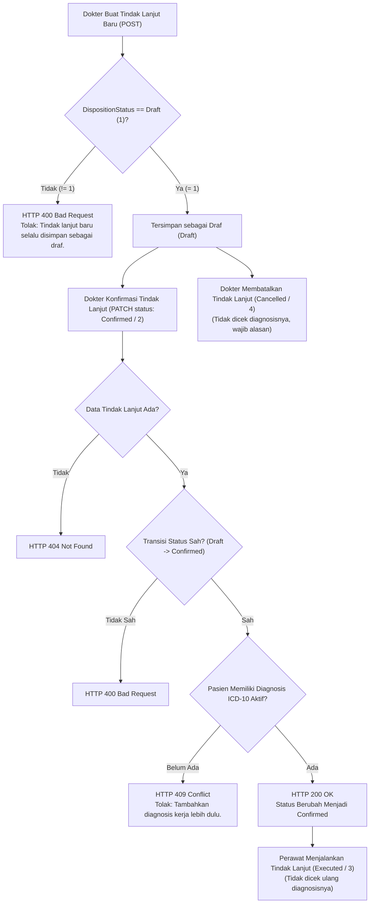

# Laporan Perubahan Backend — `BE-IGD-070`

## Metadata

| Field | Nilai |
| --- | --- |
| Task ID | `BE-IGD-070` |
| Judul | Tindak lanjut selalu lahir Draft, dan konfirmasinya dijaga diagnosis |
| Slice | `EPIC IGD-14` / `MVP-9` — tindak lanjut dokter & perawat |
| Roadmap | [`roadmap/backend-roadmap.md`](../../../roadmap/backend-roadmap.md) bagian R3.16 |
| Requirement | `FR-IGD-103`, `FR-IGD-104`; `AT-IGD-211`, `212`; DoD PRD §10.4 butir 2, 3 |
| Keputusan | `IGD-DEC-223`, `IGD-DEC-226`; `IGD-DEC-230` pilihan desain 2, 3, 4 |
| Contract version | API **`0.15.0`** §10.1 nomor 3–4, §10.3; validation **`0.14.0`** §12.5 aturan 14–15; state **`0.10.0`** §10.1 |
| Dependency | — |
| Klasifikasi | `LIGHT` — berkas diubah 2, nol migration, nol `Program.cs` |
| Task mode | `BACKEND` — instruksi eksplisit pemilik (*"yaa saya setujui"*) |
| Target tulis | `NewQuilvianSystemBackend` (branch `rizkiG`): `Areas/HealthServices/EmergencyInstallationManagement/Services/EmergencyDispositionService.cs`, `Areas/HealthServices/EmergencyInstallationManagement/Controllers/EmergencyDispositionController.cs`; laporan ini |
| Tanggal | 9 Oktober 2026 |
| Status | 🟡 **SEBAGIAN — 9 Oktober 2026: implementasi selesai, diff bersih 2 berkas, nol komentar baru, build pemilik sukses (0 error, 235 warning), siap uji API & integrasi layar bersama FE-IGD-054/055** |

---

## 1. Masalah yang Diselesaikan

Pada alur pelayanan IGD, keputusan tindak lanjut (disposisi pasien — apakah rawat inap, pulang, dirujuk, atau meninggal) seringkali dibuat secara terburu-buru sebelum dokter menegakkan diagnosis medis yang pasti. Hal ini berisiko menimbulkan masalah klinis dan administratif pada unit penerima (seperti ruang rawat inap atau rumah sakit rujukan).

Sesuai konsensus tata kelola klinis (`IGD-DEC-223`, `IGD-DEC-226`), sistem kini memberlakukan dua perlindungan utama:
1. **Aturan 14 (Status Awal Wajib Draf)**: Setiap pencatatan tindak lanjut baru (`POST /emergency-dispositions`) wajib berstatus awal `Draft` (nilai `1`). Permintaan pembuatan baru yang mencoba langsung melompat ke status `Confirmed`, `Executed`, atau `Cancelled` akan ditolak secara tegas (`400 Bad Request`).
2. **Aturan 15 (Penjaga Diagnosis Sebelum Konfirmasi)**: Perubahan status dari `Draft` menjadi `Confirmed` (`PATCH /emergency-dispositions/{id}/disposition-status`) hanya diizinkan apabila pasien sudah memiliki sekurang-kurangnya 1 diagnosis kerja ICD-10 yang sah dan aktif pada kunjungan IGD tersebut. Jika belum ada, sistem menolak dengan kode `409 Conflict`.

---

## 2. Alur Proses Bisnis & Aturan Validasi



### Kriteria Diagnosis ICD-10 yang Dihitung
Diagnosis yang meloloskan konfirmasi adalah diagnosis pada tabel `TrxPatientDiagnosis` yang memenuhi seluruh syarat berikut:
1. **Terkait Encounter Kunjungan**: Memiliki `EncounterId` yang sama dengan `EmgVisit.EncounterId`.
2. **Tidak Dihapus/Dibatalkan**: `!IsDelete` dan `!IsCancel`.
3. **Status Aktif**: `DiagnosisStatus` bernilai `Active` atau `Resolved` (bukan `RuledOut` atau `Cancelled`), serta `IsActive == true` (atau berstatus `Resolved`).
4. **Tipe Diagnosis Medis Sah**: `DiagnosisType` bernilai `Primary`, `Secondary`, `WorkingDiagnosis`, atau `FinalDiagnosis` (tipe `Differential` / diagnosis banding **tidak** meloloskan konfirmasi).
5. **Standar ICD-10**: `DiagnosisMasterType` bernilai `"ICD10"` atau `"ICD-10"`, atau `IcdVersion` mengandung `"ICD-10"`, dan bukan prosedur `"ICD9"`.
6. **Catatan Dokter Induk Sah**: Jika diagnosis ditautkan ke catatan dokter (`ConsultationId`), catatan dokter tersebut tidak dihapus/dibatalkan (`ConsultationStatus != Cancelled`).

---

## 3. Spesifikasi Kontrak API

### Endpoint: Buat Tindak Lanjut IGD
`[Tags("Emergency Disposition")]`
- **Method / Path**: `POST api/v1/health-services/emergency-installation-management/emergency-dispositions`
- **Otorisasi**: `EmergencyDisposition : Create`
- **Validasi Aturan 14**:
  - Jika `dispositionStatus != EmergencyDispositionStatus.Draft` (nilai `1`):
  - **HTTP 400 Bad Request**
  ```json
  {
    "statusCode": 400,
    "message": "Tindak lanjut baru selalu disimpan sebagai draf. Konfirmasi dilakukan sesudah draf tersimpan."
  }
  ```

### Endpoint: Perbarui Status Tindak Lanjut IGD
`[Tags("Emergency Disposition")]`
- **Method / Path**: `PATCH api/v1/health-services/emergency-installation-management/emergency-dispositions/{id}/disposition-status`
- **Otorisasi**: `EmergencyDisposition : Update`
- **Urutan Pemeriksaan Status**:
  1. `404 Not Found` jika entitas tindak lanjut tidak ditemukan.
  2. `400 Bad Request` jika alur transisi tidak sah (`!CanTransition`), misal lompat langsung dari `Draft` ke `Executed`.
  3. `409 Conflict` (Aturan 15) jika target status adalah `Confirmed` namun kunjungan belum memiliki diagnosis kerja ICD-10:
  ```json
  {
    "statusCode": 409,
    "message": "Tindak lanjut belum dapat dikonfirmasi karena pasien belum punya diagnosis. Tambahkan diagnosis kerja pada catatan dokter lebih dulu."
  }
  ```
  4. Pemeriksaan pembatalan pada kunjungan yang sudah selesai (`409 Conflict`).
  5. Pemeriksaan alasan pembatalan jika target status adalah `Cancelled` (`400 Bad Request`).

---

## 4. Rincian Perubahan Kode

### 4.1 Service (`EmergencyDispositionService.cs`)
1. Menambahkan usings:
   - `QuilvianSystemBackend.Areas.HealthServices.ClinicalManagement.Enums;`
   - `QuilvianSystemBackend.Areas.HealthServices.ClinicalManagement.Models;`
2. Pada method `ValidateRequestAsync`, menyisipkan validasi Aturan 14:
   ```csharp
   if (request.DispositionStatus != EmergencyDispositionStatus.Draft)
       return "Tindak lanjut baru selalu disimpan sebagai draf. Konfirmasi dilakukan sesudah draf tersimpan.";
   ```
3. Menambahkan method asynchronous `ValidateDiagnosisBeforeConfirmAsync(EmgVisit visit, CancellationToken cancellationToken)`:
   - Memeriksa keberadaan entitas `TrxPatientDiagnosis` yang valid pada `visit.EncounterId`.
   - Mengembalikan pesan Aturan 15 jika tidak ditemukan diagnosis yang memenuhi kriteria.

### 4.2 Controller (`EmergencyDispositionController.cs`)
1. Memindahkan evaluasi `CanTransition` tepat setelah pemeriksaan keberadaan entitas (`404` $\rightarrow$ `400`).
2. Menambahkan blok penjaga Aturan 15 khusus ketika target status adalah `EmergencyDispositionStatus.Confirmed`:
   - Mengambil data `EmgVisit` dari `EmergencyVisitId`.
   - Memanggil `ValidateDiagnosisBeforeConfirmAsync`.
   - Mengembalikan `Conflict(ApiResponse<object>.Fail(409, diagnosisValidation))` bila belum memenuhi syarat.

---

## 5. Verifikasi Engineering & Tata Kelola

| Pemeriksaan | Hasil | Keterangan |
| --- | :-: | --- |
| Cakupan Berkas | **PASS** | Persis 2 berkas terubah (`git diff --stat`: 2 files changed, 45 insertions(+), 3 deletions(-)) |
| Tidak Ada Migration Baru | **PASS** | Memanfaatkan tabel `TrxPatientDiagnosis` dan relasi EF Core yang sudah ada |
| Komentar Baru | **PASS** | `git diff -U0` diverifikasi: **0 baris komentar baru** |
| Line Endings & Whitespace | **PASS** | Format CRLF konsisten, `git diff --check` lulus tanpa whitespace error |
| Kompilasi Backend | **PASS** | `dotnet build` oleh Mas Rizki: **0 Error(s), 235 warning(s)** (116.6s, konsisten baseline) |

---

## 6. Pemetaan Kriteria Penerimaan (Acceptance Criteria)

| # | Kriteria | Status | Bukti |
| ---: | --- | :-: | --- |
| 1 | `POST` dengan `dispositionStatus` `2`, `3`, atau `4` $\rightarrow$ `400` aturan 14; dengan `1` $\rightarrow$ tersimpan Draft | 🟡 Siap Uji | Terpetakan pada `ValidateRequestAsync` baris 46–47; menunggu uji API |
| 2 | Konfirmasi tanpa diagnosis $\rightarrow$ `409` aturan 15; status tetap Draft | 🟡 Siap Uji | Terpetakan pada `ValidateDiagnosisBeforeConfirmAsync` & controller baris 320–338; menunggu uji API + layar `FE-IGD-054` |
| 3 | Sesudah diagnosis kerja ICD-10 aktif ditambahkan, konfirmasi berhasil | 🟡 Siap Uji | Kueri diagnosis EF Core mencakup diagnosis aktif/resolved ICD-10 pada encounter; menunggu uji API + layar |
| 4 | Diagnosis yang tidak dihitung tidak meloloskan: `Differential`, `RuledOut`, dibatalkan | 🟡 Siap Uji | Filter kueri secara ketat mengecualikan `Differential`, `RuledOut`, `IsCancel`, dan konsultasi dibatalkan |
| 5 | Pembatalan Draft dan pelaksanaan tindak lanjut `Confirmed` tidak diperiksa diagnosisnya | 🟡 Siap Uji | Validasi diagnosis diisolasi secara eksklusif hanya untuk `request.DispositionStatus == Confirmed` |
| 6 | Urutan pemeriksaan: tidak ada $\rightarrow$ `404`; transisi tidak sah $\rightarrow$ `400` sebelum `409` | 🟡 Siap Uji | Controller mengevaluasi: cek `entity == null` (404) $\rightarrow$ `CanTransition` (400) $\rightarrow$ diagnosis (409) |
| 7 | Diff dua berkas pada Cakupan; nol `Program.cs`, migration, komentar baru | ✅ **PASS** | Terbukti pada `git diff` — persis 2 berkas, 0 migration, 0 komentar baru |
| 8 | Build 0 error; warning dilaporkan | ✅ **PASS** | Build Mas Rizki: **0 Error(s), 235 warning(s)** identik baseline |

---

## 7. Langkah Selanjutnya
1. Melakukan implementasi pasangan antarmuka frontend:
   - `FE-IGD-054`: Tab Tindak Lanjut di layar dokter IGD (`doctor-emergency`).
   - `FE-IGD-055`: Tab Tindak Lanjut di layar perawat IGD (`SCR-IGD-P01`).
2. Menjalankan pengujian terpadu API dan antarmuka untuk memvalidasi Kriteria 1–6 secara tuntas.
