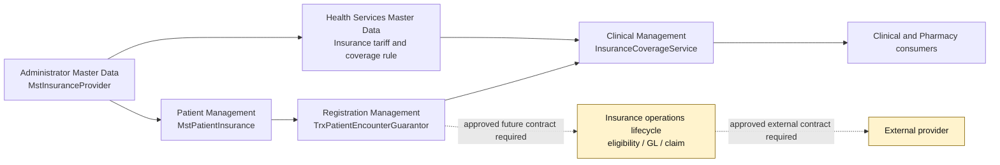

# INS-FLOW-001 — Existing Context Flow

Status: `DRAFT`; source evidence only.

The dotted paths are not existing integrations and must not be implemented without the blocked dependencies being resolved.
