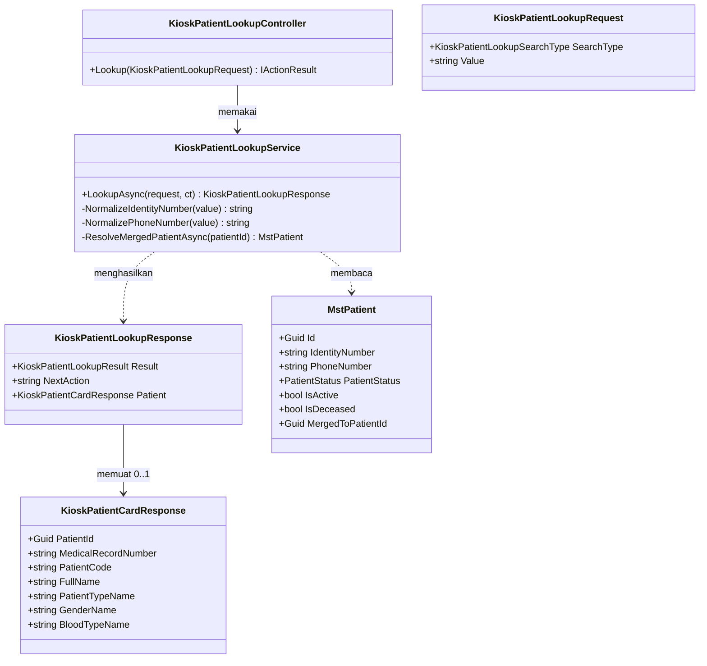
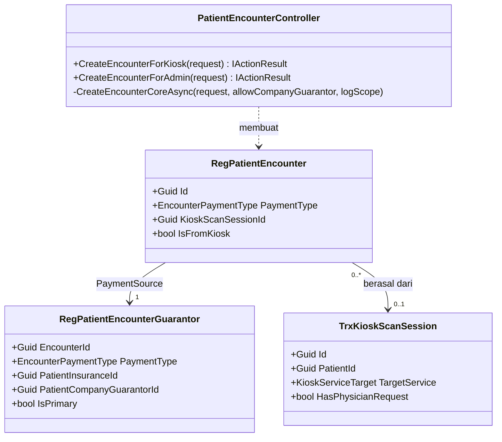

# Kiosk — Arsitektur Backend

| Field | Nilai |
| --- | --- |
| Blueprint ID | `KSK-BP-001` |
| Revision | `1` |
| Status | `approved` — Sukma Giri Pratama, 30 Sep 2026 |
| Owner | Sukma Giri Pratama (`KSK-DEC-005`) |
| `input_revision` | `00-interview-decisions.md` r2; `01-existing-capability-map.md` r1; `02-requirement-completeness-assessment.md` (`KSK-RCG-001`) r1 |
| SHA acuan | BE `419b910f`, FE `4ec51b0b` |
| `domain_architecture_readiness` | `DOMAIN_ARCHITECTURE_NOT_RUN` — alasan di `KSK-RCG-001` §9 |
| Kontrak | `KSK-CONTRACT-v1` (lihat `contracts/`) |

> **Ringkasan untuk pembaca umum.** Revisi Kiosk **tidak menambah satu tabel pun**. Backend hanya mendapat:
> 1. satu layanan pencarian pasien baru (Cek No. RM) yang membaca data pasien yang sudah ada;
> 2. pembatas jumlah pencarian per perangkat (rate limit), agar orang tidak bisa menebak-nebak nomor KTP/HP;
> 3. satu pelonggaran aturan: pendaftaran dari Kiosk boleh memakai **Penjamin Perusahaan** (`KSK-DEC-013`).
>
> Karena tidak ada tabel baru atau kolom baru, **tidak ada migration**.

## 1. Bounded context dan ownership

| Hal | Isi |
| --- | --- |
| Bounded context | `RegistrationManagement` — Kiosk (prefix entity `Reg`, registry baris 23) |
| Aggregate root yang disentuh | `RegPatientEncounter` (sudah ada) — hanya aturan validasi tipe pembayaran di route kiosk |
| Data yang dibaca, bukan dimiliki | `MstPatient`, `MstPatientIdentityDocument`, `MstPatientInsurance`, `MstPatientMembership` — milik PatientManagement |
| Invariant | `KSK-INV-001` (keputusan dari backend), `KSK-INV-003` (kartu hanya untuk tepat satu pasien), `KSK-INV-005` (satu kunjungan satu penanggung), `KSK-INV-006` (KTP/HP tidak lengkap di log), `KSK-INV-009` (status non-aktif tidak dibocorkan) |
| Transaction boundary | Lookup: **tanpa transaksi tulis** (baca saja, `AsNoTracking`). Create encounter: tetap transaksi existing di `CreateEncounterCoreAsync` |
| Rollback | Lookup tidak menulis apa pun. Create encounter mengikuti rollback existing (encounter + sumber pembayaran tersimpan bersama atau tidak sama sekali) |

## 2. Tabel kepemilikan data

| Kelompok data | Modul pemilik | Dipakai modul ini | Dibuat ulang di modul ini |
| --- | --- | :---: | --- |
| Identitas pasien (nama, No. RM, KTP, HP, status) | PatientManagement (`Mst`/`Pat`) | Ya — baca saja | **Tidak** |
| Dokumen identitas tambahan pasien | PatientManagement | Ya — baca saja (pencocokan KTP) | Tidak |
| Kartu asuransi pasien | PatientManagement | Ya — baca saja (pengenalan kartu Step 1; daftar penjamin) | Tidak |
| Keanggotaan (member) pasien | PatientManagement | Ya — baca saja (pengenalan kartu Step 1) | Tidak |
| Relasi pasien–perusahaan penjamin | PatientManagement | Ya — baca saja | Tidak |
| Kunjungan dan sumber pembayarannya | RegistrationManagement | Ya — dibuat lewat endpoint existing | Tidak |
| Sesi kiosk (hasil pindai, tujuan layanan) | RegistrationManagement | Ya — dibuat lewat endpoint existing | Tidak |
| Hasil pencarian Cek No. RM | — | Tidak disimpan | **Tidak** — hasil hanya hidup di respons dan log tersamar (`KSK-GAP-001`) |

## 3. Class diagram

### 3.1 Lookup No. RM



### 3.2 Pendaftaran kunjungan dari Kiosk (perubahan aturan)



## 4. Penjelasan setiap class

### `KioskPatientLookupController`

| Aspek | Penjelasan |
| --- | --- |
| **Status** | `Baru` |
| **Lokasi file** | `Areas/HealthServices/RegistrationManagement/Controllers/KioskPatientLookupController.cs` |
| Kategori | Controller |
| Tanggung jawab utama | Menerima permintaan Cek No. RM dari Kiosk, meneruskannya ke service, lalu mengembalikan hasil. Controller tidak menyentuh `ApplicationDbContext` (`QBE-SVC-001`). |
| Service yang dipakai | `KioskPatientLookupService`, `LoggerService` |
| Endpoint yang diurus | `POST api/v1/health-services/registration-management/kiosk-patient-lookups` |
| Atribut akses | Kelas: `[ApiController]`, `[Authorize]`, `[Route("api/v1/health-services/registration-management/kiosk-patient-lookups")]`, `[AccessController(moduleCode: "HEALTH_SERVICE_REGISTRATION_MANAGEMENT", moduleName: "Health Service Registration Management", displayName: "Kiosk Patient Lookup", AreaName = "HealthServices", ControllerName = "KioskPatientLookup", ...)]`, `[Tags("Health Services / Registration Management / Kiosk Patient Lookup")]`. Endpoint: `[HttpPost]`, `[Authorize(Policy = AuthorizationPolicies.KioskRead)]`, `[EnableRateLimiting("KioskPatientLookup")]`. **Tanpa `[AccessAction]` dan tanpa `[AccessPermission]`** (`KSK-DSN-006`). |
| Pemakaian dalam alur bisnis | Dipanggil layar Cek No. RM dan Step 1 Identifikasi ketika pasien mengetik KTP/HP atau memindai kartu asuransi/member |
| Catatan desain | Endpoint ini **POST** walaupun hanya membaca, agar KTP/HP berada di body, bukan URL (PRIV-3, `KSK-DEC-016`). Pengaksesnya akun perangkat, jadi `[AccessPermission]` tidak dipakai. `KioskRead` terdaftar di `Constants/AuthorizationPolicies.cs#ApprovedAlternativeAuthorization`, sehingga `PermissionRegistryDescriptor` tidak menganggapnya naked endpoint. `[AccessAction]` **sengaja tidak** dipasang: `[AccessAction]` tanpa `[AccessPermission]` masuk himpunan fallback kompatibilitas (`tools/authorization-verifier/approved-compatibility-fallback.txt`), dan menambah baris ke himpunan itu adalah keputusan governance yang membuat invarian 2 verifier gagal. |
| Ekuivalen model lama | — (fungsi yang mirip, `GET patients/kiosk?search=`, tidak diganti; tetap dipakai untuk pencarian nama/No. RM) |

### `KioskPatientLookupService`

| Aspek | Penjelasan |
| --- | --- |
| **Status** | `Baru` |
| **Lokasi file** | `Areas/HealthServices/RegistrationManagement/Services/KioskPatientLookupService.cs` |
| Kategori | Service |
| Tanggung jawab utama | Menormalkan masukan, mencari pasien yang cocok **persis**, mengikuti pasien yang sudah digabung, lalu menyimpulkan satu dari empat hasil: ditemukan, tidak ditemukan, cocok ganda, atau hubungi petugas. |
| Dipanggil oleh | `KioskPatientLookupController` |
| Membuka transaksi database | **Tidak** — seluruh query `AsNoTracking` |
| Didaftarkan | `builder.Services.AddScoped<KioskPatientLookupService>();` di `Program.cs`, dekat `AddScoped<EncounterIntakeService>()` |
| Aturan pencocokan | Lihat §4.1 |
| Catatan desain | Query **wajib** berparameter (SEC-KSK-003). Nilai KTP/HP **tidak boleh** masuk log utuh; yang boleh dicatat hanya 4 digit terakhir (`KSK-GAP-001`). Nama `Regex`/`regexp_replace` dipakai hanya di sisi kolom tersimpan, sedangkan nilai input dinormalkan di C# lalu dikirim sebagai parameter. |

#### 4.1 Aturan pencocokan

| Jenis pencarian | Normalisasi input | Kolom yang dicocokkan | Catatan |
| --- | --- | --- | --- |
| `IdentityNumber` (1) | Buang spasi; wajib `^[0-9]{16}$` | `MstPatient.IdentityNumber` **atau** `MstPatientIdentityDocument.IdentityNumber` aktif | Sama dengan urutan `KioskScanSessionController.FindPatientAsync` |
| `PhoneNumber` (2) | Buang semua selain digit; awalan `0` → `62`; wajib diawali `62`; panjang 9–15 digit | `MstPatient.PhoneNumber` yang dinormalkan dengan aturan yang sama di sisi database | Contoh: input `0812-3456-7890` → `6281234567890`; tersimpan `+6281234567890` → `6281234567890` → cocok |
| `InsuranceCardNumber` (3) | Trim; huruf kecil | `MstPatientInsurance.CardNumber` aktif | Hanya untuk Step 1 saat kartu asuransi dipindai (`KSK-DSN-004`); layar Cek No. RM **tidak** menawarkan jenis ini |
| `MemberNumber` (4) | Trim; huruf kecil | `MstPatientMembership.MemberNumber` aktif | Sama dengan jenis 3 |

Langkah penyimpulan hasil:

1. Kumpulkan `Id` pasien yang cocok dan belum dihapus (`IsDelete = false`).
2. Untuk setiap pasien berstatus `Merged` atau yang punya `MergedToPatientId`, ganti dengan pasien tujuannya. Ikuti rantainya paling banyak 3 langkah dan hentikan bila berputar (`KSK-DEC-017`).
3. Buang duplikat.
4. Tentukan hasilnya:

| Jumlah pasien unik | Syarat | Hasil |
| --- | --- | --- |
| 0 | — | `NotFound` |
| 1 | `PatientStatus = Active`, `IsActive = true`, `IsDeceased = false` | `Found` + kartu pasien |
| 1 | Selain syarat di atas | `ContactStaff`, tanpa data pasien |
| ≥ 2 | — | `MultipleMatch`, tanpa data pasien (`KSK-DEC-006/007`) |

Contoh: No. HP `0812-1111-2222` dipakai ibu (Aktif) dan anak (Aktif), sehingga hasilnya `MultipleMatch`. Kartu tidak ditampilkan, walaupun keduanya Aktif.

### `KioskPatientLookupRequest`, `KioskPatientLookupResponse`, `KioskPatientCardResponse`

| Aspek | Penjelasan |
| --- | --- |
| **Status** | `Baru` |
| **Lokasi file** | `Areas/HealthServices/RegistrationManagement/DTOS/KioskPatientLookupDtos.cs` (folder `DTOS` huruf besar mengikuti folder existing; penyimpangan penamaan folder dicatat §5, jangan dirapikan diam-diam) |
| Kategori | DTO — Request / Response |
| Field | Lihat `contracts/api-contract.md` |
| Catatan desain | `KioskPatientCardResponse` hanya memuat field Kartu Pasien existing (`KSK-FACT-005`) ditambah `PatientId`. **Tidak ada** KTP, HP, alamat, tanggal lahir, atau data medis lain (SEC-KSK-004). |

### `KioskPatientLookupSearchType` dan `KioskPatientLookupResult`

| Aspek | Penjelasan |
| --- | --- |
| **Status** | `Baru` |
| **Lokasi file** | `Areas/HealthServices/RegistrationManagement/Enums/KioskPatientLookupSearchType.cs`, `.../Enums/KioskPatientLookupResult.cs` |
| Nilai | `KioskPatientLookupSearchType`: `IdentityNumber = 1`, `PhoneNumber = 2`, `InsuranceCardNumber = 3`, `MemberNumber = 4`. `KioskPatientLookupResult`: `Found = 1`, `NotFound = 2`, `MultipleMatch = 3`, `ContactStaff = 4` |
| Nilai bawaan | Tidak ada; `SearchType` wajib dikirim |
| Catatan desain | Dikirim sebagai **angka** di JSON, karena backend tidak memasang `JsonStringEnumConverter` (fakta di `kiosk-service-target-rules.js`). |

### `PatientEncounterController`

| Aspek | Penjelasan |
| --- | --- |
| **Status** | `Diperbarui` |
| **Lokasi file** | `Areas/HealthServices/RegistrationManagement/Controllers/PatientEncounterController.cs` |
| Perubahan | `CreateEncounterForKiosk` memanggil `CreateEncounterCoreAsync(request, allowCompanyGuarantor: true, ...)`. Komentar "Kiosk tetap terbatas pada Tunai dan Asuransi" diganti dengan rujukan `KSK-DEC-013` / `RWI-ENC-PAYER-001` v1.1.0. Validasi kelayakan perusahaan (`LoadValidPatientCompanyGuarantorAsync`) dipakai apa adanya. |
| Service yang dipakai | Tidak berubah |
| Prasyarat | `KSK-OQ-005`: amendment `RWI-ENC-PAYER-001` v1.1.0 tercatat di blueprint rawat-inap sebelum baris ini diubah |
| Catatan desain | Jangan mengubah route `/admin`. Jangan menambah tipe pembayaran baru. |

### `RegPatientEncounter`, `RegPatientEncounterGuarantor`, `TrxKioskScanSession`, `MstPatient`

| Aspek | Penjelasan |
| --- | --- |
| **Status** | `Sudah ada` — tidak berubah |
| **Lokasi file** | `Areas/HealthServices/RegistrationManagement/Models/RegPatientEncounter.cs`; `.../Models/RegPatientEncounterGuarantor.cs`; `.../Models/TrxKioskScanSession.cs`; `Areas/HealthServices/PatientManagement/MasterData/Models/MstPatient.cs` |
| Pemakaian | Encounter + penanggung dibuat lewat route kiosk existing. Sesi kiosk dibuat lewat `scan-result` existing, kini **dari Step 3** (`KSK-DEC-014`). `MstPatient` hanya dibaca. |
| Catatan | `TrxKioskScanSession` memakai prefix legacy `Trx*` — utang teknis, jangan ditiru, jangan dirapikan dalam revisi ini. |

### `Program.cs` — rate limiter

| Aspek | Penjelasan |
| --- | --- |
| **Status** | `Diperbarui` |
| **Lokasi file** | `Program.cs` |
| Perubahan | (1) `builder.Services.AddRateLimiter(...)` dengan satu policy bernama `KioskPatientLookup`: fixed window, `PermitLimit` = `KioskPatientLookup:PermitPerMinute` (bawaan `10`), `Window` = 1 menit, `QueueLimit` = 0, partisi per klaim `ClaimTypes.NameIdentifier` (user id akun perangkat Kiosk; bila kosong, alamat IP). (2) `OnRejected` menulis status `429` dan body `ApiResponse<object>.Fail(429, "Terlalu banyak percobaan. Silakan coba lagi sebentar.")`. (3) `app.UseRateLimiter()` **setelah** `app.UseAuthentication()` dan `app.UseAuthorization()`, sebelum `app.MapControllers()`. |
| Catatan desain | Tanpa `GlobalLimiter`: endpoint lain tidak terkena (`KSK-GAP-003`). Framework `net9.0` sudah memuat middleware ini, jadi tidak ada package baru. Setiap perangkat punya akun login sendiri (`KioskDeviceController` generate login), sehingga partisi per user id = partisi per perangkat (`KSK-GAP-004` tertutup). |

### `appsettings.json`

| Aspek | Penjelasan |
| --- | --- |
| **Status** | `Diperbarui` |
| Perubahan | Tambah seksi `"KioskPatientLookup": { "PermitPerMinute": 10 }`. Bila kunci tidak ada, kode memakai `10`. |

## 5. Arsitektur folder

```text
NewQuilvianSystemBackend/
├── Program.cs                                                     # Diperbarui — AddScoped service, AddRateLimiter, UseRateLimiter
├── appsettings.json                                               # Diperbarui — seksi KioskPatientLookup
└── Areas/HealthServices/RegistrationManagement/
    ├── Controllers/
    │   ├── KioskPatientLookupController.cs                        # Baru
    │   ├── KioskScanSessionController.cs                          # Sudah ada — tidak berubah (pakai DbContext langsung: utang teknis, jangan ditiru)
    │   └── PatientEncounterController.cs                          # Diperbarui — kiosk menerima Penjamin Perusahaan
    ├── DTOS/                                                      # nama folder huruf besar menyimpang dari pola "DTOs" — utang teknis, jangan dirapikan diam-diam
    │   └── KioskPatientLookupDtos.cs                              # Baru
    ├── Enums/
    │   ├── KioskPatientLookupSearchType.cs                        # Baru
    │   └── KioskPatientLookupResult.cs                            # Baru
    ├── Models/                                                    # Tidak berubah (TrxKioskScanSession = legacy Trx*)
    └── Services/
        └── KioskPatientLookupService.cs                           # Baru
```

`Repositories/Configurations/**`: **tidak ada perubahan**.

## 6. Status model

| Entity | Status | Kolom berubah | Dampak migration |
| --- | --- | --- | --- |
| `MstPatient` | Sudah ada | — | Tidak ada |
| `MstPatientIdentityDocument`, `MstPatientInsurance`, `MstPatientMembership` | Sudah ada | — | Tidak ada |
| `RegPatientEncounter`, `RegPatientEncounterGuarantor` | Sudah ada | — | Tidak ada |
| `TrxKioskScanSession` | Sudah ada | — | Tidak ada |

## 7. Rencana migration

**Tidak ada migration.** Revisi ini tidak menambah atau mengubah tabel, kolom, maupun index. `dotnet ef migrations has-pending-model-changes` harus tetap menjawab tidak ada perubahan.

Pertimbangan index untuk pencarian HP ada di §9 (ditolak untuk MVP).

## 8. Rencana data master awal

Tidak ada tabel master baru. Satu-satunya nilai awal adalah konfigurasi `KioskPatientLookup:PermitPerMinute = 10` (`KSK-DEC-011`).

## 9. Yang sengaja tidak dibuat

| Yang ditolak | Alasan |
| --- | --- |
| Tabel log pencarian (`RegKioskPatientLookupLog`) | Tidak diminta PRD; log terstruktur dengan nilai tersamar sudah cukup (`KSK-GAP-001`); tabel baru akan menyimpan jejak pencarian KTP/HP yang justru menambah risiko privasi |
| Kolom `MstPatient.PhoneNumberNormalized` / index ekspresi | Mengubah master pasien = di luar scope PRD §46. Beban MVP rendah (maks. 10 pencarian/menit/perangkat). Ditinjau ulang bila pengukuran di produksi menunjukkan pencarian HP > 500 ms (`NFR-002`) |
| Normalisasi massal (backfill) `MstPatient.PhoneNumber` | Mengubah data master milik modul lain tanpa wewenang |
| Mencocokkan `WhatsAppNumber` | PRD hanya menyebut No. HP; menambah kolom pencocokan menambah peluang cocok ganda |
| Mencari lewat `GET patients/kiosk?search=` | Free-text di 15+ kolom, nilai di URL, respons lengkap — melanggar KSK-RM-002, PRIV-3, SEC-KSK-004 (`KSK-CAP-003`) |
| Endpoint untuk mengubah `TargetService` sesi kiosk | `KSK-DEC-002`: kontrak `scan-result` tidak berubah; sesi cukup dibentuk sekali di Step 3 |
| Menutup `PATCH …/kiosk/{id}/primary` | Konsumen lain belum diaudit; Kiosk cukup berhenti memanggilnya (`KSK-GAP-011`) |
| Mengirim `TargetService = OutpatientClinic (1)` untuk sesi poliklinik | Hari ini sesi poliklinik tidak membawa target. `KioskEncounterClosureService` menyaring berdasarkan target, dan mengisi nilai baru dapat membuat kunjungan poliklinik ikut tersaring. Sesi poliklinik tetap tanpa target. |

## 10. Keputusan desain

Keputusan teknis yang diambil desain ini dari bukti source. Statusnya `draft` dan ikut disetujui bersama blueprint; pemilik boleh menolaknya satu per satu.

| ID | Keputusan | Alasan / bukti | Menutup |
| --- | --- | --- | --- |
| `KSK-DSN-001` | Cek No. RM memakai endpoint **baru** `POST .../kiosk-patient-lookups`, bukan perluasan `GET patients/kiosk` | Endpoint lama free-text, nilai di URL, respons lengkap (`KSK-CAP-003`, `KSK-CAP-009`) | KSK-RM-002, SEC-KSK-004, PRIV-3 |
| `KSK-DSN-002` | HP dinormalkan di sisi query (kolom tersimpan) dan di C# (input); tanpa kolom atau index baru | Tidak mengubah master pasien (PRD §46); beban maks. 10/menit/perangkat | `KSK-DEC-018` |
| `KSK-DSN-003` | "Tidak ditemukan", "cocok ganda", dan "hubungi petugas" dijawab `200` dengan `result`, **bukan** `404` | `404` juga muncul saat route salah atau proxy bermasalah; memakainya untuk "belum terdaftar" dapat membuat gagal teknis terbaca sebagai pasien baru | `KSK-INV-002`, KSK-UX-003 |
| `KSK-DSN-004` | `SearchType` 3 (kartu asuransi) dan 4 (nomor member) tersedia untuk Step 1; layar Cek No. RM hanya menawarkan 1 dan 2 | Step 1 kehilangan pengenalan kartu asuransi/member bila sesi tidak lagi dibentuk saat scan (`KSK-DEC-014`); aturannya disalin dari `FindPatientAsync` | `KSK-GAP-006` |
| `KSK-DSN-005` | Rate limit: policy bernama `KioskPatientLookup`, fixed window 10/menit, partisi per user id akun perangkat, hanya pada endpoint lookup | Klaim `NameIdentifier`/`user_id` ada di token (`AuthController`); tiap perangkat punya akun sendiri | `KSK-DEC-011`, `KSK-GAP-002/003/004` |
| `KSK-DSN-006` | Endpoint lookup: `[Authorize(Policy = KioskRead)]` tanpa `[AccessAction]`/`[AccessPermission]` | `AuthorizationPolicies.ApprovedAlternativeAuthorization`; menjaga himpunan fallback verifier tetap | Invarian 1–2 `tools/authorization-verifier` |
| `KSK-DSN-007` | Sesi kiosk poliklinik tetap dikirim **tanpa** `targetService` (perilaku hari ini); hanya Laboratorium yang membawa `targetService = 2` | Penyaring `KioskEncounterClosureService` membaca target; mengubahnya berisiko menutup kunjungan poliklinik | `KSK-DEC-014`, `KSK-INV-008` |
| `KSK-DSN-008` | Rantai pasien digabung diikuti paling banyak 3 langkah dengan penjaga putaran | Mencegah loop pada data `MergedToPatientId` yang rusak | `KSK-DEC-017` |
| `KSK-DSN-009` | Pembeda input Step 1: 16 digit → KTP; diawali `0`/`62`/`+62` dengan 9–15 digit → HP; pola `99-99-99-99` atau tepat 8 digit → No. RM; selain itu → nama | Format No. RM dari `PatientController.GenerateMedicalRecordNumberAsync` (maks. `99-99-99-99`) tidak bertabrakan dengan HP ≥ 9 digit | `KSK-GAP-007` |
