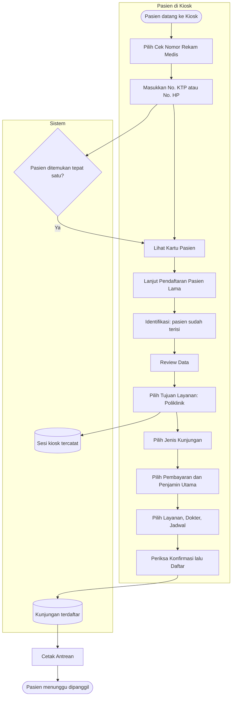

# Kiosk — Alur Utama

Jalur normal dari pasien datang ke Kiosk sampai memegang nomor antrean. Percabangan dan jalur gagal ada di berkas proses masing-masing:

- [cek-nomor-rekam-medis.md](cek-nomor-rekam-medis.md)
- [pendaftaran-pasien-lama.md](pendaftaran-pasien-lama.md)
- [penjamin-utama.md](penjamin-utama.md)

| Langkah | Pelaku | Masukan | Keluaran | Bila gagal |
| --- | --- | --- | --- | --- |
| Cek Nomor Rekam Medis | Pasien | No. KTP atau No. HP | Kartu Pasien | Lihat `cek-nomor-rekam-medis.md` |
| Identifikasi | Pasien | Pasien hasil pencarian | Pasien terpilih | Cari ulang |
| Review Data | Pasien | Data pasien | Data dinyatakan benar | Pasien menemui petugas bila datanya salah |
| Tujuan Layanan | Pasien | Poliklinik / Laboratorium | Sesi kiosk tercatat | Coba lagi atau hubungi petugas |
| Jenis Kunjungan → Layanan & Dokter | Pasien | Pilihan | Draf pendaftaran lengkap | Pesan di step itu |
| Konfirmasi | Pasien | Draf lengkap | Kunjungan terdaftar | Tetap di Konfirmasi dengan pesan |
| Cetak Antrean | Sistem | Kunjungan | Nomor antrean | Pasien menemui petugas |
