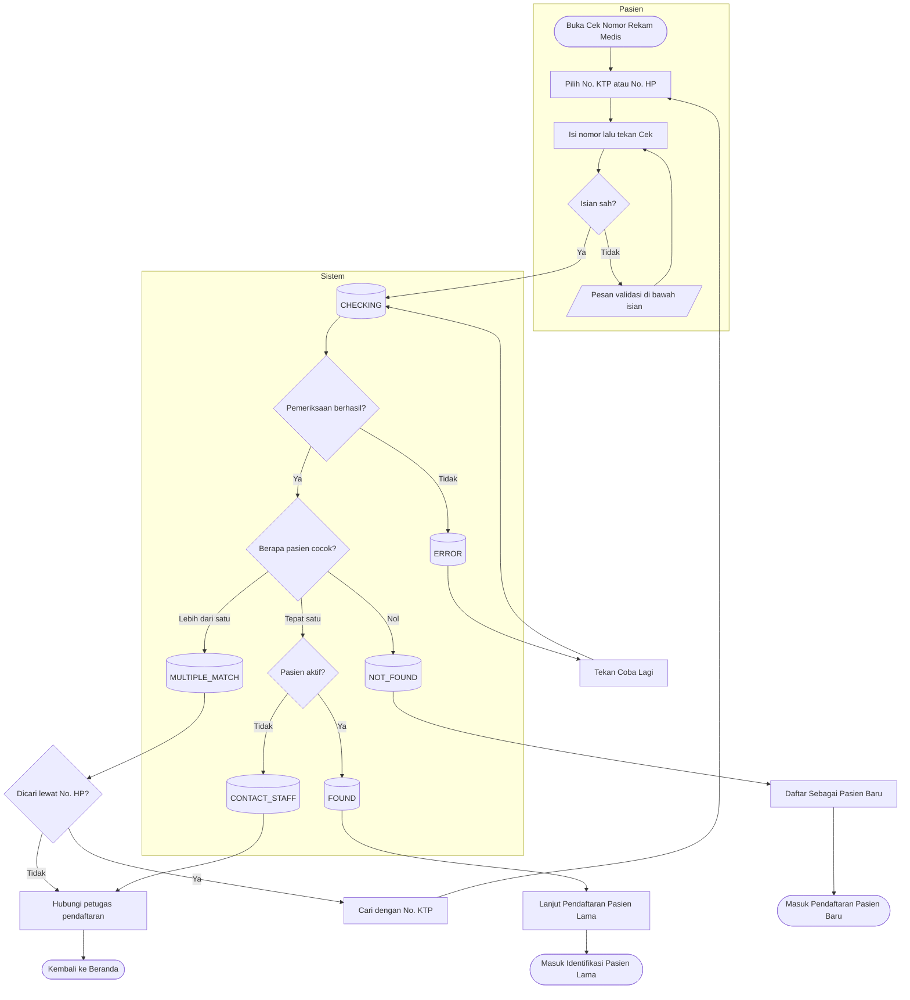

# Proses — Cek Nomor Rekam Medis

Keadaan pada node `[(...)]` sama persis dengan `contracts/state-transition-matrix.md` §1.

| Langkah | Pelaku | Masukan | Keluaran | Bila gagal |
| --- | --- | --- | --- | --- |
| Pilih metode | Pasien | — | Satu isian muncul | — |
| Isi dan cek | Pasien | Nomor | Permintaan pemeriksaan | Isian tidak sah → pesan, pasien memperbaiki |
| Pemeriksaan | Sistem | Nomor yang dinormalkan | Salah satu dari lima hasil | Jaringan/server gagal atau terlalu banyak percobaan → `ERROR`, pasien menekan Coba Lagi. **Tidak pernah** diarahkan ke Pasien Baru |
| Ditemukan | Pasien | Kartu Pasien | Masuk Pasien Lama dengan pasien terisi | Detail gagal dimuat → Identifikasi kosong + pesan, pasien mencari manual |
| Belum terdaftar | Pasien | — | Masuk Pasien Baru | — |
| Cocok ganda via HP | Pasien | — | Kembali ke isian dengan metode KTP | Tidak punya KTP → hubungi petugas |
| Cocok ganda via KTP / tidak aktif | Pasien | — | Arahan ke petugas tanpa alasan | Petugas memeriksa di layar pendaftaran |
| Tidak ada sentuhan 120 detik | Sistem | — | Data dibersihkan, kembali ke Beranda | — |
