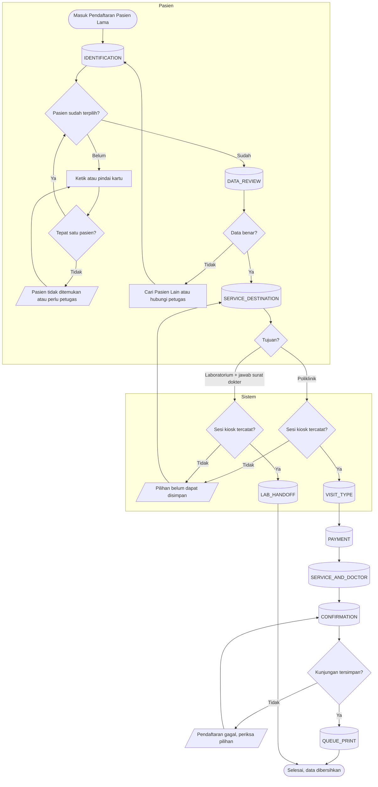

# Proses — Pendaftaran Pasien Lama (8 Step)

Keadaan pada node `[(...)]` sama persis dengan `contracts/state-transition-matrix.md` §2.

| Langkah | Pelaku | Masukan | Keluaran | Bila gagal |
| --- | --- | --- | --- | --- |
| Identifikasi | Pasien | KTP, HP, No. RM, nama, atau kartu (pindai) | Satu pasien terpilih | Tidak ada atau lebih dari satu → cari ulang atau hubungi petugas |
| Review Data | Pasien | Data pasien | Konfirmasi data benar | Data salah → Cari Pasien Lain; perbaikan data dilakukan petugas |
| Tujuan Layanan | Pasien | Poliklinik, atau Laboratorium + jawaban surat dokter | Sesi kiosk tercatat **sekali** | Gagal tersimpan → tetap di step ini, coba lagi atau hubungi petugas |
| Laboratorium selesai | Sistem | Sesi kiosk Laboratorium | Pasien diarahkan ke laboratorium | — |
| Jenis Kunjungan | Pasien | Umum / Rujukan | Pilihan | — |
| Pembayaran | Pasien | Tunai / Asuransi / Perusahaan | Satu penanggung kunjungan | Lihat `penjamin-utama.md` |
| Layanan & Dokter | Pasien | Poli, dokter, jadwal | Pilihan lengkap | Belum lengkap → pesan |
| Konfirmasi | Pasien | Ringkasan | Kunjungan terdaftar | Ditolak (misalnya penjamin tidak aktif) → tetap di Konfirmasi dengan pesan; pasien kembali ke Pembayaran atau ke petugas |
| Cetak Antrean | Sistem | Kunjungan | Nomor antrean | Printer gagal → pasien menemui petugas |
| Kapan pun: 120 detik tanpa sentuhan | Sistem | — | Peringatan 15 detik, lalu data dibersihkan | Ditunda bila sistem sedang menyimpan |
