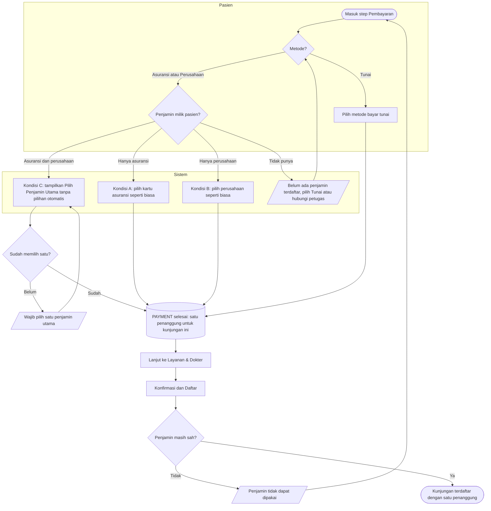

# Proses — Pembayaran dan Penjamin Utama

Bagian dari step `PAYMENT` (`contracts/state-transition-matrix.md` §2).

| Langkah | Pelaku | Masukan | Keluaran | Bila gagal |
| --- | --- | --- | --- | --- |
| Pilih metode | Pasien | Tunai / Asuransi / Perusahaan | — | — |
| Kondisi A / B | Pasien | Kartu asuransi **atau** perusahaan milik pasien | Satu penanggung | Tidak ada kartu aktif → pilih Tunai atau hubungi petugas |
| Kondisi C | Pasien | Kartu asuransi **dan** perusahaan | Satu penanggung dipilih sendiri; default di data pasien **tidak** berubah | Belum memilih → tidak bisa lanjut |
| Konfirmasi | Sistem | Penanggung terpilih | Kunjungan dengan satu penanggung | Penjamin tidak aktif / tidak eligible / habis masa berlaku → pasien kembali ke Pembayaran atau ke petugas |
| Setelah terdaftar | — | — | Penjamin tidak bisa diganti dari Kiosk | Pasien menemui petugas/kasir |
