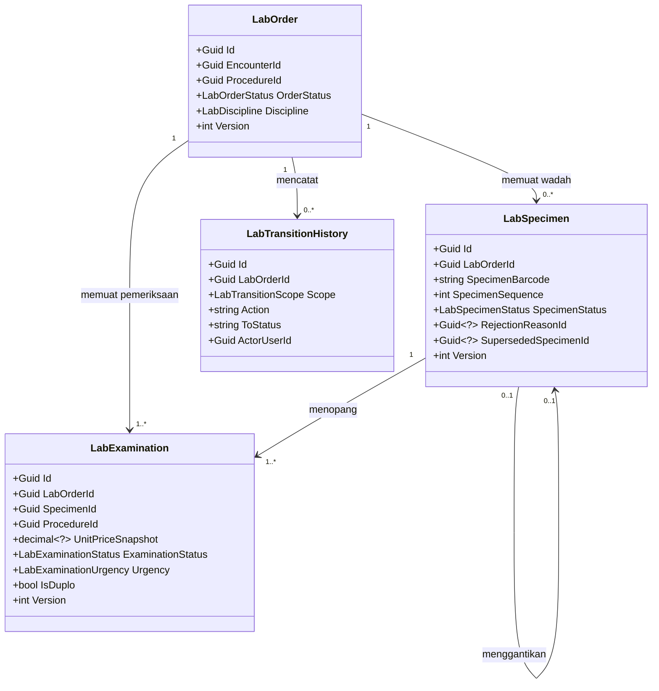
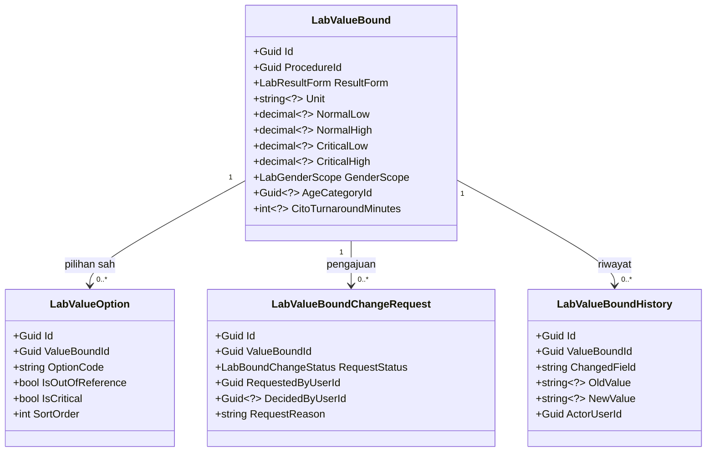
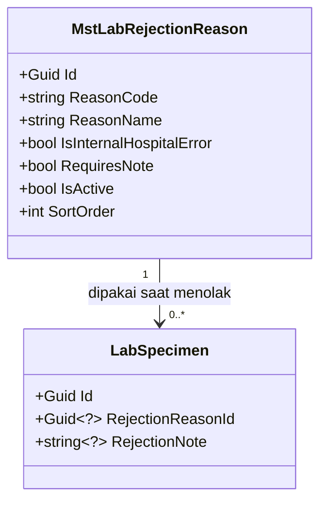

# Laboratorium — Arsitektur Backend

| Field | Value |
|---|---|
| Blueprint ID | `LAB-BP-001` |
| Revision | `5` |
| Status | `draft` |
| Scope | Slice `S1a`, `S2`, `S3`, `S7`, `S10`, `S11`, `S13a`, `S13b`, `S14`, `S15`. **Revision 4 menambah amandemen Penerimaan Sampling/Specimen** — lihat bagian 11 |
| Backend SHA | Revision 1-3: `c87d9c0`. **Revision 4: `466a7127`**, diverifikasi tidak berubah pada `9067fa73` |
| Frontend SHA | Revision 1-3: `688daff90`. **Revision 4: `9cd4cd03f`** |
| Masukan | Revision 1-3: decisions rev 20; capability map rev 2; `LAB-RCG-001` rev 5; `LAB-DA-001` rev 4; `LAB-REC-001` rev 2. **Revision 4: decisions rev 26; capability map rev 3** |
| Kesiapan arsitektur domain | `DOMAIN_ARCHITECTURE_READY` untuk kesepuluh slice |

> **Perubahan revision 2.** Analisis konsolidasi bukti lapangan diadopsi lewat `LAB-DEC-025`
> sampai `LAB-DEC-031`:
>
> 1. `LabOrder` mendapat kolom `Discipline` (`LAB-DEC-025`).
> 2. Kolom kesegeraan **tidak jadi** ditambahkan ke `LabOrder`. Cito dan Duplo pindah ke
>    `LabExamination` (`LAB-DEC-026`).

> **Perubahan revision 3.** Empat slice ditambahkan setelah gerbangnya terbuka:
>
> 1. **`S13a` dan `S13b`** — pendaftaran pasien datang langsung dan rujukan luar. Laboratorium
>    **memanggil** Registrasi, tidak menulis kunjungan (`LAB-DEC-032`, `LAB-DEC-035`).
> 2. **`S14`** — katalog, harga, dan cakupan penjamin. **Baca saja**, tanpa tabel baru
>    (`LAB-DEC-029`, `LAB-DEC-033`).
> 3. **`S15`** — monitoring per disiplin, diturunkan dari `LabOrder.Discipline`.
> 4. Penempatan data induk backend mengikuti cakupan pemakaian (`LAB-DEC-034`).
> 5. Tiga perubahan pada tabel milik modul lain dicatat pada bagian 2.
>
> **Nol tabel baru milik Laboratorium** ditambahkan oleh keempat slice ini.
>
> Yang **masih belum** dirancang: bentuk hasil mikrobiologi dan patologi anatomi
> (`LAB-DEC-027`), karena slice hasil tertahan `LAB-SIGN-001` dan `LAB-P0-001`.

> **Batas dokumen ini.** Ini rancangan, bukan izin menulis kode. Tidak ada migration yang
> dibuat, tidak ada endpoint yang dibangun, dan tidak ada source yang disentuh. Approval tetap
> tindakan manusia.
>
> **Yang tidak dirancang di sini:** hasil pemeriksaan, nilai kritis, koreksi hasil,
> pemberitahuan, pendaftaran ke rekam medis, dan penghapusan status `Draft`. Keenamnya masih
> terblokir dan **tidak boleh** diselundupkan masuk.

---

## 1. Bounded Context dan Ownership

| Bounded context | Peran modul ini | Aggregate root | Transaction boundary |
|---|---|---|---|
| `BC-LAB` Operasional Laboratorium | **Pemilik** | `LabOrder`, `LabValueBound`, `MstLabRejectionReason` | Satu transaksi per perintah bisnis atas satu aggregate |
| `BC-REG` Registrasi | Pemakai | — | Dibaca saja |
| `BC-MD` Data Induk | Pemakai | — | Dibaca saja, disalin sesaat |
| `BC-BIL` Billing | Penerima fakta | — | Fakta terbit di dalam transaksi yang sama dengan perpindahan status |
| `BC-PLAT` Platform | Pemakai | — | Pemeriksaan kewenangan di luar transaksi |

### Invariant yang dijaga transaction boundary

| ID | Invariant | Cara dijaga |
|---|---|---|
| `INV-02` | Wadah tidak dapat dinyatakan layak tanpa melewati penerimaan | Pemeriksaan status di dalam transaksi |
| `INV-05` | Dua petugas menyatakan layak bersamaan, hanya satu berhasil | `Version` sebagai concurrency token |
| `INV-06` | Penetapan layak berulang tidak menggandakan kelayakan tagih | Idempotensi pada penerbitan fakta |
| `INV-13` | Perubahan batas kritis tidak berlaku sebelum disetujui | Perubahan ditulis ke tabel pengajuan, bukan ke tabel batas |
| `INV-20` | Penolakan wadah menggugurkan seluruh pemeriksaan yang ditopangnya | Satu transaksi menyentuh wadah beserta seluruh pemeriksaannya |

---

## 2. Tabel Kepemilikan Data

Ini pertahanan langsung terhadap duplikasi entity.

| Kelompok data | Modul pemilik | Dipakai modul ini | Dibuat ulang di modul ini |
|---|---|:---:|---|
| Pasien | Patient Management | Ya, lewat kunjungan | **Tidak** |
| Dokter dan tenaga kerja | HR / Master Data | Ya, lewat kunjungan | **Tidak** |
| Kunjungan pasien (*encounter*) | Registration Management | Ya | **Tidak** |
| Jenis pemeriksaan (`MstProcedure`) | Health Services Master Data | Ya | **Tidak** |
| Tarif pemeriksaan | Health Services Master Data | Ya | **Tidak** — hanya disalin sesaat ke baris pemeriksaan |
| Identitas pengguna dan kewenangan | Platform / Security | Ya | **Tidak** |
| Tagihan, invoice, pembayaran | Billing dan Kasir | **Tidak** | **Tidak** — Laboratorium hanya mengirim fakta |
| Pesanan laboratorium | **Laboratorium** | Ya | Ya, sudah ada |
| Wadah fisik sampel | **Laboratorium** | Ya | Ya, sudah ada, **diperbarui** |
| Pemeriksaan terpesan | **Laboratorium** | Ya | Ya, **baru** — dipisahkan dari wadah oleh `LAB-DEC-024` |
| Batas nilai pemeriksaan | **Laboratorium** | Ya | Ya, **baru** |
| Alasan penolakan sampel | **Laboratorium** | Ya | Ya, sudah ada |
| Riwayat perpindahan status | **Laboratorium** | Ya | Ya, sudah ada |
| Dokumen rekam medis | Medical Record Management | **Tidak pada rilis ini** | **Tidak** |
| Pemberitahuan pengguna | Platform (belum ada) | **Tidak pada rilis ini** | **Tidak** |
| **Instansi perujuk** | Health Services Master Data | Ya | **Tidak** — data induk **baru milik Master Data** (`LAB-DEC-035`) |
| **Dokter perujuk** | Health Services Master Data | Ya | **Tidak** — data induk **baru milik Master Data** (`LAB-DEC-035`) |
| **Cakupan penjamin** | Health Services Master Data | Ya | **Tidak** — `MstInsuranceTariff` dibaca apa adanya |

### Perubahan pada tabel milik modul lain

Tiga perubahan berikut menyentuh tabel yang **bukan milik Laboratorium**. Seluruhnya
memerlukan izin pemiliknya dan **tidak boleh** dikerjakan sebagai bagian task Laboratorium.

| Perubahan | Tabel | Pemilik | Koordinasi |
|---|---|---|---|
| Tambah kolom klasifikasi disiplin | `MstProcedure` | Health Services Master Data | `LAB-COORD-005` |
| Dua data induk baru: instansi dan dokter perujuk | — | Health Services Master Data | `LAB-COORD-004` |
| Kolom penunjuk instansi dan dokter perujuk | `TrxPatientEncounter` | Registration Management | `LAB-COORD-004` |

**Yang Laboratorium kerjakan sendiri:** memanggil, membaca, dan menyajikan. Tidak menulis.

---

## 3. Class Diagram

Dipecah per kelompok proses agar tiap diagram muat dibaca dalam satu layar.

### 3.1 Pesanan, wadah, dan pemeriksaan



### 3.2 Batas nilai dan persetujuan klinis



### 3.3 Alasan penolakan



---

## 4. Penjelasan Setiap Class

### 4.1 `LabOrder`

| Aspek | Penjelasan |
|---|---|
| **Status** | `Diperbarui` |
| **Lokasi file** | `Areas/HealthServices/LaboratoryManagement/Models/LabOrder.cs` |
| Kategori | Transaksi Laboratorium |
| Tanggung jawab utama | Menyimpan satu permintaan pemeriksaan dari dokter untuk satu kunjungan pasien, beserta keadaan operasionalnya. Tidak menyimpan satu pun angka uang |
| Field penting | `EncounterId`, `ProcedureId`, `OrderStatus`, `StatusBeforeHold`, **`Discipline` (baru)**, `Version` |
| Kolom yang ditambahkan | `Discipline` — Patologi Klinik, Patologi Anatomi, atau Mikrobiologi (`LAB-DEC-025`) |
| Kolom yang **tidak jadi** ditambahkan | `Urgency`, `UrgencyMarkedAt`, `UrgencyMarkedByUserId` — dipindahkan ke `LabExamination` oleh `LAB-DEC-026` |
| Navigation property dan relasi | Menunjuk `TrxPatientEncounter` dan `MstProcedure`; memiliki banyak `LabSpecimen` dan banyak `LabExamination` |
| Pemakaian dalam alur bisnis | Dibuat dokter saat memesan pemeriksaan. Ditandai cito pada saat yang sama bila perlu |
| Catatan desain | `ProcedureId` dipertahankan sebagai pemeriksaan yang dipesan pertama dan **tidak** lagi menjadi satu-satunya sumber komponen. Jangan menambahkan kolom finansial apa pun |
| Ekuivalen model lama | — |

### 4.2 `LabSpecimen`

| Aspek | Penjelasan |
|---|---|
| **Status** | `Diperbarui` — perubahan besar |
| **Lokasi file** | `Areas/HealthServices/LaboratoryManagement/Models/LabSpecimen.cs` |
| Kategori | Transaksi Laboratorium |
| Tanggung jawab utama | Mewakili **satu wadah nyata** berisi bahan dari pasien: satu tabung atau satu pot, satu barcode, satu peristiwa pengambilan, dan satu keputusan layak atau tolak |
| Field penting | `LabOrderId`, `SpecimenBarcode`, `SpecimenSequence`, `SpecimenStatus`, `StatusBeforeHold`, jejak `Collected/Received/Decided`, `RejectionReasonId`, `SupersededSpecimenId`, `RecollectionCause`, `Version` |
| Kolom yang **dipindahkan keluar** | `ProcedureId`, `ProcedureCodeSnapshot`, `ProcedureNameSnapshot`, `TariffId`, `TariffCodeSnapshot`, `UnitPriceSnapshot` — seluruhnya pindah ke `LabExamination` |
| Navigation property dan relasi | Milik `LabOrder`; menunjuk `MstLabRejectionReason` dan wadah yang digantikan; **menopang banyak** `LabExamination` |
| Pemakaian dalam alur bisnis | Dibuat saat merencanakan pengambilan, lalu berjalan sampai dinyatakan layak atau ditolak |
| Catatan desain | Setelah `LAB-DEC-024`, wadah **tidak lagi** membawa jenis pemeriksaan maupun tarif. Menolak wadah menggugurkan seluruh pemeriksaan yang ditopangnya — tidak boleh ada jalur menolak sebagian |
| Ekuivalen model lama | Dirinya sendiri sebelum pemisahan |

### 4.3 `LabExamination`

| Aspek | Penjelasan |
|---|---|
| **Status** | `Baru` |
| **Lokasi file** | `Areas/HealthServices/LaboratoryManagement/Models/LabExamination.cs` |
| Kategori | Transaksi Laboratorium |
| Tanggung jawab utama | Mewakili **satu jenis pemeriksaan yang dipesan**. Inilah satuan yang ditagihkan, dan kelak satuan yang punya hasil |
| Field penting | `LabOrderId`, `SpecimenId`, `ProcedureId`, `ProcedureCodeSnapshot`, `ProcedureNameSnapshot`, `TariffId`, `TariffCodeSnapshot`, `UnitPriceSnapshot`, `ExaminationStatus`, `ChargeEligibleAt`, **`Urgency`**, **`UrgencyMarkedAt`**, **`UrgencyMarkedByUserId`**, **`IsDuplo`**, `Version` |
| Kolom kesegeraan | Cito dan Duplo melekat di sini, **bukan** pada pesanan (`LAB-DEC-026`). Satu pesanan boleh memuat pemeriksaan cito dan biasa sekaligus |
| Navigation property dan relasi | Milik `LabOrder`; ditopang tepat satu `LabSpecimen`; menunjuk `MstProcedure` |
| Pemakaian dalam alur bisnis | Dibuat bersamaan dengan rencana wadah. Menjadi layak tagih ketika wadah penopangnya dinyatakan layak |
| Catatan desain | Salinan tarif disimpan di sini, bukan di wadah. Satu wadah boleh menopang beberapa baris ini. Kolom hasil **tidak** ditambahkan pada rilis ini karena slice hasil masih terblokir |
| Ekuivalen model lama | Bagian dari `LabSpecimen` sebelum pemisahan |

### 4.4 `LabValueBound`

| Aspek | Penjelasan |
|---|---|
| **Status** | `Baru` |
| **Lokasi file** | `Areas/HealthServices/LaboratoryManagement/Models/LabValueBound.cs` |
| Kategori | Data induk khusus Laboratorium |
| Tanggung jawab utama | Menyimpan batas nilai satu jenis pemeriksaan untuk satu kelompok pasien: satuan, batas normal, batas kritis, dan batas waktu cito |
| Field penting | `ProcedureId`, `ResultForm`, `Unit`, `NormalLow`, `NormalHigh`, `CriticalLow`, `CriticalHigh`, `GenderScope`, `AgeCategoryId`, `CitoTurnaroundMinutes`, `IsActive` |
| Navigation property dan relasi | Menunjuk `MstProcedure` dan `MstAgeCategory`; memiliki banyak `LabValueOption`, `LabValueBoundChangeRequest`, dan `LabValueBoundHistory` |
| Pemakaian dalam alur bisnis | Dipakai saat menilai hasil dan saat menghitung keterlambatan cito |
| Catatan desain | Satu jenis pemeriksaan boleh punya beberapa baris. Kombinasi `ProcedureId` + `GenderScope` + `AgeCategoryId` wajib unik. Batas kritis **tidak boleh** diubah langsung — perubahannya lewat pengajuan |
| Ekuivalen model lama | — |

### 4.5 `LabValueOption`

| Aspek | Penjelasan |
|---|---|
| **Status** | `Baru` |
| **Lokasi file** | `Areas/HealthServices/LaboratoryManagement/Models/LabValueOption.cs` |
| Kategori | Data induk khusus Laboratorium |
| Tanggung jawab utama | Menyimpan satu pilihan sah untuk pemeriksaan berbentuk pilihan, misalnya `+3` pada protein urin, beserta penanda apakah pilihan itu di luar rujukan atau kritis |
| Field penting | `ValueBoundId`, `OptionCode`, `OptionName`, `IsOutOfReference`, `IsCritical`, `SortOrder` |
| Navigation property dan relasi | Milik `LabValueBound` |
| Pemakaian dalam alur bisnis | Menjadi daftar pilihan yang boleh diisi analis, dan dasar penilaian kritis |
| Catatan desain | Hanya diisi bila `ResultForm` bernilai pilihan. Penanda `IsCritical` mengikuti aturan persetujuan yang sama dengan batas kritis angka |
| Ekuivalen model lama | — |

### 4.6 `LabValueBoundChangeRequest`

| Aspek | Penjelasan |
|---|---|
| **Status** | `Baru` |
| **Lokasi file** | `Areas/HealthServices/LaboratoryManagement/Models/LabValueBoundChangeRequest.cs` |
| Kategori | Transaksi Laboratorium |
| Tanggung jawab utama | Menampung usulan perubahan batas kritis sampai pihak klinis memutuskan. Selama berstatus diajukan, batas yang berlaku **tidak** berubah |
| Field penting | `ValueBoundId`, `RequestStatus`, `ProposedCriticalLow`, `ProposedCriticalHigh`, `ProposedCriticalOptionCodes`, `RequestReason`, `RequestedByUserId`, `DecidedByUserId`, `DecisionNote` |
| Navigation property dan relasi | Milik `LabValueBound` |
| Pemakaian dalam alur bisnis | Dibuat kepala instalasi, diputuskan pihak klinis |
| Catatan desain | Jangan menerapkan perubahan langsung ke `LabValueBound` sebelum berstatus disetujui |
| Ekuivalen model lama | — |

### 4.7 `LabValueBoundHistory`

| Aspek | Penjelasan |
|---|---|
| **Status** | `Baru` |
| **Lokasi file** | `Areas/HealthServices/LaboratoryManagement/Models/LabValueBoundHistory.cs` |
| Kategori | Transaksi Laboratorium |
| Tanggung jawab utama | Menyimpan setiap perubahan batas nilai secara permanen: kolom apa, dari berapa ke berapa, oleh siapa, disetujui siapa, kapan, dan alasannya |
| Field penting | `ValueBoundId`, `ChangedField`, `OldValue`, `NewValue`, `ActorUserId`, `ApprovedByUserId`, `ChangeReason`, `OccurredAt` |
| Navigation property dan relasi | Milik `LabValueBound` |
| Pemakaian dalam alur bisnis | Terisi otomatis setiap kali batas berubah, baik batas normal maupun batas kritis |
| Catatan desain | Tidak pernah diubah dan tidak pernah dihapus |
| Ekuivalen model lama | — |

### 4.8 `MstLabRejectionReason`

| Aspek | Penjelasan |
|---|---|
| **Status** | `Sudah ada` |
| **Lokasi file** | `Areas/HealthServices/LaboratoryManagement/Models/MstLabRejectionReason.cs` |
| Kategori | Data induk Laboratorium |
| Tanggung jawab utama | Daftar alasan penolakan sampel yang terkendali |
| Field penting | `ReasonCode`, `ReasonName`, `Description`, `IsInternalHospitalError`, `RequiresNote`, `IsActive`, `SortOrder` |
| Navigation property dan relasi | Dipakai banyak `LabSpecimen` |
| Pemakaian dalam alur bisnis | Dipilih petugas saat menolak wadah |
| Catatan desain | `IsInternalHospitalError` dan `RequiresNote` **tidak boleh** diubah lewat endpoint pengelolaan Laboratorium. Lokasi file menyimpang dari pola standar — lihat bagian 5 |
| Ekuivalen model lama | — |

### 4.9 `LabTransitionHistory`

| Aspek | Penjelasan |
|---|---|
| **Status** | `Diperbarui` |
| **Lokasi file** | `Areas/HealthServices/LaboratoryManagement/Models/LabTransitionHistory.cs` |
| Kategori | Transaksi Laboratorium |
| Tanggung jawab utama | Menyimpan setiap perpindahan status yang penting, secara permanen |
| Kolom yang ditambahkan | `LabExaminationId` — agar perpindahan status pemeriksaan ikut terlacak |
| Field penting | `LabOrderId`, `LabSpecimenId`, **`LabExaminationId` (baru)**, `EncounterId`, `Scope`, `Action`, `FromStatus`, `ToStatus`, `ReasonCode`, `ReasonNote`, `ActorUserId`, `OccurredAt`, `CorrelationId` |
| Catatan desain | Nilai baru `LabExamination` ditambahkan pada `LabTransitionScope`. Baris riwayat tidak pernah diubah |
| Ekuivalen model lama | — |

### 4.10 Service

| Service | Status | Lokasi file | Fungsi utama | Dipanggil oleh | Membuka transaksi |
|---|---|---|---|---|:---:|
| `LabOrderService` | `Diperbarui` | `Areas/HealthServices/LaboratoryManagement/Services/LabOrderService.cs` | Membuat pesanan, memindahkan status pesanan, menandai cito | `LabOrderController` | Ya |
| `LabSpecimenService` | `Diperbarui` | `.../Services/LabSpecimenService.cs` | Siklus hidup wadah; menerbitkan fakta per pemeriksaan yang ditopang | `LabSpecimenController` | Ya |
| `LabExaminationService` | `Baru` | `.../Services/LabExaminationService.cs` | Menambah dan membatalkan pemeriksaan terpesan, menautkannya ke wadah, menyalin tarif | `LabExaminationController` | Ya |
| `LabValueBoundService` | `Baru` | `.../Services/LabValueBoundService.cs` | Mengelola batas nilai, menampung pengajuan perubahan batas kritis, menulis riwayat | `LabValueBoundController` | Ya |
| `LabWorklistService` | `Baru` | `.../Services/LabWorklistService.cs` | Menyusun daftar kerja dan daftar pantau keterlambatan cito | `LabWorklistController` | **Tidak** — hanya membaca |
| `LabRejectionReasonService` | `Baru` | `.../Services/LabRejectionReasonService.cs` | Mengelola alasan penolakan dengan dua tingkat kewenangan | `LabRejectionReasonController` | Ya |
| `LabPatientRegistrationService` | `Baru` | `.../Services/LabPatientRegistrationService.cs` | Menerima isian pendaftaran dari layar Laboratorium, memanggil Registrasi untuk membuat kunjungan, lalu mengembalikan penunjuknya. **Tidak menulis** ke tabel kunjungan maupun pasien | `LabPatientRegistrationController` | Ya — untuk pesanan yang menyusul; pembuatan kunjungan tetap transaksi milik Registrasi |
| `LabCatalogService` | `Baru` | `.../Services/LabCatalogService.cs` | Menyajikan katalog pemeriksaan laboratorium, harga berlaku, dan cakupan penjamin. **Baca saja** | `LabCatalogController` | **Tidak** |

### Catatan penting tentang `LabPatientRegistrationService`

Service ini **bukan** service pendaftaran. Ia adalah **penerus permintaan**. Tanggung jawabnya
hanya tiga:

1. Memeriksa kelengkapan isian sebelum diteruskan.
2. Memanggil Registrasi dan menunggu jawabannya.
3. Menyimpan penunjuk kunjungan pada pesanan yang menyusul.

Bila Registrasi menolak, service ini **meneruskan penolakan apa adanya** dan tidak membuat data
apa pun. Tidak ada kunjungan setengah jadi yang disimpan Laboratorium.

### Catatan penting tentang `LabCatalogService`

Service ini **tidak membuka transaksi** karena hanya membaca. Ia menggabungkan tiga sumber
milik Master Data:

| Yang dibaca | Dari | Untuk |
|---|---|---|
| Jenis pemeriksaan berpenanda `IsLaboratory` dan disiplinnya | `MstProcedure` | Daftar pemeriksaan yang dapat dipesan |
| Harga berlaku pada tanggal kejadian | `MstTariff` | Kolom harga satuan |
| Kontrak penjamin | `MstInsuranceTariff` | Penanda tercakup atau tidak |

Bila cakupan tidak ditemukan untuk penjamin pasien, pemeriksaan ditampilkan **tidak tercakup** —
itu jawaban yang sah, bukan kesalahan.

### 4.11 Controller

| Controller | Status | Lokasi file | Service yang dipakai | Endpoint yang diurus |
|---|---|---|---|---|
| `LabOrderController` | `Diperbarui` | `Areas/HealthServices/LaboratoryManagement/Controllers/LabOrderController.cs` | `LabOrderService` | Pesanan dan penandaan cito |
| `LabSpecimenController` | `Diperbarui` | `.../Controllers/LabSpecimenController.cs` | `LabSpecimenService` | Siklus hidup wadah |
| `LabExaminationController` | `Baru` | `.../Controllers/LabExaminationController.cs` | `LabExaminationService` | Pemeriksaan terpesan |
| `LabValueBoundController` | `Baru` | `.../Controllers/LabValueBoundController.cs` | `LabValueBoundService` | Batas nilai dan pengajuan perubahan |
| `LabWorklistController` | `Baru` | `.../Controllers/LabWorklistController.cs` | `LabWorklistService` | Daftar kerja dan daftar pantau keterlambatan |
| `LabRejectionReasonController` | `Baru` | `.../Controllers/LabRejectionReasonController.cs` | `LabRejectionReasonService` | Pengelolaan alasan penolakan |
| `LabPatientRegistrationController` | `Baru` | `.../Controllers/LabPatientRegistrationController.cs` | `LabPatientRegistrationService` | Pendaftaran pasien datang langsung dan rujukan luar |
| `LabCatalogController` | `Baru` | `.../Controllers/LabCatalogController.cs` | `LabCatalogService` | Katalog pemeriksaan, harga berlaku, dan cakupan penjamin |

Tidak ada controller pada modul ini yang mengakses `ApplicationDbContext` langsung. Seluruhnya
memakai service, karena seluruh operasinya menyentuh aturan bisnis atau perpindahan status.

---

## 5. Arsitektur Folder

```text
Areas/HealthServices/LaboratoryManagement/
├── Controllers/
│   ├── LabOrderController.cs                    # Diperbarui
│   ├── LabSpecimenController.cs                 # Diperbarui
│   ├── LabExaminationController.cs              # Baru
│   ├── LabValueBoundController.cs               # Baru
│   ├── LabWorklistController.cs                 # Baru
│   ├── LabRejectionReasonController.cs          # Baru
│   ├── LabPatientRegistrationController.cs      # Baru
│   └── LabCatalogController.cs                  # Baru
├── DTOs/
│   ├── LabOrderDtos.cs                          # Diperbarui
│   ├── LabSpecimenDtos.cs                       # Diperbarui
│   ├── LabExaminationDtos.cs                    # Baru
│   ├── LabValueBoundDtos.cs                     # Baru
│   ├── LabWorklistDtos.cs                       # Baru
│   ├── LabRejectionReasonDtos.cs                # Baru
│   ├── LabPatientRegistrationDtos.cs            # Baru
│   └── LabCatalogDtos.cs                        # Baru
├── Enums/
│   └── LaboratoryEnums.cs                       # Diperbarui
├── Models/
│   ├── LabOrder.cs                              # Diperbarui
│   ├── LabSpecimen.cs                        # Diperbarui
│   ├── LabExamination.cs                     # Baru
│   ├── LabTransitionHistory.cs               # Diperbarui
│   ├── LabValueBoundChangeRequest.cs         # Baru
│   ├── LabValueBoundHistory.cs               # Baru
│   ├── MstLabRejectionReason.cs                 # Sudah ada — BENAR di sini, khusus Laboratorium
│   ├── LabValueBound.cs                      # Baru — khusus Laboratorium (LAB-DEC-034)
│   └── LabValueOption.cs                     # Baru — khusus Laboratorium (LAB-DEC-034)
├── Services/
│   ├── LabOrderService.cs                       # Diperbarui
│   ├── LabSpecimenService.cs                    # Diperbarui
│   ├── LabExaminationService.cs                 # Baru
│   ├── LabValueBoundService.cs                  # Baru
│   ├── LabWorklistService.cs                    # Baru
│   ├── LabRejectionReasonService.cs             # Baru
│   ├── LabPatientRegistrationService.cs         # Baru
│   └── LabCatalogService.cs                     # Baru

# Catatan: folder Configurations/ di dalam Areas SUDAH DIHAPUS pada c87d9c0.
# Seluruh configuration kini berada di Repositories/Configurations/ — lihat di bawah.

Areas/HealthServices/MasterData/Models/
└── (tidak ada berkas baru — MstProcedure, MstTariff, MstInsuranceTariff,
     dan MstAgeCategory dipakai apa adanya, tidak disentuh)

Repositories/Configurations/HealthServices/
├── LabOrderConfiguration.cs                     # Sudah ada — utang teknis tersisa, di luar folder submodul
└── LaboratoryManagement/                        # SUDAH ADA sejak c87d9c0
    ├── LabExaminationConfiguration.cs        # Baru
    ├── LabValueBoundChangeRequestConfiguration.cs  # Baru
    ├── LabValueBoundHistoryConfiguration.cs  # Baru
    ├── LabValueBoundConfiguration.cs         # Baru
    └── LabValueOptionConfiguration.cs        # Baru

Migrations/
└── <timestamp>_SplitLabSpecimenIntoExamination.cs   # Baru
└── <timestamp>_AddLabOrderDiscipline.cs             # Baru
└── <timestamp>_AddLabValueBound.cs                  # Baru
```

### Kepatuhan terhadap kontrak engineering canonical

Dokumen tata kelola yang selama ini dianggap hilang **ternyata ada**. Rinciannya pada
`LAB-OPEN-002`. Setelah dibaca, rancangan revision 1 dan 2 ternyata **melanggar dua aturan**.
Keduanya sudah diperbaiki pada revision 3.

#### Pelanggaran `QBE-NAM-001` — sudah diperbaiki

`BACKEND_ENGINEERING_CONTRACT.md` menyatakan: *"MUST NOT / NEW CODE: memakai `Trx*` untuk
entity, file, configuration, atau DbSet operasional."*

Nama entity baru berbentuk `<PrefixPemilikDisetujui><KonsepBisnis>`, dan registry menetapkan
prefix Laboratorium adalah **`Lab`**.

| Nama pada revision 1-2 | Nama yang benar | Alasan |
|---|---|---|
| `TrxLabExamination` | **`LabExamination`** | `Trx*` dilarang untuk kode baru |
| `TrxLabValueBoundChangeRequest` | **`LabValueBoundChangeRequest`** | Sama |
| `TrxLabValueBoundHistory` | **`LabValueBoundHistory`** | Sama |

**Kenapa `LabOrder` yang sudah ada justru benar.** Ia berbentuk `Lab` + `Order`, tanpa `Trx` —
persis contoh yang dipakai kontrak itu sendiri.

**Yang tetap memakai `Trx*` dan sengaja tidak diubah:** `LabSpecimen` dan
`LabTransitionHistory`. Keduanya **legacy yang sudah berjalan**. Kontrak menyatakan
`UNTOUCHED LEGACY` **MUST NOT** memicu penulisan ulang massal, dan normalisasi legacy adalah
kampanye tersendiri yang harus dinyatakan eksplisit.

#### Prefix data induk milik Laboratorium — belum pasti

`LabValueBound` dan `LabValueOption` adalah **kode baru**, sehingga `QBE-NAM-002` berlaku:
wajib memakai prefix registry milik pemiliknya.

Persoalannya, registry punya dua baris yang sama-sama masuk akal:

| Baris registry | Prefix | Bila dipakai |
|---|---|---|
| `Administrator / HealthServices` — Master / Reference | `Mst` | `LabValueBound`, mengikuti `MstLabRejectionReason` yang sudah ada |
| `HealthServices` — LaboratoryManagement / Laboratory | `Lab` | `LabValueBound`, mengikuti aturan `<PrefixPemilik><Konsep>` karena pemiliknya Laboratorium |

`QBE-NAM-004` melarang menyimpulkan prefix sendiri. Karena itu blueprint ini **tidak memutuskan**
dan mencatatnya sebagai `LAB-OPEN-018`. Sampai dijawab pemilik registry, penamaan kedua data
induk itu berstatus **belum final**.

#### Lifecycle Laboratorium masih `PLANNED`

Registry mencatat `LaboratoryManagement / Laboratory` dengan Lifecycle **`PLANNED`**, dan
menyatakan tegas:

> *"Persetujuan registry hanya memberi wewenang penamaan dan kepemilikan. Ia **tidak** memberi
> wewenang implementasi, migration, pekerjaan database, deployment, maupun aktivasi modul
> berstatus `PLANNED`."*

Artinya, walaupun `LabOrder` dan siklus hidup wadah sudah berjalan di produksi, modul ini secara
registry **belum berwenang** menjalankan implementasi dan migration. Dicatat sebagai
`LAB-OPEN-019` dan **memblokir seluruh gelombang MVP**.

### Aturan penempatan data induk (`LAB-DEC-034`)

| Cakupan | Letaknya | Contoh pada modul ini |
|---|---|---|
| **Khusus Laboratorium** | `Areas/HealthServices/LaboratoryManagement/Models/` | `MstLabRejectionReason`, `LabValueBound`, `LabValueOption` |
| **Global, dipakai lintas modul** | `Areas/HealthServices/MasterData/Models/` | `MstProcedure`, `MstTariff`, `MstInsuranceTariff`, `MstAgeCategory` — **tidak disentuh** |

Aturan ini mengikuti pola nyata pada `c87d9c0`: **20 data induk khusus modul** sudah berada di
folder modulnya — HR Service, Lifecycle, Recruitment, Workforce Planning, Pharmacy, dan
Laboratorium sendiri — sementara 61 data induk lintas modul berada di `MasterData/Models/`.

> **Koreksi terhadap dokumen aturan.** `backend-structure-rules.md` menyatakan seluruh data
> induk berada di `MasterData/Models/`, dengan contoh `MstEmergencyTriageLevel`. Berkas contoh
> itu **tidak ditemukan** pada `c87d9c0`, dan pola nyatanya adalah pemisahan menurut cakupan.
> Karena itu penempatan `MstLabRejectionReason` di folder Laboratorium **bukan penyimpangan**.

### Utang teknis — satu sudah diperbaiki tim, satu tersisa

| Penyimpangan | Keadaan pada `c87d9c0` | Status |
|---|---|---|
| Configuration di dalam `Areas/` | `LaboratoryManagementConfigurations.cs` **sudah dihapus**. Ketiga configuration kini berada di `Repositories/Configurations/HealthServices/LaboratoryManagement/`, satu berkas per entity | ✅ **Sudah diperbaiki tim** |
| Configuration tanpa folder submodul | `Repositories/Configurations/HealthServices/LabOrderConfiguration.cs@c87d9c0` masih berada langsung di bawah domain, bukan di dalam `LaboratoryManagement/` | ⚠️ **Masih ada** |

Yang tersisa **tidak** dirapikan oleh pekerjaan ini. Perapian wajib menjadi task tersendiri pada
roadmap, dengan approval pemilik arsitektur backend.

**Catatan yang menguatkan koreksi penamaan.** Pada rentang `9124900..c87d9c0`, tim menjalankan
migration `RenameClinicalMilestoneFactToCliPrefix` yang mengubah `TrxClinicalMilestoneFact`
menjadi **`CliClinicalMilestoneFact`** — persis pola `<PrefixPemilik><Konsep>` yang diwajibkan
`QBE-NAM-001`. Koreksi penamaan pada blueprint ini — `TrxLabExamination` menjadi
`LabExamination` — berjalan searah dengan normalisasi yang memang sedang dikerjakan tim.

Berkas **baru** pada blueprint ini mengikuti pola standar, bukan meniru penyimpangan.

> **Satu penyimpangan dicabut dari daftar ini.** Revision 1 mencantumkan "Master di dalam
> folder submodul" sebagai utang teknis. Setelah `LAB-DEC-034`, penempatan itu justru yang
> benar. Butirnya dihapus, bukan diperbaiki.
>
> `backend-structure-rules.md` juga menyebut penyimpangan
> `Repositories/Configurations/HealthService/` dengan bentuk tunggal. Pada `c87d9c0` folder
> yang ada adalah bentuk jamak, sesuai pola standar. Penyimpangan itu **sudah tidak ada**.

---

## 6. Status Model dan Dampak Migration

| Model | Status | Kolom yang berubah | Dampak migration |
|---|---|---|---|
| `LabOrder` | `Diperbarui` | **Tambah** `Discipline` | Tambah kolom, dapat dijalankan tanpa mematikan layanan |
| `LabSpecimen` | `Diperbarui` | **Hapus** `ProcedureId`, `ProcedureCodeSnapshot`, `ProcedureNameSnapshot`, `TariffId`, `TariffCodeSnapshot`, `UnitPriceSnapshot` | **Perubahan besar.** Data lama wajib dipindahkan lebih dulu |
| `LabExamination` | `Baru` | Seluruh kolom | Tabel baru |
| `LabTransitionHistory` | `Diperbarui` | **Tambah** `LabExaminationId` | Tambah kolom, aman |
| `LabValueBound` | `Baru` | Seluruh kolom | Tabel baru, di folder Laboratorium (`LAB-DEC-034`) |
| `LabValueOption` | `Baru` | Seluruh kolom | Tabel baru, di folder Laboratorium (`LAB-DEC-034`) |
| `LabValueBoundChangeRequest` | `Baru` | Seluruh kolom | Tabel baru |
| `LabValueBoundHistory` | `Baru` | Seluruh kolom | Tabel baru |
| `MstLabRejectionReason` | `Sudah ada` | Tidak ada | Tidak ada |
| `LaboratoryEnums` | `Diperbarui` | **Tambah** `LabDiscipline`, `LabExaminationUrgency`, `LabExaminationStatus`, `LabResultForm`, `LabGenderScope`, `LabBoundChangeStatus`; **tambah nilai** `LabExamination` pada `LabTransitionScope` | Enum disimpan sebagai `int`; nilai baru tidak mengubah nilai lama |

---

## 7. Rencana Migration

> **Prasyarat mutlak.** `LAB-OPEN-012` wajib dijawab lebih dulu: berapa banyak baris
> `LabSpecimen` yang benar-benar ada di basis data produksi. Selama belum dijawab, langkah 3
> **tidak boleh** dijalankan.

| Urutan | Migration | Tanpa mematikan layanan | Pengisian data lama | Langkah mundur |
|---:|---|:---:|---|---|
| 1 | `AddLabOrderDiscipline` | Ya | `Discipline` diisi Patologi Klinik untuk seluruh baris lama | Hapus satu kolom |
| 2 | `AddLabValueBound` | Ya | Tabel baru, kosong. Diisi lewat rencana data master awal | Hapus empat tabel baru |
| 3 | `SplitLabSpecimenIntoExamination` | **Tidak** | Setiap baris `LabSpecimen` lama menjadi **satu wadah + satu pemeriksaan**. Salinan tarif berpindah ke baris pemeriksaan. Barcode tetap pada wadah | Gabungkan kembali; hanya aman bila belum ada wadah yang menopang lebih dari satu pemeriksaan |

### Rincian langkah 3

Pemindahan data lama bersifat satu ke satu, sehingga tidak ada informasi yang hilang:

| Data lama | Menjadi |
|---|---|
| Satu baris `LabSpecimen` | Satu wadah `LabSpecimen` (barcode, status, jejak waktu, alasan penolakan tetap) |
| `ProcedureId` dan salinan tarif pada baris itu | Satu baris `LabExamination` yang menunjuk wadah tersebut |
| `BilChargeLines.SourceItemId` yang menunjuk sampel lama | **Tidak diubah.** Lihat catatan di bawah |

**Catatan penting tentang tagihan lama.** Baris tagihan yang sudah terbentuk menunjuk
`SourceItemId` berupa identitas sampel lama. Setelah pemisahan, satuan yang setara adalah
identitas pemeriksaan. Agar penelusuran tagihan lama tidak putus, identitas baris pemeriksaan
hasil pemindahan **wajib memakai kembali identitas sampel lama**, bukan identitas acak baru.
Wadah yang mendapat identitas baru.

Bila `LAB-OPEN-012` menunjukkan basis data produksi masih kosong, seluruh kerumitan ini gugur
dan langkah 3 menjadi migration biasa.

---

## 8. Rencana Data Master Awal

Modul dengan tabel master kosong tidak dapat dipakai sama sekali.

| Master | Isi minimum | Sumber nilai |
|---|---|---|
| `MstLabRejectionReason` | Sekurang-kurangnya: sampel menggumpal, volume kurang, wadah salah, sampel keruh atau lisis, label tidak terbaca, sampel bocor, dan satu alasan lain-lain yang menuntut catatan. Penanda kesalahan internal ditetapkan bersama Billing | SOP laboratorium rumah sakit |
| `LabValueBound` | Satu baris untuk setiap jenis pemeriksaan berpenanda `IsLaboratory` yang benar-benar dilayani, dipecah menurut jenis kelamin dan kelompok umur bila memang berbeda | Kepustakaan laboratorium rumah sakit, disahkan pihak klinis |
| `LabValueOption` | Daftar pilihan sah untuk setiap pemeriksaan berbentuk pilihan, misalnya negatif, `+1`, `+2`, `+3`, `+4` untuk protein urin | Kepustakaan laboratorium rumah sakit, disahkan pihak klinis |

**Peringatan.** Batas kritis pada `LabValueBound` dan penanda kritis pada `LabValueOption`
adalah angka keselamatan pasien. Pengisian awalnya **wajib** disahkan pihak klinis, bukan
diisi tim teknis. Warna, batas waktu, dan ambang **tidak boleh** ditulis tetap di dalam
controller maupun frontend.

---

## 9. Yang Sengaja Tidak Dibuat

| Yang ditolak | Alasan |
|---|---|
| `MstLabPatient`, `MstLabDoctor` | Pasien dan dokter dimiliki modul lain; dipakai lewat `EncounterId` |
| `TrxLabResult` dan seluruh turunannya | Slice hasil masih terblokir `LAB-SIGN-001`. Membuatnya sekarang berarti merancang tanpa keputusan |
| `TrxLabCriticalValueReport` | Bagian dari slice nilai kritis yang terblokir |
| `TrxLabNotification` | `LAB-DEC-016` menetapkan pemberitahuan sebagai kemampuan platform, bukan milik Laboratorium |
| Tabel penyimpan daftar kerja | Daftar kerja seluruhnya dapat diturunkan dari pesanan, wadah, dan pemeriksaan. Menyimpannya menciptakan sumber kebenaran kedua yang bisa tidak sinkron |
| Kolom batas nilai pada `MstProcedure` | Satu baris per pemeriksaan tidak dapat menampung batas berbeda menurut jenis kelamin dan umur. Juga akan mengotori tabel milik modul lain |
| Entity terpisah per status | Status adalah keadaan sebuah konsep, bukan konsep baru |
| Kolom finansial apa pun pada model Laboratorium | Dilarang `LAB-INH-012`, dan sudah dijaga pengujian otomatis yang ada |

---

## 10. Traceability

| Requirement / Decision | Diwujudkan oleh | Dibuktikan oleh |
|---|---|---|
| `LAB-DEC-013` + `LAB-DEC-026` cito dan duplo | `LabExamination.Urgency`, `LabExamination.IsDuplo`, `LabValueBound.CitoTurnaroundMinutes`, `LabWorklistService` | AC-10, AC-17, AC-18, AC-39, AC-40 |
| `LAB-DEC-024` pemisahan wadah dan pemeriksaan | `LabSpecimen` diperbarui, `LabExamination` baru | AC-35 sampai AC-38 |
| `LAB-DEC-006`, `LAB-DEC-018` batas nilai | `LabValueBound` | AC-24, AC-25 |
| `LAB-DEC-021` dua bentuk hasil | `LabValueBound.ResultForm`, `LabValueOption` | AC-28, AC-29, AC-30 |
| `LAB-DEC-023` perlindungan batas kritis | `LabValueBoundChangeRequest`, `LabValueBoundHistory` | AC-33, AC-34 |
| `LAB-DEC-019` alasan penolakan | `LabRejectionReasonService` dengan dua tingkat kewenangan | AC-26 |
| `LAB-INH-009` sampai `LAB-INH-012` | Fakta terbit per pemeriksaan; tanpa kolom finansial | AC-12, AC-13, AC-37 |
| `LAB-DEC-009` multi-unit | `LabOrder.EncounterId` tanpa pembatasan jenis kunjungan | AC-11 |

---

## 11. Amandemen 2026-09-14 — Penerimaan Sampling/Specimen

Menurunkan `LAB-DEC-038`, `LAB-DEC-039`, `LAB-DEC-040`, `LAB-DEC-041`, `LAB-DEC-042`, dan
`LAB-DEC-045` dari decision log revision 26.

> **Batas amandemen ini.** Dua bagian menu Penerimaan Sampling/Specimen **tidak dirancang di
> sini** karena masih terblokir `LAB-REQ-005`: pengusulan instansi perujuk (`LAB-DEC-043`,
> `LAB-COORD-006`) dan metode pembayaran (`LAB-DEC-046`, `LAB-DEC-047`, `LAB-COORD-007`).
> Keduanya disediakan **titik sambungnya** pada bagian 11.9, tanpa kontrak yang dikunci.

### 11.1 Gerbang prefix — sudah terbuka

`MODULE_OWNERSHIP_PREFIX_REGISTRY.md` baris 21 mencatat `HealthServices |
LaboratoryManagement / Laboratory | BUSINESS DOMAIN / MODULE | Lab | ACTIVE`, dinaikkan dari
`PLANNED` pada 2026-09-02 oleh Muhammad Hamzah lewat `LAB-REQ-002`. Penghalang `QBE-MOD-002`
atas entity operasional `Lab*` dan atas migration modul Laboratorium **sudah dicabut**.

Baris riwayat yang sama menetapkan satu hal yang menentukan bentuk amandemen ini:

> *"Sekaligus menetapkan prefix data induk milik Laboratorium: entity baru memakai `Lab`,
> sehingga dua tabel batas nilai bernama `LabValueBound` dan `LabValueOption`;
> `MstLabRejectionReason` yang sudah ada diperlakukan legacy dan tidak dinamai ulang."*

Karena itu data induk jenis specimen bernama **`LabSpecimenType`**, bukan
`MstLabSpecimenType`, dan tinggal di folder Laboratorium — bukan di `MasterData`.

### 11.2 Tabel kepemilikan data — tambahan

| Kelompok data | Modul pemilik | Dipakai modul ini | Dibuat ulang di sini |
|---|---|---|---|
| Jenis specimen | **Laboratorium** | Ya — dimiliki | Tidak, baru |
| **Satuan ukur** (`MstMeasurement`) | `master-data` | Ya — dibaca | **Tidak.** Dipakai ulang, lihat 11.4 |
| Wadah specimen (`LabSpecimen`) | Laboratorium | Ya — dimiliki | Tidak, diperbarui |
| Baris pemeriksaan (`LabExamination`) | Laboratorium | Ya — dimiliki | **Tidak berubah sama sekali** |

### 11.3 `LabSpecimenType` — `Baru`

| Field | Isi |
|---|---|
| **Status** | `Baru` |
| **Lokasi file** | `Areas/HealthServices/LaboratoryManagement/Models/LabSpecimenType.cs` |
| **Configuration** | `Repositories/Configurations/HealthServices/LaboratoryManagement/LabSpecimenTypeConfiguration.cs` |
| **DbSet** | `DbSet<LabSpecimenType> LabSpecimenTypes` |
| **Tabel** | `public."LabSpecimenType"` |
| **Pemilik** | Laboratorium |
| **Dasar** | `LAB-DEC-040`, BR-35 |

| Kolom | Tipe | Wajib | Bawaan | Batas | Catatan |
|---|---|:---:|---|---|---|
| `Id` | `Guid` | ya | `Guid.NewGuid()` | — | PK |
| `SpecimenTypeCode` | `string` | ya | — | 32 | Unik di antara baris yang belum dihapus |
| `SpecimenTypeName` | `string` | ya | — | 128 | Nama yang dilihat petugas |
| `IsOtherBucket` | `bool` | ya | `false` | — | Penanda baris `Lainnya`. **Hanya satu baris aktif** boleh bernilai benar |
| `SortOrder` | `int` | ya | `0` | — | Urutan tampil |
| `IsActive` | `bool` | ya | `true` | — | Dinonaktifkan, tidak dihapus |
| `Description` | `string?` | tidak | `null` | 256 | Keterangan bagi petugas |

Sepuluh kolom warisan `IdentityModel` tidak diulang di sini.

**Index dan constraint.** Unique atas `SpecimenTypeCode` dengan penyaring `IsDelete = false`.
Index atas `IsActive, SortOrder` untuk daftar pilihan. `DeleteBehavior.Restrict` dari
`LabSpecimen` — jenis yang sudah dipakai wadah **tidak boleh** dihapus.

**Kenapa `IsOtherBucket` berupa kolom, bukan kode tetap `"OTHER"` di dalam source.** Kode
literal di dalam service membuat perilaku wajib-berketerangan bergantung pada ejaan sebuah
string. Satu baris data yang kodenya `OTH` alih-alih `OTHER` akan diam-diam melewati validasi.
Penanda kolom membuat aturannya melekat pada datanya sendiri.

### 11.4 `LabSpecimen` — `Diperbarui`

| Field | Isi |
|---|---|
| **Status** | `Diperbarui` |
| **Lokasi file** | `Areas/HealthServices/LaboratoryManagement/Models/LabSpecimen.cs` |
| **Configuration** | `Repositories/Configurations/HealthServices/LaboratoryManagement/LabSpecimenConfiguration.cs` — `Diperbarui` |
| **Dasar** | `LAB-DEC-040`, `LAB-DEC-041`, `LAB-DEC-042` |

**Empat kolom ditambahkan. Tidak satu pun kolom lama diubah atau dihapus.**

| Kolom | Tipe | Wajib | Bawaan | Catatan |
|---|---|:---:|---|---|
| `SpecimenTypeId` | `Guid?` | lihat catatan | `null` | FK ke `LabSpecimenType`. **Nullable di basis data**, wajib pada API untuk wadah baru — baris lama tidak punya nilainya |
| `SpecimenTypeOtherNote` | `string?` | kondisional | `null` | Wajib bila jenis terpilih ber-`IsOtherBucket`. Batas 128 |
| `VolumeAmount` | `decimal?` | lihat catatan | `null` | `numeric(12,3)`. Nullable di basis data, wajib pada API untuk wadah baru |
| `VolumeUnitId` | `Guid?` | lihat catatan | `null` | FK ke `MstMeasurement`. Wajib bila `VolumeAmount` terisi |
| `PhysicallyReceivedAt` | `DateTime?` | tidak | `null` | Waktu specimen benar-benar diterima, diisi petugas |

**Kenapa keempatnya nullable di basis data.** Tabel `LabSpecimen` sudah berisi data. Kolom
wajib tanpa nilai bawaan yang masuk akal akan menggagalkan migration atau memaksa pengisian
tebakan. Kewajibannya ditegakkan **di lapisan API untuk baris baru**, bukan oleh basis data —
sama seperti pola `Discipline` pada `LabOrder` yang sengaja dibiarkan kosong untuk pesanan
peninggalan.

**`ReceivedAt` tidak disentuh.** Maknanya dipertegas pada dokumentasi kode: *kapan datanya
masuk ke sistem*. `PhysicallyReceivedAt` adalah *kapan wadahnya sampai di meja penerimaan*.
`AC-65` mensyaratkan tidak ada satu pun endpoint yang dapat mengubah `ReceivedAt`.

**Satuan volume dipakai ulang, tidak dibuat baru.** `MstMeasurement@466a7127` sudah punya
`MeasurementCode`, `MeasurementName`, `MeasurementSymbol`, `IsDecimalAllowed`,
`DecimalPrecision`, dan — yang menentukan — penanda **`IsForLaboratory`**. Membuat daftar
satuan sendiri di Laboratorium akan melanggar `AC-49` dan melahirkan dua sumber satuan.

> **Ketidakkonsistenan yang dilaporkan, bukan diperbaiki.** `LabValueBound.Unit@466a7127`
> menyimpan satuan hasil sebagai **string bebas**, bukan penunjuk ke `MstMeasurement`. Volume
> dirancang sebagai penunjuk karena `LAB-DEC-041` justru menuntut satuan yang tidak ambigu.
> Selisih gaya antara keduanya dicatat sebagai utang teknis; `LabValueBound` **tidak** diubah
> oleh amandemen ini karena berada di luar scope-nya.

**Index.** Index atas `SpecimenTypeId` untuk laporan jenis. Index atas `PhysicallyReceivedAt`
untuk laporan penerimaan harian. `DeleteBehavior.Restrict` pada kedua FK baru.

### 11.5 `LabExamination` — **tidak berubah sama sekali**

> **Diamandemen `LAB-DEC-050` pada 2026-09-14.** Bagian ini semula merancang ruas `Quantity`
> pada `CreateLabExaminationRequest` yang memperbanyak baris. **Rancangan itu dicabut** sebelum
> sempat dibangun.

**Kenapa dicabut.** `BE-LAB-23` menemukan `LabExamination` memiliki index unik di tingkat
database atas pasangan `(SpecimenId, ProcedureId)`, dipasang
`LabExaminationConfiguration.cs` atas dasar `BR-20` dan `AC-35` pada 2026-09-01:

```csharp
builder.HasIndex(x => new { x.SpecimenId, x.ProcedureId })
    .IsUnique()
    .HasFilter("\"IsDelete\" = false");
```

`Quantity` bernilai lebih dari satu untuk jenis pemeriksaan yang sama pada wadah yang sama
karena itu **mustahil** — baris kedua ditolak service, dan bila lolos, ditolak database.

**Contoh pada `BR-33` sendiri keliru.** Glukosa Puasa dan Glukosa 2 Jam PP adalah **dua
`MstProcedure` yang berbeda** pada katalog yang tergolong benar; petugas memilih dua butir
katalog, dan Qty tidak diperlukan.

**Keadaan akhir:**

| Hal | Keadaan |
|---|---|
| Tabel `LabExamination` | **Tidak berubah** |
| DTO | **Tidak berubah** — ruas `Quantity` tidak jadi dibuat |
| Service | **Tidak berubah** |
| Migration | **Tidak ada** |
| Kontrak | `LAB-API-v1` `r9` mencabut ruas `Quantity`; `POST /lab-examinations` sama persis dengan `r6` |

`AC-37` tetap berlaku apa adanya: satu wadah layak menerbitkan kelayakan tagih sebanyak
**baris** pemeriksaan yang ditopangnya. `IsDuplo` tetap satu-satunya cara menyatakan pengerjaan
ganda atas satu pemeriksaan (`LAB-DEC-026`).

### 11.6 Titik kunci — sudah berjalan, tidak dibangun ulang

`LAB-DEC-039` **tidak memerlukan satu baris kode pun.**
`Services/LabExaminationService.cs:120-127@466a7127` sudah menolak penambahan pemeriksaan pada
wadah berstatus `Accepted` atau `Rejected`, dengan penanda `VAL-18`.

| Yang dirancang | Tindakan |
|---|---|
| Penguncian penambahan baris | **Sudah ada.** `VAL-18` |
| Penguncian penghapusan baris | **Diperiksa saat implementasi** — pastikan jalur hapus memakai penjagaan yang sama |
| Aksi `Pemeriksaan Diproses` tersendiri | **Tidak dibuat.** Dipetakan ke aksi penetapan kelayakan yang sudah ada (`AC-56`) |

### 11.7 Service dan Controller

| Nama | Status | Fungsi | Transaksi DB |
|---|---|---|---|
| `LabSpecimenTypeService` | `Baru` | Kelola data induk jenis specimen; sediakan daftar pilihan; hitung rekap pemakaian `Lainnya` | Ya, pada tulis |
| `LabSpecimenService` | `Diperbarui` | Menerima jenis, keterangan `Lainnya`, volume beserta satuannya, dan waktu penerimaan fisik | Sudah ada |
| `LabExaminationService` | `Diperbarui` | Memperbanyak baris sebanyak `Quantity` | Sudah ada |

| Controller | Status | Lokasi | Service |
|---|---|---|---|
| `LabSpecimenTypeController` | `Baru` | `Areas/HealthServices/LaboratoryManagement/Controllers/LabSpecimenTypeController.cs` | `LabSpecimenTypeService` |
| `LabSpecimenController` | `Diperbarui` | sudah ada | `LabSpecimenService` |
| `LabExaminationController` | `Diperbarui` | sudah ada | `LabExaminationService` |

**Daftar pantau `Lainnya` tidak memakai tabel baru.** Rekapnya diturunkan dengan mengelompokkan
`LabSpecimen` yang jenisnya ber-`IsOtherBucket` menurut `SpecimenTypeOtherNote`. Tabel ringkasan
tersendiri akan menjadi salinan yang bisa basi tanpa menambah satu pun jawaban baru.

### 11.8 Rencana migration

| No | Migration | Isi | Tanpa downtime | Langkah mundur |
|---:|---|---|:---:|---|
| 1 | `AddLabSpecimenType` | Tabel `LabSpecimenType` beserta index dan unique | Ya | Drop tabel — belum ada yang menunjuk |
| 2 | `SeedLabSpecimenType` | Tujuh baris awal, lihat 11.10 | Ya | Hapus baris berdasarkan kodenya |
| 3 | `AddLabSpecimenTypeAndVolumeColumns` | Lima kolom nullable pada `LabSpecimen` beserta kedua FK dan index | Ya | Drop kolom — seluruhnya nullable, tidak ada yang kehilangan data wajib |

Ketiganya berjalan berurutan dan **tidak mengunci tabel lama**, karena seluruh kolom baru
nullable dan tidak ada nilai bawaan yang perlu dihitung untuk baris existing.

**Pengisian data lama.** Baris `LabSpecimen` yang sudah ada **dibiarkan kosong**. Jenis
specimennya hanya tersimpan sebagai teks bebas pada `SpecimenDescription`, dan menebak
pemetaannya berisiko salah. `AC-61` mensyaratkan data lama tetap terbaca dan tidak dihapus.

### 11.9 Dua titik sambung yang sengaja dibiarkan terbuka

| Bagian | Keadaan | Yang sudah pasti | Yang menunggu |
|---|---|---|---|
| Pengusulan instansi perujuk | Terblokir `LAB-COORD-006` | Layar penerimaan memanggil satu endpoint milik **Master Data**; Laboratorium tidak menyimpan nama perujuk sebagai teks (`AC-69`) | Bentuk endpoint, status menunggu persetujuan, penggabungan baris |
| Metode pembayaran | Terblokir `LAB-COORD-007` | Tampilan **baca-saja** pada jalur rujukan (`LAB-FE-011`); Laboratorium tidak membaca penanda PKS (`AC-73`) | Nilai `EncounterPaymentType` baru dan cara penurunannya |

Keduanya **tidak dikunci kontraknya** di sini. Menuliskan bentuk endpoint milik modul lain
sebelum pemiliknya menjawab akan menjadi tebakan yang dibaca implementer sebagai kesepakatan.

### 11.10 Rencana data master awal

**`LabSpecimenType` — tujuh baris, diisi Laboratorium:**

| Kode | Nama | `IsOtherBucket` | Urutan |
|---|---|:---:|---:|
| `BLOOD` | Blood | tidak | 1 |
| `URINE` | Urine | tidak | 2 |
| `BODYFLUID` | Body Fluid | tidak | 3 |
| `SPUTUM` | Sputum | tidak | 4 |
| `PUS` | Pus | tidak | 5 |
| `TISSUE` | Jaringan | tidak | 6 |
| `OTHER` | Lainnya | **ya** | 99 |

**`MstMeasurement` — lima baris, diisi Master Data, bukan Laboratorium:**

| Kode | Nama | Simbol | Desimal |
|---|---|---|:---:|
| `ML` | Mililiter | `mL` | ya |
| `UL` | Mikroliter | `µL` | ya |
| `G` | Gram | `g` | ya |
| `BLOK` | Blok | `blok` | tidak |
| `SLIDE` | Slide | `slide` | tidak |

Kelimanya harus ber-`IsForLaboratory = true`.

> **Kenapa pengisiannya bukan pekerjaan Laboratorium.** `MstMeasurement` milik `master-data`.
> `LAB-DEBT-001` mencatat bahwa data induk global instansi perujuk hari ini diisi
> `LabDummyDataSeeder` — seeder milik Laboratorium — dan itu melanggar `AC-49`. Mengulanginya
> untuk satuan ukur berarti menambah utang yang sama, bukan menyelesaikan pekerjaan.
>
> **Akibatnya: tanpa kelima baris itu, kolom volume tidak dapat dipakai.** Ini ketergantungan
> nyata yang perlu dikoordinasikan, bukan sekadar catatan.

### 11.11 Yang sengaja tidak dibuat

| Yang dipertimbangkan | Kenapa ditolak |
|---|---|
| Kolom `Qty` pada `LabExamination` | `LAB-DEC-038`. Satu baris hasil tidak dapat menampung beberapa angka (`LAB-DEC-027`), dan `AC-37` menerbitkan kelayakan tagih per baris |
| Daftar satuan volume milik Laboratorium | `MstMeasurement.IsForLaboratory` sudah ada. Dua sumber satuan melanggar `AC-49` |
| Tabel rekap pemakaian `Lainnya` | Dapat diturunkan dari `LabSpecimen`; tabel ringkasan hanya menambah salinan yang bisa basi |
| Aksi `Pemeriksaan Diproses` tersendiri | `LAB-DEC-039`. Titik kunci sudah ada sebagai `VAL-18`; tombol ketiga menambah jalan tanpa menambah makna |
| Mengubah `LabValueBound.Unit` menjadi penunjuk `MstMeasurement` | Benar secara rancangan, tetapi di luar scope amandemen ini. Dicatat sebagai utang teknis |
| Migration pengisian jenis specimen dari `SpecimenDescription` | Teks bebasnya tidak dapat dipetakan tanpa menebak. `AC-61` justru meminta data lama dibiarkan utuh |

---

## 12. Amandemen 2026-09-15 — Pemesanan per disiplin dari pendaftaran

Menurunkan `LAB-DEC-055`, `LAB-DEC-056`, dan `LAB-DEC-057` dari decision log revision 29.
Diaudit pada backend `e2152709`; kedelapan berkas yang menjadi dasar bagian ini diverifikasi
**tidak berubah** sejak titik pindai capability map `466a7127`.

**Bagian kiosk sengaja tidak dirancang di sini.** `LAB-DEC-051` sampai `LAB-DEC-054` berstatus
`draft` dan tertahan `LAB-COORD-008` serta `LAB-COORD-009`; bentuk sambungannya ditulis pada
12.6 sebagai titik terbuka, bukan sebagai kontrak.

### 12.1 Masalah struktural yang ditemukan sebelum merancang

Keputusan "petugas memilih daftar pemeriksaan, lalu pesanan terbentuk" bertabrakan dengan model
yang sudah terkunci. Tiga fakta, seluruhnya dari source pada `e2152709`:

| Fakta | Bukti |
|---|---|
| `LabOrder` memegang **tepat satu** `ProcedureId` | `LabOrder.cs`; `LabOrderService.CreateAsync` |
| `LabExamination.SpecimenId` **wajib** dan bagian unique index `(SpecimenId, ProcedureId)` | `LabExaminationConfiguration.cs:15`, `:39-41` |
| `LabSpecimen` mewajibkan jenis specimen sejak `BE-LAB-21` | `VAL-51` |

Akibatnya daftar pemeriksaan yang dipilih saat pendaftaran **tidak punya tempat tinggal** sampai
wadah fisiknya dicatat — padahal `LAB-DEC-045` sengaja memisahkan layar pendaftaran dari layar
penerimaan specimen.

`LAB-DEC-057` menyelesaikannya dengan memisahkan dua konsep yang selama ini menumpang pada satu
tabel: **apa yang dipesan** dan **apa yang dikerjakan dari sebuah wadah**.

### 12.2 `LabOrderedProcedure` — `New`, milik Laboratorium

| Field | Isi |
|---|---|
| **Status** | `New` |
| **Lokasi file** | `Areas/HealthServices/LaboratoryManagement/Models/LabOrderedProcedure.cs` |
| **Configuration** | `Repositories/Configurations/HealthServices/LaboratoryManagement/LabOrderedProcedureConfiguration.cs` |
| **Prefix** | `Lab`, sesuai registry baris 21 |
| **Dasar** | `LAB-DEC-055`, `LAB-DEC-056`, `LAB-DEC-057` |

| Kolom | Tipe | Wajib | Catatan |
|---|---|:---:|---|
| `Id` | `Guid` | ya | PK |
| `LabOrderId` | `Guid` | ya | FK ke `LabOrder`, `Restrict` |
| `ProcedureId` | `Guid` | ya | FK ke `MstProcedure`, `Restrict` |
| `ProcedureCodeSnapshot` | `string(50)` | ya | Salinan saat dipesan, pola sama dengan `LabExamination` |
| `ProcedureNameSnapshot` | `string(200)` | ya | Salinan saat dipesan |
| `DisciplineSnapshot` | `LabDiscipline?` | tidak | Disiplin **saat dipesan**. Penggolongan katalog yang berubah kemudian tidak boleh mengubah riwayat |
| `Urgency` | `LabExaminationUrgency` | ya | `Routine` bawaan. Penanda cito melekat pada pemeriksaan sejak `LAB-DEC-026` |
| `OrderedStatus` | `LabOrderedProcedureStatus` | ya | `Ordered` \| `Fulfilled` \| `Cancelled` |
| `FulfilledExaminationId` | `Guid?` | tidak | FK ke `LabExamination`, `Restrict`. Terisi ketika pemeriksaan ini benar-benar dikerjakan dari sebuah wadah |

**Index.** Unique atas `(LabOrderId, ProcedureId)` bila `IsDelete = false` — satu jenis
pemeriksaan dipesan sekali per pesanan. Ini sejajar dengan `VAL-07` pada tingkat wadah, dan
pengerjaan ganda tetap dinyatakan `IsDuplo`, bukan dengan memesan dua kali. Index biasa atas
`LabOrderId` dan `OrderedStatus`.

**Kenapa tabel baru, bukan `SpecimenId` dibuat nullable.** Membuat `LabExamination.SpecimenId`
nullable akan melubangi unique index `(SpecimenId, ProcedureId)` yang menjadi dasar `BR-20` dan
`AC-35`: di PostgreSQL dua baris ber-`NULL` **tidak** saling bentrok, sehingga penjagaan itu
bocor diam-diam. Index yang sama sudah membatalkan `BE-LAB-23`; melemahkannya sekarang berarti
membayar dua kali untuk pelajaran yang sama.

**Kenapa bukan `LabExamination` dipakai apa adanya.** `LabExamination` adalah **satuan kerja yang
lahir dari sebuah wadah** — ia membawa salinan tarif, `ChargeEligibleAt`, dan menerbitkan fakta
kelayakan tagih per baris (`AC-37`). `LabOrderedProcedure` adalah **daftar permintaan**. Keduanya
berbeda umur dan berbeda akibat finansial; menumpuknya pada satu tabel adalah persis sebab
masalah 12.1.

### 12.3 Pemecahan pesanan menurut disiplin

**Algoritmanya, diturunkan `LAB-DEC-055`:**

1. Muat `MstProcedure` untuk setiap pilihan; tolak yang bukan laboratorium, tidak aktif, atau
   tidak ditemukan (`VAL-66`).
2. Kelompokkan menurut `MstProcedure.LabDiscipline`.
3. Untuk setiap kelompok, bentuk **satu `LabOrder`** ber-`Discipline` sama dengan kunci
   kelompoknya.
4. Untuk setiap pemeriksaan pada kelompok itu, bentuk satu `LabOrderedProcedure`.
5. Seluruhnya dalam **satu transaksi**. Bila satu pemeriksaan ditolak, tidak satu pun pesanan
   terbentuk.

**Kelompok tanpa disiplin tetap dibentuk.** Pemeriksaan yang `LabDiscipline`-nya kosong
berkumpul menjadi satu pesanan ber-`Discipline` `null`. `AC-85` menyatakan keadaan itu sah dan
**tidak dicabut**; pesanan itu memang tidak muncul di ketiga layar Pemeriksaan, dan itulah
sebabnya penggolongan katalog perlu dirawat.

**`LabOrder.ProcedureId` diisi pemeriksaan pertama kelompoknya.** Kolom itu tidak dapat
dikosongkan tanpa mengubah endpoint lama, dan pembacanya yang sudah ada tetap mendapat nilai
yang masuk akal. Maknanya dipertegas pada dokumentasi kode: **penunjuk wakil**, bukan
satu-satunya pemeriksaan pesanan itu.

### 12.4 Service dan Controller

| Nama | Status | Fungsi | Transaksi DB |
|---|---|---|---|
| `LabOrderService` | `Diperbarui` | Bertambah satu method pemesanan massal yang memecah per disiplin. Method `CreateAsync` yang sudah ada **tidak disentuh** | Ya |
| `LabSpecimenService` | `Diperbarui` | Saat wadah dicatat, baris `LabOrderedProcedure` yang terpenuhi ditandai `Fulfilled` dan ditautkan ke pemeriksaannya | Sudah ada |
| `LabOrderController` | `Diperbarui` | Satu endpoint baru; endpoint lama tidak berubah | — |

### 12.5 Penjagaan yang bersifat aditif, bukan pengetatan diam-diam

`VAL-68` dan `VAL-69` menjaga agar wadah hanya memuat pemeriksaan yang memang dipesan. Keduanya
**hanya berlaku bila pesanannya memiliki baris `LabOrderedProcedure`**.

Pesanan lama — seluruhnya, karena tabelnya baru — tidak memilikinya, sehingga
`POST /lab-specimens/by-order/{labOrderId}` berperilaku **persis seperti sebelumnya** bagi
mereka. Ini disengaja: `BE-LAB-21` baru saja membuktikan berapa mahal harga ruas wajib yang
ditambahkan ke endpoint yang sedang dipakai.

### 12.6 Sambungan kiosk — terbuka penuh sejak `LAB-REQ-006`

> **Bagian ini ditulis ulang 2026-09-15.** Sebelumnya ia mencatat dua titik sambung yang
> sengaja dibiarkan terbuka karena `LAB-COORD-008` dan `LAB-COORD-009` belum dijawab. **Keduanya
> ditutup** oleh persetujuan Andry Zain lewat
> [`LAB-REQ-006`](approval-requests/2026-09-15-persetujuan-bagian-lab-di-kiosk.md), sehingga
> bentuknya kini boleh dikunci.

**Kiosk sudah ada dan sudah dipakai.** `TrxKioskScanSession`, `KioskScanSessionController`, dan
`MstKioskDevice` milik `registration-management` sudah memindai identitas dan mencocokkannya ke
`PatientId` — **16 sesi nyata, 15 cocok**. Yang ditambahkan hanya dua ruas, dan keduanya
**aditif**.

#### 12.6.1 `TrxKioskScanSession` — `Extend`, milik `registration-management`

| Kolom | Tipe | Wajib | Catatan |
|---|---|:---:|---|
| `TargetServiceId` atau nilai enum layanan | — | tidak | Layanan yang dipilih pasien; Laboratorium salah satu nilainya |
| `HasPhysicianRequest` | `bool?` | tidak | Pasien membawa permintaan dokter, atau memeriksakan diri sendiri (`LAB-DEC-052`) |

**Keduanya nullable, dan itu bukan kelonggaran.** Enam belas sesi sudah tersimpan tanpa kedua
ruas itu; kolom wajib akan menggagalkan migrationnya atau memaksa pengisian tebakan. `AC-93`
mensyaratkan tidak satu pun perilaku sesi kiosk yang sudah ada berubah.

> **Catatan pelaksanaan, ditambahkan 2026-09-15 — kolom saja belum cukup.** `BE-EXT-04`
> mendirikan kedua kolom beserta penyaring bacanya, tetapi **jalur tulisnya tidak ikut dibuka**:
> `CreateKioskScanSessionRequest` nol memuat keduanya, sehingga kolomnya berdiri tanpa satu pun
> cara mengisinya. Terbukti pada data — **16 dari 16 sesi bernilai `null`**, termasuk yang dibuat
> sesudah kolomnya ada. Ditutup `BE-EXT-04b`, yang menambahkan kedua ruas sebagai **opsional**
> pada `POST /scan-result`.
>
> **Yang belum diputuskan:** apakah kiosk menanyakan layanan **sebelum** atau **sesudah** kartu
> dipindai. Hari ini kedua ruas hanya dapat dikirim saat sesi dibuat, karena `POST /scan-result`
> adalah satu-satunya jalur tulis yang ada. Bila urutannya terbalik di lapangan, diperlukan satu
> jalur ubah tersendiri — keputusan milik `registration-management`.

**Bentuk persisnya ditetapkan pemilik `registration-management`**, bukan di sini. Yang dikunci
`LAB-REQ-006` adalah **kebutuhannya**, bukan nama kolomnya — dan blueprint ini tidak berwenang
menamai kolom pada tabel milik modul lain.

#### 12.6.2 Kunjungan — dibentuk dan ditutup Registrasi

| Butir | Ketentuan | Dasar |
|---|---|---|
| Pembentukan | Kunjungan terbentuk **begitu pasien selesai di kiosk**, dikerjakan Registrasi | `LAB-DEC-053` |
| Penutupan | Kunjungan yang tidak dilanjutkan ditutup **saat hari layanan berakhir**, otomatis, sebab "tidak dilanjutkan" | `LAB-DEC-054`, `LAB-DEC-058` |
| Biaya pendaftaran | **Gugur** bersama kunjungannya | `LAB-DEC-058` |
| Kewenangan Laboratorium | **Nol.** `AC-45` tidak dicabut — Laboratorium tidak membentuk, mengubah, maupun menutup kunjungan | `AC-45` |

#### 12.6.3 Bagaimana Laboratorium membacanya

Laboratorium **tidak menyalin** satu pun data sesi kiosk. Layar pendaftaran pasien laboratorium
membaca daftar sesi kiosk bertujuan Laboratorium yang belum diproses lewat endpoint milik
`registration-management`, lalu memakai `encounterId` yang sudah terbentuk.

**Endpoint pemesanan massal pada 12.3 tidak berubah sedikit pun karenanya.** Ia sudah menerima
`encounterId` yang sudah jadi, dari mana pun kunjungan itu berasal — kiosk, loket, atau poli.
Itulah sebabnya ia dirancang begitu sejak awal, ketika kedua penahan masih terbuka.

#### 12.6.4 Pembagian pekerjaan

Mengikuti pola `BE-EXT-01` sampai `BE-EXT-03`: perubahan pada milik modul lain dikerjakan sebagai
task berawalan `BE-EXT` pada roadmap Laboratorium, atas wewenang `LAB-REQ-006` — bukan atas
asumsi kepemilikan.

| Pekerjaan | Pemilik tabel | Bentuk task |
|---|---|---|
| Dua ruas pada `TrxKioskScanSession` beserta jalur bacanya | `registration-management` | `BE-EXT` |
| Kunjungan dibentuk dari sesi kiosk, dan ditutup otomatis akhir hari | `registration-management` | `BE-EXT` |
| Endpoint pemesanan massal per disiplin | Laboratorium | `BE-LAB` |
| Layar pendaftaran membaca daftar sesi kiosk | Laboratorium | `FE-LAB` |

#### 12.6.5 Yang tetap tertahan

| Hal | Penahan | Akibat |
|---|---|---|
| Jalur bawa permintaan dokter **luar** | `LAB-COORD-006` | Data induk instansi perujuk belum punya endpoint tulis; jalur ini belum dapat dipakai penuh walaupun kiosk sudah menanyakannya |
| Metode pembayaran piutang mitra | `LAB-COORD-007` | Tidak menahan pendaftaran maupun pemesanan |

`LAB-REQ-006` **tidak** mencakup keduanya, dan itu ditulis eksplisit pada bagian 2 dokumen itu
supaya persetujuannya tidak terbaca lebih luas daripada yang diberikan.

### 12.7 Yang sengaja tidak dibuat

| Yang dipertimbangkan | Kenapa ditolak |
|---|---|
| `LabExamination.SpecimenId` dibuat nullable | Melubangi unique index yang menjadi dasar `BR-20` dan `AC-35`; `NULL` tidak saling bentrok di PostgreSQL |
| Pendaftaran sekalian membentuk wadah | `VAL-51` memaksa jenis specimen dinyatakan sebelum sampelnya diambil, di layar yang bukan tempatnya (`LAB-DEC-045`) |
| Satu pesanan per pemeriksaan | Mencabut `LAB-DEC-055`, dan memenuhi ketiga layar Pemeriksaan dengan satu baris per jenis tes |
| Memperluas `POST /lab-orders` | Mengubah bentuk respons endpoint yang sudah dipakai — `LAB-DEC-056` menolaknya secara tegas |
| Disiplin dipindah ke `LabExamination` | Membongkar `INV-21`, `VAL-46`, dan penyaring ketiga layar Pemeriksaan sekaligus |

---

## Riwayat Revisi

| Revision | Tanggal | Perubahan | Status |
|---:|---|---|---|
| 5 | 2026-09-15 | **Amandemen pemesanan per disiplin** (bagian 12), menurunkan `LAB-DEC-055`, `LAB-DEC-056`, dan `LAB-DEC-057`. Satu tabel baru `LabOrderedProcedure` yang memisahkan **apa yang dipesan** dari **apa yang dikerjakan dari sebuah wadah** — dua konsep yang selama ini menumpang pada `LabExamination`. `LabExamination` **tidak berubah sama sekali**, dan unique index `(SpecimenId, ProcedureId)` yang sudah membatalkan `BE-LAB-23` tidak disentuh. Satu endpoint pemesanan massal yang memecah pesanan per disiplin; `POST /lab-orders` yang sudah ada tidak diubah bentuk maupun perilakunya. `VAL-68` dan `VAL-69` dibuat **aditif** — hanya berlaku bagi pesanan yang memiliki baris terpesan, sehingga pesanan lama tidak berubah perilakunya. Titik sambung kiosk dibiarkan terbuka tanpa kontrak karena `LAB-COORD-008` dan `LAB-COORD-009` belum dijawab | `draft` |
| 4 | 2026-09-14 | **Amandemen Penerimaan Sampling/Specimen** (bagian 11), menurunkan `LAB-DEC-038`..`042` dan `045`. Satu tabel baru `LabSpecimenType` — memakai prefix `Lab`, bukan `Mst`, sesuai baris riwayat registry 2026-09-02. Lima kolom nullable ditambahkan ke `LabSpecimen`. **`LabExamination` tidak berubah sama sekali**: Qty diperbanyak menjadi baris di lapisan service, bukan disimpan sebagai kolom. Titik kunci `LAB-DEC-039` terbukti **sudah berjalan** sebagai `VAL-18` dan tidak dibangun ulang. Satuan volume **dipakai ulang** dari `MstMeasurement.IsForLaboratory`, bukan daftar baru — dan pengisian kelima barisnya dinyatakan sebagai pekerjaan Master Data agar `LAB-DEBT-001` tidak berulang. Dua titik sambung dibiarkan terbuka tanpa kontrak terkunci karena `LAB-REQ-005` belum dijawab | `draft` |
| 1 | 2026-09-01 | Arsitektur backend pertama untuk enam slice yang lolos kedua gerbang. Delapan model ditetapkan, tiga di antaranya diperbarui dan lima baru. Tiga utang teknis struktur folder ditemukan dan dicatat tanpa dirapikan | `draft` |
