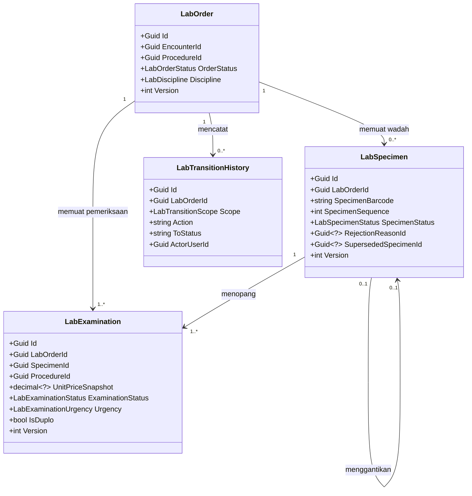
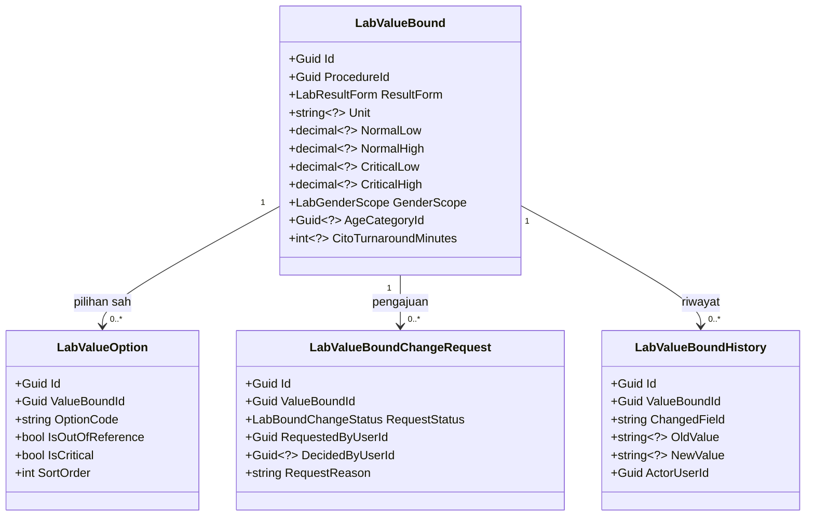
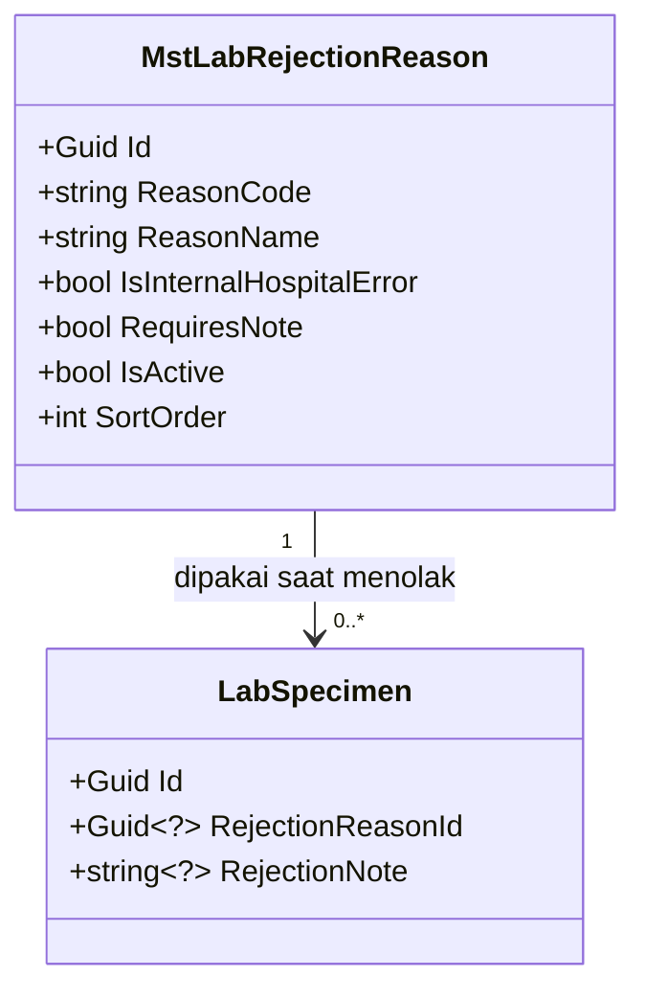
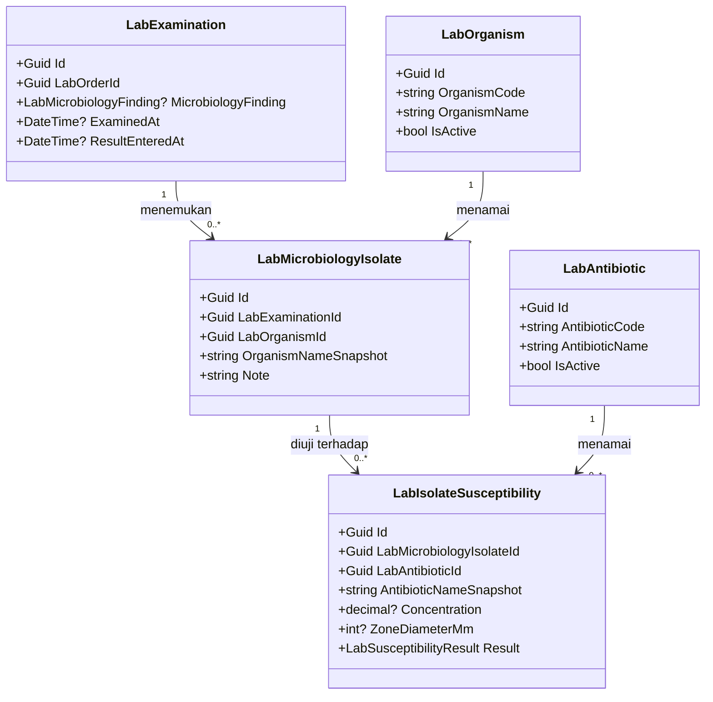
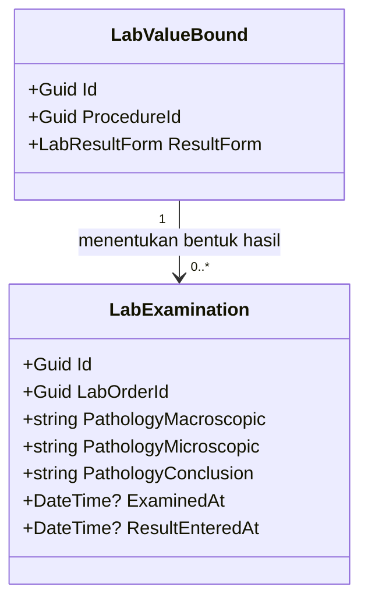
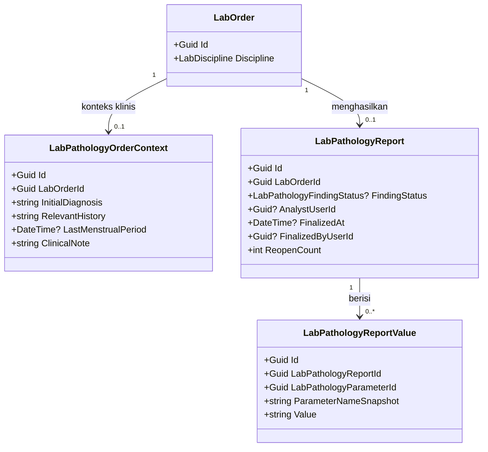
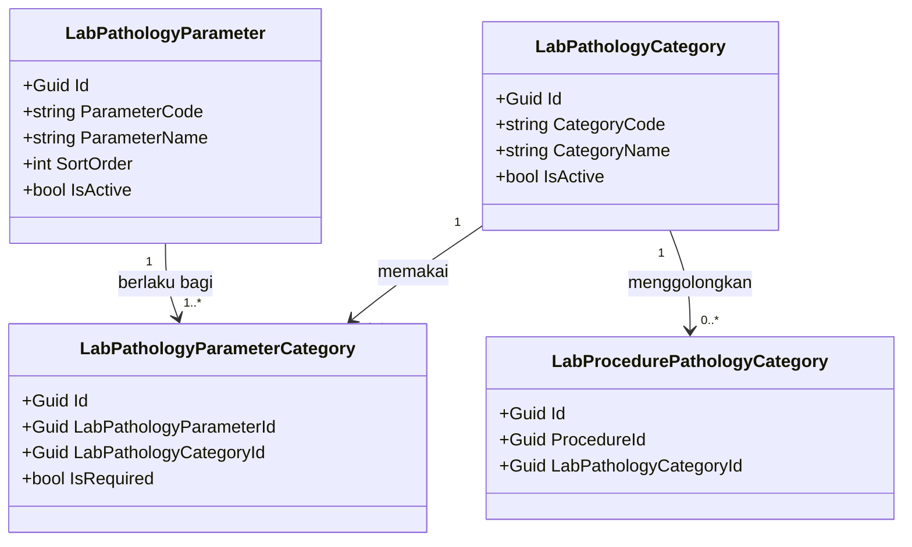

# Laboratorium — Arsitektur Backend

| Field | Value |
|---|---|
| Blueprint ID | `LAB-BP-001` |
| Revision | `8` |
| Status | `draft` |
| Scope | Slice `S1a`, `S2`, `S3`, `S7`, `S10`, `S11`, `S13a`, `S13b`, `S14`, `S15`. **Revision 4 menambah amandemen Penerimaan Sampling/Specimen** — lihat bagian 11 |
| Backend SHA | Revision 1-3: `c87d9c0`. **Revision 4: `466a7127`**, diverifikasi tidak berubah pada `9067fa73` |
| Frontend SHA | Revision 1-3: `688daff90`. **Revision 4: `9cd4cd03f`** |
| Masukan | Revision 1-3: decisions rev 20; capability map rev 2; `LAB-RCG-001` rev 5; `LAB-DA-001` rev 4; `LAB-REC-001` rev 2. **Revision 4: decisions rev 26; capability map rev 3** |
| Kesiapan arsitektur domain | `DOMAIN_ARCHITECTURE_READY` untuk kesepuluh slice |

> **Perubahan revision 2.** Analisis konsolidasi bukti lapangan diadopsi lewat `LAB-DEC-025`
> sampai `LAB-DEC-031`:
>
> 1. `LabOrder` mendapat kolom `Discipline` (`LAB-DEC-025`).
> 2. Kolom kesegeraan **tidak jadi** ditambahkan ke `LabOrder`. Cito dan Duplo pindah ke
>    `LabExamination` (`LAB-DEC-026`).

> **Perubahan revision 3.** Empat slice ditambahkan setelah gerbangnya terbuka:
>
> 1. **`S13a` dan `S13b`** — pendaftaran pasien datang langsung dan rujukan luar. Laboratorium
>    **memanggil** Registrasi, tidak menulis kunjungan (`LAB-DEC-032`, `LAB-DEC-035`).
> 2. **`S14`** — katalog, harga, dan cakupan penjamin. **Baca saja**, tanpa tabel baru
>    (`LAB-DEC-029`, `LAB-DEC-033`).
> 3. **`S15`** — monitoring per disiplin, diturunkan dari `LabOrder.Discipline`.
> 4. Penempatan data induk backend mengikuti cakupan pemakaian (`LAB-DEC-034`).
> 5. Tiga perubahan pada tabel milik modul lain dicatat pada bagian 2.
>
> **Nol tabel baru milik Laboratorium** ditambahkan oleh keempat slice ini.
>
> Yang **masih belum** dirancang: bentuk hasil mikrobiologi dan patologi anatomi
> (`LAB-DEC-027`), karena slice hasil tertahan `LAB-SIGN-001` dan `LAB-P0-001`.

> **Batas dokumen ini.** Ini rancangan, bukan izin menulis kode. Tidak ada migration yang
> dibuat, tidak ada endpoint yang dibangun, dan tidak ada source yang disentuh. Approval tetap
> tindakan manusia.
>
> **Yang tidak dirancang di sini:** hasil pemeriksaan, nilai kritis, koreksi hasil,
> pemberitahuan, pendaftaran ke rekam medis, dan penghapusan status `Draft`. Keenamnya masih
> terblokir dan **tidak boleh** diselundupkan masuk.

---

## 1. Bounded Context dan Ownership

| Bounded context | Peran modul ini | Aggregate root | Transaction boundary |
|---|---|---|---|
| `BC-LAB` Operasional Laboratorium | **Pemilik** | `LabOrder`, `LabValueBound`, `MstLabRejectionReason` | Satu transaksi per perintah bisnis atas satu aggregate |
| `BC-REG` Registrasi | Pemakai | — | Dibaca saja |
| `BC-MD` Data Induk | Pemakai | — | Dibaca saja, disalin sesaat |
| `BC-BIL` Billing | Penerima fakta | — | Fakta terbit di dalam transaksi yang sama dengan perpindahan status |
| `BC-PLAT` Platform | Pemakai | — | Pemeriksaan kewenangan di luar transaksi |

### Invariant yang dijaga transaction boundary

| ID | Invariant | Cara dijaga |
|---|---|---|
| `INV-02` | Wadah tidak dapat dinyatakan layak tanpa melewati penerimaan | Pemeriksaan status di dalam transaksi |
| `INV-05` | Dua petugas menyatakan layak bersamaan, hanya satu berhasil | `Version` sebagai concurrency token |
| `INV-06` | Penetapan layak berulang tidak menggandakan kelayakan tagih | Idempotensi pada penerbitan fakta |
| `INV-13` | Perubahan batas kritis tidak berlaku sebelum disetujui | Perubahan ditulis ke tabel pengajuan, bukan ke tabel batas |
| `INV-20` | Penolakan wadah menggugurkan seluruh pemeriksaan yang ditopangnya | Satu transaksi menyentuh wadah beserta seluruh pemeriksaannya |

---

## 2. Tabel Kepemilikan Data

Ini pertahanan langsung terhadap duplikasi entity.

| Kelompok data | Modul pemilik | Dipakai modul ini | Dibuat ulang di modul ini |
|---|---|:---:|---|
| Pasien | Patient Management | Ya, lewat kunjungan | **Tidak** |
| Dokter dan tenaga kerja | HR / Master Data | Ya, lewat kunjungan | **Tidak** |
| Kunjungan pasien (*encounter*) | Registration Management | Ya | **Tidak** |
| Jenis pemeriksaan (`MstProcedure`) | Health Services Master Data | Ya | **Tidak** |
| Tarif pemeriksaan | Health Services Master Data | Ya | **Tidak** — hanya disalin sesaat ke baris pemeriksaan |
| Identitas pengguna dan kewenangan | Platform / Security | Ya | **Tidak** |
| Tagihan, invoice, pembayaran | Billing dan Kasir | **Tidak** | **Tidak** — Laboratorium hanya mengirim fakta |
| Pesanan laboratorium | **Laboratorium** | Ya | Ya, sudah ada |
| Wadah fisik sampel | **Laboratorium** | Ya | Ya, sudah ada, **diperbarui** |
| Pemeriksaan terpesan | **Laboratorium** | Ya | Ya, **baru** — dipisahkan dari wadah oleh `LAB-DEC-024` |
| Batas nilai pemeriksaan | **Laboratorium** | Ya | Ya, **baru** |
| Alasan penolakan sampel | **Laboratorium** | Ya | Ya, sudah ada |
| Riwayat perpindahan status | **Laboratorium** | Ya | Ya, sudah ada |
| Dokumen rekam medis | Medical Record Management | **Tidak pada rilis ini** | **Tidak** |
| Pemberitahuan pengguna | Platform (belum ada) | **Tidak pada rilis ini** | **Tidak** |
| **Instansi perujuk** | Health Services Master Data | Ya | **Tidak** — data induk **baru milik Master Data** (`LAB-DEC-035`) |
| **Dokter perujuk** | Health Services Master Data | Ya | **Tidak** — data induk **baru milik Master Data** (`LAB-DEC-035`) |
| **Cakupan penjamin** | Health Services Master Data | Ya | **Tidak** — `MstInsuranceTariff` dibaca apa adanya |

### Perubahan pada tabel milik modul lain

Tiga perubahan berikut menyentuh tabel yang **bukan milik Laboratorium**. Seluruhnya
memerlukan izin pemiliknya dan **tidak boleh** dikerjakan sebagai bagian task Laboratorium.

| Perubahan | Tabel | Pemilik | Koordinasi |
|---|---|---|---|
| Tambah kolom klasifikasi disiplin | `MstProcedure` | Health Services Master Data | `LAB-COORD-005` |
| Dua data induk baru: instansi dan dokter perujuk | — | Health Services Master Data | `LAB-COORD-004` |
| Kolom penunjuk instansi dan dokter perujuk | `TrxPatientEncounter` | Registration Management | `LAB-COORD-004` |

**Yang Laboratorium kerjakan sendiri:** memanggil, membaca, dan menyajikan. Tidak menulis.

---

## 3. Class Diagram

Dipecah per kelompok proses agar tiap diagram muat dibaca dalam satu layar.

### 3.1 Pesanan, wadah, dan pemeriksaan



### 3.2 Batas nilai dan persetujuan klinis



### 3.3 Alasan penolakan



---

## 4. Penjelasan Setiap Class

### 4.1 `LabOrder`

| Aspek | Penjelasan |
|---|---|
| **Status** | `Diperbarui` |
| **Lokasi file** | `Areas/HealthServices/LaboratoryManagement/Models/LabOrder.cs` |
| Kategori | Transaksi Laboratorium |
| Tanggung jawab utama | Menyimpan satu permintaan pemeriksaan dari dokter untuk satu kunjungan pasien, beserta keadaan operasionalnya. Tidak menyimpan satu pun angka uang |
| Field penting | `EncounterId`, `ProcedureId`, `OrderStatus`, `StatusBeforeHold`, **`Discipline` (baru)**, `Version` |
| Kolom yang ditambahkan | `Discipline` — Patologi Klinik, Patologi Anatomi, atau Mikrobiologi (`LAB-DEC-025`) |
| Kolom yang **tidak jadi** ditambahkan | `Urgency`, `UrgencyMarkedAt`, `UrgencyMarkedByUserId` — dipindahkan ke `LabExamination` oleh `LAB-DEC-026` |
| Navigation property dan relasi | Menunjuk `TrxPatientEncounter` dan `MstProcedure`; memiliki banyak `LabSpecimen` dan banyak `LabExamination` |
| Pemakaian dalam alur bisnis | Dibuat dokter saat memesan pemeriksaan. Ditandai cito pada saat yang sama bila perlu |
| Catatan desain | `ProcedureId` dipertahankan sebagai pemeriksaan yang dipesan pertama dan **tidak** lagi menjadi satu-satunya sumber komponen. Jangan menambahkan kolom finansial apa pun |
| Ekuivalen model lama | — |

### 4.2 `LabSpecimen`

| Aspek | Penjelasan |
|---|---|
| **Status** | `Diperbarui` — perubahan besar |
| **Lokasi file** | `Areas/HealthServices/LaboratoryManagement/Models/LabSpecimen.cs` |
| Kategori | Transaksi Laboratorium |
| Tanggung jawab utama | Mewakili **satu wadah nyata** berisi bahan dari pasien: satu tabung atau satu pot, satu barcode, satu peristiwa pengambilan, dan satu keputusan layak atau tolak |
| Field penting | `LabOrderId`, `SpecimenBarcode`, `SpecimenSequence`, `SpecimenStatus`, `StatusBeforeHold`, jejak `Collected/Received/Decided`, `RejectionReasonId`, `SupersededSpecimenId`, `RecollectionCause`, `Version` |
| Kolom yang **dipindahkan keluar** | `ProcedureId`, `ProcedureCodeSnapshot`, `ProcedureNameSnapshot`, `TariffId`, `TariffCodeSnapshot`, `UnitPriceSnapshot` — seluruhnya pindah ke `LabExamination` |
| Navigation property dan relasi | Milik `LabOrder`; menunjuk `MstLabRejectionReason` dan wadah yang digantikan; **menopang banyak** `LabExamination` |
| Pemakaian dalam alur bisnis | Dibuat saat merencanakan pengambilan, lalu berjalan sampai dinyatakan layak atau ditolak |
| Catatan desain | Setelah `LAB-DEC-024`, wadah **tidak lagi** membawa jenis pemeriksaan maupun tarif. Menolak wadah menggugurkan seluruh pemeriksaan yang ditopangnya — tidak boleh ada jalur menolak sebagian |
| Ekuivalen model lama | Dirinya sendiri sebelum pemisahan |

### 4.3 `LabExamination`

| Aspek | Penjelasan |
|---|---|
| **Status** | `Baru` |
| **Lokasi file** | `Areas/HealthServices/LaboratoryManagement/Models/LabExamination.cs` |
| Kategori | Transaksi Laboratorium |
| Tanggung jawab utama | Mewakili **satu jenis pemeriksaan yang dipesan**. Inilah satuan yang ditagihkan, dan kelak satuan yang punya hasil |
| Field penting | `LabOrderId`, `SpecimenId`, `ProcedureId`, `ProcedureCodeSnapshot`, `ProcedureNameSnapshot`, `TariffId`, `TariffCodeSnapshot`, `UnitPriceSnapshot`, `ExaminationStatus`, `ChargeEligibleAt`, **`Urgency`**, **`UrgencyMarkedAt`**, **`UrgencyMarkedByUserId`**, **`IsDuplo`**, `Version` |
| Kolom kesegeraan | Cito dan Duplo melekat di sini, **bukan** pada pesanan (`LAB-DEC-026`). Satu pesanan boleh memuat pemeriksaan cito dan biasa sekaligus |
| Navigation property dan relasi | Milik `LabOrder`; ditopang tepat satu `LabSpecimen`; menunjuk `MstProcedure` |
| Pemakaian dalam alur bisnis | Dibuat bersamaan dengan rencana wadah. Menjadi layak tagih ketika wadah penopangnya dinyatakan layak |
| Catatan desain | Salinan tarif disimpan di sini, bukan di wadah. Satu wadah boleh menopang beberapa baris ini. Kolom hasil **tidak** ditambahkan pada rilis ini karena slice hasil masih terblokir |
| Ekuivalen model lama | Bagian dari `LabSpecimen` sebelum pemisahan |

### 4.4 `LabValueBound`

| Aspek | Penjelasan |
|---|---|
| **Status** | `Baru` |
| **Lokasi file** | `Areas/HealthServices/LaboratoryManagement/Models/LabValueBound.cs` |
| Kategori | Data induk khusus Laboratorium |
| Tanggung jawab utama | Menyimpan batas nilai satu jenis pemeriksaan untuk satu kelompok pasien: satuan, batas normal, batas kritis, dan batas waktu cito |
| Field penting | `ProcedureId`, `ResultForm`, `Unit`, `NormalLow`, `NormalHigh`, `CriticalLow`, `CriticalHigh`, `GenderScope`, `AgeCategoryId`, `CitoTurnaroundMinutes`, `IsActive` |
| Navigation property dan relasi | Menunjuk `MstProcedure` dan `MstAgeCategory`; memiliki banyak `LabValueOption`, `LabValueBoundChangeRequest`, dan `LabValueBoundHistory` |
| Pemakaian dalam alur bisnis | Dipakai saat menilai hasil dan saat menghitung keterlambatan cito |
| Catatan desain | Satu jenis pemeriksaan boleh punya beberapa baris. Kombinasi `ProcedureId` + `GenderScope` + `AgeCategoryId` wajib unik. Batas kritis **tidak boleh** diubah langsung — perubahannya lewat pengajuan |
| Ekuivalen model lama | — |

### 4.5 `LabValueOption`

| Aspek | Penjelasan |
|---|---|
| **Status** | `Baru` |
| **Lokasi file** | `Areas/HealthServices/LaboratoryManagement/Models/LabValueOption.cs` |
| Kategori | Data induk khusus Laboratorium |
| Tanggung jawab utama | Menyimpan satu pilihan sah untuk pemeriksaan berbentuk pilihan, misalnya `+3` pada protein urin, beserta penanda apakah pilihan itu di luar rujukan atau kritis |
| Field penting | `ValueBoundId`, `OptionCode`, `OptionName`, `IsOutOfReference`, `IsCritical`, `SortOrder` |
| Navigation property dan relasi | Milik `LabValueBound` |
| Pemakaian dalam alur bisnis | Menjadi daftar pilihan yang boleh diisi analis, dan dasar penilaian kritis |
| Catatan desain | Hanya diisi bila `ResultForm` bernilai pilihan. Penanda `IsCritical` mengikuti aturan persetujuan yang sama dengan batas kritis angka |
| Ekuivalen model lama | — |

### 4.6 `LabValueBoundChangeRequest`

| Aspek | Penjelasan |
|---|---|
| **Status** | `Baru` |
| **Lokasi file** | `Areas/HealthServices/LaboratoryManagement/Models/LabValueBoundChangeRequest.cs` |
| Kategori | Transaksi Laboratorium |
| Tanggung jawab utama | Menampung usulan perubahan batas kritis sampai pihak klinis memutuskan. Selama berstatus diajukan, batas yang berlaku **tidak** berubah |
| Field penting | `ValueBoundId`, `RequestStatus`, `ProposedCriticalLow`, `ProposedCriticalHigh`, `ProposedCriticalOptionCodes`, `RequestReason`, `RequestedByUserId`, `DecidedByUserId`, `DecisionNote` |
| Navigation property dan relasi | Milik `LabValueBound` |
| Pemakaian dalam alur bisnis | Dibuat kepala instalasi, diputuskan pihak klinis |
| Catatan desain | Jangan menerapkan perubahan langsung ke `LabValueBound` sebelum berstatus disetujui |
| Ekuivalen model lama | — |

### 4.7 `LabValueBoundHistory`

| Aspek | Penjelasan |
|---|---|
| **Status** | `Baru` |
| **Lokasi file** | `Areas/HealthServices/LaboratoryManagement/Models/LabValueBoundHistory.cs` |
| Kategori | Transaksi Laboratorium |
| Tanggung jawab utama | Menyimpan setiap perubahan batas nilai secara permanen: kolom apa, dari berapa ke berapa, oleh siapa, disetujui siapa, kapan, dan alasannya |
| Field penting | `ValueBoundId`, `ChangedField`, `OldValue`, `NewValue`, `ActorUserId`, `ApprovedByUserId`, `ChangeReason`, `OccurredAt` |
| Navigation property dan relasi | Milik `LabValueBound` |
| Pemakaian dalam alur bisnis | Terisi otomatis setiap kali batas berubah, baik batas normal maupun batas kritis |
| Catatan desain | Tidak pernah diubah dan tidak pernah dihapus |
| Ekuivalen model lama | — |

### 4.8 `MstLabRejectionReason`

| Aspek | Penjelasan |
|---|---|
| **Status** | `Sudah ada` |
| **Lokasi file** | `Areas/HealthServices/LaboratoryManagement/Models/MstLabRejectionReason.cs` |
| Kategori | Data induk Laboratorium |
| Tanggung jawab utama | Daftar alasan penolakan sampel yang terkendali |
| Field penting | `ReasonCode`, `ReasonName`, `Description`, `IsInternalHospitalError`, `RequiresNote`, `IsActive`, `SortOrder` |
| Navigation property dan relasi | Dipakai banyak `LabSpecimen` |
| Pemakaian dalam alur bisnis | Dipilih petugas saat menolak wadah |
| Catatan desain | `IsInternalHospitalError` dan `RequiresNote` **tidak boleh** diubah lewat endpoint pengelolaan Laboratorium. Lokasi file menyimpang dari pola standar — lihat bagian 5 |
| Ekuivalen model lama | — |

### 4.9 `LabTransitionHistory`

| Aspek | Penjelasan |
|---|---|
| **Status** | `Diperbarui` |
| **Lokasi file** | `Areas/HealthServices/LaboratoryManagement/Models/LabTransitionHistory.cs` |
| Kategori | Transaksi Laboratorium |
| Tanggung jawab utama | Menyimpan setiap perpindahan status yang penting, secara permanen |
| Kolom yang ditambahkan | `LabExaminationId` — agar perpindahan status pemeriksaan ikut terlacak |
| Field penting | `LabOrderId`, `LabSpecimenId`, **`LabExaminationId` (baru)**, `EncounterId`, `Scope`, `Action`, `FromStatus`, `ToStatus`, `ReasonCode`, `ReasonNote`, `ActorUserId`, `OccurredAt`, `CorrelationId` |
| Catatan desain | Nilai baru `LabExamination` ditambahkan pada `LabTransitionScope`. Baris riwayat tidak pernah diubah |
| Ekuivalen model lama | — |

### 4.10 Service

| Service | Status | Lokasi file | Fungsi utama | Dipanggil oleh | Membuka transaksi |
|---|---|---|---|---|:---:|
| `LabOrderService` | `Diperbarui` | `Areas/HealthServices/LaboratoryManagement/Services/LabOrderService.cs` | Membuat pesanan, memindahkan status pesanan, menandai cito | `LabOrderController` | Ya |
| `LabSpecimenService` | `Diperbarui` | `.../Services/LabSpecimenService.cs` | Siklus hidup wadah; menerbitkan fakta per pemeriksaan yang ditopang | `LabSpecimenController` | Ya |
| `LabExaminationService` | `Baru` | `.../Services/LabExaminationService.cs` | Menambah dan membatalkan pemeriksaan terpesan, menautkannya ke wadah, menyalin tarif | `LabExaminationController` | Ya |
| `LabValueBoundService` | `Baru` | `.../Services/LabValueBoundService.cs` | Mengelola batas nilai, menampung pengajuan perubahan batas kritis, menulis riwayat | `LabValueBoundController` | Ya |
| `LabWorklistService` | `Baru` | `.../Services/LabWorklistService.cs` | Menyusun daftar kerja dan daftar pantau keterlambatan cito | `LabWorklistController` | **Tidak** — hanya membaca |
| `LabRejectionReasonService` | `Baru` | `.../Services/LabRejectionReasonService.cs` | Mengelola alasan penolakan dengan dua tingkat kewenangan | `LabRejectionReasonController` | Ya |
| `LabPatientRegistrationService` | `Baru` | `.../Services/LabPatientRegistrationService.cs` | Menerima isian pendaftaran dari layar Laboratorium, memanggil Registrasi untuk membuat kunjungan, lalu mengembalikan penunjuknya. **Tidak menulis** ke tabel kunjungan maupun pasien | `LabPatientRegistrationController` | Ya — untuk pesanan yang menyusul; pembuatan kunjungan tetap transaksi milik Registrasi |
| `LabCatalogService` | `Baru` | `.../Services/LabCatalogService.cs` | Menyajikan katalog pemeriksaan laboratorium, harga berlaku, dan cakupan penjamin. **Baca saja** | `LabCatalogController` | **Tidak** |

### Catatan penting tentang `LabPatientRegistrationService`

Service ini **bukan** service pendaftaran. Ia adalah **penerus permintaan**. Tanggung jawabnya
hanya tiga:

1. Memeriksa kelengkapan isian sebelum diteruskan.
2. Memanggil Registrasi dan menunggu jawabannya.
3. Menyimpan penunjuk kunjungan pada pesanan yang menyusul.

Bila Registrasi menolak, service ini **meneruskan penolakan apa adanya** dan tidak membuat data
apa pun. Tidak ada kunjungan setengah jadi yang disimpan Laboratorium.

### Catatan penting tentang `LabCatalogService`

Service ini **tidak membuka transaksi** karena hanya membaca. Ia menggabungkan tiga sumber
milik Master Data:

| Yang dibaca | Dari | Untuk |
|---|---|---|
| Jenis pemeriksaan berpenanda `IsLaboratory` dan disiplinnya | `MstProcedure` | Daftar pemeriksaan yang dapat dipesan |
| Harga berlaku pada tanggal kejadian | `MstTariff` | Kolom harga satuan |
| Kontrak penjamin | `MstInsuranceTariff` | Penanda tercakup atau tidak |

Bila cakupan tidak ditemukan untuk penjamin pasien, pemeriksaan ditampilkan **tidak tercakup** —
itu jawaban yang sah, bukan kesalahan.

### 4.11 Controller

| Controller | Status | Lokasi file | Service yang dipakai | Endpoint yang diurus |
|---|---|---|---|---|
| `LabOrderController` | `Diperbarui` | `Areas/HealthServices/LaboratoryManagement/Controllers/LabOrderController.cs` | `LabOrderService` | Pesanan dan penandaan cito |
| `LabSpecimenController` | `Diperbarui` | `.../Controllers/LabSpecimenController.cs` | `LabSpecimenService` | Siklus hidup wadah |
| `LabExaminationController` | `Baru` | `.../Controllers/LabExaminationController.cs` | `LabExaminationService` | Pemeriksaan terpesan |
| `LabValueBoundController` | `Baru` | `.../Controllers/LabValueBoundController.cs` | `LabValueBoundService` | Batas nilai dan pengajuan perubahan |
| `LabWorklistController` | `Baru` | `.../Controllers/LabWorklistController.cs` | `LabWorklistService` | Daftar kerja dan daftar pantau keterlambatan |
| `LabRejectionReasonController` | `Baru` | `.../Controllers/LabRejectionReasonController.cs` | `LabRejectionReasonService` | Pengelolaan alasan penolakan |
| `LabPatientRegistrationController` | `Baru` | `.../Controllers/LabPatientRegistrationController.cs` | `LabPatientRegistrationService` | Pendaftaran pasien datang langsung dan rujukan luar |
| `LabCatalogController` | `Baru` | `.../Controllers/LabCatalogController.cs` | `LabCatalogService` | Katalog pemeriksaan, harga berlaku, dan cakupan penjamin |

Tidak ada controller pada modul ini yang mengakses `ApplicationDbContext` langsung. Seluruhnya
memakai service, karena seluruh operasinya menyentuh aturan bisnis atau perpindahan status.

---

## 5. Arsitektur Folder

```text
Areas/HealthServices/LaboratoryManagement/
├── Controllers/
│   ├── LabOrderController.cs                    # Diperbarui
│   ├── LabSpecimenController.cs                 # Diperbarui
│   ├── LabExaminationController.cs              # Baru
│   ├── LabValueBoundController.cs               # Baru
│   ├── LabWorklistController.cs                 # Baru
│   ├── LabRejectionReasonController.cs          # Baru
│   ├── LabPatientRegistrationController.cs      # Baru
│   └── LabCatalogController.cs                  # Baru
├── DTOs/
│   ├── LabOrderDtos.cs                          # Diperbarui
│   ├── LabSpecimenDtos.cs                       # Diperbarui
│   ├── LabExaminationDtos.cs                    # Baru
│   ├── LabValueBoundDtos.cs                     # Baru
│   ├── LabWorklistDtos.cs                       # Baru
│   ├── LabRejectionReasonDtos.cs                # Baru
│   ├── LabPatientRegistrationDtos.cs            # Baru
│   └── LabCatalogDtos.cs                        # Baru
├── Enums/
│   └── LaboratoryEnums.cs                       # Diperbarui
├── Models/
│   ├── LabOrder.cs                              # Diperbarui
│   ├── LabSpecimen.cs                        # Diperbarui
│   ├── LabExamination.cs                     # Baru
│   ├── LabTransitionHistory.cs               # Diperbarui
│   ├── LabValueBoundChangeRequest.cs         # Baru
│   ├── LabValueBoundHistory.cs               # Baru
│   ├── MstLabRejectionReason.cs                 # Sudah ada — BENAR di sini, khusus Laboratorium
│   ├── LabValueBound.cs                      # Baru — khusus Laboratorium (LAB-DEC-034)
│   └── LabValueOption.cs                     # Baru — khusus Laboratorium (LAB-DEC-034)
├── Services/
│   ├── LabOrderService.cs                       # Diperbarui
│   ├── LabSpecimenService.cs                    # Diperbarui
│   ├── LabExaminationService.cs                 # Baru
│   ├── LabValueBoundService.cs                  # Baru
│   ├── LabWorklistService.cs                    # Baru
│   ├── LabRejectionReasonService.cs             # Baru
│   ├── LabPatientRegistrationService.cs         # Baru
│   └── LabCatalogService.cs                     # Baru

# Catatan: folder Configurations/ di dalam Areas SUDAH DIHAPUS pada c87d9c0.
# Seluruh configuration kini berada di Repositories/Configurations/ — lihat di bawah.

Areas/HealthServices/MasterData/Models/
└── (tidak ada berkas baru — MstProcedure, MstTariff, MstInsuranceTariff,
     dan MstAgeCategory dipakai apa adanya, tidak disentuh)

Repositories/Configurations/HealthServices/
├── LabOrderConfiguration.cs                     # Sudah ada — utang teknis tersisa, di luar folder submodul
└── LaboratoryManagement/                        # SUDAH ADA sejak c87d9c0
    ├── LabExaminationConfiguration.cs        # Baru
    ├── LabValueBoundChangeRequestConfiguration.cs  # Baru
    ├── LabValueBoundHistoryConfiguration.cs  # Baru
    ├── LabValueBoundConfiguration.cs         # Baru
    └── LabValueOptionConfiguration.cs        # Baru

Migrations/
└── <timestamp>_SplitLabSpecimenIntoExamination.cs   # Baru
└── <timestamp>_AddLabOrderDiscipline.cs             # Baru
└── <timestamp>_AddLabValueBound.cs                  # Baru
```

### Kepatuhan terhadap kontrak engineering canonical

Dokumen tata kelola yang selama ini dianggap hilang **ternyata ada**. Rinciannya pada
`LAB-OPEN-002`. Setelah dibaca, rancangan revision 1 dan 2 ternyata **melanggar dua aturan**.
Keduanya sudah diperbaiki pada revision 3.

#### Pelanggaran `QBE-NAM-001` — sudah diperbaiki

`BACKEND_ENGINEERING_CONTRACT.md` menyatakan: *"MUST NOT / NEW CODE: memakai `Trx*` untuk
entity, file, configuration, atau DbSet operasional."*

Nama entity baru berbentuk `<PrefixPemilikDisetujui><KonsepBisnis>`, dan registry menetapkan
prefix Laboratorium adalah **`Lab`**.

| Nama pada revision 1-2 | Nama yang benar | Alasan |
|---|---|---|
| `TrxLabExamination` | **`LabExamination`** | `Trx*` dilarang untuk kode baru |
| `TrxLabValueBoundChangeRequest` | **`LabValueBoundChangeRequest`** | Sama |
| `TrxLabValueBoundHistory` | **`LabValueBoundHistory`** | Sama |

**Kenapa `LabOrder` yang sudah ada justru benar.** Ia berbentuk `Lab` + `Order`, tanpa `Trx` —
persis contoh yang dipakai kontrak itu sendiri.

**Yang tetap memakai `Trx*` dan sengaja tidak diubah:** `LabSpecimen` dan
`LabTransitionHistory`. Keduanya **legacy yang sudah berjalan**. Kontrak menyatakan
`UNTOUCHED LEGACY` **MUST NOT** memicu penulisan ulang massal, dan normalisasi legacy adalah
kampanye tersendiri yang harus dinyatakan eksplisit.

#### Prefix data induk milik Laboratorium — belum pasti

`LabValueBound` dan `LabValueOption` adalah **kode baru**, sehingga `QBE-NAM-002` berlaku:
wajib memakai prefix registry milik pemiliknya.

Persoalannya, registry punya dua baris yang sama-sama masuk akal:

| Baris registry | Prefix | Bila dipakai |
|---|---|---|
| `Administrator / HealthServices` — Master / Reference | `Mst` | `LabValueBound`, mengikuti `MstLabRejectionReason` yang sudah ada |
| `HealthServices` — LaboratoryManagement / Laboratory | `Lab` | `LabValueBound`, mengikuti aturan `<PrefixPemilik><Konsep>` karena pemiliknya Laboratorium |

`QBE-NAM-004` melarang menyimpulkan prefix sendiri. Karena itu blueprint ini **tidak memutuskan**
dan mencatatnya sebagai `LAB-OPEN-018`. Sampai dijawab pemilik registry, penamaan kedua data
induk itu berstatus **belum final**.

#### Lifecycle Laboratorium masih `PLANNED`

Registry mencatat `LaboratoryManagement / Laboratory` dengan Lifecycle **`PLANNED`**, dan
menyatakan tegas:

> *"Persetujuan registry hanya memberi wewenang penamaan dan kepemilikan. Ia **tidak** memberi
> wewenang implementasi, migration, pekerjaan database, deployment, maupun aktivasi modul
> berstatus `PLANNED`."*

Artinya, walaupun `LabOrder` dan siklus hidup wadah sudah berjalan di produksi, modul ini secara
registry **belum berwenang** menjalankan implementasi dan migration. Dicatat sebagai
`LAB-OPEN-019` dan **memblokir seluruh gelombang MVP**.

### Aturan penempatan data induk (`LAB-DEC-034`)

| Cakupan | Letaknya | Contoh pada modul ini |
|---|---|---|
| **Khusus Laboratorium** | `Areas/HealthServices/LaboratoryManagement/Models/` | `MstLabRejectionReason`, `LabValueBound`, `LabValueOption` |
| **Global, dipakai lintas modul** | `Areas/HealthServices/MasterData/Models/` | `MstProcedure`, `MstTariff`, `MstInsuranceTariff`, `MstAgeCategory` — **tidak disentuh** |

Aturan ini mengikuti pola nyata pada `c87d9c0`: **20 data induk khusus modul** sudah berada di
folder modulnya — HR Service, Lifecycle, Recruitment, Workforce Planning, Pharmacy, dan
Laboratorium sendiri — sementara 61 data induk lintas modul berada di `MasterData/Models/`.

> **Koreksi terhadap dokumen aturan.** `backend-structure-rules.md` menyatakan seluruh data
> induk berada di `MasterData/Models/`, dengan contoh `MstEmergencyTriageLevel`. Berkas contoh
> itu **tidak ditemukan** pada `c87d9c0`, dan pola nyatanya adalah pemisahan menurut cakupan.
> Karena itu penempatan `MstLabRejectionReason` di folder Laboratorium **bukan penyimpangan**.

### Utang teknis — satu sudah diperbaiki tim, satu tersisa

| Penyimpangan | Keadaan pada `c87d9c0` | Status |
|---|---|---|
| Configuration di dalam `Areas/` | `LaboratoryManagementConfigurations.cs` **sudah dihapus**. Ketiga configuration kini berada di `Repositories/Configurations/HealthServices/LaboratoryManagement/`, satu berkas per entity | ✅ **Sudah diperbaiki tim** |
| Configuration tanpa folder submodul | `Repositories/Configurations/HealthServices/LabOrderConfiguration.cs@c87d9c0` masih berada langsung di bawah domain, bukan di dalam `LaboratoryManagement/` | ⚠️ **Masih ada** |

Yang tersisa **tidak** dirapikan oleh pekerjaan ini. Perapian wajib menjadi task tersendiri pada
roadmap, dengan approval pemilik arsitektur backend.

**Catatan yang menguatkan koreksi penamaan.** Pada rentang `9124900..c87d9c0`, tim menjalankan
migration `RenameClinicalMilestoneFactToCliPrefix` yang mengubah `TrxClinicalMilestoneFact`
menjadi **`CliClinicalMilestoneFact`** — persis pola `<PrefixPemilik><Konsep>` yang diwajibkan
`QBE-NAM-001`. Koreksi penamaan pada blueprint ini — `TrxLabExamination` menjadi
`LabExamination` — berjalan searah dengan normalisasi yang memang sedang dikerjakan tim.

Berkas **baru** pada blueprint ini mengikuti pola standar, bukan meniru penyimpangan.

> **Satu penyimpangan dicabut dari daftar ini.** Revision 1 mencantumkan "Master di dalam
> folder submodul" sebagai utang teknis. Setelah `LAB-DEC-034`, penempatan itu justru yang
> benar. Butirnya dihapus, bukan diperbaiki.
>
> `backend-structure-rules.md` juga menyebut penyimpangan
> `Repositories/Configurations/HealthService/` dengan bentuk tunggal. Pada `c87d9c0` folder
> yang ada adalah bentuk jamak, sesuai pola standar. Penyimpangan itu **sudah tidak ada**.

---

## 6. Status Model dan Dampak Migration

| Model | Status | Kolom yang berubah | Dampak migration |
|---|---|---|---|
| `LabOrder` | `Diperbarui` | **Tambah** `Discipline` | Tambah kolom, dapat dijalankan tanpa mematikan layanan |
| `LabSpecimen` | `Diperbarui` | **Hapus** `ProcedureId`, `ProcedureCodeSnapshot`, `ProcedureNameSnapshot`, `TariffId`, `TariffCodeSnapshot`, `UnitPriceSnapshot` | **Perubahan besar.** Data lama wajib dipindahkan lebih dulu |
| `LabExamination` | `Baru` | Seluruh kolom | Tabel baru |
| `LabTransitionHistory` | `Diperbarui` | **Tambah** `LabExaminationId` | Tambah kolom, aman |
| `LabValueBound` | `Baru` | Seluruh kolom | Tabel baru, di folder Laboratorium (`LAB-DEC-034`) |
| `LabValueOption` | `Baru` | Seluruh kolom | Tabel baru, di folder Laboratorium (`LAB-DEC-034`) |
| `LabValueBoundChangeRequest` | `Baru` | Seluruh kolom | Tabel baru |
| `LabValueBoundHistory` | `Baru` | Seluruh kolom | Tabel baru |
| `MstLabRejectionReason` | `Sudah ada` | Tidak ada | Tidak ada |
| `LaboratoryEnums` | `Diperbarui` | **Tambah** `LabDiscipline`, `LabExaminationUrgency`, `LabExaminationStatus`, `LabResultForm`, `LabGenderScope`, `LabBoundChangeStatus`; **tambah nilai** `LabExamination` pada `LabTransitionScope` | Enum disimpan sebagai `int`; nilai baru tidak mengubah nilai lama |

---

## 7. Rencana Migration

> **Prasyarat mutlak.** `LAB-OPEN-012` wajib dijawab lebih dulu: berapa banyak baris
> `LabSpecimen` yang benar-benar ada di basis data produksi. Selama belum dijawab, langkah 3
> **tidak boleh** dijalankan.

| Urutan | Migration | Tanpa mematikan layanan | Pengisian data lama | Langkah mundur |
|---:|---|:---:|---|---|
| 1 | `AddLabOrderDiscipline` | Ya | `Discipline` diisi Patologi Klinik untuk seluruh baris lama | Hapus satu kolom |
| 2 | `AddLabValueBound` | Ya | Tabel baru, kosong. Diisi lewat rencana data master awal | Hapus empat tabel baru |
| 3 | `SplitLabSpecimenIntoExamination` | **Tidak** | Setiap baris `LabSpecimen` lama menjadi **satu wadah + satu pemeriksaan**. Salinan tarif berpindah ke baris pemeriksaan. Barcode tetap pada wadah | Gabungkan kembali; hanya aman bila belum ada wadah yang menopang lebih dari satu pemeriksaan |

### Rincian langkah 3

Pemindahan data lama bersifat satu ke satu, sehingga tidak ada informasi yang hilang:

| Data lama | Menjadi |
|---|---|
| Satu baris `LabSpecimen` | Satu wadah `LabSpecimen` (barcode, status, jejak waktu, alasan penolakan tetap) |
| `ProcedureId` dan salinan tarif pada baris itu | Satu baris `LabExamination` yang menunjuk wadah tersebut |
| `BilChargeLines.SourceItemId` yang menunjuk sampel lama | **Tidak diubah.** Lihat catatan di bawah |

**Catatan penting tentang tagihan lama.** Baris tagihan yang sudah terbentuk menunjuk
`SourceItemId` berupa identitas sampel lama. Setelah pemisahan, satuan yang setara adalah
identitas pemeriksaan. Agar penelusuran tagihan lama tidak putus, identitas baris pemeriksaan
hasil pemindahan **wajib memakai kembali identitas sampel lama**, bukan identitas acak baru.
Wadah yang mendapat identitas baru.

Bila `LAB-OPEN-012` menunjukkan basis data produksi masih kosong, seluruh kerumitan ini gugur
dan langkah 3 menjadi migration biasa.

---

## 8. Rencana Data Master Awal

Modul dengan tabel master kosong tidak dapat dipakai sama sekali.

| Master | Isi minimum | Sumber nilai |
|---|---|---|
| `MstLabRejectionReason` | Sekurang-kurangnya: sampel menggumpal, volume kurang, wadah salah, sampel keruh atau lisis, label tidak terbaca, sampel bocor, dan satu alasan lain-lain yang menuntut catatan. Penanda kesalahan internal ditetapkan bersama Billing | SOP laboratorium rumah sakit |
| `LabValueBound` | Satu baris untuk setiap jenis pemeriksaan berpenanda `IsLaboratory` yang benar-benar dilayani, dipecah menurut jenis kelamin dan kelompok umur bila memang berbeda | Kepustakaan laboratorium rumah sakit, disahkan pihak klinis |
| `LabValueOption` | Daftar pilihan sah untuk setiap pemeriksaan berbentuk pilihan, misalnya negatif, `+1`, `+2`, `+3`, `+4` untuk protein urin | Kepustakaan laboratorium rumah sakit, disahkan pihak klinis |

**Peringatan.** Batas kritis pada `LabValueBound` dan penanda kritis pada `LabValueOption`
adalah angka keselamatan pasien. Pengisian awalnya **wajib** disahkan pihak klinis, bukan
diisi tim teknis. Warna, batas waktu, dan ambang **tidak boleh** ditulis tetap di dalam
controller maupun frontend.

---

## 9. Yang Sengaja Tidak Dibuat

| Yang ditolak | Alasan |
|---|---|
| `MstLabPatient`, `MstLabDoctor` | Pasien dan dokter dimiliki modul lain; dipakai lewat `EncounterId` |
| `TrxLabResult` dan seluruh turunannya | Slice hasil masih terblokir `LAB-SIGN-001`. Membuatnya sekarang berarti merancang tanpa keputusan |
| `TrxLabCriticalValueReport` | Bagian dari slice nilai kritis yang terblokir |
| `TrxLabNotification` | `LAB-DEC-016` menetapkan pemberitahuan sebagai kemampuan platform, bukan milik Laboratorium |
| Tabel penyimpan daftar kerja | Daftar kerja seluruhnya dapat diturunkan dari pesanan, wadah, dan pemeriksaan. Menyimpannya menciptakan sumber kebenaran kedua yang bisa tidak sinkron |
| Kolom batas nilai pada `MstProcedure` | Satu baris per pemeriksaan tidak dapat menampung batas berbeda menurut jenis kelamin dan umur. Juga akan mengotori tabel milik modul lain |
| Entity terpisah per status | Status adalah keadaan sebuah konsep, bukan konsep baru |
| Kolom finansial apa pun pada model Laboratorium | Dilarang `LAB-INH-012`, dan sudah dijaga pengujian otomatis yang ada |

---

## 10. Traceability

| Requirement / Decision | Diwujudkan oleh | Dibuktikan oleh |
|---|---|---|
| `LAB-DEC-013` + `LAB-DEC-026` cito dan duplo | `LabExamination.Urgency`, `LabExamination.IsDuplo`, `LabValueBound.CitoTurnaroundMinutes`, `LabWorklistService` | AC-10, AC-17, AC-18, AC-39, AC-40 |
| `LAB-DEC-024` pemisahan wadah dan pemeriksaan | `LabSpecimen` diperbarui, `LabExamination` baru | AC-35 sampai AC-38 |
| `LAB-DEC-006`, `LAB-DEC-018` batas nilai | `LabValueBound` | AC-24, AC-25 |
| `LAB-DEC-021` dua bentuk hasil | `LabValueBound.ResultForm`, `LabValueOption` | AC-28, AC-29, AC-30 |
| `LAB-DEC-023` perlindungan batas kritis | `LabValueBoundChangeRequest`, `LabValueBoundHistory` | AC-33, AC-34 |
| `LAB-DEC-019` alasan penolakan | `LabRejectionReasonService` dengan dua tingkat kewenangan | AC-26 |
| `LAB-INH-009` sampai `LAB-INH-012` | Fakta terbit per pemeriksaan; tanpa kolom finansial | AC-12, AC-13, AC-37 |
| `LAB-DEC-009` multi-unit | `LabOrder.EncounterId` tanpa pembatasan jenis kunjungan | AC-11 |

---

## 11. Amandemen 2026-09-14 — Penerimaan Sampling/Specimen

Menurunkan `LAB-DEC-038`, `LAB-DEC-039`, `LAB-DEC-040`, `LAB-DEC-041`, `LAB-DEC-042`, dan
`LAB-DEC-045` dari decision log revision 26.

> **Batas amandemen ini.** Dua bagian menu Penerimaan Sampling/Specimen **tidak dirancang di
> sini** karena masih terblokir `LAB-REQ-005`: pengusulan instansi perujuk (`LAB-DEC-043`,
> `LAB-COORD-006`) dan metode pembayaran (`LAB-DEC-046`, `LAB-DEC-047`, `LAB-COORD-007`).
> Keduanya disediakan **titik sambungnya** pada bagian 11.9, tanpa kontrak yang dikunci.

### 11.1 Gerbang prefix — sudah terbuka

`MODULE_OWNERSHIP_PREFIX_REGISTRY.md` baris 21 mencatat `HealthServices |
LaboratoryManagement / Laboratory | BUSINESS DOMAIN / MODULE | Lab | ACTIVE`, dinaikkan dari
`PLANNED` pada 2026-09-02 oleh Muhammad Hamzah lewat `LAB-REQ-002`. Penghalang `QBE-MOD-002`
atas entity operasional `Lab*` dan atas migration modul Laboratorium **sudah dicabut**.

Baris riwayat yang sama menetapkan satu hal yang menentukan bentuk amandemen ini:

> *"Sekaligus menetapkan prefix data induk milik Laboratorium: entity baru memakai `Lab`,
> sehingga dua tabel batas nilai bernama `LabValueBound` dan `LabValueOption`;
> `MstLabRejectionReason` yang sudah ada diperlakukan legacy dan tidak dinamai ulang."*

Karena itu data induk jenis specimen bernama **`LabSpecimenType`**, bukan
`MstLabSpecimenType`, dan tinggal di folder Laboratorium — bukan di `MasterData`.

### 11.2 Tabel kepemilikan data — tambahan

| Kelompok data | Modul pemilik | Dipakai modul ini | Dibuat ulang di sini |
|---|---|---|---|
| Jenis specimen | **Laboratorium** | Ya — dimiliki | Tidak, baru |
| **Satuan ukur** (`MstMeasurement`) | `master-data` | Ya — dibaca | **Tidak.** Dipakai ulang, lihat 11.4 |
| Wadah specimen (`LabSpecimen`) | Laboratorium | Ya — dimiliki | Tidak, diperbarui |
| Baris pemeriksaan (`LabExamination`) | Laboratorium | Ya — dimiliki | **Tidak berubah sama sekali** |

### 11.3 `LabSpecimenType` — `Baru`

| Field | Isi |
|---|---|
| **Status** | `Baru` |
| **Lokasi file** | `Areas/HealthServices/LaboratoryManagement/Models/LabSpecimenType.cs` |
| **Configuration** | `Repositories/Configurations/HealthServices/LaboratoryManagement/LabSpecimenTypeConfiguration.cs` |
| **DbSet** | `DbSet<LabSpecimenType> LabSpecimenTypes` |
| **Tabel** | `public."LabSpecimenType"` |
| **Pemilik** | Laboratorium |
| **Dasar** | `LAB-DEC-040`, BR-35 |

| Kolom | Tipe | Wajib | Bawaan | Batas | Catatan |
|---|---|:---:|---|---|---|
| `Id` | `Guid` | ya | `Guid.NewGuid()` | — | PK |
| `SpecimenTypeCode` | `string` | ya | — | 32 | Unik di antara baris yang belum dihapus |
| `SpecimenTypeName` | `string` | ya | — | 128 | Nama yang dilihat petugas |
| `IsOtherBucket` | `bool` | ya | `false` | — | Penanda baris `Lainnya`. **Hanya satu baris aktif** boleh bernilai benar |
| `SortOrder` | `int` | ya | `0` | — | Urutan tampil |
| `IsActive` | `bool` | ya | `true` | — | Dinonaktifkan, tidak dihapus |
| `Description` | `string?` | tidak | `null` | 256 | Keterangan bagi petugas |

Sepuluh kolom warisan `IdentityModel` tidak diulang di sini.

**Index dan constraint.** Unique atas `SpecimenTypeCode` dengan penyaring `IsDelete = false`.
Index atas `IsActive, SortOrder` untuk daftar pilihan. `DeleteBehavior.Restrict` dari
`LabSpecimen` — jenis yang sudah dipakai wadah **tidak boleh** dihapus.

**Kenapa `IsOtherBucket` berupa kolom, bukan kode tetap `"OTHER"` di dalam source.** Kode
literal di dalam service membuat perilaku wajib-berketerangan bergantung pada ejaan sebuah
string. Satu baris data yang kodenya `OTH` alih-alih `OTHER` akan diam-diam melewati validasi.
Penanda kolom membuat aturannya melekat pada datanya sendiri.

### 11.4 `LabSpecimen` — `Diperbarui`

| Field | Isi |
|---|---|
| **Status** | `Diperbarui` |
| **Lokasi file** | `Areas/HealthServices/LaboratoryManagement/Models/LabSpecimen.cs` |
| **Configuration** | `Repositories/Configurations/HealthServices/LaboratoryManagement/LabSpecimenConfiguration.cs` — `Diperbarui` |
| **Dasar** | `LAB-DEC-040`, `LAB-DEC-041`, `LAB-DEC-042` |

**Empat kolom ditambahkan. Tidak satu pun kolom lama diubah atau dihapus.**

| Kolom | Tipe | Wajib | Bawaan | Catatan |
|---|---|:---:|---|---|
| `SpecimenTypeId` | `Guid?` | lihat catatan | `null` | FK ke `LabSpecimenType`. **Nullable di basis data**, wajib pada API untuk wadah baru — baris lama tidak punya nilainya |
| `SpecimenTypeOtherNote` | `string?` | kondisional | `null` | Wajib bila jenis terpilih ber-`IsOtherBucket`. Batas 128 |
| `VolumeAmount` | `decimal?` | lihat catatan | `null` | `numeric(12,3)`. Nullable di basis data, wajib pada API untuk wadah baru |
| `VolumeUnitId` | `Guid?` | lihat catatan | `null` | FK ke `MstMeasurement`. Wajib bila `VolumeAmount` terisi |
| `PhysicallyReceivedAt` | `DateTime?` | tidak | `null` | Waktu specimen benar-benar diterima, diisi petugas |

**Kenapa keempatnya nullable di basis data.** Tabel `LabSpecimen` sudah berisi data. Kolom
wajib tanpa nilai bawaan yang masuk akal akan menggagalkan migration atau memaksa pengisian
tebakan. Kewajibannya ditegakkan **di lapisan API untuk baris baru**, bukan oleh basis data —
sama seperti pola `Discipline` pada `LabOrder` yang sengaja dibiarkan kosong untuk pesanan
peninggalan.

**`ReceivedAt` tidak disentuh.** Maknanya dipertegas pada dokumentasi kode: *kapan datanya
masuk ke sistem*. `PhysicallyReceivedAt` adalah *kapan wadahnya sampai di meja penerimaan*.
`AC-65` mensyaratkan tidak ada satu pun endpoint yang dapat mengubah `ReceivedAt`.

**Satuan volume dipakai ulang, tidak dibuat baru.** `MstMeasurement@466a7127` sudah punya
`MeasurementCode`, `MeasurementName`, `MeasurementSymbol`, `IsDecimalAllowed`,
`DecimalPrecision`, dan — yang menentukan — penanda **`IsForLaboratory`**. Membuat daftar
satuan sendiri di Laboratorium akan melanggar `AC-49` dan melahirkan dua sumber satuan.

> **Ketidakkonsistenan yang dilaporkan, bukan diperbaiki.** `LabValueBound.Unit@466a7127`
> menyimpan satuan hasil sebagai **string bebas**, bukan penunjuk ke `MstMeasurement`. Volume
> dirancang sebagai penunjuk karena `LAB-DEC-041` justru menuntut satuan yang tidak ambigu.
> Selisih gaya antara keduanya dicatat sebagai utang teknis; `LabValueBound` **tidak** diubah
> oleh amandemen ini karena berada di luar scope-nya.

**Index.** Index atas `SpecimenTypeId` untuk laporan jenis. Index atas `PhysicallyReceivedAt`
untuk laporan penerimaan harian. `DeleteBehavior.Restrict` pada kedua FK baru.

### 11.5 `LabExamination` — **tidak berubah sama sekali**

> **Diamandemen `LAB-DEC-050` pada 2026-09-14.** Bagian ini semula merancang ruas `Quantity`
> pada `CreateLabExaminationRequest` yang memperbanyak baris. **Rancangan itu dicabut** sebelum
> sempat dibangun.

**Kenapa dicabut.** `BE-LAB-23` menemukan `LabExamination` memiliki index unik di tingkat
database atas pasangan `(SpecimenId, ProcedureId)`, dipasang
`LabExaminationConfiguration.cs` atas dasar `BR-20` dan `AC-35` pada 2026-09-01:

```csharp
builder.HasIndex(x => new { x.SpecimenId, x.ProcedureId })
    .IsUnique()
    .HasFilter("\"IsDelete\" = false");
```

`Quantity` bernilai lebih dari satu untuk jenis pemeriksaan yang sama pada wadah yang sama
karena itu **mustahil** — baris kedua ditolak service, dan bila lolos, ditolak database.

**Contoh pada `BR-33` sendiri keliru.** Glukosa Puasa dan Glukosa 2 Jam PP adalah **dua
`MstProcedure` yang berbeda** pada katalog yang tergolong benar; petugas memilih dua butir
katalog, dan Qty tidak diperlukan.

**Keadaan akhir:**

| Hal | Keadaan |
|---|---|
| Tabel `LabExamination` | **Tidak berubah** |
| DTO | **Tidak berubah** — ruas `Quantity` tidak jadi dibuat |
| Service | **Tidak berubah** |
| Migration | **Tidak ada** |
| Kontrak | `LAB-API-v1` `r9` mencabut ruas `Quantity`; `POST /lab-examinations` sama persis dengan `r6` |

`AC-37` tetap berlaku apa adanya: satu wadah layak menerbitkan kelayakan tagih sebanyak
**baris** pemeriksaan yang ditopangnya. `IsDuplo` tetap satu-satunya cara menyatakan pengerjaan
ganda atas satu pemeriksaan (`LAB-DEC-026`).

### 11.6 Titik kunci — sudah berjalan, tidak dibangun ulang

`LAB-DEC-039` **tidak memerlukan satu baris kode pun.**
`Services/LabExaminationService.cs:120-127@466a7127` sudah menolak penambahan pemeriksaan pada
wadah berstatus `Accepted` atau `Rejected`, dengan penanda `VAL-18`.

| Yang dirancang | Tindakan |
|---|---|
| Penguncian penambahan baris | **Sudah ada.** `VAL-18` |
| Penguncian penghapusan baris | **Diperiksa saat implementasi** — pastikan jalur hapus memakai penjagaan yang sama |
| Aksi `Pemeriksaan Diproses` tersendiri | **Tidak dibuat.** Dipetakan ke aksi penetapan kelayakan yang sudah ada (`AC-56`) |

### 11.7 Service dan Controller

| Nama | Status | Fungsi | Transaksi DB |
|---|---|---|---|
| `LabSpecimenTypeService` | `Baru` | Kelola data induk jenis specimen; sediakan daftar pilihan; hitung rekap pemakaian `Lainnya` | Ya, pada tulis |
| `LabSpecimenService` | `Diperbarui` | Menerima jenis, keterangan `Lainnya`, volume beserta satuannya, dan waktu penerimaan fisik | Sudah ada |
| `LabExaminationService` | `Diperbarui` | Memperbanyak baris sebanyak `Quantity` | Sudah ada |

| Controller | Status | Lokasi | Service |
|---|---|---|---|
| `LabSpecimenTypeController` | `Baru` | `Areas/HealthServices/LaboratoryManagement/Controllers/LabSpecimenTypeController.cs` | `LabSpecimenTypeService` |
| `LabSpecimenController` | `Diperbarui` | sudah ada | `LabSpecimenService` |
| `LabExaminationController` | `Diperbarui` | sudah ada | `LabExaminationService` |

**Daftar pantau `Lainnya` tidak memakai tabel baru.** Rekapnya diturunkan dengan mengelompokkan
`LabSpecimen` yang jenisnya ber-`IsOtherBucket` menurut `SpecimenTypeOtherNote`. Tabel ringkasan
tersendiri akan menjadi salinan yang bisa basi tanpa menambah satu pun jawaban baru.

### 11.8 Rencana migration

| No | Migration | Isi | Tanpa downtime | Langkah mundur |
|---:|---|---|:---:|---|
| 1 | `AddLabSpecimenType` | Tabel `LabSpecimenType` beserta index dan unique | Ya | Drop tabel — belum ada yang menunjuk |
| 2 | `SeedLabSpecimenType` | Tujuh baris awal, lihat 11.10 | Ya | Hapus baris berdasarkan kodenya |
| 3 | `AddLabSpecimenTypeAndVolumeColumns` | Lima kolom nullable pada `LabSpecimen` beserta kedua FK dan index | Ya | Drop kolom — seluruhnya nullable, tidak ada yang kehilangan data wajib |

Ketiganya berjalan berurutan dan **tidak mengunci tabel lama**, karena seluruh kolom baru
nullable dan tidak ada nilai bawaan yang perlu dihitung untuk baris existing.

**Pengisian data lama.** Baris `LabSpecimen` yang sudah ada **dibiarkan kosong**. Jenis
specimennya hanya tersimpan sebagai teks bebas pada `SpecimenDescription`, dan menebak
pemetaannya berisiko salah. `AC-61` mensyaratkan data lama tetap terbaca dan tidak dihapus.

### 11.9 Dua titik sambung yang sengaja dibiarkan terbuka

| Bagian | Keadaan | Yang sudah pasti | Yang menunggu |
|---|---|---|---|
| Pengusulan instansi perujuk | Terblokir `LAB-COORD-006` | Layar penerimaan memanggil satu endpoint milik **Master Data**; Laboratorium tidak menyimpan nama perujuk sebagai teks (`AC-69`) | Bentuk endpoint, status menunggu persetujuan, penggabungan baris |
| Metode pembayaran | Terblokir `LAB-COORD-007` | Tampilan **baca-saja** pada jalur rujukan (`LAB-FE-011`); Laboratorium tidak membaca penanda PKS (`AC-73`) | Nilai `EncounterPaymentType` baru dan cara penurunannya |

Keduanya **tidak dikunci kontraknya** di sini. Menuliskan bentuk endpoint milik modul lain
sebelum pemiliknya menjawab akan menjadi tebakan yang dibaca implementer sebagai kesepakatan.

### 11.10 Rencana data master awal

**`LabSpecimenType` — tujuh baris, diisi Laboratorium:**

| Kode | Nama | `IsOtherBucket` | Urutan |
|---|---|:---:|---:|
| `BLOOD` | Blood | tidak | 1 |
| `URINE` | Urine | tidak | 2 |
| `BODYFLUID` | Body Fluid | tidak | 3 |
| `SPUTUM` | Sputum | tidak | 4 |
| `PUS` | Pus | tidak | 5 |
| `TISSUE` | Jaringan | tidak | 6 |
| `OTHER` | Lainnya | **ya** | 99 |

**`MstMeasurement` — lima baris, diisi Master Data, bukan Laboratorium:**

| Kode | Nama | Simbol | Desimal |
|---|---|---|:---:|
| `ML` | Mililiter | `mL` | ya |
| `UL` | Mikroliter | `µL` | ya |
| `G` | Gram | `g` | ya |
| `BLOK` | Blok | `blok` | tidak |
| `SLIDE` | Slide | `slide` | tidak |

Kelimanya harus ber-`IsForLaboratory = true`.

> **Kenapa pengisiannya bukan pekerjaan Laboratorium.** `MstMeasurement` milik `master-data`.
> `LAB-DEBT-001` mencatat bahwa data induk global instansi perujuk hari ini diisi
> `LabDummyDataSeeder` — seeder milik Laboratorium — dan itu melanggar `AC-49`. Mengulanginya
> untuk satuan ukur berarti menambah utang yang sama, bukan menyelesaikan pekerjaan.
>
> **Akibatnya: tanpa kelima baris itu, kolom volume tidak dapat dipakai.** Ini ketergantungan
> nyata yang perlu dikoordinasikan, bukan sekadar catatan.

### 11.11 Yang sengaja tidak dibuat

| Yang dipertimbangkan | Kenapa ditolak |
|---|---|
| Kolom `Qty` pada `LabExamination` | `LAB-DEC-038`. Satu baris hasil tidak dapat menampung beberapa angka (`LAB-DEC-027`), dan `AC-37` menerbitkan kelayakan tagih per baris |
| Daftar satuan volume milik Laboratorium | `MstMeasurement.IsForLaboratory` sudah ada. Dua sumber satuan melanggar `AC-49` |
| Tabel rekap pemakaian `Lainnya` | Dapat diturunkan dari `LabSpecimen`; tabel ringkasan hanya menambah salinan yang bisa basi |
| Aksi `Pemeriksaan Diproses` tersendiri | `LAB-DEC-039`. Titik kunci sudah ada sebagai `VAL-18`; tombol ketiga menambah jalan tanpa menambah makna |
| Mengubah `LabValueBound.Unit` menjadi penunjuk `MstMeasurement` | Benar secara rancangan, tetapi di luar scope amandemen ini. Dicatat sebagai utang teknis |
| Migration pengisian jenis specimen dari `SpecimenDescription` | Teks bebasnya tidak dapat dipetakan tanpa menebak. `AC-61` justru meminta data lama dibiarkan utuh |

---

## 12. Amandemen 2026-09-15 — Pemesanan per disiplin dari pendaftaran

Menurunkan `LAB-DEC-055`, `LAB-DEC-056`, dan `LAB-DEC-057` dari decision log revision 29.
Diaudit pada backend `e2152709`; kedelapan berkas yang menjadi dasar bagian ini diverifikasi
**tidak berubah** sejak titik pindai capability map `466a7127`.

**Bagian kiosk sengaja tidak dirancang di sini.** `LAB-DEC-051` sampai `LAB-DEC-054` berstatus
`draft` dan tertahan `LAB-COORD-008` serta `LAB-COORD-009`; bentuk sambungannya ditulis pada
12.6 sebagai titik terbuka, bukan sebagai kontrak.

### 12.1 Masalah struktural yang ditemukan sebelum merancang

Keputusan "petugas memilih daftar pemeriksaan, lalu pesanan terbentuk" bertabrakan dengan model
yang sudah terkunci. Tiga fakta, seluruhnya dari source pada `e2152709`:

| Fakta | Bukti |
|---|---|
| `LabOrder` memegang **tepat satu** `ProcedureId` | `LabOrder.cs`; `LabOrderService.CreateAsync` |
| `LabExamination.SpecimenId` **wajib** dan bagian unique index `(SpecimenId, ProcedureId)` | `LabExaminationConfiguration.cs:15`, `:39-41` |
| `LabSpecimen` mewajibkan jenis specimen sejak `BE-LAB-21` | `VAL-51` |

Akibatnya daftar pemeriksaan yang dipilih saat pendaftaran **tidak punya tempat tinggal** sampai
wadah fisiknya dicatat — padahal `LAB-DEC-045` sengaja memisahkan layar pendaftaran dari layar
penerimaan specimen.

`LAB-DEC-057` menyelesaikannya dengan memisahkan dua konsep yang selama ini menumpang pada satu
tabel: **apa yang dipesan** dan **apa yang dikerjakan dari sebuah wadah**.

### 12.2 `LabOrderedProcedure` — `New`, milik Laboratorium

| Field | Isi |
|---|---|
| **Status** | `New` |
| **Lokasi file** | `Areas/HealthServices/LaboratoryManagement/Models/LabOrderedProcedure.cs` |
| **Configuration** | `Repositories/Configurations/HealthServices/LaboratoryManagement/LabOrderedProcedureConfiguration.cs` |
| **Prefix** | `Lab`, sesuai registry baris 21 |
| **Dasar** | `LAB-DEC-055`, `LAB-DEC-056`, `LAB-DEC-057` |

| Kolom | Tipe | Wajib | Catatan |
|---|---|:---:|---|
| `Id` | `Guid` | ya | PK |
| `LabOrderId` | `Guid` | ya | FK ke `LabOrder`, `Restrict` |
| `ProcedureId` | `Guid` | ya | FK ke `MstProcedure`, `Restrict` |
| `ProcedureCodeSnapshot` | `string(50)` | ya | Salinan saat dipesan, pola sama dengan `LabExamination` |
| `ProcedureNameSnapshot` | `string(200)` | ya | Salinan saat dipesan |
| `DisciplineSnapshot` | `LabDiscipline?` | tidak | Disiplin **saat dipesan**. Penggolongan katalog yang berubah kemudian tidak boleh mengubah riwayat |
| `Urgency` | `LabExaminationUrgency` | ya | `Routine` bawaan. Penanda cito melekat pada pemeriksaan sejak `LAB-DEC-026` |
| `OrderedStatus` | `LabOrderedProcedureStatus` | ya | `Ordered` \| `Fulfilled` \| `Cancelled` |
| `FulfilledExaminationId` | `Guid?` | tidak | FK ke `LabExamination`, `Restrict`. Terisi ketika pemeriksaan ini benar-benar dikerjakan dari sebuah wadah |

**Index.** Unique atas `(LabOrderId, ProcedureId)` bila `IsDelete = false` — satu jenis
pemeriksaan dipesan sekali per pesanan. Ini sejajar dengan `VAL-07` pada tingkat wadah, dan
pengerjaan ganda tetap dinyatakan `IsDuplo`, bukan dengan memesan dua kali. Index biasa atas
`LabOrderId` dan `OrderedStatus`.

**Kenapa tabel baru, bukan `SpecimenId` dibuat nullable.** Membuat `LabExamination.SpecimenId`
nullable akan melubangi unique index `(SpecimenId, ProcedureId)` yang menjadi dasar `BR-20` dan
`AC-35`: di PostgreSQL dua baris ber-`NULL` **tidak** saling bentrok, sehingga penjagaan itu
bocor diam-diam. Index yang sama sudah membatalkan `BE-LAB-23`; melemahkannya sekarang berarti
membayar dua kali untuk pelajaran yang sama.

**Kenapa bukan `LabExamination` dipakai apa adanya.** `LabExamination` adalah **satuan kerja yang
lahir dari sebuah wadah** — ia membawa salinan tarif, `ChargeEligibleAt`, dan menerbitkan fakta
kelayakan tagih per baris (`AC-37`). `LabOrderedProcedure` adalah **daftar permintaan**. Keduanya
berbeda umur dan berbeda akibat finansial; menumpuknya pada satu tabel adalah persis sebab
masalah 12.1.

### 12.3 Pemecahan pesanan menurut disiplin

**Algoritmanya, diturunkan `LAB-DEC-055`:**

1. Muat `MstProcedure` untuk setiap pilihan; tolak yang bukan laboratorium, tidak aktif, atau
   tidak ditemukan (`VAL-66`).
2. Kelompokkan menurut `MstProcedure.LabDiscipline`.
3. Untuk setiap kelompok, bentuk **satu `LabOrder`** ber-`Discipline` sama dengan kunci
   kelompoknya.
4. Untuk setiap pemeriksaan pada kelompok itu, bentuk satu `LabOrderedProcedure`.
5. Seluruhnya dalam **satu transaksi**. Bila satu pemeriksaan ditolak, tidak satu pun pesanan
   terbentuk.

**Kelompok tanpa disiplin tetap dibentuk.** Pemeriksaan yang `LabDiscipline`-nya kosong
berkumpul menjadi satu pesanan ber-`Discipline` `null`. `AC-85` menyatakan keadaan itu sah dan
**tidak dicabut**; pesanan itu memang tidak muncul di ketiga layar Pemeriksaan, dan itulah
sebabnya penggolongan katalog perlu dirawat.

**`LabOrder.ProcedureId` diisi pemeriksaan pertama kelompoknya.** Kolom itu tidak dapat
dikosongkan tanpa mengubah endpoint lama, dan pembacanya yang sudah ada tetap mendapat nilai
yang masuk akal. Maknanya dipertegas pada dokumentasi kode: **penunjuk wakil**, bukan
satu-satunya pemeriksaan pesanan itu.

### 12.4 Service dan Controller

| Nama | Status | Fungsi | Transaksi DB |
|---|---|---|---|
| `LabOrderService` | `Diperbarui` | Bertambah satu method pemesanan massal yang memecah per disiplin. Method `CreateAsync` yang sudah ada **tidak disentuh** | Ya |
| `LabSpecimenService` | `Diperbarui` | Saat wadah dicatat, baris `LabOrderedProcedure` yang terpenuhi ditandai `Fulfilled` dan ditautkan ke pemeriksaannya | Sudah ada |
| `LabOrderController` | `Diperbarui` | Satu endpoint baru; endpoint lama tidak berubah | — |

### 12.5 Penjagaan yang bersifat aditif, bukan pengetatan diam-diam

`VAL-68` dan `VAL-69` menjaga agar wadah hanya memuat pemeriksaan yang memang dipesan. Keduanya
**hanya berlaku bila pesanannya memiliki baris `LabOrderedProcedure`**.

Pesanan lama — seluruhnya, karena tabelnya baru — tidak memilikinya, sehingga
`POST /lab-specimens/by-order/{labOrderId}` berperilaku **persis seperti sebelumnya** bagi
mereka. Ini disengaja: `BE-LAB-21` baru saja membuktikan berapa mahal harga ruas wajib yang
ditambahkan ke endpoint yang sedang dipakai.

### 12.6 Sambungan kiosk — terbuka penuh sejak `LAB-REQ-006`

> **Bagian ini ditulis ulang 2026-09-15.** Sebelumnya ia mencatat dua titik sambung yang
> sengaja dibiarkan terbuka karena `LAB-COORD-008` dan `LAB-COORD-009` belum dijawab. **Keduanya
> ditutup** oleh persetujuan Andry Zain lewat
> [`LAB-REQ-006`](approval-requests/2026-09-15-persetujuan-bagian-lab-di-kiosk.md), sehingga
> bentuknya kini boleh dikunci.

**Kiosk sudah ada dan sudah dipakai.** `TrxKioskScanSession`, `KioskScanSessionController`, dan
`MstKioskDevice` milik `registration-management` sudah memindai identitas dan mencocokkannya ke
`PatientId` — **16 sesi nyata, 15 cocok**. Yang ditambahkan hanya dua ruas, dan keduanya
**aditif**.

#### 12.6.1 `TrxKioskScanSession` — `Extend`, milik `registration-management`

| Kolom | Tipe | Wajib | Catatan |
|---|---|:---:|---|
| `TargetServiceId` atau nilai enum layanan | — | tidak | Layanan yang dipilih pasien; Laboratorium salah satu nilainya |
| `HasPhysicianRequest` | `bool?` | tidak | Pasien membawa permintaan dokter, atau memeriksakan diri sendiri (`LAB-DEC-052`) |

**Keduanya nullable, dan itu bukan kelonggaran.** Enam belas sesi sudah tersimpan tanpa kedua
ruas itu; kolom wajib akan menggagalkan migrationnya atau memaksa pengisian tebakan. `AC-93`
mensyaratkan tidak satu pun perilaku sesi kiosk yang sudah ada berubah.

> **Catatan pelaksanaan, ditambahkan 2026-09-15 — kolom saja belum cukup.** `BE-EXT-04`
> mendirikan kedua kolom beserta penyaring bacanya, tetapi **jalur tulisnya tidak ikut dibuka**:
> `CreateKioskScanSessionRequest` nol memuat keduanya, sehingga kolomnya berdiri tanpa satu pun
> cara mengisinya. Terbukti pada data — **16 dari 16 sesi bernilai `null`**, termasuk yang dibuat
> sesudah kolomnya ada. Ditutup `BE-EXT-04b`, yang menambahkan kedua ruas sebagai **opsional**
> pada `POST /scan-result`.
>
> **Yang belum diputuskan:** apakah kiosk menanyakan layanan **sebelum** atau **sesudah** kartu
> dipindai. Hari ini kedua ruas hanya dapat dikirim saat sesi dibuat, karena `POST /scan-result`
> adalah satu-satunya jalur tulis yang ada. Bila urutannya terbalik di lapangan, diperlukan satu
> jalur ubah tersendiri — keputusan milik `registration-management`.

**Bentuk persisnya ditetapkan pemilik `registration-management`**, bukan di sini. Yang dikunci
`LAB-REQ-006` adalah **kebutuhannya**, bukan nama kolomnya — dan blueprint ini tidak berwenang
menamai kolom pada tabel milik modul lain.

#### 12.6.2 Kunjungan — dibentuk dan ditutup Registrasi

| Butir | Ketentuan | Dasar |
|---|---|---|
| Pembentukan | Kunjungan terbentuk **begitu pasien selesai di kiosk**, dikerjakan Registrasi | `LAB-DEC-053` |
| Penutupan | Kunjungan yang tidak dilanjutkan ditutup **saat hari layanan berakhir**, otomatis, sebab "tidak dilanjutkan" | `LAB-DEC-054`, `LAB-DEC-058` |
| Biaya pendaftaran | **Gugur** bersama kunjungannya | `LAB-DEC-058` |
| Kewenangan Laboratorium | **Nol.** `AC-45` tidak dicabut — Laboratorium tidak membentuk, mengubah, maupun menutup kunjungan | `AC-45` |

#### 12.6.3 Bagaimana Laboratorium membacanya

Laboratorium **tidak menyalin** satu pun data sesi kiosk. Layar pendaftaran pasien laboratorium
membaca daftar sesi kiosk bertujuan Laboratorium yang belum diproses lewat endpoint milik
`registration-management`, lalu memakai `encounterId` yang sudah terbentuk.

**Endpoint pemesanan massal pada 12.3 tidak berubah sedikit pun karenanya.** Ia sudah menerima
`encounterId` yang sudah jadi, dari mana pun kunjungan itu berasal — kiosk, loket, atau poli.
Itulah sebabnya ia dirancang begitu sejak awal, ketika kedua penahan masih terbuka.

#### 12.6.4 Pembagian pekerjaan

Mengikuti pola `BE-EXT-01` sampai `BE-EXT-03`: perubahan pada milik modul lain dikerjakan sebagai
task berawalan `BE-EXT` pada roadmap Laboratorium, atas wewenang `LAB-REQ-006` — bukan atas
asumsi kepemilikan.

| Pekerjaan | Pemilik tabel | Bentuk task |
|---|---|---|
| Dua ruas pada `TrxKioskScanSession` beserta jalur bacanya | `registration-management` | `BE-EXT` |
| Kunjungan dibentuk dari sesi kiosk, dan ditutup otomatis akhir hari | `registration-management` | `BE-EXT` |
| Endpoint pemesanan massal per disiplin | Laboratorium | `BE-LAB` |
| Layar pendaftaran membaca daftar sesi kiosk | Laboratorium | `FE-LAB` |

#### 12.6.5 Yang tetap tertahan

| Hal | Penahan | Akibat |
|---|---|---|
| Jalur bawa permintaan dokter **luar** | `LAB-COORD-006` | Data induk instansi perujuk belum punya endpoint tulis; jalur ini belum dapat dipakai penuh walaupun kiosk sudah menanyakannya |
| Metode pembayaran piutang mitra | `LAB-COORD-007` | Tidak menahan pendaftaran maupun pemesanan |

`LAB-REQ-006` **tidak** mencakup keduanya, dan itu ditulis eksplisit pada bagian 2 dokumen itu
supaya persetujuannya tidak terbaca lebih luas daripada yang diberikan.

### 12.7 Yang sengaja tidak dibuat

| Yang dipertimbangkan | Kenapa ditolak |
|---|---|
| `LabExamination.SpecimenId` dibuat nullable | Melubangi unique index yang menjadi dasar `BR-20` dan `AC-35`; `NULL` tidak saling bentrok di PostgreSQL |
| Pendaftaran sekalian membentuk wadah | `VAL-51` memaksa jenis specimen dinyatakan sebelum sampelnya diambil, di layar yang bukan tempatnya (`LAB-DEC-045`) |
| Satu pesanan per pemeriksaan | Mencabut `LAB-DEC-055`, dan memenuhi ketiga layar Pemeriksaan dengan satu baris per jenis tes |
| Memperluas `POST /lab-orders` | Mengubah bentuk respons endpoint yang sudah dipakai — `LAB-DEC-056` menolaknya secara tegas |
| Disiplin dipindah ke `LabExamination` | Membongkar `INV-21`, `VAL-46`, dan penyaring ketiga layar Pemeriksaan sekaligus |

---


---

## 13. Rancangan 2026-09-17 — Penyimpanan pengiriman hasil ke pasien (`REC3-NEW-004`)

Menurunkan `LAB-DEC-066` dari decision log. **Rancangan, bukan pelaksanaan** — alasannya ditulis
pada 13.6 dan itu bagian yang paling penting dibaca sebelum ada yang menjadwalkannya.

`LAB-DEC-066` menetapkan **angkanya**, bukan **tempatnya**, dan menyerahkan bentuk penyimpanannya
ke sini secara eksplisit.

### 13.1 Kenapa bukan satu kolom counter

Bentuk yang paling langsung adalah satu kolom `SentToPatientCount` pada `LabOrder`. Ia ditolak,
dan alasannya bukan selera:

| Pertanyaan yang pasti muncul | Counter telanjang | Log pengiriman |
|---|---|---|
| Siapa yang mengirim hasil pasien ini? | **Tidak terjawab** | Terjawab |
| Kapan dikirim? | **Tidak terjawab** | Terjawab |
| **Ke nomor mana?** | **Tidak terjawab** | Terjawab |
| Pernahkah gagal, dan kenapa? | **Tidak terjawab** — `LAB-DEC-066` justru menetapkan kegagalan **tidak** menambah angka, sehingga kegagalan menjadi tidak terlihat sama sekali | Terjawab |
| Angkanya cocok dengan kenyataan? | **Dapat melenceng** — setiap jalur yang lupa menambah, atau menambah dua kali, menghasilkan angka yang tidak dapat diperiksa terhadap apa pun | **Selalu cocok** — angkanya diturunkan, bukan disimpan |

**Yang keempat yang menentukan.** Aturan "kegagalan tidak menambah" berarti pada bentuk counter
telanjang, **pengiriman yang gagal tidak meninggalkan jejak apa pun**. Petugas melihat angka `0`
dan tidak dapat membedakan "belum pernah dicoba" dari "sudah dicoba tiga kali dan gagal terus" —
padahal `LAB-DEC-066` sendiri mengandaikan keadaan kedua itu ada, karena ia menyediakan tombol
kirim ulang **khusus** untuk sesudah kegagalan.

**Dan yang kelima menentukan cara membacanya.** Counter adalah **turunan**, bukan kolom:

```
Terkirim ke Pasien = COUNT(LabResultDelivery WHERE LabOrderId = ? AND Status = Sent AND NOT IsDelete)
```

Angka yang diturunkan tidak dapat melenceng dari kejadiannya. Ini pola yang sudah dipakai modul
ini pada `SpecimenCount` dan `AcceptedSpecimenCount` di `LabMonitoringService` — nol pola baru.

> **Satu pertimbangan kinerja ditulis supaya tidak ditemukan belakangan.** Bila kelak daftar
> menampilkan counter ini per baris, ia wajib diproyeksikan sebagai sub-query **di dalam
> proyeksi yang sama**, bukan dihitung per baris — pelajaran `BE-LAB-33`, yang mengubah daftar
> 25 baris menjadi 51 perjalanan ke database ketika dikerjakan terbalik.

### 13.2 Entity yang diusulkan — `LabResultDelivery`

Satu baris = **satu upaya pengiriman**, berhasil maupun gagal.

| Kolom | Tipe | Ketentuan |
|---|---|---|
| `Id` | `Guid` | Kunci |
| `LabOrderId` | `Guid` | FK ke `LabOrder`. **Satu nomor order = satu dokumen hasil** (`LAB-DEC-067`), sehingga pengiriman melekat pada pesanan, bukan pada pemeriksaan |
| `Channel` | `LabResultDeliveryChannel` | Hanya `WhatsApp = 1` untuk sekarang — lihat 13.4 |
| `DestinationSnapshot` | `string(64)` | **Nomor tujuan sebagaimana dipakai saat itu**, bukan penunjuk ke data induk — lihat 13.3 |
| `Status` | `LabResultDeliveryStatus` | `Sent = 1` atau `Failed = 2`. **Hanya dua** — lihat 13.5 |
| `AttemptedAt` | `DateTime` | Kapan upaya dilakukan |
| `FailureReason` | `string(512)?` | Terisi **hanya** ketika `Failed`; alasan apa adanya dari gerbang |
| `RequestedByUserId` | `Guid?` | Siapa yang menekan tombolnya. Nullable dan ber-FK ke `AspNetUsers` — **lihat peringatan 13.7** |
| *(warisan `IdentityModel`)* | | `CreateDateTime`, `CreateBy`, `IsDelete`, dan seterusnya |

**Index yang diperlukan:** `(LabOrderId, Status)` — karena satu-satunya pembacaan yang pasti
terjadi adalah pencacahan per pesanan menurut status.

### 13.3 Kenapa nomor tujuan disimpan sebagai snapshot

`RULE-016` menetapkan nomor tujuan diambil dari `MstPatient.WhatsAppNumber`. Menyimpan penunjuk
ke pasien saja **tidak cukup**: nomor itu dapat berubah, dan ketika ia berubah, catatan
pengiriman lama akan ikut berubah artinya — laporan yang kemarin berbunyi *"dikirim ke 0812-xxx"*
besok berbunyi nomor yang berbeda, **tanpa satu pun baris yang disunting**.

Untuk pengiriman **data klinis ke kanal pihak ketiga**, "ke mana sebenarnya ia pergi" adalah
pertanyaan audit, bukan kenyamanan. Pola yang sama sudah dipakai modul ini pada
`ProcedureNameSnapshot` (`BE-LAB-26`), dan alasannya identik: dokumen yang sudah terjadi tidak
boleh berubah karena data induknya diperbarui.

### 13.4 Kenapa `Channel` ada padahal nilainya cuma satu

Bukan untuk berjaga-jaga. Ia ada karena **counter-nya khusus WhatsApp**: `LAB-DEC-066` dan
`RULE-014` menyebut *"pengiriman hasil WhatsApp yang berhasil"*. Bila kelak ada kanal kedua —
surel, cetak yang diserahkan langsung — angka `Terkirim ke Pasien` **tidak boleh** ikut naik
tanpa keputusan tersendiri, dan tanpa ruas kanal pembedaan itu mustahil dibuat tanpa migration.

Nilainya tetap **satu** karena hanya satu kanal yang benar-benar disebut keputusan. Menambahkan
nilai untuk kanal yang belum diputuskan akan mendirikan pilihan yang tidak menuju ke mana-mana —
pola yang sudah berulang kali menimpa modul ini, dan yang baru ditolak lagi pada `r18`.

### 13.5 Kenapa hanya dua status, dan apa yang menentukan status ketiga

`Sent` dan `Failed` adalah **seluruh** yang dituntut `LAB-DEC-066`. Status ketiga —
`Queued`/`Pending` — **sengaja tidak dirancang**, dan alasannya bukan kehati-hatian umum:

> **Bentuk gerbangnya yang menentukan apakah status itu ada.** Gerbang yang mengirim serentak
> dan langsung menjawab berhasil/gagal **tidak pernah** membutuhkannya. Gerbang yang menerima
> titipan lalu memberi kabar belakangan **wajib** memilikinya, beserta jalur webhook, penunjuk
> pesan dari penyedia, dan kemungkinan `Delivered` terpisah dari `Sent`.
>
> Gerbang itu **belum ada** (`LAB-COORD-011`). Merancang statusnya sekarang berarti menebak
> bentuk sesuatu yang belum diputuskan siapa pun.

Ketika gerbangnya ditetapkan, tambahannya **aditif**: satu nilai enum, dan kolom penunjuk pesan
bila penyedianya memberikannya. Nol kolom di atas yang perlu diubah.

### 13.6 Kenapa migration-nya TIDAK dibuat sekarang

Ini butir yang paling penting pada bagian ini, dan ia menolak pekerjaan yang terlihat mudah.

**Tabel ini hari ini tidak punya penulis dan tidak punya pembaca.**

| | Keadaan |
|---|---|
| **Penulis** | Pengirimannya sendiri tertahan `LAB-COORD-011` — gerbang pesan dan pembangkit PDF **keduanya nol** pada platform |
| **Pembaca** | Kolom `Terkirim ke Pasien` adalah kolom **Datatable Hasil**, yaitu slice `S17`, yang tertahan `LAB-SIGN-001` |

**Modul ini sudah membayar harga persis kesalahan itu.** `BE-EXT-04` mendirikan dua kolom pada
`TrxKioskScanSession` tanpa jalur tulisnya; kolomnya berdiri **tanpa satu pun cara mengisinya**,
dan datanya membenarkan — 16 dari 16 sesi bernilai `null`, termasuk yang dibuat sesudah kolomnya
ada. `BE-EXT-04b` harus dibuat menyusul untuk menutupnya, dan dua task tertahan sementara itu.

Mendirikan `LabResultDelivery` hari ini mengulang kesalahan yang sama dengan **kedua sisi**
kosong sekaligus. Yang tertinggal hanyalah satu tabel kosong di database sungguhan, beserta
migration yang perlu dirawat, untuk kemampuan yang tidak dapat dipakai siapa pun.

**Yang dikerjakan sebagai gantinya adalah bagian ini** — supaya pada hari `LAB-COORD-011`
dijawab, pekerjaannya tinggal dilaksanakan, bukan dirancang dari nol.

### 13.7 Satu peringatan yang dibawa dari `BE-EXT-05`

`RequestedByUserId` ber-**foreign key** ke `AspNetUsers` dan **nullable**. Pelaksananya wajib
menulis **`null`**, bukan `Guid.Empty`, ketika pelakunya bukan orang.

Ini bukan kehati-hatian teoretis: `BE-EXT-05` terkena persis begitu pada 2026-09-17 —
`Guid.Empty` melanggar FK, seluruh transaksi ter-rollback, dan **tidak ada satu pun yang tampak
rusak dari luar** kecuali baris log. Cacat yang sama berpotensi ada pada `CancelledByUserId`
di `registration-management`, dan sudah dilaporkan ke sana.

### 13.8 Yang **tidak** dirancang di sini

| Hal | Alasan |
|---|---|
| Gerbang pengiriman dan pembangkit PDF | `LAB-COORD-011` — keputusan **platform**, bukan Laboratorium |
| Endpoint kirim dan kirim ulang | Bentuknya mengikuti gerbang. Merancangnya sekarang berarti menebak sinkron atau asinkron |
| Penyimpanan berkas hasil | Belum diketahui apakah berkasnya disimpan atau dibangkitkan saat diminta — itu pun ditentukan pembangkit PDF yang belum ada |
| Izin `LabResultDelivery` | `LAB-DEC-068` sudah menetapkan **siapa** (Petugas Lab dan/atau Admin), tetapi resource/permission-nya lahir bersama endpointnya |
| Persetujuan Profesor dan Dokter Lab sebagai syarat kirim | `RULE-017` — itu perkara `LAB-SIGN-001` (`LAB-OPEN-029`), bukan perkara penyimpanan |

---

## 14. Rancangan 2026-09-18 — Pengisian hasil Mikrobiologi dan Patologi Anatomi (`S4b`, `S4c`)

### 14.1 Gerbang masuk dan hasil impact scan

| Field | Nilai |
|---|---|
| Slice | `S4b` pengisian hasil Mikrobiologi; `S4c` pengisian hasil Patologi Anatomi |
| Kesiapan requirement | `READY_FOR_DOMAIN_DESIGN` — `LAB-RCG-001-r7` bagian 0B.5 dan 0B.6 |
| Kesiapan arsitektur domain | **`DOMAIN_ARCHITECTURE_READY`** — `LAB-DA-001` revision 6, bagian A3 |
| Konsep yang diturunkan | `LAB-DC-036` sampai `LAB-DC-042` |
| Invariant yang diturunkan | `INV-24` sampai `INV-31` |
| Backend SHA saat dirancang | `5ee03294` (manifest mencatat `13665452`) |
| Frontend SHA saat dirancang | `f89b728b7` (manifest mencatat `686038858`) |

**Impact scan dijalankan karena kedua SHA bergeser, dan hasilnya tiga hal.**

| # | Temuan | Dampak pada rancangan ini |
|---:|---|---|
| 1 | Backend naik **satu** commit — `5ee03294` *"updates BE modul lab"*: `OrderNumber` beserta `LabOrderNumberService`, migration `AddLabOrderNumber`, dan layanan penutupan kunjungan kiosk | **Nol.** Ia menyentuh `LabOrder`, `LabSpecimen`, dan monitoring — **nol** menyentuh `LabExamination` bagian hasil, `LabValueBound`, maupun `LabResultForm` |
| 2 | Frontend naik **satu** commit — `f89b728b7`: laporan penerimaan, jenis wadah, dan `filter-date-picker` | **Nol.** Tidak satu pun menyentuh layar hasil |
| 3 | **`S4a` — pola acuan seluruh rancangan ini — nol ada pada commit mana pun** | Lihat peringatan di bawah. Tidak memblokir rancangan, tetapi mengubah **tingkat bukti**-nya |

> ### ⚠ Temuan 3 perlu dibaca utuh, sebab ia menyentuh cara dokumen ini boleh dipercaya
>
> `LabExamination.cs` terakhir masuk commit pada `259d53ce`. Kolom pengisian hasil yang menjadi
> pola acuan bagian ini — `ResultNumeric`, `ResultOptionId`, `ResultValueBoundId`,
> `ResultUnitSnapshot`, `ExaminedAt`, `ResultEnteredAt` — **hanya ada pada working tree, belum
> di-commit**. Blueprint mencatat `S4a` *"selesai 2026-09-17"*, dan kodenya memang ada; yang
> tidak ada adalah **jejaknya di repository**.
>
> Artinya: siapa pun yang meng-clone repository hari ini — termasuk CI — **tidak akan menemukan
> `S4a`**. Rancangan ini tetap sah karena source-nya dibaca langsung dan dikutip apa adanya,
> tetapi pembacanya berhak tahu bahwa acuannya belum dapat diperiksa dari Git.
>
> **Kelas yang sama dengan `LAB-RDY-C04`** — bukti uji yang dikecualikan `.gitignore` — dan
> dicatat sebagai penahan tersendiri: **`LAB-SRC-UNCOMMITTED`**. Ia keputusan tata kelola
> pemilik repository, bukan pekerjaan desain.

### 14.2 Tabel kepemilikan data — tambahan

| Kelompok data | Modul pemilik | Dipakai modul ini | Dibuat ulang di sini? |
|---|---|---|---|
| Nama organisme/kuman | **Laboratorium** — `LAB-DEC-084` | Ya | **Ya, baru.** Penelusuran menemukan **nol** data induk organisme di seluruh backend; tidak ada pemilik yang disaingi |
| Nama antibiotik untuk uji kepekaan | **Laboratorium** — `LAB-DEC-084` | Ya | **Ya, baru.** Panel uji kepekaan **bukan** formularium farmasi; bila farmasi kelak mendirikan formularium, hubungannya pemetaan antardua konsep berbeda |
| Obat/formularium farmasi | `pharmacy` | **Tidak** | **Tidak.** Ditegaskan di sini justru agar tidak ada yang menyamakan antibiotik uji kepekaan dengan obat |
| Hasil pemeriksaan | Laboratorium | Ya | Diperluas, bukan dibuat ulang |
| Pasien, dokter, kunjungan, katalog pemeriksaan, tarif | Modul masing-masing | Dirujuk | **Tidak** |

### 14.3 Class diagram — Mikrobiologi (`S4b`)



### 14.4 Class diagram — Patologi Anatomi (`S4c`)



> **Patologi Anatomi nol tabel baru, dan itu bukan kelalaian.** `LAB-DA-001` menetapkan laporan
> PA sebagai **`VALUE_OBJECT`** — ketiga bagiannya wajib terisi, nol konsep lain menunjuk
> kepadanya, dan ia berubah sebagai satu kesatuan. Konsekuensi teknisnya langsung: ia menjadi
> **tiga kolom pada `LabExamination`**, sederajat dengan `ResultNumeric` milik Patologi Klinik —
> bukan tabel tersendiri.

### 14.5 `LabOrganism` — `Baru`

| Aspek | Penjelasan |
|---|---|
| **Status** | `Baru` |
| **Lokasi file** | `Areas/HealthServices/LaboratoryManagement/Models/LabOrganism.cs` |
| Kategori | Data induk Laboratorium |
| Tanggung jawab utama | Menyimpan daftar organisme yang boleh dilaporkan laboratorium ini. Analis memilih dari daftar, tidak mengetik bebas — supaya satu kuman yang sama tidak tertulis empat cara dan pola resistensi dapat dihitung |
| Field penting | `OrganismCode` (unik, maks 32), `OrganismName` (maks 200), `IsActive` (bawaan `true`) |
| Navigation property dan relasi | Ditunjuk banyak `LabMicrobiologyIsolate` |
| Pemakaian dalam alur bisnis | Dipakai saat analis mencatat kuman yang tumbuh pada biakan |
| Catatan desain | **Prefix `Lab`, bukan `Mst`** — mengikuti `LAB-OPEN-021` yang dijawab Muhammad Hamzah dan sudah melahirkan `LabValueBound`/`LabValueOption`. `MstLabRejectionReason` memakai pola lama dan **tidak** menjadi acuan. `IsActive=false` **tidak** menghapus isolat lama (`INV-31`) |
| Ekuivalen model lama | — |

### 14.6 `LabAntibiotic` — `Baru`

| Aspek | Penjelasan |
|---|---|
| **Status** | `Baru` |
| **Lokasi file** | `Areas/HealthServices/LaboratoryManagement/Models/LabAntibiotic.cs` |
| Kategori | Data induk Laboratorium |
| Tanggung jawab utama | Menyimpan panel antibiotik yang diuji kepekaannya di laboratorium ini |
| Field penting | `AntibioticCode` (unik, maks 32), `AntibioticName` (maks 200), `IsActive` |
| Navigation property dan relasi | Ditunjuk banyak `LabIsolateSusceptibility` |
| Pemakaian dalam alur bisnis | Dipakai saat analis mencatat hasil uji kepekaan per antibiotik |
| Catatan desain | **Bukan obat, dan bukan formularium farmasi.** Menyamakan keduanya akan menyeret modul ini ke ownership `pharmacy` tanpa dasar. Isinya keputusan laboratorium tentang panel ujinya sendiri |
| Ekuivalen model lama | — |

### 14.7 `LabMicrobiologyIsolate` — `Baru`

| Aspek | Penjelasan |
|---|---|
| **Status** | `Baru` |
| **Lokasi file** | `Areas/HealthServices/LaboratoryManagement/Models/LabMicrobiologyIsolate.cs` |
| Kategori | Transaksi Laboratorium |
| Tanggung jawab utama | Menyimpan **satu organisme yang ditemukan tumbuh** pada satu pemeriksaan. Barisnya ditambah dan dikurangi selama biakan dibaca |
| Field penting | `LabExaminationId`, `LabOrganismId`, `OrganismNameSnapshot` (maks 200), `Note` (maks 500, opsional) |
| Navigation property dan relasi | Milik `LabExamination`; menunjuk `LabOrganism`; punya banyak `LabIsolateSusceptibility` |
| Pemakaian dalam alur bisnis | Dibuat analis ketika kuman teridentifikasi; dihapus bila ternyata keliru |
| Catatan desain | **`OrganismNameSnapshot` wajib diisi saat baris dibuat**, mengikuti alasan `ResultUnitSnapshot` pada `S4a`: nama data induk yang diperbarui **tidak boleh berlaku surut** pada hasil yang sudah tercetak. Penunjuk dan snapshot **keduanya** disimpan — penunjuk untuk menghitung, snapshot untuk membaca ulang |
| Ekuivalen model lama | — |

### 14.8 `LabIsolateSusceptibility` — `Baru`

| Aspek | Penjelasan |
|---|---|
| **Status** | `Baru` |
| **Lokasi file** | `Areas/HealthServices/LaboratoryManagement/Models/LabIsolateSusceptibility.cs` |
| Kategori | Transaksi Laboratorium |
| Tanggung jawab utama | Menyimpan hasil pengujian **satu antibiotik terhadap satu isolat**: kadarnya, lebar zona hambat, dan kesimpulan `R`/`I`/`S` |
| Field penting | `LabMicrobiologyIsolateId`, `LabAntibioticId`, `AntibioticNameSnapshot` (maks 200), `Concentration` (`decimal(18,4)`, opsional), `ZoneDiameterMm` (`int`, opsional), `Result` (`LabSusceptibilityResult`, wajib) |
| Navigation property dan relasi | Milik `LabMicrobiologyIsolate`; menunjuk `LabAntibiotic` |
| Pemakaian dalam alur bisnis | Diisi analis setelah membaca zona hambat pada cawan |
| Catatan desain | **Baris ini tidak dapat berpindah isolat** (`INV-27`) — memindahkannya berarti mengubah temuan pasien. `Result` **wajib**: baris kepekaan tanpa kesimpulan `R`/`I`/`S` tidak punya arti klinis |
| Ekuivalen model lama | — |

### 14.9 `LabExamination` — `Diperbarui`

| Aspek | Penjelasan |
|---|---|
| **Status** | `Diperbarui` |
| **Lokasi file** | `Areas/HealthServices/LaboratoryManagement/Models/LabExamination.cs` |
| Kategori | Transaksi Laboratorium |
| **Kolom yang ditambahkan** | `MicrobiologyFinding` (`LabMicrobiologyFinding?`, nullable) — status **temuan**, bukan status lifecycle;<br>`PathologyMacroscopic` (`string?`, maks 4000);<br>`PathologyMicroscopic` (`string?`, maks 4000);<br>`PathologyConclusion` (`string?`, maks 4000) |
| Kolom yang **tidak** ditambahkan | **Nol status hasil** — `INV-29`. Nol penanda `Definitif` — `LAB-DEC-081`. Nol ruas waktu baru: `ExaminedAt` dan `ResultEnteredAt` sudah ada dan dipakai apa adanya |
| Navigation property dan relasi | Bertambah: punya banyak `LabMicrobiologyIsolate` |
| Catatan desain | Keempat kolom baru **nullable**, sebab satu pemeriksaan hanya memakai **satu** bentuk hasil (`INV-24`). Pemeriksaan berbentuk angka nol mengisi keempatnya; pemeriksaan PA nol mengisi `MicrobiologyFinding` |
| Ekuivalen model lama | — |

### 14.10 Enum

| Enum | Lokasi | Status | Nilai | Bawaan |
|---|---|---|---|---|
| `LabResultForm` | `Areas/HealthServices/LaboratoryManagement/Enums/LaboratoryEnums.cs` | **`Diperbarui`** | `Numeric = 1`, `Choice = 2`, **`MicrobiologyStructured = 3`**, **`AnatomicPathologyNarrative = 4`** | — |
| `LabMicrobiologyFinding` | file yang sama | **`Baru`** | `Normal = 1`, `Positive = 2`, `Negative = 3` | tidak ada; kolomnya nullable |
| `LabSusceptibilityResult` | file yang sama | **`Baru`** | `Resistant = 1`, `Intermediate = 2`, `Sensitive = 3` | tidak ada; wajib diisi |

> **Penambahan `LabResultForm` bersifat aditif dan nomornya tidak bergeser.** `Numeric` tetap
> `1` dan `Choice` tetap `2`; baris `LabValueBound` yang sudah ada nol terdampak.

### 14.11 Configuration

| File | Lokasi | Status | Relasi yang diatur | Index | `DeleteBehavior` |
|---|---|---|---|---|---|
| `LabOrganismConfiguration.cs` | `Repositories/Configurations/HealthServices/LaboratoryManagement/` | `Baru` | — | **unik** pada `OrganismCode` | — |
| `LabAntibioticConfiguration.cs` | folder yang sama | `Baru` | — | **unik** pada `AntibioticCode` | — |
| `LabMicrobiologyIsolateConfiguration.cs` | folder yang sama | `Baru` | → `LabExamination`, → `LabOrganism` | `LabExaminationId` | **`Restrict`** pada keduanya |
| `LabIsolateSusceptibilityConfiguration.cs` | folder yang sama | `Baru` | → `LabMicrobiologyIsolate`, → `LabAntibiotic` | `LabMicrobiologyIsolateId`; **unik** pada (`LabMicrobiologyIsolateId`, `LabAntibioticId`) | **`Restrict`** pada keduanya |
| `LabExaminationConfiguration.cs` | folder yang sama | `Diperbarui` | Bertambah relasi ke `LabMicrobiologyIsolate` | — | — |

> **`DeleteBehavior.Restrict` dipilih untuk seluruh relasi klinis**, mengikuti konvensi backend
> dan alasannya: histori transaksi tidak boleh terhapus berantai. Penghapusan baris isolat
> dilakukan lewat penandaan `IsDelete` milik `IdentityModel`, bukan penghapusan sungguhan —
> dan itu yang memenuhi kebutuhan jejak audit `LAB-DA-001` A3.11.

> **Index unik (`LabMicrobiologyIsolateId`, `LabAntibioticId`) perlu dibaca hati-hati.** Ia
> mencegah satu antibiotik diuji dua kali terhadap isolat yang sama — yang memang tidak masuk
> akal secara laboratorium. Tetapi karena penghapusan bersifat penandaan, **baris yang sudah
> ditandai hapus akan tetap menempati kunci itu**. Index unik karena itu **wajib dibatasi pada
> baris yang belum ditandai hapus** (*partial index*), persis masalah yang sudah pernah
> ditemukan `LAB-CONFLICT-005` pada index `(SpecimenId, ProcedureId)`. Menyalinnya tanpa
> pembatas akan mengulang cacat yang sama.

### 14.12 Service dan Controller

| Nama | Lokasi | Status | Fungsi utama | Dipanggil | Membuka transaksi DB |
|---|---|---|---|---|---|
| `LabExaminationService` | `Areas/HealthServices/LaboratoryManagement/Services/` | `Diperbarui` | Bertambah: mencatat hasil Mikrobiologi berstruktur dan laporan Patologi Anatomi, beserta penegakan `INV-24`..`INV-31` | `LabExaminationController` | **Ya** — satu pemeriksaan beserta isolat dan kepekaannya disimpan sebagai satu kesatuan |
| `LabExaminationController` | `Areas/HealthServices/LaboratoryManagement/Controllers/` | `Diperbarui` | Bertambah jalur hasil per bentuk | — | Tidak |
| `LabOrganismController` | folder yang sama | `Baru` | CRUD data induk organisme | — | Tidak — CRUD sederhana, `ApplicationDbContext` langsung sesuai konvensi |
| `LabAntibioticController` | folder yang sama | `Baru` | CRUD data induk antibiotik | — | Tidak |

### 14.13 Arsitektur folder — tambahan

```text
Areas/HealthServices/LaboratoryManagement/
├── Models/
│   ├── LabExamination.cs                   # Diperbarui — 4 kolom
│   ├── LabOrganism.cs                      # Baru
│   ├── LabAntibiotic.cs                    # Baru
│   ├── LabMicrobiologyIsolate.cs           # Baru
│   ├── LabIsolateSusceptibility.cs         # Baru
│   └── MstLabRejectionReason.cs            # Sudah ada — prefix Mst, pola LAMA; jangan ditiru
├── Enums/
│   └── LaboratoryEnums.cs                  # Diperbarui — 1 enum diperluas, 2 enum baru
├── Services/
│   └── LabExaminationService.cs            # Diperbarui
└── Controllers/
    ├── LabExaminationController.cs         # Diperbarui
    ├── LabOrganismController.cs            # Baru
    └── LabAntibioticController.cs          # Baru

Repositories/Configurations/HealthServices/LaboratoryManagement/
├── LabExaminationConfiguration.cs          # Diperbarui
├── LabOrganismConfiguration.cs             # Baru
├── LabAntibioticConfiguration.cs           # Baru
├── LabMicrobiologyIsolateConfiguration.cs  # Baru
└── LabIsolateSusceptibilityConfiguration.cs # Baru
```

> **Catatan penempatan data induk.** Aturan struktur backend menempatkan model `Mst*` di
> `Areas/<Domain>/MasterData/Models/`. Laboratorium **menyimpang**: `MstLabRejectionReason`
> tinggal di dalam folder submodulnya. Rancangan ini **tidak meniru penyimpangan itu dan tidak
> pula merapikannya** — ia memakai jalan ketiga yang sudah disahkan modul ini sendiri lewat
> `LAB-OPEN-021`: **prefix `Lab`, di dalam submodul**, sama seperti `LabValueBound` dan
> `LabValueOption` yang sudah berdiri. Perapian `MstLabRejectionReason` tetap utang teknis
> tersendiri dan **bukan** bagian scope ini.

### 14.14 Status model dan dampak migration

| Model | Status | Dampak migration |
|---|---|---|
| `LabOrganism` | `Baru` | Satu tabel + index unik `OrganismCode` |
| `LabAntibiotic` | `Baru` | Satu tabel + index unik `AntibioticCode` |
| `LabMicrobiologyIsolate` | `Baru` | Satu tabel + dua FK + index |
| `LabIsolateSusceptibility` | `Baru` | Satu tabel + dua FK + index + **partial unique index** |
| `LabExamination` | `Diperbarui` | **Empat kolom nullable**: `MicrobiologyFinding` (`int?`), `PathologyMacroscopic`/`PathologyMicroscopic`/`PathologyConclusion` (`varchar(4000)?`) |

### 14.15 Rencana migration

| # | Migration | Tanpa downtime? | Cara mundur |
|---:|---|---|---|
| 1 | `AddLabMicrobiologyAndPathologyMasterData` — `LabOrganism`, `LabAntibiotic` | **Ya** — dua tabel baru, nol pembaca lama | `Down` menghapus kedua tabel; aman selama belum terisi |
| 2 | `AddLabExaminationPathologyAndFindingColumns` — empat kolom pada `LabExamination` | **Ya** — seluruhnya nullable, nol pengisian data lama dibutuhkan | `Down` menghapus keempat kolom |
| 3 | `AddLabMicrobiologyIsolateAndSusceptibility` — dua tabel transaksi beserta FK dan index | **Ya** | `Down` menghapus kedua tabel |

**Urutannya mengikat**: langkah 3 menunjuk tabel langkah 1, dan langkah 1 tidak menunjuk apa pun.

> **Pengisian data lama: nol.** Seluruh kolom baru nullable, dan seluruh tabel baru kosong.
> Pemeriksaan yang sudah ada berbentuk `Numeric` atau `Choice`, dan tidak satu pun membaca
> kolom baru ini.

### 14.16 Rencana data master awal

**Bagian ini yang paling mudah dilewati, dan `LAB-DEC-084` justru mewajibkannya.**

| Tabel | Isi minimum agar modul dapat dipakai | Siapa yang menyediakan |
|---|---|---|
| `LabOrganism` | Daftar organisme yang lazim dilaporkan laboratorium ini | Kepala instalasi bersama `DR-LAB-002` |
| `LabAntibiotic` | Panel antibiotik yang benar-benar diuji di laboratorium ini | Kepala instalasi bersama `DR-LAB-002` |

> ### ⚠ Dua tabel ini **wajib** punya jalur tulisnya sendiri sejak hari pertama
>
> Modul ini sudah dua kali menemukan pola yang sama, dan keduanya masih terbuka hari ini:
>
> | Penahan | Apa yang terjadi |
> |---|---|
> | `LAB-COORD-006` | Data induk instansi perujuk **nol punya endpoint tulis sama sekali**; satu-satunya pengisinya seeder |
> | `MST-POS-WRITE` | `MstPosition` dan `MstDepartment` juga nol; barisnya harus disisipkan lewat SQL langsung ke basis data |
>
> Karena itu `LabOrganismController` dan `LabAntibioticController` **bukan pelengkap** — keduanya
> bagian dari definisi selesai slice ini. **Tabel data induk tanpa cara mengisinya adalah
> kegagalan yang sudah terbukti berulang di modul ini, bukan risiko teoretis.**
>
> Satu hal lagi yang perlu diketahui: `LabDummyDataSeeder.cs` sedang **dalam keadaan terhapus
> (staged)** pada working tree. Bila jalur tulisnya bergantung pada seeder, ia bergantung pada
> berkas yang sedang dihapus.

### 14.17 Yang sengaja tidak dibuat

| Yang ditolak | Alasan |
|---|---|
| Tabel `LabPathologyReport` tersendiri | Laporan PA adalah `VALUE_OBJECT` (`LAB-DA-001` A3.6): ketiga bagiannya wajib, nol yang menunjuknya, dan ia berubah sebagai satu kesatuan. Tabel tersendiri menambah join tanpa menambah makna |
| Kolom status hasil dalam bentuk apa pun | `LAB-DEC-080` dan `INV-29`. Ditolak **secara eksplisit** karena inilah yang paling mungkin diusulkan ulang implementer |
| Kolom `IsDefinitive` pada hasil Mikrobiologi | `LAB-DEC-081` mengeluarkannya dari Rilis 1 |
| Penilaian kritis otomatis atas hasil Mikrobiologi | `INV-28`; BR-23 menyatakan bakteri resisten adalah **penilaian klinis**, bukan perbandingan angka |
| Tabel gambar hasil (`LAB-DC-039`) | Menunggu `DEC-LAB-016` — privasi penyimpanan belum diputuskan |
| Menyatukan `LabAntibiotic` dengan data induk obat farmasi | Dua konsep berbeda. Panel uji kepekaan bukan formularium |
| Jalur validasi, rilis, dan koreksi hasil | `S4`, `S4d`, `S4e`, `S6` — seluruhnya di luar scope, dan `DEC-LAB-011` masih menahan ketiga slice validasi |

### 14.18 Traceability

| Requirement | Keputusan | Konsep domain | Model | Invariant |
|---|---|---|---|---|
| BR-23 bentuk Mikrobiologi berstruktur | `LAB-DEC-027` | `LAB-DC-036`, `LAB-DC-037` | `LabMicrobiologyIsolate`, `LabIsolateSusceptibility` | `INV-24`, `INV-26`, `INV-27` |
| BR-23 bentuk narasi Patologi Anatomi | `LAB-DEC-027` | `LAB-DC-038` | 3 kolom pada `LabExamination` | `INV-24`, `INV-25` |
| Data induk terkendali | `LAB-DEC-084` | `LAB-DC-041`, `LAB-DC-042` | `LabOrganism`, `LabAntibiotic` | `INV-30`, `INV-31` |
| Nol status hasil | `LAB-DEC-080` | — | — | `INV-29` |
| Nol penilaian kritis otomatis | BR-23 | — | — | `INV-28` |

---

## 15. Rancangan 2026-09-18 sore — `S4c` DIRANCANG ULANG sesudah `LAB-EVD-003`

> **Bagian ini MENGGANTI bagian 14 sejauh menyangkut Patologi Anatomi.** Bagian 14 untuk
> Mikrobiologi — `LabOrganism`, `LabAntibiotic`, `LabMicrobiologyIsolate`,
> `LabIsolateSusceptibility` — **tetap berlaku apa adanya**.

Menurunkan `LAB-DA-001` revision 7 bagian A4, dan `LAB-DEC-085` sampai `LAB-DEC-094`.

| Field | Nilai |
|---|---|
| Kesiapan arsitektur | **`DOMAIN_ARCHITECTURE_READY`**, berdiri sendiri |
| Backend SHA | `5ee03294` — **tidak bergeser** sejak rancangan bagian 14 |
| Frontend SHA | `f89b728b7` — tidak bergeser |
| Kontrak | Menuntut **`LAB-API-v1` `r25`**; `r24` bagian 19.3 sudah `superseded` |

### 15.1 Koreksi atas bagian 14 yang wajib dibaca lebih dulu

> **Tiga kolom `Pathology*` pada `LabExamination` DICABUT dari rencana.** Bagian 14.9 merancang
> `PathologyMacroscopic`, `PathologyMicroscopic`, dan `PathologyConclusion` sebagai kolom pada
> `LabExamination`. **`LAB-DEC-085` memindahkan hasil PA ke tingkat pesanan**, sehingga ketiganya
> **nol dipakai siapa pun**.
>
> | Kolom `BE-LAB-45` | Keadaan sesudah revision ini |
> |---|---|
> | `MicrobiologyFinding` | ✅ **Tetap** — dipakai `S4b` |
> | `PathologyMacroscopic` | ❌ **Dicabut** |
> | `PathologyMicroscopic` | ❌ **Dicabut** |
> | `PathologyConclusion` | ❌ **Dicabut** |
>
> **`BE-LAB-45` belum dikerjakan**, sehingga pencabutan ini nol biaya. Bila ia sudah dibangun,
> yang tertinggal adalah tiga kolom `varchar(4000)` yang nol punya penulis dan nol punya
> pembaca — **persis `BE-EXT-04`** yang sudah pernah dibayar modul ini.

**`LabResultForm.AnatomicPathologyNarrative` tetap ada, dengan arti yang dipertegas:** ia menandai
bahwa pemeriksaan itu **hasilnya tidak diisi per pemeriksaan** — melainkan pada laporan tingkat
pesanan. Tanpa penanda itu, jalur pengisian per pemeriksaan tidak punya cara menolak pemeriksaan PA.

### 15.2 Tabel kepemilikan data — tambahan

| Kelompok data | Modul pemilik | Dipakai modul ini | Dibuat ulang di sini? |
|---|---|---|---|
| Parameter laporan Patologi Anatomi | **Laboratorium** | Ya | **Ya, baru.** Nol data induk sejenis di mana pun |
| Kategori Patologi Anatomi | **Laboratorium** | Ya | **Ya, baru** |
| Pemetaan jenis pemeriksaan → kategori PA | **Laboratorium** | Ya | **Ya, baru.** Katalognya sendiri tetap milik `master-data` dan **nol disentuh** |
| Jenis pemeriksaan | `master-data` | Dirujuk | **Tidak** |
| Identitas analis penanggung jawab | Tenaga kerja / platform | Dirujuk | **Tidak.** Nol salinan |

### 15.3 Class diagram — laporan Patologi Anatomi



### 15.4 Class diagram — data induk Patologi Anatomi



### 15.5 `LabPathologyReport` — `Baru`

| Aspek | Penjelasan |
|---|---|
| **Status** | `Baru` |
| **Lokasi file** | `Areas/HealthServices/LaboratoryManagement/Models/LabPathologyReport.cs` |
| Kategori | Transaksi Laboratorium |
| Tanggung jawab utama | Menyimpan **satu laporan diagnostik per pesanan** Patologi Anatomi, beserta status temuan, penanggung jawab analis, dan fakta finalisasinya |
| Field penting | `LabOrderId` (**unik**), `FindingStatus` (`LabPathologyFindingStatus?`), `AnalystUserId` (`Guid?`), `FinalizedAt`, `FinalizedByUserId`, `ReopenCount` (`int`, bawaan `0`) |
| Navigation property dan relasi | Milik `LabOrder`; punya banyak `LabPathologyReportValue` |
| Pemakaian dalam alur bisnis | Dibuat saat patolog pertama kali menyimpan isian; difinalkan saat ia menyatakan selesai |
| Catatan desain | **Nol kolom status lifecycle** (`INV-36`). **Nol kolom `IssuedAt` maupun `EffectiveAt`** — keduanya diturunkan (`INV-38`). `AnalystUserId` **nullable dan sengaja tanpa foreign key**, mengikuti `ResultEnteredByUserId` pada `LabExamination` dan peringatan `REG-ACTOR-FK` |
| Ekuivalen model lama | — |

### 15.6 `LabPathologyReportValue` — `Baru`

| Aspek | Penjelasan |
|---|---|
| **Status** | `Baru` |
| **Lokasi file** | `Areas/HealthServices/LaboratoryManagement/Models/LabPathologyReportValue.cs` |
| Kategori | Transaksi Laboratorium |
| Tanggung jawab utama | Menyimpan **nilai satu parameter** pada satu laporan |
| Field penting | `LabPathologyReportId`, `LabPathologyParameterId`, `ParameterNameSnapshot` (maks 200), `Value` (`text`, tanpa batas panjang — `RULE-011`) |
| Navigation property dan relasi | Milik `LabPathologyReport`; menunjuk `LabPathologyParameter` |
| Catatan desain | **Satu parameter muncul sekali per laporan** — index unik parsial. `Value` bertipe `text`, bukan `varchar(n)`: `RULE-011` menyatakan nol batas panjang, dan makroskopik patologi memang dapat panjang |
| Ekuivalen model lama | — |

### 15.7 `LabPathologyOrderContext` — `Baru`

| Aspek | Penjelasan |
|---|---|
| **Status** | `Baru` |
| **Lokasi file** | `Areas/HealthServices/LaboratoryManagement/Models/LabPathologyOrderContext.cs` |
| Kategori | Transaksi Laboratorium |
| Tanggung jawab utama | Menyimpan konteks klinis yang **ditulis dokter pemesan** dan dibaca patolog |
| Field penting | `LabOrderId` (**unik**), `InitialDiagnosis` (`text`), `RelevantHistory` (`text?`), `LastMenstrualPeriod` (`date?`), `ClinicalNote` (`text?`) |
| Catatan desain | **Seluruhnya nullable pada tingkat kolom**, dan itu disengaja: `ARCH-GAP-LAB-07` menyatakan alur pemesanan sudah berjalan, sehingga pesanan lama **nol terdampak**. `LastMenstrualPeriod` hanya bermakna bagi sitologi ginekologi; kewajibannya ditegakkan **aturan bisnis**, bukan kolom |
| Ekuivalen model lama | — |

### 15.8 Data induk — empat tabel

| Model | Status | Lokasi | Field penting | Catatan |
|---|---|---|---|---|
| `LabPathologyParameter` | `Baru` | `Areas/HealthServices/LaboratoryManagement/Models/` | `ParameterCode` (unik, 32), `ParameterName` (200), `SortOrder`, `IsActive` | **Prefix `Lab`**, sesuai `LAB-OPEN-021`. Lima belas baris awal |
| `LabPathologyCategory` | `Baru` | folder yang sama | `CategoryCode` (unik, 32), `CategoryName` (128), `IsActive` | Empat baris awal. **Tabel, bukan enum** — kategori kelima kelak cukup menambah data |
| `LabPathologyParameterCategory` | `Baru` | folder yang sama | `LabPathologyParameterId`, `LabPathologyCategoryId`, `IsRequired` (`bool`) | Unik parsial pada pasangannya. `IsRequired` inilah yang menegakkan `INV-34` |
| `LabProcedurePathologyCategory` | `Baru` | folder yang sama | `ProcedureId` (**unik**), `LabPathologyCategoryId` | Satu jenis pemeriksaan tepat satu kategori. **Ketiadaannya bermakna** (`INV-39`) |

### 15.9 Enum

| Enum | Status | Nilai |
|---|---|---|
| `LabPathologyFindingStatus` | **`Baru`** | `Normal = 1`, `NeedsAttention = 2`, `Critical = 3` |
| `LabResultForm` | tidak berubah | Nilai `AnatomicPathologyNarrative = 4` **artinya dipertegas**: hasil tidak diisi per pemeriksaan |

### 15.10 Configuration

| File | Status | Index | `DeleteBehavior` |
|---|---|---|---|
| `LabPathologyReportConfiguration.cs` | `Baru` | **Unik parsial** pada `LabOrderId` | `Restrict` ke `LabOrder` |
| `LabPathologyReportValueConfiguration.cs` | `Baru` | **Unik parsial** `(LabPathologyReportId, LabPathologyParameterId)` | `Restrict` pada keduanya |
| `LabPathologyOrderContextConfiguration.cs` | `Baru` | **Unik parsial** pada `LabOrderId` | `Restrict` |
| `LabPathologyParameterConfiguration.cs` | `Baru` | Unik parsial `ParameterCode` | — |
| `LabPathologyCategoryConfiguration.cs` | `Baru` | Unik parsial `CategoryCode` | — |
| `LabPathologyParameterCategoryConfiguration.cs` | `Baru` | **Unik parsial** `(ParameterId, CategoryId)` | `Restrict` |
| `LabProcedurePathologyCategoryConfiguration.cs` | `Baru` | **Unik parsial** `ProcedureId` | `Restrict` |

> **Seluruh index unik di atas WAJIB PARSIAL** dengan pembatas `IsDelete = false`. Alasannya sama
> dengan `BE-LAB-47` dan `LAB-CONFLICT-005`: penghapusan bersifat penandaan, sehingga baris
> tertandai hapus tetap menempati kuncinya. **Tujuh index, tujuh kesempatan mengulang kesalahan
> yang sama.**

### 15.11 Status model dan rencana migration

| # | Migration | Tanpa downtime? | Cara mundur |
|---:|---|---|---|
| 1 | `AddLabPathologyMasterData` — parameter, kategori, keberlakuan, pemetaan | **Ya** — empat tabel baru | `DROP TABLE` |
| 2 | `AddLabPathologyReport` — laporan, nilai, konteks klinis | **Ya** — tiga tabel baru | `DROP TABLE` |
| 3 | `AddLabPathologyFindingStatusEnum` | Termasuk langkah 2 | — |

**Urutannya mengikat**: langkah 2 menunjuk tabel langkah 1.

**Pengisian data lama: nol.** Seluruh tabel baru kosong, dan nol kolom ditambahkan ke tabel yang
sudah berisi data — **konteks klinis pun tabel tersendiri**, bukan kolom pada `LabOrder`.

### 15.12 Rencana data master awal — dan ini yang paling menentukan halaman ini berguna atau tidak

| Tabel | Isi minimum | Penyedia |
|---|---|---|
| `LabPathologyCategory` | **4 baris**: Histologi, Sitologi Ginekologi, Sitologi Non-Ginekologi, Imunohistokimia | Tetap; dari `LAB-EVD-003` |
| `LabPathologyParameter` | **15 baris** sesuai BR-23 dan `LAB-EVD-003` bagian 5.6 | Tetap; dari artifact |
| `LabPathologyParameterCategory` | **19 pasangan**: Histologi 3, Sitologi Non-Gin 3, Sitologi Gin 3, IHK 10 — dengan **empat** parameter dipakai **dua kategori** (`Makroskopik`, `Mikroskopik`, `Kesimpulan` pada Histologi + Sitologi Non-Gin; `Anjuran` pada Sitologi Gin + IHK), sehingga 15 parameter menghasilkan 19 pasangan. **Dikoreksi 2026-09-18 dari `21`** — lihat catatan di bawah | Tetap; dari artifact |
| `LabProcedurePathologyCategory` | **Sebanyak jenis pemeriksaan PA yang ada di katalog** | **Kepala instalasi bersama `DR-LAB-003`** — keyword artifact dipakai sebagai alat bantu pengisian awal sekali |

> ### ⚠ Baris keempat adalah penahan nyata, dan ia bukan pekerjaan programmer
>
> Tiga baris pertama **tetap** dan dapat diseed bersama migration. Baris keempat **tidak**: ia
> bergantung pada jenis pemeriksaan PA yang benar-benar ada di katalog rumah sakit ini.
>
> **Tanpa pemetaan itu terisi, nol pemeriksaan PA punya kategori — dan `INV-39` menetapkan sistem
> nol menebak. Akibatnya nol parameter muncul di layar, dan halaman hasil PA kosong sama sekali.**
>
> Keyword `HISTO`, `PAPSMEAR`, `LBC`, `HPV`, `NON GINEKOLOGI`, dan `IHK` dipakai untuk
> **membangkitkan usulan pemetaan awal**, lalu diperiksa manusia. Sesudah itu keyword pensiun
> (`LAB-DEC-087`).

### 15.13 Yang sengaja tidak dibuat

| Yang ditolak | Alasan |
|---|---|
| Tiga kolom `Pathology*` pada `LabExamination` | **Dicabut dari bagian 14.** Hasil PA kini per pesanan (`LAB-DEC-085`) |
| Kolom `IssuedAt` dan `EffectiveAt` | `INV-38`, `LAB-DEC-092`. Keduanya diturunkan — **menyimpannya berarti dua sumber kebenaran** |
| Kolom status `Draft`/`Final` | `LAB-DEC-088`, `INV-36`. Dibaca dari `FinalizedAt` |
| Tabel terpisah per kategori | `LAB-DA-001` A4.4 — penggabungan lintas tabel adalah bagian tersulitnya, tanpa imbalan |
| Empat kolom konteks klinis pada `LabOrder` | `LAB-DEC-091`. `LabOrder` dipakai tiga disiplin |
| Data induk analis milik Laboratorium | Duplikasi data induk tenaga kerja |
| Tabel gambar, ruas HL7, cetak bilingual | `DEC-LAB-016`, `LAB-COORD-012`, `LAB-COORD-013` |
| Jalur validasi dan rilis | `S4e`, tertahan `DEC-LAB-011` |

### 15.14 Traceability

| Requirement | Keputusan | Konsep | Model | Invariant |
|---|---|---|---|---|
| Hasil PA per pesanan | `LAB-DEC-085` | `LAB-DC-043` | `LabPathologyReport` | `INV-32` |
| Parameter berindentitas | `LAB-DEC-086` | `LAB-DC-044`..`047` | 4 tabel | `INV-33`, `INV-34`, `INV-37` |
| Kategori dari pemetaan | `LAB-DEC-087` | `LAB-DC-048` | `LabProcedurePathologyCategory` | `INV-39` |
| Final sebagai fakta | `LAB-DEC-088` | — | `FinalizedAt`, `ReopenCount` | `INV-35`, `INV-36` |
| Konteks klinis pada pesanan | `LAB-DEC-091` | `LAB-DC-049` | `LabPathologyOrderContext` | `INV-40` |
| Waktu diturunkan | `LAB-DEC-092` | — | **nol kolom** | `INV-38` |
| Penanggung jawab analis | `LAB-DEC-093` | `LAB-DC-050` | `AnalystUserId` | — |
| Status temuan sebagai nilai | `LAB-DEC-094` | — | `FindingStatus` | — |


---

## 16. Rancangan 2026-09-21 — `S4b` sesudah amendment pass putaran 9 dan 10

| Field | Nilai |
|---|---|
| Slice | **`S4b` pengisian hasil Mikrobiologi saja.** `S4d` dikecualikan — tertahan `DEC-LAB-011` |
| Masukan | decisions **rev 50**; capability map **rev 4**; `LAB-DA-001` rev 6 bagian A3 |
| Kontrak | `LAB-API-v1` `r26`, `LAB-VAL-v1` `r9`, `LAB-PERM-v1` revision 8 — ketiganya `draft` |
| Sifat | **Aditif terhadap bagian 14.** Nol yang sudah dirancang di sana dibongkar |
| Source saat dirancang | backend `981e002c`, frontend `ebef7ebe5` |

### 16.1 Apa yang sebenarnya berubah dari bagian 14

Bagian 14 sudah merancang `S4b` pada 2026-09-18. Putaran 9 dan 10 **menegakkan empat hal yang
sudah benar di sana** dan **menambah enam hal baru**. Tabel ini yang menentukan besar pekerjaan
sisanya.

| Hal | Bagian 14 | Sesudah putaran 9-10 |
|---|---|---|
| Hasil melekat pada pemeriksaan | Sudah begitu | ✅ ditegakkan `LAB-DEC-095` — nol perubahan |
| MIC dan zona keduanya opsional | Sudah begitu | ✅ ditegakkan `LAB-DEC-101` — nol perubahan |
| Nol subbakteri | Sudah begitu | ✅ ditegakkan `LAB-DEC-102` — nol perubahan |
| Status temuan berdaftar sendiri | Sudah begitu | ✅ ditegakkan `LAB-DEC-113` — nol perubahan |
| Kelengkapan hasil | **Gap terbuka** `ARCH-GAP-LAB-04` | ✅ **DITUTUP** `LAB-DEC-097` |
| Penanda `Definitif` | Dikeluarkan `LAB-DEC-081` | ⬅ **MASUK KEMBALI** `LAB-DEC-106` |
| Penilaian kritis | Dilarang `INV-28` | ⬅ **DIIZINKAN lewat data induk** `LAB-DEC-103` |
| Spesifik Specimen | Belum ada | ⬅ **BARU** `LAB-DEC-098`/`099` |
| Koreksi specimen + jejaknya | Belum ada | ⬅ **BARU** `LAB-DEC-107`/`112` |
| Dokter konfirmator | Belum ada | ⬅ **BARU** `LAB-DEC-111` |

### 16.2 Model yang ditambahkan

Seluruhnya di `Areas/HealthServices/LaboratoryManagement/Models/`, berprefix `Lab` sesuai baris
registry 2026-09-02 yang sama dengan `LabOrganism` dan `LabSpecimenType`.

| Model | Status | Isi pokok |
|---|---|---|
| `LabExamination` | **`Extend`** | `FinalizedAt`, `FinalizedByUserId`, `ReopenCount`, `ConsultedByUserId`, `ConsultedToName`, `ConsultedAt` |
| `LabMicrobiologyCriticalRule` | **`New`** | `LabOrganismId?`, `LabAntibioticId?`, `SusceptibilityResult?`, `RuleNote?`, `IsActive` |
| `LabSpecimenDetailType` | **`New`** | `LabSpecimenTypeId`, `DetailTypeCode`, `DetailTypeNameId`, `DetailTypeNameEn?`, `SortOrder`, `IsActive` |
| `LabSpecimenDetail` | **`New`** | `LabSpecimenId`, `LabSpecimenDetailTypeId`, `DetailNameSnapshot` |
| `LabFieldChangeLog` | **`New`** | `EntityName`, `EntityId`, `FieldName`, `OldValue?`, `NewValue?`, `ChangedByUserId`, `ChangedAt` |

**Enum yang ditambahkan** pada `Enums/LaboratoryEnums.cs`:

| Enum | Nilai | Dasar |
|---|---|---|
| `LabMicrobiologyFinding` | `Normal = 1`, `Positive = 2`, `Negative = 3` | `LAB-DEC-113`. **Terpisah** dari `LabPathologyFindingStatus` |
| `LabSusceptibilityResult` | `Resistant = 1`, `Intermediate = 2`, `Sensitive = 3` | BR-23, sudah dirancang `r24` |

> **`LabResultForm` sengaja TIDAK ditambah nilai.** Bagian 14 sudah memilih jalan itu, dan
> Patologi Anatomi membuktikannya benar: bentuk hasil yang berstruktur diselesaikan dengan
> **tabel**, bukan dengan menambah nilai enum yang kemudian menuntut percabangan di setiap
> tempat enum itu dibaca.

### 16.3 Layanan yang ditambahkan dan diperluas

| Layanan | Status | Tanggung jawab |
|---|---|---|
| `LabExaminationService` | **Perluas** | `FinalizeMicrobiologyAsync`, `ReopenMicrobiologyAsync`, `RecordConsultationAsync` |
| `LabMicrobiologyCriticalRuleService` | **Baru** | CRUD data induk aturan; **dan** `EvaluateAsync` yang dipakai jalur baca |
| `LabSpecimenDetailTypeService` | **Baru** | CRUD data induk, mengikuti `master-data-endpoint-standard` seperti `LabSpecimenTypeService` |
| `LabSpecimenService` | **Perluas** | `ApplyCorrectionAsync` beserta penulisan `LabFieldChangeLog` |
| `LabFieldChangeRecorder` | **Baru** | Membandingkan nilai lama dan baru, lalu menulis satu baris per ruas yang benar-benar berubah |
| `LabConfirmingDoctorResolver` | **Baru** | Membaca `TrxOnCallAssignment` → `MstDoctor`; menentukan `onDutyScheduleAvailable` dan mengisi `fallbackDoctors` |

**`LabFieldChangeRecorder` dipisahkan justru supaya ia dapat dipakai ulang.** `LAB-DEC-112`
memilih `LabFieldChangeLog` berbentuk umum (`EntityName` + `EntityId`), dan pemisahan layanan
ini menjaga bentuk umum itu tetap berguna ketika ruas lain kelak perlu dijejaki.

**`LabConfirmingDoctorResolver` hanya membaca.** Ia melakukan join lintas area di dalam
`ApplicationDbContext` yang sama — nol panggilan HTTP, nol salinan tabel, nol sinkronisasi.
`MstDoctor` dan `TrxOnCallAssignment` tetap milik modulnya masing-masing.

### 16.4 Penilaian kritis dihitung, bukan disimpan

Ini keputusan arsitektur yang perlu ditulis alasannya, sebab ia tampak lebih mahal.

| Pilihan | Yang terjadi |
|---|---|
| **Dihitung saat dibaca** (dipilih) | `EvaluateAsync` mencocokkan setiap baris kepekaan terhadap aturan aktif, lalu mengisi `isCritical` pada response |
| Disimpan saat hasil diisi (ditolak) | Kolom `IsCritical` pada baris kepekaan, diisi sekali |

> **Kenapa yang kedua ditolak.** Aturan kritis **akan** berubah — `DR-LAB-002` menambah dan
> mencabut baris seiring pola resistensi rumah sakit bergeser. Nilai yang tersimpan membekukan
> penilaian lama, dan enam bulan kemudian layar menampilkan dua hasil dengan kombinasi yang
> **persis sama** tetapi penanda berbeda, tanpa satu pun cara pembacanya tahu kenapa.
>
> Sejalan dengan `LAB-DEC-080`: kolom mencatat **apa yang terjadi**, bukan **menyimpulkan**.
> `FinalizedAt` disimpan karena ia fakta — seseorang menekan tombol. `IsCritical` bukan fakta;
> ia kesimpulan atas aturan yang berlaku saat dibaca.

**Biaya yang diterima.** Setiap pembacaan hasil ikut membaca tabel aturan. Tabelnya kecil —
puluhan baris, bukan ribuan — dan dapat di-cache pada tingkat permintaan.

### 16.5 Rencana migration

Satu migration, `AddLabMicrobiologyResultCompletion`:

1. Enam kolom pada `LabExamination`, **seluruhnya nullable** kecuali `ReopenCount` yang
   berdefault `0`. Tabel itu sudah berisi data, sehingga kolom wajib tanpa default akan menolak
   migration.
2. Tabel `LabMicrobiologyCriticalRule` beserta index atas
   `(LabOrganismId, LabAntibioticId, SusceptibilityResult)` di antara baris `IsActive`.
3. Tabel `LabSpecimenDetailType` beserta index unik **parsial** atas `DetailTypeCode` di antara
   baris yang belum `IsDelete` — pola `VAL-91`.
4. Tabel `LabSpecimenDetail` beserta index unik parsial atas
   `(LabSpecimenId, LabSpecimenDetailTypeId)`.
5. Tabel `LabFieldChangeLog` beserta index atas `(EntityName, EntityId, ChangedAt)`.

**Seluruh index unik wajib parsial.** Ini pelajaran `AC-128` pada `BE-LAB-50`: index unik penuh
atas tabel ber-soft-delete menolak baris baru yang kodenya sama dengan baris yang sudah dihapus.

### 16.6 Rencana data induk awal

| Data induk | Isi awal | Pengisi |
|---|---|---|
| `LabSpecimenDetailType` | **Nol baris di-seed.** `LAB-DEC-099` menyerahkan penyaringannya kepada kepala instalasi, dan datasetnya sendiri belum pernah dibaca blueprint (`LAB-OPEN-040`) | Kepala instalasi |
| `LabMicrobiologyCriticalRule` | **Nol baris di-seed.** `LAB-DEC-103` butir 4 menyerahkan isinya kepada `DR-LAB-002` (`LAB-OPEN-041`) | `DR-LAB-002` |
| `MstMeasurement` | **Enam baris baru** bertanda `IsForLaboratory`: `swab`, `preparat`, `potong`, `item`, `isolat`, `vial` | Seeder Laboratorium, lewat data induk `master-data` |

> **Dua dari tiga sengaja kosong, dan itu bukan pekerjaan yang terlupa.** Kedua tabel itu
> memuat **penilaian** — rincian specimen mana yang dipakai, dan kombinasi mana yang
> membahayakan pasien. Mengisinya dengan tebakan implementer berarti menaruh keputusan klinis
> di dalam seeder. `criticalRuleAvailable` pada `r26` ada justru supaya layar dapat menyatakan
> keadaan kosong itu dengan jujur, bukan menyembunyikannya.

> **Satuan `MstMeasurement` boleh di-seed** karena ia bukan penilaian, melainkan satuan ukur
> yang sudah dipakai laboratorium sehari-hari. Dan berbeda dari `LAB-COORD-006`, tabel itu
> **punya endpoint tulis lengkap**, sehingga kepala instalasi tetap dapat memperbaikinya
> sendiri tanpa SQL langsung.

### 16.7 Yang sengaja tidak dibuat

| Yang ditolak | Alasan |
|---|---|
| Tabel `LabMicrobiologyReport` per order | `LAB-DEC-095`. Bentuk per order adalah milik Patologi Anatomi karena `LAB-DEC-085` memutuskan begitu untuk disiplin itu, bukan karena ia lebih rapi |
| Kolom `IsCritical` tersimpan | Bagian 16.4 |
| Kolom `HL7Status` | `LAB-DEC-109` |
| Tabel penugasan jaga milik Laboratorium | `LAB-DEC-111` membaca milik Human Resource. Mendirikan sendiri berarti dua daftar dokter jaga yang dapat saling berbeda, dan yang salah akan dipakai pada pukul dua pagi |
| Layanan pengiriman WhatsApp dan pembangkit PDF | `LAB-COORD-011`. Bukan wewenang Laboratorium |
| Kolom `IsDefinitive` berbentuk boolean | `LAB-DEC-106` menetapkannya **fakta**, bukan penanda. Boolean menyimpan *bahwa* ia dikonsultasikan tanpa *kepada siapa* dan *kapan* — dan ketiganya yang membuat catatan itu berguna |

### 16.8 Traceability bagian 16

| Yang dirancang | Keputusan | Kontrak | AC |
|---|---|---|---|
| Kelengkapan hasil | `LAB-DEC-097` | `r26` 21.2 | `AC-158`, `AC-159` |
| Waktu turunan | `LAB-DEC-096` | `r26` 21.3 | `AC-157` |
| Penanda `Definitif` | `LAB-DEC-106` | `r26` 21.2 | `AC-169` |
| Aturan kritis | `LAB-DEC-103` | `r26` 21.6 | `AC-166`, `AC-167` |
| Spesifik Specimen | `LAB-DEC-098`, `099` | `r26` 21.5 | `AC-160`, `AC-161` |
| Satuan volume | `LAB-DEC-100` | — | `AC-162` |
| Koreksi specimen dan jejaknya | `LAB-DEC-107`, `112` | `r26` 21.4 | `AC-170`, `AC-175` |
| Ruas wajib bersyarat | `LAB-DEC-104` | `LAB-VAL-v1` `r9` | `AC-163`, `AC-164`, `AC-165` |
| Analis turunan | `LAB-DEC-105` | `r26` 21.3 | `AC-168` |
| Dokter konfirmator | `LAB-DEC-111` | `r26` 21.7 | `AC-173`, `AC-174` |
| Status temuan | `LAB-DEC-113` | `r24` 19.2 | `AC-176` |

---

## 17. Rancangan 2026-09-21 (kedua) — `S4b` sesudah bukti cetak

| Field | Nilai |
|---|---|
| Masukan | decisions **rev 52** (`LAB-DEC-114`..`128`); `LAB-EVD-005`, `LAB-EVD-006` |
| Kontrak | `LAB-API-v1` `r27`, `LAB-VAL-v1` `r10`, `LAB-PERM-v1` rev 9 — ketiganya `draft` |
| Sifat | **Aditif terhadap bagian 16.** Nol yang dirancang di sana dibongkar |

### 17.1 Kenapa bagian ini ada, padahal bagian 16 baru ditulis hari ini

Bukti cetak `LAB-EVD-005` dan `LAB-EVD-006` datang **sesudah** bagian 16 selesai dan `r26`
disetujui. Keduanya membawa dua belas keputusan baru, dan **satu di antaranya mengoreksi
keputusan yang berumur kurang dari satu jam**.

> **Pelajarannya disimpan, bukan disembunyikan.** `LAB-DEC-116` menduga perbedaan bakteri dan
> jamur hanya label, dan dugaan itu disimpulkan dari **satu** contoh cetak. Contoh kedua
> membatalkannya. `LAB-OPEN-039` masih menyisakan **enam varian yang belum pernah dilihat**,
> sehingga bagian ini dirancang **menahan perubahan**, bukan mengunci bentuk.

### 17.2 Model yang ditambahkan dan diperluas

| Model | Status | Isi |
|---|---|---|
| `LabExamination` | **`Extend`** — 3 kolom lagi | `ResultQualifier`, `CultureType`, `SusceptibilityMethod` — **seluruhnya nullable** |
| `LabMicrobiologyIsolate` | **`Extend`** | `IsSusceptibilityTested` |
| `LabIsolateSusceptibility` | **`Extend`** — 7 kolom | `ConcentrationUnitId`, `DiscContentUgSnapshot`, `BreakpointLowerMmSnapshot`, `BreakpointUpperMmSnapshot`, `ComputedResult`, `IsResultOverridden`, `ResultOverrideReason` |
| `LabAntibiotic` | **`Extend`** | `DiscContentUg` |
| `LabOrder` | **`Extend`** | `LabReportNumber` |
| `LabSusceptibilityBreakpoint` | **`New`** | Rentang per kombinasi organisme dan antibiotik |
| `LabProcedureMicrobiologyProfile` | **`New`** | Penanda set bakteri per pemeriksaan katalog |
| `LabDisciplineSetting` | **`New`** | Label dan nama konsultan, kalimat baku, awalan nomor cetak |

**Enum yang ditambahkan:** `LabResultQualifier` (`Definitif`/`Sementara`), `LabCultureType`
(`Bacterial`/`Fungal`), `LabSusceptibilityMethod` (`DiscDiffusion`/`Dilution`).

### 17.3 Layanan yang ditambahkan

| Layanan | Tanggung jawab |
|---|---|
| `LabSusceptibilityInterpreter` | Menghitung `ComputedResult` dari zona terhadap breakpoint; menetapkan `IsResultOverridden` |
| `LabSusceptibilityBreakpointService` | CRUD data induk breakpoint |
| `LabProcedureMicrobiologyProfileService` | CRUD pemetaan katalog |
| `LabDisciplineSettingService` | Baca dan ubah pengaturan tiga disiplin |
| `LabReportNumberService` | Alokasi nomor cetak **per disiplin per tahun**, pola `LabOrderNumberService` |

**`LabReportNumberService` menyalin pola `LabOrderNumberService` yang sudah berjalan**, dengan
satu perbedaan: penghitungnya **per disiplin per tahun**, bukan global. Nomor `26-1246` berarti
tahun 26 urutan 1246 pada disiplin itu.

### 17.4 Dua nilai yang disimpan, dan satu yang tidak — beserta alasannya

Bagian 16.4 memutuskan `IsCritical` **tidak** disimpan. Bagian ini memutuskan sebaliknya untuk
`ComputedResult`, dan perbedaannya perlu dijelaskan supaya tidak terbaca sebagai inkonsistensi.

| Nilai | Disimpan? | Alasan |
|---|---|---|
| `IsCritical` | **Tidak** | Ia **kesimpulan** atas aturan yang boleh berubah. Menyimpannya membekukan penilaian lama sebagai kalau-kalau fakta |
| `ComputedResult` | **Ya** | Ia **fakta apa yang sistem katakan pada saat analis memutuskan menimpanya**. Tanpa disimpan, pertanyaan *"ditimpa dari apa"* kehilangan jawabannya begitu breakpoint diperbarui |
| Snapshot breakpoint | **Ya** | Supaya cetak ulang tahun depan menghasilkan lembar yang sama persis |

> Bedanya bukan teknis. `IsCritical` menjawab *"apakah ini berbahaya menurut aturan hari ini"*
> — pertanyaan masa kini. `ComputedResult` menjawab *"apa yang terjadi saat itu"* — pertanyaan
> masa lalu, dan pertanyaan masa lalu **selalu** disimpan. Prinsip yang sama dipakai
> `LAB-DEC-080` membedakan fakta dari status.

### 17.5 Rencana migration

Satu migration lagi, `AddLabMicrobiologyPrintAndBreakpoint`, **terpisah** dari
`AddLabMicrobiologyResultCompletion` milik `BE-LAB-53`:

1. Tiga kolom `LabExamination`, satu `LabMicrobiologyIsolate`, tujuh
   `LabIsolateSusceptibility`, satu `LabAntibiotic`, satu `LabOrder` — **seluruhnya nullable**
   kecuali dua bool berdefault.
2. Tiga tabel baru beserta index unik **parsial**.

**Kenapa dipisah dari migration `BE-LAB-53`.** Bila digabung, satu kegagalan menyeret keduanya
— dan kolom yang satu sudah punya task yang siap dikerjakan sementara yang lain masih menunggu
varian cetak. Pola yang sama dipakai 16.5 memisahkan `BE-LAB-53` dari task lain.

### 17.6 Rencana data induk awal

| Data induk | Isi awal | Pengisi | Penahan |
|---|---|---|---|
| `LabDisciplineSetting` | **Tiga baris**, label dan nama konsultan dari `LAB-EVD-005` | Seeder, lalu kepala instalasi | Nol |
| `MstMeasurement` | Dua baris lagi: `ug/mL`, `mg/L` | Seeder | Nol |
| `LabAntibiotic.DiscContentUg` | **Nol diisi** — nilai pada `LAB-EVD-006` adalah contoh, bukan daftar resmi | Kepala instalasi | Butuh daftar panel resmi |
| `LabSusceptibilityBreakpoint` | **Nol baris** | `DR-LAB-002` | `LAB-OPEN-041` sekerabat |
| `LabProcedureMicrobiologyProfile` | **Nol baris** | Kepala instalasi | Butuh daftar pemeriksaan ber-set-bakteri |

> **`LabDisciplineSetting` boleh di-seed** karena ketiga nilainya **terbaca langsung** dari
> bukti cetak — bukan tebakan. Tiga data induk lain tetap kosong karena isinya penilaian, dan
> `breakpointAvailable` pada `r27` ada justru supaya layar menyatakan kekosongan itu.

### 17.7 ⚠ Bagian yang dirancang menahan perubahan

| Bagian | Bentuk yang dipilih | Kenapa |
|---|---|---|
| `ResultQualifier`, `CultureType`, `SusceptibilityMethod` | **Nullable, enum** | Bila ada bentuk kelima, menambah nilai enum jauh lebih murah daripada membongkar kolom wajib |
| Susunan isolat pada cetakan | **Tidak dirancang** | Cetakan dua isolat berantibiogram belum pernah terlihat |
| Kalimat hasil nol pertumbuhan | **Tidak dirancang** | Belum pernah terlihat |
| Pengulangan kop per lembar | **Tidak dirancang** | Ketiga contoh satu halaman |

**Keempatnya sengaja dibiarkan kosong, bukan ditebak.** Menebaknya berarti mengulang persis
kesalahan `LAB-DEC-116`.

### 17.8 Traceability bagian 17

| Yang dirancang | Keputusan | Kontrak | AC |
|---|---|---|---|
| `ResultQualifier` | `LAB-DEC-114` | `r27` 22.2 | `AC-177` |
| Satuan MIC | `LAB-DEC-115` | `r27` 22.2 | `AC-178` |
| Dua penanda | `LAB-DEC-116`, `124` | `r27` 22.2 | `AC-179`, `AC-188` |
| `LabReportNumberService` | `LAB-DEC-117` | `r27` 22.3 | `AC-180` |
| Pemetaan tanggal cetak | `LAB-DEC-118` | `r27` 22.3 | `AC-181` |
| `LabDisciplineSetting` | `LAB-DEC-119`, `127` | `r27` 22.7 | `AC-182` |
| Asal `Petugas Otorisasi` | `LAB-DEC-120` | `r27` 22.3 | `AC-183` |
| Breakpoint + `DiscContentUg` | `LAB-DEC-122` | `r27` 22.5 | `AC-185` |
| `LabSusceptibilityInterpreter` | `LAB-DEC-123` | `r27` 22.4 | `AC-186`, `AC-187` |
| Profil katalog | `LAB-DEC-125` | `r27` 22.6 | `AC-189` |
| `IsSusceptibilityTested` | `LAB-DEC-126` | `r27` 22.2 | `AC-190` |
| Zona `0` | `LAB-DEC-128` | `LAB-VAL-v1` `r10` | `AC-191` |

---

## 18. Rancangan 2026-09-21 (ketiga) — Data induk specimen dari `LAB-EVD-007`

| Field | Nilai |
|---|---|
| Masukan | decisions **rev 53** (`LAB-DEC-129`..`132`); `LAB-EVD-007` |
| Kontrak | `LAB-API-v1` `r28` — `draft` |
| Sifat | **Aditif.** Tiga kolom dan satu seeder |

### 18.1 Perubahan model

| Model | Status | Isi |
|---|---|---|
| `LabSpecimenType` | **`Existing`** — nol kolom berubah | Hanya **isinya** bertambah dari 7 menjadi 31 baris |
| `LabSpecimenDetailType` | **`Extend`** | `SubTypeName`, `SnomedCode`; `DetailTypeNameId` menjadi **nullable**, `DetailTypeNameEn` **wajib** |

> **`LabSpecimenType` tidak disentuh strukturnya, dan itu yang membuat perubahan ini murah.**
> Ketujuh baris ter-seed tetap memakai GUID-nya semula — yang berubah hanya
> `SpecimenTypeName`-nya, plus 24 baris baru. `LabSpecimen.SpecimenTypeId` yang sudah menunjuk
> ketujuhnya **nol perlu dipetakan ulang**.

### 18.2 Seeder 1.767 baris — dan kenapa ia memakai pola BARU

`LabSpecimenTypeSeeder` menulis tujuh barisnya **langsung di dalam kode** sebagai daftar
`new(...)`. Pola itu **tidak dapat dipakai** untuk 1.767 baris: berkas C# sepanjang 1.767 baris
data adalah berkas yang nol dapat ditinjau siapa pun, dan setiap pembaruan dataset menjadi
*diff* raksasa.

**Yang dipilih: berkas data tertanam (*embedded resource*).**

| Bagian | Bentuk |
|---|---|
| Berkas data | `Areas/HealthServices/LaboratoryManagement/Seeders/Data/lab-specimen-detail-types.csv` |
| Pendaftaran | `<EmbeddedResource Include="..." />` pada `.csproj` |
| Pembacanya | `LabSpecimenDetailTypeSeeder`, memakai `Assembly.GetManifestResourceStream` |
| Pemanggilan | `RunStartupSeederAsync` pada `Program.cs`, **sesudah** `LabSpecimenTypeSeeder` |
| Gerbang | `SeedDefaultData:Enabled`, sama seperti seeder lain |

**Kolom CSV:** `snomed_code`, `name_en`, `specimen_type_code`, `sub_type_name`, `is_active`.

> **Ini pola pertama di repository yang men-seed dari berkas, dan itu dinyatakan terbuka
> di sini — bukan diselundupkan.** Backend Engineering Contract mewajibkan mengikuti pola yang
> sudah ada; pola yang ada tidak menjangkau ukuran ini, dan **menyimpangnya diam-diam jauh
> lebih buruk daripada menyatakannya**. Bila pemilik modul menolak, jalan keluarnya
> `InsertData` pada migration — lebih buruk, sebab 1.767 baris masuk ke berkas migration yang
> nol boleh disunting lagi sesudah diterapkan.

**Kenapa tertanam, bukan berkas di samping aplikasi.** Berkas tertanam ikut di dalam DLL.
Ia **tidak dapat hilang saat deployment**, dan tidak ada satu pun langkah "jangan lupa salin
berkasnya" yang dapat terlewat.

### 18.3 Kenapa seeder, bukan penyisipan langsung ke database

Pertanyaan pemilik modul 2026-09-21, dan jawabannya menentukan bentuk bagian ini.

| Yang berpindah saat `commit` dan `push` | Isinya |
|---|---|
| Kode | **Ya** |
| Struktur tabel, lewat migration | **Ya** |
| **Baris data** | **TIDAK** |

Baris yang disisipkan langsung ke satu database hidup **hanya di database itu**. Migrasi ke
database bersama menghasilkan tabel kosong.

Seeder berpindah karena ia **kode**. Ia berjalan saat aplikasi menyala, terhadap database mana
pun yang sedang dipakai — dev, bersama, maupun produksi.

### 18.4 Sifat idempoten seeder

Mengikuti `LabSpecimenTypeSeeder` apa adanya:

1. Membaca kode yang **sudah ada** di tabel lebih dulu.
2. Menyisipkan **hanya** baris yang kodenya belum ada.
3. **Nol memperbarui** baris yang sudah ada — nama Indonesia yang sudah diisi kepala instalasi
   tidak boleh tertimpa kembali menjadi kosong saat aplikasi menyala ulang.
4. Mencatat jumlah baris yang disisipkan ke log.

> **Butir 3 adalah yang paling mudah keliru.** Seeder yang "menyegarkan" isinya setiap kali
> menyala akan menghapus seluruh pekerjaan penerjemahan setiap kali aplikasi di-restart.

### 18.5 Rencana migration

`AddLabSpecimenDetailTypeSnomedColumns`: dua kolom pada `LabSpecimenDetailType`
(`SubTypeName`, `SnomedCode`), dan `DetailTypeNameId` dilonggarkan menjadi nullable.

**Nol migration bagi 31 nilai `LabSpecimenType`** — itu data, dan data ditangani seeder.

### 18.6 Traceability bagian 18

| Yang dirancang | Keputusan | Kontrak | AC |
|---|---|---|---|
| 31 nilai + `SubTypeName` | `LAB-DEC-129` | `r28` 23.2 | `AC-192` |
| Seeder 1.601 aktif + 166 nonaktif | `LAB-DEC-130` | `r28` 23.1 | `AC-193` |
| Dua nama + `untranslatedOnly` | `LAB-DEC-131` | `r28` 23.3 | `AC-194` |
| `SnomedCode` | `LAB-DEC-132` | `r28` 23.2 | `AC-195` |
## Riwayat Revisi

| Revision | Tanggal | Perubahan | Status |
|---:|---|---|---|
| 8 | 2026-09-18 | **`S4c` dirancang ulang seluruhnya** (bagian 15), menurunkan `LAB-DA-001` rev 7 bagian A4. Bagian 14 untuk Mikrobiologi **tetap berlaku apa adanya**. **Tujuh tabel baru, satu enum baru — dan TIGA KOLOM DICABUT dari rencana bagian 14.** Pencabutan itu butir terpenting revision ini: `PathologyMacroscopic`, `PathologyMicroscopic`, dan `PathologyConclusion` dirancang bagian 14.9 sebagai kolom pada `LabExamination`, dan `LAB-DEC-085` memindahkan hasil PA ke tingkat pesanan — sehingga ketiganya **nol dipakai siapa pun**. **`BE-LAB-45` belum dikerjakan, jadi pencabutannya nol biaya**; bila sudah dibangun, yang tertinggal adalah tiga kolom `varchar(4000)` tanpa penulis dan tanpa pembaca — **persis `BE-EXT-04`** yang sudah pernah dibayar modul ini. **Dua kolom lain yang diminta artifact juga ditolak:** `IssuedAt` dan `EffectiveAt` **nol disimpan**, sebab keduanya diturunkan dari `FinalizedAt` dan `LabSpecimen.CollectedAt` (`INV-38`) — menyimpannya berarti dua sumber kebenaran untuk satu kejadian. **Tujuh index unik, dan ketujuhnya WAJIB PARSIAL** dengan pembatas `IsDelete = false`: penghapusan di sistem ini bersifat penandaan, dan tujuh index berarti **tujuh kesempatan mengulang `LAB-CONFLICT-005`**. **Konteks klinis dibuat sebagai tabel tersendiri, bukan kolom pada `LabOrder`** — tabel itu dipakai tiga disiplin, dan seluruh ruasnya nullable supaya pesanan lama nol terdampak (`ARCH-GAP-LAB-07`). **Bagian 15.12 diberi peringatan tersendiri:** tiga dari empat data induk bersifat tetap dan dapat diseed, **tetapi pemetaan jenis pemeriksaan tidak** — dan tanpa isinya nol pemeriksaan PA punya kategori, `INV-39` melarang sistem menebak, sehingga **halaman hasil PA kosong sama sekali** | `draft` |
| 7 | 2026-09-18 | **Pengisian hasil Mikrobiologi dan Patologi Anatomi dirancang** (bagian 14), menurunkan `LAB-DA-001` revision 6 yang menyerahkan `S4b` dan `S4c` berstatus `DOMAIN_ARCHITECTURE_READY`. **Empat tabel baru, empat kolom baru, dua enum baru, satu enum diperluas — dan nol status hasil**, yang terakhir ditegakkan sebagai `INV-29` dan dicatat juga pada daftar "yang sengaja tidak dibuat" justru karena ia yang paling mungkin diusulkan ulang implementer. **Patologi Anatomi nol tabel baru:** laporannya `VALUE_OBJECT`, sehingga menjadi tiga kolom pada `LabExamination` sederajat dengan `ResultNumeric` milik Patologi Klinik. **Dua data induk baru — `LabOrganism` dan `LabAntibiotic` — berprefix `Lab` dan di dalam submodul**, mengikuti `LAB-OPEN-021`, bukan meniru `MstLabRejectionReason` yang memakai pola lama dan bukan pula merapikannya. **Bagian 14.16 diberi peringatan tersendiri dan itu disengaja:** kedua data induk wajib punya endpoint tulisnya sejak hari pertama, sebab `LAB-COORD-006` dan `MST-POS-WRITE` membuktikan tabel data induk tanpa cara mengisinya adalah kegagalan yang **sudah berulang dua kali** di modul ini — dan `LabDummyDataSeeder.cs` justru sedang dalam keadaan terhapus (staged). **Satu jebakan teknis ditemukan sebelum sempat dibangun:** index unik `(LabMicrobiologyIsolateId, LabAntibioticId)` wajib **partial**, dibatasi pada baris yang belum ditandai hapus — sebab penghapusan di sistem ini bersifat penandaan, dan baris tertandai hapus akan tetap menempati kunci itu; persis cacat yang sudah pernah ditemukan `LAB-CONFLICT-005`. **Impact scan dijalankan** karena kedua SHA bergeser: backend naik satu commit (`5ee03294`, `OrderNumber` dan kiosk) dan frontend satu commit (`f89b728b7`), **nol** di antaranya menyentuh rancangan ini. **Temuan ketiganya yang paling perlu diketahui:** `S4a` — pola acuan seluruh bagian ini — **nol ada pada commit mana pun**; kolom hasilnya hanya hidup di working tree. Dicatat sebagai `LAB-SRC-UNCOMMITTED`, sekelas `LAB-RDY-C04` | `draft` |
| 6 | 2026-09-17 | **Penyimpanan pengiriman hasil ke pasien dirancang** (bagian 13), menurunkan `LAB-DEC-066` yang menetapkan **angkanya** tetapi menyerahkan **tempatnya** ke sini. **Counter telanjang ditolak, dan alasannya terukur:** aturan "kegagalan tidak menambah angka" berarti pada bentuk counter, pengiriman yang gagal **nol meninggalkan jejak** — petugas melihat `0` dan tidak dapat membedakan "belum pernah dicoba" dari "sudah tiga kali gagal", padahal `LAB-DEC-066` sendiri mengandaikan keadaan kedua ada karena ia menyediakan tombol kirim ulang khusus untuk sesudah kegagalan. Gantinya **log pengiriman** dengan counter sebagai **turunan**, sehingga angkanya tidak dapat melenceng dari kejadiannya — pola yang sudah dipakai `SpecimenCount` dan `AcceptedSpecimenCount`. **Nomor tujuan disimpan sebagai snapshot**, bukan penunjuk: nomor pasien dapat berubah, dan ketika berubah, catatan pengiriman lama ikut berubah artinya tanpa satu pun baris disunting — untuk pengiriman data klinis ke kanal pihak ketiga, "ke mana sebenarnya ia pergi" adalah pertanyaan audit. **Ruas `Channel` ada walaupun nilainya satu**, karena counternya khusus WhatsApp dan kanal kedua kelak tidak boleh ikut menaikkannya tanpa keputusan tersendiri. **Status ketiga sengaja tidak dirancang:** ada-tidaknya `Queued` ditentukan bentuk gerbang yang belum ada — gerbang serentak nol membutuhkannya, gerbang bertitipan wajib memilikinya beserta webhook dan penunjuk pesan penyedia. **Migration-nya sengaja TIDAK dibuat**, dan itu butir terpenting bagian ini: tabelnya hari ini nol punya penulis (`LAB-COORD-011`) **dan** nol punya pembaca (`S17`/`LAB-SIGN-001`). Modul ini sudah membayar harga persis kesalahan itu lewat `BE-EXT-04` — dua kolom berdiri tanpa satu pun cara mengisinya, 16 dari 16 sesi `null`, dan `BE-EXT-04b` harus dibuat menyusul. Mendirikannya sekarang mengulangnya dengan **kedua sisi** kosong sekaligus | `draft` |
| 5 | 2026-09-15 | **Amandemen pemesanan per disiplin** (bagian 12), menurunkan `LAB-DEC-055`, `LAB-DEC-056`, dan `LAB-DEC-057`. Satu tabel baru `LabOrderedProcedure` yang memisahkan **apa yang dipesan** dari **apa yang dikerjakan dari sebuah wadah** — dua konsep yang selama ini menumpang pada `LabExamination`. `LabExamination` **tidak berubah sama sekali**, dan unique index `(SpecimenId, ProcedureId)` yang sudah membatalkan `BE-LAB-23` tidak disentuh. Satu endpoint pemesanan massal yang memecah pesanan per disiplin; `POST /lab-orders` yang sudah ada tidak diubah bentuk maupun perilakunya. `VAL-68` dan `VAL-69` dibuat **aditif** — hanya berlaku bagi pesanan yang memiliki baris terpesan, sehingga pesanan lama tidak berubah perilakunya. Titik sambung kiosk dibiarkan terbuka tanpa kontrak karena `LAB-COORD-008` dan `LAB-COORD-009` belum dijawab | `draft` |
| 4 | 2026-09-14 | **Amandemen Penerimaan Sampling/Specimen** (bagian 11), menurunkan `LAB-DEC-038`..`042` dan `045`. Satu tabel baru `LabSpecimenType` — memakai prefix `Lab`, bukan `Mst`, sesuai baris riwayat registry 2026-09-02. Lima kolom nullable ditambahkan ke `LabSpecimen`. **`LabExamination` tidak berubah sama sekali**: Qty diperbanyak menjadi baris di lapisan service, bukan disimpan sebagai kolom. Titik kunci `LAB-DEC-039` terbukti **sudah berjalan** sebagai `VAL-18` dan tidak dibangun ulang. Satuan volume **dipakai ulang** dari `MstMeasurement.IsForLaboratory`, bukan daftar baru — dan pengisian kelima barisnya dinyatakan sebagai pekerjaan Master Data agar `LAB-DEBT-001` tidak berulang. Dua titik sambung dibiarkan terbuka tanpa kontrak terkunci karena `LAB-REQ-005` belum dijawab | `draft` |
| 1 | 2026-09-01 | Arsitektur backend pertama untuk enam slice yang lolos kedua gerbang. Delapan model ditetapkan, tiga di antaranya diperbarui dan lima baru. Tiga utang teknis struktur folder ditemukan dan dicatat tanpa dirapikan | `draft` |
