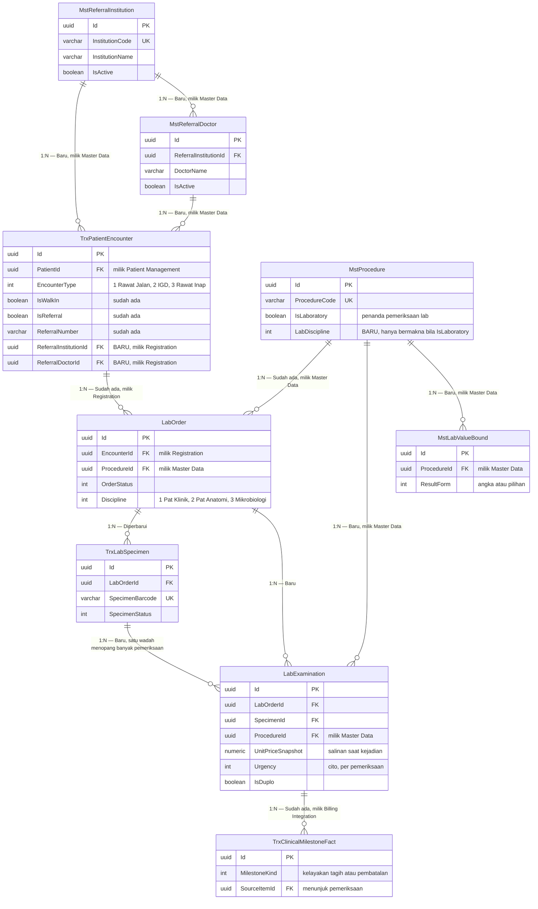

# Laboratorium — Context ERD

| Field | Value |
|---|---|
| Blueprint ID | `LAB-BP-001` |
| Revision | `2` |
| Status | `draft` |
| Scope | Slice `S1a`, `S2`, `S3`, `S7`, `S10`, `S11`, `S13a`, `S13b`, `S14`, `S15` |
| Backend SHA | `9124900` |

Dokumen ini memetakan **hubungan antar bounded context** dan ke mana arah ketergantungannya.
ERD rinci per konteks ada di `laboratory-operations.md`.

---

## Peta ketergantungan

---

## Arah ketergantungan antar konteks

| Konteks | Peran | Yang dibaca dari luar | Yang diterbitkan ke luar |
|---|---|---|---|
| `BC-LAB` Operasional Laboratorium | **Pemilik** modul ini | Kunjungan, jenis pemeriksaan, tarif, identitas pengguna | Fakta milestone klinis ke Billing |
| `BC-REG` Registrasi | Hulu | — | Kunjungan pasien |
| `BC-MD` Data Induk | Hulu | — | Jenis pemeriksaan, tarif, kelompok umur |
| `BC-BIL` Billing | Hilir | Fakta milestone klinis | Seluruh akibat finansial |
| `BC-PLAT` Platform | Hulu | — | Identitas pengguna dan kewenangan |

**Aturan yang tidak boleh dilanggar.** Tidak ada satu pun tabel Laboratorium yang menyalin
pasien, dokter, kunjungan, jenis pemeriksaan, tarif, atau sumber rujukan sebagai sumber
kebenaran tandingan. Yang disimpan hanyalah **kunci rujukan** dan **salinan sesaat** tarif untuk
keperluan penelusuran harga pada saat kejadian.

### Empat perubahan yang dikerjakan modul lain

Keempatnya disetujui `andryzainhome` dan `sukmagp` pada 2026-09-01 lewat `LAB-REQ-001`.
Laboratorium **tidak mengerjakannya** dan **tidak menulis** ke sana.

| Perubahan | Dikerjakan oleh | Dipakai Laboratorium untuk |
|---|---|---|
| Kolom `LabDiscipline` pada `MstProcedure` | Master Data | Menyaring katalog per disiplin dan menegakkan `INV-22` |
| `MstReferralInstitution` | Master Data | Pilihan instansi perujuk saat mendaftarkan pasien rujukan |
| `MstReferralDoctor` | Master Data | Pilihan dokter perujuk |
| Dua kolom penunjuk perujuk pada `TrxPatientEncounter` | Registration Management | Diisi lewat permintaan `INT-05`, dibaca saat menampilkan pesanan |

---

## Tabel status entity

| Entity | Status | Owner | Catatan |
|---|---|---|---|
| `TrxPatientEncounter` | **Diperbarui** | Registration Management | Tambah `ReferralInstitutionId` dan `ReferralDoctorId`. **Dikerjakan Registration**, disetujui `LAB-COORD-004` |
| `MstProcedure` | **Diperbarui** | Health Services Master Data | Tambah kolom klasifikasi `LabDiscipline`. **Dikerjakan Master Data**, disetujui `LAB-COORD-005` |
| `MstReferralInstitution` | **Baru** | Health Services Master Data | Data induk global. **Dikerjakan Master Data**, disetujui `LAB-COORD-004` |
| `MstReferralDoctor` | **Baru** | Health Services Master Data | Data induk global, tertaut ke instansinya. **Dikerjakan Master Data** |
| `MstAgeCategory` | Sudah ada | Health Services Master Data | Direferensikan oleh batas nilai |
| `LabOrder` | Diperbarui | Laboratorium | Tambah kolom `Discipline`. Kolom kesegeraan pindah ke `LabExamination` |
| `TrxLabSpecimen` | Diperbarui | Laboratorium | Berubah makna menjadi wadah fisik; enam kolom pindah keluar |
| `LabExamination` | **Baru** | Laboratorium | Satuan yang ditagihkan dan kelak punya hasil. Membawa penanda cito dan duplo |
| `TrxLabTransitionHistory` | Diperbarui | Laboratorium | Tambah `LabExaminationId` |
| `MstLabValueBound` | **Baru** | Laboratorium | Batas nilai per pemeriksaan, jenis kelamin, dan kelompok umur |
| `MstLabValueOption` | **Baru** | Laboratorium | Pilihan sah untuk hasil berbentuk pilihan |
| `LabValueBoundChangeRequest` | **Baru** | Laboratorium | Pengajuan perubahan batas kritis |
| `LabValueBoundHistory` | **Baru** | Laboratorium | Riwayat perubahan batas nilai |
| `MstLabRejectionReason` | Sudah ada | Laboratorium | Tidak berubah |
| `TrxClinicalMilestoneFact` | Sudah ada | Clinical Billing Integration | Diterbitkan modul ini, dimiliki integrasi Billing |
| `BilChargeLine` | Sudah ada | Billing dan Kasir | **Tidak** disentuh modul ini |

---

## Entity yang sengaja tidak ada pada ERD ini

| Entity | Alasan |
|---|---|
| Tabel hasil pemeriksaan | Slice hasil terblokir `LAB-SIGN-001` |
| Tabel pemberitahuan | `LAB-DEC-016` menetapkannya milik platform |
| Tabel keutuhan dokumen rekam medis | Slice pendaftaran rekam medis terblokir `LAB-COORD-002` |
| Tabel daftar kerja | Daftar kerja diturunkan, tidak disimpan |
