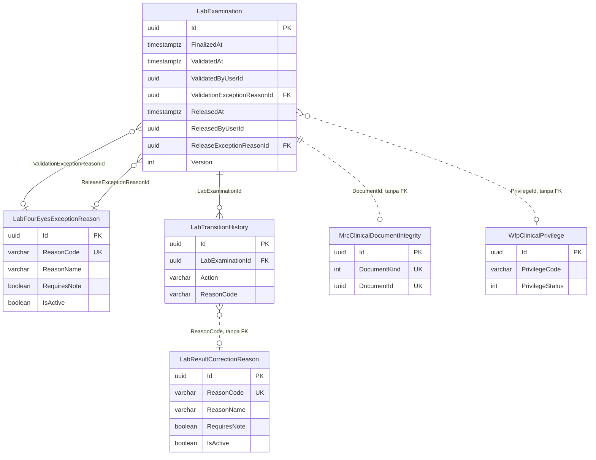

# Kamus Data — Modul Laboratorium

| Field | Value |
|---|---|
| Blueprint ID | `LAB-BP-001` |
| Revision | `7` — bagian 18, 2026-09-25: `S4d-1` — nol tabel, nol kolom. Sebelumnya `6` — bagian 17, 2026-09-25: `S4` — dua tabel baru, 14 kolom baru pada `LabExamination`. Sebelumnya `5` — bagian 16, 2026-09-24: nol tabel, nol kolom |
| Status | `draft` |
| Scope | Slice `S1a`, `S2`, `S3`, `S7`, `S10`, `S11`, `S13a`, `S13b`, `S14`, `S15`. **Revision 3 menambah amandemen Penerimaan Sampling/Specimen** — lihat bagian 12 |
| Backend SHA | Revision 1-2: `c87d9c0`. **Revision 3: `466a7127`**, diverifikasi tidak berubah pada `9067fa73` |

Seluruh tabel mewarisi `IdentityModel`, sehingga memiliki kolom audit `CreateDateTime`,
`CreateBy`, `UpdateDateTime`, `UpdateBy`, `DeleteDateTime`, `DeleteBy`, `CancelDateTime`,
`CancelBy`, `IsCancel`, dan `IsDelete`. Kolom-kolom itu **tidak** diulang pada tabel di bawah.

Penghapusan bersifat **penandaan** melalui `IsDelete`, bukan penghapusan baris. Desain apa pun
tidak boleh mengandalkan baris benar-benar hilang dari tabel.

Kedalaman dokumentasi mengikuti status tabel: tabel `Baru` dan `Diperbarui` ditulis seluruh
kolomnya; tabel `Sudah ada` cukup kolom kuncinya ditambah rujukan ke berkas model.

---

## 1. `LabOrder` — `Diperbarui`

Berkas model: `Areas/HealthServices/LaboratoryManagement/Models/LabOrder.cs`

| Kolom | Tipe | Wajib | Bawaan | Index | Relasi | Perilaku hapus | Sensitif | Keterangan |
|---|---|:---:|---|---|---|---|:---:|---|
| `Id` | `Guid` | Ya | `Guid.NewGuid()` | PK | — | — | Tidak | Kunci utama |
| `EncounterId` | `Guid` | Ya | — | Index | FK ke `TrxPatientEncounter` | `Restrict` | Tidak | Kunjungan pasien tempat pesanan dibuat |
| `ProcedureId` | `Guid` | Ya | — | Index | FK ke `MstProcedure` | `Restrict` | Tidak | Pemeriksaan yang dipesan pertama; bukan lagi satu-satunya komponen |
| `OrderStatus` | `LabOrderStatus` | Ya | `Requested` | Index | — | — | Tidak | Enum disimpan `int` |
| `StatusBeforeHold` | `LabOrderStatus?` | Tidak | — | — | — | — | Tidak | Status sebelum ditahan, agar dapat dilanjutkan tanpa menebak |
| **`Discipline`** | `LabDiscipline` | Ya | — | Index | — | — | Tidak | **Baru.** Patologi Klinik, Patologi Anatomi, atau Mikrobiologi (`LAB-DEC-025`) |
| `RequestedAt` | `DateTime?` | Tidak | — | — | — | — | Tidak | Waktu pesanan dibuat |
| `RequestedByUserId` | `Guid?` | Tidak | — | — | — | — | Tidak | Dokter pemesan |
| `CompletedAt` | `DateTime?` | Tidak | — | — | — | — | Tidak | Waktu pesanan diselesaikan |
| **`ConfirmedByUserId`** | `Guid?` | Tidak | — | — | — | — | Tidak | **Baru `LAB-DEC-061`.** Konfirmator. Diturunkan server dari pengguna yang login, tidak pernah dari badan permintaan. Kosong selama pesanan belum dikonfirmasi |
| **`ConfirmedAt`** | `DateTime?` | Tidak | — | — | — | — | Tidak | **Baru `LAB-DEC-061`.** Waktu konfirmasi. Didenormalisasi dari jejak audit supaya daftar tidak perlu menggabung riwayat per baris |
| **`ExaminerDoctorId`** | `Guid?` | Tidak | — | Index | FK ke `MstDoctor` | `Restrict` | Tidak | **Baru `LAB-DEC-061`.** Dokter pemeriksa, dipilih saat konfirmasi. Nullable karena seluruh pesanan yang sudah ada tidak memilikinya — kolom wajib akan menggagalkan migrationnya |
| `Version` | `int` | Ya | `0` | — | — | — | Tidak | Token konkurensi |

---

## 2. `LabSpecimen` — `Diperbarui`

Berkas model: `Areas/HealthServices/LaboratoryManagement/Models/LabSpecimen.cs`

Setelah `LAB-DEC-024`, tabel ini mewakili **wadah fisik**, bukan pemeriksaan.

| Kolom | Tipe | Wajib | Bawaan | Index | Relasi | Perilaku hapus | Sensitif | Keterangan |
|---|---|:---:|---|---|---|---|:---:|---|
| `Id` | `Guid` | Ya | `Guid.NewGuid()` | PK | — | — | Tidak | Kunci utama |
| `LabOrderId` | `Guid` | Ya | — | Index | FK ke `LabOrder` | `Restrict` | Tidak | Pesanan induk |
| `SpecimenBarcode` | `string(64)` | Ya | dibangkitkan server | **Unique** | — | — | Tidak | Label wadah. Tidak memuat identitas pasien |
| `SpecimenSequence` | `int` | Ya | — | Index bersama `LabOrderId` | — | — | Tidak | Nomor urut wadah dalam satu pesanan |
| `SpecimenDescription` | `string(200)?` | Tidak | — | — | — | — | Tidak | Keterangan wadah, misalnya jenis tabung |
| `SpecimenStatus` | `LabSpecimenStatus` | Ya | `Planned` | Index | — | — | Tidak | Enum disimpan `int` |
| `StatusBeforeHold` | `LabSpecimenStatus?` | Tidak | — | — | — | — | Tidak | Status sebelum ditahan |
| `CollectedAt` | `DateTime?` | Tidak | — | — | — | — | Tidak | Waktu pengambilan |
| `CollectedByUserId` | `Guid?` | Tidak | — | — | — | — | Tidak | Petugas pengambil |
| `ReceivedAt` | `DateTime?` | Tidak | — | — | — | — | Tidak | Waktu tiba di laboratorium |
| `ReceivedByUserId` | `Guid?` | Tidak | — | — | — | — | Tidak | Petugas penerima |
| `DecidedAt` | `DateTime?` | Tidak | — | — | — | — | Tidak | Waktu keputusan layak atau tolak |
| `DecidedByUserId` | `Guid?` | Tidak | — | — | — | — | Tidak | Petugas pemutus |
| `RejectionReasonId` | `Guid?` | Tidak | — | Index | FK ke `MstLabRejectionReason` | `Restrict` | Tidak | Alasan penolakan terkendali |
| `RejectionReasonCode` | `string(50)?` | Tidak | — | — | — | — | Tidak | Salinan kode alasan saat kejadian |
| `RejectionNote` | `string(1000)?` | Tidak | — | — | — | — | **Ya** | Catatan penolakan; dapat memuat keterangan kondisi pasien |
| `SupersededSpecimenId` | `Guid?` | Tidak | — | Index | FK ke `LabSpecimen` | `Restrict` | Tidak | Wadah yang digantikan saat ambil ulang |
| `RecollectionCause` | `LabRecollectionCause?` | Tidak | — | — | — | — | Tidak | Sebab ambil ulang; menentukan siapa menanggung biaya |
| `RecollectionReason` | `string(1000)?` | Tidak | — | — | — | — | **Ya** | Alasan ambil ulang |
| `RecollectionAuthorizedByUserId` | `Guid?` | Tidak | — | — | — | — | Tidak | Pemberi otorisasi ambil ulang |
| `RecollectionAuthorizedAt` | `DateTime?` | Tidak | — | — | — | — | Tidak | Waktu otorisasi |
| `Version` | `int` | Ya | `0` | — | — | — | Tidak | Token konkurensi |

**Kolom yang dihapus dari tabel ini** dan pindah ke `LabExamination`: `ProcedureId`,
`ProcedureCodeSnapshot`, `ProcedureNameSnapshot`, `TariffId`, `TariffCodeSnapshot`,
`UnitPriceSnapshot`.

---

## 3. `LabExamination` — `Baru`

Berkas model: `Areas/HealthServices/LaboratoryManagement/Models/LabExamination.cs`

| Kolom | Tipe | Wajib | Bawaan | Index | Relasi | Perilaku hapus | Sensitif | Keterangan |
|---|---|:---:|---|---|---|---|:---:|---|
| `Id` | `Guid` | Ya | `Guid.NewGuid()` | PK | — | — | Tidak | Kunci utama. Pada pemindahan data lama, **memakai kembali** identitas sampel lama agar tautan tagihan tidak putus |
| `LabOrderId` | `Guid` | Ya | — | Index | FK ke `LabOrder` | `Restrict` | Tidak | Pesanan induk |
| `SpecimenId` | `Guid` | Ya | — | Index | FK ke `LabSpecimen` | `Restrict` | Tidak | Wadah yang menopang pemeriksaan ini |
| `ProcedureId` | `Guid` | Ya | — | Index | FK ke `MstProcedure` | `Restrict` | Tidak | Jenis pemeriksaan. Wajib berpenanda `IsLaboratory` |
| `ProcedureCodeSnapshot` | `string(50)?` | Tidak | — | — | — | — | Tidak | Salinan kode saat kejadian |
| `ProcedureNameSnapshot` | `string(200)?` | Tidak | — | — | — | — | Tidak | Salinan nama saat kejadian |
| `TariffId` | `Guid?` | Tidak | — | Index | FK ke tarif Master Data | `Restrict` | Tidak | Tarif yang berlaku saat kejadian |
| `TariffCodeSnapshot` | `string(50)?` | Tidak | — | — | — | — | Tidak | Salinan kode tarif |
| `UnitPriceSnapshot` | `decimal(18,2)?` | Tidak | — | — | — | — | Tidak | Salinan harga. **Bukan** tagihan; Billing yang memutuskan |
| `ExaminationStatus` | `LabExaminationStatus` | Ya | `Ordered` | Index | — | — | Tidak | Enum disimpan `int` |
| `ChargeEligibleAt` | `DateTime?` | Tidak | — | Index | — | — | Tidak | Waktu pemeriksaan menjadi sah ditagihkan |
| **`Urgency`** | `LabExaminationUrgency` | Ya | `Routine` | Index | — | — | Tidak | **Dipindahkan dari `LabOrder`** oleh `LAB-DEC-026`. Biasa atau cito, **per pemeriksaan** |
| **`UrgencyMarkedAt`** | `DateTime?` | Tidak | — | — | — | — | Tidak | Kapan ditandai cito |
| **`UrgencyMarkedByUserId`** | `Guid?` | Tidak | — | — | — | — | Tidak | Dokter yang menandai |
| **`IsDuplo`** | `bool` | Ya | `false` | — | — | — | Tidak | **Baru** (`LAB-DEC-026`). Pemeriksaan dikerjakan ganda |
| `Version` | `int` | Ya | `0` | — | — | — | Tidak | Token konkurensi |

**Unik:** kombinasi `SpecimenId` + `ProcedureId` tidak boleh berulang. Satu wadah tidak boleh
menopang jenis pemeriksaan yang sama dua kali.

---

## 4. `LabTransitionHistory` — `Diperbarui`

Berkas model: `Areas/HealthServices/LaboratoryManagement/Models/LabTransitionHistory.cs`

| Kolom | Tipe | Wajib | Bawaan | Index | Relasi | Perilaku hapus | Sensitif | Keterangan |
|---|---|:---:|---|---|---|---|:---:|---|
| `Id` | `Guid` | Ya | `Guid.NewGuid()` | PK | — | — | Tidak | Kunci utama |
| `LabOrderId` | `Guid` | Ya | — | Index bersama `OccurredAt` | FK ke `LabOrder` | `Restrict` | Tidak | Pesanan yang bersangkutan |
| `LabSpecimenId` | `Guid?` | Tidak | — | Index | FK ke `LabSpecimen` | `Restrict` | Tidak | Terisi bila yang berpindah adalah wadah |
| **`LabExaminationId`** | `Guid?` | Tidak | — | Index | FK ke `LabExamination` | `Restrict` | Tidak | **Baru.** Terisi bila yang berpindah adalah pemeriksaan |
| `EncounterId` | `Guid` | Ya | — | Index | FK ke `TrxPatientEncounter` | `Restrict` | Tidak | Kunjungan pasien |
| `Scope` | `LabTransitionScope` | Ya | — | — | — | — | Tidak | Objek yang berpindah. Nilai baru: `LabExamination` |
| `Action` | `string(100)` | Ya | — | — | — | — | Tidak | Nama tindakan, misalnya `Specimen.Accept` |
| `FromStatus` | `string(50)?` | Tidak | — | — | — | — | Tidak | Status asal |
| `ToStatus` | `string(50)` | Ya | — | — | — | — | Tidak | Status tujuan |
| `ReasonCode` | `string(50)?` | Tidak | — | — | — | — | Tidak | Kode alasan terkendali |
| `ReasonNote` | `string(1000)?` | Tidak | — | — | — | — | **Ya** | Catatan bebas; dapat memuat keterangan kondisi pasien |
| `ActorUserId` | `Guid` | Ya | — | — | — | — | Tidak | Pelaku tindakan |
| `OccurredAt` | `DateTime` | Ya | — | Index bersama `LabOrderId` | — | — | Tidak | Waktu kejadian |
| `CorrelationId` | `Guid?` | Tidak | — | — | — | — | Tidak | Penghubung satu rangkaian tindakan |

---

## 5. `LabValueBound` — `Baru`

Berkas model: `Areas/HealthServices/LaboratoryManagement/Models/LabValueBound.cs`

| Kolom | Tipe | Wajib | Bawaan | Index | Relasi | Perilaku hapus | Sensitif | Keterangan |
|---|---|:---:|---|---|---|---|:---:|---|
| `Id` | `Guid` | Ya | `Guid.NewGuid()` | PK | — | — | Tidak | Kunci utama |
| `ProcedureId` | `Guid` | Ya | — | Unique bersama `GenderScope` dan `AgeCategoryId` | FK ke `MstProcedure` | `Restrict` | Tidak | Jenis pemeriksaan |
| `ResultForm` | `LabResultForm` | Ya | `Numeric` | — | — | — | Tidak | Angka atau pilihan terbatas |
| `Unit` | `string(20)?` | Tidak | — | — | — | — | Tidak | Satuan hasil. **Wajib** bila bentuk angka |
| `NormalLow` | `decimal(18,4)?` | Tidak | — | — | — | — | Tidak | Batas normal bawah |
| `NormalHigh` | `decimal(18,4)?` | Tidak | — | — | — | — | Tidak | Batas normal atas |
| `CriticalLow` | `decimal(18,4)?` | Tidak | — | — | — | — | Tidak | Batas kritis bawah. Perubahannya memerlukan persetujuan klinis |
| `CriticalHigh` | `decimal(18,4)?` | Tidak | — | — | — | — | Tidak | Batas kritis atas. Perubahannya memerlukan persetujuan klinis |
| `GenderScope` | `LabGenderScope` | Ya | `All` | Unique bersama | — | — | Tidak | Semua, pria, atau wanita |
| `AgeCategoryId` | `Guid?` | Tidak | — | Unique bersama | FK ke `MstAgeCategory` | `Restrict` | Tidak | Kosong berarti berlaku untuk semua umur |
| `CitoTurnaroundMinutes` | `int?` | Tidak | — | — | — | — | Tidak | Batas waktu penyelesaian cito, dihitung dari wadah dinyatakan layak |
| `IsActive` | `bool` | Ya | `true` | — | — | — | Tidak | Penanda aktif |
| `SortOrder` | `int` | Ya | `0` | — | — | — | Tidak | Urutan tampil |

---

## 6. `LabValueOption` — `Baru`

Berkas model: `Areas/HealthServices/LaboratoryManagement/Models/LabValueOption.cs`

| Kolom | Tipe | Wajib | Bawaan | Index | Relasi | Perilaku hapus | Sensitif | Keterangan |
|---|---|:---:|---|---|---|---|:---:|---|
| `Id` | `Guid` | Ya | `Guid.NewGuid()` | PK | — | — | Tidak | Kunci utama |
| `ValueBoundId` | `Guid` | Ya | — | Unique bersama `OptionCode` | FK ke `LabValueBound` | `Cascade` | Tidak | Batas nilai induk |
| `OptionCode` | `string(20)` | Ya | — | Unique bersama | — | — | Tidak | Kode pilihan, misalnya `P3` |
| `OptionName` | `string(100)` | Ya | — | — | — | — | Tidak | Nama pilihan, misalnya `+3` |
| `IsOutOfReference` | `bool` | Ya | `false` | — | — | — | Tidak | Pilihan ini di luar nilai rujukan |
| `IsCritical` | `bool` | Ya | `false` | — | — | — | Tidak | Pilihan ini kritis. Perubahannya memerlukan persetujuan klinis |
| `SortOrder` | `int` | Ya | `0` | — | — | — | Tidak | Urutan tampil |

`Cascade` dipakai di sini — dan **hanya** di sini — karena pilihan tidak punya makna tanpa
batas nilai induknya, dan keduanya bukan data klinis transaksional.

---

## 7. `LabValueBoundChangeRequest` — `Baru`

Berkas model: `Areas/HealthServices/LaboratoryManagement/Models/LabValueBoundChangeRequest.cs`

| Kolom | Tipe | Wajib | Bawaan | Index | Relasi | Perilaku hapus | Sensitif | Keterangan |
|---|---|:---:|---|---|---|---|:---:|---|
| `Id` | `Guid` | Ya | `Guid.NewGuid()` | PK | — | — | Tidak | Kunci utama |
| `ValueBoundId` | `Guid` | Ya | — | Index | FK ke `LabValueBound` | `Restrict` | Tidak | Batas nilai yang diusulkan berubah |
| `RequestStatus` | `LabBoundChangeStatus` | Ya | `Submitted` | Index | — | — | Tidak | Diajukan, berlaku, ditolak, atau ditarik |
| `ProposedCriticalLow` | `decimal(18,4)?` | Tidak | — | — | — | — | Tidak | Usulan batas kritis bawah |
| `ProposedCriticalHigh` | `decimal(18,4)?` | Tidak | — | — | — | — | Tidak | Usulan batas kritis atas |
| `ProposedCriticalOptionCodes` | `string(500)?` | Tidak | — | — | — | — | Tidak | Usulan daftar pilihan kritis, dipisah koma |
| `RequestReason` | `string(1000)` | Ya | — | — | — | — | Tidak | Alasan pengajuan |
| `RequestedByUserId` | `Guid` | Ya | — | — | — | — | Tidak | Pengaju |
| `RequestedAt` | `DateTime` | Ya | — | — | — | — | Tidak | Waktu pengajuan |
| `DecidedByUserId` | `Guid?` | Tidak | — | — | — | — | Tidak | Pemutus dari pihak klinis |
| `DecidedAt` | `DateTime?` | Tidak | — | — | — | — | Tidak | Waktu keputusan |
| `DecisionNote` | `string(1000)?` | Tidak | — | — | — | — | Tidak | Catatan keputusan |

---

## 8. `LabValueBoundHistory` — `Baru`

Berkas model: `Areas/HealthServices/LaboratoryManagement/Models/LabValueBoundHistory.cs`

| Kolom | Tipe | Wajib | Bawaan | Index | Relasi | Perilaku hapus | Sensitif | Keterangan |
|---|---|:---:|---|---|---|---|:---:|---|
| `Id` | `Guid` | Ya | `Guid.NewGuid()` | PK | — | — | Tidak | Kunci utama |
| `ValueBoundId` | `Guid` | Ya | — | Index bersama `OccurredAt` | FK ke `LabValueBound` | `Restrict` | Tidak | Batas nilai yang berubah |
| `ChangedField` | `string(100)` | Ya | — | — | — | — | Tidak | Nama kolom yang berubah |
| `OldValue` | `string(200)?` | Tidak | — | — | — | — | Tidak | Nilai lama |
| `NewValue` | `string(200)?` | Tidak | — | — | — | — | Tidak | Nilai baru |
| `ActorUserId` | `Guid` | Ya | — | — | — | — | Tidak | Pelaku perubahan |
| `ApprovedByUserId` | `Guid?` | Tidak | — | — | — | — | Tidak | Penyetuju, terisi bila yang berubah batas kritis |
| `ChangeReason` | `string(1000)?` | Tidak | — | — | — | — | Tidak | Alasan perubahan |
| `OccurredAt` | `DateTime` | Ya | — | Index bersama | — | — | Tidak | Waktu perubahan |

---

## 9. `MstLabRejectionReason` — `Sudah ada`

Berkas model: `Areas/HealthServices/LaboratoryManagement/Models/MstLabRejectionReason.cs`

Hanya kolom kunci yang ditulis. Sumber lengkapnya adalah berkas model di atas.

| Kolom | Tipe | Wajib | Index | Sensitif | Keterangan |
|---|---|:---:|---|:---:|---|
| `Id` | `Guid` | Ya | PK | Tidak | Kunci utama |
| `ReasonCode` | `string(50)` | Ya | **Unique** dengan filter `IsDelete = false` | Tidak | Kode alasan |
| `IsInternalHospitalError` | `bool` | Ya | — | Tidak | Menentukan siapa menanggung biaya ambil ulang. **Terkunci** bagi pengelola Laboratorium |
| `RequiresNote` | `bool` | Ya | — | Tidak | Mewajibkan catatan saat dipakai. **Terkunci** bagi pengelola Laboratorium |
| `IsActive` | `bool` | Ya | — | Tidak | Penanda aktif |

---

## 9b. Tabel Milik Modul Lain yang Berubah

Keempat tabel di bawah **bukan milik Laboratorium**. Perubahannya dikerjakan modul pemiliknya,
disetujui `andryzainhome` dan `sukmagp` pada 2026-09-01 lewat `LAB-REQ-001`.

Yang didokumentasikan di sini **hanya kolom yang dipakai Laboratorium**. Bentuk lengkapnya
tetap kewenangan modul pemiliknya, dan boleh lebih kaya daripada ini.

### 9b.1 `MstProcedure` — `Diperbarui` oleh Master Data

Berkas model: `Areas/HealthServices/MasterData/Models/MstProcedure.cs`

| Kolom | Tipe | Wajib | Index | Sensitif | Keterangan |
|---|---|:---:|---|:---:|---|
| `Id` | `Guid` | Ya | PK | Tidak | Kunci utama |
| `ProcedureCode` | `string` | Ya | **Unique** | Tidak | Kode tindakan |
| `IsLaboratory` | `bool` | Ya | — | Tidak | Penyaring pertama katalog laboratorium |
| **`LabDiscipline`** | `LabDiscipline?` | Tidak | Index | Tidak | **Baru.** Patologi Klinik, Patologi Anatomi, atau Mikrobiologi. Hanya bermakna bila `IsLaboratory` bernilai benar |
| `IsCoveredByInsuranceDefault` | `bool` | Ya | — | Tidak | Penanda bawaan tercakup penjamin |

**Satu-satunya kolom yang ditambahkan Laboratorium.** Satuan hasil, batas nilai, dan jenis wadah
**tetap dilarang** masuk ke sini — seluruhnya berada di tabel milik Laboratorium (`LAB-DEC-036`).

### 9b.2 `MstReferralInstitution` — `Baru`, milik Master Data

Berkas model: `Areas/HealthServices/MasterData/Models/MstReferralInstitution.cs`

| Kolom | Tipe | Wajib | Bawaan | Index | Sensitif | Keterangan |
|---|---|:---:|---|---|:---:|---|
| `Id` | `Guid` | Ya | `Guid.NewGuid()` | PK | Tidak | Kunci utama |
| `InstitutionCode` | `string(50)` | Ya | — | **Unique** | Tidak | Kode instansi perujuk |
| `InstitutionName` | `string(200)` | Ya | — | Index | Tidak | Nama klinik atau rumah sakit perujuk |
| `Address` | `string(500)?` | Tidak | — | — | Tidak | Alamat instansi |
| `PhoneNumber` | `string(50)?` | Tidak | — | — | Tidak | Telepon instansi |
| `IsActive` | `bool` | Ya | `true` | — | Tidak | Penanda aktif |

### 9b.3 `MstReferralDoctor` — `Baru`, milik Master Data

Berkas model: `Areas/HealthServices/MasterData/Models/MstReferralDoctor.cs`

| Kolom | Tipe | Wajib | Bawaan | Index | Relasi | Sensitif | Keterangan |
|---|---|:---:|---|---|---|:---:|---|
| `Id` | `Guid` | Ya | `Guid.NewGuid()` | PK | — | Tidak | Kunci utama |
| `ReferralInstitutionId` | `Guid` | Ya | — | Index | FK ke `MstReferralInstitution` | Tidak | Instansi tempat dokter berpraktik |
| `DoctorName` | `string(200)` | Ya | — | Index | — | Tidak | Nama dokter perujuk |
| `IsActive` | `bool` | Ya | `true` | — | — | Tidak | Penanda aktif |

**Kenapa dokter perujuk tidak memakai data induk dokter yang sudah ada.** Dokter pada
`master-data` adalah dokter **rumah sakit ini**. Dokter perujuk adalah dokter **di luar** rumah
sakit — ia tidak punya jadwal praktik, tidak menerima jasa medis, dan tidak dapat menjadi DPJP.
Menyatukan keduanya akan membuat daftar dokter internal tercemar nama dari luar.

### 9b.4 `TrxPatientEncounter` — `Diperbarui` oleh Registration Management

Berkas model: `Areas/HealthServices/RegistrationManagement/Models/TrxPatientEncounter.cs`

| Kolom | Tipe | Wajib | Index | Relasi | Sensitif | Keterangan |
|---|---|:---:|---|---|:---:|---|
| `Id` | `Guid` | Ya | PK | — | Tidak | Kunci utama |
| `IsWalkIn` | `bool` | Ya | — | — | Tidak | **Sudah ada.** Penanda pasien datang langsung |
| `RegistrationSource` | `EncounterRegistrationSource` | Ya | — | — | Tidak | **Sudah ada.** Bernilai `WalkIn` untuk pendaftaran dari laboratorium |
| `IsReferral` | `bool` | Ya | — | — | Tidak | **Sudah ada.** Penanda pasien rujukan |
| `ReferralNumber` | `string?` | Tidak | — | — | Tidak | **Sudah ada.** Nomor surat rujukan |
| **`ReferralInstitutionId`** | `Guid?` | Tidak | Index | FK ke `MstReferralInstitution` | Tidak | **Baru.** Instansi perujuk |
| **`ReferralDoctorId`** | `Guid?` | Tidak | Index | FK ke `MstReferralDoctor` | Tidak | **Baru.** Dokter perujuk |

**Yang wajib dipegang implementer Laboratorium.** Keempat tabel di atas **tidak boleh ditulis**
dari kode Laboratorium. Kolom perujuk diisi Registrasi lewat permintaan `INT-05`; Laboratorium
hanya mengirim penunjuknya dan membacanya kembali.

### 9b.5 Bentuk DDL — dokumentasi, bukan skrip

> Peringatan yang sama berlaku: ini **dokumentasi bentuk**, bukan skrip untuk dijalankan.
> Migration-nya dibuat modul pemiliknya, bukan Laboratorium.

```sql
-- Dikerjakan Master Data. Bukan skrip untuk dijalankan.
ALTER TABLE public."MstProcedure" ADD COLUMN "LabDiscipline" integer;  -- enum, boleh kosong
CREATE INDEX "IX_MstProcedure_LabDiscipline" ON public."MstProcedure" ("LabDiscipline");

CREATE TABLE public."MstReferralInstitution" (
    "Id"                uuid          NOT NULL,
    "InstitutionCode"   varchar(50)   NOT NULL,
    "InstitutionName"   varchar(200)  NOT NULL,
    "Address"           varchar(500),
    "PhoneNumber"       varchar(50),
    "IsActive"          boolean       NOT NULL DEFAULT true,
    -- kolom audit IdentityModel tidak ditulis ulang di sini
    CONSTRAINT "PK_MstReferralInstitution" PRIMARY KEY ("Id")
);
CREATE UNIQUE INDEX "IX_MstReferralInstitution_InstitutionCode"
    ON public."MstReferralInstitution" ("InstitutionCode") WHERE "IsDelete" = false;

CREATE TABLE public."MstReferralDoctor" (
    "Id"                      uuid          NOT NULL,
    "ReferralInstitutionId"   uuid          NOT NULL,
    "DoctorName"              varchar(200)  NOT NULL,
    "IsActive"                boolean       NOT NULL DEFAULT true,
    -- kolom audit IdentityModel tidak ditulis ulang di sini
    CONSTRAINT "PK_MstReferralDoctor" PRIMARY KEY ("Id"),
    CONSTRAINT "FK_MstReferralDoctor_MstReferralInstitution_ReferralInstitutionId"
        FOREIGN KEY ("ReferralInstitutionId")
        REFERENCES public."MstReferralInstitution" ("Id") ON DELETE RESTRICT
);

-- Dikerjakan Registration Management. Bukan skrip untuk dijalankan.
ALTER TABLE public."TrxPatientEncounter" ADD COLUMN "ReferralInstitutionId" uuid;
ALTER TABLE public."TrxPatientEncounter" ADD COLUMN "ReferralDoctorId" uuid;
```

---

## 10. Kolom Sensitif

Kolom bertanda **Ya** pada tabel di atas:

| Tabel | Kolom |
|---|---|
| `LabSpecimen` | `RejectionNote`, `RecollectionReason` |
| `LabTransitionHistory` | `ReasonNote` |

Aturan yang berlaku bagi ketiganya:

- **Tidak boleh** masuk ke custom logger;
- **Tidak boleh** dipakai sebagai contoh berisi data asli di dokumentasi;
- perlu ditinjau kebutuhan penyamarannya pada DTO response yang dilihat pengguna non-klinis.

---

## 11. Bentuk DDL

> **Peringatan.** Basis data project ini dibentuk EF Core Migrations, bukan skrip SQL manual.
> DDL di bawah adalah **dokumentasi bentuk tabel**, bukan skrip yang dijalankan. Menjalankannya
> akan berbenturan dengan migration. Kolom audit `IdentityModel` tidak ditulis ulang di sini.

### 11.1 `LabExamination` — Baru

```sql
-- Bentuk tabel sebagaimana dihasilkan EF Core. Bukan skrip untuk dijalankan.
CREATE TABLE public."LabExamination" (
    "Id"                      uuid           NOT NULL,
    "LabOrderId"              uuid           NOT NULL,
    "SpecimenId"              uuid           NOT NULL,
    "ProcedureId"             uuid           NOT NULL,
    "ProcedureCodeSnapshot"   varchar(50),
    "ProcedureNameSnapshot"   varchar(200),
    "TariffId"                uuid,
    "TariffCodeSnapshot"      varchar(50),
    "UnitPriceSnapshot"       numeric(18,2),
    "ExaminationStatus"       integer        NOT NULL,  -- enum, HasConversion<int>
    "ChargeEligibleAt"        timestamp,
    "Urgency"                 integer        NOT NULL,  -- enum, LAB-DEC-026
    "UrgencyMarkedAt"         timestamp,
    "UrgencyMarkedByUserId"   uuid,
    "IsDuplo"                 boolean        NOT NULL DEFAULT false,
    "Version"                 integer        NOT NULL,
    -- kolom audit IdentityModel tidak ditulis ulang di sini

    CONSTRAINT "PK_LabExamination" PRIMARY KEY ("Id"),
    CONSTRAINT "FK_LabExamination_LabOrder_LabOrderId"
        FOREIGN KEY ("LabOrderId") REFERENCES public."LabOrder" ("Id") ON DELETE RESTRICT,
    CONSTRAINT "FK_LabExamination_LabSpecimen_SpecimenId"
        FOREIGN KEY ("SpecimenId") REFERENCES public."LabSpecimen" ("Id") ON DELETE RESTRICT,
    CONSTRAINT "FK_LabExamination_MstProcedure_ProcedureId"
        FOREIGN KEY ("ProcedureId") REFERENCES public."MstProcedure" ("Id") ON DELETE RESTRICT
);

CREATE INDEX "IX_LabExamination_LabOrderId" ON public."LabExamination" ("LabOrderId");
CREATE INDEX "IX_LabExamination_ExaminationStatus" ON public."LabExamination" ("ExaminationStatus");
CREATE INDEX "IX_LabExamination_ChargeEligibleAt" ON public."LabExamination" ("ChargeEligibleAt");
CREATE INDEX "IX_LabExamination_Urgency" ON public."LabExamination" ("Urgency");
CREATE UNIQUE INDEX "IX_LabExamination_SpecimenId_ProcedureId"
    ON public."LabExamination" ("SpecimenId", "ProcedureId")
    WHERE "IsDelete" = false;
```

### 11.2 `LabValueBound` — Baru

```sql
-- Bentuk tabel sebagaimana dihasilkan EF Core. Bukan skrip untuk dijalankan.
CREATE TABLE public."LabValueBound" (
    "Id"                      uuid           NOT NULL,
    "ProcedureId"             uuid           NOT NULL,
    "ResultForm"              integer        NOT NULL,  -- enum, HasConversion<int>
    "Unit"                    varchar(20),
    "NormalLow"               numeric(18,4),
    "NormalHigh"              numeric(18,4),
    "CriticalLow"             numeric(18,4),
    "CriticalHigh"            numeric(18,4),
    "GenderScope"             integer        NOT NULL,  -- enum, HasConversion<int>
    "AgeCategoryId"           uuid,
    "CitoTurnaroundMinutes"   integer,
    "IsActive"                boolean        NOT NULL DEFAULT true,
    "SortOrder"               integer        NOT NULL DEFAULT 0,
    -- kolom audit IdentityModel tidak ditulis ulang di sini

    CONSTRAINT "PK_LabValueBound" PRIMARY KEY ("Id"),
    CONSTRAINT "FK_LabValueBound_MstProcedure_ProcedureId"
        FOREIGN KEY ("ProcedureId") REFERENCES public."MstProcedure" ("Id") ON DELETE RESTRICT,
    CONSTRAINT "FK_LabValueBound_MstAgeCategory_AgeCategoryId"
        FOREIGN KEY ("AgeCategoryId") REFERENCES public."MstAgeCategory" ("Id") ON DELETE RESTRICT
);

CREATE UNIQUE INDEX "IX_LabValueBound_Procedure_Gender_AgeCategory"
    ON public."LabValueBound" ("ProcedureId", "GenderScope", "AgeCategoryId")
    WHERE "IsDelete" = false;
```

### 11.3 `LabValueOption` — Baru

```sql
-- Bentuk tabel sebagaimana dihasilkan EF Core. Bukan skrip untuk dijalankan.
CREATE TABLE public."LabValueOption" (
    "Id"                 uuid          NOT NULL,
    "ValueBoundId"       uuid          NOT NULL,
    "OptionCode"         varchar(20)   NOT NULL,
    "OptionName"         varchar(100)  NOT NULL,
    "IsOutOfReference"   boolean       NOT NULL DEFAULT false,
    "IsCritical"         boolean       NOT NULL DEFAULT false,
    "SortOrder"          integer       NOT NULL DEFAULT 0,
    -- kolom audit IdentityModel tidak ditulis ulang di sini

    CONSTRAINT "PK_LabValueOption" PRIMARY KEY ("Id"),
    CONSTRAINT "FK_LabValueOption_LabValueBound_ValueBoundId"
        FOREIGN KEY ("ValueBoundId") REFERENCES public."LabValueBound" ("Id") ON DELETE CASCADE
);

CREATE UNIQUE INDEX "IX_LabValueOption_ValueBoundId_OptionCode"
    ON public."LabValueOption" ("ValueBoundId", "OptionCode")
    WHERE "IsDelete" = false;
```

### 11.4 `LabValueBoundChangeRequest` — Baru

```sql
-- Bentuk tabel sebagaimana dihasilkan EF Core. Bukan skrip untuk dijalankan.
CREATE TABLE public."LabValueBoundChangeRequest" (
    "Id"                            uuid           NOT NULL,
    "ValueBoundId"                  uuid           NOT NULL,
    "RequestStatus"                 integer        NOT NULL,  -- enum, HasConversion<int>
    "ProposedCriticalLow"           numeric(18,4),
    "ProposedCriticalHigh"          numeric(18,4),
    "ProposedCriticalOptionCodes"   varchar(500),
    "RequestReason"                 varchar(1000)  NOT NULL,
    "RequestedByUserId"             uuid           NOT NULL,
    "RequestedAt"                   timestamp      NOT NULL,
    "DecidedByUserId"               uuid,
    "DecidedAt"                     timestamp,
    "DecisionNote"                  varchar(1000),
    -- kolom audit IdentityModel tidak ditulis ulang di sini

    CONSTRAINT "PK_LabValueBoundChangeRequest" PRIMARY KEY ("Id"),
    CONSTRAINT "FK_LabValueBoundChangeRequest_LabValueBound_ValueBoundId"
        FOREIGN KEY ("ValueBoundId") REFERENCES public."LabValueBound" ("Id") ON DELETE RESTRICT
);

CREATE INDEX "IX_LabValueBoundChangeRequest_ValueBoundId" ON public."LabValueBoundChangeRequest" ("ValueBoundId");
CREATE INDEX "IX_LabValueBoundChangeRequest_RequestStatus" ON public."LabValueBoundChangeRequest" ("RequestStatus");
```

### 11.5 `LabValueBoundHistory` — Baru

```sql
-- Bentuk tabel sebagaimana dihasilkan EF Core. Bukan skrip untuk dijalankan.
CREATE TABLE public."LabValueBoundHistory" (
    "Id"                  uuid           NOT NULL,
    "ValueBoundId"        uuid           NOT NULL,
    "ChangedField"        varchar(100)   NOT NULL,
    "OldValue"            varchar(200),
    "NewValue"            varchar(200),
    "ActorUserId"         uuid           NOT NULL,
    "ApprovedByUserId"    uuid,
    "ChangeReason"        varchar(1000),
    "OccurredAt"          timestamp      NOT NULL,
    -- kolom audit IdentityModel tidak ditulis ulang di sini

    CONSTRAINT "PK_LabValueBoundHistory" PRIMARY KEY ("Id"),
    CONSTRAINT "FK_LabValueBoundHistory_LabValueBound_ValueBoundId"
        FOREIGN KEY ("ValueBoundId") REFERENCES public."LabValueBound" ("Id") ON DELETE RESTRICT
);

CREATE INDEX "IX_LabValueBoundHistory_ValueBoundId_OccurredAt"
    ON public."LabValueBoundHistory" ("ValueBoundId", "OccurredAt");
```

### 11.6 `LabOrder` — Diperbarui

```sql
-- Hanya kolom yang ditambahkan. Bukan skrip untuk dijalankan.
-- LAB-DEC-026: kolom kesegeraan TIDAK lagi di sini, melainkan di LabExamination.
ALTER TABLE public."LabOrder" ADD COLUMN "Discipline" integer NOT NULL DEFAULT 1;  -- enum

CREATE INDEX "IX_LabOrder_Discipline" ON public."LabOrder" ("Discipline");
```

### 11.7 `LabSpecimen` — Diperbarui

```sql
-- Perubahan struktur. Bukan skrip untuk dijalankan.
-- Kolom di bawah dihapus SETELAH datanya dipindahkan ke LabExamination.
ALTER TABLE public."LabSpecimen" DROP COLUMN "ProcedureId";
ALTER TABLE public."LabSpecimen" DROP COLUMN "ProcedureCodeSnapshot";
ALTER TABLE public."LabSpecimen" DROP COLUMN "ProcedureNameSnapshot";
ALTER TABLE public."LabSpecimen" DROP COLUMN "TariffId";
ALTER TABLE public."LabSpecimen" DROP COLUMN "TariffCodeSnapshot";
ALTER TABLE public."LabSpecimen" DROP COLUMN "UnitPriceSnapshot";
```

### 11.8 `LabTransitionHistory` — Diperbarui

```sql
-- Hanya kolom yang ditambahkan. Bukan skrip untuk dijalankan.
ALTER TABLE public."LabTransitionHistory" ADD COLUMN "LabExaminationId" uuid;

ALTER TABLE public."LabTransitionHistory"
    ADD CONSTRAINT "FK_LabTransitionHistory_LabExamination_LabExaminationId"
    FOREIGN KEY ("LabExaminationId") REFERENCES public."LabExamination" ("Id") ON DELETE RESTRICT;

CREATE INDEX "IX_LabTransitionHistory_LabExaminationId"
    ON public."LabTransitionHistory" ("LabExaminationId");
```

### 11.9 Tabel `Sudah ada` yang tidak berubah

| Tabel | Berkas configuration |
|---|---|
| `MstLabRejectionReason` | `Areas/HealthServices/LaboratoryManagement/Configurations/LaboratoryManagementConfigurations.cs` — utang teknis lokasi, lihat `02-backend-architecture.md` bagian 5 |

---

## 12. Amandemen 2026-09-14 — Penerimaan Sampling/Specimen

Menurunkan `LAB-DEC-040`, `LAB-DEC-041`, dan `LAB-DEC-042` dari decision log revision 26.
Diaudit pada backend `466a7127`, diverifikasi tidak berubah pada `9067fa73`.

Sepuluh kolom warisan `IdentityModel` tidak diulang di sini; lihat kepala dokumen.

### 12.1 `LabSpecimenType` — `Baru`, milik Laboratorium

Prefix `Lab`, bukan `Mst`. Dasarnya baris riwayat `MODULE_OWNERSHIP_PREFIX_REGISTRY.md`
tertanggal 2026-09-02: data induk milik Laboratorium memakai prefix `Lab`, sebagaimana
`LabValueBound` dan `LabValueOption`.

| Kolom | Tipe | Null | Bawaan | Unique/Index | Sensitif | Keterangan |
|---|---|:---:|---|---|:---:|---|
| `Id` | `uuid` | tidak | — | PK | tidak | — |
| `SpecimenTypeCode` | `varchar(32)` | tidak | — | Unique bila `IsDelete = false` | tidak | Kode yang dipakai seeder dan integrasi |
| `SpecimenTypeName` | `varchar(128)` | tidak | — | — | tidak | Nama yang dilihat petugas |
| `IsOtherBucket` | `boolean` | tidak | `false` | Unique parsial bila `true` dan `IsActive` | tidak | Penanda baris `Lainnya`; hanya satu boleh aktif |
| `SortOrder` | `integer` | tidak | `0` | Index bersama `IsActive` | tidak | Urutan tampil |
| `IsActive` | `boolean` | tidak | `true` | Index bersama `SortOrder` | tidak | Dinonaktifkan, tidak dihapus |
| `Description` | `varchar(256)` | ya | `null` | — | tidak | Keterangan bagi petugas |

**Perilaku hapus.** `DeleteBehavior.Restrict` dari `LabSpecimen`. Jenis yang sudah menempel
pada wadah tidak dapat dihapus — riwayat penerimaan lama harus tetap terbaca.

### 12.2 `LabSpecimen` — `Diperbarui`

**Lima kolom ditambahkan. Tidak satu pun kolom lama diubah, dinamai ulang, atau dihapus.**

| Kolom | Tipe | Null | Bawaan | Unique/Index | Sensitif | Keterangan |
|---|---|:---:|---|---|:---:|---|
| `SpecimenTypeId` | `uuid` | ya | `null` | Index; FK ke `LabSpecimenType` | tidak | Wajib pada API untuk wadah baru; nullable agar baris lama tidak menghalangi migration |
| `SpecimenTypeOtherNote` | `varchar(128)` | ya | `null` | — | tidak | Wajib bila jenisnya ber-`IsOtherBucket` |
| `VolumeAmount` | `numeric(12,3)` | ya | `null` | — | tidak | Tanpa batas minimum maupun maksimum (`RULE-021`) |
| `VolumeUnitId` | `uuid` | ya | `null` | Index; FK ke `MstMeasurement` | tidak | Wajib bila `VolumeAmount` terisi |
| `PhysicallyReceivedAt` | `timestamp` | ya | `null` | Index | tidak | Kapan wadah sampai di meja penerimaan, diisi petugas |

**Kolom lama yang maknanya dipertegas, tanpa perubahan tipe maupun nullability:**

| Kolom | Makna yang berlaku sejak amandemen ini |
|---|---|
| `ReceivedAt` | **Kapan datanya masuk ke sistem.** Diisi server, tidak dapat diubah endpoint mana pun (`AC-65`) |
| `SpecimenDescription` | **Keterangan operasional bebas** — misalnya "lengan kiri, tabung kedua". Berhenti menjadi tempat menyimpan jenis specimen (`AC-61`) |

**Perilaku hapus kedua FK baru.** `DeleteBehavior.Restrict`.

### 12.3 Tabel milik modul lain yang dipakai — `MstMeasurement`

| Field | Isi |
|---|---|
| **Status** | `Sudah ada` — **tidak berubah** |
| **Pemilik** | `master-data` |
| **Berkas model** | `Areas/HealthServices/MasterData/Models/MstMeasurement.cs` |

Kolom kunci yang dipakai modul ini:

| Kolom | Kenapa dipakai |
|---|---|
| `Id` | Ditunjuk `LabSpecimen.VolumeUnitId` |
| `MeasurementSymbol` | Ditampilkan di samping angka volume |
| `IsForLaboratory` | **Penyaring daftar satuan** yang boleh dipilih petugas lab |
| `IsDecimalAllowed`, `DecimalPrecision` | Menentukan apakah volume boleh berkoma |
| `IsActive` | Satuan nonaktif tidak muncul sebagai pilihan |

**Tidak ada kolom yang ditambahkan ke `MstMeasurement`.** Yang dibutuhkan hanya **lima baris
data** ber-`IsForLaboratory = true`, dan pengisiannya adalah pekerjaan Master Data — lihat
`02-backend-architecture.md` bagian 11.10 beserta alasannya pada `LAB-DEBT-001`.

### 12.4 Bentuk DDL — dokumentasi, bukan skrip

```sql
CREATE TABLE public."LabSpecimenType" (
    "Id"                uuid         NOT NULL,
    "SpecimenTypeCode"  varchar(32)  NOT NULL,
    "SpecimenTypeName"  varchar(128) NOT NULL,
    "IsOtherBucket"     boolean      NOT NULL DEFAULT false,
    "SortOrder"         integer      NOT NULL DEFAULT 0,
    "IsActive"          boolean      NOT NULL DEFAULT true,
    "Description"       varchar(256) NULL,
    -- sepuluh kolom IdentityModel menyusul di sini
    CONSTRAINT "PK_LabSpecimenType" PRIMARY KEY ("Id")
);

CREATE UNIQUE INDEX "IX_LabSpecimenType_SpecimenTypeCode"
    ON public."LabSpecimenType" ("SpecimenTypeCode")
    WHERE "IsDelete" = false;

-- Menegakkan "hanya satu jenis Lainnya yang aktif" di tingkat basis data,
-- bukan hanya di service. Dasar: VAL-62.
CREATE UNIQUE INDEX "IX_LabSpecimenType_SingleOtherBucket"
    ON public."LabSpecimenType" (("IsOtherBucket"))
    WHERE "IsOtherBucket" = true AND "IsActive" = true AND "IsDelete" = false;

CREATE INDEX "IX_LabSpecimenType_IsActive_SortOrder"
    ON public."LabSpecimenType" ("IsActive", "SortOrder");

ALTER TABLE public."LabSpecimen"
    ADD COLUMN "SpecimenTypeId"        uuid          NULL,
    ADD COLUMN "SpecimenTypeOtherNote" varchar(128)  NULL,
    ADD COLUMN "VolumeAmount"          numeric(12,3) NULL,
    ADD COLUMN "VolumeUnitId"          uuid          NULL,
    ADD COLUMN "PhysicallyReceivedAt"  timestamp     NULL;

ALTER TABLE public."LabSpecimen"
    ADD CONSTRAINT "FK_LabSpecimen_LabSpecimenType_SpecimenTypeId"
    FOREIGN KEY ("SpecimenTypeId") REFERENCES public."LabSpecimenType" ("Id") ON DELETE RESTRICT;

ALTER TABLE public."LabSpecimen"
    ADD CONSTRAINT "FK_LabSpecimen_MstMeasurement_VolumeUnitId"
    FOREIGN KEY ("VolumeUnitId") REFERENCES public."MstMeasurement" ("Id") ON DELETE RESTRICT;

CREATE INDEX "IX_LabSpecimen_SpecimenTypeId"       ON public."LabSpecimen" ("SpecimenTypeId");
CREATE INDEX "IX_LabSpecimen_VolumeUnitId"         ON public."LabSpecimen" ("VolumeUnitId");
CREATE INDEX "IX_LabSpecimen_PhysicallyReceivedAt" ON public."LabSpecimen" ("PhysicallyReceivedAt");
```

**Seluruh kolom baru nullable**, sehingga `ALTER TABLE` di atas tidak menulis ulang satu baris
pun dan tidak mengunci tabel yang sudah berisi data.

### 12.5 Yang tidak ada di kamus ini

| Yang dicari pembaca | Kenapa tidak ada |
|---|---|
| Kolom `Qty` pada `LabExamination` | `LAB-DEC-038` — Qty memperbanyak baris, tidak disimpan sebagai kolom |
| Tabel rekap pemakaian `Lainnya` | Diturunkan dari `LabSpecimen`; lihat `GET /lab-specimen-types/other-usage` |
| Kolom usulan instansi perujuk | Milik Master Data, menunggu `LAB-REQ-005` |
| Kolom metode pembayaran pada tabel Laboratorium | Milik Registrasi. Laboratorium tidak menyalinnya |

---

## 13. Amandemen 2026-09-15 — Pemesanan per disiplin

Menurunkan `LAB-DEC-055`, `LAB-DEC-056`, dan `LAB-DEC-057` dari decision log revision 29.
Diaudit pada backend `e2152709`.

**Satu tabel baru. `LabOrder`, `LabExamination`, dan `LabSpecimen` tidak berubah sama sekali.**

### 13.1 `LabOrderedProcedure` — `Baru`, milik Laboratorium

Prefix `Lab`, sesuai baris registry 2026-09-02. Sepuluh kolom warisan `IdentityModel` tidak
diulang di sini.

| Kolom | Tipe | Null | Bawaan | Unique/Index | Sensitif | Keterangan |
|---|---|:---:|---|---|:---:|---|
| `Id` | `uuid` | tidak | — | PK | tidak | — |
| `LabOrderId` | `uuid` | tidak | — | Index; FK ke `LabOrder` | tidak | Pesanan yang memuat permintaan ini |
| `ProcedureId` | `uuid` | tidak | — | FK ke `MstProcedure` | tidak | Jenis pemeriksaan yang diminta |
| `ProcedureCodeSnapshot` | `varchar(50)` | tidak | — | — | tidak | Salinan saat dipesan |
| `ProcedureNameSnapshot` | `varchar(200)` | tidak | — | — | tidak | Salinan saat dipesan |
| `DisciplineSnapshot` | `integer` | ya | `null` | — | tidak | Disiplin **saat dipesan**; penggolongan katalog yang berubah kemudian tidak mengubah riwayat |
| `Urgency` | `integer` | tidak | `1` (`Routine`) | — | tidak | Penanda cito melekat pada pemeriksaan (`LAB-DEC-026`) |
| `OrderedStatus` | `integer` | tidak | `1` (`Ordered`) | Index | tidak | `Ordered` \| `Fulfilled` \| `Cancelled` |
| `FulfilledExaminationId` | `uuid` | ya | `null` | FK ke `LabExamination` | tidak | Baris pemeriksaan yang akhirnya mengerjakan permintaan ini |

**Perilaku hapus.** Ketiga foreign key `Restrict`. Pesanan, katalog, maupun baris pemeriksaan
yang sudah tertaut tidak dapat dihapus selama permintaannya masih tercatat.

**Unique.** `(LabOrderId, ProcedureId)` bila `IsDelete = false` — satu jenis pemeriksaan
dipesan sekali per pesanan (`VAL-65`). Pengerjaan ganda tetap dinyatakan `IsDuplo` pada
`LabExamination`, bukan dengan memesan dua kali.

### 13.2 Bentuk DDL — dokumentasi, bukan skrip

```sql
CREATE TABLE public."LabOrderedProcedure" (
    "Id"                     uuid         NOT NULL,
    "LabOrderId"             uuid         NOT NULL,
    "ProcedureId"            uuid         NOT NULL,
    "ProcedureCodeSnapshot"  varchar(50)  NOT NULL,
    "ProcedureNameSnapshot"  varchar(200) NOT NULL,
    "DisciplineSnapshot"     integer      NULL,
    "Urgency"                integer      NOT NULL DEFAULT 1,
    "OrderedStatus"          integer      NOT NULL DEFAULT 1,
    "FulfilledExaminationId" uuid         NULL,
    -- sepuluh kolom IdentityModel menyusul di sini
    CONSTRAINT "PK_LabOrderedProcedure" PRIMARY KEY ("Id")
);

CREATE UNIQUE INDEX "IX_LabOrderedProcedure_LabOrderId_ProcedureId"
    ON public."LabOrderedProcedure" ("LabOrderId", "ProcedureId")
    WHERE "IsDelete" = false;

CREATE INDEX "IX_LabOrderedProcedure_LabOrderId"    ON public."LabOrderedProcedure" ("LabOrderId");
CREATE INDEX "IX_LabOrderedProcedure_OrderedStatus" ON public."LabOrderedProcedure" ("OrderedStatus");

ALTER TABLE public."LabOrderedProcedure"
    ADD CONSTRAINT "FK_LabOrderedProcedure_LabOrder_LabOrderId"
    FOREIGN KEY ("LabOrderId") REFERENCES public."LabOrder" ("Id") ON DELETE RESTRICT;

ALTER TABLE public."LabOrderedProcedure"
    ADD CONSTRAINT "FK_LabOrderedProcedure_MstProcedure_ProcedureId"
    FOREIGN KEY ("ProcedureId") REFERENCES public."MstProcedure" ("Id") ON DELETE RESTRICT;

ALTER TABLE public."LabOrderedProcedure"
    ADD CONSTRAINT "FK_LabOrderedProcedure_LabExamination_FulfilledExaminationId"
    FOREIGN KEY ("FulfilledExaminationId") REFERENCES public."LabExamination" ("Id") ON DELETE RESTRICT;
```

**Tabel baru tanpa satu pun yang menunjuk padanya**, sehingga migrationnya tidak mengunci tabel
mana pun dan jalur `Down`-nya cukup `DROP TABLE`.

### 13.3 Dua konsep yang selama ini menumpang pada satu tabel

| Tabel | Menjawab | Umurnya | Akibat finansial |
|---|---|---|---|
| `LabOrderedProcedure` | **Apa yang diminta** untuk pasien ini | Lahir saat pendaftaran | Tidak ada |
| `LabExamination` | **Apa yang dikerjakan** dari sebuah wadah | Lahir saat wadah dicatat | Menerbitkan fakta kelayakan tagih per baris (`AC-37`) |

Sebelum amandemen ini keduanya dipaksa berbagi satu tabel, dan karena `LabExamination.SpecimenId`
wajib, permintaan pemeriksaan tidak dapat hidup sebelum ada wadah fisiknya. Itulah sebab
`LAB-DEC-056` sempat tidak dapat dilaksanakan.

### 13.4 Yang tidak ada di kamus ini

| Yang dicari pembaca | Kenapa tidak ada |
|---|---|
| Kolom tujuan layanan pada sesi kiosk | Milik `registration-management`, tertahan `LAB-COORD-008` |
| Kolom jalur permintaan dokter | Milik `registration-management`, tertahan `LAB-COORD-008` |
| Kolom kedaluwarsa kunjungan kiosk | Milik Registrasi, tertahan `LAB-COORD-009`. `AC-45` melarang Laboratorium menyentuh kunjungan |
| Perubahan pada `LabExamination` | Disengaja. Unique index `(SpecimenId, ProcedureId)` tidak disentuh |

---

## 14. Amandemen 2026-09-18 — Hasil Mikrobiologi dan Patologi Anatomi (`S4b`, `S4c`)

Menurunkan `LAB-DEC-027` (BR-23), `LAB-DEC-080`, `LAB-DEC-081`, dan `LAB-DEC-084` dari decision
log revision 44; arsitektur domain `LAB-DA-001` revision 6. Diaudit pada backend `5ee03294`.

**Empat tabel baru, empat kolom baru pada `LabExamination`.** Sepuluh kolom warisan
`IdentityModel` tidak diulang; lihat kepala dokumen.

### 14.1 `LabOrganism` — `Baru`, milik Laboratorium

Prefix `Lab`, bukan `Mst` — mengikuti baris registry 2026-09-02 yang sama dengan `LabValueBound`
dan `LabSpecimenType`.

| Kolom | Tipe | Null | Bawaan | Unique/Index | Sensitif | Keterangan |
|---|---|:---:|---|---|:---:|---|
| `Id` | `uuid` | tidak | — | PK | tidak | — |
| `OrganismCode` | `varchar(32)` | tidak | — | Unique bila `IsDelete = false` | tidak | Kode organisme, dipakai integrasi dan pelaporan |
| `OrganismName` | `varchar(200)` | tidak | — | Index | tidak | Nama kuman yang dilihat analis, misalnya `Escherichia coli` |
| `IsActive` | `boolean` | tidak | `true` | Index bersama `SortOrder` | tidak | Dinonaktifkan, **tidak** dihapus |
| `SortOrder` | `integer` | tidak | `0` | Index bersama `IsActive` | tidak | Urutan tampil |
| `Description` | `varchar(256)` | ya | `null` | — | tidak | Keterangan bagi analis |

### 14.2 `LabAntibiotic` — `Baru`, milik Laboratorium

| Kolom | Tipe | Null | Bawaan | Unique/Index | Sensitif | Keterangan |
|---|---|:---:|---|---|:---:|---|
| `Id` | `uuid` | tidak | — | PK | tidak | — |
| `AntibioticCode` | `varchar(32)` | tidak | — | Unique bila `IsDelete = false` | tidak | Kode antibiotik pada panel uji |
| `AntibioticName` | `varchar(200)` | tidak | — | Index | tidak | Nama antibiotik, misalnya `Ceftriaxone` |
| `IsActive` | `boolean` | tidak | `true` | Index bersama `SortOrder` | tidak | Dinonaktifkan, **tidak** dihapus |
| `SortOrder` | `integer` | tidak | `0` | Index bersama `IsActive` | tidak | Urutan tampil |
| `Description` | `varchar(256)` | ya | `null` | — | tidak | Keterangan bagi analis |

> **Tabel ini bukan data induk obat.** Ia panel uji kepekaan milik laboratorium. Menautkannya ke
> formularium farmasi adalah keputusan tersendiri yang **belum** diambil, dan tidak boleh
> disimpulkan dari kemiripan nama.

### 14.3 `LabMicrobiologyIsolate` — `Baru`, milik Laboratorium

| Kolom | Tipe | Null | Bawaan | Unique/Index | Sensitif | Keterangan |
|---|---|:---:|---|---|:---:|---|
| `Id` | `uuid` | tidak | — | PK | tidak | — |
| `LabExaminationId` | `uuid` | tidak | — | Index; FK ke `LabExamination` | tidak | Pemeriksaan tempat kuman ini ditemukan |
| `LabOrganismId` | `uuid` | tidak | — | Index; FK ke `LabOrganism` | tidak | Organisme dari data induk. **Pengetikan bebas ditolak** (`INV-30`) |
| `OrganismNameSnapshot` | `varchar(200)` | tidak | — | — | tidak | Salinan nama **saat hasil diisi**. Nama data induk yang diperbarui tidak berlaku surut |
| `Note` | `varchar(500)` | ya | `null` | — | **ya** | Catatan analis atas isolat ini; dapat memuat keterangan kondisi pasien |
| `SortOrder` | `integer` | tidak | `0` | — | tidak | Urutan tampil pada laporan |

**Perilaku hapus.** Kedua FK `Restrict`. Menonaktifkan organisme **tidak** menghapus isolat lama
(`INV-31`); penghapusan isolat oleh analis dilakukan lewat penandaan `IsDelete`.

### 14.4 `LabIsolateSusceptibility` — `Baru`, milik Laboratorium

| Kolom | Tipe | Null | Bawaan | Unique/Index | Sensitif | Keterangan |
|---|---|:---:|---|---|:---:|---|
| `Id` | `uuid` | tidak | — | PK | tidak | — |
| `LabMicrobiologyIsolateId` | `uuid` | tidak | — | Index; FK ke `LabMicrobiologyIsolate` | tidak | Isolat yang diuji. **Tidak dapat berpindah** (`INV-27`) |
| `LabAntibioticId` | `uuid` | tidak | — | FK ke `LabAntibiotic` | tidak | Antibiotik dari data induk |
| `AntibioticNameSnapshot` | `varchar(200)` | tidak | — | — | tidak | Salinan nama saat hasil diisi |
| `Concentration` | `numeric(18,4)` | ya | `null` | — | tidak | Kadar antibiotik pada cakram uji |
| `ZoneDiameterMm` | `integer` | ya | `null` | — | tidak | Lebar zona hambat dalam milimeter. Bila diisi wajib lebih besar dari nol (`VAL-90`) |
| `Result` | `integer` | tidak | — | — | tidak | Enum `LabSusceptibilityResult`: `Resistant`/`Intermediate`/`Sensitive`. **Wajib** |
| `SortOrder` | `integer` | tidak | `0` | — | tidak | Urutan tampil |

**Unique parsial.** `(LabMicrobiologyIsolateId, LabAntibioticId)` bila `IsDelete = false`. Satu
antibiotik diuji sekali per isolat. **Pembatas `IsDelete = false` wajib** — tanpanya, baris yang
sudah ditandai hapus tetap menempati kunci dan analis tidak dapat memilih ulang antibiotik yang
sama. Pola yang sama sudah dipakai `LabExamination`, `LabValueOption`, dan `LabOrderedProcedure`.

### 14.5 `LabExamination` — `Diperbarui`

**Empat kolom ditambahkan. Tidak satu pun kolom lama diubah, dinamai ulang, atau dihapus.**

| Kolom | Tipe | Null | Bawaan | Unique/Index | Sensitif | Keterangan |
|---|---|:---:|---|---|:---:|---|
| `MicrobiologyFinding` | `integer` | ya | `null` | — | tidak | Enum `LabMicrobiologyFinding`: `Normal`/`Positive`/`Negative`. **Status TEMUAN — nilai hasil, bukan status lifecycle** |
| `PathologyMacroscopic` | `varchar(4000)` | ya | `null` | — | **ya** | Uraian jaringan sebagaimana terlihat mata telanjang |
| `PathologyMicroscopic` | `varchar(4000)` | ya | `null` | — | **ya** | Uraian jaringan di bawah mikroskop |
| `PathologyConclusion` | `varchar(4000)` | ya | `null` | — | **ya** | Diagnosis patolog |

> **Keempatnya nullable, dan itu bukan kelonggaran.** Satu pemeriksaan memakai **tepat satu**
> bentuk hasil (`INV-24`): pemeriksaan berbentuk angka nol mengisi keempatnya, pemeriksaan
> Patologi Anatomi nol mengisi `MicrobiologyFinding`. Kewajiban ketiga ruas narasi ditegakkan
> **pada tingkat aturan bisnis** (`INV-25`, `VAL-88`), bukan pada tingkat kolom — sebab kolom
> `NOT NULL` akan menggagalkan seluruh baris pemeriksaan yang sudah ada.

**Yang sengaja TIDAK ditambahkan:** kolom status hasil dalam bentuk apa pun (`INV-29`,
`LAB-DEC-080`), penanda `Definitif` (`LAB-DEC-081`), dan ruas waktu baru — `ExaminedAt` serta
`ResultEnteredAt` sudah ada dan dipakai apa adanya.

### 14.6 Kolom sensitif yang bertambah

| Tabel | Kolom |
|---|---|
| `LabMicrobiologyIsolate` | `Note` |
| `LabExamination` | `PathologyMacroscopic`, `PathologyMicroscopic`, `PathologyConclusion` |

Ketiga ruas narasi Patologi Anatomi adalah **diagnosis pasien**. Aturan yang berlaku bagi kolom
sensitif — dilarang masuk custom logger, dilarang dipakai sebagai contoh berisi data asli —
berlaku penuh, dan di sini konsekuensinya lebih berat daripada catatan penolakan sampel.

### 14.7 Bentuk DDL — dokumentasi, bukan skrip

```sql
CREATE TABLE public."LabOrganism" (
    "Id"            uuid          NOT NULL,
    "OrganismCode"  varchar(32)   NOT NULL,
    "OrganismName"  varchar(200)  NOT NULL,
    "IsActive"      boolean       NOT NULL DEFAULT true,
    "SortOrder"     integer       NOT NULL DEFAULT 0,
    "Description"   varchar(256)  NULL,
    -- sepuluh kolom IdentityModel menyusul di sini
    CONSTRAINT "PK_LabOrganism" PRIMARY KEY ("Id")
);
CREATE UNIQUE INDEX "IX_LabOrganism_OrganismCode"
    ON public."LabOrganism" ("OrganismCode") WHERE "IsDelete" = false;
CREATE INDEX "IX_LabOrganism_IsActive_SortOrder" ON public."LabOrganism" ("IsActive", "SortOrder");

CREATE TABLE public."LabAntibiotic" (
    "Id"              uuid          NOT NULL,
    "AntibioticCode"  varchar(32)   NOT NULL,
    "AntibioticName"  varchar(200)  NOT NULL,
    "IsActive"        boolean       NOT NULL DEFAULT true,
    "SortOrder"       integer       NOT NULL DEFAULT 0,
    "Description"     varchar(256)  NULL,
    -- sepuluh kolom IdentityModel menyusul di sini
    CONSTRAINT "PK_LabAntibiotic" PRIMARY KEY ("Id")
);
CREATE UNIQUE INDEX "IX_LabAntibiotic_AntibioticCode"
    ON public."LabAntibiotic" ("AntibioticCode") WHERE "IsDelete" = false;

CREATE TABLE public."LabMicrobiologyIsolate" (
    "Id"                    uuid          NOT NULL,
    "LabExaminationId"      uuid          NOT NULL,
    "LabOrganismId"         uuid          NOT NULL,
    "OrganismNameSnapshot"  varchar(200)  NOT NULL,
    "Note"                  varchar(500)  NULL,
    "SortOrder"             integer       NOT NULL DEFAULT 0,
    -- sepuluh kolom IdentityModel menyusul di sini
    CONSTRAINT "PK_LabMicrobiologyIsolate" PRIMARY KEY ("Id"),
    CONSTRAINT "FK_LabMicrobiologyIsolate_LabExamination_LabExaminationId"
        FOREIGN KEY ("LabExaminationId") REFERENCES public."LabExamination" ("Id") ON DELETE RESTRICT,
    CONSTRAINT "FK_LabMicrobiologyIsolate_LabOrganism_LabOrganismId"
        FOREIGN KEY ("LabOrganismId") REFERENCES public."LabOrganism" ("Id") ON DELETE RESTRICT
);
CREATE INDEX "IX_LabMicrobiologyIsolate_LabExaminationId"
    ON public."LabMicrobiologyIsolate" ("LabExaminationId");

CREATE TABLE public."LabIsolateSusceptibility" (
    "Id"                        uuid           NOT NULL,
    "LabMicrobiologyIsolateId"  uuid           NOT NULL,
    "LabAntibioticId"           uuid           NOT NULL,
    "AntibioticNameSnapshot"    varchar(200)   NOT NULL,
    "Concentration"             numeric(18,4)  NULL,
    "ZoneDiameterMm"            integer        NULL,
    "Result"                    integer        NOT NULL,
    "SortOrder"                 integer        NOT NULL DEFAULT 0,
    -- sepuluh kolom IdentityModel menyusul di sini
    CONSTRAINT "PK_LabIsolateSusceptibility" PRIMARY KEY ("Id"),
    CONSTRAINT "FK_LabIsolateSusceptibility_LabMicrobiologyIsolate_IsolateId"
        FOREIGN KEY ("LabMicrobiologyIsolateId")
        REFERENCES public."LabMicrobiologyIsolate" ("Id") ON DELETE RESTRICT,
    CONSTRAINT "FK_LabIsolateSusceptibility_LabAntibiotic_LabAntibioticId"
        FOREIGN KEY ("LabAntibioticId") REFERENCES public."LabAntibiotic" ("Id") ON DELETE RESTRICT
);
CREATE INDEX "IX_LabIsolateSusceptibility_IsolateId"
    ON public."LabIsolateSusceptibility" ("LabMicrobiologyIsolateId");
CREATE UNIQUE INDEX "IX_LabIsolateSusceptibility_Isolate_Antibiotic"
    ON public."LabIsolateSusceptibility" ("LabMicrobiologyIsolateId", "LabAntibioticId")
    WHERE "IsDelete" = false;

-- LabExamination: empat kolom, seluruhnya nullable sehingga nol baris ditulis ulang.
ALTER TABLE public."LabExamination"
    ADD COLUMN "MicrobiologyFinding"   integer        NULL,
    ADD COLUMN "PathologyMacroscopic"  varchar(4000)  NULL,
    ADD COLUMN "PathologyMicroscopic"  varchar(4000)  NULL,
    ADD COLUMN "PathologyConclusion"   varchar(4000)  NULL;
```

### 14.8 Yang tidak ada di kamus ini

| Yang dicari pembaca | Kenapa tidak ada |
|---|---|
| Tabel gambar hasil Patologi Anatomi | Menunggu `DEC-LAB-016` — privasi penyimpanan berkas klinis belum diputuskan |
| Kolom `IsDefinitive` pada hasil Mikrobiologi | `LAB-DEC-081` mengeluarkannya dari Rilis 1 |
| Kolom status hasil | `LAB-DEC-080` dan `INV-29`. **Ditolak secara eksplisit**, bukan terlupa |
| Tabel `LabPathologyReport` | Laporan PA adalah `VALUE_OBJECT`; ia tiga kolom pada `LabExamination` |
| Kolom penanda kritis pada hasil Mikrobiologi dan PA | `INV-28`. Keduanya tidak dapat dinilai lewat perbandingan angka; percabangannya milik `S5` |

---

## 15. Amandemen 2026-09-18 sore — Laporan Patologi Anatomi per pesanan

> **Bagian 14.5 DICABUT sejauh menyangkut ketiga kolom `Pathology*`.** `LAB-DEC-085` memindahkan
> hasil PA ke tingkat pesanan, sehingga `PathologyMacroscopic`, `PathologyMicroscopic`, dan
> `PathologyConclusion` **tidak jadi ditambahkan** ke `LabExamination`. `MicrobiologyFinding`
> **tetap**.

Menurunkan `LAB-DEC-085` sampai `LAB-DEC-094` dan `LAB-DA-001` rev 7. **Tujuh tabel baru, nol
kolom ditambahkan ke tabel yang sudah berisi data.** Sepuluh kolom `IdentityModel` tidak diulang.

### 15.1 `LabPathologyCategory` — `Baru`, milik Laboratorium

| Kolom | Tipe | Null | Bawaan | Unique/Index | Sensitif | Keterangan |
|---|---|:---:|---|---|:---:|---|
| `Id` | `uuid` | tidak | — | PK | tidak | — |
| `CategoryCode` | `varchar(32)` | tidak | — | Unique bila `IsDelete = false` | tidak | `HISTO`, `SITO_GIN`, `SITO_NONGIN`, `IHK` |
| `CategoryName` | `varchar(128)` | tidak | — | — | tidak | Nama yang dilihat petugas |
| `SortOrder` | `integer` | tidak | `0` | Index bersama `IsActive` | tidak | Urutan tampil |
| `IsActive` | `boolean` | tidak | `true` | Index bersama `SortOrder` | tidak | Dinonaktifkan, **tidak** dihapus |

### 15.2 `LabPathologyParameter` — `Baru`, milik Laboratorium

| Kolom | Tipe | Null | Bawaan | Unique/Index | Sensitif | Keterangan |
|---|---|:---:|---|---|:---:|---|
| `Id` | `uuid` | tidak | — | PK | tidak | — |
| `ParameterCode` | `varchar(32)` | tidak | — | Unique bila `IsDelete = false` | tidak | `MAKROSKOPIK`, `ER`, `HER2`, … |
| `ParameterName` | `varchar(200)` | tidak | — | Index | tidak | Label yang dilihat patolog |
| `SortOrder` | `integer` | tidak | `0` | Index bersama `IsActive` | tidak | Urutan ruas pada formulir |
| `IsActive` | `boolean` | tidak | `true` | Index bersama `SortOrder` | tidak | Nonaktif nol dapat dipakai pada nilai **baru** (`INV-37`) |

### 15.3 `LabPathologyParameterCategory` — `Baru`, milik Laboratorium

| Kolom | Tipe | Null | Bawaan | Unique/Index | Sensitif | Keterangan |
|---|---|:---:|---|---|:---:|---|
| `Id` | `uuid` | tidak | — | PK | tidak | — |
| `LabPathologyParameterId` | `uuid` | tidak | — | Unique bersama; FK | tidak | Parameter |
| `LabPathologyCategoryId` | `uuid` | tidak | — | Unique bersama; FK | tidak | Kategori |
| `IsRequired` | `boolean` | tidak | `true` | — | tidak | **Inilah yang menegakkan `INV-34`** — kelengkapan diuji saat finalisasi |

**Unique parsial** `(LabPathologyParameterId, LabPathologyCategoryId)` bila `IsDelete = false`.

### 15.4 `LabProcedurePathologyCategory` — `Baru`, milik Laboratorium

| Kolom | Tipe | Null | Bawaan | Unique/Index | Sensitif | Keterangan |
|---|---|:---:|---|---|:---:|---|
| `Id` | `uuid` | tidak | — | PK | tidak | — |
| `ProcedureId` | `uuid` | tidak | — | **Unique** bila `IsDelete = false`; FK ke `MstProcedure` | tidak | Satu jenis pemeriksaan **tepat satu** kategori |
| `LabPathologyCategoryId` | `uuid` | tidak | — | Index; FK | tidak | Kategori PA-nya |

**`MstProcedure` nol disentuh.** Tabel ini milik Laboratorium dan hanya **menunjuk** katalog.
Jenis pemeriksaan yang **tidak** punya baris di sini nol menyumbang parameter (`INV-39`).

### 15.5 `LabPathologyOrderContext` — `Baru`, milik Laboratorium

| Kolom | Tipe | Null | Bawaan | Unique/Index | Sensitif | Keterangan |
|---|---|:---:|---|---|:---:|---|
| `Id` | `uuid` | tidak | — | PK | tidak | — |
| `LabOrderId` | `uuid` | tidak | — | **Unique** bila `IsDelete = false`; FK | tidak | Satu konteks per pesanan |
| `InitialDiagnosis` | `text` | ya | `null` | — | **ya** | Diagnosa Awal. Menjadi sumber auto-fill `Diagnosa Klinis` pada IHK |
| `RelevantHistory` | `text` | ya | `null` | — | **ya** | Riwayat Penyakit Relevan |
| `LastMenstrualPeriod` | `date` | ya | `null` | — | **ya** | Masa Terakhir Haid. Hanya bermakna bagi sitologi ginekologi |
| `ClinicalNote` | `text` | ya | `null` | — | **ya** | Keterangan Klinis |

**Seluruhnya nullable pada tingkat kolom, dan itu disengaja** (`ARCH-GAP-LAB-07`): alur pemesanan
sudah berjalan, sehingga pesanan lama nol terdampak. Kewajiban isinya ditegakkan **aturan bisnis**
pada jalur pemesanan PA, bukan pada kolom.

### 15.6 `LabPathologyReport` — `Baru`, milik Laboratorium

| Kolom | Tipe | Null | Bawaan | Unique/Index | Sensitif | Keterangan |
|---|---|:---:|---|---|:---:|---|
| `Id` | `uuid` | tidak | — | PK | tidak | — |
| `LabOrderId` | `uuid` | tidak | — | **Unique** bila `IsDelete = false`; FK | tidak | `INV-32` — satu laporan per pesanan |
| `FindingStatus` | `integer` | ya | `null` | — | **ya** | Enum `LabPathologyFindingStatus`. **Nilai temuan**, bukan status lifecycle. Menyatakan tingkat bahaya pasien |
| `AnalystUserId` | `uuid` | ya | `null` | — | tidak | Penanggung jawab analis. **Sengaja tanpa foreign key**, mengikuti `UrgencyMarkedByUserId` dan peringatan `REG-ACTOR-FK` |
| `FinalizedAt` | `timestamp` | ya | `null` | Index | tidak | **Patolog selesai menulis — BUKAN rilis** |
| `FinalizedByUserId` | `uuid` | ya | `null` | — | tidak | Nullable, tanpa FK. Tulis `null` bila pelakunya bukan orang |
| `ReopenCount` | `integer` | tidak | `0` | — | tidak | Berapa kali dibuka kembali. **Riwayat per kejadian disimpan terpisah**, bukan di sini |

**Yang sengaja TIDAK ada:** kolom status lifecycle apa pun (`INV-36`); `IssuedAt` dan
`EffectiveAt` (`INV-38`, keduanya diturunkan); kolom gambar (`DEC-LAB-016`).

### 15.7 `LabPathologyReportValue` — `Baru`, milik Laboratorium

| Kolom | Tipe | Null | Bawaan | Unique/Index | Sensitif | Keterangan |
|---|---|:---:|---|---|:---:|---|
| `Id` | `uuid` | tidak | — | PK | tidak | — |
| `LabPathologyReportId` | `uuid` | tidak | — | Index; Unique bersama; FK | tidak | Laporan induk |
| `LabPathologyParameterId` | `uuid` | tidak | — | Unique bersama; FK | tidak | Parameter dari data induk |
| `ParameterNameSnapshot` | `varchar(200)` | tidak | — | — | tidak | Salinan nama **saat nilai diisi**. Nama data induk yang diperbarui nol berlaku surut |
| `Value` | `text` | tidak | — | — | **ya** | **Isi diagnosis.** Bertipe `text`, bukan `varchar(n)` — `RULE-011` menyatakan nol batas panjang, dan makroskopik patologi memang dapat panjang |

**Unique parsial** `(LabPathologyReportId, LabPathologyParameterId)` bila `IsDelete = false`.

### 15.8 Kolom sensitif yang bertambah

| Tabel | Kolom |
|---|---|
| `LabPathologyReportValue` | `Value` |
| `LabPathologyReport` | `FindingStatus` |
| `LabPathologyOrderContext` | `InitialDiagnosis`, `RelevantHistory`, `LastMenstrualPeriod`, `ClinicalNote` |

**Keenamnya isi rekam medis, bukan catatan operasional.** Aturannya lebih berat daripada kolom
sensitif mana pun yang sudah ada pada modul ini: dilarang masuk logger, dilarang dipakai sebagai
contoh berisi data asli, dan **dilarang muncul pada DTO yang dipakai layar non-klinis**.

### 15.9 Bentuk DDL — dokumentasi, bukan skrip

```sql
CREATE TABLE public."LabPathologyCategory" (
    "Id"            uuid          NOT NULL,
    "CategoryCode"  varchar(32)   NOT NULL,
    "CategoryName"  varchar(128)  NOT NULL,
    "SortOrder"     integer       NOT NULL DEFAULT 0,
    "IsActive"      boolean       NOT NULL DEFAULT true,
    CONSTRAINT "PK_LabPathologyCategory" PRIMARY KEY ("Id")
);
CREATE UNIQUE INDEX "IX_LabPathologyCategory_CategoryCode"
    ON public."LabPathologyCategory" ("CategoryCode") WHERE "IsDelete" = false;

CREATE TABLE public."LabPathologyParameter" (
    "Id"             uuid          NOT NULL,
    "ParameterCode"  varchar(32)   NOT NULL,
    "ParameterName"  varchar(200)  NOT NULL,
    "SortOrder"      integer       NOT NULL DEFAULT 0,
    "IsActive"       boolean       NOT NULL DEFAULT true,
    CONSTRAINT "PK_LabPathologyParameter" PRIMARY KEY ("Id")
);
CREATE UNIQUE INDEX "IX_LabPathologyParameter_ParameterCode"
    ON public."LabPathologyParameter" ("ParameterCode") WHERE "IsDelete" = false;

CREATE TABLE public."LabPathologyParameterCategory" (
    "Id"                       uuid     NOT NULL,
    "LabPathologyParameterId"  uuid     NOT NULL,
    "LabPathologyCategoryId"   uuid     NOT NULL,
    "IsRequired"               boolean  NOT NULL DEFAULT true,
    CONSTRAINT "PK_LabPathologyParameterCategory" PRIMARY KEY ("Id"),
    CONSTRAINT "FK_LPPC_Parameter" FOREIGN KEY ("LabPathologyParameterId")
        REFERENCES public."LabPathologyParameter" ("Id") ON DELETE RESTRICT,
    CONSTRAINT "FK_LPPC_Category" FOREIGN KEY ("LabPathologyCategoryId")
        REFERENCES public."LabPathologyCategory" ("Id") ON DELETE RESTRICT
);
CREATE UNIQUE INDEX "IX_LPPC_Parameter_Category"
    ON public."LabPathologyParameterCategory"
       ("LabPathologyParameterId", "LabPathologyCategoryId")
    WHERE "IsDelete" = false;

CREATE TABLE public."LabProcedurePathologyCategory" (
    "Id"                      uuid  NOT NULL,
    "ProcedureId"             uuid  NOT NULL,
    "LabPathologyCategoryId"  uuid  NOT NULL,
    CONSTRAINT "PK_LabProcedurePathologyCategory" PRIMARY KEY ("Id"),
    CONSTRAINT "FK_LPPCat_Procedure" FOREIGN KEY ("ProcedureId")
        REFERENCES public."MstProcedure" ("Id") ON DELETE RESTRICT,
    CONSTRAINT "FK_LPPCat_Category" FOREIGN KEY ("LabPathologyCategoryId")
        REFERENCES public."LabPathologyCategory" ("Id") ON DELETE RESTRICT
);
CREATE UNIQUE INDEX "IX_LPPCat_ProcedureId"
    ON public."LabProcedurePathologyCategory" ("ProcedureId") WHERE "IsDelete" = false;

CREATE TABLE public."LabPathologyOrderContext" (
    "Id"                   uuid  NOT NULL,
    "LabOrderId"           uuid  NOT NULL,
    "InitialDiagnosis"     text  NULL,
    "RelevantHistory"      text  NULL,
    "LastMenstrualPeriod"  date  NULL,
    "ClinicalNote"         text  NULL,
    CONSTRAINT "PK_LabPathologyOrderContext" PRIMARY KEY ("Id"),
    CONSTRAINT "FK_LPOC_LabOrder" FOREIGN KEY ("LabOrderId")
        REFERENCES public."LabOrder" ("Id") ON DELETE RESTRICT
);
CREATE UNIQUE INDEX "IX_LPOC_LabOrderId"
    ON public."LabPathologyOrderContext" ("LabOrderId") WHERE "IsDelete" = false;

CREATE TABLE public."LabPathologyReport" (
    "Id"                 uuid       NOT NULL,
    "LabOrderId"         uuid       NOT NULL,
    "FindingStatus"      integer    NULL,
    "AnalystUserId"      uuid       NULL,
    "FinalizedAt"        timestamp  NULL,
    "FinalizedByUserId"  uuid       NULL,
    "ReopenCount"        integer    NOT NULL DEFAULT 0,
    CONSTRAINT "PK_LabPathologyReport" PRIMARY KEY ("Id"),
    CONSTRAINT "FK_LPR_LabOrder" FOREIGN KEY ("LabOrderId")
        REFERENCES public."LabOrder" ("Id") ON DELETE RESTRICT
);
CREATE UNIQUE INDEX "IX_LPR_LabOrderId"
    ON public."LabPathologyReport" ("LabOrderId") WHERE "IsDelete" = false;
CREATE INDEX "IX_LPR_FinalizedAt" ON public."LabPathologyReport" ("FinalizedAt");

CREATE TABLE public."LabPathologyReportValue" (
    "Id"                       uuid          NOT NULL,
    "LabPathologyReportId"     uuid          NOT NULL,
    "LabPathologyParameterId"  uuid          NOT NULL,
    "ParameterNameSnapshot"    varchar(200)  NOT NULL,
    "Value"                    text          NOT NULL,
    CONSTRAINT "PK_LabPathologyReportValue" PRIMARY KEY ("Id"),
    CONSTRAINT "FK_LPRV_Report" FOREIGN KEY ("LabPathologyReportId")
        REFERENCES public."LabPathologyReport" ("Id") ON DELETE RESTRICT,
    CONSTRAINT "FK_LPRV_Parameter" FOREIGN KEY ("LabPathologyParameterId")
        REFERENCES public."LabPathologyParameter" ("Id") ON DELETE RESTRICT
);
CREATE INDEX "IX_LPRV_ReportId" ON public."LabPathologyReportValue" ("LabPathologyReportId");
CREATE UNIQUE INDEX "IX_LPRV_Report_Parameter"
    ON public."LabPathologyReportValue"
       ("LabPathologyReportId", "LabPathologyParameterId")
    WHERE "IsDelete" = false;
```

**Tujuh tabel baru, nol `ALTER TABLE`.** Tidak satu pun tabel yang sudah berisi data disentuh —
termasuk `LabOrder` dan `LabExamination`.

### 15.10 Yang tidak ada di kamus ini

| Yang dicari pembaca | Kenapa tidak ada |
|---|---|
| Kolom `Pathology*` pada `LabExamination` | **Dicabut** dari bagian 14.5 oleh `LAB-DEC-085` |
| Kolom `IssuedAt` dan `EffectiveAt` | `INV-38` — keduanya **diturunkan**, bukan disimpan |
| Kolom status `Draft`/`Final` | `INV-36` — dibaca dari `FinalizedAt` |
| Tabel riwayat `Reopen` | **Bentuknya sengaja belum ditetapkan** — `LAB-DA-001` A4.9 menetapkan bahwa ia wajib dapat ditelusuri per kejadian, dan bentuknya keputusan perancangan blueprint berikutnya |
| Tabel gambar laporan | `DEC-LAB-016` |
| Kolom kategori pada `MstProcedure` | `LAB-DEC-087` — pemetaannya milik Laboratorium |

---

## 16. Amandemen 2026-09-24 — Perluasan hasil Patologi Klinik: nol tabel, nol kolom

`02-backend-architecture.md` bagian 19 **tidak menambah maupun mengubah** tabel atau kolom apa
pun. Yang berubah adalah **siapa yang memakai** kolom yang sudah ada:

| Tabel | Kolom | Sebelumnya dipakai | Kini dipakai juga | Sensitif |
|---|---|---|---|:---:|
| `LabExamination` | `FinalizedAt`, `FinalizedByUserId`, `ReopenCount` | Mikrobiologi (`LAB-DEC-097`) | **Patologi Klinik** (`LAB-DEC-135`) | Tidak |
| `LabExamination` | `ConsultedByUserId`, `ConsultedToName`, `ConsultedAt` | Mikrobiologi (`LAB-DEC-106`) | **Patologi Klinik** (`LAB-DEC-141`) | `ConsultedToName` — **Ya**, nama orang; tidak masuk log |

**`LabReferenceFlag` tidak dicatat di sini** karena ia **tidak disimpan**: nilainya dihitung
setiap kali dibaca dari `ResultNumeric` atau `ResultOptionId` terhadap batas nilai snapshot
`ResultValueBoundId`. Bentuknya ada pada `02-backend-architecture.md` 19.4.

**Catatan lokasi.** `AGENTS.md` backend menyatakan folder `erd/` sudah **RETIRED** dan kamus data
canonical berada di `data/data-dictionary.md`. Berkas ini belum dipindahkan; pemindahannya
pekerjaan pembukuan tersendiri, bukan bagian amandemen ini.

---

## 17. Amandemen 2026-09-25 — Validasi dan rilis hasil Patologi Klinik (`S4`)

Menurunkan `02-backend-architecture.md` bagian 20, arsitektur domain `LAB-DA-001` revision 8
bagian A5, dan decision log revision 74. Diaudit pada backend `ddeb5ed8`.

**Dua tabel baru dan 14 kolom baru pada `LabExamination`. Nol kolom lama berubah, nol status
baru.** Sepuluh kolom warisan `IdentityModel` tidak diulang; lihat kepala dokumen.

**Catatan lokasi.** Sama dengan bagian 16: kamus ini seharusnya berada di `data/data-dictionary.md`
menurut `AGENTS.md`. Bagian ini ditulis di sini supaya kamus Laboratorium tidak terbelah di dua
tempat. **Nol berkas ERD baru**; relasi tabel baru digambar di 17.5.

### 17.1 `LabResultCorrectionReason` — `Baru`, milik Laboratorium

Daftar terkendali alasan **mengubah hasil** — dipakai *Kembalikan ke analis* (`LAB-DEC-138`) dan
kelak koreksi sesudah rilis (`LAB-DEC-082`, `S6`). **Satu daftar untuk keduanya**, supaya
*"berapa kali sampel tertukar bulan ini"* terhitung dengan satu nama.

| Kolom | Tipe | Null | Bawaan | Unique/Index | Sensitif | Keterangan |
|---|---|:---:|---|---|:---:|---|
| `Id` | `uuid` | tidak | — | PK | tidak | — |
| `ReasonCode` | `varchar(32)` | tidak | — | Unique bila `IsDelete = false` | tidak | Kode alasan, misalnya `SAMPEL-TERTUKAR`. Tidak dapat diubah sesudah dibuat — laporan mutu menghitung per kode |
| `ReasonName` | `varchar(200)` | tidak | — | — | tidak | Nama yang dilihat petugas, misalnya *Sampel tertukar* |
| `Description` | `varchar(256)` | ya | `null` | — | tidak | Keterangan kapan alasan ini dipakai |
| `RequiresNote` | `boolean` | tidak | `false` | — | tidak | Bila `true`, catatan bebas wajib diisi. **Hanya admin sistem** yang menyetelnya (pola `LAB-DEC-019`, diadopsi `LAB-DEC-082`) |
| `IsActive` | `boolean` | tidak | `true` | Index bersama `SortOrder` | tidak | Dinonaktifkan, **tidak** dihapus. Alasan nonaktif tidak dapat dipilih pada tindakan **baru**, tetapi tetap terbaca pada riwayat lama |
| `SortOrder` | `integer` | tidak | `0` | Index bersama `IsActive` | tidak | Urutan tampil pada pilihan |

### 17.2 `LabFourEyesExceptionReason` — `Baru`, milik Laboratorium

Daftar terkendali alasan **merangkap peran** pada hasil yang sama (`LAB-DEC-003`, `LAB-DC-058`).
Bentuk kolomnya sama dengan 17.1; **tabelnya sengaja terpisah** (`02-backend-architecture.md`
20.4).

| Kolom | Tipe | Null | Bawaan | Unique/Index | Sensitif | Keterangan |
|---|---|:---:|---|---|:---:|---|
| `Id` | `uuid` | tidak | — | PK | tidak | — |
| `ReasonCode` | `varchar(32)` | tidak | — | Unique bila `IsDelete = false` | tidak | Misalnya `SHIFT-TUNGGAL` |
| `ReasonName` | `varchar(200)` | tidak | — | — | tidak | Misalnya *Shift tunggal, tidak ada dokter lain bertugas*. **Ikut tercetak** pada penanda pengecualian |
| `Description` | `varchar(256)` | ya | `null` | — | tidak | — |
| `RequiresNote` | `boolean` | tidak | `false` | — | tidak | Sama dengan 17.1 — **usulan** `ARCH-GAP-LAB-08` butir 4 |
| `IsActive` | `boolean` | tidak | `true` | Index bersama `SortOrder` | tidak | Sama dengan 17.1 |
| `SortOrder` | `integer` | tidak | `0` | Index bersama `IsActive` | tidak | — |

### 17.3 `LabExamination` — `Diperbarui`

**Empat belas kolom ditambahkan, seluruhnya nullable.** Nilai kosong berarti *belum terjadi*:
seluruh baris yang sudah ada memang belum pernah divalidasi maupun dirilis, jadi nol pengisian
data lama.

| Kolom | Tipe | Null | Bawaan | Unique/Index | Sensitif | Keterangan |
|---|---|:---:|---|---|:---:|---|
| `ValidatedAt` | `timestamptz` | ya | `null` | Index bersama `FinalizedAt` | tidak | Kapan hasil divalidasi (`LAB-DEC-080`). **Dikosongkan** oleh *Kembalikan ke analis*; jejaknya tetap pada `LabTransitionHistory` |
| `ValidatedByUserId` | `uuid` | ya | `null` | — | tidak | Pemvalidasi. **Tanpa FK**, mengikuti `ResultEnteredByUserId`; `null` — bukan `Guid.Empty` — bila tidak diketahui |
| `ValidatedByPositionId` | `uuid` | ya | `null` | — | tidak | Jabatan pemvalidasi **saat itu** — penempatan yang memberinya aksi `Validate`. Tanpa FK |
| `ValidatedByPositionNameSnapshot` | `varchar(200)` | ya | `null` | — | tidak | Nama jabatan itu, disalin. Tidak ikut berubah bila jabatannya kelak dinamai ulang atau orangnya pindah jabatan (`LAB-DEC-150` butir 4, `AC-239`) |
| `ValidatedByPrivilegeId` | `uuid` | ya | `null` | — | tidak | **Dasar kewenangan** — baris `WfpClinicalPrivilege` milik Human Resource yang berlaku saat memvalidasi. Tanpa FK lintas modul. **Usulan** `ARCH-GAP-LAB-08` butir 2 |
| `ValidationExceptionReasonId` | `uuid` | ya | `null` | FK ke `LabFourEyesExceptionReason` | tidak | Terisi **hanya** bila pemvalidasi juga pengisi hasil (`INV-42`) |
| `ValidationExceptionReasonNameSnapshot` | `varchar(200)` | ya | `null` | — | tidak | Nama alasan saat itu — bunyi penanda yang tercetak tidak boleh berubah surut |
| `ReleasedAt` | `timestamptz` | ya | `null` | Index | tidak | Kapan hasil dirilis. **Tidak pernah dikosongkan** oleh `S4`; perubahan sesudahnya lewat koreksi `S6` |
| `ReleasedByUserId` | `uuid` | ya | `null` | — | tidak | Perilis — baris *Otorisasi oleh* pada cetakan (`LAB-DEC-120`). Tanpa FK |
| `ReleasedByPositionId` | `uuid` | ya | `null` | — | tidak | Jabatan perilis saat itu. **Usulan** `ARCH-GAP-LAB-08` butir 1 |
| `ReleasedByPositionNameSnapshot` | `varchar(200)` | ya | `null` | — | tidak | Nama jabatan itu, disalin. **Usulan** butir 1 |
| `ReleasedByPrivilegeId` | `uuid` | ya | `null` | — | tidak | Dasar kewenangan perilis. **Usulan** butir 2 |
| `ReleaseExceptionReasonId` | `uuid` | ya | `null` | FK ke `LabFourEyesExceptionReason` | tidak | Terisi **hanya** bila perilis juga pemvalidasi (`INV-43`) — jalur pengecualian yang nyata pada Patologi Klinik |
| `ReleaseExceptionReasonNameSnapshot` | `varchar(200)` | ya | `null` | — | tidak | Sama dengan kolom padanannya pada validasi |

**Perilaku hapus.** Kedua FK `Restrict`. Menonaktifkan alasan **tidak** menyentuh hasil yang sudah
memakainya.

**Yang sengaja TIDAK ditambahkan:** kolom status hasil (`LAB-DEC-080`), kolom catatan pengecualian
(catatannya tinggal pada `LabTransitionHistory.ReasonNote`), `ReturnCount` (diturunkan dari
riwayat), dan snapshot departemen (`LAB-DEC-150` meminta jabatan).

### 17.4 Tabel yang dipakai tanpa berubah

| Tabel | Pemilik | Kolom kunci yang dipakai | Berkas model |
|---|---|---|---|
| `LabTransitionHistory` | Laboratorium | `LabExaminationId`, `Action`, `FromStatus`, `ToStatus`, `ReasonCode`, `ReasonNote`, `ActorUserId`, `OccurredAt`. **Tiga nilai `Action` baru**: `LabExamination.ValidateResult`, `LabExamination.ReleaseResult`, `LabExamination.ReturnResultToAnalyst` | `Areas/HealthServices/LaboratoryManagement/Models/LabTransitionHistory.cs` |
| `WfpClinicalPrivilege` | **Human Resource** — dibaca saja | `WorkforceProfileId`, `PrivilegeCode`, `PrivilegeStatus`, `EffectiveStartDate`, `EffectiveEndDate`, `IsClinicalServiceBlocked`, `IsActive` | `Areas/Corporate/HumanResource/CredentialingManagement/Models/WfpClinicalPrivilege.cs` |
| `AspNetUserOrganization` | Platform — dibaca saja | `UserId`, `DepartmentId`, `PositionId`, `IsPrimary`, `IsActive`, `EffectiveStartDate`, `EffectiveEndDate` | `Models/ApplicationUserOrganization.cs` |
| `MrcClinicalDocumentIntegrity` | **Rekam Medis** — ditulis lewat service pemiliknya | `DocumentKind` (nilai baru `14` = `LaboratoryResult`), `DocumentId` = `LabExamination.Id`, `PatientId`, `EncounterId`, `AuthorUserId`, `SignedAt`, `LockedAt`. Unique `(DocumentKind, DocumentId)` | `Areas/HealthServices/MedicalRecordManagement/Models/MrcClinicalDocumentIntegrity.cs` |

**Kolom sensitif pada tabel yang dipakai:** `LabTransitionHistory.ReasonNote` pada baris validasi,
rilis, dan pengembalian ditandai **sensitif** — catatan bebas dapat memuat keadaan pasien. Tidak
masuk custom logger.

### 17.5 Relasi



**Kenapa pengembalian menunjuk alasan lewat kode, bukan FK.** `LabTransitionHistory.ReasonCode`
sudah dipakai alasan penolakan wadah dengan cara yang sama: riwayat menyimpan **kode yang dipilih
saat itu** sebagai teks. Menambah FK pada tabel riwayat bersama akan memaksa setiap baris riwayat
lain — pesanan, wadah — ikut punya kolom yang nol dipakainya.

### 17.6 Bentuk DDL — dokumentasi, bukan skrip

> Isi di bawah menggambarkan **bentuk** yang dihasilkan configuration EF Core. Ia **bukan** skrip
> yang dijalankan; migration yang dibangkitkan EF Core adalah satu-satunya sumber perubahan skema.

```sql
CREATE TABLE public."LabResultCorrectionReason" (
    "Id"            uuid          NOT NULL,
    "ReasonCode"    varchar(32)   NOT NULL,
    "ReasonName"    varchar(200)  NOT NULL,
    "Description"   varchar(256)  NULL,
    "RequiresNote"  boolean       NOT NULL DEFAULT false,
    "IsActive"      boolean       NOT NULL DEFAULT true,
    "SortOrder"     integer       NOT NULL DEFAULT 0,
    -- sepuluh kolom IdentityModel menyusul di sini
    CONSTRAINT "PK_LabResultCorrectionReason" PRIMARY KEY ("Id")
);
CREATE UNIQUE INDEX "IX_LabResultCorrectionReason_ReasonCode"
    ON public."LabResultCorrectionReason" ("ReasonCode") WHERE "IsDelete" = false;
CREATE INDEX "IX_LabResultCorrectionReason_IsActive_SortOrder"
    ON public."LabResultCorrectionReason" ("IsActive", "SortOrder");

CREATE TABLE public."LabFourEyesExceptionReason" (
    "Id"            uuid          NOT NULL,
    "ReasonCode"    varchar(32)   NOT NULL,
    "ReasonName"    varchar(200)  NOT NULL,
    "Description"   varchar(256)  NULL,
    "RequiresNote"  boolean       NOT NULL DEFAULT false,
    "IsActive"      boolean       NOT NULL DEFAULT true,
    "SortOrder"     integer       NOT NULL DEFAULT 0,
    -- sepuluh kolom IdentityModel menyusul di sini
    CONSTRAINT "PK_LabFourEyesExceptionReason" PRIMARY KEY ("Id")
);
CREATE UNIQUE INDEX "IX_LabFourEyesExceptionReason_ReasonCode"
    ON public."LabFourEyesExceptionReason" ("ReasonCode") WHERE "IsDelete" = false;
CREATE INDEX "IX_LabFourEyesExceptionReason_IsActive_SortOrder"
    ON public."LabFourEyesExceptionReason" ("IsActive", "SortOrder");

-- LabExamination: empat belas kolom, seluruhnya nullable tanpa nilai bawaan,
-- sehingga nol baris ditulis ulang.
ALTER TABLE public."LabExamination"
    ADD COLUMN "ValidatedAt"                            timestamptz   NULL,
    ADD COLUMN "ValidatedByUserId"                      uuid          NULL,
    ADD COLUMN "ValidatedByPositionId"                  uuid          NULL,
    ADD COLUMN "ValidatedByPositionNameSnapshot"        varchar(200)  NULL,
    ADD COLUMN "ValidatedByPrivilegeId"                 uuid          NULL,
    ADD COLUMN "ValidationExceptionReasonId"            uuid          NULL,
    ADD COLUMN "ValidationExceptionReasonNameSnapshot"  varchar(200)  NULL,
    ADD COLUMN "ReleasedAt"                             timestamptz   NULL,
    ADD COLUMN "ReleasedByUserId"                       uuid          NULL,
    ADD COLUMN "ReleasedByPositionId"                   uuid          NULL,
    ADD COLUMN "ReleasedByPositionNameSnapshot"         varchar(200)  NULL,
    ADD COLUMN "ReleasedByPrivilegeId"                  uuid          NULL,
    ADD COLUMN "ReleaseExceptionReasonId"               uuid          NULL,
    ADD COLUMN "ReleaseExceptionReasonNameSnapshot"     varchar(200)  NULL;
ALTER TABLE public."LabExamination"
    ADD CONSTRAINT "FK_LabExamination_LabFourEyesExceptionReason_ValidationExceptionReasonId"
        FOREIGN KEY ("ValidationExceptionReasonId")
        REFERENCES public."LabFourEyesExceptionReason" ("Id") ON DELETE RESTRICT,
    ADD CONSTRAINT "FK_LabExamination_LabFourEyesExceptionReason_ReleaseExceptionReasonId"
        FOREIGN KEY ("ReleaseExceptionReasonId")
        REFERENCES public."LabFourEyesExceptionReason" ("Id") ON DELETE RESTRICT;
CREATE INDEX "IX_LabExamination_FinalizedAt_ValidatedAt"
    ON public."LabExamination" ("FinalizedAt", "ValidatedAt");
CREATE INDEX "IX_LabExamination_ReleasedAt" ON public."LabExamination" ("ReleasedAt");
```

### 17.7 Yang tidak ada di kamus ini

| Yang dicari pembaca | Kenapa tidak ada |
|---|---|
| Tabel penunjukan pemvalidasi | `LAB-DEC-148` — penunjukan tinggal di kredensial Human Resource |
| Kolom status hasil `Validated`/`Released` | `LAB-DEC-080`. **Ditolak secara eksplisit** |
| Kolom label order *Selesai* | `LAB-DEC-135`, `AC-199` — diturunkan setiap kali dibaca |
| Kolom kode kewenangan pada pengaturan disiplin | Kode kewenangan adalah konstanta (`02-backend-architecture.md` 20.9) |
| Tabel jadwal jaga pemvalidasi | Peringatan satu pemegang per shift ditunda (`02-backend-architecture.md` 20.9) |

---

## 18. Amandemen 2026-09-25 (kedua) — Validasi dan rilis Mikrobiologi (`S4d-1`): nol tabel, nol kolom

`02-backend-architecture.md` bagian 21 **tidak menambah maupun mengubah** tabel atau kolom. Yang
berubah adalah **siapa yang memakai** kolom yang sudah ada:

| Tabel | Kolom | Sebelumnya dipakai | Kini dipakai juga | Sensitif |
|---|---|---|---|:---:|
| `LabExamination` | Ke-14 kolom validasi dan rilis bagian 17.3 | Patologi Klinik (`S4`) | **Mikrobiologi** (`S4d-1`) | Tidak |
| `LabExamination` | `ResultQualifier` (`LAB-DEC-114`) | Cetakan Mikrobiologi | **Penjaga `VAL-144`** — nilai `Preliminary` menolak validasi dan rilis; kosong diterima | Tidak |
| `MrcClinicalDocumentIntegrity` | `DocumentKind = 14` | Pemeriksaan Patologi Klinik yang dirilis | **Pemeriksaan Mikrobiologi** yang dirilis | Tidak |

**Isolat dan antibiogram** (`LabMicrobiologyIsolate`, `LabIsolateSusceptibility`, bagian 14.3-14.4)
**tidak** memperoleh kolom validasi sendiri — mereka disahkan lewat pemeriksaannya (`INV-53`).
