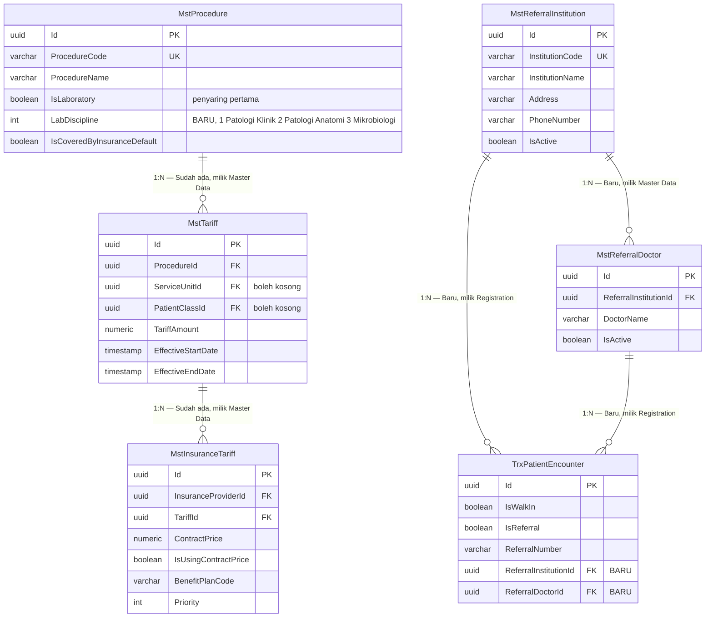

# ERD — Operasional Laboratorium (`BC-LAB`)

| Field | Value |
|---|---|
| Blueprint ID | `LAB-BP-001` |
| Bounded context | `BC-LAB` Operasional Laboratorium |
| Revision | `2` |
| Status | `draft` |
| Backend SHA | `c87d9c0` |

Kolom audit warisan `IdentityModel` tidak digambar pada ERD ini. Penjelasannya ada di
`data-dictionary.md`.

---

## 1. Pesanan, wadah, dan pemeriksaan

### Perubahan makna yang harus dibaca dengan teliti

| Sebelum `LAB-DEC-024` | Sesudah |
|---|---|
| `TrxLabSpecimen` membawa `ProcedureId` dan salinan tarif | Keduanya pindah ke `LabExamination` |
| Satu barcode = satu pemeriksaan | Satu barcode = satu wadah nyata, yang dapat menopang beberapa pemeriksaan |
| Menolak satu baris = menolak satu pemeriksaan | Menolak satu wadah = menggugurkan seluruh pemeriksaan di atasnya |
| Baris tagihan menunjuk identitas sampel | Baris tagihan menunjuk identitas pemeriksaan |

---

## 2. Batas nilai dan persetujuan klinis

### Aturan kunci pada kelompok ini

| Aturan | Wujudnya |
|---|---|
| Satu pemeriksaan boleh punya beberapa baris batas | Unik pada `ProcedureId` + `GenderScope` + `AgeCategoryId` |
| Satu baris punya tepat satu bentuk hasil | `ResultForm` menentukan kolom mana yang wajib terisi |
| Bentuk angka wajib bersatuan | `Unit` wajib bila `ResultForm` bernilai angka |
| Bentuk pilihan wajib punya daftar pilihan | Sekurang-kurangnya satu `MstLabValueOption` |
| Batas kritis tidak dapat diubah langsung | Perubahan ditulis ke `LabValueBoundChangeRequest` lebih dulu |
| Seluruh perubahan berriwayat | Satu baris `LabValueBoundHistory` per kolom yang berubah |

---

## 2b. Lapis rujukan — data milik modul lain

Laboratorium **membaca** ketiga kelompok di bawah dan **tidak menulis** ke satu pun.
Digambarkan di sini agar implementer melihat bentuk yang dipakainya.

### Bagaimana ketiganya dipakai bersama

Saat petugas membuka layar pemesanan, satu baris katalog dirakit dari tiga sumber:

| Yang tampil di layar | Dari |
|---|---|
| Nama pemeriksaan dan disiplinnya | `MstProcedure` |
| Harga satuan | `MstTariff` yang berlaku pada tanggal kejadian, menurut unit dan kelas pasien |
| Tercakup penjamin atau tidak | Ada tidaknya baris `MstInsuranceTariff` untuk penjamin pasien |

**Contoh perakitan:**

> Pasien Andi berpenjamin BPJS, dilayani di unit laboratorium, kelas pasien umum.
>
> | Pemeriksaan | Disiplin | Harga rumah sakit | Kontrak BPJS | Yang tampil |
> |---|---|---|---|---|
> | Hemoglobin | Patologi Klinik | Rp50.000 | Ada, Rp42.000 | Rp50.000, **tercakup** |
> | Kultur darah | Mikrobiologi | Rp350.000 | Tidak ada | Rp350.000, **tidak tercakup** |
>
> Kultur darah **tetap boleh** dipesan. Keterangan tidak tercakup muncul agar pasien tahu
> sebelum pemeriksaan dikerjakan. Keputusan tagihannya tetap milik Billing.

### Batas yang tegas

| Yang boleh | Yang dilarang |
|---|---|
| Membaca ketiganya | Menulis ke salah satunya |
| Menyalin harga saat kejadian ke baris pemeriksaan | Menyimpan keputusan cakupan sebagai kebenaran |
| Menampilkan total sebagai perkiraan biaya | Membentuk tagihan |

---

## 3. Contoh isi yang menjelaskan bentuknya

**Hemoglobin — bentuk angka, tiga baris batas:**

| `ProcedureId` | `GenderScope` | `AgeCategoryId` | `Unit` | Normal | Kritis |
|---|---|---|---|---|---|
| Hemoglobin | Pria | Dewasa | g/dL | 13,0 – 17,0 | < 7,0 atau > 20,0 |
| Hemoglobin | Wanita | Dewasa | g/dL | 12,0 – 15,0 | < 7,0 atau > 20,0 |
| Hemoglobin | Semua | Anak | g/dL | 11,0 – 14,0 | < 6,0 atau > 18,0 |

**Protein urin — bentuk pilihan, satu baris batas dengan lima pilihan:**

| `OptionCode` | `OptionName` | `IsOutOfReference` | `IsCritical` |
|---|---|:---:|:---:|
| `NEG` | Negatif | Tidak | Tidak |
| `P1` | +1 | Ya | Tidak |
| `P2` | +2 | Ya | Tidak |
| `P3` | +3 | Ya | **Ya** |
| `P4` | +4 | Ya | **Ya** |

**Satu wadah menopang dua pemeriksaan:**

| Wadah | Barcode | Pemeriksaan yang ditopang | Harga |
|---|---|---|---|
| Tabung serum | `LSP-a1b2…` | Fungsi hati | Rp150.000 |
| Tabung serum yang sama | `LSP-a1b2…` | Fungsi ginjal | Rp120.000 |

Satu barcode, satu keputusan kelayakan, dua baris tagihan.
